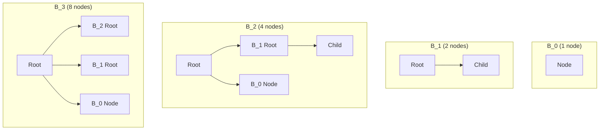
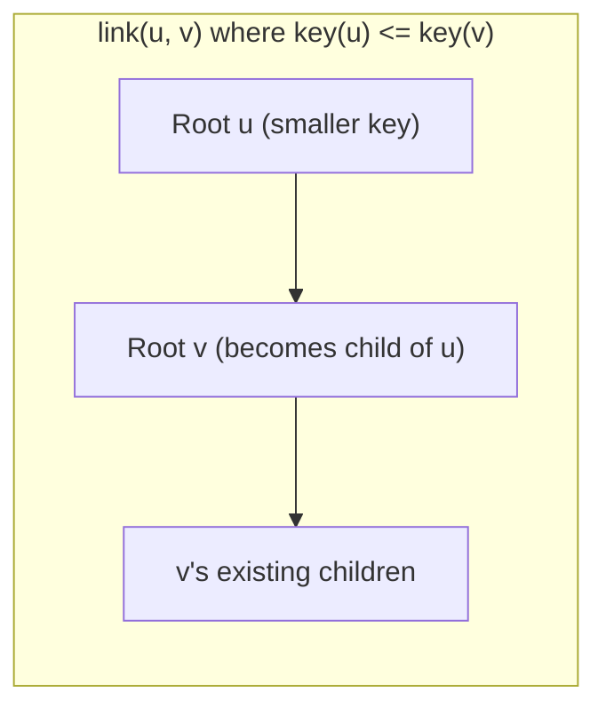
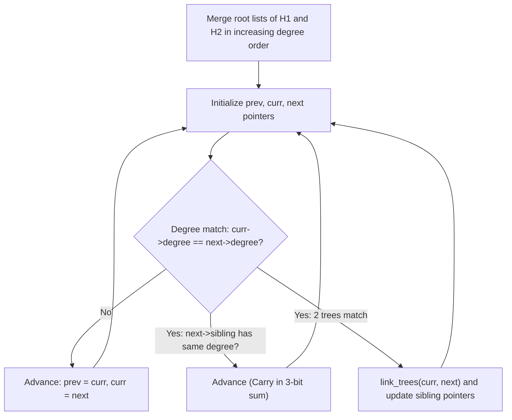

# Binomial Heaps

> [!NOTE]
> **The Binary Adder of Priority Queues:**
> While standard binary heaps require $O(n)$ time to merge two heaps of size $n$, the **Binomial Heap** (introduced by Jean Vuillemin in 1978) supports merging in worst-case $O(\log n)$ time.
> It achieves this by maintaining a forest of **binomial trees**, strictly mirroring the bit representation of the integer $n$ in base 2:
> - If $n = 13 = (1101)_2$, the heap contains exactly three trees of orders $B_3$ ($8$ nodes), $B_2$ ($4$ nodes), and $B_0$ ($1$ node).
> - Merging two binomial heaps is mathematically isomorphic to adding two binary numbers with carry propagation.

> [!TIP]
> **The Inductive Construction of Binomial Tree $B_k$:**
> A binomial tree of order $k$ ($B_k$) is formed by linking two trees of order $k-1$ ($B_{k-1}$):
> The root with the larger key becomes the leftmost child of the root with the smaller key.
> **Key Invariants of $B_k$:**
> 1. Total nodes $= 2^k$.
> 2. Tree height $= k$.
> 3. Root degree $= k$.
> 4. Number of nodes at depth $d$ is exactly the binomial coefficient $\binom{k}{d}$.

> [!WARNING]
> **Reversal Requirement During `extract_min`:**
> When the minimum root $x$ of order $B_k$ is extracted, its children are trees $B_{k-1}, B_{k-2}, \dots, B_0$ arranged in **decreasing order of degree**.
> Before merging these children back into the main root list, **their linked list must be reversed** so that degree orders are strictly increasing ($B_0, B_1, \dots, B_{k-1}$). Failing to reverse corrupts the two-pointer merge traversal.



---

## 1. Binomial Trees and Structural Invariants

A binomial heap is a collection of binomial trees that satisfy:
1. **Min-Heap Property:** For every node $x$, $\text{key}(x) \ge \text{key}(\text{parent}(x))$.
2. **Unique Degree Property:** For any non-negative integer $k$, there is at most **one** binomial tree in the heap whose root has degree $k$.

### Binary Representation Isomorphism:
Since a binomial tree of order $k$ contains exactly $2^k$ nodes, a binomial heap with $n$ elements contains a tree $B_k$ if and only if the $k$-th bit in the binary expansion of $n$ is $1$.
$$\text{Total Trees in Heap} \le \lfloor \log_2 n \rfloor + 1$$

---

## 2. Core Algorithmic Operations

### 2.1 The Fundamental Primitive: `link(b1, b2)`
Links two binomial trees $B_{k-1}$ of identical degree to form a single tree $B_k$ in $O(1)$ time:



```cpp
Node* link_trees(Node* u, Node* v) {
    if (u->key > v->key) std::swap(u, v);
    v->parent = u;
    v->sibling = u->child;
    u->child = v;
    u->degree++;
    return u;
}
```

---

### 2.2 Merging Two Heaps: `merge(H1, H2)`

Merging combines two heaps $H_1$ and $H_2$ in $O(\log n)$ time, mirroring binary addition:



1. **Merge Root Lists:** Merge the singly linked root lists of $H_1$ and $H_2$ into a single list sorted in monotonically increasing order of degrees (identical to the merge step of Merge Sort).
2. **Resolve Degree Collisions:** Walk the merged list maintaining pointers `prev`, `curr`, `next`:
   - If `curr->degree != next->degree`: Advance pointers.
   - If `next->sibling` exists and has the same degree (three trees of identical degree): Advance pointers (leave the carry for the next step).
   - If `curr->degree == next->degree`: Link the two trees using `link_trees`. The tree with the smaller root key remains in the root list.

---

### 2.3 Insertion: `insert(x)`
To insert key $x$:
1. Construct a new binomial heap $H'$ consisting of a single node $B_0(x)$.
2. Call `merge(H, H')`.
- **Worst-case Time:** $O(\log n)$ (occurs when $n = 2^k - 1$ and carry propagates through all bits).
- **Amortized Time:** $O(1)$ (analogous to incrementing a binary counter).

---

### 2.4 Extract Minimum: `extract_min()`
1. Scan the root list to find the root $x$ with minimum key ($O(\log n)$ steps).
2. Remove $x$ from the root list.
3. Collect the children of $x$. They form a sequence of binomial trees $B_{k-1}, B_{k-2}, \dots, B_0$.
4. **Reverse the list of children** to sort them in increasing degree order ($B_0, B_1, \dots, B_{k-1}$).
5. Create a temporary heap $H'$ from this reversed list.
6. Call `merge(H, H')`.
- **Total Time:** $O(\log n)$.

---

### 2.5 Decrease Key: `decrease_key(node, new_val)`
1. Set `node->key = new_val`.
2. While `node->parent` exists and `node->key < node->parent->key`:
   - Swap keys between `node` and `node->parent` (or swap satellite data).
   - `node = node->parent`.
- **Time Complexity:** $O(\text{height}) = O(\log n)$.

---

## 3. Comparative Complexity Matrix

| Operation | Binary Heap | Binomial Heap | Fibonacci Heap | Pairing Heap |
| :--- | :--- | :--- | :--- | :--- |
| **`find_min`** | $O(1)$ | $O(\log n)$ (or $O(1)$ cached) | $O(1)$ | $O(1)$ |
| **`insert`** | $O(\log n)$ ($O(1)$ amortized) | $O(\log n)$ ($O(1)$ amortized) | $O(1)$ | $O(1)$ |
| **`extract_min`** | $O(\log n)$ | $O(\log n)$ | $O(\log n)$ amortized | $O(\log n)$ amortized |
| **`merge`** | $\Theta(n)$ | $\mathbf{O(\log n)}$ **(worst-case)** | $O(1)$ | $O(1)$ |
| **`decrease_key`** | $O(\log n)$ | $O(\log n)$ | $O(1)$ amortized | $o(\log n)$ amortized |
| **Pointers per Node** | $0$ (Array-backed) | $3$ (`parent`, `child`, `sibling`) | $4$ | $3$ |

---

## 4. Common Pitfalls & Anti-Patterns

### Anti-Pattern 1: Forgetting to Reverse Children in `extract_min`
The children of root $B_k$ are stored in decreasing order: $B_{k-1} \to B_{k-2} \to \dots \to B_0$.
If passed to `merge` directly, the merge routine expects an ascending degree list and will produce an invalid heap with scrambled degrees.

### Anti-Pattern 2: Memory Leaks on Dangling Parent Pointers
When detaching children of the extracted minimum node, clear their `parent` pointers to `nullptr` before merging to prevent corrupted `decrease_key` traversals.

---

## 5. Curated References & Related Problems

1. **CLRS Chapter 19 (3rd Edition) / Chapter 20 (2nd Edition):** *Binomial Heaps*.
2. **Jean Vuillemin (1978):** *A Data Structure for Manipulating Priority Queues* (Communications of the ACM).
3. **LeetCode 23:** *Merge k Sorted Lists* (Demonstration of multi-way mergeable priority queue concept).
4. **HackerRank:** *Find the Running Median* (Priority queue maintenance).
