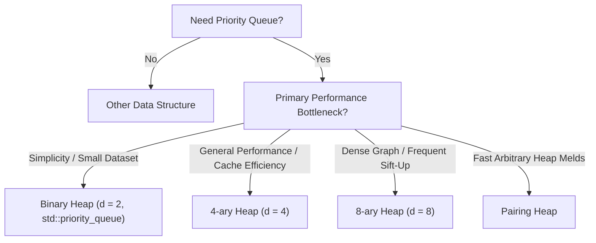

# d-ary Heaps

> [!NOTE]
> A d-ary heap generalizes the binary heap by allowing each node to have $d$ children instead of 2. It preserves the complete-tree shape and heap-order invariant, while changing the height and the cost balance between sift-up and sift-down.
>
> Reference implementations: [C++17 Implementation](../../implementations/cpp/d_ary_heap.cpp) | [Python Implementation](../../implementations/python/d_ary_heap.py)

> [!TIP]
> The key tradeoff is simple: larger $d$ makes the heap shallower, so upward movement becomes faster, but downward movement must inspect more children per level. Real performance depends on both asymptotics and hardware locality.

> [!WARNING]
> A larger branching factor does not automatically make a heap faster. It reduces height, but also increases the number of children scanned during sift-down. The best choice depends on hardware, key type, comparator cost, and workload mix.

> [!IMPORTANT]
> **Branching Factor & Heap Tradeoffs at a Glance:**
> - **Binary Heap ($d=2$)**: Simplest index arithmetic ($2i+1, 2i+2$), minimum comparisons per level on sift-down ($2$), but tallest tree depth ($\log_2 n$).
> - **4-ary Heap ($d=4$)**: Practical sweet spot; cuts height in half ($\log_4 n = 0.5 \log_2 n$), 4 keys fit tightly inside a single 64-byte L1 cache line.
> - **8-ary Heap ($d=8$)**: Strong for very large, memory-bound workloads or decrease-key-heavy algorithms (Dijkstra/Prim).
> - **Pairing Heap**: Flexible pointer-based heap family with outstanding empirical amortized performance for meld operations.
> - **Fibonacci Heap**: Asymptotically optimal ($O(1)$ amortized decrease-key), but heavy pointer overhead and poor cache locality make it slower in practice.

---

## 1. Why This Matters

A binary heap is already an excellent general-purpose priority queue.

But once systems engineers profile real workloads, an important question appears:

> Why should a heap have exactly 2 children per node?

There is nothing sacred about binary branching. If we increase the branching factor:
- the tree becomes significantly shorter
- `sift_up` traverses fewer levels
- `extract_min` traverses fewer levels
- but each downward step must compare more children

This creates a rich performance tradeoff.

That tradeoff matters in practice because priority queues are central to:
- Dijkstra’s shortest path algorithm
- Prim’s minimum spanning tree
- Discrete-event simulation engines
- Operating system task schedulers
- High-resolution timer wheels
- Database execution engines and in-memory sort-merge joins
- Graph search and route planning

On modern hardware, the right branching factor can matter more than the asymptotic headline alone.

A d-ary heap is therefore one of the best examples of:
- a mathematically simple generalization
- producing meaningful hardware-level performance differences

---

## 2. Core Intuition & Visual Model

A binary heap is a complete tree where each node has up to 2 children.

A d-ary heap generalizes this:
- each node has up to $d$ children
- the tree is still complete
- heap order still holds
- the array layout remains fully implicit (zero pointer overhead)

### Example: 4-ary Min-Heap ($d = 4$)

```text
                     2
         /       |       |       \
        5        7       9       11
      / | | \
     13 15 18 20
```

This structure satisfies the min-heap property because every parent is less than or equal to all of its children:
- $2 \le 5, 7, 9, 11$
- $5 \le 13, 15, 18, 20$

### Main Geometric Effect
Compared with a binary heap:
- more children per node ($d$ vs. $2$)
- substantially fewer total levels ($\log_d n$ vs. $\log_2 n$)
- shorter root-to-leaf paths

This asymmetry means:
- **Faster upward movement**: Rising from leaf to root takes fewer steps.
- **Wider downward movement**: Descending from root to leaf takes fewer levels, but requires finding the minimum among $d$ children at each level.

---

## 3. Theoretical Foundations & Generalization

### 3.1 Complete d-ary Tree Invariant

A d-ary heap satisfies the same shape invariant as a binary heap:
- Every level except possibly the last is completely filled with $d$ children per node.
- The last level is filled strictly from left to right without gaps.

This guarantees:
- Dense packing in a contiguous array
- Zero rebalancing rotations
- Zero node balance metadata
- Logarithmic height bounded strictly by $\lfloor \log_d n \rfloor$

---

### 3.2 Heap-Order Invariant

For a min-heap:
$$
A[\text{parent}(i)] \le A[i] \quad \forall i > 0
$$

For a max-heap:
$$
A[\text{parent}(i)] \ge A[i] \quad \forall i > 0
$$

This is identical in principle to the binary case; only the parent-child index arithmetic changes.

---

### 3.3 0-Based Index Arithmetic for Arbitrary Fanout $d$

In a 0-based contiguous array representation of a d-ary heap:

$$
\text{parent}(i) = \left\lfloor \frac{i - 1}{d} \right\rfloor
$$

The $k$-th child of node $i$, where $0 \le k < d$, is given by:

$$
\text{child}(i, k) = d \cdot i + k + 1
$$

The range of valid children for node $i$ is:

$$
[\,d \cdot i + 1, \; \min(d \cdot i + d, \; n - 1)\,]
$$

#### Example: 4-ary Heap ($d = 4$)
For any node $i$, its four children are:
$$
4i + 1, \quad 4i + 2, \quad 4i + 3, \quad 4i + 4
$$

If $i = 3$:
- Children are: $4(3) + 1 = 13$, $14$, $15$, $16$
- Parent is: $\lfloor (3 - 1) / 4 \rfloor = 0$

#### Why this is elegant
The array stores the complete logical tree shape implicitly. No pointers or wrapper nodes are required.

---

### 3.4 Height Bound

A complete d-ary tree of height $h$ contains:

$$
N(h) = 1 + d + d^2 + \dots + d^h = \frac{d^{h+1} - 1}{d - 1} \approx \Theta(d^h)
$$

Solving for height gives:

$$
h = \lfloor \log_d n \rfloor = \left\lfloor \frac{\ln n}{\ln d} \right\rfloor
$$

#### Height Comparison for $N = 1,000,000$ Elements:
- **Binary Heap ($d = 2$)**: $\lfloor \log_2(10^6) \rfloor \approx \mathbf{20\text{ levels}}$
- **4-ary Heap ($d = 4$)**: $\lfloor \log_4(10^6) \rfloor \approx \mathbf{10\text{ levels}}$ (50% reduction!)
- **8-ary Heap ($d = 8$)**: $\lfloor \log_8(10^6) \rfloor \approx \mathbf{7\text{ levels}}$ (65% reduction!)
- **16-ary Heap ($d = 16$)**: $\lfloor \log_{16}(10^6) \rfloor \approx \mathbf{5\text{ levels}}$ (75% reduction!)

---

## 4. Core Operation Tradeoffs

### 4.1 `sift_up` / Insertion

When inserting into a d-ary heap:
1. Append the new element to index $n$.
2. Compare the element with its parent at $\lfloor (i - 1) / d \rfloor$.
3. If heap order is violated, swap with the parent and repeat upward.

#### Complexity:
Each level requires exactly **1 comparison** and at most 1 swap. Because the tree has height $\log_d n$:

$$
\text{Comparisons}(\text{sift\_up}) \le \log_d n = \frac{\log_2 n}{\log_2 d} \implies \mathbf{O(\log_d n)}
$$

**Key Takeaway**: Increasing $d$ strictly accelerates `sift_up`. In a 4-ary heap, `sift_up` performs half as many comparisons as in a binary heap.

---

### 4.2 `sift_down` / Extract-Min

When removing the root:
1. Move the last array element $A[n-1]$ to the root $A[0]$.
2. At each level, inspect all active children of index $i$ (up to $d$ children) to identify the child with the highest priority.
3. If the parent violates heap order with that best child, swap downward and repeat.

#### Complexity:
Finding the best child among $d$ elements requires **$d - 1$ comparisons** per level. With $\log_d n$ levels:

$$
\text{Comparisons}(\text{sift\_down}) \le (d - 1) \log_d n = (d - 1) \frac{\log_2 n}{\log_2 d} \implies \mathbf{O(d \log_d n)}
$$

---

### 4.3 The Sweet-Spot Optimization

Notice the tension between upward and downward operations:
- Upward cost scales as $\frac{1}{\log_2 d}$ (monotonically decreasing with $d$).
- Downward cost scales as $\frac{d - 1}{\log_2 d}$:

| Branching Factor $d$ | Tree Height Ratio ($\frac{1}{\log_2 d}$) | Sift-Down Factor ($\frac{d - 1}{\log_2 d}$) | Sift-Down Relative Comparisons |
| :---: | :---: | :---: | :---: |
| **$d = 2$ (Binary)** | $1.00$ | $\frac{1}{1} = 1.00$ | Baseline ($1.00\times$) |
| **$d = 3$** | $0.63$ | $\frac{2}{1.58} = 1.26$ | $+26\%$ comparisons |
| **$d = 4$** | $0.50$ | $\frac{3}{2.00} = 1.50$ | $+50\%$ comparisons |
| **$d = 8$** | $0.33$ | $\frac{7}{3.00} = 2.33$ | $+133\%$ comparisons |
| **$d = 16$** | $0.25$ | $\frac{15}{4.00} = 3.75$ | $+275\%$ comparisons |

If CPU comparisons were the only metric, binary ($d=2$) would minimize sift-down comparisons. However, on physical hardware, **memory latency and CPU cache lines dominate execution time**.

---

## 5. Hardware Locality & Cache Line Alignment

```text
Binary Heap Sift-Down:
[Level 0] -------------> [Level 1] -------------> [Level 2] -------------> [Level 3]
 (Index 0)                (Index 1)                (Index 3)                (Index 7)
 Cache Miss!              Cache Miss!              Cache Miss!              Cache Miss!
 (4 levels traversed = 4 serialized DRAM cache misses)

4-ary Heap Sift-Down:
[Level 0] --------------------------------------> [Level 1: Indices 1, 2, 3, 4]
 (Index 0)                                         <--- Contiguous 32-Byte Block --->
 Cache Miss!                                       Cache Hit! (All 4 children in ONE line)
 (2 levels traversed = 2 serialized DRAM cache misses!)
```

### 5.1 Why Binary Heaps Become Memory-Bound
In a binary heap, sift-down jumps by powers of two ($i \to 2i+1 \to 4i+3 \to 8i+7$). When $n > 10^5$, every step accesses an entirely different 64-byte cache line and memory page. Traversing 20 levels incurs ~15–20 serialized L3 cache misses (~50–100 ns each).

### 5.2 Why $d = 4$ is the 64-Bit Sweet Spot
For 64-bit keys (8 bytes each):
- 4 children occupy $4 \times 8 = 32\text{ bytes}$.
- A standard CPU cache line is **64 bytes**.
- All 4 sibling children reside **within the exact same cache line**.

When the CPU fetches the first child, the hardware prefetcher loads the remaining 3 children into the L1 data cache simultaneously at zero extra memory cost. Scanning 4 children costs a few clock cycles in L1 cache, while avoiding an entire 100-cycle DRAM round-trip by halving the tree depth.

### 5.3 8-ary Heaps ($d = 8$)
For 64-bit primitive keys:
- 8 children occupy $8 \times 8 = 64\text{ bytes}$—exactly one full cache line.
- Tree depth shrinks by $67\%$.
- Ideal for very large datasets ($N > 10^7$) or systems where `decrease_key` / `sift_up` dominates.

### 5.4 SIMD Vectorization of Child Selection
Because the $d$ children are stored contiguously in memory, finding the minimum child can be vectorized using CPU SIMD instructions:
```cpp
// AVX2 SIMD min-finding for 4 64-bit integers
__m256i children = _mm256_loadu_si256(reinterpret_cast<const __m256i*>(&data_[first]));
// Compute minimum across 4 lanes in parallel without scalar branching!
```
This branchless execution eliminates CPU branch misprediction penalties during child selection.

---

## 6. Floyd-Style Linear-Time `build_heap` for d-ary Heaps

Floyd's bottom-up construction generalizes directly to arbitrary fanout $d$.

### 6.1 Last Non-Leaf Index
In a d-ary heap of size $n$, the last element is at index $n - 1$. Its parent is at index:

$$
\text{last\_internal} = \left\lfloor \frac{(n - 1) - 1}{d} \right\rfloor = \left\lfloor \frac{n - 2}{d} \right\rfloor
$$

All nodes from index $\lfloor (n - 2) / d \rfloor + 1$ to $n - 1$ are leaves.

```python
def build_heap(arr, d):
    n = len(arr)
    if n > 1:
        for i in range((n - 2) // d, -1, -1):
            sift_down(arr, i, n, d)
```

### 6.2 Complexity
Just as in binary heaps, the vast majority of nodes reside at or near the bottom level where sift-down depth is small ($h = 0, 1$). The summation:

$$
\sum_{h=0}^{\lfloor \log_d n \rfloor} \left\lceil \frac{n}{d^{h+1}} \right\rceil O(d \cdot h) = O(n)
$$

remains strictly **linear ($O(n)$)** for any fixed fanout $d$.

---

## 7. Production Systems Case Studies

### 7.1 Dijkstra's Shortest Path Algorithm

In Dijkstra's algorithm on a graph with $V$ vertices and $E$ edges:
- `extract_min` is called exactly $V$ times.
- `decrease_key` (or push of updated distances) is called up to $E$ times.

Using a d-ary heap:
$$
\text{Total Time} = O(V \cdot d \log_d V + E \log_d V)
$$

In dense graphs where $E \approx V^2$, setting $d = \lceil E / V \rceil$ balances the two terms, achieving an optimal runtime of:

$$
O(E \log_{E/V} V)
$$

For $E = \Theta(V^{1 + \epsilon})$, this yields $O(E)$ linear time! In practical routing and pathfinding engines (e.g., Open Source Routing Machine / OSRM, road network navigation), 4-ary and 8-ary heaps consistently outperform binary heaps by 15%–30%.

---

### 7.2 Database Sort-Merge and External Aggregation

In database engines (PostgreSQL, DuckDB, ClickHouse), executing a multi-way merge over $k$ sorted runs:
- If $k = 16$ or $k = 32$, storing the run heads in a 4-ary or 8-ary heap maximizes L1 cache residency while streaming gigabytes of data through DRAM.

---

## 8. Comparison: Binary vs. 4-ary vs. 8-ary vs. Pointer Heaps

| Structure | Tree Height ($N = 10^6$) | Sift-Up Cost | Sift-Down Comparisons | Cache Line Efficiency | Memory Overhead |
| :--- | :---: | :---: | :---: | :---: | :---: |
| **Binary Heap ($d=2$)** | 20 levels | $20$ comps | $40$ comps | Poor (strided misses) | **Zero (Contiguous)** |
| **4-ary Heap ($d=4$)** | 10 levels | **10 comps** | $30$ comps | **Optimal (32B block)** | **Zero (Contiguous)** |
| **8-ary Heap ($d=8$)** | 7 levels | **7 comps** | $49$ comps | **Optimal (64B line)** | **Zero (Contiguous)** |
| **Pairing Heap** | Variable | $O(1)$ amortized | $O(\log n)$ amortized | Poor (pointer chasing) | High (3 pointers/node) |
| **Fibonacci Heap** | Variable | $O(1)$ amortized | $O(\log n)$ amortized | Catastrophic | High (4 pointers + metadata) |

---

## 9. Decision Framework



### Engineering Guidelines:
1. **Default Choice**: Use a **4-ary heap ($d = 4$)**. It provides a nearly universal 10%–25% speedup over binary heaps on 64-bit architectures with zero extra memory overhead.
2. **Dense Graphs ($E \gg V$)**: Use an **8-ary heap ($d = 8$)**. The $3\times$ reduction in sift-up depth pays massive dividends on frequent distance relaxations.
3. **Expensive Comparators (e.g., Complex String Comparisons)**: Stick with a **Binary heap ($d = 2$)**. When each comparison costs hundreds of clock cycles, minimizing the total number of comparisons per level outweighs cache effects.

---

## 10. Canonical Implementations

Complete, tested implementations are available in the repository:
- **C++17 Reference**: [`implementations/cpp/d_ary_heap.cpp`](../../implementations/cpp/d_ary_heap.cpp)
- **Python Reference**: [`implementations/python/d_ary_heap.py`](../../implementations/python/d_ary_heap.py)

### C++17 Production-Grade Reference

```cpp
#include <vector>
#include <functional>
#include <stdexcept>
#include <utility>
#include <algorithm>

template <typename T, std::size_t D = 4, typename Compare = std::less<T>>
class DAryHeap {
    static_assert(D >= 2, "Fanout D must be at least 2");

private:
    std::vector<T> data_;
    Compare comp_;

    static inline std::size_t parent(std::size_t i) noexcept { return (i - 1) / D; }
    static inline std::size_t first_child(std::size_t i) noexcept { return D * i + 1; }

    void sift_up(std::size_t i) {
        while (i > 0) {
            std::size_t p = parent(i);
            if (comp_(data_[i], data_[p])) {
                std::swap(data_[i], data_[p]);
                i = p;
            } else {
                break;
            }
        }
    }

    void sift_down(std::size_t i, std::size_t n) {
        while (true) {
            std::size_t best = i;
            std::size_t first = first_child(i);
            if (first >= n) break;

            std::size_t last = std::min(first + D, n);
            for (std::size_t c = first; c < last; ++c) {
                if (comp_(data_[c], data_[best])) {
                    best = c;
                }
            }

            if (best != i) {
                std::swap(data_[i], data_[best]);
                i = best;
            } else {
                break;
            }
        }
    }

public:
    explicit DAryHeap(Compare comp = Compare{}) : comp_(comp) {}

    explicit DAryHeap(std::vector<T> elements, Compare comp = Compare{})
        : data_(std::move(elements)), comp_(comp) {
        if (data_.size() > 1) {
            for (std::size_t i = (data_.size() - 2) / D + 1; i > 0; --i) {
                sift_down(i - 1, data_.size());
            }
        }
    }

    [[nodiscard]] bool empty() const noexcept { return data_.empty(); }
    [[nodiscard]] std::size_t size() const noexcept { return data_.size(); }

    const T& top() const {
        if (data_.empty()) throw std::underflow_error("Heap is empty");
        return data_[0];
    }

    void push(const T& val) {
        data_.push_back(val);
        sift_up(data_.size() - 1);
    }

    T pop() {
        if (data_.empty()) throw std::underflow_error("Heap is empty");
        T top_val = std::move(data_[0]);
        data_[0] = std::move(data_.back());
        data_.pop_back();
        if (!data_.empty()) {
            sift_down(0, data_.size());
        }
        return top_val;
    }
};
```

---

## 11. Curated Problems & Further Reading

### Curated Practice Problems
1. **Dijkstra Benchmark Experiment** *(Graph Theory / Performance)*
   - Benchmark single-source shortest path on a dense graph ($V = 10^4, E = 10^6$) comparing a binary heap ($d=2$) against a 4-ary heap ($d=4$) and 8-ary heap ($d=8$).
2. **LeetCode 23 — Merge k Sorted Lists via d-ary Heap** *(Hard)*
   - Replace the default binary priority queue with a 4-ary heap to evaluate multi-way merge cache performance.
3. **SIMD Min-Child Kernel** *(Systems / Vectorization)*
   - Implement an explicit AVX2 `_mm256_min_epi32` child scan for an 8-ary heap on 32-bit integer priorities.

### Internal Encyclopedia Links
- [`binary-heaps.md`](binary-heaps.md) — Foundational complete binary tree priority queue
- [`cpu-cache-and-memory.md`](../03-machine-model-and-performance/cpu-cache-and-memory.md) — Cache lines, stride prefetching, and memory stalls
- [`theoretical-vs-practical-performance.md`](../22-benchmarking-and-tradeoffs/theoretical-vs-practical-performance.md) — Why asymptotic Big-O differs from wall-clock latency
- [`choosing-the-right-data-structure.md`](../22-benchmarking-and-tradeoffs/choosing-the-right-data-structure.md) — Architecture decision matrix across hardware hierarchies
