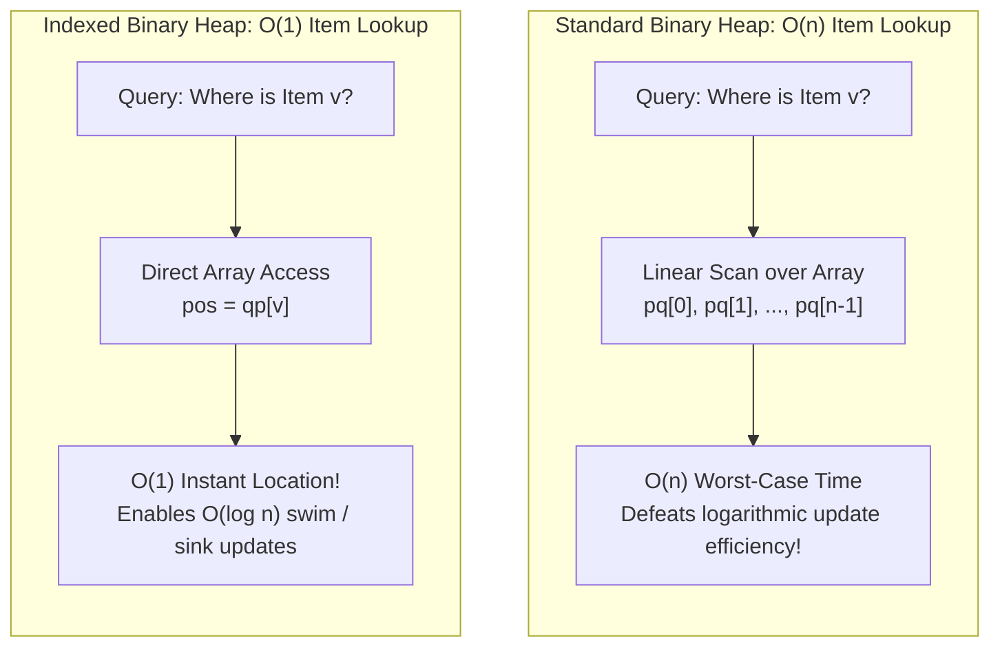
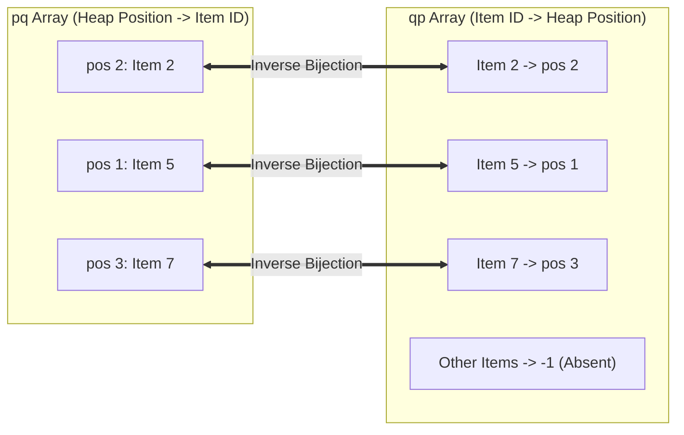
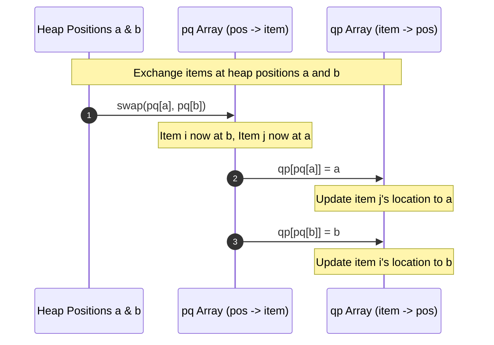
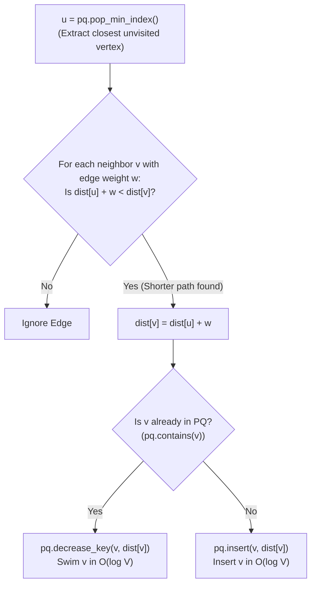

# Indexed Priority Queues

> [!NOTE]
> **Indexed Priority Queues (IPQ)** eliminate the primary computational bottleneck of standard binary heaps: the inability to locate arbitrary items without an $O(n)$ linear scan.
> By augmenting a binary heap with a parallel inverse-mapping array (`qp`), an IPQ provides:
> - **$O(1)$ Item Lookup:** Instant location of an item's current position in the heap array.
> - **$O(\log n)$ Mutable Priorities:** Direct, in-place `decrease_key`, `increase_key`, `change_key`, and arbitrary `erase`.
> - **Zero Stale Overhead:** Guarantees exactly at most one live entry per tracked item (unlike lazy duplicate push heaps which inflate memory to $O(E)$).
>
> Reference implementations: [C++17 Implementation](../../implementations/cpp/indexed_priority_queue.cpp) | [Python Implementation](../../implementations/python/indexed_priority_queue.py)

> [!TIP]
> **The Parallel Indexing Architecture & Invariant Checklist:**
>
> | Array | Index Semantics | Value Stored | Key Relationship | Absence Marker |
> |---|---|---|---|---|
> | `pq[pos]` | 1-based Heap Position ($1 \dots n$) | Item ID ($i$) | `pq[qp[i]] == i` | `-1` |
> | `qp[i]` | Item ID ($0 \dots N-1$) | 1-based Heap Position ($	ext{pos}$) | `qp[pq[pos]] == pos` | `-1` |
> | `keys[i]` | Item ID ($0 \dots N-1$) | Current Priority Key | Compared via `keys[pq[pos]]` | `null` / `None` |
>
> **The Four Cardinal Invariants to Enforce:**
> 1. **Bijection Invariant:** $qp[pq[pos]] = pos$ for all $1 \le pos \le n$.
> 2. **Identity Invariant:** $pq[qp[i]] = i$ for all active items $i$.
> 3. **Absence Invariant:** $qp[i] = -1$ if and only if item $i$ is not currently in the queue.
> 4. **Heap Order Invariant:** $keys[pq[pos]] \le keys[pq[2 \cdot pos]]$ and $keys[pq[pos]] \le keys[pq[2 \cdot pos + 1]]$.

> [!WARNING]
> **Critical Engineering Pitfalls:**
> 1. **The Double-Swap Mandate:** When exchanging heap nodes at positions $a$ and $b$, you MUST swap entries in `pq` AND immediately update both inverse entries in `qp`. Swapping only `pq` instantly corrupts the data structure:
>    ```cpp
>    std::swap(pq[a], pq[b]);
>    qp[pq[a]] = a;
>    qp[pq[b]] = b;
>    ```
> 2. **Key Storage Location:** Never compare `keys[pos]`. Heap positions are transient; item identities are permanent. Comparisons must always be performed through the indirection: `keys[pq[a]] < keys[pq[b]]`.
> 3. **Strict Monotonicity Contracts:** `decrease_key(i, k)` requires $k < keys[i]$ (triggering `swim`), whereas `increase_key(i, k)` requires $k > keys[i]$ (triggering `sink`). If the direction of key adjustment is not guaranteed ahead of time, always call `change_key(i, k)`.

A standard binary heap is excellent for operations like:

- insert
- get minimum or maximum
- extract minimum or maximum

But it has a major limitation:

> given an arbitrary item, a standard heap does not support fast access to its heap position

That means operations like:

- decrease-key
- increase-key
- delete a specific item
- update the priority of a known item

are awkward or slow unless we add extra structure.

This motivates the **indexed priority queue**.

An indexed priority queue augments a heap with parallel indexing arrays so that we can locate any tracked item in:

$$
O(1)
$$

time and then restore heap order in:

$$
O(\log n)
$$

time.

This makes it especially useful for algorithms such as:

- Dijkstra's shortest path
- Prim's minimum spanning tree
- event and task schedulers
- simulation systems
- any priority-driven algorithm with frequent key updates

This chapter develops:

- why ordinary heaps are insufficient for indexed updates
- the `pq`, `qp`, and `keys` indexing model
- swim and sink with parallel index maintenance
- $ O(\log n) $ decrease-key, increase-key, and delete
- applications to graph algorithms
- trade-offs versus lazy heaps, pairing heaps, and Fibonacci heaps

---

## 1. The limitation of a standard heap




A binary heap stores elements in an array so that:

- the heap order property is maintained
- the root gives fast access to the minimum or maximum

This is excellent for:

- `push`
- `pop`
- `top`

But suppose we want to do this operation:

> decrease the priority of item `v`

A plain heap does not know where `v` is stored.

So unless we scan the heap array linearly, we cannot directly update that item.

That scan costs:

$$
O(n)
$$

which defeats the point of using a heap in many algorithms.

---

## 2. Why this matters in algorithms

Some important algorithms repeatedly improve priorities of known items.

### Dijkstra
When we find a shorter path to vertex $ v $, we want to decrease its tentative distance.

### Prim
When a cheaper connecting edge to vertex $ v $ is found, we want to decrease its key.

### Schedulers
When a job's urgency changes, we want to update that job's priority directly.

In these settings, fast update-by-identity is essential.

---

## 3. Lazy deletion versus direct indexed updates

A common workaround is **lazy insertion**:

- instead of decreasing a key in place, push a new copy with the better priority
- when extracting, ignore stale entries

This works and is often practical.

But it has costs:

- extra memory
- duplicate heap entries
- stale data handling
- more heap operations

An indexed priority queue solves the update directly instead.

---

## 4. Core idea of an indexed priority queue

The core question is:

> How can we know where each item currently lives inside the heap array?

The answer is to maintain a two-way mapping between:

- heap positions
- item indices

This gives direct access to an item's heap location.

Then updating its key becomes easy.

---

## 5. The standard array model

A common indexed min-priority-queue design uses three arrays:

- `pq`
- `qp`
- `keys`

### `pq[pos]`
The item index stored at heap position `pos`.

### `qp[i]`
The heap position where item `i` currently lives.

If item `i` is not in the heap, `qp[i] = -1`.

### `keys[i]`
The current priority value associated with item `i`.

This is the classical representation.

---

## 6. The inverse mapping relationship




The arrays `pq` and `qp` are inverses of each other on active items.

That means:

$$
qp[pq[pos]] = pos
$$

and for active item $ i $:

$$
pq[qp[i]] = i
$$

This inverse relationship is the heart of the data structure.

Whenever heap elements swap positions, both arrays must be updated consistently.

---

## 7. Why parallel indexing solves the problem

Suppose we want to decrease the key of item $ i $.

With `qp[i]`, we immediately know its heap position.

So we can:

1. update `keys[i]`
2. find its heap position using `qp[i]`
3. perform `swim` or `sink` from that position

The update now costs:

$$
O(\log n)
$$

instead of $ O(n) $.

---

## 8. Min-heap convention

In this chapter, we focus on an **indexed min-priority queue**.

That means:

- the smallest key has highest priority
- the root stores the minimum-key item

All operations can be mirrored for a max-priority queue by reversing comparisons.

---

## 9. Heap order in terms of item keys

The heap array stores item indices, not the keys directly.

So heap comparisons use:

$$
keys[pq[parent]] \le keys[pq[child]]
$$

In other words, heap order is defined through the key values of the indexed items.

This is an important conceptual point.

---

## 10. Basic operations supported

A typical indexed priority queue supports:

- `contains(i)`
- `insert(i, key)`
- `peek_min_index()`
- `peek_min_key()`
- `pop_min_index()`
- `decrease_key(i, new_key)`
- `increase_key(i, new_key)`
- `change_key(i, new_key)`
- `erase(i)`

Most of these run in:

$$
O(\log n)
$$

time, while lookup by index is:

$$
O(1)
$$

---

## 11. Swapping heap positions correctly




In a normal heap, swapping two heap positions is simple.

In an indexed heap, swapping positions `a` and `b` must also update the inverse map.

So if:

- `i = pq[a]`
- `j = pq[b]`

then after swapping:

- `pq[a] = j`
- `pq[b] = i`
- `qp[i] = b`
- `qp[j] = a`

This bookkeeping is absolutely essential.

---

## 12. C++17 indexed min-priority queue skeleton

```cpp
#include <vector>
#include <stdexcept>
#include <utility>
#include <algorithm>

template <typename Key>
class IndexedMinPQ {
public:
    explicit IndexedMinPQ(int max_n)
        : n_(0), pq_(max_n + 1, -1), qp_(max_n, -1), keys_(max_n) {}

    bool empty() const { return n_ == 0; }
    int size() const { return n_; }

    bool contains(int i) const {
        validate_index(i);
        return qp_[i] != -1;
    }

private:
    int n_;
    std::vector<int> pq_;   // heap position -> item index, 1-based heap
    std::vector<int> qp_;   // item index -> heap position, -1 if absent
    std::vector<Key> keys_;

    void validate_index(int i) const {
        if (i < 0 || i >= static_cast<int>(qp_.size())) {
            throw std::out_of_range("index out of range");
        }
    }

    bool greater_pos(int a, int b) const {
        return keys_[pq_[a]] > keys_[pq_[b]];
    }

    void exch(int a, int b) {
        std::swap(pq_[a], pq_[b]);
        qp_[pq_[a]] = a;
        qp_[pq_[b]] = b;
    }

    void swim(int k) {
        while (k > 1 && greater_pos(k / 2, k)) {
            exch(k, k / 2);
            k /= 2;
        }
    }

    void sink(int k) {
        while (2 * k <= n_) {
            int j = 2 * k;
            if (j < n_ && greater_pos(j, j + 1)) ++j;
            if (!greater_pos(k, j)) break;
            exch(k, j);
            k = j;
        }
    }
};
```

---

## 13. Python indexed min-priority queue skeleton

```python
class IndexedMinPQ:
    def __init__(self, max_n):
        self.n = 0
        self.pq = [-1] * (max_n + 1)   # 1-based heap: position -> item index
        self.qp = [-1] * max_n         # item index -> heap position
        self.keys = [None] * max_n

    def contains(self, i):
        return self.qp[i] != -1

    def empty(self):
        return self.n == 0

    def size(self):
        return self.n

    def _greater_pos(self, a, b):
        return self.keys[self.pq[a]] > self.keys[self.pq[b]]

    def _exch(self, a, b):
        self.pq[a], self.pq[b] = self.pq[b], self.pq[a]
        self.qp[self.pq[a]] = a
        self.qp[self.pq[b]] = b

    def _swim(self, k):
        while k > 1 and self._greater_pos(k // 2, k):
            self._exch(k, k // 2)
            k //= 2

    def _sink(self, k):
        while 2 * k <= self.n:
            j = 2 * k
            if j < self.n and self._greater_pos(j, j + 1):
                j += 1
            if not self._greater_pos(k, j):
                break
            self._exch(k, j)
            k = j
```

---

## 14. Insert operation

To insert item $ i $ with key $ key $:

1. ensure item $ i $ is not already present
2. increase heap size
3. place $ i $ at the new last heap position
4. record both maps
5. store its key
6. `swim` it upward if needed

This is analogous to ordinary heap insertion, but with inverse-map maintenance.

---

## 15. C++17 insert and peek operations

```cpp
public:
    void insert(int i, const Key& key) {
        validate_index(i);
        if (contains(i)) {
            throw std::invalid_argument("index already present");
        }

        ++n_;
        qp_[i] = n_;
        pq_[n_] = i;
        keys_[i] = key;
        swim(n_);
    }

    int min_index() const {
        if (n_ == 0) throw std::underflow_error("priority queue underflow");
        return pq_[1];
    }

    const Key& min_key() const {
        if (n_ == 0) throw std::underflow_error("priority queue underflow");
        return keys_[pq_[1]];
    }
```

---

## 16. Python insert and peek operations

```python
    def insert(self, i, key):
        if self.contains(i):
            raise ValueError("index already present")

        self.n += 1
        self.qp[i] = self.n
        self.pq[self.n] = i
        self.keys[i] = key
        self._swim(self.n)

    def min_index(self):
        if self.n == 0:
            raise IndexError("priority queue underflow")
        return self.pq[1]

    def min_key(self):
        if self.n == 0:
            raise IndexError("priority queue underflow")
        return self.keys[self.pq[1]]
```

---

## 17. Extract-min operation

To remove the minimum item:

1. read the root item index
2. swap root with the last heap element
3. decrease heap size
4. `sink` the new root downward
5. clear the removed item's inverse position
6. return the removed item

This is the standard heap delete-root operation, plus map cleanup.

---

## 18. C++17 extract-min

```cpp
public:
    int pop_min_index() {
        if (n_ == 0) throw std::underflow_error("priority queue underflow");

        int min_item = pq_[1];
        exch(1, n_);
        --n_;
        sink(1);

        qp_[min_item] = -1;
        pq_[n_ + 1] = -1;
        return min_item;
    }
```

---

## 19. Python extract-min

```python
    def pop_min_index(self):
        if self.n == 0:
            raise IndexError("priority queue underflow")

        min_item = self.pq[1]
        self._exch(1, self.n)
        self.n -= 1
        self._sink(1)

        self.qp[min_item] = -1
        self.pq[self.n + 1] = -1
        return min_item
```

---

## 20. Decrease-key and increase-key

This is where the data structure really becomes powerful.

### Decrease-key
If item $ i $'s key gets smaller, it may need to move upward in the heap.
So:

- update `keys[i]`
- `swim(qp[i])`

### Increase-key
If item $ i $'s key gets larger, it may need to move downward.
So:

- update `keys[i]`
- `sink(qp[i])`

These both run in:

$$
O(\log n)
$$

time.

---

## 21. C++17 key update operations

```cpp
public:
    void decrease_key(int i, const Key& key) {
        validate_index(i);
        if (!contains(i)) throw std::invalid_argument("index not present");
        if (!(key < keys_[i])) throw std::invalid_argument("new key is not smaller");

        keys_[i] = key;
        swim(qp_[i]);
    }

    void increase_key(int i, const Key& key) {
        validate_index(i);
        if (!contains(i)) throw std::invalid_argument("index not present");
        if (!(keys_[i] < key)) throw std::invalid_argument("new key is not larger");

        keys_[i] = key;
        sink(qp_[i]);
    }

    void change_key(int i, const Key& key) {
        validate_index(i);
        if (!contains(i)) throw std::invalid_argument("index not present");

        Key old = keys_[i];
        keys_[i] = key;

        if (key < old) swim(qp_[i]);
        else if (old < key) sink(qp_[i]);
    }
```

---

## 22. Python key update operations

```python
    def decrease_key(self, i, key):
        if not self.contains(i):
            raise ValueError("index not present")
        if not (key < self.keys[i]):
            raise ValueError("new key is not smaller")

        self.keys[i] = key
        self._swim(self.qp[i])

    def increase_key(self, i, key):
        if not self.contains(i):
            raise ValueError("index not present")
        if not (self.keys[i] < key):
            raise ValueError("new key is not larger")

        self.keys[i] = key
        self._sink(self.qp[i])

    def change_key(self, i, key):
        if not self.contains(i):
            raise ValueError("index not present")

        old = self.keys[i]
        self.keys[i] = key

        if key < old:
            self._swim(self.qp[i])
        elif old < key:
            self._sink(self.qp[i])
```

---

## 23. Delete arbitrary item

Deleting a specific indexed item $ i $ is also efficient.

Algorithm:

1. locate its heap position using `qp[i]`
2. swap it with the last heap position
3. reduce heap size
4. restore heap order from that position using both `swim` and `sink` if needed
5. clear mappings

This is much stronger than what a plain heap usually offers.

---

## 24. C++17 erase operation

```cpp
public:
    void erase(int i) {
        validate_index(i);
        if (!contains(i)) throw std::invalid_argument("index not present");

        int pos = qp_[i];
        exch(pos, n_);
        --n_;

        if (pos <= n_) {
            swim(pos);
            sink(pos);
        }

        qp_[i] = -1;
        pq_[n_ + 1] = -1;
    }
```

---

## 25. Python erase operation

```python
    def erase(self, i):
        if not self.contains(i):
            raise ValueError("index not present")

        pos = self.qp[i]
        self._exch(pos, self.n)
        self.n -= 1

        if pos <= self.n:
            self._swim(pos)
            self._sink(pos)

        self.qp[i] = -1
        self.pq[self.n + 1] = -1
```

---

## 26. Complexity summary of indexed PQ operations

For $ n $ active items:

- `contains(i)`: $ O(1) $
- `insert(i, key)`: $ O(\log n) $
- `min_index()`: $ O(1) $
- `min_key()`: $ O(1) $
- `pop_min_index()`: $ O(\log n) $
- `decrease_key(i, key)`: $ O(\log n) $
- `increase_key(i, key)`: $ O(\log n) $
- `change_key(i, key)`: $ O(\log n) $
- `erase(i)`: $ O(\log n) $

This is exactly why indexed heaps are so useful.

---

## 27. Application to Dijkstra's algorithm




Dijkstra's algorithm repeatedly maintains tentative distances to vertices.

When a shorter path to vertex $ v $ is found, we must update its priority.

With an indexed min-priority queue:

- vertex index = item index
- tentative distance = key

Then:

- if a vertex is not present, insert it
- if a shorter distance is found, decrease its key

This gives a clean and efficient implementation.

---

## 28. Why indexed PQ fits Dijkstra well

The main repeated operation in Dijkstra is:

> improve the priority of a known vertex

That is exactly `decrease_key`.

So indexed PQ gives the data-structure operation that the algorithm naturally wants, rather than simulating it with duplicates.

This is the most classical application.

---

## 29. Python Dijkstra with indexed priority queue

```python
def dijkstra_indexed_pq(graph, source):
    # graph[u] = list of (v, weight)
    n = len(graph)
    INF = 10**18
    dist = [INF] * n
    dist[source] = 0

    pq = IndexedMinPQ(n)
    pq.insert(source, 0)

    while not pq.empty():
        u = pq.pop_min_index()
        du = dist[u]

        for v, w in graph[u]:
            nd = du + w
            if nd < dist[v]:
                dist[v] = nd
                if pq.contains(v):
                    pq.decrease_key(v, nd)
                else:
                    pq.insert(v, nd)

    return dist
```

---

## 30. Application to Prim's MST

Prim's algorithm grows a minimum spanning tree by always choosing the cheapest edge that connects a new vertex.

For each not-yet-chosen vertex $ v $, we keep:

- its best connecting edge cost so far

When that cost improves, we need `decrease_key(v, new_cost)`.

So Prim, like Dijkstra, is a perfect use case for an indexed min-priority queue.

---

## 31. C++17 Prim with indexed priority queue outline

```cpp
template <typename Weight>
std::vector<Weight> prim_keys_indexed_pq(
    const std::vector<std::vector<std::pair<int, Weight>>>& graph,
    int source = 0) {

    int n = static_cast<int>(graph.size());
    const Weight INF = std::numeric_limits<Weight>::max();

    std::vector<Weight> best(n, INF);
    std::vector<bool> used(n, false);

    IndexedMinPQ<Weight> pq(n);
    best[source] = 0;
    pq.insert(source, 0);

    while (!pq.empty()) {
        int u = pq.pop_min_index();
        used[u] = true;

        for (auto [v, w] : graph[u]) {
            if (!used[v] && w < best[v]) {
                best[v] = w;
                if (pq.contains(v)) pq.decrease_key(v, w);
                else pq.insert(v, w);
            }
        }
    }

    return best;
}
```

---

## 32. Task scheduling and event systems

Indexed priority queues are not only for graph algorithms.

They are also useful in systems where tasks have identities and changing priorities.

Examples:

- CPU job scheduling
- event simulation
- job queues with urgency updates
- game AI turn systems
- network packet prioritization with dynamic weights

The key feature in all these is:

> update priority by handle or identity

---

## 33. Handles, identities, and fixed index range

The classical indexed priority queue assumes items are identified by integer indices in a known range:

$$
0, 1, \dots, N-1
$$

This is ideal when the items are:

- graph vertices
- array-based job IDs
- compact integer handles

If your items are arbitrary objects, you often add a mapping layer:

- object → integer ID

Then use the indexed heap underneath.

---

## 34. Space overhead

An indexed heap uses more memory than a plain heap because it stores:

- heap positions
- inverse positions
- keys by item index

So memory is typically:

$$
O(N)
$$

for the maximum universe size, even if fewer items are active.

This is often acceptable for graph vertices, but it is a real trade-off.

---

## 35. Comparison with lazy heaps

### Lazy heap approach
- use a standard heap
- push updated entries again
- ignore stale entries later

### Indexed heap approach
- keep only one live entry per item
- update it directly

#### Lazy heap advantages
- simpler if the language has a built-in heap only
- easy to implement

#### Indexed heap advantages
- no stale duplicates
- direct updates and deletes
- cleaner asymptotic model for mutable priorities

Both approaches are important in practice.

---

## 36. Comparison with pairing and Fibonacci heaps

There are more advanced heap families that support very fast key updates.

### Pairing heaps
- often good practical performance
- pointer-based
- more complex than array heaps

### Fibonacci heaps
- famous theoretical bounds
- amortized $ O(1) $ decrease-key
- usually complex and large-constant in practice

### Indexed binary heaps
- simple
- cache-friendly
- predictable
- often the practical choice for moderate to large real workloads

So indexed binary heaps are frequently preferred even when more sophisticated heaps have stronger asymptotic decrease-key bounds.

---

## 37. Why flat array heaps are often practical winners

Array-based heaps have practical advantages:

- simple memory layout
- strong cache locality
- low constant factors
- easy debugging
- easy integration with index-based algorithms

This is a good example of how algorithm engineering matters.

The theoretically most advanced structure is not always the best production choice.

---

## 38. Common mistakes

### Mistake 1: forgetting to update both maps on swap
If `pq` changes but `qp` does not, the structure breaks immediately.

### Mistake 2: using the wrong heap position base
Be consistent about 1-based or 0-based heap indexing.

### Mistake 3: failing to clear `qp[i]` when removing an item
Then `contains(i)` may lie.

### Mistake 4: calling decrease-key with a larger key
That violates the operation's contract.

### Mistake 5: forgetting that keys are stored by item index, not heap position
Comparisons must use `keys[pq[pos]]`.

### Mistake 6: assuming arbitrary object keys work without an ID map
Classical indexed heaps require compact integer item identities.

---

## 39. Correctness intuition

The correctness of an indexed priority queue comes from two facts:

1. the heap-order property is maintained by `swim` and `sink`
2. the inverse-map property is maintained by consistent updates to `pq` and `qp`

If both are preserved after every operation, then:

- the root always identifies the minimum-key active item
- every active item can be found in constant time
- updates and deletions can restore heap order in logarithmic time

That is the entire logic of the structure.

---

## 40. Comparison table

| Structure | Find min | Insert | Decrease key | Delete known item | Notes |
|---|---:|---:|---:|---:|---|
| standard binary heap | $ O(1) $ | $ O(\log n) $ | not direct | not direct | simple, but weak for mutable priorities |
| lazy binary heap | $ O(1) $ | $ O(\log n) $ | simulated by duplicate push | lazy removal | practical workaround |
| indexed binary heap | $ O(1) $ | $ O(\log n) $ | $ O(\log n) $ | $ O(\log n) $ | direct indexed updates |
| Fibonacci heap | $ O(1) $ amortized | $ O(1) $ amortized | $ O(1) $ amortized | more complex | strong theory, less common in practice |

---

## 41. Worked mini-example

Suppose item priorities are:

```text
item 0 -> 8
item 1 -> 3
item 2 -> 5
```

After insertion, the heap root is item 1 because its key is smallest.

If item 0 decreases from 8 to 2, then:

- update `keys[0] = 2`
- use `qp[0]` to find its heap position
- `swim` it upward

Now item 0 becomes the root.

This shows exactly why direct position lookup matters.

---

## 42. Summary

An indexed priority queue augments a heap with inverse indexing so that items can be updated and deleted by identity.

The key structures are:

- `pq`: heap position → item index
- `qp`: item index → heap position
- `keys`: item index → priority value

This allows:

- direct access to any item's heap position in $ O(1) $
- heap restoration by `swim` or `sink` in $ O(\log n) $

Indexed priority queues are especially valuable for:

- Dijkstra's algorithm
- Prim's algorithm
- mutable-priority schedulers
- systems with handle-based updates

They are a strong practical middle ground between plain heaps and more complex advanced heap families.

---

## 43. Practice prompts

1. What limitation of a standard heap motivates indexed priority queues?
2. What do `pq` and `qp` represent?
3. Why must `pq` and `qp` remain inverses of each other?
4. Why does decrease-key need direct access to an item's heap position?
5. Why does a smaller key require `swim`, while a larger key requires `sink`?
6. How does indexed PQ improve Dijkstra's algorithm?
7. Why is Prim's algorithm also a natural fit for indexed PQ?
8. What is the difference between lazy duplicate heaps and indexed heaps?
9. Why are indexed binary heaps often preferred over Fibonacci heaps in practice?
10. What goes wrong if swap updates only `pq` but not `qp`?

---

## 44. Suggested next topics

A natural continuation after indexed priority queues is:

- streaming medians
- heap-based graph algorithm engineering
- union-find and MST comparisons
- order-statistics trees
- string matching and automata
