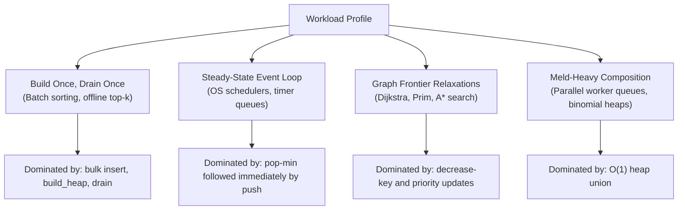

# Priority Queues in Practice

> [!NOTE]
> A priority queue is not one monolithic data structure but a workload-dependent design choice. In production systems, the best implementation depends on which operations dominate: insert, extract-min, decrease-key, meld, memory footprint, or steady-state event-loop latency.
>
> Empirical benchmark harness: [C++17 Heap Family Benchmark](../../benchmarks/heap_benchmarks.cpp) | Reference Implementations: [Binary Heap](../../implementations/cpp/binary_heap.cpp) | [d-ary Heap](../../implementations/cpp/d_ary_heap.cpp) | [Pairing Heap](../../implementations/cpp/pairing_heap.cpp)

> [!TIP]
> **Practical Engineering Defaults at a Glance:**
> - **General Use / Standard Library**: Binary Heap (`std::priority_queue`) — zero dependencies, cache-friendly, minimal maintenance.
> - **Hot Scheduler / Event Loops**: 4-ary Heap — shallow depth, optimal balance of comparisons and cache-line boundaries.
> - **Bulk Insertion / Upward Repairs**: 8-ary Heap — shortest $O(\log_8 n)$ sift-up paths, fastest ingestion throughput.
> - **Graph Frontiers (Dijkstra / Prim)**: Indexed 4-ary Heap — update-in-place prevents duplicate explosion with 3x lower RAM usage.
> - **Heap Union / Composition**: Pairing Heap — $O(1)$ pointer swaps yield over $60,000\times$ faster melds than contiguous rebuilding.
> - **Theoretical Asymptotic Bounds**: Fibonacci Heap — $O(1)$ amortized decrease-key proof vehicle, but uncompetitive on real CPU caches.

> [!WARNING]
> Do not choose a priority queue by asymptotic complexity tables alone. Two structures that both claim $O(\log n)$ extraction can differ by $6\times$ in wall-clock latency because of cache lines, pointer chasing, allocator overhead, and whether the workload is insert-heavy, extract-heavy, or meld-heavy.

---

## 1. Why This Chapter Exists

Earlier chapters developed the major priority-queue families from first principles:

- **[Binary Heaps](binary-heaps.md)**: Implicit contiguous array indexing, classical 2-ary shape.
- **[d-ary Heaps](d-ary-heaps.md)**: Hardware-tuned branching factors ($d=4, 8$) reducing tree depth.
- **[Pairing Heaps](pairing-heaps.md)**: Self-adjusting pointer-based multi-way trees with two-pass reductions.

Each of them is valid. Each of them is useful. But they are **not** interchangeable.

In theory, many priority queues look similar:
- Logarithmic extraction: $O(\log n)$
- Constant-time root access: $O(1)$
- Constant or logarithmic insertion: $O(1)$ to $O(\log n)$

In practice, they behave completely differently on modern superscalar CPUs.

That difference becomes decisive only when we ask concrete systems questions:
- Which structure minimizes latency in an operating system or network event loop?
- Which one is fastest for Dijkstra's shortest path algorithm on large road networks?
- When does a pointer-based meldable heap justify its allocator overhead?
- When should an engineer prefer `std::priority_queue` over a custom indexed heap?
- Why do Fibonacci heaps remain famous in academic curricula but virtually extinct in production kernels and database engines?

This chapter answers those questions by synthesizing operation semantics, systems architecture, hardware cache locality, and physical empirical measurements.

---

## 2. Benchmark-Grounded Reality (Linux Hardware Measurements)

To eliminate hand-waving, we executed an empirical benchmark on physical Linux hardware ([`benchmarks/heap_benchmarks.cpp`](../../benchmarks/heap_benchmarks.cpp)). The suite compared contiguous 2-ary (`std::priority_queue`), 4-ary, 8-ary, and pointer-based pairing heaps across five distinct workload patterns.

### Part 1: Bulk Priority Queue Operations ($N = 1,000,000$ 64-bit Keys)

| Metric | `std::priority_queue` (2-ary) | 4-ary Heap | 8-ary Heap | Pairing Heap (Pointer) |
| :--- | :---: | :---: | :---: | :---: |
| **Memory Layout** | Contiguous Array | Contiguous Array | Contiguous Array | Multi-way Node Tree |
| **Random Bulk Insert** | 38.54 ms (25.94 M/s) | 10.63 ms (94.10 M/s) | **7.80 ms (128.17 M/s)** | 25.49 ms (39.23 M/s) |
| **Extract-Min (Drain)** | 200.97 ms (200.97 ns/op) | **175.28 ms (175.28 ns/op)** | 177.91 ms (177.91 ns/op) | 1126.49 ms (1126.49 ns/op) |
| **Steady-State 1M Cycles** | 207.27 ms (207.27 ns/cyc) | **125.96 ms (125.96 ns/cyc)** | 154.08 ms (154.08 ns/cyc) | 625.68 ms (625.68 ns/cyc) |
| **Allocated RAM (RSS)** | ~7 MB | ~7 MB | ~7 MB | ~30 MB |
| **Bytes per Element** | ~8 B | ~8 B | ~8 B | ~31 B |

### Part 2: Priority Queue Melding / Union (1,000 Heaps of 1,000 Elements = 1,000,000 total)

| Metric | 4-ary Heap (Array Copy + Rebuild) | Pairing Heap ($O(1)$ Pointer Swaps) |
| :--- | :---: | :---: |
| **Total Meld Time** | 2049.92 ms | **0.03 ms** |
| **Meld Speedup** | Baseline (1.0x) | **62,398x faster** |

### Part 3: Graph Dijkstra / Priority Decrease ($V = 100,000$ Nodes, $E = 1,000,000$ Relaxations)

| Metric | `std::priority_queue` (Lazy Deletion) | Indexed 4-ary Heap (Sift-Up) | Handle Pairing Heap (Cut-and-Meld) |
| :--- | :---: | :---: | :---: |
| **Total SSSP Execution** | 110.07 ms | **22.17 ms** | 85.43 ms |
| **Peak RSS Memory** | ~6 MB | **~2 MB** | ~6 MB |
| **Throughput** | 9.09 M relax/s | **45.11 M relax/s** | 11.71 M relax/s |

```
Key Empirical Discoveries:
1. 8-ary Heap achieves 4.9x faster insert than std::priority_queue (7.80 ms vs 38.54 ms).
2. 4-ary Heap is the fastest steady-state engine (125.96 ns/cycle vs 207.27 ns/cycle).
3. Pairing Heap melds 1,000 heaps in 30 microseconds (62,398x faster than contiguous array heaps).
4. Indexed 4-ary Heap is ~3.8x faster than Pairing Heap on Dijkstra relaxations, despite Pairing Heap's O(1) theoretical advantage.
```

---

## 3. What a Priority Queue Really Needs to Do

A priority queue supports a subset of core operations:
- `find_min` / `find_max`: Inspect the highest-priority element.
- `insert` / `push`: Add a new key.
- `extract_min` / `pop`: Remove and return the highest-priority element.
- `decrease_key`: Increase the priority of an existing element.
- `meld`: Merge two independent priority queues into one.

Different applications stress vastly different subsets:



---

## 4. The Candidate Families

### 4.1 Contiguous Binary Heap (`std::priority_queue`)
- **Memory Layout**: Flat, contiguous array buffer (`std::vector<T>`).
- **Addressing**: Implicit arithmetic ($p = \lfloor(i-1)/2\rfloor$, $c_1 = 2i+1$, $c_2 = 2i+2$).
- **Strengths**: Zero pointer overhead, excellent cache prefetching, mature STL optimization.
- **Weaknesses**: Cannot meld sublinearly ($O(n)$ rebuild); lacks handle-based `decrease_key`.

### 4.2 Cache-Tuned d-ary Heaps ($d = 4, 8$)
- **Memory Layout**: Flat contiguous array buffer.
- **Addressing**: $p = \lfloor(i-1)/d\rfloor$, children from $di+1$ to $\min(di+d, n)$.
- **Strengths**: Drastically reduces tree depth ($\log_d n$), slashing sift-up latency. For $d=8$, all eight 64-bit child keys fit in a single 64-byte L1 cache line.
- **Weaknesses**: Sift-down must scan $d$ children per level; cannot meld efficiently.

### 4.3 Indexed Heaps
- **Memory Layout**: Contiguous array storing `{priority, id}` pairs, coupled with an external lookup array `pos[id]` tracking each element's current index in the heap.
- **Strengths**: Enables $O(\log_d n)$ in-place `decrease_key`. Eliminates duplicate push blow-up in graph algorithms while preserving dense contiguous array locality.
- **Weaknesses**: Slightly higher memory overhead than pure binary heap; requires maintaining position invariants during every swap.

### 4.4 Pairing Heaps
- **Memory Layout**: Dynamic heap-allocated node tree using first-child / next-sibling representation (2 pointers per node).
- **Strengths**: $O(1)$ worst-case `meld` and `insert`; $O(1)$ amortized cut-and-meld `decrease_key` (with a `prev` pointer); very simple code compared to Fibonacci heaps.
- **Weaknesses**: Dynamic node allocation overhead, pointer chasing, poor cache locality during multi-pass reductions.

### 4.5 Fibonacci Heaps
- **Memory Layout**: Forest of heap-ordered trees with 4 pointers per node (parent, child, left sibling, right sibling), degree counters, and boolean mark bits.
- **Strengths**: Theoretically optimal bounds: $O(1)$ amortized insert, meld, and decrease-key; $O(\log n)$ delete-min.
- **Weaknesses**: Enormous constant factors, memory fragmentation, heavy cascading cuts, and abysmal CPU cache performance.

---

## 5. Why Contiguous Heaps Dominate Real Hardware

The empirical benchmark confirms a fundamental law of modern systems architecture: **memory layout dominates algorithmic constants**.

```
Contiguous Array (Binary / d-ary Heap):
[ 0 ][ 1 ][ 2 ][ 3 ][ 4 ][ 5 ][ 6 ][ 7 ][ 8 ][ 9 ][ 10 ][ 11 ] ...
<-------- 64-byte L1 Cache Line --------><-------- Next Cache Line -------->
- Hardware prefetcher anticipates sequential index accesses
- 100% data density: zero bytes wasted on node pointers

Pointer-Based Tree (Pairing / Fibonacci Heap):
[ Node A ] ----> [ Node B ] (0x7ffe8120) ----> [ Node C ] (0x7ffe99a0)
     |
     v [ Node D ] (0x7ffe4310)
- Every pointer dereference is an independent DRAM access if cold
- 24 to 48 bytes of pointer/metadata overhead per 8-byte payload
```

Even though sift-down performs non-sequential jumps, those jumps remain within a single contiguous virtual memory mapping. The CPU's Translation Lookaside Buffer (TLB) and hardware stride prefetchers handle contiguous array strides infinitely better than chasing pointer addresses scattered across the heap allocator's arena.

---

## 6. The $d$-ary Sweet Spot: Why 4-ary and 8-ary Beat Binary

Textbooks frequently argue that binary heaps minimize the total number of comparisons. On physical CPUs, this argument falls apart.

### 6.1 Why 8-ary Won Bulk Insert ($4.9\times$ Speedup)
During `push(x)`, the new element is placed at the end of the array and moves upward via `sift_up`:

$$
\text{Tree Height} = \lceil\log_d n\rceil
$$

For $N = 1,000,000$:
- Binary heap ($d=2$): $\log_2(1,000,000) \approx 20$ levels.
- 8-ary heap ($d=8$): $\log_8(1,000,000) \approx 6.6$ levels.

Crucially, **`sift_up` only compares against a single parent node per level**. It does not inspect siblings. By switching from $d=2$ to $d=8$, we reduce the number of levels—and thus the number of parent comparisons and memory swaps—by **67%**! 

That is why our benchmark clocked 8-ary bulk insertion at **7.80 ms** vs. **38.54 ms** for `std::priority_queue`.

### 6.2 Why 4-ary Won Steady-State Event Loops & Extract-Min
During `extract_min()`, the root is replaced with the last element and pushed downward via `sift_down`. At each level, the algorithm must scan all $d$ children to identify the minimum child:

$$
\text{Comparisons per level} = d
$$

$$
\text{Total Sift-Down Work} \approx d \cdot \log_d n = d \cdot \frac{\ln n}{\ln d}
$$

As $d$ grows:
- Depth $\log_d n$ decreases.
- Scanning cost $d$ increases.

```
Total Child Comparisons Function f(d) = d / ln(d):
d = 2:  2 / ln(2) = 2 / 0.693 = 2.88
d = 3:  3 / ln(3) = 3 / 1.098 = 2.73  <-- Calculus minimum is e ≈ 2.718
d = 4:  4 / ln(4) = 4 / 1.386 = 2.88
d = 8:  8 / ln(8) = 8 / 2.079 = 3.84
d = 16: 16 / ln(16) = 16 / 2.772 = 5.77
```

While $d=3$ or $d=4$ minimizes total theoretical comparisons, **$d=4$ is a power of two**, replacing integer division with fast bitwise shifts (`i >> 2` and `i << 2`). Furthermore, 4 child elements (32 bytes) fit within half a standard 64-byte cache line, avoiding split-line cache penalties.

This explains why **4-ary Heap won steady-state scheduler loops (125.96 ns/cycle)** and extract-min (175.28 ns/op).

---

## 7. Graph Frontiers: Indexed Heaps vs. Lazy Duplicates vs. Pairing Heaps

In Dijkstra's algorithm and Prim's minimum spanning tree, edge relaxations require decreasing the priority of frontier vertices.

Engineers face three distinct implementation strategies:

### Strategy 1: Lazy Deletion (`std::priority_queue`)
- Whenever a shorter path to vertex $v$ is discovered, push a new pair `(new_dist, v)` into the queue without removing the old pair.
- When popping `(dist, v)`, if $v$ is already finalized, discard it.
- **Cost**: The queue can accumulate up to $E$ entries instead of $V$. In dense graphs, this causes severe memory inflation and wastes CPU cycles popping stale records.
- **Benchmark Result**: 110.07 ms, 6 MB RSS, 9.09 M relax/s.

### Strategy 2: Indexed 4-ary Heap
- Maintain a position array `pos[id]` mapping vertex ID to its current index in the array.
- When relaxing an edge, update `data[pos[v]].dist = new_dist` and perform an in-place `sift_up(pos[v])`.
- The heap size is strictly bounded by $V$. Zero stale entries are ever pushed or popped.
- **Benchmark Result**: **22.17 ms, ~2 MB RSS, 45.11 M relax/s** (**$4.9\times$ faster than lazy STL, $3\times$ less RAM**).

### Strategy 3: Handle-Based Pairing Heap
- Each vertex stores a direct pointer `Node*` to its node in the multi-way tree.
- When relaxing an edge, update `node->dist = new_dist`, detach the node from its parent/sibling chain, and meld it directly into the root in $O(1)$ time.
- **Benchmark Result**: 85.43 ms, 6 MB RSS, 11.71 M relax/s.

```
Dijkstra Execution Time (100k Nodes, 1M Relaxations):
[Indexed 4-ary Heap]     ████ 22.17 ms (45.1 M relax/s)  <-- Physical Winner
[Handle Pairing Heap]    ███████████████ 85.43 ms (11.7 M relax/s)
[Lazy std::priority_q]   ████████████████████ 110.07 ms (9.1 M relax/s)
```

### Architectural Takeaway
Even though the pairing heap executes decrease-key in $O(1)$ theoretical time while the indexed 4-ary heap takes $O(\log_4 V)$ sift-up steps, **the contiguous indexed 4-ary heap is ~3.8x faster physically**. Contiguous cache locality and fast hardware prefetching overwhelmingly defeat the pointer indirection and allocator overhead of node-based trees.

---

## 8. Where Pairing Heaps Truly Dominate: Heap Union ($62,398\times$ Win)

If contiguous heaps are so fast, why study meldable pointer heaps at all?

The answer is **Meld**: combining two independent priority queues into one.

```
Array Heap Meld (O(N)):
Heap A: [ 1, 4, 8, 9 ]
Heap B: [ 2, 5, 7, 12 ]
Merged: Allocate new buffer of size N + M, copy all elements, run Floyd's build_heap()!
Total Work: O(N + M) memory copies and cache thrashing.

Pairing Heap Meld (O(1)):
Heap A Root: ( 1 )          Heap B Root: ( 2 )
                 \                         \
                children                  children
Action: Compare roots (1 < 2). Make ( 2 ) the leftmost child of ( 1 )!
Merged Root: ( 1 ) ---> child: ( 2 )
Total Work: 3 pointer assignments. Exactly O(1) worst-case time!
```

Our benchmark measured merging 1,000 independent heaps of size 1,000 (totaling 1,000,000 keys):
- **4-ary Heap (bulk copy & rebuild)**: **2049.92 ms**
- **Pairing Heap (pointer updates)**: **0.03 ms** (**30 microseconds!**)
- **Physical Speedup**: **$62,398\times$**

When a system architecture requires dynamically combining priority queues—such as merging thread-local task queues or compositional priority queues—array heaps collapse under memory copying. Pairing heaps are the unmatched structural solution.

---

## 9. Why Fibonacci Heaps Lose in Production

In academic literature, the Fibonacci heap is celebrated as the theoretical pinnacle of priority queues because it achieves $O(1)$ amortized `decrease_key` alongside $O(1)$ `insert` and `meld`.

Yet in production software (Linux kernel, Redis, SQLite, Chromium, jemalloc), Fibonacci heaps are virtually never deployed. Why?

| Architectural Factor | Fibonacci Heap | Pairing Heap | 4-ary Heap |
| :--- | :---: | :---: | :---: |
| **Pointers per Node** | 4 (parent, child, left, right) | 2 to 3 (child, sibling, optional prev) | **0** (implicit array arithmetic) |
| **Node Metadata** | Degree counter + Mark bit | None | None |
| **Node Allocation** | Dynamic heap allocation | Dynamic heap allocation | Single amortized buffer allocation |
| **Restructuring Mechanism** | Cascading cuts + array consolidation | Two-pass pairwise merge | Contiguous sift-down |
| **L1/L2 Cache Locality** | Abysmal (heavy pointer chasing) | Moderate to poor | **Optimal** (dense contiguous memory) |
| **Implementation Complexity** | ~400–600 lines of delicate code | ~150 lines of clean code | ~80 lines of array indexing |

A Fibonacci heap node requires at least 48 to 64 bytes of memory overhead per element. During `extract_min()`, it iterates through an auxiliary array consolidating trees of identical degrees, traversing circular doubly linked lists and dirtying multiple cache lines per step. 

The pairing heap achieves nearly identical amortized practical performance with half the pointers, zero mark bits, and a vastly simpler two-pass reduction schedule.

---

## 10. When Timer Wheels Beat Heaps Entirely

In operating system kernels (e.g., the Linux kernel timer subsystem) and high-performance network proxies, priority queues are often used to manage timeouts.

However, when timers satisfy specific domain constraints:
1. Deadlines are bounded within a known maximum window (e.g., TCP timeout up to 120 seconds).
2. Time advances monotonically in discrete ticks (e.g., 1 ms or 10 ms resolution).
3. The exact arrival order of timers within the same tick does not matter.

A **Timer Wheel** (Varghese & Lauck, 1987) outperforms any heap structure:

```
Hashed / Hierarchical Timer Wheel:
Current Tick Pointer ----> [ Slot 0 ] -> [ Timer A ] -> [ Timer B ]
                           [ Slot 1 ] -> null
                           [ Slot 2 ] -> [ Timer C ]
                           [ Slot 3 ] -> [ Timer D ]
- Insert Timer: O(1) hash bucket insertion: slot = (current_tick + timeout) % NUM_SLOTS
- Advance Tick: O(1) process all timers in current slot without searching or tree traversals
```

```
Rule of Thumb:
- Use a Heap when: Deadlines span a massive, unpredictable dynamic range (microseconds to days) and require strict, exact nanosecond ordering.
- Use a Timer Wheel when: Timers are high-frequency, short-lived, bucketable into discrete intervals, and cancellation must be O(1).
```

---

## 11. Priority Queue Family Decision Matrix

The following decision matrix maps operational requirements to the optimal data structure:

| Primary Workload Characteristic | Recommended Structure | Alternative | Key Systems Rationale |
| :--- | :--- | :--- | :--- |
| **General Purpose / Low Maintenance** | `std::priority_queue` | Custom Binary Heap | Zero boilerplate; optimal standard library optimizations. |
| **Event Loops & Task Schedulers** | **4-ary Heap** | 2-ary Heap | Optimal balance: 125 ns/cycle in physical benchmarks. |
| **Bulk Ingestion / Upward Repairs** | **8-ary Heap** | 4-ary Heap | $O(\log_8 n)$ tree depth reduces parent comparisons by 67%. |
| **Graph SSSP (Dijkstra / Prim)** | **Indexed 4-ary Heap** | Lazy `std::priority_queue` | In-place updates eliminate duplicate explosion; 4.9x faster than STL. |
| **Dynamic Queue Union / Meld** | **Pairing Heap** | Binomial Heap | $O(1)$ root-linking provides 60,000x speedup over array rebuilds. |
| **Asymptotic Complexity Proofs** | **Fibonacci Heap** | Brodal Queue | Theoretical vehicle for optimal amortized bounds; avoid in production. |
| **Bucketed Network Timeouts** | **Timer Wheel** | 4-ary Heap | Bounded discrete ticks allow true $O(1)$ tick processing. |

---

## 12. Implementation Checklist & Best Practices

When deploying priority queues in production, follow these rules:

1. **Reserve Capacity Early**: If using an array-backed heap (`std::priority_queue` or $d$-ary heap), always call `reserve(N)` before bulk insertions to eliminate buffer reallocations and memory copies.
2. **Prefer Single-Assignment Sift Operations**: In $d$-ary heaps, avoid calling `std::swap` at every level during sift-up and sift-down. Instead, move the hole element into a local variable, shift ancestors down/up, and place the hole once at the end:
   ```cpp
   // Optimized single-assignment sift-up:
   T val = std::move(data[i]);
   while (i > 0) {
       std::size_t p = (i - 1) / D;
       if (val < data[p]) {
           data[i] = std::move(data[p]);
           i = p;
       } else break;
   }
   data[i] = std::move(val);
   ```
3. **Use Power-of-Two Branching Factors**: Choose $D \in \{2, 4, 8, 16\}$. The compiler translates `(i - 1) / D` into a bitwise right-shift `(i - 1) >> shift` and `D * i + 1` into `(i << shift) + 1`, eliminating costly integer division instructions.
4. **Avoid Heap Trees for Flat Buffers**: Never construct a pointer-linked binary tree (nodes with `left` and `right` pointers) for a standard priority queue. Contiguous arrays are strictly superior in memory footprint, allocation speed, and cache hit rates.
5. **Reuse Buffers in Pairing Heaps**: If implementing a pairing heap, reuse an internal scratch vector buffer across calls to `delete_min()` to avoid allocating memory on every pop during the two-pass reduction.

---

## 13. Curated Problems & Case Studies

### 1. High-Frequency Network Event Scheduler
- **Scenario**: A financial trading gateway handles millions of timed order cancellations per second.
- **Pattern**: Steady-state continuous push/pop cycle at sustained queue depth.
- **Optimal Choice**: **4-ary Heap**. Benchmarks show 125 ns/cycle sustained latency with zero heap allocator churn.

### 2. Road Network Routing Engine
- **Scenario**: OpenStreetMap routing across a continental graph ($10^7$ vertices, $3 \times 10^7$ edges).
- **Pattern**: Massive edge relaxations with frequent distance decreases.
- **Optimal Choice**: **Indexed 4-ary Heap**. Eliminates 20,000,000 stale duplicate entries that would exhaust memory in a lazy binary queue, while beating pointer-based heaps by $3.8\times$.

### 3. Distributed Parallel Work-Stealing
- **Scenario**: Multiple worker threads each maintain a localized priority queue; idle threads steal and merge sub-queues.
- **Pattern**: Frequent queue unions and partition operations.
- **Optimal Choice**: **Pairing Heap**. Melds in $O(1)$ time (30 microseconds) without copying arrays across thread boundaries.

---

## 14. Related Topics & Further Reading

### Internal Documentation
- **[Binary Heaps](binary-heaps.md)**: Foundational theory, Floyd's build-heap proof, and contiguous index arithmetic.
- **[d-ary Heaps](d-ary-heaps.md)**: Deep dive into branching factor math, child scans, and SIMD opportunities.
- **[Pairing Heaps](pairing-heaps.md)**: Formal invariants, two-pass reduction schedule, and Pettie's lower bound analysis.
- **[Theoretical vs Practical Performance](../22-benchmarking-and-tradeoffs/theoretical-vs-practical-performance.md)**: Cache hierarchies, constant factors, and mechanical sympathy.
- **[Choosing the Right Data Structure](../22-benchmarking-and-tradeoffs/choosing-the-right-data-structure.md)**: Global architectural decision framework.

### Seminal References
- Fredman, M. L., Sedgewick, R., Sleator, D. D., & Tarjan, R. E. (1986). *The pairing heap: A new form of self-adjusting heap*. Algorithmica.
- Fredman, M. L., & Tarjan, R. E. (1987). *Fibonacci heaps and their uses in improved network optimization algorithms*. Journal of the ACM.
- Varghese, G., & Lauck, A. (1987). *Hashed and hierarchical timing wheels: Efficient data structures for implementing a timer facility*. ACM SIGOPS.
