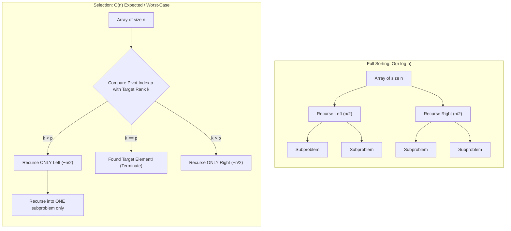
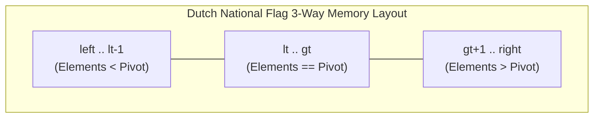
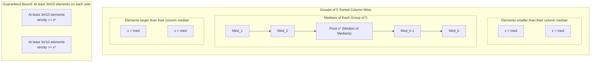
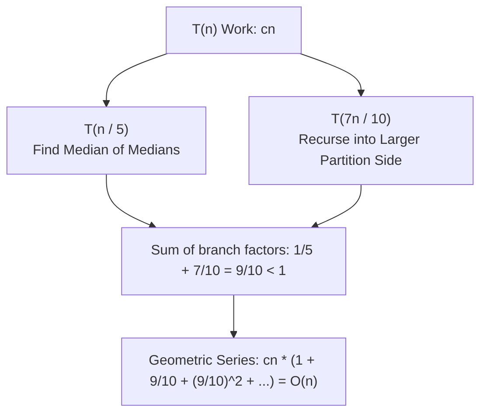

# Quickselect and Median of Medians

> [!NOTE]
> **Selection (Order Statistics)** finds the element of rank $k$ without sorting the entire array:
> - **Randomized Quickselect:** Expected $O(n)$ time and $O(1)$ auxiliary space by partitioning around a random pivot and discarding the unneeded half.
> - **Median of Medians (BFPRT):** Worst-case $O(n)$ deterministic time by grouping elements into quintets, selecting the median of medians as pivot, and guaranteeing at least a $30\%$ data reduction per phase.
> - **Bounded Heap Selection:** $O(n \log k)$ time and $O(k)$ space using a max-heap of size $k + 1$, ideal for streaming inputs or when $k \ll n$.
>
> Reference implementations: [C++17 Implementation](../../implementations/cpp/quickselect_and_median_of_medians.cpp) | [Python Implementation](../../implementations/python/quickselect_and_median_of_medians.py)

> [!TIP]
> **Selection Strategy Decision Matrix:**
>
> | Selection Paradigm | Practical Speed | Worst-Case Time | Auxiliary Space | In-Place? | Best Fit |
> |---|---|---|---|---|---|
> | **Full Sorting** | Moderate ($O(n \log n)$) | $O(n \log n)$ | $O(\log n)$ | Yes | Need complete sorted order or all ranks |
> | **Randomized Quickselect** | **Fastest** (Expected $O(n)$) | $O(n^2)$ | $O(1)$ (iterative) | Yes | General-purpose selection, medians, single rank queries |
> | **Median of Medians (BFPRT)** | Moderate ($O(n)$) | **Guaranteed $O(n)$** | $O(1)$ (in-place) / $O(n)$ | Yes | Adversarial inputs, hard real-time bounds, hybrid fallback |
> | **Bounded Heap of Size $k$** | High for $k \ll n$ | $O(n \log k)$ | $O(k)$ | No | Online streaming, dynamic top-$k$, unknown stream length |

> [!WARNING]
> **Cardinal Engineering Traps:**
> 1. **Index Conventions (0-Based vs. 1-Based):** In standard 0-based indexing:
>    - Minimum is rank $0$.
>    - Median of $n$ elements is rank $\lfloor n / 2 \rfloor$.
>    - Maximum is rank $n - 1$.
>    Mixing 0-based and 1-based ranks causes subtle off-by-one errors.
> 2. **Naive Pivot Degradation:** Deterministically selecting `a[left]` or `a[right]` causes quadratic $O(n^2)$ degradation on sorted, reverse-sorted, or structured data. Always randomize pivot selection or use Median of Medians.
> 3. **Duplicate Value Collapse:** Standard two-way Lomuto partitioning degrades on arrays of identical elements. Use **Dutch National Flag 3-Way Partitioning** (`< pivot`, `== pivot`, `> pivot`) to collapse equal keys in a single pass.

Sorting is one of the most fundamental algorithmic tools.

But many problems do not need the entire array sorted.

Sometimes we only want:

- the $ k $-th smallest element
- the median
- the top $ k $ smallest or largest elements
- a partition around some rank
- a robust pivot for divide-and-conquer

This leads to the problem of **selection**.

The two most classical selection algorithms are:

- **Quickselect**, which is usually fast in practice and has expected linear time
- **Median of Medians**, which guarantees worst-case linear time

These algorithms are closely related to Quicksort, but they solve a different problem:

> find one element of a given rank without fully sorting everything

This chapter develops:

- the order-statistics problem
- partition-based selection
- randomized and deterministic pivot strategies
- Quickselect
- Median of Medians
- expected versus worst-case guarantees
- practical trade-offs and implementation details

---

## 1. The selection problem

Given an array of $ n $ elements and an integer $ k $, we want to find the element of rank $ k $.

Depending on convention, this may mean:

- the $ k $-th smallest element with $ k $ starting from 1
- or the element at index $ k $ in sorted order with 0-based indexing

This problem is called **selection** or **order statistics**.

### Examples
- minimum element
- maximum element
- median
- lower quartile
- top $ k $ threshold value

---

## 2. Why selection is different from sorting




A natural first idea is:

1. sort the array
2. return the $ k $-th element

This works, but it costs:

$$
O(n \log n)
$$

time.

If we only need one rank, this may be more work than necessary.

Selection algorithms can do better:

- **Quickselect**: expected $ O(n) $
- **Median of Medians**: worst-case $ O(n) $

So selection is an example of solving exactly the problem we need, rather than a stronger problem.

---

## 3. Order statistics terminology

If the array were sorted, then:

- the **1st smallest** is the minimum
- the **n-th smallest** is the maximum
- the **median** is the middle rank

For an array of length $ n $:

- lower median is often rank $ \lfloor (n+1)/2 \rfloor $ in 1-based terms
- in 0-based indexing, median is often near index $ n/2 $

When implementing selection, be very clear about whether $ k $ is:

- 0-based
- or 1-based

This is one of the most common sources of bugs.

---

## 4. Partitioning as the key primitive

Both Quickselect and Quicksort rely on **partitioning**.

Partitioning chooses a pivot value and rearranges the array so that:

- elements smaller than the pivot go to one side
- elements larger than the pivot go to the other side
- equal elements are grouped appropriately

After partitioning, the pivot is in a position related to its final sorted rank.

This is the central idea behind selection.

---

## 5. Why partitioning helps selection

Suppose we partition around a pivot and discover that the pivot ends up at position $ p $.

Then:

- if $ k = p $, we are done
- if $ k < p $, the answer lies in the left part
- if $ k > p $, the answer lies in the right part

Unlike Quicksort, we recurse into **only one side**.

That is why selection is faster than fully sorting.

---

## 6. Lomuto and Hoare partition schemes

Two famous partition schemes are:

- **Lomuto partition**
- **Hoare partition**

### Lomuto
- simpler to understand
- often easier for teaching
- usually places pivot into a final index explicitly

### Hoare
- often fewer swaps
- slightly trickier to reason about
- does not directly return the final pivot index in the same way

For clarity, this chapter uses Lomuto-style partitioning first.

---

## 7. Lomuto partition idea

Choose a pivot, often placed at the end of the current range.

Then scan the range:

- maintain a boundary of elements known to be less than the pivot
- when we see a smaller element, swap it into the left side
- at the end, place the pivot between the smaller and larger regions

This gives a clean partition with one final pivot index.

---

## 8. C++17 Lomuto partition

```cpp
#include <vector>
#include <algorithm>

int lomuto_partition(std::vector<int>& a, int left, int right) {
    int pivot = a[right];
    int i = left;

    for (int j = left; j < right; ++j) {
        if (a[j] < pivot) {
            std::swap(a[i], a[j]);
            ++i;
        }
    }

    std::swap(a[i], a[right]);
    return i;
}
```

---

## 9. Python Lomuto partition

```python
def lomuto_partition(a, left, right):
    pivot = a[right]
    i = left

    for j in range(left, right):
        if a[j] < pivot:
            a[i], a[j] = a[j], a[i]
            i += 1

    a[i], a[right] = a[right], a[i]
    return i
```

---

## 10. Quickselect

**Quickselect** is the selection analogue of Quicksort.

Algorithm idea:

1. choose a pivot
2. partition the array
3. compare the pivot position with the target rank
4. recurse or iterate only into the relevant side

This is usually very fast in practice.

With randomized pivot choice, its expected running time is linear.

---

## 11. Quickselect recurrence intuition

If partitioning splits the problem reasonably, then we only recurse into one side.

A rough recurrence is:

$$
T(n) = T(\text{one side}) + O(n)
$$

If the pivot is random, the expected size of the recursive side decreases enough to give expected linear time.

That is the key reason Quickselect is efficient.

---

## 12. Iterative versus recursive Quickselect

Quickselect can be implemented:

- recursively
- or iteratively with a loop over the current interval

The iterative form is often preferable in practice because it avoids recursion depth concerns and is easy to write.

---

## 13. C++17 randomized Quickselect

```cpp
#include <vector>
#include <algorithm>
#include <random>
#include <stdexcept>

int quickselect(std::vector<int> a, int k) {
    if (k < 0 || k >= static_cast<int>(a.size())) {
        throw std::out_of_range("k out of range");
    }

    std::mt19937 rng(std::random_device{}());
    int left = 0;
    int right = static_cast<int>(a.size()) - 1;

    while (left <= right) {
        std::uniform_int_distribution<int> dist(left, right);
        int pivot_index = dist(rng);
        std::swap(a[pivot_index], a[right]);

        int p = lomuto_partition(a, left, right);

        if (p == k) {
            return a[p];
        } else if (k < p) {
            right = p - 1;
        } else {
            left = p + 1;
        }
    }

    throw std::logic_error("unreachable");
}
```

---

## 14. Python randomized Quickselect

```python
import random

def quickselect(a, k):
    if k < 0 or k >= len(a):
        raise IndexError("k out of range")

    a = a[:]
    left, right = 0, len(a) - 1

    while left <= right:
        pivot_index = random.randint(left, right)
        a[pivot_index], a[right] = a[right], a[pivot_index]

        p = lomuto_partition(a, left, right)

        if p == k:
            return a[p]
        if k < p:
            right = p - 1
        else:
            left = p + 1
```

---

## 15. Expected running time of Quickselect

Randomized Quickselect has expected running time:

$$
O(n)
$$

The intuition is that a random pivot is unlikely to be consistently terrible.

Although one step may be unbalanced, the expected shrinkage over repeated steps is good enough to make the total expected cost linear.

This is one of the classic randomized algorithm results.

---

## 16. Worst-case behavior of naive Quickselect

If we always choose a bad pivot, Quickselect can degrade to:

$$
O(n^2)
$$

### Example bad case
If the array is already sorted and we always choose the last element as pivot, then each partition removes only one element.

That leads to the recurrence:

$$
T(n) = T(n-1) + O(n)
$$

which sums to quadratic time.

So pivot choice matters a lot.

---

## 17. Duplicates and three-way partitioning




When the array contains many duplicate values, ordinary two-way partitioning can behave less cleanly.

A useful refinement is **three-way partitioning**, which splits into:

- less than pivot
- equal to pivot
- greater than pivot

This is especially helpful when many elements are equal, because it can terminate more quickly and avoid unnecessary recursion.

---

## 18. Python three-way partition Quickselect idea

```python
def quickselect_three_way(a, k):
    if k < 0 or k >= len(a):
        raise IndexError("k out of range")

    a = a[:]
    left, right = 0, len(a) - 1

    while True:
        pivot = a[random.randint(left, right)]

        lt = left
        i = left
        gt = right

        while i <= gt:
            if a[i] < pivot:
                a[lt], a[i] = a[i], a[lt]
                lt += 1
                i += 1
            elif a[i] > pivot:
                a[i], a[gt] = a[gt], a[i]
                gt -= 1
            else:
                i += 1

        if k < lt:
            right = lt - 1
        elif k > gt:
            left = gt + 1
        else:
            return a[k]
```

This is a useful practical variant, especially for duplicate-heavy inputs.

---

## 19. Top $ k $ selection versus single-rank selection

Selection and top-$ k $ problems are related but not identical.

### Single-rank selection
Find just the $ k $-th smallest element.

### Top $ k $
Find the $ k $ smallest or largest elements.

Quickselect can help with top-$ k $ by partitioning around the $ k $-th rank, after which one side contains the desired set, possibly unsorted.

This is often faster than full sorting.

---

## 20. Why Quickselect is useful in practice

Quickselect is popular because it is:

- simple
- fast on average
- in-place
- often better than sorting when only one rank is needed

Typical uses include:

- median computation
- percentile computation
- thresholding
- top-$ k $ preprocessing
- robust pivot finding in larger algorithms

In practice, randomized Quickselect is often the default selection method.

---

## 21. Need for deterministic worst-case linear time

Sometimes expected linear time is not enough.

Reasons include:

- adversarial inputs
- worst-case performance guarantees
- theory and proofs
- robust library-style algorithms

This motivates the **Median of Medians** algorithm, which provides:

$$
O(n)
$$

worst-case time.

This is one of the most famous deterministic selection algorithms.

---

## 22. Median of Medians overview

The algorithm works by choosing a pivot that is guaranteed to be “good enough”.

High-level idea:

1. divide the array into groups of 5
2. sort each small group and take its median
3. recursively find the median of those medians
4. use that value as the pivot
5. partition around it
6. recurse only into the relevant side

The magic is that this pivot can be proved to discard a constant fraction of elements each time.

---

## 23. Why groups of 5 are used

Groups of 5 are a classical compromise:

- small enough to sort cheaply
- large enough to guarantee a strong pivot quality

Other group sizes are possible in theory, but 5 is the standard and most famous choice.

It gives the cleanest classical proof.

---

## 24. Median of Medians pivot-quality intuition




When we take the median of each group of 5, and then the median of those medians:

- at least half of the group medians are at least the chosen pivot
- and each such median is at least 3 elements in its group

Similarly on the low side.

So a constant fraction of the array is guaranteed to be:

- definitely less than the pivot
- definitely greater than the pivot

This prevents catastrophically unbalanced recursion.

---

## 25. The key discard guarantee

Ignoring small edge effects, the chosen pivot is greater than at least about:

$$
\frac{3n}{10}
$$

elements and less than at least about:

$$
\frac{3n}{10}
$$

elements.

So after partitioning, the larger recursive side has size at most about:

$$
\frac{7n}{10}
$$

This gives the recurrence:

$$
T(n) \le T\left(\frac{n}{5}\right) + T\left(\frac{7n}{10}\right) + O(n)
$$

which solves to linear time.

That is the core theoretical achievement.

---

## 26. Three-way partition around a pivot value

Median of Medians usually works most cleanly with a partition around a **pivot value**, not just a pivot index.

So we often perform a three-way partition into:

- less than pivot value
- equal to pivot value
- greater than pivot value

Then:

- if $ k $ lies in the left zone, recurse left
- if $ k $ lies in the equal zone, return pivot
- if $ k $ lies in the right zone, recurse right with adjusted rank

This is conceptually clean and handles duplicates well.

---

## 27. Python Median of Medians

```python
def median_of_medians_select(a, k):
    if k < 0 or k >= len(a):
        raise IndexError("k out of range")

    def select(arr, k):
        n = len(arr)
        if n <= 5:
            return sorted(arr)[k]

        groups = [arr[i:i+5] for i in range(0, n, 5)]
        medians = [sorted(group)[len(group)//2] for group in groups]
        pivot = select(medians, len(medians)//2)

        lows = [x for x in arr if x < pivot]
        highs = [x for x in arr if x > pivot]
        pivots = [x for x in arr if x == pivot]

        if k < len(lows):
            return select(lows, k)
        elif k < len(lows) + len(pivots):
            return pivot
        else:
            return select(highs, k - len(lows) - len(pivots))

    return select(a[:], k)
```

This version emphasizes clarity rather than in-place efficiency.

---

## 28. C++17 Median of Medians

```cpp
#include <vector>
#include <algorithm>
#include <stdexcept>

int median_of_medians_select(std::vector<int> a, int k) {
    if (k < 0 || k >= static_cast<int>(a.size())) {
        throw std::out_of_range("k out of range");
    }

    auto select = [&](auto&& self, std::vector<int> arr, int rank) -> int {
        int n = static_cast<int>(arr.size());
        if (n <= 5) {
            std::sort(arr.begin(), arr.end());
            return arr[rank];
        }

        std::vector<int> medians;
        for (int i = 0; i < n; i += 5) {
            int r = std::min(i + 5, n);
            std::vector<int> group(arr.begin() + i, arr.begin() + r);
            std::sort(group.begin(), group.end());
            medians.push_back(group[group.size() / 2]);
        }

        int pivot = self(self, medians, static_cast<int>(medians.size()) / 2);

        std::vector<int> lows, highs, pivots;
        for (int x : arr) {
            if (x < pivot) lows.push_back(x);
            else if (x > pivot) highs.push_back(x);
            else pivots.push_back(x);
        }

        if (rank < static_cast<int>(lows.size())) {
            return self(self, lows, rank);
        }
        if (rank < static_cast<int>(lows.size() + pivots.size())) {
            return pivot;
        }
        return self(self, highs, rank - static_cast<int>(lows.size() + pivots.size()));
    };

    return select(select, a, k);
}
```

Again, this version is written for clarity.

---

## 29. Why Median of Medians is rarely the default in practice

Although its worst-case guarantee is excellent, Median of Medians is usually slower in practice than randomized Quickselect because:

- it has larger constant factors
- it does more pivot work
- it is more complex to implement well

So its main value is:

- theoretical guarantee
- adversarial robustness
- use as a fallback in hybrid algorithms

This is an important practical lesson.

---

## 30. Expected versus worst-case comparison

### Randomized Quickselect
- expected $ O(n) $
- worst-case $ O(n^2) $
- usually faster in practice

### Median of Medians
- worst-case $ O(n) $
- usually larger constants
- more robust against bad pivot sequences

This is a classic example of the trade-off between theoretical guarantee and practical average speed.

---

## 31. Introselect and hybrid selection

Real standard-library-quality implementations often use a hybrid approach.

One idea is:

- start with Quickselect
- monitor recursion depth or partition quality
- if behavior becomes suspiciously bad, switch to a deterministic fallback

This kind of hybrid is often called **introselect**, by analogy with introsort.

It combines:
- practical speed
- protection against bad cases

---

## 32. Heap-based selection comparison

Another way to solve some selection problems is with heaps.

### Examples
- find the $ k $-th smallest by maintaining a max-heap of size $ k $
- find top $ k $ largest with a min-heap of size $ k $

This gives:

$$
O(n \log k)
$$

time.

This can be better than Quickselect when:

- $ k $ is very small
- streaming input is involved
- we need online behavior

So heaps and selection algorithms complement each other.

---

## 33. When to use which method

### Full sorting
Use when you need:
- total order
- all ranks
- sorted output

### Quickselect
Use when you need:
- one rank
- median
- threshold
- fast practical performance

### Heap of size $ k $
Use when:
- $ k $ is small
- input is streaming
- top-$ k $ maintenance is needed

### Median of Medians
Use when:
- worst-case guarantee matters
- adversarial robustness matters
- deterministic linear-time theory is needed

This decision framework is very useful.

---

## 34. Handling duplicates correctly

Duplicates matter in selection.

If many elements equal the pivot, then the target rank may fall inside the equal block.

This is another reason three-way partitioning is conceptually nice.

When duplicates are not handled carefully, implementations may:

- recurse too much
- return the wrong adjusted rank
- perform badly on repeated values

So duplicate-aware design is important.

---

## 35. In-place versus clarity-oriented implementations

There are two implementation styles:

### In-place
- lower extra memory
- closer to production-quality partition code
- harder to reason about

### Clarity-oriented
- easier to verify
- often uses extra lists or vectors
- ideal for teaching and proofs

For a handbook chapter, it is often best to prioritize clarity first, then mention in-place engineering as a refinement.

---

## 36. Correctness intuition for Quickselect

After partitioning around a pivot:

- everything left of the pivot is smaller
- everything right of the pivot is larger or equal, depending on scheme

So the pivot's rank relative to the current subarray is known.

If the target rank is not the pivot's rank, it must lie entirely on one side.

Thus discarding the other side is always correct.

This is the core correctness argument.

---

## 37. Correctness intuition for Median of Medians

Median of Medians is correct for the same partition-and-recurse reason as Quickselect.

Its extra contribution is not correctness, but **guaranteed pivot quality**.

That pivot guarantee forces substantial progress at each step, which yields worst-case linear time.

So the correctness argument is standard selection logic, while the time proof is the special part.

---

## 38. Complexity summary

### Sort then index
- time: $ O(n \log n) $
- space: depends on sort

### Randomized Quickselect
- expected time: $ O(n) $
- worst-case time: $ O(n^2) $
- extra space: often $ O(1) $ iterative in-place

### Median of Medians
- worst-case time: $ O(n) $
- extra space: depends on implementation

### Heap of size $ k $
- time: $ O(n \log k) $
- space: $ O(k) $

These trade-offs should guide method choice.

---

## 39. Common mistakes

### Mistake 1: mixing 0-based and 1-based rank conventions
Be explicit about whether `k = 0` means smallest element or first element after sorting.

### Mistake 2: using a fixed bad pivot
Choosing the last element deterministically can cause quadratic behavior.

### Mistake 3: forgetting duplicates
Two-way partitioning may behave poorly on duplicate-heavy inputs.

### Mistake 4: adjusting the rank incorrectly after recursion
When recursing right, the new rank must be shifted by the number of discarded elements.

### Mistake 5: assuming Quickselect is always worst-case linear
Only its expected running time is linear unless pivot choice is protected.

### Mistake 6: using full sorting when only one rank is needed
That may do extra work unnecessarily.

---

## 40. Comparison table

| Method | Goal | Time | Strength |
|---|---|---:|---|
| sort then index | any rank after full ordering | $ O(n \log n) $ | simplest if sorted order is also useful |
| randomized Quickselect | one order statistic | expected $ O(n) $ | very practical |
| Median of Medians | one order statistic | worst-case $ O(n) $ | deterministic guarantee |
| heap of size $ k $ | top $ k $, streaming selection | $ O(n \log k) $ | good for online or small $ k $ |

---

## 41. Worked intuition example

Suppose we want the element of sorted index $ 4 $ in:

```text
[9, 1, 8, 2, 7, 3, 6]
```

If partitioning places pivot `6` at index `4`, we are done immediately.

If the pivot lands earlier, we search only the right part.

If it lands later, we search only the left part.

This shows why selection can discard a large amount of data without sorting everything.

---

## 42. Proof sketch of the Median of Medians recurrence




The classical recurrence is:

$$
T(n) \le T\left(\frac{n}{5}\right) + T\left(\frac{7n}{10}\right) + cn
$$

where:

- $ T(n/5) $ is for recursively selecting the median of medians
- $ T(7n/10) $ is for the larger side after partition
- $ cn $ covers grouping, sorting tiny groups, and partitioning

Because:

$$
\frac{1}{5} + \frac{7}{10} = \frac{9}{10} < 1
$$

the recurrence solves to:

$$
T(n) = O(n)
$$

This is the key theoretical result.

---

## 43. Summary

Selection algorithms find one rank without fully sorting the data.

The two classical methods are:

- **Quickselect**, which is usually fast in practice and has expected linear time
- **Median of Medians**, which guarantees worst-case linear time

The core idea in both is:

- choose a pivot
- partition around it
- recurse only into the side containing the target rank

The main lessons of this chapter are:

- selection is different from sorting
- pivot quality determines performance
- randomized algorithms are often excellent in practice
- deterministic worst-case linear selection is possible
- heaps remain an important alternative for top-$ k $ and streaming settings

This chapter completes an important part of the toolkit around heaps, partitioning, and order statistics.

---

## 44. Practice prompts

1. What is the selection problem?
2. Why can selection be easier than sorting?
3. What does partitioning accomplish?
4. Why does Quickselect recurse into only one side?
5. What is the expected running time of randomized Quickselect?
6. Why can naive Quickselect become quadratic?
7. Why is three-way partitioning helpful with duplicates?
8. What is the main idea behind Median of Medians?
9. Why does Median of Medians guarantee worst-case linear time?
10. When is a heap of size $ k $ preferable to Quickselect?

---

## 45. Suggested next topics

A natural continuation after Quickselect and Median of Medians is:

- indexed priority queues
- heap decrease-key patterns
- Dijkstra and Prim engineering
- streaming medians
- order-statistics trees
