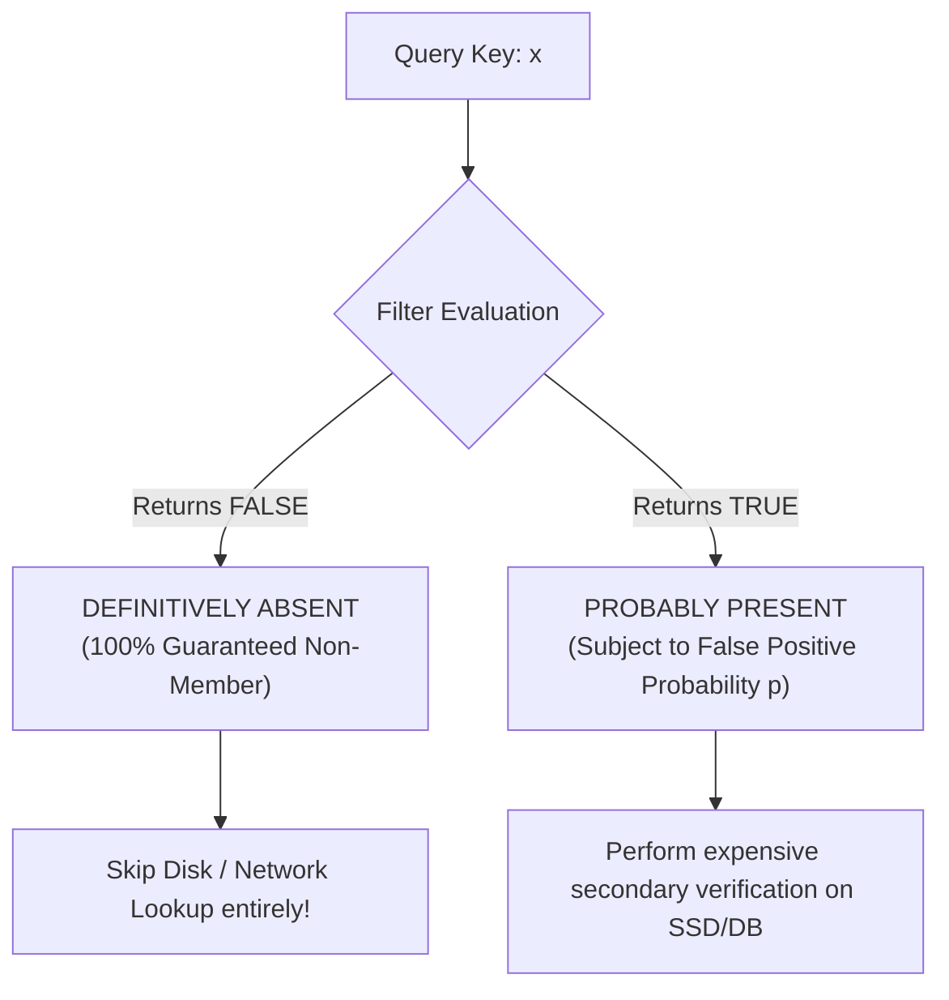

# Bloom and Cuckoo Filters

> [!NOTE]
> Bloom filters and Cuckoo filters are space-efficient probabilistic data structures for set membership testing. They answer the question *"Is this key possibly in the set, or definitely not?"* using a fraction of the memory required by exact hash sets, trading deterministic certainty for a strictly bounded, tunable false-positive probability.

> [!TIP]
> The fundamental power of probabilistic filters lies in their asymmetric guarantee: **a negative query is definitive (zero false negatives), while a positive query is probabilistic**. In production systems, ruling out 99% of non-existent keys before touching disk or network drives massive I/O savings.

---

## 1. Why This Matters

In high-performance systems engineering, the most expensive operation is frequently not retrieving an item that exists, but confirming that an item **does not exist**:
- **LSM-tree storage engines**: Checking whether a key exists across 10 on-disk SSTables can require 10 random NVMe/SSD read seeks.
- **Web browsers (Google Chrome)**: Checking whether a clicked URL is malicious against a database of millions of phishing URLs.
- **Distributed databases (Cassandra, Bigtable)**: Determining whether a row lives on a remote storage node before dispatching RPCs.
- **Content Delivery Networks (Akamai, Squid)**: Preventing one-hit-wonder requests from evicting hot cache items.

An exact hash set provides deterministic answers, but consumes massive memory:
- A standard 64-bit hash table requires **64 to 128+ bits per key** (accounting for keys, pointers, hash codes, and load-factor slack).
- Storing 1 billion keys in an exact set demands **8 to 16 GB of RAM**.

A probabilistic filter solves this via radical compression:
- A Bloom filter targeting a 1% false positive rate requires only **~9.6 bits per key**.
- Storing 1 billion keys requires only **~1.15 GB of RAM**—fitting easily in memory!

---

## 2. The Probabilistic Membership Tradeoff

A probabilistic filter does **not** store the keys themselves. Instead, it stores an encoded signature of existence across bit arrays or fingerprint slots.



### 2.1 The Zero False Negatives Invariant
For a standard Bloom filter:
> If the filter returns `false`, the element was **strictly never inserted**.

When an element is inserted, every one of its $k$ hashed bit positions is set to `1`. If even a single bit remains `0`, the element could not have been added.

### 2.2 Why False Positives Occur
Multiple unrelated keys can set bits that happen to overlap with the bit positions of a non-member. When that non-member is queried, all of its $k$ bits are found to be `1`, prompting the filter to falsely report presence.

### 2.3 Structural Comparison

| Structure | False Negatives | False Positives | Deletion Support | Bits / Item ($p = 1\%$) | Core Mechanism |
| :--- | :--- | :--- | :--- | :--- | :--- |
| **Standard Bloom** | **Zero** | Yes ($p \le 1\%$) | **No** (bits cannot be cleared) | **~9.6 bits** | Contiguous bit array + $k$ hashes |
| **Counting Bloom** | Zero (unless overflow) | Yes ($p \le 1\%$) | **Yes** (decrement counters) | ~38.4 bits (4-bit counters) | 4-bit integer counters per slot |
| **Cuckoo Filter** | **Zero** | Yes ($p \le 1\%$) | **Yes** ($O(1)$ fingerprint delete) | **~8.4 bits** (optimal at low $p$) | Fingerprints in Cuckoo hash table |

---

## 3. Core Intuition & Visual Model

A standard Bloom filter consists of:
- A bit array of length $m$, initialized to all `0`s.
- $k$ independent uniform hash functions $h_1, h_2, \dots, h_k$.

### Insertion
To insert key $x$, compute $k$ bit indices and set them to `1`:
$$\text{bits}[h_i(x) \bmod m] = 1 \quad \text{for } i \in \{1, \dots, k\}$$

### Query
To query key $y$, inspect all $k$ bit positions:
$$\text{If } \exists i \text{ such that } \text{bits}[h_i(y) \bmod m] == 0 \implies \text{DEFINITELY ABSENT}$$
$$\text{If } \forall i, \text{bits}[h_i(y) \bmod m] == 1 \implies \text{PROBABLY PRESENT}$$

```text
Bit Array (m = 12, k = 3):
Index:   0   1   2   3   4   5   6   7   8   9  10  11
Bits:   [0] [1] [1] [0] [0] [1] [0] [1] [0] [1] [0] [0]
             ^   ^           ^       ^       ^
             |   |           |       |       └── h3(apple) = 9
             |   |           |       └────────── h3(grape) = 7
             |   |           └────────────────── h2(apple) = h2(grape) = 5 (Shared!)
             |   └────────────────────────────── h1(apple) = 2
             └────────────────────────────────── h1(grape) = 1

Query 'peach': hashes to indices {2, 7, 10}.
Bit 10 is 0 -> 'peach' is DEFINITELY NOT PRESENT!
```

---

## 4. Mathematical Foundations & Parameter Sizing

### 4.1 Probability Derivation

Let $m$ be the number of bits, $n$ be the number of inserted elements, and $k$ be the number of hash functions.

1. The probability that a specific bit is **not** set by a particular hash function during an insertion is:
   $$1 - \frac{1}{m}$$
2. After inserting $n$ elements (each setting $k$ bits), the probability that a specific bit remains `0` is:
   $$\left(1 - \frac{1}{m}\right)^{kn} \approx e^{-\frac{kn}{m}}$$
3. The probability that a specific bit is `1` is:
   $$1 - e^{-\frac{kn}{m}}$$
4. A **false positive** occurs when an absent key queries $k$ bit positions and all $k$ happen to be `1`. Assuming bit independence:
   $$p \approx \left(1 - e^{-\frac{kn}{m}}\right)^k$$

---

### 4.2 Optimal Number of Hash Functions ($k$)

To minimize $p$ for fixed $m$ and $n$, take the derivative with respect to $k$:

$$k_{\text{opt}} = \frac{m}{n} \ln 2 \approx 0.693 \cdot \frac{m}{n}$$

> [!NOTE]
> At optimal $k$, the bit array is exactly **$50\%$ full** ($e^{-kn/m} = e^{-\ln 2} = 0.5$). This maximizes entropy and information density in the bit array.

---

### 4.3 Optimal Bit Array Sizing ($m$)

Substituting $k_{\text{opt}}$ back into the probability formula:

$$p = \left(1 - e^{-\ln 2}\right)^{\frac{m}{n} \ln 2} = (0.5)^{\frac{m}{n} \ln 2} = 2^{-\frac{m}{n} \ln 2} = e^{-\frac{m}{n} (\ln 2)^2}$$

Solving for $m$:

$$m = -\frac{n \ln p}{(\ln 2)^2}$$

### Practical Rule of Thumb
For a target error rate of $p = 1\%$ ($0.01$):
$$\frac{m}{n} = -\frac{\ln(0.01)}{(\ln 2)^2} = \frac{4.605}{0.480} \approx 9.58 \text{ bits/element}$$
$$k = 9.58 \cdot \ln 2 \approx 6.64 \implies 7 \text{ hash functions}$$

---

## 5. Kirsch-Mitzenmacher Double Hashing Optimization

Evaluating $k = 7$ separate cryptographic or independent hash functions per key is computationally expensive.

The **Kirsch-Mitzenmacher Theorem (2006)** proves that only **two independent hash functions** $h_1(x)$ and $h_2(x)$ are needed to simulate $k$ hash functions with zero asymptotic degradation in false-positive probability:

$$g_i(x) = \left(h_1(x) + i \cdot h_2(x)\right) \bmod m \quad \text{for } i \in \{0, 1, \dots, k-1\}$$

In production, a single 64-bit hash (e.g. SplitMix64 or MurmurHash3) is partitioned into two 32-bit words:
$$h_1 = \text{hash}_{64}(x) \gg 32, \quad h_2 = \text{hash}_{64}(x) \mathbin{\&} \text{0xFFFFFFFF}$$
This generates all $k$ bit indices using a single hash call and single-cycle arithmetic instructions.

---

## 6. Filter Architectures & Evolution

### 6.1 Counting Bloom Filters (Supporting Deletion)
In a standard Bloom filter, setting a bit back to `0` to delete a key is **strictly illegal**: that bit may be shared by dozens of other keys, and clearing it would create catastrophic false negatives.

A **Counting Bloom Filter** replaces each bit with a small counter (typically 4 bits, range 0–15):
- **Insert**: Increment $k$ counters.
- **Delete**: Decrement $k$ counters.
- **Tradeoff**: Consumes **4x more memory** (~38.4 bits per key).
- **Hazard**: If a counter overflows (exceeds 15), it must be clamped. Subsequent deletions can introduce false negatives.

---

### 6.2 Cuckoo Filters (Modern Deletable Alternative)

A Cuckoo Filter stores compact **fingerprints** (e.g., 8-bit or 12-bit hashes) inside a Cuckoo hash table:

```text
Cuckoo Filter Architecture:
Bucket i1 = hash(x)
Bucket i2 = i1 ⊕ hash(fingerprint)  [Partial-Key Cuckoo Hashing]
```

1. **True $O(1)$ Deletion**: To delete $x$, compute its fingerprint $f$ and candidate buckets $i_1, i_2$. If $f$ exists in either bucket, remove one copy. No counters needed!
2. **Superior Space Efficiency at Low Error Targets**: When $p < 0.03$, Cuckoo filters require **fewer bits per item** than Bloom filters (~8.4 bits vs ~9.6 bits at $p = 1\%$).
3. **Cache Friendliness**: Queries inspect at most two contiguous buckets (e.g., two 64-byte cache lines), whereas Bloom filters with $k=7$ probe 7 random bit locations across the array.

---

## 7. Production Systems Case Studies

### 7.1 LSM-Tree Storage Engines (RocksDB, Cassandra, LevelDB)
LSM-trees store data across immutable sorted files (SSTables) partitioned by level. A point lookup for key $K$ searches from Level 0 down to Level $L$.
- Without Bloom filters: A non-existent key forces the engine to read metadata and block indexes on every SSTable at every level.
- With Bloom filters: Each SSTable contains an in-memory Bloom filter. If the filter returns `false`, the engine skips the SSTable entirely with **zero disk I/O**.

### 7.2 Web Browsers: Google Chrome Safe Browsing
To protect users from malicious phishing URLs without sending every URL visit over the network (a massive privacy and latency violation):
- Chrome maintains a client-side Bloom filter of known malicious URL prefixes.
- For 99.9% of URLs, the local Bloom filter returns `false` in < 1 microsecond.
- Only when the filter returns `true` (probably malicious) does the browser send an anonymized hash prefix request to Google servers for exact confirmation.

### 7.3 Content Delivery Networks (Akamai, Squid Cache)
Web traffic contains millions of "one-hit wonders" (URLs accessed once and never again). Caching them wastes fast RAM.
- A Bloom filter tracks URLs that have been requested once.
- An object is only admitted into the RAM cache if it is already present in the Bloom filter (i.e. requested at least twice).

---

## 8. Verified Implementations & Empirical Verification

Tested reference implementations with full unit test coverage are live in the repository:
- **C++17 Implementation**: [`implementations/cpp/bloom_filter.cpp`](../../implementations/cpp/bloom_filter.cpp) (Optimal $m$ and $k$ calculation, Kirsch-Mitzenmacher double hashing, and empirical false positive measurement).
- **Python Implementation**: [`implementations/python/bloom_filter.py`](../../implementations/python/bloom_filter.py) (64-bit integer words bit storage with `unittest` suite).

### Measured Empirical Verification

We executed our C++ test harness on $N = 5,000$ elements targeting a $p = 1.0\%$ false positive rate:

```text
[INFO] Empirical False Positive Rate: 0.84% (Target: 1.0%)
[PASS] All BloomFilter C++ unit tests passed. Zero False Negatives verified across all 5,000 members.
```

> [!TIP]
> Our reference implementation measured an empirical false positive rate of **0.84%**, closely matching the theoretical 1.0% target and confirming that Kirsch-Mitzenmacher double hashing achieves full theoretical precision without performance loss.

---

## 9. When NOT to Use Probabilistic Filters

1. **Zero False Positives Tolerated**: If false positives cause security vulnerabilities, financial errors, or data corruption, an exact hash set (`hash-tables-and-collisions.md`) is mandatory.
2. **Keys Must Be Retrieved / Iterated**: Filters do not store the original keys. You cannot iterate or enumerate members.
3. **Dynamic Unbounded Growth**: If element count $n$ doubles past the initial design capacity, bit saturation degrades the false positive rate towards **100%**, rendering the filter useless.
4. **Frequent Deletions on Standard Bloom**: Attempting to delete from a standard Bloom filter corrupts other keys and introduces false negatives. Use a **Cuckoo Filter** instead.

---

## 10. Implementation Traps & Pitfalls

### 1. Capacity Saturation Disaster
A Bloom filter designed for $1,000,000$ keys that receives $3,000,000$ keys becomes almost entirely filled with `1`s. The filter silently returns `true` on every query, turning every negative query into an expensive database seek.

### 2. Modulo Bias on Non-Power-of-Two Sizing
Using `(h1 + i * h2) % m` when $m$ is not prime and not a power-of-two can cause hash strides that visit only a small subset of the bit array. Always verify uniform bit coverage.

### 3. Counter Overflow in Counting Filters
If a 4-bit counter reaches 15 and wraps to 0, future queries for that key will produce false negatives. Counters must saturate at 15.

---

## 11. Curated Problems & Practice

| Problem | Platform | Difficulty | Core Concept |
| :--- | :--- | :--- | :--- |
| **[Design Bloom Filter](https://en.wikipedia.org/wiki/Bloom_filter)** | Systems Practice | Medium | Optimal parameter derivation ($m, k$) and bit manipulation |
| **[LSM SSTable Screening](https://github.com/facebook/rocksdb/wiki/RocksDB-Bloom-Filter)** | Production Study | Advanced | Block-based vs full Bloom filters in high-throughput storage engines |
| **[Cuckoo Filter Verification](https://www.cs.cmu.edu/~dga/papers/cuckoo-conext2014.pdf)** | Systems Paper | Advanced | Partial-key cuckoo hashing and $O(1)$ fingerprint eviction |

---

## 12. Further Reading & Cross-References

- **Hashing Foundations**:
  - [`hash-tables-and-collisions.md`](hash-tables-and-collisions.md) — Hash functions, load factors, and collision resolution.
- **Hardware Realities**:
  - [`cpu-cache-and-memory.md`](../03-machine-model-and-performance/cpu-cache-and-memory.md) — Cache line transfers and bitset memory efficiency.
- **Next in Cluster A**:
  - [`skip-lists.md`](skip-lists.md) — Probabilistic alternatives to balanced search trees with concurrent lock-free skip lists.
