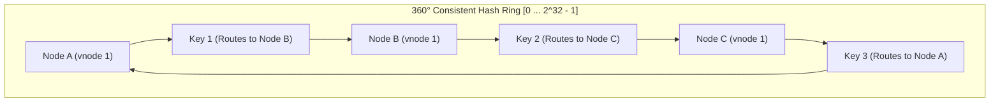
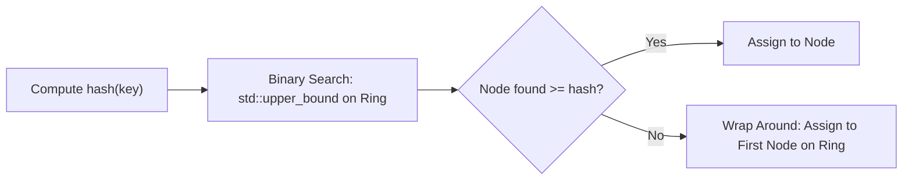

# Consistent Hashing and Distributed Partitioning

> [!NOTE]
> **The Distributed Cache Invalidation Catastrophe:**
> In distributed storage, a naive partitioning strategy hashes a key to one of $N$ server buckets using modulo arithmetic:
> $$\text{node} = \text{hash}(\text{key}) \pmod N$$
> If a server crashes or a new server is added ($N \to N + 1$), almost every key's bucket assignment changes:
> $$\text{Fraction of Keys Moved} = \frac{N}{N + 1} \approx 100\%$$
> In massive caching layers (e.g. Memcached, Redis clusters), this triggers a catastrophic **cache stampede** that overwhelms backend databases.

> [!TIP]
> **The Consistent Hash Ring Solution:**
> Consistent Hashing (Karger et al., 1997) maps both **keys and servers** to a shared continuous ring (typically $[0, 2^{32} - 1]$):
> 1. A key is routed to the **first server encountered moving clockwise** along the ring.
> 2. When a node is added or removed, **only keys in the immediate neighboring arc move** ($\approx K / N$ keys). All other nodes retain their exact key assignments!

> [!WARNING]
> **Hotspots and Non-Uniform Spacing:**
> Placing physical nodes directly on the ring creates non-uniform arc lengths, causing unlucky servers to receive $10\times$ more traffic than others.
> To ensure uniform load balancing, map each physical server to **$R$ Virtual Nodes (vnodes)** (typically $100 \le R \le 256$) scattered pseudorandomly across the ring.

---

## 1. Mathematical Mechanics: The Ring Protocol

Let the ring space be $\mathbb{Z}_M = [0, M - 1]$ where $M = 2^{64}$.
* **Hash function:** $H: \text{string} \to [0, M - 1]$ (e.g. MurmurHash3 or SipHash).
* **Node placement:** A physical server $S_i$ is mapped to $R$ positions:
  $$\text{pos}(S_i, v) = H(S_i \,\|\, \text{vnode\_id}) \quad \forall v \in \{1, \dots, R\}$$
* **Key routing:** For key $k$, compute $h_k = H(k)$. The assigned server is:
  $$\text{Server}(k) = \min \{ \text{node} \in \text{Ring} \mid \text{pos}(\text{node}) \ge h_k \}$$
  If no node has position $\ge h_k$, wrap around to the first node on the ring.

---

## 2. Load Balancing and Virtual Nodes (Vnodes)

Let $N$ be the number of physical nodes and $R$ be the number of virtual nodes per physical node.

**Theorem (Karger et al.):** With $R = O(\log N)$ virtual nodes per physical machine, no physical server is assigned more than $(1 + \epsilon)$ times the average load with high probability.

| Vnodes per Server ($R$) | Load Variance ($\sigma / \mu$) | Worst-Case Overloaded Server |
| :--- | :--- | :--- |
| **$R = 1$ (No vnodes)** | $80\% - 120\%$ | Up to $3.5\times$ average load |
| **$R = 25$** | $20\%$ | $\sim 1.4\times$ average load |
| **$R = 100$** | $10\%$ | $\sim 1.15\times$ average load |
| **$R = 256$** | $< 5\%$ | $\sim 1.05\times$ average load |

---

## 3. Node Addition and Removal Dynamics

When node $B$ is added between node $A$ and node $C$ on the ring:
* Only keys residing in the segment $(A, B]$ are transferred from node $C$ to node $B$.
* Zero keys are moved from any other servers in the cluster!
* Exactly $\frac{1}{N + 1}$ of all keys migrate, which is the mathematically minimal theoretical lower bound.

---

## 4. Architectural Decision Matrix

| Partitioning Strategy | Scaling Cost | Node Churn Impact | Implementation Complexity | Best Used In |
| :--- | :--- | :--- | :--- | :--- |
| **Modulo Hashing (`hash % N`)** | $O(1)$ lookup | Catastrophic ($100\%$ remap) | Trivial | Static, single-instance caches |
| **Consistent Hashing (Ring)** | $O(\log(N \cdot R))$ | Minimal ($\frac{1}{N}$ remap) | Moderate (Ordered map / binary search) | Distributed caches (Memcached, DynamoDB) |
| **Rendezvous (HRW) Hashing** | $O(N)$ lookup | Minimal ($\frac{1}{N}$ remap) | Simple (Hash all pairs) | Small $N$ clusters, CDN proxies |
| **Jump Consistent Hash** | $O(\ln N)$ lookup | Minimal ($\frac{1}{N}$ remap) | Ultra-compact (6 lines of code) | Sharded data where node IDs are dense $[0, N)$ |

---

## 5. Common Pitfalls & Anti-Patterns

### Anti-Pattern 1: Omitting Virtual Nodes
Using a bare consistent hash ring without virtual nodes. In a cluster of 5 nodes, one node typically gets 60% of the keys while another gets 5%, causing memory exhaustion on hot servers.

### Anti-Pattern 2: Using Weak Non-Uniform Hash Functions
Using `std::hash` or naive additive hashes for ring placement. Weak hash functions produce severe clustering on the 32-bit ring. Always use uniform avalanche hash functions (MurmurHash3, CityHash, xxHash).

---

## 6. Curated References

1. **Karger, Lehman, Leighton, Panigrahy, Levine, Lewin (1997):** *Consistent Hashing and Random Trees: Distributed Caching Protocols for Relieving Hot Spots on the World Wide Web*. STOC.
2. **DeCandia et al. (2007):** *Dynamo: Amazon's Highly Available Key-value Store*. SOSP.
3. **Lamping & Veach (2014):** *A Fast, Minimal Memory, Consistent Hash Algorithm (Jump Consistent Hash)*. Google.
