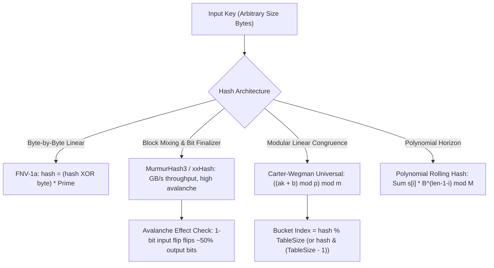

# Hash Functions

> [!NOTE]
> **The Deterministic Entropy Compressor:**
> A hash function maps data of arbitrary size (strings, objects, binary blobs) to a fixed-size integer value (a hash code, typically 32-bit or 64-bit):
> $$h: U \to \{0, 1, \dots, m - 1\}$$
> In algorithm engineering and systems design, non-cryptographic hash functions provide:
> 1. **Hash Table Indexing:** Direct bucket selection in $O(1)$ expected time.
> 2. **Fingerprinting & Deduplication:** Fast equality rejection before expensive deep comparisons.
> 3. **Probabilistic Data Structures:** Generating independent hash bit-indexes for Bloom filters, Count-Min sketches, and HyperLogLog.

> [!TIP]
> **Universal Hashing Guarantees Against Adversarial Collisions:**
> A family of hash functions $\mathcal{H} = \{h: U \to \{0, \dots, m-1\}\}$ is **2-universal** if for every pair of distinct keys $x \ne y$:
> $$\Pr_{h \sim \mathcal{H}}[h(x) = h(y)] \le \frac{1}{m}$$
> Choosing $h$ uniformly at random from $\mathcal{H}$ at program initialization guarantees that no static adversarial input dataset can force worst-case $O(n^2)$ hash table performance.
> **The Carter-Wegman Family:**
> $$h_{a,b}(k) = ((a \cdot k + b) \bmod p) \bmod m \quad (a \in \{1, \dots, p-1\}, b \in \{0, \dots, p-1\})$$

> [!WARNING]
> **The 32-bit Birthday Paradox Collision Trap:**
> Due to the **Birthday Paradox**, collisions occur with $\ge 50\%$ probability after only $O(\sqrt{m})$ samples:
> - For a 32-bit hash ($m = 2^{32} \approx 4.29 \times 10^9$), a collision is expected after approximately **$77{,}163$ random keys**.
> - Never use a 32-bit hash for document deduplication, git-style object addressing, or datasets exceeding $10^5$ elements. Production systems mandate 64-bit (Murmur3, xxHash64, Wyhash) or 128-bit hashes.



---

## 1. Properties of Quality Non-Cryptographic Hash Functions

Unlike cryptographic hash functions (SHA-256, BLAKE3), which prioritize collision resistance against active adversaries at significant CPU cycle costs, **non-cryptographic hash functions** prioritize:

1. **Uniform Distribution:** Output hash values should distribute uniformly across the full $[0, 2^w - 1]$ range.
2. **The Avalanche Effect:** Changing a single bit in the input key must change each bit of the output hash with probability $\approx 0.5$.
3. **Execution Speed:** Modern non-cryptographic hashes achieve throughputs exceeding $5\text{ GB/s}$ by processing $8$-byte or $16$-byte words using SIMD and bit-mixing instructions.
4. **Determinism:** Identical input bytes must produce identical hash codes across runs.

---

## 2. Universal Hashing Theory (Carter-Wegman)

If an adversary knows a deterministic hash function $h$, they can easily engineer $n$ distinct keys $k_1, \dots, k_n$ that all hash to the same bucket ($h(k_i) \equiv 0 \pmod m$). This degrades an $O(1)$ hash table into an $O(n)$ linked list, causing Denial of Service (Hash Flooding / Hash DoS).

### The Carter-Wegman Construction:
1. Choose a large prime $p > \max(U)$ (where $U$ is the universe of all possible keys).
2. At runtime, pick random integers $a \in \{1, 2, \dots, p - 1\}$ and $b \in \{0, 1, \dots, p - 1\}$.
3. Define the hash function:
   $$h_{a,b}(k) = \left( (a \cdot k + b) \bmod p \right) \bmod m$$

#### Theorem:
For any distinct $x \ne y \in U$:
$$\Pr_{a, b}[h_{a,b}(x) = h_{a,b}(y)] \le \frac{1}{m}$$
*Proof Sketch:* The linear mapping $(a x + b) \bmod p$ is a bijection in the finite field $\mathbb{F}_p$. For distinct $x, y$, the differences map uniformly across $\mathbb{F}_p \setminus \{0\}$. Modulo reduction by $m$ maps at most $\lceil p/m \rceil - 1 \le (p-1)/m$ values to the same bucket, yielding collision probability $\le \frac{1}{m}$.

---

## 3. High-Performance Hashing Algorithms

### 3.1 FNV-1a (Fowler–Noll–Vo)
A lightweight, byte-at-a-time hash function with negligible memory requirements:
- **64-bit FNV Offset Basis:** `0xcbf29ce484222325ULL`
- **64-bit FNV Prime:** `0x100000001b3ULL`

```cpp
uint64_t fnv1a_64(const void* key, size_t len) {
    const uint8_t* data = static_cast<const uint8_t*>(key);
    uint64_t hash = 0xcbf29ce484222325ULL;
    for (size_t i = 0; i < len; ++i) {
        hash ^= data[i];
        hash *= 0x100000001b3ULL;
    }
    return hash;
}
```

### 3.2 MurmurHash3 32-bit Finalizer (Bit Mixer)
The Murmur3 32-bit finalizer provides an optimal avalanche mixer that transforms weak entropy inputs (e.g., sequential integers) into pseudo-random 32-bit distributions:

```cpp
uint32_t murmur3_mix32(uint32_t k) {
    k ^= k >> 16;
    k *= 0x85ebca6b;
    k ^= k >> 13;
    k *= 0xc2b2ae35;
    k ^= k >> 16;
    return k;
}
```

---

## 4. The Birthday Paradox and Collision Bounds

The **Birthday Problem** calculates the probability that in a set of $n$ randomly chosen keys mapped into $m$ distinct hash buckets, at least two keys collide:

$$\Pr(\text{No Collision}) = \prod_{i=1}^{n-1} \left( 1 - \frac{i}{m} \right) \approx \prod_{i=1}^{n-1} e^{-i/m} = e^{-\sum_{i=1}^{n-1} i / m} = e^{-n(n-1) / 2m}$$
$$\Pr(\text{Collision}) = 1 - e^{-n^2 / 2m}$$

Setting $\Pr(\text{Collision}) = 0.5$:
$$e^{-n^2 / 2m} = 0.5 \implies \frac{n^2}{2m} = \ln 2 \implies n \approx \sqrt{2 \ln 2 \cdot m} \approx 1.177 \sqrt{m}$$

| Hash Bitwidth ($w$) | Modulus Space ($m = 2^w$) | Expected 50% Collision Key Count ($n$) | Primary Recommended Application |
| :---: | :---: | :---: | :--- |
| **16-bit** | $65{,}536$ | **$301$** | Microcontrollers, toy educational tables |
| **32-bit** | $4.29 \times 10^9$ | **$77{,}163$** | In-memory hash tables with open addressing |
| **64-bit** | $1.84 \times 10^{19}$ | **$5.06 \times 10^9$** | Universal database keys, string rolling hashes |
| **128-bit** | $3.40 \times 10^{38}$ | **$2.17 \times 10^{19}$** | Distributed storage, UUIDs, deduplication |

---

## 5. Algorithmic Trade-offs Matrix

| Algorithm | Bit Width | Throughput (GB/s) | Quality (SMHasher Test) | Key Length Flexibility | Best Use Case |
| :--- | :--- | :--- | :--- | :--- | :--- |
| **Identity Hash ($h(x) = x$)** | 32/64 | N/A (0 cycles) | Fails avalanche completely | Integer only | Strictly sequential IDs in direct arrays |
| **Carter-Wegman** | 32/64 | ~1.5 GB/s | Strong (2-universal proof) | Integer | Competitive programming, anti-DoS tables |
| **FNV-1a** | 32/64 | ~1.2 GB/s | Moderate | Any bytes | Tiny strings, embedded systems, simplicity |
| **MurmurHash3** | 32/128 | ~3.5 GB/s | Passes all SMHasher tests | Any bytes | General-purpose hash tables, Lucene, Redis |
| **xxHash64 / Wyhash** | 64 | ~10.0+ GB/s | Exceptional | Any bytes | High-throughput analytics, ClickHouse, RocksDB |

---

## 6. Common Pitfalls & Anti-Patterns

### Anti-Pattern 1: Modulo by Non-Prime with Linear Multiplier
When using table sizes that are powers of two ($m = 2^k$), applying a naive hash $h(x) = x \bmod 2^k$ discards all high-order bits and looks only at the lowest $k$ bits. If keys share common strides (e.g., memory pointers aligned to 8 or 16 bytes), all keys collide in a handful of buckets. Always mix bits or use Fibonacci hashing ($h(k) = (k \cdot \phi) \gg (64 - k)$).

### Anti-Pattern 2: Unseeded Standard C++ `std::hash` in Competitive Programming
`std::hash<long long>` in libstdc++ is an **identity function** ($h(x) = x$). An adversary can submit input arrays with identical values modulo $2^{20}$ to force $O(N^2)$ worst-case TLE.
*Solution:* Wrap `std::hash` with a custom splitmix64 or Murmur bit-mixer seeded with `std::chrono::steady_clock::now()`.

---

## 7. Curated References & Related Problems

1. **CLRS Chapter 11.3:** *Hash Functions*.
2. **SMHasher Test Suite:** *The standard benchmark for non-cryptographic hash algorithms*.
3. **LeetCode 706:** *Design HashMap* (Bucket hashing and collision management).
4. **Codeforces 1144D:** *Equalize Them All* (Hash map frequency counting).
5. **Project Euler 140:** *Modified Fibonacci Golden Nuggets* (State hashing).
