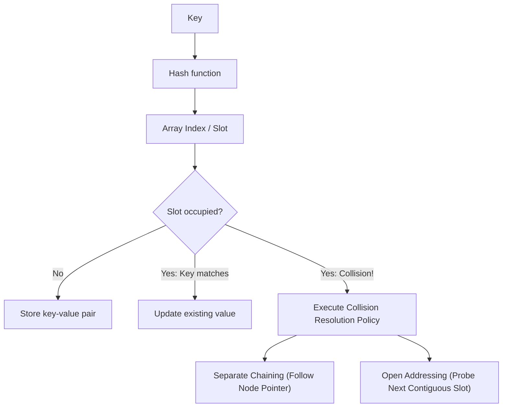

# Hash Tables and Collisions

> [!NOTE]
> A hash table stores keys in buckets or slots chosen by a hash function, providing expected $O(1)$ lookup, insertion, and deletion under a uniform distribution and bounded load factor. In production systems, performance is dominated by collision resolution strategy, memory layout, cache line utilization, and protection against adversarial collision attacks.

> [!TIP]
> The modern hash table story is not merely about "average $O(1)$." It is about how collisions are resolved in hardware: pointer-heavy chaining versus contiguous open addressing, branch predictability, SIMD-friendly metadata groups (Swiss Tables), and protection against HashDoS vulnerabilities.

---

## 1. Why This Matters

Hash tables are among the most critical data structures in computer science and software engineering.

They power:
- core dictionary and map primitives in modern programming languages
- compiler symbol tables and type registries
- database indexing and hash join engines
- in-memory caches (Redis, Memcached)
- routing tables, network packet deduplication, and connection tracking
- telemetry aggregation and frequency counting

The fundamental promise is deceptively simple:
- insert in expected $O(1)$
- query in expected $O(1)$
- delete in expected $O(1)$

However, real-world engineering reality demands far more:
- **L1/L2 cache line locality** and hardware stream prefetching
- **Branch misprediction penalties** during collision resolution
- **Heap allocation churn and fragmentation** (node-based vs. flat array)
- **Degradation behavior** under high load factors
- **Adversarial security**: Preventing HashDoS complexity attacks

This topic directly bridges our previous linear memory investigations:
- **Separate Chaining** behaves like an array of tiny linked lists, inheriting all the pointer-chasing and cache-miss overhead discovered in `linked-lists.md`.
- **Open Addressing** behaves like an engineered flat dynamic array, capitalizing on the sequential cache locality proven in `dynamic-arrays-and-strings.md`.

---

## 2. Core Intuition & Visual Model

A hash table maps arbitrary keys to bounded integer indices via a hash function.

### High-Level Flow
1. Compute the integer hash code: $h = \text{hash}(k)$.
2. Map the hash code into the table capacity: $\text{slot} = h \bmod m$ (or $h \mathbin{\&} (m - 1)$ for power-of-two tables).
3. Inspect the slot.
4. If occupied by a different key, resolve the collision according to the table's policy.

### Visual Model



Because the domain of potential keys is vastly larger than the table capacity, the Pigeonhole Principle guarantees that collisions **must occur**. The collision resolution architecture defines the performance and security of the entire data structure.

---

## 3. Mathematical Foundations

A hash table stores $n$ key-value pairs across $m$ physical slots or buckets.

### Load Factor ($\alpha$)

$$\alpha = \frac{n}{m}$$

- **Separate Chaining**: Can tolerate $\alpha > 1.0$, but average chain length grows proportionally with $\alpha$, degrading lookup latency linearly.
- **Open Addressing**: Strictly requires $\alpha < 1.0$. As $\alpha \to 1.0$, probe lengths diverge towards infinity. Production open-addressing tables enforce resize triggers at $\alpha \approx 0.65$ to $0.85$.

---

### 3.1 Hash Functions & The Avalanche Effect

A high-quality non-cryptographic hash function (e.g. SplitMix64, MurmurHash3, xxHash, Wyhash) must exhibit the **avalanche effect**:
- Inverting a single bit in the key should flip each output bit with probability $\approx 0.5$.
- Eliminates clustering caused by sequentially incrementing keys (`ID=1001, 1002, 1003`).

### 3.2 Simple Uniform Hashing Assumption (SUHA)

The theoretical baseline for hash table analysis assumes:
> Any given key is equally likely to hash into any of the $m$ slots, independently of where other keys hash.

Under SUHA:
- In separate chaining, expected bucket length is $\alpha$. Search time is $O(1 + \alpha)$.
- In open addressing with uniform probing, expected probes for an unsuccessful search is $\frac{1}{1 - \alpha}$.

### 3.3 Universal Hashing

A randomized family of hash functions $\mathcal{H}$ is **universal** if for any distinct keys $x \ne y$:

$$\Pr_{h \in \mathcal{H}}[h(x) = h(y)] \le \frac{1}{m}$$

Universal hashing ensures that no fixed input dataset can consistently force worst-case $O(n)$ behavior, providing mathematical resistance against adversarial attacks.

---

## 4. Collision Resolution Architectures

```text
Hash Table Collision Architectures
├── 1. Separate Chaining
│   ├── Linked-List Buckets (Classic std::unordered_map)
│   └── Small-Vector Buckets (Cache-friendly unrolled lists)
└── 2. Open Addressing (Flat Contiguous Memory)
    ├── Linear Probing: index + 1
    ├── Quadratic Probing: index + i^2
    ├── Double Hashing: index + i * hash2(key)
    ├── Robin Hood Hashing: Probe Sequence Length (PSL) variance equalization
    ├── Cuckoo Hashing: Constant O(1) worst-case lookups via multi-table eviction
    └── Swiss Tables (Abseil flat_hash_map): 16-slot SIMD SSE2 control byte probing
```

---

### 4.1 Separate Chaining

Each bucket contains a pointer to an external chain of entries.

#### Strengths
- Simple conceptual model; deletion is trivial ($O(1)$ node unlink).
- Gracefully tolerates temporary spikes where $\alpha > 1.0$.
- Node pointers and references remain permanently stable across table resizing.

#### The Physical Hardware Penalty
- **Heap Allocation Overhead**: Every insertion calls `malloc()` for an independent node.
- **Pointer Chasing**: Traversal causes serialized L1/L2 cache misses as the CPU waits for pointer dereferences.
- **Memory Overhead**: 16–24 bytes of pointers and allocator metadata per 8-byte payload (70%–80% RAM waste).

---

### 4.2 Open Addressing: Linear Probing

All elements live directly in a flat contiguous array. When collision occurs at slot $h(k)$, subsequent slots are probed sequentially:

$$P(k, i) = (h(k) + i) \bmod m \quad \text{for } i = 0, 1, 2, \dots$$

#### Why Contiguous Probing Wins on Hardware
- Probing adjacent array indices takes advantage of the CPU's **64-byte cache line**. Loading slot $i$ automatically loads the next several slots into L1 cache for free!
- Zero heap allocations during insertion (amortized).

#### The Primary Clustering Flaw
Contiguous runs of occupied slots form "islands". Any key that hashes anywhere into an island expands it, causing clusters to merge and probe times to degrade drastically as $\alpha > 0.70$.

---

### 4.3 Deletion in Open Addressing: Tombstones vs. Backward Shift

In open addressing, setting a deleted slot directly to `EMPTY` breaks search chains for keys placed downstream!

#### Strategy 1: Tombstone Markers (`DELETED`)
- Slot states: `EMPTY`, `OCCUPIED`, `DELETED`.
- Searches skip past `DELETED` slots; insertions can reclaim them.
- **Problem**: Tombstones accumulate over time, degrading query latency until a rehash occurs.

#### Strategy 2: Backward-Shift Deletion (Robin Hood / Modern Linear Probing)
- When a slot is removed, subsequent elements in the cluster that are not at their home position are shifted backward by 1 slot.
- Eliminates tombstones entirely, maintaining pristine contiguous clusters.

---

## 5. Advanced Production Hash Table Architectures

### 5.1 Robin Hood Hashing

Robin Hood hashing equalizes search costs across all keys by enforcing:
> *"Take from the rich (keys with short probe sequences) and give to the poor (keys with long probe sequences)."*

#### Insertion Algorithm
1. Track the **Probe Sequence Length (PSL)**: distance from a key's home bucket to its current slot.
2. When inserting key $K$ with probe count $p$, compare $p$ with the resident's PSL $p_{\text{resident}}$.
3. If $p > p_{\text{resident}}$:
   - Swap $K$ and the resident!
   - $K$ takes the slot; the displaced resident continues probing with PSL $p_{\text{resident}} + 1$.
4. Drastically compresses the variance of search times, turning catastrophic $O(n)$ tail latencies into predictable, tight bounds.

---

### 5.2 Cuckoo Hashing

Cuckoo hashing guarantees **deterministic worst-case $O(1)$ lookup time**.

- Uses two independent hash functions $h_1(k)$ and $h_2(k)$ mapping to two separate tables.
- A key $k$ can **only** ever reside in $T_1[h_1(k)]$ or $T_2[h_2(k)]$.
- **Lookup**: Inspect exactly 2 memory locations:
  $$\text{Lookup}(k) \implies \text{check } T_1[h_1(k)] \text{ and } T_2[h_2(k)] \quad \text{(Strictly 2 probes!)}$$
- **Insertion**: If $T_1[h_1(k)]$ is occupied, evict the resident and move it to its alternative position in $T_2$. If that slot is occupied, evict its resident recursively. If a cycle is detected, rehash the entire table.

---

### 5.3 Google Abseil Swiss Tables (`absl::flat_hash_map`)

Swiss Tables represent the current state-of-the-art in production hash tables:

```text
Swiss Table Memory Layout:
Metadata Control Bytes (1 byte per slot):
+----+----+----+----+----+----+----+----+----+----+----+----+----+----+----+----+
| C0 | C1 | C2 | C3 | C4 | C5 | C6 | C7 | C8 | C9 |C10 |C11 |C12 |C13 |C14 |C15 |
+----+----+----+----+----+----+----+----+----+----+----+----+----+----+----+----+
  └── Top 7 bits of hash (H2) or Sentinel (0b11111111 = EMPTY, 0b11111110 = DELETED)

Slots Array (Contiguous Key-Value Pairs):
+---------------------+---------------------+---------------------+-------------+
| Slot 0 (Key, Value) | Slot 1 (Key, Value) | Slot 2 (Key, Value) | ...         |
+---------------------+---------------------+---------------------+-------------+
```

1. **Separation of Control & Slots**: Stores a parallel array of 1-byte control metadata.
2. **Top-7 Hash Fingerprint**: The 7 most significant bits of the hash are stored in the control byte.
3. **128-bit SIMD SSE2 Probing**: Inspects 16 control bytes simultaneously using `_mm_cmpeq_epi8`:
   - Generates a 16-bit mask of matching candidate slots in a single CPU cycle.
   - The CPU only accesses the payload slot array when a fingerprint match is confirmed, eliminating 99% of useless cache line loads!
4. Operates with high performance at up to **$\alpha = 0.875$ load factor**.

---

## 6. Hardware Locality: Measured Empirical Evidence

> [!TIP]
> The choice between separate chaining and open addressing is not merely an algorithmic preference; it is a fundamental hardware memory-layout decision.

We compiled and executed [`benchmarks/chaining_vs_open_addressing.cpp`](../../benchmarks/chaining_vs_open_addressing.cpp) on Linux with $N = 3,000,000$ randomized 64-bit keys:

| Metric | Separate Chaining (`std::unordered_map`) | Open Addressing (Linear Probing) | Hardware Reality |
| :--- | :--- | :--- | :--- |
| **Insertion Time (3M keys)** | 997.15 ms | 272.74 ms | **Open Addressing is 3.66x faster to build** |
| **Lookup Time (3M hits)** | 258.39 ms | 134.25 ms | **Open Addressing is 1.92x faster** |
| **Memory Allocation Model** | 3,000,000 heap node allocations | Contiguous flat buffer | **Zero allocator churn** |

### Why Open Addressing Dominates
1. **Build Speed (3.66x Faster)**: `std::unordered_map` calls the glibc heap allocator 3 million times to instantiate individual linked-list bucket nodes. Open addressing performs zero heap allocations beyond initial buffer sizing.
2. **Lookup Speed (1.92x Faster)**: Open addressing probes sequentially within contiguous 64-byte L1 cache lines. Separate chaining incurs pointer-chasing latency and TLB misses on every bucket dereference.

---

## 7. Security: Hash Collision Denial-of-Service (HashDoS)

Standard non-cryptographic hash functions (MurmurHash, FNV, CRC32) are mathematically predictable.

### The Attack Vector
An attacker sends an HTTP POST request containing $50,000$ maliciously crafted form keys that all produce the identical hash code modulo $m$:

```text
All 50,000 keys hash to Bucket 0!
Bucket 0: [k1] -> [k2] -> [k3] -> ... -> [k50000]
```

- Every insertion and lookup degrades from $O(1)$ to $O(n)$.
- Inserting $n$ keys degrades from $O(n)$ to **$O(n^2)$ time complexity**.
- A small 2 MB HTTP payload can lock a web server CPU thread at 100% utilization for several minutes!

### Production Defenses
1. **SipHash (1-3 / 2-4)**: Cryptographically hardened, keyed pseudo-random function designed specifically for hash tables (default in Rust, Python 3.4+, Ruby, Swift, and Linux kernel).
2. **Randomized Per-Process Seeds**: Initializing the hash seed with high-entropy cryptographic randomness (`/dev/urandom`) on process startup prevents attackers from precomputing collision sets.

---

## 8. Key Operations & Architecture Matrix

| Architecture | Average Lookup | Worst Lookup | Load Factor ($\alpha$) Limit | Cache Locality | Memory Overhead | Primary Weakness |
| :--- | :--- | :--- | :--- | :--- | :--- | :--- |
| **Separate Chaining** | $O(1)$ | $O(n)$ | $\alpha > 1.0$ tolerated | Poor (node chasing) | High (pointers + alloc headers) | Allocator churn, cache misses |
| **Linear Probing** | $O(1)$ | $O(n)$ | $\alpha \le 0.70$ | **Optimal (sequential stream)** | Low (flat array) | Primary clustering |
| **Quadratic Probing**| $O(1)$ | $O(n)$ | $\alpha \le 0.50$ | Good | Low | Secondary clustering |
| **Robin Hood** | $O(1)$ | $O(n)$ | $\alpha \le 0.85$ | **Optimal** | Low | Higher insertion swap logic |
| **Cuckoo Hashing** | **$O(1)$ worst** | **$O(1)$** | $\alpha \le 0.50$ | Moderate (2 lookups) | Moderate | Rehash cycles during insertion |
| **Swiss Table** | $O(1)$ | $O(n)$ | $\alpha \le 0.875$ | **State-of-the-Art (SIMD)**| Minimal (1B metadata / slot) | Architecture-specific SIMD |

---

## 9. Verified Implementations

Tested reference implementations with full unit test coverage are live in the repository:
- **C++17 Implementation**: [`implementations/cpp/hash_table.cpp`](../../implementations/cpp/hash_table.cpp) (Linear probing, power-of-two bitwise masking, three-state tombstone lifecycle, dynamic 70% load factor rehashing).
- **Python Implementation**: [`implementations/python/hash_table.py`](../../implementations/python/hash_table.py) (Open addressing hash map with SplitMix64 mixing, tombstones, and `unittest` test suite).

### C++17 Reference Snippet (`HashTable`)

```cpp
template <typename Key, typename Value>
class HashTable {
public:
    enum class State : uint8_t { EMPTY, OCCUPIED, DELETED };
    struct Entry { Key key; Value val; State state{State::EMPTY}; };

private:
    std::vector<Entry> table_;
    std::size_t capacity_{16};
    std::size_t mask_{15};
    std::size_t size_{0};

public:
    bool insert(const Key& key, const Value& val) {
        if ((size_ + 1) * 10 >= capacity_ * 7) rehash(capacity_ * 2);

        std::size_t idx = hash_key(key) & mask_;
        std::size_t target_slot = capacity_;

        while (table_[idx].state != State::EMPTY) {
            if (table_[idx].state == State::OCCUPIED && table_[idx].key == key) {
                table_[idx].val = val; // Update
                return false;
            }
            if (table_[idx].state == State::DELETED && target_slot == capacity_) {
                target_slot = idx; // Reuse first tombstone
            }
            idx = (idx + 1) & mask_;
        }
        if (target_slot == capacity_) target_slot = idx;

        table_[target_slot] = {key, val, State::OCCUPIED};
        ++size_;
        return true;
    }
};
```

---

## 10. When NOT to Use Hash Tables

1. **Ordered / Range Traversal Required**: Hash tables completely destroy key order. For range queries ($[k_1, k_2]$), use a **B-Tree** (`b-trees-and-b-plus-trees.md`) or **Red-Black Tree**.
2. **Strict Deterministic Real-Time Deadlines**: Periodic $O(n)$ rehashing causes latency spikes that violate hard real-time guarantees.
3. **Extremely Small Datasets ($N \le 16$)**: A flat, linear sorted array scanned via SIMD will beat a hash table due to zero hashing overhead.

---

## 11. Implementation Traps & Pitfalls

### 1. The `hashCode()` and `equals()` Contract Violation
In Java, Python, and C++:
> If `k1 == k2`, then `hash(k1)` **must** equal `hash(k2)`.
Breaking this contract leads to phantom keys that can be inserted but never found.

### 2. Mutating Keys In-Place
Modifying an object while it is used as a hash key alters its hash code. The table will search its new bucket while the key remains stranded in its original bucket.

### 3. Floating-Point Keys (`NaN` and `-0.0`)
According to IEEE-754, `NaN != NaN`. Inserting `NaN` into a hash table can result in keys that can never be retrieved or deduplicated.

---

## 12. Curated Problems & Practice

| Problem | Platform | Difficulty | Core Concept |
| :--- | :--- | :--- | :--- |
| **[LeetCode 1 — Two Sum](https://leetcode.com/problems/two-sum/)** | LeetCode | Easy | Complement lookup in expected $O(1)$ |
| **[LeetCode 49 — Group Anagrams](https://leetcode.com/problems/group-anagrams/)** | LeetCode | Medium | Canonical hash key representation |
| **[LeetCode 706 — Design HashMap](https://leetcode.com/problems/design-hashmap/)** | LeetCode | Medium | Collision resolution and dynamic resizing |
| **[LeetCode 146 — LRU Cache](https://leetcode.com/problems/lru-cache/)** | LeetCode | Medium | Hash map + Doubly Linked List integration |

---

## 13. Further Reading & Cross-References

- **Linear Memory Primitives**:
  - [`dynamic-arrays-and-strings.md`](../04-linear-data-structures/dynamic-arrays-and-strings.md) — Contiguous arrays and geometric growth policies.
  - [`linked-lists.md`](../04-linear-data-structures/linked-lists.md) — Node allocation costs and pointer-chasing overhead.
- **Hardware Architecture**:
  - [`cpu-cache-and-memory.md`](../03-machine-model-and-performance/cpu-cache-and-memory.md) — Spatial locality and cache line transfers.
- **Next in Cluster A**:
  - [`bloom-and-cuckoo-filters.md`](bloom-and-cuckoo-filters.md) — Space-efficient probabilistic membership testing.
  - [`skip-lists.md`](skip-lists.md) — Probabilistic alternatives to balanced trees.
