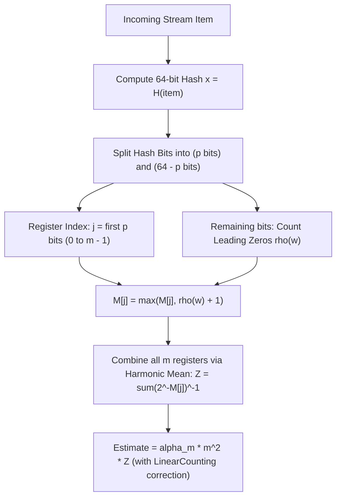
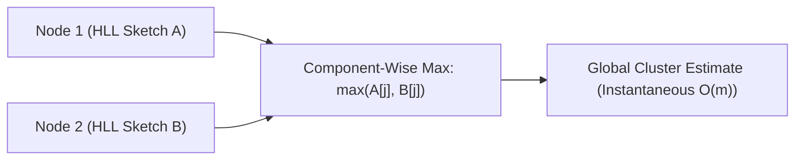

# HyperLogLog and Cardinality Estimation

> [!NOTE]
> **The Log-Log Revolution in Big Data:**
> The **Count-Distinct (Cardinality Estimation)** problem asks:
> *Given a data stream of $N$ items with duplicates, how many unique elements are present?*
> Storing exact unique keys in a hash table requires $O(N)$ memory (gigabytes or terabytes for web-scale datasets).
> **HyperLogLog (Flajolet et al., 2007)** estimates the cardinality of billions of items with a standard error of **$\approx 1.04 / \sqrt{m}$** using only **$1.5\text{ KB}$ of memory**!

> [!TIP]
> **Core Intuition: Coin Flips and Leading Zeros:**
> Imagine flipping a fair coin until you see Heads.
> * Getting 1 Tails before Heads ($TH$) happens with probability $1/4$.
> * Getting 20 consecutive Tails before Heads ($T^{20}H$) happens with probability $1/2^{20} \approx 10^{-6}$.
> If you observe a run of 20 consecutive Tails, you can infer that you probably flipped the coin $\approx 2^{20} \approx 1,000,000$ times!
> In HyperLogLog, a uniform 64-bit hash acts as a random coin sequence. The maximum number of leading zeros observed indicates the order of magnitude of distinct items.

> [!WARNING]
> **Harmonic Mean Mitigates Outlier Distortions:**
> A single random fluke item with 40 leading zeros would catastrophically distort a geometric or arithmetic average.
> HyperLogLog uses the **Harmonic Mean** of $2^{\text{register}}$ across $m = 2^p$ sub-streams, which effectively dampens the effect of extreme outliers.

---

## 1. The Mathematical Engine

Let $p$ be the precision parameter. The number of registers is $m = 2^p$.
For 64-bit hashes, typical precision is $p = 14 \implies m = 16,384$ registers.
Each register stores numbers up to $64$, requiring only **6 bits per register** ($16,384 \times 6\text{ bits} = 12\text{ KB}$, or 1 byte per register = $16\text{ KB}$).

### 1.1 Register Update
For each item in the stream:
1. $x = \text{Hash64}(\text{item})$.
2. $j = x \gg (64 - p)$ (first $p$ bits).
3. $w = x \ \& \ ((1\text{ULL} \ll (64 - p)) - 1)$ (remaining $64 - p$ bits).
4. $\rho(w) = \text{leading\_zeros}(w) + 1$.
5. $M[j] = \max(M[j], \rho(w))$.

### 1.2 Harmonic Mean Estimator
$$E = \alpha_m \cdot m^2 \cdot \left( \sum_{j=1}^m 2^{-M[j]} \right)^{-1}$$
Where the normalization constant $\alpha_m$ corrects systematic bias:
$$\alpha_m = \begin{cases} 
0.673 & \text{for } m = 16 \\
0.697 & \text{for } m = 32 \\
0.709 & \text{for } m = 64 \\
\frac{0.7213}{1 + 1.079/m} & \text{for } m \ge 128 
\end{cases}$$

---

## 2. Small and Large Range Corrections

1. **Small Range Correction (Linear Counting):**
   When $E \le \frac{5}{2}m$ and there are empty registers ($V = \text{count}(M[j] == 0) > 0$):
   $$E^* = m \ln\left(\frac{m}{V}\right)$$
   Linear counting is far more accurate for small numbers of distinct keys.
2. **Large Range Correction (64-bit Hashes):**
   When using 64-bit hash functions, hash collisions are negligible up to $N \approx 2^{60}$, rendering 32-bit overflow corrections obsolete.

---

## 3. Mergeability of Sketches (MapReduce Friendly)

HyperLogLog is an **idempotent, commutative monoid under component-wise maximum**:
Given two sketches $M_A$ and $M_B$ computed over distinct partitions:
$$M_{A \cup B}[j] = \max(M_A[j], M_B[j]) \quad \forall j \in \{0, \dots, m-1\}$$
This allows distributed systems (Presto, BigQuery, Redis) to compute unique visitor counts across 10,000 servers in parallel and merge them in **$O(m)$ microseconds** with zero loss of accuracy!

---

## 4. Precision vs Memory Tradeoff

The standard error of HyperLogLog is:
$$\text{SE} \approx \frac{1.04}{\sqrt{m}} = \frac{1.04}{2^{p/2}}$$

| Precision $p$ | Registers $m = 2^p$ | Memory Footprint (8-bit storage) | Relative Error ($\pm \text{SE}$) |
| :--- | :--- | :--- | :--- |
| **$p = 10$** | $1,024$ | $1\text{ KB}$ | $\approx 3.25\%$ |
| **$p = 12$** | $4,096$ | $4\text{ KB}$ | $\approx 1.63\%$ |
| **$p = 14$ (Redis standard)** | $16,384$ | $12 - 16\text{ KB}$ | $\approx 0.81\%$ |
| **$p = 16$** | $65,536$ | $64\text{ KB}$ | $\approx 0.40\%$ |

---

## 5. Curated References

1. **Flajolet, Fusy, Gandouet, Meunier (2007):** *HyperLogLog: the analysis of a near-optimal cardinality estimation algorithm*. Discrete Mathematics & Theoretical Computer Science.
2. **Heule, Nunkesser, Hall (2013):** *HyperLogLog in Practice: Algorithmic Engineering of a State of The Art Cardinality Estimation Algorithm*. Google.
3. **Redis Documentation:** *Redis HyperLogLog (PFADD, PFCOUNT, PFMERGE)*.
