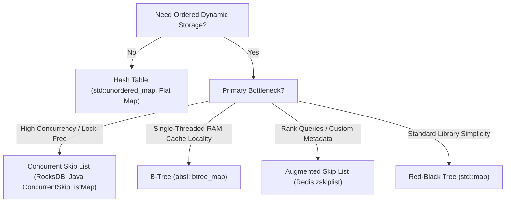

# Skip Lists

> [!NOTE]
> A skip list is a probabilistically balanced ordered data structure built from multiple linked-list levels. It supports expected $O(\log n)$ search, insertion, and deletion by using sparse upper “express lanes” over a dense bottom list.
> 
> Reference implementations: [C++17 Implementation](../../implementations/cpp/skip_list.cpp) | [Python Implementation](../../implementations/python/skip_list.py)

> [!TIP]
> The key idea is simple: instead of maintaining strict balance with rotations like an AVL or Red-Black tree, a skip list uses random level promotion to achieve logarithmic behavior in expectation.

> [!WARNING]
> Skip lists are not “faster than balanced trees because they are randomized.” Their main advantages are simpler maintenance logic, elegant locality of pointer updates, and superior adaptability to concurrent and lock-free designs. They still pay pointer-chasing and cache-miss penalties compared to contiguous arrays and B-trees.

---

## 1. Why This Matters

Many applications need an **ordered** dynamic set or map.

They need operations like:
- search by key
- insert and delete by key
- predecessor and successor queries
- range scans
- rank queries
- ordered iteration

Balanced binary search trees solve this with deterministic invariants, but they bring:
- tree rotations
- balance-factor or color rules
- complex rebalancing edge cases
- difficult concurrent updates (cascading tree restructurings)

Skip lists offer a different philosophy:

- use randomness instead of strict deterministic balancing
- keep algorithms simple and localized
- achieve expected $O(\log n)$ performance
- support ordered traversal naturally
- adapt exceptionally well to concurrent and lock-free designs

That is why skip lists matter both academically and practically.

They appear in real systems such as:
- **Redis sorted sets (`zset`)**: Combining a hash table with Salvatore Sanfilippo's `zskiplist`
- **LevelDB and RocksDB memtables**: `ConcurrentSkipList` as an ordered, lock-free in-memory write buffer
- **Concurrent ordered sets and maps**: High-throughput multi-producer/multi-consumer systems
- **Lock-free data structure research**: Fraser, Harris, and Michael non-blocking algorithms

They are also one of the cleanest examples of **probabilistic balancing**: performance comes not from maintaining a rigid shape, but from choosing node heights randomly so that the structure is balanced in expectation.

---

## 2. Core Intuition & Visual Model

A skip list is a stack of linked lists.

- The bottom level (Level 0) contains **all** keys in sorted order.
- Higher levels contain only a subset of keys.
- Each higher level acts like an express lane for the levels below.

### Intuition
Imagine searching in an ordinary sorted linked list:
- you must walk node by node linearly ($O(n)$ steps).

Now imagine adding sparse “fast lanes” above it:
- move quickly across large gaps at upper levels
- drop down when going too far would overshoot
- continue at a lower level with finer granularity

That is exactly how skip lists work.

### ASCII diagram

```text
Level 3:  head -------------------------- 20 ------------------------------------------- 60 --------> NIL
Level 2:  head ----------- 10 ----------- 20 ----------------------- 40 --------------- 60 --------> NIL
Level 1:  head ----- 5 --- 10 --- 15 --- 20 ----------- 30 ------- 40 ----------- 50 -- 60 --- 70 --> NIL
Level 0:  head - 2 - 5 - 8 - 10 - 15 --- 20 - 25 ----- 30 - 35 --- 40 ----- 45 - 50 -- 60 - 65 - 70 -> NIL
```

### Search for 25
1. Start at head on the highest active level (Level 3).
2. Look ahead: Next is 20 ($20 < 25$), so advance to 20. Look ahead: Next is 60 ($60 > 25$), overshoot!
3. Drop down to Level 2 at node 20. Look ahead: Next is 40 ($40 > 25$), overshoot!
4. Drop down to Level 1 at node 20. Look ahead: Next is 30 ($30 > 25$), overshoot!
5. Drop down to Level 0 at node 20. Look ahead: Next is 25 ($25 == 25$), target found!

This gives a search path that is substantially shorter than scanning the full bottom list.

### Mental model
A skip list is:
- an ordered linked structure
- with multiple height levels
- where higher levels are progressively sparser summaries of the lower levels

---

## 3. Formal Definition & Invariants

A skip list stores keys in sorted order using nodes of varying heights.

Each node:
- stores a key, and optionally an associated value
- stores a tower of forward pointers across levels $0$ through $h-1$
- may also store backward pointers or span metadata in specialized implementations (e.g., Redis)

### Core invariants

1. **Sorted-order invariant**  
   Every level is sorted by key in strictly increasing order.

2. **Tower invariant**  
   If a node appears at level $i$, it also appears at every lower level $0, 1, \dots, i-1$.

3. **Base-level completeness invariant**  
   Level 0 contains all keys present in the data structure.

4. **Search-path invariant**  
   Search moves right while safe, then down, preserving correctness because each level remains sorted.

5. **Head-level invariant**  
   The head sentinel node spans all currently active levels (up to `MAX_LEVEL`).

6. **Probabilistic-height invariant**  
   Node heights are sampled from a geometric distribution with promotion probability $p$.

These invariants are sufficient to support ordered dictionary operations.

---

## 4. Theoretical Foundations & Probability

This is the mathematical heart of skip lists.

### 4.1 William Pugh’s geometric level generation

The classic skip-list design, introduced by William Pugh in 1989, assigns each node a random height using repeated Bernoulli promotion.

The generative process is:
- Level 1 always exists (the node participates in the base list).
- While an independent coin flip succeeds with probability $p$, promote the node one level higher.

Then the probability that a node reaches height at least $i$ is:

$$
\Pr(\text{height} \ge i) = p^{i-1} \quad (i \ge 1)
$$

Consequently:
- higher towers become exponentially rarer
- lower levels are dense
- upper levels are sparse

#### Common choices
Two classical promotion probabilities are:
- $p = 0.5$ (like fair coin tosses: each level has half the nodes of the level below)
- $p = 0.25$ (each level has one-fourth the nodes of the level below)

These create distinct space-time tradeoffs.

---

### 4.2 Expected pointers per node

If the node height distribution is geometric, the expected number of levels per node is:

$$
E[\text{height}] = \sum_{i=1}^{\infty} \Pr(\text{height} \ge i) = \sum_{i=1}^{\infty} p^{i-1} = \frac{1}{1-p}
$$

This represents the expected number of forward pointers per node in a standard skip list.

#### Concrete Examples
For $p = 0.5$:

$$
\frac{1}{1-0.5} = 2.0
$$

We expect an average of 2 forward pointers per node.

For $p = 0.25$:

$$
\frac{1}{1-0.25} = \frac{4}{3} \approx 1.33
$$

So $p=0.25$ uses significantly less pointer memory, but creates sparser upper levels and slightly longer search paths.

#### Space-time tradeoff
- larger $p$ ($0.5$): more levels, higher memory usage, shorter search paths.
- smaller $p$ ($0.25$): fewer levels, reduced memory footprint, slightly longer search paths.

This is one of the cleanest design knobs in probabilistic data structures.

---

### 4.3 Maximum level capping

In practice, implementations cap the maximum height to avoid unbounded tower growth.

A standard choice is to set:

$$
\text{MAX\_LEVEL} \approx \log_{1/p} n
$$

because the expected number of nodes reaching that height is approximately 1.

#### Derivation
A node reaches level $L$ with probability $p^{L-1}$. Among $n$ nodes, the expected number of nodes at height at least $L$ is:

$$
E[N_{\ge L}] = n \cdot p^{L-1}
$$

Setting this expectation to 1:

$$
n \cdot p^{L-1} = 1 \implies L - 1 = \log_{1/p} n \implies L \approx \log_{1/p} n
$$

For $n = 65{,}536$ and $p = 0.5$, $\text{MAX\_LEVEL} \approx 16$. For $n = 10^7$ and $p = 0.5$, $\text{MAX\_LEVEL} \approx 24$ to $32$. Capping at 16 or 32 guarantees bounded array sizes for predecessor tracking while ensuring logarithmic efficiency.

---

### 4.4 Backward-analysis intuition for expected $O(\log n)$ search

The classic skip-list search starts at the top-left and moves:
- right while possible
- down when necessary

A clean way to analyze this is **backward**.

Imagine starting from the search target position at level 0 and tracing the successful search path **backward** toward the head sentinel:
- At each node, we either came from the left (at the same level) or from above (meaning this node was promoted to this level).
- When tracing backward, if the node does not extend to the level above, we must have come from the left. This event happens with probability $1-p$.
- If the node *does* extend to the level above, we climb up one level. This happens with probability $p$.

The number of left-steps before climbing up behaves like a geometric random variable with parameter $p$, having mean:

$$
E[\text{left-steps per level}] = \frac{1-p}{p}
$$

For $p = 0.5$, $\frac{1-0.5}{0.5} = 1$ horizontal step per level on average. Even under loose bounds, the expected horizontal work per level is strictly constant:
- about 2 steps for $p=0.5$
- about 4 steps for $p=0.25$

The expected number of levels is:

$$
O(\log_{1/p} n)
$$

Multiplying:
- constant expected horizontal work per level
- logarithmically many levels

yields:

$$
E[\text{search cost}] = O(\log n)
$$

#### Key Takeaway
The skip list is not perfectly balanced at every instant. It is balanced **in expectation** because geometric promotion makes tall nodes sparse in precisely the right proportion.

---

## 5. Core Algorithmic Mechanics

### 5.1 Search path traversal

Search begins at the highest active level of the head node.

At each level:
1. While the next node exists and its key is less than the target, move right.
2. When moving right would overshoot (next key $\ge$ target or next is `nullptr`), move down one level.
3. Continue until reaching level 0.

If the candidate node immediately following at level 0 matches the target key, the key is found.

#### Invariant preservation
Each level is sorted, so moving right never skips a possible smaller key. Dropping down preserves the invariant that the target, if present, must lie strictly to the right of the current position.

---

### 5.2 Insertion with predecessor update vector

Insertion is one of the most elegant operations in modern data structure design.

```text
Target Key: 25
Level 2:  head(update[2]) ----------------------------> 40
Level 1:  head ----------- 10(update[1]) -------------> 40
Level 0:  head --- 5 ----- 10 --- 20(update[0]) ------> 40
                                        ^
                               Insert [25] here
```

#### Step 1: Search and record predecessors
During search, maintain an array:
```text
update[MAX_LEVEL]
```
where `update[i]` stores the pointer to the last node visited on level $i$ before the insertion position.

#### Step 2: Sample random height
Generate the new node’s height using geometric promotion. If the new level exceeds the current list level, initialize `update` references for those newly active levels to point to `head`.

#### Step 3: Splice pointers
For each level $i \in [0, \text{node\_level}-1]$:
```text
new_node->forward[i] = update[i]->forward[i];
update[i]->forward[i] = new_node;
```

This is purely localized pointer rewiring—no tree rotations, no balance factors, no recoloring.

---

### 5.3 Deletion

Deletion follows the identical search phase to populate `update[MAX_LEVEL]`.

If the candidate node at Level 0 matches the target:
1. For every level $i$ where `update[i]->forward[i] == target_node`:
   ```text
   update[i]->forward[i] = target_node->forward[i];
   ```
2. Free/reclaim `target_node`.

#### Dynamic head-level pruning
After deletion, the highest levels may become empty (pointing only to `nullptr`). Implementations prune the active level count downward:
```text
while (current_level > 1 && head->forward[current_level - 1] == nullptr) {
    --current_level;
}
```
This keeps the skip list compact and prevents wasting clock cycles traversing empty top layers.

---

## 6. Complexity Summary

| Operation | Average Case | Worst Case | Space (Auxiliary) | Description |
| :--- | :--- | :--- | :--- | :--- |
| **Search** | $O(\log n)$ expected | $O(n)$ | $O(1)$ | Traverse right on express lanes, down on overshoots |
| **Insert** | $O(\log n)$ expected | $O(n)$ | $O(\log n)$ | Search + populate `update[]` + local pointer rewiring |
| **Delete** | $O(\log n)$ expected | $O(n)$ | $O(\log n)$ | Search + bypass target across active levels + prune head |
| **Ordered Iteration** | $O(n)$ | $O(n)$ | $O(1)$ | Sequential scan across Level 0 |
| **Range Scan** | $O(\log n + k)$ expected | $O(n)$ | $O(1)$ | Seek lower bound in $O(\log n)$, then walk $k$ nodes on Level 0 |
| **Predecessor / Successor** | $O(\log n)$ expected | $O(n)$ | $O(1)$ | Follow search path down to Level 0 |

> [!NOTE]
> Worst-case $O(n)$ occurs only when all coin flips degenerate to level 1 or maximum height, an event with probability exponentially close to zero ($p^n$).

---

## 7. Canonical Diagram of Express Lanes

```text
Top sparse level (L3):       head -------------------------------- 40 ----------------------------------------------> NIL
Middle level (L2):           head --------------- 20 ------------ 40 ----------------------- 70 --------------------> NIL
Lower-middle level (L1):     head ----- 10 ------ 20 ----- 30 ---- 40 ----- 50 ----- 60 ----- 70 ----- 80 ---------> NIL
Base dense level (L0):       head - 5 - 10 - 15 - 20 - 25 - 30 - 35 - 40 - 45 - 50 - 55 - 60 - 70 - 75 - 80 - 90 -> NIL
```

### Path to locate key 35:
1. **At L3**: Check head $\to$ 40 ($40 > 35$). Drop down to L2.
2. **At L2**: Check head $\to$ 20 ($20 < 35$). Advance to 20. Check 20 $\to$ 40 ($40 > 35$). Drop down to L1.
3. **At L1**: Check 20 $\to$ 30 ($30 < 35$). Advance to 30. Check 30 $\to$ 40 ($40 > 35$). Drop down to L0.
4. **At L0**: Check 30 $\to$ 35 ($35 == 35$). Target found in 5 pointer traversals instead of 8 linear hops.

---

## 8. Skip Lists vs. Balanced BSTs

| Feature | Skip List | Balanced BST (AVL / Red-Black) | B-Tree / B+ Tree |
| :--- | :--- | :--- | :--- |
| **Balancing Mechanism** | Probabilistic (geometric coin flips) | Deterministic (rotations, coloring, heights) | Deterministic (node splits, merges, borrowing) |
| **Search Guarantee** | $O(\log n)$ expected | $O(\log n)$ worst-case | $O(\log_B n)$ worst-case |
| **Implementation Complexity** | Low (~100 lines of code) | High (complex rotation edge cases) | High (block serialization, binary search in page) |
| **Concurrency / Lock-Freedom** | Exceptional (localized CAS on forward pointers) | Very Poor (rotations require multi-node locks) | Moderate (latch crabbing down the tree) |
| **Memory Locality** | Poor (scattered heap nodes, pointer chasing) | Poor (scattered tree nodes) | Outstanding (cache-line and page friendly) |
| **Metadata per Node** | $\frac{1}{1-p}$ forward pointers | 2 child pointers + 1 byte (color/balance) | Array of keys + child pointers |

### 8.1 Simplicity vs. Rotations
Balanced BSTs maintain strict structural invariants:
- **AVL Trees**: Subtree height difference at most 1.
- **Red-Black Trees**: No two consecutive red nodes, equal black-height on all root-to-leaf paths.

Restoring these invariants requires single/double rotations and recoloring cascades that touch up to 5 nodes simultaneously. Skip lists replace global rebalancing with independent local random variables: no node update ever cascades structural rewrites to unrelated parts of the list.

### 8.2 Concurrency and Lock-Freedom
This is the single greatest systems advantage of skip lists.

Concurrent balanced BSTs are notoriously difficult to scale: an insertion at a leaf can trigger rotations propagating up to the root, requiring coarse-grained locks or complex multi-version locking.

In contrast, skip list operations modify only a sequence of forward pointers:
- Fraser (2004), Harris (2001), and Michael (2002) developed practical **lock-free skip lists**.
- Updates use standard Atomic Compare-And-Swap (`std::atomic::compare_exchange_weak`) on individual forward pointer words.
- Logical deletion is marked by tagging the lowest bit of the forward pointer (`marked reference`), followed by physical unlinking by concurrent traversers.
- Readers proceed completely without locks or memory fences on read paths.

---

## 9. Production Systems Case Studies

### 9.1 Redis Sorted Sets (`zset`) and `zskiplist`

Redis sorted sets store unique string members scored by floating-point values. They provide fast $O(1)$ member lookups alongside $O(\log n)$ score ranges and rank operations.

Redis implements this via a dual structure:
1. `dict`: A hash table mapping `member -> score` for $O(1)$ `ZSCORE`.
2. `zskiplist`: A custom skip list defined in `server.h` ordered by `(score, member)` for range and rank queries.

```c
/* Redis server.h: zskiplist node definition */
typedef struct zskiplistNode {
    sds ele;
    double score;
    struct zskiplistNode *backward;
    struct zskiplistLevel {
        struct zskiplistNode *forward;
        unsigned long span;
    } level[];
} zskiplistNode;
```

#### Why the `backward` pointer matters
Each node has a single Level 0 `backward` pointer. This allows $O(1)$ step-back navigation, powering commands like `ZREVRANGE` and `ZREVRANGEBYSCORE` without auxiliary stack allocation.

#### Why the `span` field is genius
Each level stores a `span` value: the exact count of Level 0 nodes skipped over by that forward pointer.
- When searching for an element, summing the `span` values along the search path yields the 1-based rank (`ZRANK`) in $O(\log n)$ time.
- Finding the $k$-th element (`ZRANGE by rank`) takes $O(\log n)$ time by accumulating spans until reaching $k$.

Without `span`, rank queries would degenerate to $O(n)$ sequential walks.

---

### 9.2 LSM-Tree MemTables in LevelDB and RocksDB

In Log-Structured Merge (LSM) storage engines (LevelDB, RocksDB, Apache Cassandra), incoming writes are appended sequentially to a Write-Ahead Log (WAL) and concurrently inserted into an in-memory **MemTable**.

#### Requirements for a MemTable:
- Concurrent high-throughput insertions without lock contention.
- Ordered range iteration to flush data to disk as sorted SSTables (Sorted String Tables).
- Concurrent read access while writes are active.

#### Why RocksDB uses `ConcurrentSkipList`:
- Reader threads require **zero locks** and no atomic operations on traversal—they simply read forward pointers with memory barriers.
- Insertions allocate from an arena allocator (`Arena`), avoiding heap fragmentation.
- When the MemTable reaches capacity (e.g., 64 MB), it becomes immutable and is cleanly scanned sequentially via Level 0 to write the SSTable file at sequential I/O speed.

---

## 10. Hardware Locality & Practical Engineering Tradeoffs

Skip lists are mathematically elegant, but modern hardware imposes physical realities:

```text
Flat Array / B-Tree:  [ K0 | K1 | K2 | K3 | K4 | K5 | K6 | K7 ]  <-- 1 Cache Line (64 Bytes)
Skip List:            [Node A] ----chase----> [Node B] ----chase----> [Node C]
                      (0x1040)               (0x8920)               (0x3100)
                      Cache Miss!            Cache Miss!            Cache Miss!
```

### 10.1 Pointer Chasing and Cache Misses
Like all node-based structures, skip lists suffer from spatial fragmentation:
- Nodes allocated independently across the heap reside in disjoint memory pages.
- Hardware prefetchers fail because memory strides are irregular.
- Traversing a skip list incurs $O(\log n)$ sequential L1/L2/L3 cache misses.

For purely single-threaded in-memory workloads, cache-conscious structures like **B-Trees** (`absl::btree_set`, `stx::btree`) or flat sorted arrays frequently outperform skip lists by 2x to 5x.

### 10.2 Decision Matrix: Choosing the Right Structure



---

## 11. Reference Implementations

The full, verified, unit-tested implementations are available in the repository:
- **C++17 Reference**: [`implementations/cpp/skip_list.cpp`](../../implementations/cpp/skip_list.cpp)
- **Python Reference**: [`implementations/python/skip_list.py`](../../implementations/python/skip_list.py)

### 11.1 C++17 Production-Grade Reference

```cpp
#include <vector>
#include <random>
#include <limits>
#include <memory>

template <typename Key, typename Value>
class SkipList {
private:
    struct Node {
        Key key;
        Value value;
        std::vector<Node*> forward;

        Node(Key k, Value v, int level)
            : key(k), value(v), forward(level, nullptr) {}
    };

    static constexpr int MAX_LEVEL = 16;
    static constexpr float P = 0.5f;

    int level_;
    Node* head_;
    std::mt19937 rng_;
    std::uniform_real_distribution<float> dist_;

    int random_level() {
        int lvl = 1;
        while (lvl < MAX_LEVEL && dist_(rng_) < P) {
            ++lvl;
        }
        return lvl;
    }

public:
    SkipList()
        : level_(1),
          head_(new Node(std::numeric_limits<Key>::min(), Value{}, MAX_LEVEL)),
          rng_(1337),
          dist_(0.0f, 1.0f) {}

    ~SkipList() {
        Node* curr = head_;
        while (curr) {
            Node* next = curr->forward[0];
            delete curr;
            curr = next;
        }
    }

    bool search(const Key& key, Value& out_val) const {
        Node* curr = head_;
        for (int i = level_ - 1; i >= 0; --i) {
            while (curr->forward[i] && curr->forward[i]->key < key) {
                curr = curr->forward[i];
            }
        }
        curr = curr->forward[0];
        if (curr && curr->key == key) {
            out_val = curr->value;
            return true;
        }
        return false;
    }

    void insert(const Key& key, const Value& val) {
        std::vector<Node*> update(MAX_LEVEL, nullptr);
        Node* curr = head_;

        for (int i = level_ - 1; i >= 0; --i) {
            while (curr->forward[i] && curr->forward[i]->key < key) {
                curr = curr->forward[i];
            }
            update[i] = curr;
        }

        curr = curr->forward[0];
        if (curr && curr->key == key) {
            curr->value = val; // Update existing key
            return;
        }

        int node_level = random_level();
        if (node_level > level_) {
            for (int i = level_; i < node_level; ++i) {
                update[i] = head_;
            }
            level_ = node_level;
        }

        Node* new_node = new Node(key, val, node_level);
        for (int i = 0; i < node_level; ++i) {
            new_node->forward[i] = update[i]->forward[i];
            update[i]->forward[i] = new_node;
        }
    }

    bool erase(const Key& key) {
        std::vector<Node*> update(MAX_LEVEL, nullptr);
        Node* curr = head_;

        for (int i = level_ - 1; i >= 0; --i) {
            while (curr->forward[i] && curr->forward[i]->key < key) {
                curr = curr->forward[i];
            }
            update[i] = curr;
        }

        curr = curr->forward[0];
        if (!curr || curr->key != key) return false;

        for (int i = 0; i < level_; ++i) {
            if (update[i]->forward[i] != curr) break;
            update[i]->forward[i] = curr->forward[i];
        }

        delete curr;

        while (level_ > 1 && head_->forward[level_ - 1] == nullptr) {
            --level_;
        }
        return true;
    }
};
```

---

## 12. Curated Problems & Further Reading

### Curated Practice Problems
1. **LeetCode 1206 — Design Skiplist** *(Hard)*
   - The definitive interview problem on skip list construction without library containers.
   - Key test: Ensure clean boundary handling on `erase` when a key exists across multiple levels.
2. **Rank Query Extension (Redis `zskiplist` exercise)** *(Advanced)*
   - Augment the canonical C++ implementation with a `span` integer per forward pointer.
   - Implement `find_rank(key)` and `find_by_rank(rank)` in $O(\log n)$ time.
3. **Concurrent Lock-Free Skip List** *(Expert / Systems)*
   - Study Maurice Herlihy & Nir Shavit's *The Art of Multiprocessor Programming* (Chapter 14).
   - Implement logical deletion marking with `std::atomic<Node*>`.

### Internal Encyclopedia Links
- [`hash-tables-and-collisions.md`](hash-tables-and-collisions.md) — Unordered expected $O(1)$ alternative
- [`bloom-and-cuckoo-filters.md`](bloom-and-cuckoo-filters.md) — Probabilistic membership testing
- [`linked-lists.md`](../04-linear-data-structures/linked-lists.md) — Fundamental pointer structures
- [`choosing-the-right-data-structure.md`](../22-benchmarking-and-tradeoffs/choosing-the-right-data-structure.md) — Decision matrix across memory hierarchies
- [`theoretical-vs-practical-performance.md`](../22-benchmarking-and-tradeoffs/theoretical-vs-practical-performance.md) — Big-O vs. CPU cache realities
