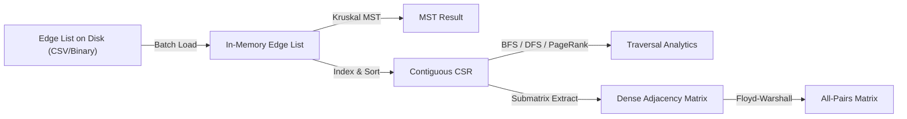

# Graph Representations

> [!NOTE]
> Graph algorithms do not execute on mathematical abstractions; they operate on concrete memory layouts. The chosen representation dictates algorithmic time complexity, space overhead, CPU cache locality, and serialization simplicity. The four classical explicit data structures are the **Adjacency Matrix**, **Adjacency List**, **Edge List**, and **Compressed Sparse Row (CSR / Forward Star)**, complemented by **Implicit Graphs** for geometry and state-space exploration.
>
> Reference implementations: [C++17 Implementation](../../implementations/cpp/graph_representations.cpp) | [Python Implementation](../../implementations/python/graph_representations.py)

> [!TIP]
> **Representation Decision Guide:**
>
> ```text
> Is the graph dense (E ≈ V^2) OR is O(1) edge lookup critical?
>    |---> YES: Adjacency Matrix [O(V^2) space, O(1) lookup]
>    +---> NO:  Are edges processed globally in bulk (e.g., Kruskal, Bellman-Ford)?
>                 |---> YES: Edge List [O(E) space, sequential scan]
>                 +---> NO:  Is the graph large, sparse, and static/read-mostly?
>                              |---> YES: Compressed Sparse Row (CSR) [O(V + E) space, optimal cache locality]
>                              +---> NO:  Does the graph mutate dynamically?
>                                           |---> YES: Adjacency List [O(V + E) space, easy dynamic insertion]
>                                           +---> NO:  Can neighbors be derived from rules (e.g. grids/puzzles)?
>                                                        |---> Implicit Graph [Zero auxiliary edge storage]
> ```

> [!WARNING]
> **Systems Engineering Pitfalls:**
> 1. **Matrix Bloat on Sparse Graphs**: Allocating a $100,000 \times 100,000$ matrix requires $\approx 80 \text{ GB}$ of RAM, even if the graph only contains $200,000$ edges. Always default to adjacency lists or CSR for sparse graphs.
> 2. **Vector-of-Vectors Cache Degradation**: A naive `std::vector<std::vector<int>>` performs $V$ independent heap allocations. Iterating through neighbors involves chasing pointers across fragmented cache lines. On static graphs, CSR eliminates this pointer chasing by flattening all edges into two contiguous buffers.
> 3. **Undirected Edge Duplication**: In adjacency lists and CSR, an undirected edge $(u, v)$ must be stored twice: once in $u$'s list and once in $v$'s list.

---

## 1. Dense vs. Sparse Graphs

Graph density dictates whether quadratic $O(V^2)$ storage is acceptable or disastrous:

- **Dense Graphs**: The number of edges $|E|$ approaches the maximum possible $|V|^2$ (e.g., complete graphs, dense social cliques, full transition matrices). In dense graphs, adjacency matrices are optimal because they provide $O(1)$ edge existence queries and cache-friendly contiguous row scans.
- **Sparse Graphs**: The number of edges $|E| \ll |V|^2$, often $|E| \in O(|V|)$ or $O(|V| \log |V|)$ (e.g., road networks, web hyper-links, file dependencies, molecular graphs). Storing a sparse graph in an adjacency matrix wastes massive amounts of memory on empty cells ($0$ or $\infty$).

```text
Density Spectrum:
Sparse [ E ~ O(V) ] -----------------------------------------> Dense [ E ~ O(V^2) ]
(Trees, Road Networks, Web)                                     (Cliques, Correlation Graphs)
Use: Adjacency List / CSR                                       Use: Adjacency Matrix
```

---

## 2. Adjacency Matrix

An **Adjacency Matrix** represents a graph as a $2D$ array $A$ of dimensions $|V| \times |V|$:

$$
A[u][v] = \begin{cases}
1 \text{ (or } w(u, v)\text{)} & \text{if directed edge } u \to v \text{ exists} \\
0 \text{ (or } \infty\text{)} & \text{if no edge exists}
\end{cases}
$$

```text
Graph:
   0 ----> 1
   |     ^
   v    /
   2 --+

Adjacency Matrix (3 x 3):
      0   1   2
  0 [ 0   1   1 ]
  1 [ 0   0   0 ]
  2 [ 0   1   0 ]
```

### Advantages:
- **$O(1)$ Edge Queries**: Checking if $u \to v$ exists requires a single memory lookup: `A[u][v] != NO_EDGE`.
- **Ideal for Matrix Dynamic Programming**: Floyd-Warshall, Warshall's transitive closure, and algebraic path problems directly leverage this matrix layout.
- **Hardware Bitset Acceleration**: Unweighted adjacency matrices can be packed into 64-bit words, accelerating row operations by $64\times$.

### Disadvantages:
- **$O(V^2)$ Space Consumption**: Prohibitive for graphs with $|V| > 10^5$.
- **$O(V)$ Neighbor Iteration**: Finding all outgoing neighbors of $u$ requires scanning the entire row of length $|V|$, regardless of degree $\deg(u)$.

---

## 3. Adjacency List

An **Adjacency List** associates each vertex $u \in V$ with a collection (usually a dynamic array) of its immediate outgoing neighbors.

```text
Adjacency List Layout:
  Index Array           Neighbor Lists
  [ 0 ] --------------> [ 1, 2 ]
  [ 1 ] --------------> [ ]
  [ 2 ] --------------> [ 1 ]
```

### Advantages:
- **$O(V + E)$ Space Complexity**: Scales linearly with the actual size of the graph.
- **Optimal Traversal**: Iterating over outgoing neighbors takes strictly $O(\deg(u))$ time, making it ideal for BFS, DFS, Dijkstra, Tarjan, and Kahn's algorithm.
- **Dynamic Modifications**: Inserting a new edge $(u, v)$ takes amortized $O(1)$ time.

### Disadvantages:
- **$O(\deg(u))$ Edge Lookup**: Determining if edge $u \to v$ exists requires scanning the list of $u$.
- **Cache Fragmentation**: Each vertex owns a separate dynamically allocated buffer, resulting in memory pointer chasing.

---

## 4. Edge List

An **Edge List** stores the graph simply as an unordered sequence of edge tuples:

$$
E = [ (u_1, v_1, w_1), (u_2, v_2, w_2), \dots, (u_m, v_m, w_m) ]
$$

### Advantages:
- **$O(E)$ Space Complexity**: Stores only the edges with zero vertex-array overhead.
- **Global Edge Iteration**: Perfect for algorithms that process edges globally, such as **Kruskal's MST** and **Bellman-Ford**.
- **Trivial Serialization**: Canonical format for CSV, graph files, and inter-process communication.

### Disadvantages:
- **$O(E)$ Neighbor Lookup**: Traversing neighbors of a single vertex requires scanning the entire edge list.
- **Unusable for Local Traversals**: Incompatible with direct BFS, DFS, or Dijkstra without prior conversion.

---

## 5. Compressed Sparse Row (CSR / Forward Star)

**Compressed Sparse Row (CSR)**, historically called the **Forward Star** representation, is the gold standard for high-performance static graph processing (used in systems like Galois, Ligra, Graph500, and SciPy).

Instead of maintaining $|V|$ separate dynamic arrays, CSR packs all edges into **two contiguous arrays**:
1. `offsets` (size $|V| + 1$): The $u$-th entry marks the starting index of $u$'s neighbors in the `to` array.
2. `to` (size $|E|$): Stores the destination vertices consecutively.
3. `weights` (size $|E|$, optional): Stores the corresponding edge weights.

```text
Adjacency List (Pointer-chasing fragmented heap blocks):
  [ Vector 0 ] -> [ Heap Buffer: 1, 3 ]
  [ Vector 1 ] -> [ Heap Buffer: 2 ]
  [ Vector 2 ] -> [ Heap Buffer: 3 ]
  [ Vector 3 ] -> [ Empty ]

CSR Contiguous Memory Layout (Zero pointer chasing, optimal prefetching):
  offsets: [ 0,     2,     3,     4,     4 ]
             |      |      |      |      |
             v      v      v      v      v
  to:      [ 1, 3 | 2    | 3    |      ]
  weights: [10,40 | 20   | 30   |      ]
             ^      ^      ^
             |      |      +-- Neighbors of 2: index [3 .. 4)
             |      +--------- Neighbors of 1: index [2 .. 3)
             +---------------- Neighbors of 0: index [0 .. 2)
```

### Why CSR Outperforms Adjacency Lists in Production:
- **Zero Heap Overhead**: Replaces $|V|$ individual vector headers (each typically 24 bytes) with a single continuous allocation.
- **Hardware Prefetching**: Traversing neighbors of $u$ reads a contiguous slice of memory `to[offsets[u] .. offsets[u+1]-1]`, maximizing CPU L1/L2 cache-line utilization and minimizing memory bus stalls.

---

## 6. Implicit Graphs

An **Implicit Graph** is one where vertices and edges are never materialized in memory. Instead, neighbors are computed dynamically on the fly using mathematical transition rules.

### Canonical Examples:
1. **2D Grid Pathfinding**:
   In an $R \times C$ maze, each cell $(r, c)$ has up to 4 orthogonal neighbors: $(r \pm 1, c)$ and $(r, c \pm 1)$. Storing $4RC$ edges explicitly wastes memory; computing them on demand takes 0 bytes.
2. **State-Space Search (Rubik's Cube, Chess, Word Ladders)**:
   The state graph of a Rubik's cube has $4.3 \times 10^{19}$ states. Explicit storage is impossible; search algorithms (A*, IDA*) expand valid rotations implicitly.
3. **Bitmask Transitions**:
   Transitions between integer bitmasks in Dynamic Programming are generated using bitwise operations (`mask ^ (1 << i)`).

---

## 7. C++17 Reference Implementation

```cpp
#include <vector>
#include <limits>
#include <algorithm>
#include <utility>

constexpr long long NO_EDGE = std::numeric_limits<long long>::max() / 4;

struct Edge {
    int u, v;
    long long weight;
};

// 1. Compressed Sparse Row (CSR)
class CSRGraph {
public:
    int n;
    std::vector<int> offsets;
    std::vector<int> to;
    std::vector<long long> weights;

    static CSRGraph from_edges(int vertices, const std::vector<Edge>& edge_list, bool directed = true) {
        CSRGraph g;
        g.n = vertices;
        g.offsets.assign(vertices + 1, 0);

        std::vector<Edge> all_edges;
        for (const auto& e : edge_list) {
            all_edges.push_back(e);
            if (!directed) all_edges.push_back({e.v, e.u, e.weight});
        }

        for (const auto& e : all_edges) ++g.offsets[e.u + 1];
        for (int i = 1; i <= vertices; ++i) g.offsets[i] += g.offsets[i - 1];

        int total_edges = static_cast<int>(all_edges.size());
        g.to.assign(total_edges, 0);
        g.weights.assign(total_edges, 0);
        std::vector<int> cur = g.offsets;

        for (const auto& e : all_edges) {
            int pos = cur[e.u]++;
            g.to[pos] = e.v;
            g.weights[pos] = e.weight;
        }
        return g;
    }

    std::pair<int, int> neighbor_range(int u) const {
        return {offsets[u], offsets[u + 1]};
    }
};

// 2. Implicit 2D Grid Neighborhood Generator
std::vector<std::pair<int, int>> get_grid_neighbors4(int r, int c, int rows, int cols) {
    static const int dr[4] = {-1, 1, 0, 0};
    static const int dc[4] = {0, 0, -1, 1};

    std::vector<std::pair<int, int>> neighbors;
    for (int k = 0; k < 4; ++k) {
        int nr = r + dr[k], nc = c + dc[k];
        if (nr >= 0 && nr < rows && nc >= 0 && nc < cols) {
            neighbors.push_back({nr, nc});
        }
    }
    return neighbors;
}
```

---

## 8. Comprehensive Comparison Table

| Metric / Feature | Adjacency Matrix | Adjacency List | Edge List | Compressed Sparse Row (CSR) | Implicit Graph |
| :--- | :---: | :---: | :---: | :---: | :---: |
| **Space Complexity** | $\Theta(V^2)$ | $\Theta(V + E)$ | $\Theta(E)$ | $\Theta(V + E)$ | $\Theta(1)$ or $O(V)$ |
| **Edge Lookup $(u, v)$** | $O(1)$ | $O(\deg(u))$ | $O(E)$ | $O(\log(\deg(u)))$ (binary search) | $O(1)$ rules |
| **Iterate Out-Neighbors** | $\Theta(V)$ | $\Theta(\deg(u))$ | $\Theta(E)$ | $\Theta(\deg(u))$ | $\Theta(\text{branching factor})$ |
| **Add Edge** | $O(1)$ | $O(1)$ amortized | $O(1)$ amortized | $O(E)$ (requires rebuilding) | N/A |
| **Cache Locality** | Excellent (row scans) | Moderate (pointer chasing) | Excellent (sequential scan) | **Optimal** (contiguous edge slice) | Register-level |
| **Dynamic Mutations** | Yes | Yes | Yes (append only) | No (static graphs) | Purely rule-based |
| **Canonical Algorithms** | Floyd-Warshall, Transitive Closure | BFS, DFS, Dijkstra, SCC | Kruskal, Bellman-Ford | Large-Scale Analytics, PageRank | A* Maze Search, Rubik's Cube |

---

## 9. Conversion Pipeline in Practice

In real-world systems, graph data frequently transitions across representations throughout an analytics pipeline:



---

## 10. Practice Problems & Engineering Challenges

1. **CSR Dynamic Insertion**: Implement a chunked CSR or hybrid Adjacency List + CSR data structure that supports fast batch updates without reallocating the entire graph.
2. **Matrix Memory Packing**: Implement a symmetric packed triangular matrix for undirected graphs using a 1D array of size $V(V + 1)/2$ with index mapping $f(i, j) = i(i + 1)/2 + j$.
3. **Graph Compression**: Study how web graphs compress CSR target arrays using delta encoding and Elias-gamma or Varint variable-byte integers.
4. **Cache Miss Benchmark**: Measure L1 cache misses using `perf stat` between `std::vector<std::vector<int>>` and CSR on a BFS traversal over a graph with $10^6$ vertices.

---

## 11. Next Steps & Suggested Reading

- **BFS DFS and Traversal Patterns** (`bfs-dfs-and-traversal-patterns.md`): Traversal algorithms on adjacency lists and CSR.
- **Shortest Paths** (`shortest-paths.md`): Applying Dijkstra and Bellman-Ford on lists vs. edge lists.
- **Algorithm Design Paradigms** (`../09-algorithm-design-paradigms/`): Opening Domain 09 with **Greedy Algorithms** and proof techniques.
