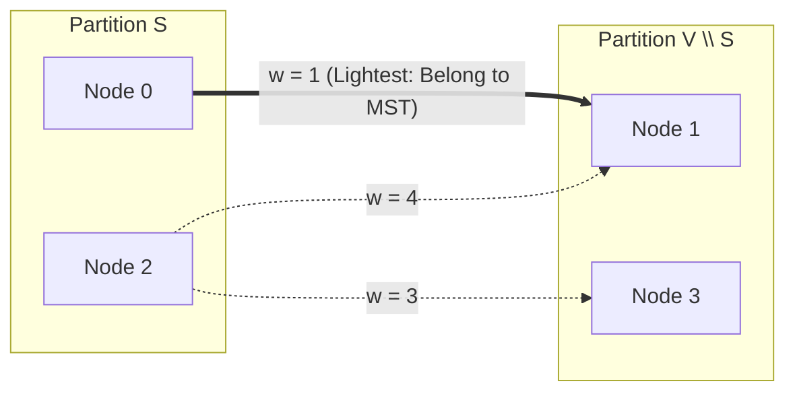

# Minimum Spanning Trees

> [!NOTE]
> Given a connected, edge-weighted undirected graph $G = (V, E)$, a **Minimum Spanning Tree (MST)** is an acyclic subgraph $T \subseteq E$ connecting all $|V|$ vertices with exactly $|V| - 1$ edges that minimizes the total aggregate edge weight $\sum_{e \in T} w(e)$. If the graph is disconnected, the optimal structure is a **Minimum Spanning Forest (MSF)** consisting of an MST for each connected component.
>
> Reference implementations: [C++17 Implementation](../../implementations/cpp/minimum_spanning_trees.cpp) | [Python Implementation](../../implementations/python/minimum_spanning_trees.py)

> [!TIP]
> **MST vs. Shortest-Path Tree (SPT) at a Glance:**
>
> | Metric / Property | Minimum Spanning Tree (MST) | Shortest-Path Tree (SPT) |
> | :--- | :--- | :--- |
> | **Objective** | Minimizes **total tree weight** $\sum_{e \in T} w(e)$ | Minimizes **distance from source** $\text{dist}(s, v)$ |
> | **Root Dependency** | **Global**: unrooted (same tree connects all vertices) | **Local**: rooted at a specific source vertex $s$ |
> | **Applicable Algorithms** | Kruskal, Prim, Borůvka | Dijkstra, Bellman-Ford, SPFA, DAG SSSP |
> | **Cycle Freedom** | Always a simple tree with $|V| - 1$ edges | Always a simple tree with $|V| - 1$ edges |
> | **Edge Weights** | Negative edges are fully allowed without penalty | Negative cycles make distances undefined |

> [!IMPORTANT]
> **The Two Fundamental Duality Theorems:**
> 1. **The Cut Property (Inclusion Invariant)**: For any cut $(S, V \setminus S)$ in $G$, the lightest edge crossing the cut is guaranteed to belong to **some** MST. If that lightest crossing edge is unique, it belongs to **every** MST.
> 2. **The Cycle Property (Exclusion Invariant)**: For any simple cycle $C$ in $G$, the strictly heaviest edge on $C$ **cannot belong to any unique MST**.

---

## 1. Mathematical Foundations & Spanning Trees

Let $G = (V, E)$ be a connected undirected graph with $|V| = n$ vertices and $|E| = m$ edges.

A subgraph $T = (V, E_T)$ is a **spanning tree** if:
1. **Spanning**: $V(T) = V(G)$ (every vertex is included).
2. **Connected**: For every pair of vertices $u, v \in V$, there exists a path in $T$ between $u$ and $v$.
3. **Acyclic**: $T$ contains no simple cycles.

### Fundamental Tree Equivalence Theorem:
For any undirected graph $T$ on $n$ vertices, any two of the following conditions imply the third (and prove $T$ is a tree):
- $T$ is connected.
- $T$ is acyclic.
- $T$ has exactly $n - 1$ edges.

---

## 2. The Minimum Spanning Tree Problem

When each edge $e \in E$ has a real-valued weight $w(e)$, different spanning trees possess different total costs. The **Minimum Spanning Tree** problem seeks:

$$
\arg\min_{T \subseteq E} \sum_{e \in T} w(e) \quad \text{subject to } T \text{ is a spanning tree of } G
$$

```text
Weighted Undirected Graph G:
      [ 0 ] --------- 1 --------- [ 1 ]
        |                         / |
        | 4                     2   | 5
        |                     /     |
      [ 2 ] --------- 3 --------- [ 3 ]

Candidate Spanning Trees:
- T1 = {(0,1), (1,3), (2,3)}: Cost = 1 + 5 + 3 = 9
- T2 = {(0,1), (0,2), (2,3)}: Cost = 1 + 4 + 3 = 8
- T3 = {(0,1), (1,2), (2,3)}: Cost = 1 + 2 + 3 = 6  <--- Optimal MST
```

---

## 3. Uniqueness Conditions

An MST is **not necessarily unique**. If multiple edges share identical weights, multiple distinct spanning trees can achieve the identical minimum weight.

### The Distinct Weights Theorem:
> If every edge weight in a connected graph $G$ is distinct, then $G$ has **exactly one unique Minimum Spanning Tree**.

### Proof Sketch:
Assume for contradiction that two distinct MSTs $T_1$ and $T_2$ exist.
Let $e = (u, v)$ be the edge of minimum weight in the symmetric difference $(T_1 \setminus T_2) \cup (T_2 \setminus T_1)$. Without loss of generality, assume $e \in T_1 \setminus T_2$.
Adding $e$ to $T_2$ creates a unique cycle $C$ in $T_2 \cup \{e\}$. Since $e \notin T_2$, cycle $C$ must contain at least one edge $e' \in T_2 \setminus T_1$.
Because edge weights are strictly distinct and $e$ was chosen as the minimal edge in the symmetric difference, we have $w(e) < w(e')$.
Replacing $e'$ with $e$ produces a new spanning tree $T_3 = (T_2 \setminus \{e'\}) \cup \{e\}$ with total weight:

$$
w(T_3) = w(T_2) - w(e') + w(e) < w(T_2)
$$

This contradicts the assumption that $T_2$ was a minimum spanning tree. Thus, the MST must be unique. $\blacksquare$

---

## 4. The Cut Property & Cycle Property

### The Cut Property (Lightest Crossing Edge)
A **cut** $(S, V \setminus S)$ is a partition of vertices into two disjoint non-empty sets. An edge $e = (u, v)$ **crosses** the cut if $u \in S$ and $v \in V \setminus S$.

```text
Cut Partition: Set S vs. Set (V \ S)
   Set S: { 0, 2 }                   Set (V \ S): { 1, 3 }
      [ 0 ] ----------------- 1 ----------------> [ 1 ]  <-- LIGHTEST CROSSING EDGE (SAFE!)
      [ 2 ] ----------------- 4 ----------------> [ 1 ]
      [ 2 ] ----------------- 3 ----------------> [ 3 ]
```



> **Cut Invariant**: Let $S \subset V$. If $e^*$ is a minimal-weight edge crossing $(S, V \setminus S)$, there exists an MST that includes $e^*$.

### The Cycle Property (Heaviest Cycle Edge)
> **Cycle Invariant**: Let $C \subseteq E$ be any simple cycle in $G$. If $e_{\text{max}}$ is the unique strictly heaviest edge in $C$, then $e_{\text{max}}$ cannot belong to any MST of $G$.

---

## 5. Classical Algorithms Taxonomy

All classical MST algorithms exploit the Cut Property by iteratively selecting **safe edges**:

```text
+------------------------------------------------------------------------------------+
|                               MST Algorithm Taxonomy                                |
+-----------------------+-----------------------+------------------------------------+
| Kruskal's Algorithm   | Global Edge Sorting   | DSU (Union-Find)                   |
|                       | Lightest edge first   | O(E log E) = O(E log V)            |
+-----------------------+-----------------------+------------------------------------+
| Prim's Algorithm      | Local Cut Expansion   | Min-Priority Queue (Heap)          |
|                       | Frontier cut edges    | O((V + E) log V) or O(E + V log V) |
+-----------------------+-----------------------+------------------------------------+
| Borůvka's Algorithm   | Concurrent Contraction| Parallel Component Reductions      |
|                       | Simultaneous cuts     | O(E log V)                         |
+-----------------------+-----------------------+------------------------------------+
```

---

## 6. Kruskal's Algorithm

Kruskal's algorithm operates globally on edge lists:
1. Sort all edges $E$ in non-decreasing order of weight: $w(e_1) \le w(e_2) \le \dots \le w(e_m)$.
2. Initialize a Disjoint Set Union (DSU) structure with each vertex in its own component.
3. Iterate through sorted edges: if edge $(u, v)$ connects two distinct components, unite them and include $(u, v)$ in the MST. If they are already in the same component, discard $(u, v)$ (by the Cycle Property).
4. Terminate when $|V| - 1$ edges have been accepted.

### C++17 Reference Implementation: Kruskal

```cpp
#include <vector>
#include <algorithm>
#include <numeric>

struct Edge {
    int u, v;
    long long weight;
};

struct DSU {
    std::vector<int> parent, rank;

    explicit DSU(int n) : parent(n), rank(n, 0) {
        std::iota(parent.begin(), parent.end(), 0);
    }

    int find(int x) {
        if (parent[x] != x) {
            parent[x] = find(parent[x]);
        }
        return parent[x];
    }

    bool unite(int a, int b) {
        a = find(a);
        b = find(b);
        if (a == b) return false;
        if (rank[a] < rank[b]) std::swap(a, b);
        parent[b] = a;
        if (rank[a] == rank[b]) ++rank[a];
        return true;
    }
};

std::pair<long long, std::vector<Edge>> kruskal_mst(int n, std::vector<Edge> edges) {
    if (n <= 1) return {0, {}};

    std::sort(edges.begin(), edges.end(), [](const Edge& a, const Edge& b) {
        return a.weight < b.weight;
    });

    DSU dsu(n);
    long long total_weight = 0;
    std::vector<Edge> mst;
    mst.reserve(n - 1);

    for (const auto& e : edges) {
        if (dsu.unite(e.u, e.v)) {
            total_weight += e.weight;
            mst.push_back(e);
            if (static_cast<int>(mst.size()) == n - 1) break;
        }
    }

    if (static_cast<int>(mst.size()) != n - 1) {
        return {-1, {}}; // Graph is disconnected
    }
    return {total_weight, mst};
}
```

---

## 7. Prim's Algorithm

Prim's algorithm grows a single connected tree outward from an arbitrary start vertex $s$:
1. Maintain a set of tree vertices $S$, initially $S = \{s\}$.
2. At each iteration, identify the lightest edge crossing the cut $(S, V \setminus S)$ using a min-priority queue.
3. Add the selected edge and destination vertex to $S$.
4. Push all outgoing edges from the newly added vertex into the priority queue.
5. Repeat until all vertices are in $S$.

### C++17 Reference Implementation: Prim

```cpp
#include <vector>
#include <queue>
#include <limits>

struct AdjEdge {
    int to;
    long long weight;
};

std::pair<long long, std::vector<std::pair<int, int>>> prim_mst(
    int n,
    const std::vector<std::vector<AdjEdge>>& graph,
    int start = 0) {

    if (n <= 1) return {0, {}};

    std::vector<int> visited(n, 0);
    std::vector<long long> best(n, std::numeric_limits<long long>::max());
    std::vector<int> parent(n, -1);

    using State = std::pair<long long, int>; // {cost, vertex}
    std::priority_queue<State, std::vector<State>, std::greater<State>> pq;

    best[start] = 0;
    pq.push({0, start});

    long long total_weight = 0;
    std::vector<std::pair<int, int>> mst_edges;
    mst_edges.reserve(n - 1);

    while (!pq.empty()) {
        auto [w, u] = pq.top();
        pq.pop();

        if (visited[u]) continue; // Stale priority queue entry
        visited[u] = 1;

        if (parent[u] != -1) {
            total_weight += w;
            mst_edges.push_back({parent[u], u});
        }

        for (const auto& e : graph[u]) {
            int v = e.to;
            if (!visited[v] && e.weight < best[v]) {
                best[v] = e.weight;
                parent[v] = u;
                pq.push({best[v], v});
            }
        }
    }

    if (static_cast<int>(mst_edges.size()) != n - 1) {
        return {-1, {}}; // Graph is disconnected
    }
    return {total_weight, mst_edges};
}
```

---

## 8. Borůvka's Algorithm (Concurrent Component Contraction)

Borůvka's algorithm is the oldest MST algorithm (1926) and naturally lends itself to parallelization:
1. Begin with $V$ individual components.
2. In each round, every component simultaneously finds its cheapest outgoing edge.
3. All chosen edges are added to the MST, contracting connected components.
4. Because each round cuts the number of components by at least half, there are at most $\lceil \log_2 V \rceil$ rounds.
5. Overall runtime is strictly $O(E \log V)$.

```cpp
std::pair<long long, std::vector<Edge>> boruvka_mst(int n, const std::vector<Edge>& edges) {
    if (n <= 1) return {0, {}};
    DSU dsu(n);
    int components = n;
    long long total_weight = 0;
    std::vector<Edge> mst;

    while (components > 1) {
        std::vector<int> best_edge(n, -1);

        for (int i = 0; i < static_cast<int>(edges.size()); ++i) {
            int u = dsu.find(edges[i].u);
            int v = dsu.find(edges[i].v);
            if (u == v) continue;

            if (best_edge[u] == -1 || edges[i].weight < edges[best_edge[u]].weight) {
                best_edge[u] = i;
            }
            if (best_edge[v] == -1 || edges[i].weight < edges[best_edge[v]].weight) {
                best_edge[v] = i;
            }
        }

        bool merged = false;
        for (int i = 0; i < n; ++i) {
            int ei = best_edge[i];
            if (ei == -1) continue;
            const auto& e = edges[ei];
            if (dsu.unite(e.u, e.v)) {
                total_weight += e.weight;
                mst.push_back(e);
                --components;
                merged = true;
            }
        }
        if (!merged) break;
    }

    if (static_cast<int>(mst.size()) != n - 1) return {-1, {}};
    return {total_weight, mst};
}
```

---

## 9. Comprehensive Comparison: Kruskal vs. Prim vs. Borůvka

| Characteristic | Kruskal's Algorithm | Prim's Algorithm (Binary Heap) | Prim's Algorithm (Dense Matrix) | Borůvka's Algorithm |
| :--- | :--- | :--- | :--- | :--- |
| **Time Complexity** | $O(E \log E) = O(E \log V)$ | $O((V + E) \log V)$ | $\Theta(V^2)$ | $O(E \log V)$ |
| **Auxiliary Space** | $O(V)$ (DSU arrays) | $O(V + E)$ (PQ + adjacency) | $O(V)$ | $O(V)$ |
| **Optimal Graph Density** | Sparse ($E \ll V^2$) | Moderate / Sparse | Dense ($E \approx V^2$) | Parallel architectures |
| **Underlying Data Structure** | Disjoint Set Union (DSU) | Min-Priority Queue | Flat Distance Array | Disjoint Set Union (DSU) |
| **Memory Access Pattern** | Sequential scan over sorted edges | Pointer chasing / heap rebalancing | Cache-line contiguous array scan | Parallel component lookups |

---

## 10. Variations & Advanced Problems

### 1. Maximum Spanning Tree
To compute the spanning tree that **maximizes** total weight:
- Simply negate all edge weights: $w'(e) = -w(e)$.
- Run standard Kruskal or Prim.
- The returned tree is the Maximum Spanning Tree with cost $-\text{cost}(T')$.
- *Applications*: Maximum reliability communication networks, maximum bandwidth bottleneck paths.

### 2. Minimum Bottleneck Spanning Tree (MBST)
An MBST minimizes the maximum individual edge weight present in the tree:

$$
\min_{T} \max_{e \in T} w(e)
$$

- **Theorem**: *Every Minimum Spanning Tree is a Minimum Bottleneck Spanning Tree.*
- The converse is not always true: an MBST can contain suboptimal lighter edges provided its maximum edge is minimal.

### 3. Incremental & Dynamic Connectivity
When edges arrive dynamically in an online stream:
- Adding edge $e = (u, v)$ to an existing tree forms a cycle.
- Finding the maximum-weight edge on the cycle and removing it maintains the optimal MST in $O(V)$ using standard tree traversal, or in $O(\log V)$ using Link-Cut Trees.

### 4. Steiner Tree Problem (NP-Hardness Contrast)
Given a subset of required terminal vertices $R \subseteq V$, find the minimum-weight tree connecting all vertices in $R$, optionally using non-terminal intermediate vertices (Steiner vertices).
- While MST is solvable in polynomial $O(E \log V)$ time, the Steiner Tree problem is **NP-hard**.

---

## 11. Practice Problems & Engineering Challenges

1. **Min-Cost Island Bridges**: Given island coordinates and water bridge costs, construct the minimum-cost road network connecting all islands.
2. **K-Cluster Separation**: Use Kruskal's algorithm to partition $n$ points into $k$ clusters such that the minimum distance between distinct clusters is maximized (Hint: stop Kruskal when $k$ components remain).
3. **Second-Best MST**: Design an $O(E \log V)$ algorithm to compute the spanning tree whose total weight is strictly minimal among all spanning trees different from the primary MST (Hint: query maximum edge on cycle via Binary Lifting LCA).
4. **Network Resilience (Edge Failure)**: If a critical edge in an MST fails, find the cheapest replacement edge restoring connectivity in $O(E)$ time using the Cut Property.

---

## 12. Next Steps & Suggested Reading

- **All-Pairs Shortest Paths** (`all-pairs-shortest-paths.md`): Floyd-Warshall and Johnson's algorithm for complete distance matrices.
- **Articulation Points and Bridges**: Identifying single points of failure in undirected networks.
- **Network Flow & Cut Duality**: Max-Flow Min-Cut Theorem and Ford-Fulkerson algorithms.
