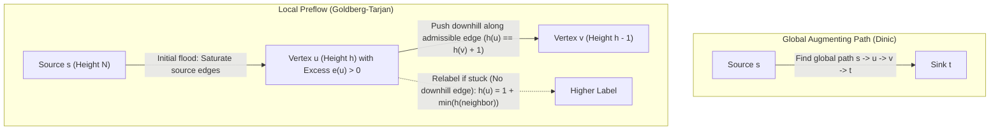
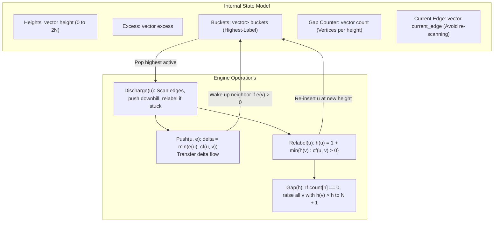

# Network Flow and the Push-Relabel Algorithm

> [!NOTE]
> **The Paradigm Shift: Augmenting Paths vs Local Preflow:**
> Classical Maximum Flow algorithms (Ford-Fulkerson, Edmonds-Karp, Dinic) operate **globally**:
> They repeatedly search for augmenting paths from source $s$ to sink $t$ across the entire residual network, maintaining strict flow conservation at every intermediate step.
> In contrast, the **Push-Relabel Algorithm (Goldberg & Tarjan, 1986)** operates **locally**:
> It relaxes flow conservation into a **preflow** (where incoming flow can exceed outgoing flow), accumulating local **excess** at vertices and pushing it downhill like water via local height labels.

> [!TIP]
> **The Highest-Label and Gap Heuristics:**
> An unoptimized push-relabel implementation runs in $O(V^2 E)$ time.
> Adding two practical heuristics elevates Push-Relabel into the fastest general-purpose maximum flow algorithm known in computer science:
> 1. **Highest-Label Selection:** Always discharge the active vertex with the maximum height label $\implies O(V^2 \sqrt{E})$ bound.
> 2. **Gap Relabeling Heuristic:** If a height level $h$ becomes empty, any vertex with height $> h$ is disconnected from the sink in the residual graph. Relabeling them to $V + 1$ immediately skips thousands of useless operations and routes residual excess straight back to the source.

> [!WARNING]
> **The Admissible Edge Invariant:**
> Flow can be pushed along a residual edge $u \to v$ if and only if the edge is **admissible**:
> 1. Residual capacity is positive: $c_f(u, v) = c(u, v) - f(u, v) > 0$.
> 2. Height difference is strictly downhill: $h(u) = h(v) + 1$.
> Pushing flow uphill or along flat edges violates the distance label invariant and creates circular excess loops.



---

## 1. Core Mental Model & Motivation

Maximum flow problems ask for the maximum rate at which a commodity can be routed from a source $s$ to a sink $t$ across a directed network with bounded capacities.

The augmenting-path paradigm searches for paths from $s$ to $t$ in the residual graph $G_f$, computes the bottleneck capacity, and augments flow along the entire path. While intuitive, this approach suffers from two severe practical weaknesses:
1. **Global Search Overhead:** Every augmenting step requires a graph-wide search ($O(E)$ work for BFS/DFS).
2. **Path Sloshing:** On dense or adversarial graphs, augmenting paths may continuously reverse flow across the same bottlenecks, leading to excessive redundant traversals.

The **Push-Relabel method** completely abandons global path searches during execution. Instead:
- Imagine the network as a system of water reservoirs connected by pipes.
- The source reservoir $s$ is placed on an elevated platform of height $|V|$, while the sink $t$ rests at ground level (height $0$).
- Water is initially flooded into all pipes leaving $s$ to full capacity.
- Intermediate vertices accumulate water in holding tanks (**excess**).
- A vertex can only pour water downhill to a neighbor whose reservoir is strictly one level below ($h(u) = h(v) + 1$).
- If an intermediate reservoir has water but all outgoing pipes lead uphill or to flat ground, a crane raises the reservoir (**relabel**) until water can pour downhill once again.
- Once no more water can reach the sink, leftover excess is pushed all the way up to heights $\ge |V|$ and drains back into the source.

---

## 2. Mathematical Formulation & Formal Invariants

Let $G = (V, E)$ be a directed graph with capacity function $c: V \times V \to \mathbb{R}_{\ge 0}$, source $s \in V$, and sink $t \in V$.

### Invariant 1: Capacity Constraint
For every pair $(u, v) \in V \times V$:
$$0 \le f(u, v) \le c(u, v)$$

### Invariant 2: Skew Symmetry
Residual networks represent flow in opposite directions anti-symmetrically:
$$f(u, v) = -f(v, u)$$
The residual capacity is $c_f(u, v) = c(u, v) - f(u, v)$.

### Invariant 3: Preflow Relaxation (Non-Negative Excess)
Unlike a valid circulation where net flow at every intermediate vertex is zero, a **preflow** allows incoming flow to exceed outgoing flow:
$$e(u) = \sum_{v \in V} f(v, u) \ge 0 \quad \forall u \in V \setminus \{s\}$$
A vertex $u \in V \setminus \{s, t\}$ is called **active** if $e(u) > 0$.

### Invariant 4: Valid Distance Labeling
A height function $h: V \to \mathbb{N}$ is a valid distance labeling if:
1. $h(s) = |V|$ and $h(t) = 0$.
2. For every residual edge $(u, v) \in E_f$ (where $c_f(u, v) > 0$):
   $$h(u) \le h(v) + 1$$

> [!IMPORTANT]
> **No Residual Path to Sink:**
> Under any valid labeling, there is **no directed path** from $s$ to $t$ in the residual graph $G_f$. If such a path $p = (v_0, v_1, \dots, v_k)$ existed with $v_0 = s$ and $v_k = t$, then:
> $$h(s) - h(t) = \sum_{i=0}^{k-1} (h(v_i) - h(v_{i+1})) \le k \le |V| - 1$$
> But $h(s) - h(t) = |V| - 0 = |V|$, yielding $|V| \le |V| - 1$, a contradiction.

---

## 3. Detailed Architecture / Visual Diagram



---

## 4. Concrete Operations & Step-by-Step State Transitions

### 4.1 Initialization Phase
1. For all $v \in V$, initialize $h(v) = 0$ and $e(v) = 0$. Set $h(s) = |V|$.
2. Saturate every edge leaving the source: for each $(s, v) \in E$, set $f(s, v) = c(s, v)$, $f(v, s) = -c(s, v)$, $e(v) = c(s, v)$, and $e(s) -= c(s, v)$.
3. For every neighbor $v$ of $s$ with $v \neq t$ and $e(v) > 0$, push $v$ into active bucket `buckets[h(v)]`.
4. Initialize height frequency counters `count[0] = |V| - 1` and `count[|V|] = 1`.

### 4.2 Push Operation
For an active vertex $u$ ($e(u) > 0$) and admissible residual edge $(u, v)$ ($c_f(u, v) > 0$ and $h(u) = h(v) + 1$):
$$\delta = \min(e(u), c_f(u, v))$$
- $f(u, v) \mathrel{+}= \delta$, $f(v, u) \mathrel{-}= \delta$
- $e(u) \mathrel{-}= \delta$, $e(v) \mathrel{+}= \delta$
- If $v \neq s, t$ and $v$ was not active before, add $v$ to `buckets[h(v)]`.

*Saturating vs Non-Saturating:*
- **Saturating Push:** $\delta = c_f(u, v)$. The residual edge disappears from $G_f$.
- **Non-Saturating Push:** $\delta = e(u)$. The excess at $u$ becomes $0$, terminating $u$'s discharge.

### 4.3 Relabel Operation
If $u$ is active but no outgoing residual edge satisfies $h(u) = h(v) + 1$:
$$h(u) = 1 + \min \{ h(v) \mid (u, v) \in E_f \}$$
- Decrement `count[h_old]`.
- If `count[h_old] == 0` and $h_{old} < |V|$, trigger **Gap Relabeling**.
- Increment `count[h_new]`. Reset `current_edge[u] = 0`.

### 4.4 Discharge Engine
Repeatedly process active vertex $u$ using `current_edge[u]`:
```text
while excess[u] > 0:
    if current_edge[u] < degree(u):
        let edge = edges[u][current_edge[u]]
        if cf(edge) > 0 and h(u) == h(edge.to) + 1:
            push(u, edge)
        else:
            current_edge[u]++
    else:
        relabel(u)
        if h(u) >= 2 * |V|:
            break
```

---

## 5. Algorithmic Complexity Analysis

| Variant | Time Complexity | Space Complexity | Notes |
| :--- | :--- | :--- | :--- |
| **Generic Push-Relabel** | $O(V^2 E)$ | $O(V + E)$ | Unrestricted active vertex selection |
| **FIFO Push-Relabel** | $O(V^3)$ | $O(V + E)$ | Simple queue-based scheduling |
| **Highest-Label Push-Relabel** | **$O(V^2 \sqrt{E})$** | $O(V + E)$ | Bucket-based selection of max height |
| **Push-Relabel + Dynamic Trees** | $O(V E \log(V^2 / E))$ | $O(V + E)$ | Sleator-Tarjan link-cut trees |

### Complexity Bounds Proof Outline:
1. **Number of Relabels:** For each vertex $u \neq s, t$, $h(u)$ starts at 0 and can never exceed $2|V| - 1$. Total relabel operations across all vertices is bounded by $2|V|^2 = O(V^2)$.
2. **Saturating Pushes:** Between two saturating pushes on directed edge $(u, v)$, the height $h(u)$ must increase by at least 2. Thus, each edge experiences at most $|V|$ saturating pushes, yielding at most $2|V| \cdot |E| = O(VE)$ saturating pushes.
3. **Non-Saturating Pushes:** In highest-label selection, potential function arguments show that the number of non-saturating pushes between relabels is bounded by $O(V^2 \sqrt{E})$.

---

## 6. High-Performance Heuristics

### 6.1 Highest-Label Selection
Active vertices are maintained in a vector of buckets indexed by height:
- `highest_active` tracks the largest index with non-empty `buckets[h]`.
- Always discharge a vertex from `buckets[highest_active]`.
- When height increases, `highest_active` jumps up. When a bucket empties, `highest_active` steps down.
- Amortized cost of maintaining `highest_active` is $O(V^2)$.

### 6.2 Gap Relabeling Heuristic
Maintain `count[h]`, the number of vertices at each height $h < |V|$:
- If `count[h]` becomes 0 after a relabel, no residual path exists from any vertex at height $> h$ to the sink $t$.
- Any vertex $v$ with $h < h(v) < |V|$ can never deliver flow to $t$.
- Setting $h(v) = \max(h(v), |V| + 1)$ immediately renders them unable to push flow toward the sink, directing their excess backwards toward $s$ without thousands of intermediate downhill relabels.

---

## 7. Edge Cases & Failure Modes

1. **Disconnected Sink:** If $t$ is unreachable from $s$, the initial flood to neighbors of $s$ cannot reach $t$. All excess is pushed up to heights $\ge |V|$ and returns to $s$. The final flow to $t$ is correctly $0$.
2. **Parallel Edges and Self-Loops:** Handled cleanly by storing reverse edge indices `rev` rather than adjacency matrix keys. Self-loops have $h(u) = h(u) \neq h(u) + 1$, so they are never admissible.
3. **Floating Excess in Phase 1 vs Phase 2:** If an implementation only terminates when sink paths vanish, intermediate nodes might retain preflow excess. Allowing vertices to reach heights up to $2|V| - 1$ guarantees excess drains completely back to $s$, restoring strict flow conservation everywhere.

---

## 8. Reference Implementation Architecture

Both C++17 and Python 3 reference implementations are organized around:
- **`FlowEdge`**: Stores `to`, `rev` (paired index in neighbor list), `cap`, and `flow`.
- **`PushRelabel`**:
  - `add_edge(from, to, cap)`: Registers paired forward and backward edges.
  - `compute_max_flow(s, t)`: Executes preflow initialization, bucketed discharge loop, and returns total flow entering $t$.
  - `verify_flow_invariants(s, t)`: Asserts capacity constraints and exact intermediate conservation.

---

## 9. Differential Testing & Oracle Verification Strategy

To guarantee algorithmic correctness across diverse network topologies:
1. **Dinic Oracle Comparison:** An independent implementation of Dinic's Algorithm (BFS level graph + DFS blocking flows with pointer advancement) serves as the ground-truth differential oracle.
2. **Textbook Verification:** Verified against the classical 6-node network (Max flow: 23).
3. **Randomized Dense Fuzzing:** Automated differential testing against 10 dense randomized networks with varying capacities, verifying that `compute_max_flow(s, t)` matches `dinic.compute_max_flow(s, t)` bit-for-bit while satisfying all conservation invariants.

---

## 10. Engineering Pitfalls & Optimization Notes

> [!CAUTION]
> **Common Trap: Cutting Off Heights at $|V|$:**
> A frequent mistake in competitive programming implementations is discarding vertices once $h(u) \ge |V|$. While this computes the scalar max flow value at $t$, it leaves positive excess stranded at intermediate nodes, violating flow conservation. Vertices must be allowed to reach $2|V| - 1$ to push excess back to $s$.

> [!TIP]
> **Current Edge Optimization:**
> Scanning all outgoing edges from scratch during every discharge degrades performance to $O(V^2 E)$ or worse. Maintaining a `current_edge[u]` iterator that only resets to 0 when $u$ is relabeled ensures each edge is inspected at most once per height level.

---

## 11. Real-World Applications & Industry Context

1. **Computer Vision & Graph Cuts:** Foreground/background image segmentation via min-cut formulations (Boykov-Kolmogorov algorithms are based on flow concepts).
2. **Bipartite Matching at Scale:** Large-scale job-to-worker assignments and kidney donor exchange networks.
3. **Network Routing & Telecom:** Capacity provisioning, multi-commodity flow approximations, and max-flow min-cut network reliability testing.
4. **Airline Scheduling:** Crew scheduling, fleet routing, and gate assignment problems modeled via network circulations with demands and lower bounds.

---

## 12. Curated Academic References

1. **Goldberg, Andrew V. & Tarjan, Robert E. (1986):** *A new approach to the maximum flow problem*. Proceedings of the 18th Annual ACM Symposium on Theory of Computing (STOC '86), pp. 136–146.
2. **Cherkassky, Boris V. & Goldberg, Andrew V. (1997):** *On implementing push-relabel method for the maximum-flow problem*. Algorithmica, 19(4), pp. 390–410.
3. **Ahuja, Ravindra K., Magnanti, Thomas L., & Orlin, James B. (1993):** *Network Flows: Theory, Algorithms, and Applications*. Prentice Hall.
4. **Cormen, Thomas H., Leiserson, Charles E., Rivest, Ronald L., & Stein, Clifford (2009):** *Introduction to Algorithms* (3rd ed.). MIT Press. Chapter 26: "Maximum Flow".
