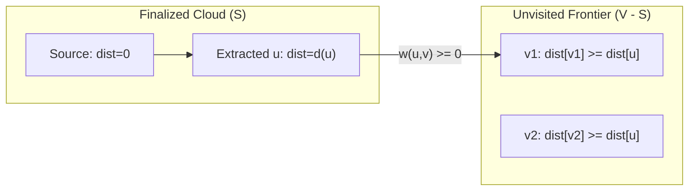

# Shortest Paths

> [!NOTE]
> The **Single-Source Shortest Path (SSSP)** problem seeks the minimum-weight directed path from a distinguished source vertex $s \in V$ to every other vertex in a weighted graph $G = (V, E)$. The foundational mechanical invariant uniting all shortest path algorithms is **edge relaxation**.
>
> Reference implementations: [C++17 Implementation](../../implementations/cpp/shortest_paths.cpp) | [Python Implementation](../../implementations/python/shortest_paths.py)

> [!TIP]
> **Algorithm Selection Flow:**
>
> ```text
> Is the graph unweighted?
>    |---> YES: Standard BFS [O(V + E)]
>    +---> NO:  Are edge weights restricted to {0, 1}?
>                 |---> YES: 0-1 BFS via Deque [O(V + E)]
>                 +---> NO:  Is the graph a Directed Acyclic Graph (DAG)?
>                              |---> YES: Topological Relaxation [O(V + E)] (Shortest & Longest Paths)
>                              +---> NO:  Are all edge weights non-negative (w >= 0)?
>                                           |---> YES: Dijkstra's Algorithm [O((V + E) log V)]
>                                           +---> NO:  Do negative edges exist?
>                                                        |---> Bellman-Ford [O(V * E)] (Detects Negative Cycles)
>                                                        +---> SPFA [Average O(k * E), Worst O(V * E)]
> ```

> [!WARNING]
> **Crucial Pitfalls to Avoid:**
> 1. **Never use Dijkstra on negative edge weights**: Dijkstra greedily assumes that once a vertex is popped from the min-priority queue, its distance is immutable and finalized. Negative edges violate this monotonicity property and yield incorrect distances.
> 2. **Filter stale heap entries**: In standard priority-queue Dijkstra without explicit `decrease_key`, always check `if (d > dist[u]) continue;` immediately upon popping.
> 3. **SPFA is a heuristic, not an asymptotic improvement**: While SPFA outperforms Bellman-Ford on random sparse graphs, specially crafted adversarial graphs force SPFA into exponential or worst-case $O(V \cdot E)$ execution.
> 4. **Integer overflow on infinity sentinels**: Never define $\infty$ as `LLONG_MAX`. Always use `LLONG_MAX / 4` or `10^18` to prevent `INF + weight` from wrapping around into negative values.

---

## 1. Problem Statement

Let $G = (V, E)$ be a directed weighted graph, where each directed edge $(u, v) \in E$ possesses a real-valued weight $w(u, v)$.

Given a source vertex $s \in V$, the **single-source shortest path** problem computes, for every vertex $v \in V$:

$$
\text{dist}(v) = \min_{P} \left\{ \sum_{e \in P} w(e) \ \middle|\ P \text{ is a directed path from } s \text{ to } v \right\}
$$

If no path exists from $s$ to $v$, we define $\text{dist}(v) = +\infty$.

### Output Requirements:
1. **Distance Array**: The minimum cost $\text{dist}[v]$ from $s$ to all $v \in V$.
2. **Parent Predecessor Array**: An array $\text{parent}[v]$ recording the penultimate vertex on the optimal path to $v$, enabling linear-time path reconstruction.

---

## 2. What Does "Shortest" Mean?

In weighted graphs, a path's length is defined by the **sum of its edge weights**, not the number of hops.

```text
       +--- 2 ---> [ 1 ] --- 3 ---> [ 3 ]
       |             ^
       |             | 1
     [ 0 ]           |
       |             |
       +--- 10 --> [ 2 ] --- 1 ---> [ 3 ]
```

Routes from `0` to `3`:
- Path $0 \to 1 \to 3$: cost $2 + 3 = 5$ (Optimal)
- Path $0 \to 2 \to 3$: cost $10 + 1 = 11$
- Path $0 \to 2 \to 1 \to 3$: cost $10 + 1 + 3 = 14$

The shortest path is $0 \to 1 \to 3$ with total distance $5$.

---

## 3. Optimal Substructure

Shortest paths obey the **Principle of Optimality**:

> If a shortest path from $s$ to $v$ traverses vertex $u$, then the subpath from $s$ to $u$ must itself be a shortest path from $s$ to $u$.

### Proof:
Suppose a shorter path from $s$ to $u$ existed with cost $d'(u) < \text{dist}(u)$. Splicing that shorter subpath with the segment $u \rightsquigarrow v$ would yield a path from $s$ to $v$ with total cost $d'(u) + \text{cost}(u \rightsquigarrow v) < \text{dist}(v)$, contradicting the assumption that the original path was minimal. $\blacksquare$

This optimal substructure justifies computing global shortest paths via local **edge relaxations**.

---

## 4. Edge Relaxation

Edge relaxation is the fundamental atomic operation of all shortest path algorithms.

Given an edge $u \xrightarrow{w(u,v)} v$, if reaching $v$ via $u$ produces a smaller total distance than the currently known tentative estimate $\text{dist}[v]$, we **relax** the edge:

$$
\text{dist}[u] + w(u, v) < \text{dist}[v] \implies \begin{cases} \text{dist}[v] \leftarrow \text{dist}[u] + w(u, v) \\ \text{parent}[v] \leftarrow u \end{cases}
$$

```text
Relaxation Logic:
if dist[u] != INF and dist[u] + w(u, v) < dist[v]:
    dist[v] = dist[u] + w(u, v)
    parent[v] = u
```

---

## 5. When Shortest Paths Are Well-Defined

1. **Non-Negative Weights ($w \ge 0$)**: Shortest paths are strictly well-defined. No cycles can reduce path cost. Handled optimally by **Dijkstra's Algorithm**.
2. **Negative Edges, No Negative Cycles**: Shortest paths remain well-defined because any simple path visits at most $|V|$ vertices. Handled by **Bellman-Ford** and **SPFA**.
3. **Reachable Negative Cycles**: If a directed cycle $C$ satisfies $\sum_{e \in C} w(e) < 0$ and is reachable from $s$, each traversal of $C$ subtracts weight indefinitely:

$$
\lim_{k \to \infty} \text{cost}(s \rightsquigarrow C \xrightarrow{k \text{ times}} v) = -\infty
$$

No finite minimum exists for any vertex reachable from $C$. Algorithms must detect and flag this condition.

---

## 6. Path Reconstruction

To reconstruct the explicit sequence of vertices forming the optimal path from source $s$ to target $t$:

```text
Reconstruct Path:
1. If parent[t] == -1 and s != t: return unreachable
2. v = t
3. While v != -1:
       append v to path
       v = parent[v]
4. Reverse path
```

```cpp
std::vector<int> reconstruct_path(int source, int target, const std::vector<int>& parent) {
    if (source == target) return {source};
    if (parent[target] == -1) return {};

    std::vector<int> path;
    for (int v = target; v != -1; v = parent[v]) {
        path.push_back(v);
    }
    std::reverse(path.begin(), path.end());
    if (path.empty() || path.front() != source) return {};
    return path;
}
```

---

## 7. Dijkstra's Algorithm

Dijkstra's algorithm is the canonical greedy algorithm for graphs with **non-negative edge weights**.

### The Greedy Invariant:
At each step, Dijkstra extracts the unvisited vertex $u$ with the minimum tentative distance $\text{dist}[u]$ from a min-priority queue.
Because all edge weights $w \ge 0$, any alternative path reaching $u$ later must leave the currently explored set through some frontier edge with weight $\ge 0$, meaning its total cost can never be strictly less than $\text{dist}[u]$.
Thus, upon extraction, $\text{dist}[u]$ is guaranteed to be **final and optimal**.



### Why Dijkstra Fails on Negative Edges:
Consider:
```text
0 --1--> 1
0 --2--> 2
2 --(-5)--> 1
```
1. Tentative distances: $\text{dist}[0] = 0, \text{dist}[1] = 1, \text{dist}[2] = 2$.
2. Dijkstra pops `1` with $\text{dist}[1] = 1$ and marks it finalized.
3. Dijkstra then pops `2` with $\text{dist}[2] = 2$, relaxing edge $2 \to 1$:
   $2 + (-5) = -3 < 1$.
4. Vertex `1` was already finalized prematurely with the wrong distance!

---

## 8. C++17 Reference Implementation: Dijkstra

```cpp
#include <vector>
#include <queue>
#include <limits>
#include <utility>

struct Edge {
    int to;
    long long weight;
};

constexpr long long INF = std::numeric_limits<long long>::max() / 4;

std::vector<long long> dijkstra(
    const std::vector<std::vector<Edge>>& graph,
    int source,
    std::vector<int>* parent_out = nullptr) {

    int n = static_cast<int>(graph.size());
    std::vector<long long> dist(n, INF);
    std::vector<int> parent(n, -1);

    using State = std::pair<long long, int>; // {distance, vertex}
    std::priority_queue<State, std::vector<State>, std::greater<State>> pq;

    dist[source] = 0;
    pq.push({0, source});

    while (!pq.empty()) {
        auto [d, u] = pq.top();
        pq.pop();

        // Prune stale priority queue entries
        if (d > dist[u]) {
            continue;
        }

        for (const auto& e : graph[u]) {
            int v = e.to;
            long long nd = d + e.weight;
            if (nd < dist[v]) {
                dist[v] = nd;
                parent[v] = u;
                pq.push({nd, v});
            }
        }
    }

    if (parent_out) {
        *parent_out = std::move(parent);
    }
    return dist;
}
```

---

## 9. Python Reference Implementation: Dijkstra

```python
import heapq
from typing import List, Tuple

INF = 10**18


def dijkstra(
    graph: List[List[Tuple[int, int]]],
    source: int,
) -> Tuple[List[int], List[int]]:
    n = len(graph)
    dist = [INF] * n
    parent = [-1] * n
    dist[source] = 0

    pq = [(0, source)]

    while pq:
        d, u = heapq.heappop(pq)

        if d > dist[u]:
            continue  # Stale entry

        for v, w in graph[u]:
            nd = d + w
            if nd < dist[v]:
                dist[v] = nd
                parent[v] = u
                heapq.heappush(pq, (nd, v))

    return dist, parent
```

---

## 10. Complexity of Dijkstra

| Priority Queue Type | Insert | Extract-Min | Decrease-Key | Total SSSP Time Complexity |
| :--- | :---: | :---: | :---: | :---: |
| **Array / Flat Buffer** | $O(1)$ | $O(V)$ | $O(1)$ | $O(V^2 + E) = O(V^2)$ (Dense graphs) |
| **Binary Min-Heap** | $O(\log V)$ | $O(\log V)$ | $O(\log V)$ | $O((V + E) \log V)$ (Sparse standard) |
| **$d$-ary Heap ($d = 4$)** | $O(\log_d V)$ | $O(d \log_d V)$ | $O(\log_d V)$ | Superior cache locality in practice |
| **Fibonacci Heap** | $O(1)$ | $O(\log V)$ amortized | $O(1)$ amortized | $O(E + V \log V)$ (Theoretical optimum) |

---

## 11. DAG Shortest & Longest Paths via Topological Relaxation

On a **Directed Acyclic Graph (DAG)**, cycle-free topology allows solving shortest and longest paths in strictly linear $\Theta(V + E)$ time, **even with negative edge weights**.

### Why It Works:
In a valid topological order $\pi$, every directed edge satisfies $\pi(u) < \pi(v)$.
When the algorithm visits vertex $u$, all possible directed paths arriving at $u$ originate from vertices earlier in the topological order, all of which have already completed their relaxations. Thus, $\text{dist}[u]$ is final.

### Longest Path / Critical Path Analysis:
For project scheduling (PERT/CPM), finding the longest path across dependent tasks gives the **critical path** (minimum project duration). We simply initialize with $-\infty$ and relax using $\max$ instead of $\min$.

```cpp
std::vector<long long> dag_shortest_paths(
    const std::vector<std::vector<Edge>>& graph,
    const std::vector<int>& topo_order,
    int source,
    std::vector<int>* parent_out = nullptr) {

    int n = static_cast<int>(graph.size());
    std::vector<long long> dist(n, INF);
    std::vector<int> parent(n, -1);
    dist[source] = 0;

    for (int u : topo_order) {
        if (dist[u] == INF) continue;
        for (const auto& e : graph[u]) {
            int v = e.to;
            long long nd = dist[u] + e.weight;
            if (nd < dist[v]) {
                dist[v] = nd;
                parent[v] = u;
            }
        }
    }

    if (parent_out) *parent_out = std::move(parent);
    return dist;
}
```

---

## 12. Bellman-Ford Algorithm (Arbitrary Weights & Negative Cycles)

The Bellman-Ford algorithm solves SSSP on arbitrary weighted directed graphs in $O(V \cdot E)$ time and detects reachable negative cycles.

### Intuition:
A shortest simple path in a graph with $|V|$ vertices can contain at most $|V| - 1$ edges.
If we relax every edge in $E$:
- Pass 1 computes shortest paths of at most 1 edge.
- Pass 2 computes shortest paths of at most 2 edges.
- Pass $k$ computes shortest paths of at most $k$ edges.

After $|V| - 1$ iterations, all shortest simple paths are guaranteed to be fully propagated.

### Negative Cycle Detection:
If we execute a $|V|$-th relaxation pass and any edge can still be relaxed:

$$
\text{dist}[u] + w(u, v) < \text{dist}[v]
$$

then a negative-weight cycle is reachable from source $s$.

```cpp
struct DirectedEdge {
    int from;
    int to;
    long long weight;
};

bool bellman_ford(
    int n,
    const std::vector<DirectedEdge>& edges,
    int source,
    std::vector<long long>& dist,
    std::vector<int>& parent) {

    dist.assign(n, INF);
    parent.assign(n, -1);
    dist[source] = 0;

    for (int iter = 0; iter < n - 1; ++iter) {
        bool any_update = false;
        for (const auto& e : edges) {
            if (dist[e.from] == INF) continue;
            long long nd = dist[e.from] + e.weight;
            if (nd < dist[e.to]) {
                dist[e.to] = nd;
                parent[e.to] = e.from;
                any_update = true;
            }
        }
        if (!any_update) break; // Early termination optimization
    }

    // n-th check pass for negative cycles
    for (const auto& e : edges) {
        if (dist[e.from] == INF) continue;
        if (dist[e.from] + e.weight < dist[e.to]) {
            return false; // Reachable negative cycle detected
        }
    }
    return true;
}
```

---

## 13. Shortest Path Faster Algorithm (SPFA)

SPFA is a queue-based heuristic optimization of Bellman-Ford. Instead of scanning all edges blindly in each round, SPFA maintains a FIFO queue of vertices whose distances improved recently.

### Algorithm Steps:
1. Initialize $\text{dist}[s] = 0$, push $s$ into queue $Q$, set $\text{in\_queue}[s] = \text{true}$.
2. Pop vertex $u$ from $Q$, set $\text{in\_queue}[u] = \text{false}$.
3. For each edge $u \to v$, if $\text{dist}[u] + w(u, v) < \text{dist}[v]$:
   - Update $\text{dist}[v] = \text{dist}[u] + w(u, v)$.
   - If $v \notin Q$, push $v$ into $Q$ and increment its relaxation counter $\text{relax\_count}[v]$.
   - If $\text{relax\_count}[v] \ge |V|$, terminate: a negative cycle is reachable!

```cpp
bool spfa(
    const std::vector<std::vector<Edge>>& graph,
    int source,
    std::vector<long long>& dist,
    std::vector<int>& parent) {

    int n = static_cast<int>(graph.size());
    dist.assign(n, INF);
    parent.assign(n, -1);

    std::vector<int> in_queue(n, 0);
    std::vector<int> relax_count(n, 0);
    std::queue<int> q;

    dist[source] = 0;
    q.push(source);
    in_queue[source] = 1;

    while (!q.empty()) {
        int u = q.front();
        q.pop();
        in_queue[u] = 0;

        for (const auto& e : graph[u]) {
            int v = e.to;
            if (dist[u] == INF) continue;

            long long nd = dist[u] + e.weight;
            if (nd < dist[v]) {
                dist[v] = nd;
                parent[v] = u;

                if (!in_queue[v]) {
                    q.push(v);
                    in_queue[v] = 1;
                    if (++relax_count[v] >= n) {
                        return false; // Negative cycle detected
                    }
                }
            }
        }
    }
    return true;
}
```

---

## 14. Comprehensive Algorithm Comparison

| Algorithm | Edge Weights | Negative Cycles | Time Complexity | Auxiliary Space | Best Suited For |
| :--- | :---: | :---: | :---: | :---: | :--- |
| **Breadth-First Search (BFS)** | Unweighted ($w=1$) | N/A | $\Theta(V + E)$ | $O(V)$ | Unweighted graphs, minimum hops |
| **0-1 BFS** | $w \in \{0, 1\}$ | N/A | $\Theta(V + E)$ | $O(V)$ | Grid graphs with 0 or 1 edge costs |
| **DAG Relaxation** | Arbitrary | Acyclic | $\Theta(V + E)$ | $O(V)$ | Compilers, build dependencies, PERT/CPM |
| **Dijkstra (Binary Heap)** | Non-negative ($w \ge 0$) | No | $O((V + E) \log V)$ | $O(V)$ | Road navigation, routing protocols (OSPF) |
| **Dijkstra (Fibonacci)** | Non-negative ($w \ge 0$) | No | $O(E + V \log V)$ | $O(V)$ | Asymptotically dense graph analysis |
| **Bellman-Ford** | Arbitrary | **Yes** | $O(V \cdot E)$ | $O(V)$ | Arbitrage modeling, RIP protocol |
| **SPFA** | Arbitrary | **Yes** | Avg: $O(kE)$, Worst: $O(VE)$ | $O(V)$ | Sparse graphs with possible negative edges |

---

## 15. Practice Problems & Systems Applications

1. **Network Packet Delay**: In a computer network with variable latency links, find the fastest path between two endpoints using Dijkstra.
2. **Currency Arbitrage Detection**: Given conversion rates $R(u, v)$ between currencies, detect whether an arbitrage cycle exists where $\prod R(e) > 1$. (Hint: transform edge weights to $w(u, v) = -\ln R(u, v)$ and detect negative cycles with Bellman-Ford).
3. **Critical Path in Software Build**: Given module compilation times and dependency constraints, determine the critical compilation chain using DAG longest paths.
4. **Adversarial SPFA Construction**: Construct a bipartite or layered grid graph that forces SPFA into its worst-case $O(V \cdot E)$ quadratic relaxation behavior.

---

## 16. Next Steps & Suggested Reading

- **Minimum Spanning Trees** (`minimum-spanning-trees.md`): Kruskal's algorithm with DSU and Prim's algorithm with Priority Queues for global network connectivity.
- **All-Pairs Shortest Paths** (`all-pairs-shortest-paths.md`): Floyd-Warshall ($O(V^3)$) and Johnson's Algorithm ($O(V^2 \log V + VE)$).
- **Network Flow & Min-Cost Flow**: Augmenting shortest path algorithms for capacity-constrained networks.
