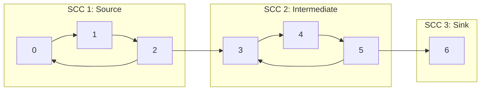

# Strongly Connected Components

> [!NOTE]
> In a directed graph $G = (V, E)$, a **Strongly Connected Component (SCC)** is a maximal subset of vertices $C \subseteq V$ such that every vertex in $C$ is reachable from every other vertex in $C$ through directed paths. Collapsing each SCC into a single meta-vertex yields the **Condensation DAG**, transforming cyclic directed graphs into acyclic structures where topological sorting and dynamic programming become applicable. Both classical linear-time algorithms—**Kosaraju's 2-pass algorithm** and **Tarjan's 1-pass low-link algorithm**—run in optimal $\Theta(V + E)$ time.
>
> Reference implementations: [C++17 Implementation](../../implementations/cpp/strongly_connected_components.cpp) | [Python Implementation](../../implementations/python/strongly_connected_components.py)

> [!TIP]
> **Kosaraju vs. Tarjan at a Glance:**
>
> | Algorithm | DFS Passes | Extra Data Structures | Core Invariant | Engineering Strengths |
> | :--- | :---: | :--- | :--- | :--- |
> | **Kosaraju's Algorithm** | 2 | Transpose graph $G^T$, finish-order stack | Decreasing finish times in $G$ order source-to-sink SCCs in $G^T$ | Conceptually transparent, trivial to prove |
> | **Tarjan's Algorithm** | 1 | Recursion stack, discovery (`disc`), low-link (`low`) | Stack isolates active recursion subtree; $\text{low}[u] = \text{disc}[u]$ marks an SCC root | Single-pass, cache-friendly, foundation for bridges & articulation points |

> [!IMPORTANT]
> The Condensation Graph $G^{\text{SCC}}$ of any directed graph is **always a Directed Acyclic Graph (DAG)**. If a directed cycle existed between components $C_i$ and $C_j$, all vertices across both components would be mutually reachable, directly violating the **maximality** property of SCCs.

---

## 1. What Is a Strongly Connected Component?

Let $G = (V, E)$ be a directed graph. Two vertices $u, v \in V$ are **mutually reachable** (or strongly connected), denoted $u \sim v$, if:
- there exists a directed path from $u$ to $v$, and
- there exists a directed path from $v$ to $u$.

The relation $\sim$ is an **equivalence relation** because:
1. **Reflexive**: $u \sim u$ (a path of length 0).
2. **Symmetric**: $u \sim v \iff v \sim u$ by definition.
3. **Transitive**: If $u \sim v$ and $v \sim w$, the concatenation of paths $u \rightsquigarrow v \rightsquigarrow w$ and $w \rightsquigarrow v \rightsquigarrow u$ establishes $u \sim w$.

Because $\sim$ is an equivalence relation, it partitions $V$ into disjoint equivalence classes. These classes are the **Strongly Connected Components (SCCs)** of $G$.

### Key Invariant: Maximality
An SCC is not merely any mutually reachable set or simple cycle; it is **maximal**. No additional vertex can be added to the component without destroying mutual reachability.

---

## 2. Walkthrough Example & The Condensation Graph

Consider the directed graph below:

```text
Original Directed Graph G:
   [ 0 ] ----> [ 1 ]             [ 3 ] ----> [ 4 ]
     ^           |                 ^           |
     |           v                 |           v
     +-------- [ 2 ] ----> [ 3 ]   +-------- [ 5 ] ----> [ 6 ]
```

### Component Analysis:
1. Vertices $\{0, 1, 2\}$ form a directed cycle: $0 \to 1 \to 2 \to 0$. Every vertex can reach every other vertex.
2. Vertices $\{3, 4, 5\}$ form a directed cycle: $3 \to 4 \to 5 \to 3$.
3. Vertex $2$ points to vertex $3$, but there is **no directed path** returning from $\{3, 4, 5\}$ back to $\{0, 1, 2\}$.
4. Vertex $5$ points to vertex $6$, but $6$ has out-degree 0 and cannot reach any other node.

The resulting SCC decomposition consists of 3 components:
- $C_1 = \{0, 1, 2\}$
- $C_2 = \{3, 4, 5\}$
- $C_3 = \{6\}$

### Condensation DAG:
Replacing each component with a single meta-vertex and retaining cross-component edges produces the **Condensation DAG**:

```text
Condensation DAG G^SCC:
   +-------------+          +-------------+          +-------+
   | C1: {0,1,2} | -------> | C2: {3,4,5} | -------> | C3: {6} |
   +-------------+          +-------------+          +-------+
```



---

## 3. Why SCCs Matter: Structural Decomposition

In directed graphs, directed cycles prevent linear sequencing and break DAG-based algorithms:
- **Topological Sorting** fails on graphs containing cycles.
- **Dynamic Programming** on graphs requires an acyclic topological evaluation order.
- **Dependency Resolution** deadlocks when circular package dependencies arise.

SCC decomposition is the universal lens for resolving this:
1. Group all circular feedback loops into single equivalence units.
2. Condense the graph into an acyclic DAG.
3. Apply topological sort, critical-path analysis, or dynamic programming over the meta-DAG.

### Real-World Systems Applications:
- **Compilers & Dead-Code Elimination**: Constructing control-flow graphs (CFGs) to identify natural loops, induction variables, and mutually recursive subroutines.
- **Package Managers (npm, Cargo, APT)**: Detecting cyclic dependencies and determining safe installation tiers.
- **Web Graphs & PageRank**: Partitioning the web graph into strongly connected core communities vs. dangling sink nodes.
- **Boolean Satisfiability (2-SAT)**: Analyzing implication graphs to solve 2-SAT in linear time.
- **Distributed Consensus & Deadlock Detection**: Identifying circular wait conditions in resource-allocation graphs.

---

## 4. The Condensation DAG: Formal Construction

Given directed graph $G = (V, E)$ with SCCs $\mathcal{C} = \{C_1, C_2, \dots, C_k\}$:
1. $V^{\text{SCC}} = \{1, 2, \dots, k\}$.
2. $E^{\text{SCC}} = \{ (i, j) \mid i \neq j \text{ and } \exists u \in C_i, v \in C_j \text{ such that } (u, v) \in E \}$.

Any duplicate parallel edges between components are merged into a single directed edge.

### Proof: Why the Condensation Graph Is Always Acyclic
Assume for contradiction that $G^{\text{SCC}}$ contains a directed cycle:

$$
C_1 \to C_2 \to \dots \to C_m \to C_1
$$

By definition of component edges:
- There is a directed path in $G$ from some vertex in $C_1$ to some vertex in $C_2$.
- Because each $C_i$ is strongly connected, every vertex in $C_1$ can reach every vertex in $C_2$.
- Following the cycle, every vertex in $C_1$ can reach every vertex in $C_m$, and every vertex in $C_m$ can reach every vertex in $C_1$.

Thus, all vertices in $\bigcup_{i=1}^m C_i$ are mutually reachable. This contradicts the assumption that $C_1, \dots, C_m$ were distinct maximal components. Therefore, $G^{\text{SCC}}$ cannot contain a directed cycle. $\blacksquare$

---

## 5. Kosaraju's Algorithm (2-Pass DFS)

Kosaraju-Sharir's algorithm relies on the interaction between DFS finishing times and the **transpose graph** $G^T$.

### The Transpose Graph $G^T$
The transpose $G^T = (V, E^T)$ is formed by reversing all directed edges:

$$
(u, v) \in E^T \iff (v, u) \in E
$$

**Key Properties:**
- Reversing all edges preserves internal strong connectivity: if $u \rightsquigarrow v$ and $v \rightsquigarrow u$ in $G$, then $v \rightsquigarrow u$ and $u \rightsquigarrow v$ in $G^T$.
- Reversing all edges flips reachability *between* components: if $C_i \to C_j$ in $G^{\text{SCC}}$, then $C_j \to C_i$ in $(G^T)^{\text{SCC}}$.

### Algorithm Steps:
1. Run DFS on the original graph $G$, pushing each vertex onto a stack upon finishing (postorder finish time).
2. Construct the transpose graph $G^T$.
3. Process vertices in decreasing order of finish time (by popping from the stack):
   - If vertex $u$ is unvisited in $G^T$, initiate a DFS from $u$ on $G^T$.
   - All vertices reachable from $u$ in $G^T$ form a single SCC.

```text
Kosaraju DFS Flow:
Original Graph G:          [ C1 (Source) ] ------------> [ C2 (Sink) ]
DFS Finish Time Order:     Vertices in C1 finish LATER than vertices in C2
Reversed Transpose G^T:    [ C1 ] <--------------------- [ C2 ]
Processing G^T Order:      Start at C1 (latest finisher). In G^T, C1 has NO outgoing edges!
Result:                    DFS stays trapped inside C1, extracting it cleanly.
```

### C++17 Reference: Kosaraju's Algorithm

```cpp
#include <vector>
#include <algorithm>
#include <functional>

std::vector<std::vector<int>> strongly_connected_components_kosaraju(
    const std::vector<std::vector<int>>& graph) {
    int n = static_cast<int>(graph.size());
    std::vector<int> visited(n, 0);
    std::vector<int> order;
    order.reserve(n);

    // Pass 1: Forward DFS to record finish times
    std::function<void(int)> dfs1 = [&](int u) {
        visited[u] = 1;
        for (int v : graph[u]) {
            if (!visited[v]) {
                dfs1(v);
            }
        }
        order.push_back(u);
    };

    for (int u = 0; u < n; ++u) {
        if (!visited[u]) {
            dfs1(u);
        }
    }

    // Build transpose graph G^T
    std::vector<std::vector<int>> transpose(n);
    for (int u = 0; u < n; ++u) {
        for (int v : graph[u]) {
            transpose[v].push_back(u);
        }
    }

    // Pass 2: DFS on G^T in decreasing order of finish times
    std::fill(visited.begin(), visited.end(), 0);
    std::reverse(order.begin(), order.end());

    std::vector<std::vector<int>> components;

    std::function<void(int, std::vector<int>&)> dfs2 = [&](int u, std::vector<int>& comp) {
        visited[u] = 1;
        comp.push_back(u);
        for (int v : transpose[u]) {
            if (!visited[v]) {
                dfs2(v, comp);
            }
        }
    };

    for (int u : order) {
        if (!visited[u]) {
            std::vector<int> comp;
            dfs2(u, comp);
            components.push_back(std::move(comp));
        }
    }

    return components;
}
```

---

## 6. Tarjan's Algorithm (1-Pass DFS with Low-Link)

Tarjan's algorithm computes SCCs in a single DFS traversal using discovery times and an explicit recursion stack.

### Invariants: Discovery and Low-Link Values
For each vertex $u$:
- `disc[u]`: the integer timestamp when vertex $u$ was first visited by DFS.
- `low[u]`: the smallest discovery time of any vertex reachable from $u$ through zero or more tree edges followed by at most one back-edge to a vertex **still residing on the DFS stack**.
- `on_stack[u]`: boolean flag indicating whether vertex $u$ currently resides on the stack.

### The Stack Condition:
Vertices are pushed onto the stack upon discovery. The stack maintains the set of vertices in the currently explored DFS path or subtrees that have not yet been assigned to an SCC.
- If an edge $u \to v$ leads to a vertex already visited and `on_stack[v] == true`, it represents a back-edge or cross-edge within the current component, so we update:

$$
\text{low}[u] = \min(\text{low}[u], \text{disc}[v])
$$

- If $v$ was visited but `on_stack[v] == false`, $v$ already belongs to a previously completed SCC; this edge must be ignored.

### Identifying the SCC Root:
When DFS finishes exploring all neighbors of $u$:

$$
\text{low}[u] = \text{disc}[u]
$$

If this condition holds, no vertex in the subtree rooted at $u$ can reach any ancestor of $u$. Therefore, $u$ is the **root** of an SCC, and every vertex popped from the stack down to and including $u$ forms that complete SCC.

```text
Tarjan Stack Lifecycle:
[ 0 ] -> [ 1 ] -> [ 2 ]
   ^                |
   +----------------+  (Back-edge 2 -> 0 updates low[2] = 0, low[1] = 0, low[0] = 0)

Backtrack to 0:
disc[0] == 0 and low[0] == 0  ===> ROOT FOUND!
Pop stack: 2, 1, 0  ===> SCC = {0, 1, 2}
```

### C++17 Reference: Tarjan's Algorithm

```cpp
#include <vector>
#include <stack>
#include <algorithm>
#include <functional>

std::vector<std::vector<int>> strongly_connected_components_tarjan(
    const std::vector<std::vector<int>>& graph) {
    int n = static_cast<int>(graph.size());
    std::vector<int> disc(n, -1);
    std::vector<int> low(n, -1);
    std::vector<int> on_stack(n, 0);
    std::stack<int> st;
    std::vector<std::vector<int>> components;
    int timer = 0;

    std::function<void(int)> dfs = [&](int u) {
        disc[u] = low[u] = timer++;
        st.push(u);
        on_stack[u] = 1;

        for (int v : graph[u]) {
            if (disc[v] == -1) {
                // Tree edge: recurse
                dfs(v);
                low[u] = std::min(low[u], low[v]);
            } else if (on_stack[v]) {
                // Back/cross edge within active component
                low[u] = std::min(low[u], disc[v]);
            }
        }

        // u is the root of an SCC
        if (low[u] == disc[u]) {
            std::vector<int> comp;
            while (true) {
                int v = st.top();
                st.pop();
                on_stack[v] = 0;
                comp.push_back(v);
                if (v == u) {
                    break;
                }
            }
            components.push_back(std::move(comp));
        }
    };

    for (int u = 0; u < n; ++u) {
        if (disc[u] == -1) {
            dfs(u);
        }
    }

    return components;
}
```

---

## 7. Condensation DAG Builder & Helpers

Once SCCs are computed, constructing the Condensation DAG requires:
1. Mapping each vertex to its component index: `component_id[u]`.
2. Traversing all original edges $(u, v)$ where `component_id[u] != component_id[v]`.
3. Deduplicating parallel edges between components.

```cpp
#include <vector>
#include <set>

std::vector<int> make_component_id(
    int n,
    const std::vector<std::vector<int>>& components) {
    std::vector<int> component_id(n, -1);
    for (int cid = 0; cid < static_cast<int>(components.size()); ++cid) {
        for (int u : components[cid]) {
            component_id[u] = cid;
        }
    }
    return component_id;
}

std::vector<std::vector<int>> build_condensation_dag(
    const std::vector<std::vector<int>>& graph,
    const std::vector<int>& component_id,
    int component_count) {
    std::vector<std::set<int>> dag_set(component_count);

    for (int u = 0; u < static_cast<int>(graph.size()); ++u) {
        for (int v : graph[u]) {
            int cu = component_id[u];
            int cv = component_id[v];
            if (cu != cv) {
                dag_set[cu].insert(cv);
            }
        }
    }

    std::vector<std::vector<int>> dag(component_count);
    for (int c = 0; c < component_count; ++c) {
        dag[c] = std::vector<int>(dag_set[c].begin(), dag_set[c].end());
    }

    return dag;
}
```

---

## 8. Flagship Application: Solving 2-SAT in Linear Time

A canonical application of SCC decomposition is solving the **2-Satisfiability (2-SAT)** problem in $O(N + M)$ time.

### Problem Formulation
Given $N$ boolean variables $x_0, x_1, \dots, x_{N-1}$ and $M$ clauses of the form $(l_i \lor l_j)$, determine if there exists a truth assignment satisfying all clauses.

### Reduction to Implication Graph
Every clause $(a \lor b)$ is logically equivalent to two implications:

$$
(\neg a \implies b) \quad \text{and} \quad (\neg b \implies a)
$$

Construct a directed graph with $2N$ vertices representing literals:
- Variable $x_i \mapsto 2i$
- Negation $\neg x_i \mapsto 2i + 1$
- Add directed edges for both implications.

### Satisfiability Criterion
A 2-SAT formula is satisfiable **if and only if** for every variable $x_i$, the literals $x_i$ and $\neg x_i$ belong to **different** strongly connected components:

$$
\text{Satisfiable} \iff \forall i \in [0, N-1], \quad \text{SCC}(x_i) \neq \text{SCC}(\neg x_i)
$$

**Why?**
- If $x_i \sim \neg x_i$, there exists a path $x_i \rightsquigarrow \neg x_i$ (meaning $x_i \implies \neg x_i$) AND $\neg x_i \rightsquigarrow x_i$ (meaning $\neg x_i \implies x_i$). Setting $x_i = \text{true}$ forces $\neg x_i = \text{true}$, an immediate contradiction.
- Conversely, if no variable shares an SCC with its negation, a consistent assignment always exists.

### Truth Assignment via Topological Order
In Tarjan's algorithm, components are identified in **reverse topological order** of the condensation DAG:
- If component of $x_i$ is popped before $\neg x_i$, $\neg x_i$ reaches $x_i$ (i.e., $\neg x_i \implies x_i$). To satisfy this implication without contradiction, assign $x_i = \text{true}$.
- Therefore:

$$
\text{assignment}[x_i] = (\text{comp\_id}[2i] < \text{comp\_id}[2i + 1])
$$

```cpp
class TwoSatSolver {
public:
    int num_vars;
    std::vector<std::vector<int>> adj;

    explicit TwoSatSolver(int vars) : num_vars(vars), adj(2 * vars) {}

    void add_clause(int u, bool val_u, int v, bool val_v) {
        int lit_u = 2 * u + (val_u ? 0 : 1);
        int lit_v = 2 * v + (val_v ? 0 : 1);
        adj[lit_u ^ 1].push_back(lit_v); // ~lit_u => lit_v
        adj[lit_v ^ 1].push_back(lit_u); // ~lit_v => lit_u
    }

    bool solve(std::vector<bool>& assignment) {
        assignment.assign(num_vars, false);
        auto sccs = strongly_connected_components_tarjan(adj);
        auto comp_id = make_component_id(2 * num_vars, sccs);

        for (int i = 0; i < num_vars; ++i) {
            if (comp_id[2 * i] == comp_id[2 * i + 1]) {
                return false; // Contradiction
            }
            assignment[i] = (comp_id[2 * i] < comp_id[2 * i + 1]);
        }
        return true;
    }
};
```

---

## 9. Common Implementation Pitfalls

### 1. Using `low[v]` Instead of `disc[v]` on Cross/Back Edges in Tarjan
In Tarjan's algorithm, when encountering a neighbor $v$ that is already visited:
- **Correct**: `low[u] = min(low[u], disc[v]);`
- **Incorrect**: `low[u] = min(low[u], low[v]);`
Using `low[v]` allows reachability to bypass the active recursion stack root, incorrectly merging separate SCCs.

### 2. Forgetting the `on_stack` Check in Tarjan
In directed graphs, cross-edges can point to previously visited vertices that belong to an **already finalized** SCC. Without checking `if (on_stack[v])`, finalized components will erroneously drag down `low[u]`.

### 3. Confusing Connected Components with Strongly Connected Components
In undirected graphs, reachability is reflexive, symmetric, and transitive, requiring only a single BFS/DFS. In directed graphs, $u \rightsquigarrow v$ does not imply $v \rightsquigarrow u$.

### 4. Forgetting Graph Transposition in Kosaraju
Running the second DFS pass on the original graph instead of $G^T$ simply traverses the graph again in topological finish order, failing to isolate SCC boundaries.

---

## 10. Complexity Analysis

| Algorithm / Step | Time Complexity | Space Complexity | Notes |
| :--- | :---: | :---: | :--- |
| **Kosaraju's Algorithm** | $\Theta(V + E)$ | $O(V + E)$ | 2 DFS passes; explicitly builds transpose graph $G^T$ |
| **Tarjan's Algorithm** | $\Theta(V + E)$ | $O(V)$ auxiliary | 1 DFS pass; stack stores at most $V$ vertices |
| **Condensation DAG** | $O(V + E \log (\text{deg}))$ | $O(V + E)$ | Edge deduplication using balanced BST / sorting |
| **2-SAT Solver** | $O(N + M)$ | $O(N + M)$ | $2N$ vertices, $2M$ implication edges |

---

## 11. Practice Problems & Engineering Challenges

1. **Condensation Topological Sort**: Given a general directed graph, compute its SCCs, condense them into a DAG, and output the topological order of the components.
2. **Critical Network Server**: In a directed server network, find the minimum number of edges that must be added so the entire network becomes strongly connected. (Hint: count sources and sinks in the condensation DAG).
3. **2-SAT Assignment Verification**: Formulate the 2-Coloring of an implication cycle as a 2-SAT problem and verify the linear solver.
4. **Tarjan vs. Kosaraju Benchmark**: Measure cache locality and runtime overhead between Tarjan's 1-pass method and Kosaraju's 2-pass method on large sparse graphs ($V = 10^6, E = 5 \times 10^6$).

---

## 12. Next Steps & Suggested Reading

- **Shortest Paths** (`shortest-paths.md`): Dijkstra's algorithm, Bellman-Ford, and single-source shortest paths.
- **DAG Shortest Paths**: Computing shortest and longest paths in $O(V + E)$ using topological order on the condensation DAG.
- **Bridges and Articulation Points**: Applying Tarjan's low-link discovery time technique to undirected graphs.
- **Minimum Spanning Trees** (`minimum-spanning-trees.md`): Kruskal and Prim algorithms for optimal connectivity.
