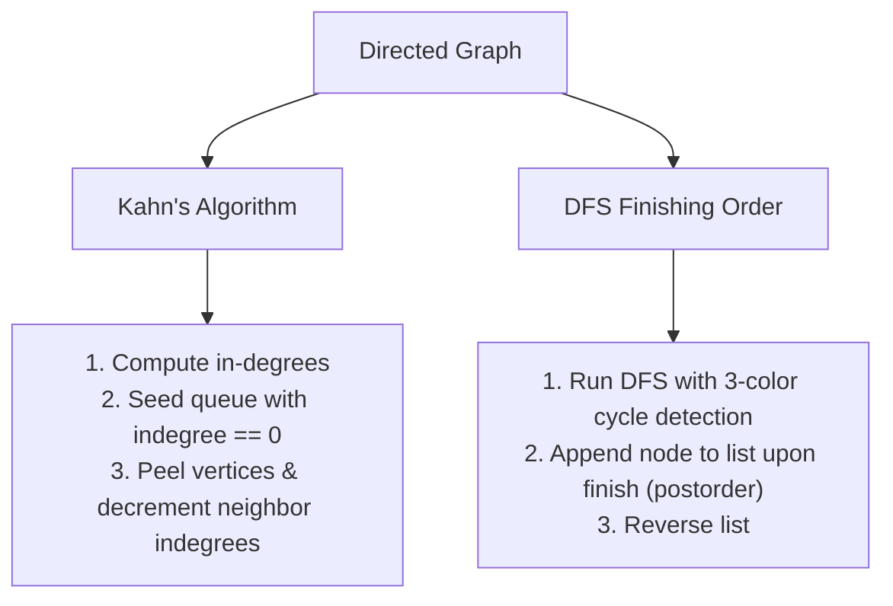

# Topological Sort

> [!NOTE]
> A topological sort of a directed graph is a linear ordering of its vertices such that for every directed edge $u \to v$, vertex $u$ appears before vertex $v$ in the ordering. A topological ordering exists **if and only if** the graph is a **Directed Acyclic Graph (DAG)**. Both classical algorithms—Kahn's in-degree peeling (BFS-style) and DFS reverse postorder—compute a valid ordering in linear $O(V + E)$ time.
>
> Reference implementations: [C++17 Implementation](../../implementations/cpp/topological_sort.cpp) | [Python Implementation](../../implementations/python/topological_sort.py)

> [!TIP]
> **Kahn's Algorithm vs. DFS-Based Sort at a Glance:**
>
> | Algorithm | Core Mechanics | Cycle Detection | Lexicographical Order? |
> | :--- | :--- | :---: | :---: |
> | **Kahn's Algorithm** | In-degree peeling via FIFO queue | Count processed vertices $< V$ | **Yes** (replace queue with min-heap) |
> | **DFS-Based Sort** | Reverse postorder finishing times ($t_{\text{out}}$) | 3-color gray back-edge detection | No (not naturally suited) |

> [!WARNING]
> Topological sorting is strictly defined for **directed** graphs. Applying topological sort to an undirected graph is undefined. Furthermore, always implement cycle detection: if a directed cycle exists, attempting to produce a linear order is impossible, and naive implementations risk infinite loops or silent truncation.

---

## 1. What Is a Topological Ordering?

Let $G = (V, E)$ be a directed graph. A **topological ordering** is a bijection $\pi: V \to \{0, 1, \dots, |V|-1\}$ such that:

$$
\forall (u, v) \in E \implies \pi(u) < \pi(v)
$$

Every directed edge points strictly **forward** (from left to right) in the ordering.

```
Directed Acyclic Graph (DAG):
   [ 5 ] -----> [ 2 ] -----> [ 3 ]
     |                         |
     v                         v
   [ 0 ] <----- [ 4 ] -----> [ 1 ]

Valid Topological Ordering (All arrows point left-to-right):
   [ 4 ] ---> [ 5 ] ---> [ 0 ] ---> [ 2 ] ---> [ 3 ] ---> [ 1 ]
```

### Real-World Systems Applications:
- **Build Systems (Make, Bazel, CMake)**: Source files and header compilation targets form a DAG; compilation order must follow topological order.
- **Package Managers (apt, npm, cargo, pip)**: Package dependencies cannot be resolved with cyclic requirements.
- **Spreadsheet Recomputation Engines**: Formula cells depending on other cells form a dependency DAG.
- **Task & Workflow Schedulers (Airflow, Celery)**: Direct downstream jobs cannot execute until upstream tasks finish.
- **Database Query Optimizers**: Resolving join order dependencies in complex nested SQL views.

---

## 2. When Does a Topological Order Exist?

### Theorem
*A directed graph $G$ has a topological ordering if and only if $G$ contains no directed cycles (i.e., $G$ is a DAG).*

```text
Why Cycles Break Topological Ordering:
Suppose a graph contains a directed triangle:
  A -> B -> C -> A

By definition of topological order:
  pi(A) < pi(B)  and  pi(B) < pi(C)  and  pi(C) < pi(A)

By transitivity of inequalities:
  pi(A) < pi(A)  <-- Contradiction!
No ordering can satisfy all three constraints simultaneously.
```

---

## 3. The Two Classical Algorithms

Topological sorting can be computed in linear $O(V + E)$ time using two distinct computational paradigms:



---

## 4. DFS-Based Topological Sort

### 4.1 Theoretical Foundation: Finishing Times
In Depth-First Search, a vertex $u$ is marked "finished" only after all vertices reachable from $u$ have been fully explored.

For any directed edge $u \to v$ in a DAG:
- If $v$ has not yet been visited, DFS visits $v$ and all its descendants before returning to and finishing $u$. Thus, $v$ finishes before $u$.
- If $v$ was already visited in an earlier DFS branch, $v$ has already finished. Thus, $v$ finishes before $u$.

In all cases in a DAG:

$$
t_{\text{out}}[v] < t_{\text{out}}[u]
$$

Therefore, **listing vertices in decreasing order of their DFS finishing times ($t_{\text{out}}$) produces a valid topological sort**.

```cpp
std::vector<int> topological_sort_dfs(const std::vector<std::vector<int>>& graph) {
    int n = static_cast<int>(graph.size());
    std::vector<int> color(n, 0); // 0=White, 1=Gray, 2=Black
    std::vector<int> order;
    order.reserve(n);

    std::function<void(int)> dfs = [&](int u) {
        color[u] = 1; // Gray: currently in recursion stack
        for (int v : graph[u]) {
            if (color[v] == 1) {
                throw std::runtime_error("Cycle detected: graph is not a DAG");
            }
            if (color[v] == 0) {
                dfs(v);
            }
        }
        color[u] = 2; // Black: finished
        order.push_back(u); // Postorder append
    };

    for (int u = 0; u < n; ++u) {
        if (color[u] == 0) dfs(u);
    }

    std::reverse(order.begin(), order.end()); // Reverse postorder
    return order;
}
```

---

## 5. Kahn's Algorithm (In-Degree Peeling)

Kahn's algorithm (1962) views topological sorting through the lens of prerequisites:
1. Any vertex with **$\text{in-degree} == 0$** has no remaining prerequisites and can be scheduled immediately.
2. When vertex $u$ is scheduled, remove it and all outgoing edges $(u, v)$, decrementing each neighbor's in-degree by 1.
3. If $\text{indegree}[v]$ drops to 0, all prerequisites for $v$ have been satisfied; enqueue $v$.

```cpp
std::vector<int> topological_sort_kahn(const std::vector<std::vector<int>>& graph) {
    int n = static_cast<int>(graph.size());
    std::vector<int> indegree(n, 0);

    for (int u = 0; u < n; ++u) {
        for (int v : graph[u]) ++indegree[v];
    }

    std::queue<int> q;
    for (int u = 0; u < n; ++u) {
        if (indegree[u] == 0) q.push(u);
    }

    std::vector<int> order;
    order.reserve(n);

    while (!q.empty()) {
        int u = q.front(); q.pop();
        order.push_back(u);

        for (int v : graph[u]) {
            if (--indegree[v] == 0) q.push(v);
        }
    }

    // Cycle Detection: If graph had cycles, cycle nodes never reach in-degree 0!
    if (static_cast<int>(order.size()) != n) {
        throw std::runtime_error("Cycle detected: graph is not a DAG");
    }

    return order;
}
```

---

## 6. Lexicographically Smallest Topological Sort

A DAG often admits multiple valid topological orderings. For instance, if tasks 0 and 1 have no prerequisites, either `[0, 1]` or `[1, 0]` is valid.

In automated scheduling and deterministic build systems, we frequently require the **lexicographically smallest** topological order (ties broken by choosing the smallest vertex index first).

### Mechanism: Min-Priority Queue
Replace the standard FIFO queue in Kahn's algorithm with a **min-priority queue** (`std::priority_queue<int, vector<int>, greater<int>>`):
- Whenever multiple vertices reach in-degree 0 simultaneously, the min-heap always pops the smallest numerical vertex index first.
- **Time Complexity**: $O((V + E) \log V)$ due to heap push/pop operations.

```cpp
std::vector<int> lexicographically_smallest_topological_sort(
    const std::vector<std::vector<int>>& graph) {
    int n = static_cast<int>(graph.size());
    std::vector<int> indegree(n, 0);
    for (int u = 0; u < n; ++u) {
        for (int v : graph[u]) ++indegree[v];
    }

    std::priority_queue<int, std::vector<int>, std::greater<int>> pq;
    for (int u = 0; u < n; ++u) {
        if (indegree[u] == 0) pq.push(u);
    }

    std::vector<int> order;
    while (!pq.empty()) {
        int u = pq.top(); pq.pop();
        order.push_back(u);
        for (int v : graph[u]) {
            if (--indegree[v] == 0) pq.push(v);
        }
    }
    if (static_cast<int>(order.size()) != n) {
        throw std::runtime_error("Cycle detected");
    }
    return order;
}
```

---

## 7. Dynamic Programming on DAGs (The True Power of Topological Order)

The most important practical application of topological sort in algorithm engineering is **enabling Dynamic Programming on general directed graphs**.

In a general cyclic graph, dynamic programming fails because dependencies are circular ($dp[u]$ depends on $dp[v]$ which depends on $dp[u]$). But in a DAG:

> Once vertices are arranged in topological order, every edge $(u, v)$ points forward. Processing vertices in topological order guarantees that when computing $dp[v]$, all predecessors $u$ have already been finalized!

### Example: Critical Path / Longest Path in a Weighted DAG
Finding the longest simple path in a general graph is NP-hard. In a DAG, topological sort solves it in **$O(V + E)$** time:

```cpp
int longest_path_dag(int n, const std::vector<std::vector<std::pair<int, int>>>& graph) {
    std::vector<int> order = topological_sort_kahn(unweighted_graph);
    std::vector<int> dist(n, 0);

    for (int u : order) {
        for (const auto& [v, weight] : graph[u]) {
            dist[v] = std::max(dist[v], dist[u] + weight);
        }
    }
    return *std::max_element(dist.begin(), dist.end());
}
```

Other problems solved via Topological DP:
- Counting total distinct paths between source and destination: $dp[v] = \sum_{(u, v)} dp[u]$.
- Single-Source Shortest Path (SSSP) on DAGs with **negative edge weights** in $O(V + E)$ (without needing Bellman-Ford).

---

## 8. Complexity Summary

| Algorithm Variant | Time Complexity | Auxiliary Space | Key Hardware / Systems Advantage |
| :--- | :---: | :---: | :--- |
| **Kahn's Algorithm** | $O(V + E)$ | $O(V)$ | Cache-friendly flat queue; naturally supports streaming in-degree decrements. |
| **DFS-Based Sort** | $O(V + E)$ | $O(V)$ | Direct integration with Tarjan/Kosaraju SCC decomposition algorithms. |
| **Lexicographical Sort** | $O((V + E) \log V)$ | $O(V)$ | Deterministic tie-breaking for repeatable build artifact hashing. |
| **Topological DAG DP** | $O(V + E)$ | $O(V)$ | Linear-time critical path and shortest/longest path computation. |

---

## 9. Common Pitfalls & Edge Cases

1. **Attempting Topological Sort on Cyclic Graphs**: Always check for cycles. Kahn's algorithm detects cycles if $\text{order.size()} < n$. DFS detects cycles via back-edges to gray nodes.
2. **Confusing Preorder with Topological Order**: In DFS, recording nodes upon initial entry (preorder) produces an **invalid** order. Only reverse postorder (recording upon function exit) guarantees that descendants precede ancestors.
3. **Disconnected DAG Components**: Always iterate through all $0 \dots n-1$ vertices in the outer loop. A single traversal from node 0 will miss disconnected subgraphs.
4. **Self-Loops and Multi-Edges**: A self-loop $u \to u$ is a 1-node directed cycle. Kahn's algorithm correctly handles self-loops because $\text{indegree}[u] \ge 1$ forever.

---

## 10. Curated Problems & Case Studies

### 1. LeetCode 207 — Course Schedule
- **Pattern**: Directed cycle detection in a prerequisite graph.
- **Solution**: Kahn's in-degree peeling or 3-color DFS. If topological order contains $< n$ courses, graduation is impossible.

### 2. LeetCode 210 — Course Schedule II
- **Pattern**: Reconstruct a valid linear curriculum path.
- **Solution**: Standard Kahn's algorithm returning the accumulated `order` array.

### 3. LeetCode 269 — Alien Dictionary
- **Pattern**: Extracting DAG edge constraints from lexicographical strings.
- **Solution**: Compare adjacent words to deduce character precedence, build DAG, and apply Kahn's algorithm with cycle validation.

### 4. CSES 1680 — Longest Flight Route
- **Pattern**: Longest path in a DAG using topological dynamic programming.
- **Solution**: Compute topological order, relax forward edges with max-cost updates, and reconstruct the route via parent pointers.

---

## 11. Related Topics & Further Reading

### Internal Documentation
- **[BFS DFS and Traversal Patterns](bfs-dfs-and-traversal-patterns.md)**: Three-color states and edge classifications.
- **[Lowest Common Ancestor](lowest-common-ancestor.md)**: Tree hierarchies and $t_{\text{in}} / t_{\text{out}}$ discovery intervals.
- **[Priority Queues in Practice](../06-heaps-priority-and-selection/priority-queues-in-practice.md)**: Min-heap backends for lexicographical topological sorting.

### Seminal References
- Kahn, A. B. (1962). *Topological sorting of large networks*. Communications of the ACM, 5(11), 558-562.
- Tarjan, R. E. (1972). *Depth-first search and linear graph algorithms*. SIAM Journal on Computing, 1(2), 146-160.
- Cormen, T. H., Leiserson, C. E., Rivest, R. L., & Stein, C. *Introduction to Algorithms (CLRS)*, Chapter 22: Elementary Graph Algorithms.
