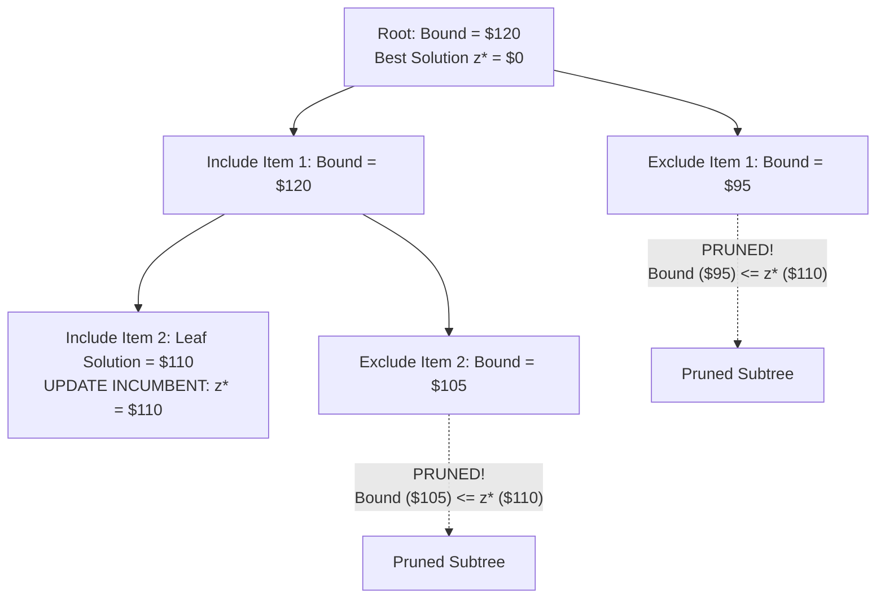
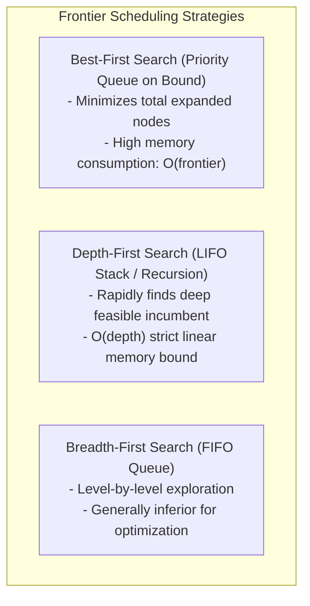

# Branch and Bound

> [!NOTE]
> **The Exact Optimization Paradigm:**
> When solving NP-hard combinatorial optimization problems (e.g. 0/1 Knapsack, Traveling Salesperson, Mixed Integer Programming), pure brute-force requires exploring an astronomically large state space ($O(2^N)$ or $O(N!)$).
> **Branch and Bound (Land & Doig, 1960; Little et al., 1963)** systematically searches the state space by combining:
> 1. **Branching:** Recursively dividing the solution space into smaller, mutually exclusive subproblems.
> 2. **Bounding:** Calculating an optimistic estimate (upper bound for maximization, lower bound for minimization) of the best possible solution reachable within a subproblem via a relaxed mathematical problem.
> 3. **Pruning:** If a subproblem's optimistic bound cannot beat the current best known solution (the **incumbent** $z^*$), the entire subtree is immediately **pruned**.

> [!TIP]
> **The Secret: High-Quality Relaxations:**
> The efficiency of Branch and Bound is completely dictated by the **tightness** of its bounding function:
> For 0/1 Knapsack, relaxing the integrality constraint $x_i \in \{0, 1\}$ to continuous fractions $x_i \in [0, 1]$ (**Fractional Knapsack**) allows calculating a tight upper bound in $O(N)$ time via a greedy density sort.
> A tighter bound prunes exponentially more subtrees, transforming exponential runtimes into practical milliseconds.

> [!WARNING]
> **Memory Explosion in Best-First Search:**
> **Best-First Search** (expanding the node with the highest bound using a priority queue) minimizes the total number of nodes explored.
> However, the priority queue can hold an exponential number of active frontier states, exhausting RAM!
> In memory-constrained systems, **Depth-First Branch and Bound** is preferred because its memory usage is strictly bounded by $O(\text{depth})$.



---

## 1. Core Mental Model & Motivation

Optimization problems seek a solution $x \in \mathcal{S}$ that maximizes an objective $f(x)$ subject to constraints.
Unlike decision problems (where backtracking stops at the first valid configuration), optimization problems require finding the **globally optimal** solution.

Backtracking blindly explores all candidate solutions unless feasibility constraints are violated.
**Branch and Bound introduces an optimization-aware pruning rule**:
- Maintain an **incumbent** $z^*$, the objective value of the best valid solution found so far.
- For any unexplored subproblem $S$, compute an **upper bound** $UB(S)$ such that:
  $$\forall x \in S, \quad f(x) \le UB(S)$$
- If $UB(S) \le z^*$, then even under the most optimistic assumptions, no solution in $S$ can ever beat our existing solution $z^*$.
- Therefore, subproblem $S$ is **pruned** immediately, saving potentially billions of recursive subcalls!

---

## 2. Mathematical Formulation & Structural Invariants

Let the optimization problem be:
$$\max_{x \in \mathcal{X}} f(x)$$
where $\mathcal{X}$ is a discrete set of feasible solutions.

### Invariant 1: Valid Relaxation (Bounding Guarantee)
For any subset of solutions $\mathcal{X}_{node} \subseteq \mathcal{X}$, the bounding function $UB(\mathcal{X}_{node})$ must satisfy:
$$\max_{x \in \mathcal{X}_{node}} f(x) \le UB(\mathcal{X}_{node})$$
If the bounding function ever underestimates the true maximum, optimal solutions may be pruned erroneously (violating exactness).

### Invariant 2: Monotonicity of Bounds
As we branch deeper into the state tree ($\mathcal{X}_{child} \subset \mathcal{X}_{parent}$):
$$UB(\mathcal{X}_{child}) \le UB(\mathcal{X}_{parent})$$
Narrowing the decision space can only restrict the optimistic bound.

### Invariant 3: The Pruning Invariant
At any point during execution, if $UB(\mathcal{X}_{node}) \le z^*$, discarding $\mathcal{X}_{node}$ guarantees that no solution strictly better than $z^*$ is lost.

---

## 3. Node Selection Strategies: Frontier Exploration



### 3.1 Best-First Search (A* for Combinatorial Optimization)
- Active subproblems are maintained in a max-priority queue ordered by their optimistic bound $UB$.
- Always expands the node with the highest potential reward.
- **Optimality Property:** Best-First Search is guaranteed to expand the minimal possible number of nodes among all algorithms using the same bounding function.

### 3.2 Depth-First Branch and Bound (DFBnB)
- Traverses down a single branch until it hits a leaf, establishing a strong feasible incumbent $z^*$ early.
- Strong incumbents enable aggressive pruning when backtracking up the tree.
- Memory footprint is strictly $O(N)$, making it the standard choice for large industrial problems.

---

## 4. Case Study: 0/1 Knapsack via Branch and Bound

Given $N$ items with values $v_i$, weights $w_i$, and knapsack capacity $W$, maximize total value subject to total weight $\le W$ with $x_i \in \{0, 1\}$.

### 4.1 The Fractional Knapsack Upper Bound
1. Pre-sort all items in descending order of value density:
   $$\frac{v_1}{w_1} \ge \frac{v_2}{w_2} \ge \dots \ge \frac{v_n}{w_n}$$
2. At state $(level, \text{current\_weight}, \text{current\_value})$:
   - Greefully pack subsequent items while they fit:
     $$\text{bound} = \text{current\_value}, \quad \text{rem\_cap} = W - \text{current\_weight}$$
   - When the next item $k$ exceeds $\text{rem\_cap}$, take the fractional portion:
     $$\text{bound} \mathrel{+}= \text{rem\_cap} \cdot \left(\frac{v_k}{w_k}\right)$$
   - Return $\text{bound}$.

### 4.2 State Transition Algorithm
```text
BranchAndBoundKnapsack(items, W):
    Sort items by value / weight descending
    PriorityQueue pq (ordered by bound descending)
    z* = 0 (incumbent)

    pq.push(Node(level = 0, weight = 0, value = 0, bound = FractionalBound(...)))

    while not pq.empty():
        curr = pq.pop()
        if curr.bound <= z*:
            continue  // PRUNE!

        // Branch 1: Include item[curr.level]
        if curr.weight + w[curr.level] <= W:
            left.weight = curr.weight + w[curr.level]
            left.value = curr.value + v[curr.level]
            left.bound = FractionalBound(left)
            z* = max(z*, left.value)
            if left.bound > z*:
                pq.push(left)

        // Branch 2: Exclude item[curr.level]
        right.weight = curr.weight
        right.value = curr.value
        right.bound = FractionalBound(right)
        if right.bound > z*:
            pq.push(right)

    return z*
```

---

## 5. Algorithmic Complexity Analysis

| Problem & Approach | Worst-Case Time | Average Empirical Time | Worst-Case Space |
| :--- | :--- | :--- | :--- |
| **0/1 Knapsack (Brute Force)** | $O(2^N)$ | $O(2^N)$ | $O(N)$ |
| **0/1 Knapsack (DP Table)** | $O(N \cdot W)$ | $O(N \cdot W)$ | $O(N \cdot W)$ or $O(W)$ |
| **0/1 Knapsack (Branch & Bound)**| $O(2^N)$ | **Sub-polynomial on typical inputs** | BestFS: $O(2^N)$, DFBnB: $O(N)$ |
| **TSP (Branch & Bound)** | $O(N!)$ | Solves $N \approx 50-100$ quickly | $O(N^2)$ (Matrix bounds) |

> [!NOTE]
> When capacity $W$ is massive ($W = 10^{14}$), Dynamic Programming fails because $O(NW)$ space/time is pseudo-polynomial and intractable.
> Branch and Bound handles astronomical $W$ effortlessly, because its branching depends strictly on item counts $N$, independent of $W$'s magnitude!

---

## 6. High-Performance Engineering & Practical Heuristics

1. **Warm Starting the Incumbent:** Before starting Branch and Bound, run a fast greedy heuristic to set $z^* = \text{GreedyValue}$. A strong initial incumbent prunes huge portions of the search space right from the root!
2. **Item Pre-Sorting:** Always sort items once upfront by $\frac{v_i}{w_i}$. This allows the bounding function to run in $O(1)$ amortized steps without re-sorting.
3. **Integer Bound Truncation:** Since all item values $v_i$ are integers, any valid solution must have integer value. Therefore, the upper bound can be safely floored:
   $$UB = \lfloor \text{FractionalBound} \rfloor$$

---

## 7. Edge Cases & Failure Modes

1. **Zero Weight / Zero Value Items:** Items with $w_i = 0$ must be included immediately if $v_i > 0$.
2. **Total Weight Fits Entirely:** If $\sum w_i \le W$, all items fit; return $\sum v_i$ without branching.
3. **Empty Item List or Zero Capacity:** Return 0 immediately.

---

## 8. Reference Implementation Architecture

Both C++17 and Python 3 reference implementations implement:
- **`BranchAndBoundKnapsack`**:
  - High-performance Best-First search with Fractional Knapsack bounding
  - Fast greedy warm-starting
  - Item sorting and integer bound flooring
- **`DynamicProgrammingOracle`**:
  - Exact classical 0/1 knapsack DP for differential verification across randomized test instances.

---

## 9. Differential Testing & Oracle Verification Strategy

- Automated differential testing against the exact Dynamic Programming knapsack oracle across 100 randomized instances with varying weights and values.
- Verifies that Branch and Bound outputs the exact optimal solution bit-for-bit while expanding only a tiny fraction of the state space.

---

## 10. Engineering Pitfalls & Optimization Notes

> [!CAUTION]
> **Admissibility of the Bounding Function:**
> Never use a heuristic estimate as a bound in Branch and Bound. A bound must be a **mathematical relaxation** (true upper or lower bound). If the bound underestimates the true maximum for even a single subproblem, the global optimum may be pruned, producing incorrect results.

---

## 11. Real-World Applications & Industry Context

1. **Commercial MILP Solvers (Gurobi, CPLEX, SCIP):** The multi-billion-dollar operations research industry relies on advanced Branch-and-Cut (Branch and Bound combined with cutting planes) to solve supply chain, airline crew scheduling, and power grid optimization problems.
2. **Chip Floorplanning & Electronic Design Automation (EDA):** Optimal placement of logic gates and routing wire lengths on semiconductor wafers.
3. **Robotic Path Planning & Kinematics:** Trajectory optimization with obstacle avoidance constraints.

---

## 12. Curated Academic References

1. **Land, Ailsa H. & Doig, Alison G. (1960):** *An automatic method of solving discrete programming problems*. Econometrica, 28(3), pp. 497–520.
2. **Little, John D. C., Murty, Katta G., Sweeney, Dura W., & Karel, Caroline (1963):** *An algorithm for the traveling salesman problem*. Operations Research, 11(6), pp. 972–989.
3. **Morrison, David R., Jacobson, Sheldon H., Sauppe, Jason J., & Sewell, Edward C. (2016):** *Branch-and-bound algorithms: A survey of techniques for solving hard discrete optimization problems*. Discrete Optimization, 19, pp. 79–102.
