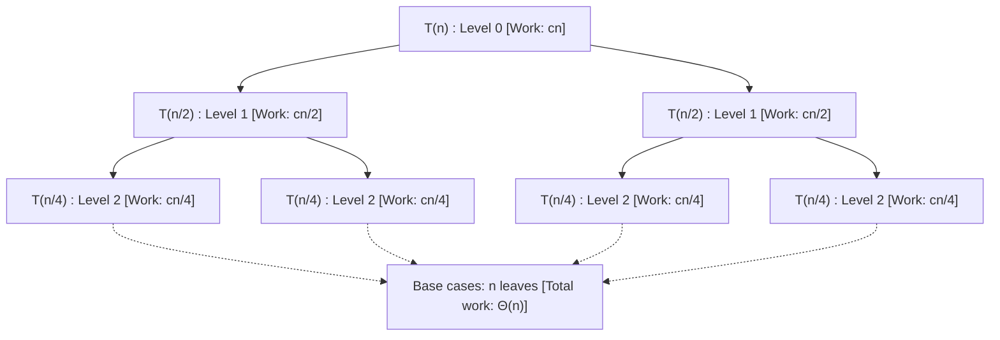

# Divide and Conquer

> [!NOTE]
> A **Divide-and-Conquer** algorithm partitions a problem into smaller, non-overlapping (or disjoint) subproblems of the same type, solves them recursively, and combines their solutions to form the global solution.
>
> Reference implementations: [C++17 Implementation](../../implementations/cpp/divide_and_conquer.cpp) | [Python Implementation](../../implementations/python/divide_and_conquer.py)

> [!TIP]
> **The Master Theorem Decision Matrix ($T(n) = aT(n/b) + f(n)$ where $c = \log_b a$):**
> 1. **Case 1 ($f(n) = O(n^{c - \epsilon})$ for $\epsilon > 0$):** Leaves dominate. $T(n) = \Theta(n^{\log_b a})$.
> 2. **Case 2 ($f(n) = \Theta(n^c \log^k n)$ for $k \ge 0$):** Work is evenly spread across levels. $T(n) = \Theta(n^c \log^{k+1} n)$.
> 3. **Case 3 ($f(n) = \Omega(n^{c + \epsilon})$ for $\epsilon > 0$ and regularity $a f(n/b) \le d f(n)$ for $d < 1$):** Root dominates. $T(n) = \Theta(f(n))$.
> When subproblems have unequal divisions (e.g., $T(n) = T(n/3) + T(2n/3) + O(n)$), use the **Akra-Bazzi method** or recursion tree analysis.

> [!WARNING]
> **Divide-and-Conquer Failure Modes & Engineering Pitfalls:**
> - **Midpoint Integer Overflow:** Never compute midpoint as `(low + high) / 2` in fixed-width types. Use `low + (high - low) / 2` or unsigned shift arithmetic.
> - **Overlapping Subproblems:** If subproblems repeat (e.g., naive recursive Fibonacci or 0-1 Knapsack), D&C degrades exponentially to $\Omega(2^n)$; use Dynamic Programming instead.
> - **Stack Depth & Degenerate Partitions:** Highly asymmetric splits (e.g., Quicksort with sorted data and naive pivot) cause $O(n)$ call stack depth, risking stack overflow. Mitigate with tail-recursion elimination, random pivots, or introselect.
> - **Expensive Combine Step:** If combining takes $\Omega(n^2)$, D&C loses its asymptotic advantage even with small recursive branches.

Divide and conquer is one of the most important algorithm design paradigms.

It follows a simple three-part pattern:

1. **Divide** the problem into smaller subproblems
2. **Conquer** the subproblems recursively
3. **Combine** their solutions into the final answer

This idea appears across algorithm design:

- sorting
- searching
- multiplication
- selection
- geometry
- matrix algorithms
- recurrence analysis

Divide and conquer is powerful because it can turn a hard problem into smaller copies of itself, often producing elegant algorithms with strong asymptotic performance.

This chapter develops:

- the divide-conquer-combine framework
- recurrence relations
- the Master Theorem
- recursion tree intuition
- major examples such as merge sort and binary search
- selection and multiplication speedups
- the contrast with dynamic programming
- important implementation pitfalls

---

## 1. The divide-conquer-combine framework

A divide-and-conquer algorithm usually has three stages.

### A. Divide
Break the input into smaller subproblems.

### B. Conquer
Solve the subproblems recursively.

### C. Combine
Merge the subproblem answers into the final answer.

This can be written schematically as:

```text
solve problem of size n
    ->
split into smaller problems
    ->
solve each smaller problem
    ->
combine the results
```

### Example intuition
Suppose you want to sort a large array.

Instead of sorting it all at once:

- split it into two halves
- sort each half
- merge the two sorted halves

That is exactly merge sort.

---

## 2. Why divide and conquer works

The paradigm works well when:

- subproblems are significantly smaller than the original
- recursive solutions are easy to define
- the combine step is efficient
- the subproblems are mostly independent

The key word here is **independent**.

Unlike dynamic programming, divide and conquer is most natural when the recursive subproblems do not overlap heavily.

---

## 3. Recurrence relations

The running time of a divide-and-conquer algorithm is often described by a **recurrence relation**.

A standard form is:

$$
T(n) = aT\left(\frac{n}{b}\right) + f(n)
$$

where:

- $ a $ = number of subproblems
- $ n/b $ = size of each subproblem
- $ f(n) $ = work done outside the recursive calls, usually the divide and combine work

This form captures many classical algorithms.

### Examples

#### Merge sort
$$
T(n) = 2T(n/2) + O(n)
$$

#### Binary search
$$
T(n) = T(n/2) + O(1)
$$

#### Strassen matrix multiplication
$$
T(n) = 7T(n/2) + O(n^2)
$$

---

## 4. Recursion tree intuition

A useful way to understand a recurrence is to draw a **recursion tree**.

Each node represents one recursive call.

Its children represent the smaller calls it creates.

The total work is then:

- work at the root
- plus work at the next level
- plus work at every deeper level

### Merge sort example

For:

$$
T(n) = 2T(n/2) + O(n)
$$

- level 0 does $ O(n) $ work
- level 1 has two calls, each doing $ O(n/2) $, total $ O(n) $
- level 2 has four calls, each doing $ O(n/4) $, total $ O(n) $

So each level costs $ O(n) $, and there are $ O(\log n) $ levels.

Therefore:

$$
T(n) = O(n \log n)
$$

This level-by-level view is often more intuitive than memorizing formulas.





---

## 5. The Master Theorem

The **Master Theorem** gives a fast way to solve many recurrences of the form:

$$
T(n) = aT(n/b) + f(n)
$$

It compares:

- the recursive work size, roughly $ n^{\log_b a} $
- the non-recursive work $ f(n) $

The quantity

$$
n^{\log_b a}
$$

is the critical benchmark.

---

## 6. Master Theorem Case 1

If:

$$
f(n) = O\left(n^{\log_b a - \varepsilon}\right)
$$

for some $ \varepsilon > 0 $, then the recursive part dominates.

So:

$$
T(n) = \Theta\left(n^{\log_b a}\right)
$$

### Example
$$
T(n) = 4T(n/2) + O(n)
$$

Here:

$$
n^{\log_2 4} = n^2
$$

and $ O(n) $ is smaller, so:

$$
T(n) = \Theta(n^2)
$$

---

## 7. Master Theorem Case 2

If:

$$
f(n) = \Theta\left(n^{\log_b a}\log^k n\right)
$$

for some $ k \ge 0 $, then the work is balanced.

So:

$$
T(n) = \Theta\left(n^{\log_b a}\log^{k+1} n\right)
$$

### Example
$$
T(n) = 2T(n/2) + O(n)
$$

Here:

$$
n^{\log_2 2} = n
$$

So this is the balanced case, and:

$$
T(n) = \Theta(n \log n)
$$

This is merge sort.

---

## 8. Master Theorem Case 3

If:

$$
f(n) = \Omega\left(n^{\log_b a + \varepsilon}\right)
$$

for some $ \varepsilon > 0 $, and a regularity condition holds, then the combine work dominates.

So:

$$
T(n) = \Theta(f(n))
$$

### Example
$$
T(n) = 2T(n/2) + O(n^2)
$$

Here the non-recursive work dominates, so:

$$
T(n) = \Theta(n^2)
$$

---

## 9. When the Master Theorem does not apply

> [!WARNING]
> **Master Theorem Applicability Boundaries:**
> - **Form requirement:** Strictly applies to recurrences matching $T(n) = aT(n/b) + f(n)$ where $a \ge 1$ and $b > 1$ are constants.
> - **Does NOT apply to:**
>   - **Subtractive recurrences:** $T(n) = T(n-1) + O(1)$ (Linear recurrence, solves to $O(n)$ via telescoping).
>   - **Variable branching:** $T(n) = n T(n/2)$ or $T(n) = 2^n T(n/2)$.
>   - **Asymmetric branch sizes:** $T(n) = T(n/3) + T(2n/3) + O(n)$ (Requires Akra-Bazzi integration or uneven recursion tree bounds).
>   - **Non-polynomial gaps:** Between Case 1 and Case 2 (e.g., $f(n) = n^{\log_b a} / \log n$), $f(n)$ is strictly smaller than $n^{\log_b a}$, but not *polynomially* smaller by $n^\epsilon$.


The Master Theorem is very useful, but not universal.

It does **not** directly handle every recurrence.

Examples include:

- uneven splits
- subtractive recurrences like $ T(n) = T(n-1) + O(1) $
- unusual $ f(n) $ terms
- non-constant branching patterns

In such cases, other tools may help:

- recursion trees
- substitution
- telescoping
- Akra-Bazzi-style reasoning

---

## 10. Akra-Bazzi intuition

You do not always need the full theorem, but the intuition is useful.

Akra-Bazzi generalizes Master-Theorem-style analysis to recurrences like:

$$
T(x) = \sum_{i=1}^{k} a_i T(b_i x) + g(x)
$$

where the subproblems may have **different sizes**.

This matters when the split is not perfectly balanced.

### Key idea
Instead of relying on one fixed exponent from $ a $ and $ b $, Akra-Bazzi finds the critical growth rate by solving a balance equation.

For most foundational study, this is enough to know:

- Master Theorem handles many symmetric recurrences
- Akra-Bazzi helps when the recursion is more irregular

---

## 11. Merge sort

Merge sort is one of the classical divide-and-conquer algorithms.

### Idea
1. Divide the array into two halves
2. Recursively sort each half
3. Merge the two sorted halves

### Why it matters
Merge sort is a stable comparison sort with time complexity:

$$
O(n \log n)
$$

in the worst case.

That is asymptotically optimal for comparison-based sorting.

---

## 12. Why merge sort is optimal among comparison sorts

Any comparison sort must distinguish among all possible input orderings.

This leads to a decision-tree lower bound of:

$$
\Omega(n \log n)
$$

comparisons in the worst case.

Merge sort achieves:

$$
O(n \log n)
$$

so it is asymptotically optimal in this model.

---

## 13. C++17 reference implementation of merge sort

```cpp
#include <vector>
#include <algorithm>

void merge_sort(std::vector<int>& a) {
    std::vector<int> temp(a.size());

    auto solve = [&](auto&& self, int left, int right) -> void {
        if (right - left <= 1) {
            return;
        }

        int mid = left + (right - left) / 2;
        self(self, left, mid);
        self(self, mid, right);

        int i = left, j = mid, k = left;
        while (i < mid && j < right) {
            if (a[i] <= a[j]) {
                temp[k++] = a[i++];
            } else {
                temp[k++] = a[j++];
            }
        }
        while (i < mid) temp[k++] = a[i++];
        while (j < right) temp[k++] = a[j++];

        for (int p = left; p < right; ++p) {
            a[p] = temp[p];
        }
    };

    solve(solve, 0, static_cast<int>(a.size()));
}
```

---

## 14. Python reference implementation of merge sort

```python
def merge_sort(a):
    temp = [0] * len(a)

    def solve(left, right):
        if right - left <= 1:
            return

        mid = left + (right - left) // 2
        solve(left, mid)
        solve(mid, right)

        i, j, k = left, mid, left
        while i < mid and j < right:
            if a[i] <= a[j]:
                temp[k] = a[i]
                i += 1
            else:
                temp[k] = a[j]
                j += 1
            k += 1

        while i < mid:
            temp[k] = a[i]
            i += 1
            k += 1

        while j < right:
            temp[k] = a[j]
            j += 1
            k += 1

        for p in range(left, right):
            a[p] = temp[p]

    solve(0, len(a))
```

---

## 15. Inversion counting with merge sort

Merge sort also supports a beautiful extension: **counting inversions**.

### Definition
An inversion is a pair $ (i, j) $ such that:

- $ i < j $
- $ a[i] > a[j] $

It measures how far an array is from being sorted.

### Why divide and conquer helps
While merging two sorted halves, if an element from the right half is chosen before one from the left half, then it forms inversions with all remaining left-half elements.

This gives an $ O(n \log n) $ inversion counter instead of the naive $ O(n^2) $ method.

---

## 16. C++17 inversion counting

```cpp
#include <vector>

long long count_inversions(std::vector<int>& a) {
    std::vector<int> temp(a.size());

    auto solve = [&](auto&& self, int left, int right) -> long long {
        if (right - left <= 1) {
            return 0;
        }

        int mid = left + (right - left) / 2;
        long long inv = self(self, left, mid) + self(self, mid, right);

        int i = left, j = mid, k = left;
        while (i < mid && j < right) {
            if (a[i] <= a[j]) {
                temp[k++] = a[i++];
            } else {
                temp[k++] = a[j++];
                inv += mid - i;
            }
        }

        while (i < mid) temp[k++] = a[i++];
        while (j < right) temp[k++] = a[j++];

        for (int p = left; p < right; ++p) {
            a[p] = temp[p];
        }

        return inv;
    };

    return solve(solve, 0, static_cast<int>(a.size()));
}
```

---

## 17. Python inversion counting

```python
def count_inversions(a):
    temp = [0] * len(a)

    def solve(left, right):
        if right - left <= 1:
            return 0

        mid = left + (right - left) // 2
        inv = solve(left, mid) + solve(mid, right)

        i, j, k = left, mid, left
        while i < mid and j < right:
            if a[i] <= a[j]:
                temp[k] = a[i]
                i += 1
            else:
                temp[k] = a[j]
                j += 1
                inv += mid - i
            k += 1

        while i < mid:
            temp[k] = a[i]
            i += 1
            k += 1

        while j < right:
            temp[k] = a[j]
            j += 1
            k += 1

        for p in range(left, right):
            a[p] = temp[p]

        return inv

    return solve(0, len(a))
```

---

## 18. Binary search

Binary search is one of the simplest divide-and-conquer algorithms.

### Idea
At each step:

- compare with the middle element
- discard half the search space
- continue on the remaining half

This gives the recurrence:

$$
T(n) = T(n/2) + O(1)
$$

so:

$$
T(n) = O(\log n)
$$

---

## 19. Why binary search is divide and conquer

Binary search is sometimes so familiar that people forget its structure.

But it fits the paradigm perfectly:

- **Divide:** choose the midpoint and decide which half may contain the answer
- **Conquer:** recurse or iterate on that half
- **Combine:** almost nothing; the combine step is trivial

So binary search is a **degenerate** but very important divide-and-conquer example.

---

## 20. C++17 binary search example

```cpp
#include <vector>

int binary_search_index(const std::vector<int>& a, int target) {
    int low = 0, high = static_cast<int>(a.size()) - 1;

    while (low <= high) {
        int mid = low + (high - low) / 2;
        if (a[mid] == target) {
            return mid;
        } else if (a[mid] < target) {
            low = mid + 1;
        } else {
            high = mid - 1;
        }
    }

    return -1;
}
```

---

## 21. Python binary search example

```python
def binary_search_index(a, target):
    low, high = 0, len(a) - 1

    while low <= high:
        mid = low + (high - low) // 2
        if a[mid] == target:
            return mid
        elif a[mid] < target:
            low = mid + 1
        else:
            high = mid - 1

    return -1
```

---

## 22. Maximum subarray problem

The **maximum subarray problem** asks:

> Find the contiguous subarray with maximum sum.

This problem has a famous divide-and-conquer solution, but also a simpler linear-time method called **Kadane's algorithm**.

That makes it a useful comparison topic.

---

## 23. Divide-and-conquer idea for maximum subarray

For a segment:

- the best subarray lies entirely in the left half, or
- entirely in the right half, or
- crosses the midpoint

So we:

1. solve the left half
2. solve the right half
3. compute the best crossing subarray
4. take the maximum of the three

This gives:

$$
T(n) = 2T(n/2) + O(n)
$$

so:

$$
T(n) = O(n \log n)
$$

---

## 24. C++17 maximum subarray divide-and-conquer

```cpp
#include <vector>
#include <algorithm>
#include <limits>

long long maximum_subarray_dc(const std::vector<int>& a) {
    auto solve = [&](auto&& self, int left, int right) -> long long {
        if (right - left == 1) {
            return a[left];
        }

        int mid = left + (right - left) / 2;
        long long left_best = self(self, left, mid);
        long long right_best = self(self, mid, right);

        long long best_left_suffix = std::numeric_limits<long long>::min();
        long long sum = 0;
        for (int i = mid - 1; i >= left; --i) {
            sum += a[i];
            best_left_suffix = std::max(best_left_suffix, sum);
        }

        long long best_right_prefix = std::numeric_limits<long long>::min();
        sum = 0;
        for (int i = mid; i < right; ++i) {
            sum += a[i];
            best_right_prefix = std::max(best_right_prefix, sum);
        }

        long long cross = best_left_suffix + best_right_prefix;
        return std::max({left_best, right_best, cross});
    };

    return solve(solve, 0, static_cast<int>(a.size()));
}
```

---

## 25. Python maximum subarray divide-and-conquer

```python
def maximum_subarray_dc(a):
    def solve(left, right):
        if right - left == 1:
            return a[left]

        mid = left + (right - left) // 2
        left_best = solve(left, mid)
        right_best = solve(mid, right)

        best_left_suffix = -10**18
        s = 0
        for i in range(mid - 1, left - 1, -1):
            s += a[i]
            best_left_suffix = max(best_left_suffix, s)

        best_right_prefix = -10**18
        s = 0
        for i in range(mid, right):
            s += a[i]
            best_right_prefix = max(best_right_prefix, s)

        cross = best_left_suffix + best_right_prefix
        return max(left_best, right_best, cross)

    return solve(0, len(a))
```

---

## 26. Kadane versus divide and conquer

> [!NOTE]
> **Kadane's Algorithm vs. Divide-and-Conquer:**
> While divide-and-conquer solves the maximum subarray problem in $O(n \log n)$ time and $O(\log n)$ stack space by partitioning around the midpoint, Kadane's algorithm leverages dynamic programming (tracking the running prefix sum $\max(a_i, \text{current\_sum} + a_i)$) to achieve optimal $O(n)$ time and $O(1)$ auxiliary space. Maximum subarray is nonetheless an essential pedagogical bridge showing how crossing boundary conditions can be merged in linear time.


Maximum subarray is interesting because divide and conquer works, but it is not the best final method.

### Divide and conquer
$$
O(n \log n)
$$

### Kadane's algorithm
$$
O(n)
$$

So this is a useful lesson:

> A divide-and-conquer solution may be elegant and correct, but another paradigm may still be faster.

This helps students compare paradigms rather than treating one as always superior.

---

## 27. QuickSelect

The **selection problem** asks for the $ k $-th smallest element.

A divide-and-conquer approach called **QuickSelect** works by:

1. choosing a pivot
2. partitioning the array
3. recurring only into the side containing the desired rank

This is related to QuickSort, but only one side is explored.

### Average-case complexity

$$
O(n)
$$

### Worst-case complexity

$$
O(n^2)
$$

if pivot choices are bad.

---

## 28. QuickSelect intuition

QuickSelect avoids sorting everything.

If the pivot ends up at position $ p $:

- if $ p = k $, we are done
- if $ k < p $, recurse left
- if $ k > p $, recurse right

So each step discards a large part of the array, at least on average.

This is a classic example of partial divide and conquer.

---

## 29. Median of medians intuition

QuickSelect has a good average case, but not a guaranteed linear worst case.

The **median of medians** method chooses pivots more carefully so that enough elements are discarded every time.

This gives worst-case:

$$
O(n)
$$

selection.

### Why this matters
It shows that careful pivot design can turn a probabilistically good algorithm into a worst-case guaranteed one.

For many learners, the most important takeaway is conceptual:

- naive pivoting -> average-case linear
- structured pivoting -> worst-case linear

---

## 30. C++17 QuickSelect example

```cpp
#include <vector>
#include <algorithm>
#include <stdexcept>

int quickselect(std::vector<int> a, int k) {
    if (k < 0 || k >= static_cast<int>(a.size())) {
        throw std::out_of_range("k out of range");
    }

    int left = 0, right = static_cast<int>(a.size()) - 1;

    while (true) {
        int pivot = a[right];
        int i = left;

        for (int j = left; j < right; ++j) {
            if (a[j] <= pivot) {
                std::swap(a[i], a[j]);
                ++i;
            }
        }
        std::swap(a[i], a[right]);

        if (i == k) {
            return a[i];
        } else if (k < i) {
            right = i - 1;
        } else {
            left = i + 1;
        }
    }
}
```

---

## 31. Python QuickSelect example

```python
def quickselect(a, k):
    if k < 0 or k >= len(a):
        raise IndexError("k out of range")

    a = a[:]
    left, right = 0, len(a) - 1

    while True:
        pivot = a[right]
        i = left

        for j in range(left, right):
            if a[j] <= pivot:
                a[i], a[j] = a[j], a[i]
                i += 1

        a[i], a[right] = a[right], a[i]

        if i == k:
            return a[i]
        elif k < i:
            right = i - 1
        else:
            left = i + 1
```

---

## 32. Karatsuba multiplication intuition

The usual school method for multiplying large numbers splits each number into parts and performs four submultiplications.

**Karatsuba's algorithm** improves this by reducing the number of recursive multiplications from 4 to 3.

This gives a faster recurrence than the naive divide-and-conquer approach.

### Idea sketch

Write:

$$
x = a \cdot 10^m + b,\quad y = c \cdot 10^m + d
$$

Naively:

$$
xy = ac \cdot 10^{2m} + (ad + bc)\cdot 10^m + bd
$$

Karatsuba computes:

- $ ac $
- $ bd $
- $ (a+b)(c+d) $

and then recovers $ ad + bc $ from them.

This reduces the recurrence to:

$$
T(n) = 3T(n/2) + O(n)
$$

which is better than:

$$
4T(n/2) + O(n)
$$

So:

$$
T(n) = O(n^{\log_2 3})
$$

which is about $ O(n^{1.585}) $.

---

## 33. Strassen matrix multiplication intuition

Standard matrix multiplication on $ n \times n $ matrices gives the recurrence:

$$
T(n) = 8T(n/2) + O(n^2)
$$

which solves to:

$$
O(n^3)
$$

**Strassen's algorithm** reduces the number of recursive submultiplications from 8 to 7.

So the recurrence becomes:

$$
T(n) = 7T(n/2) + O(n^2)
$$

giving:

$$
O(n^{\log_2 7})
$$

which is about $ O(n^{2.807}) $.

### Why this matters
It shows an important divide-and-conquer theme:

> Sometimes the biggest improvement comes from reducing the number of recursive subproblems.

---

## 34. Divide and conquer versus dynamic programming

These paradigms are related, but different.

### Divide and conquer
Usually works best when subproblems are mostly disjoint.

### Dynamic programming
Works best when subproblems overlap significantly.

### Example
Merge sort:
- left and right halves are disjoint
- divide and conquer is natural

Fibonacci recursion:
- the same values are recomputed repeatedly
- plain divide and conquer is wasteful
- dynamic programming is better

So the key distinction is often:

> disjoint subproblems versus overlapping subproblems

---

## 35. Recognizing divide-and-conquer opportunities

This paradigm is promising when:

- the problem can be split cleanly
- smaller subproblems resemble the original
- the combine step is manageable
- subproblems do not heavily overlap
- recursion depth remains reasonable

This pattern appears often in:

- search
- sorting
- selection
- geometry
- algebraic speedups

---

## 36. Common implementation pitfalls

### Mistake 1: weak or missing base case
Without a correct base case, recursion may never stop.

### Mistake 2: midpoint overflow
In languages with fixed-width integers, avoid:

```text
mid = (low + high) / 2
```

Prefer:

```text
mid = low + (high - low) / 2
```

This prevents overflow.

### Mistake 3: off-by-one errors in index ranges
Be very clear whether intervals are:

- closed
- half-open
- inclusive-exclusive

Half-open ranges like `[left, right)` often reduce mistakes.

### Mistake 4: recursion depth and stack overflow
Deep recursion can be dangerous on large inputs.

### Mistake 5: expensive combine step
If the combine step is too costly, divide and conquer may lose its advantage.

### Mistake 6: ignoring constants
An asymptotically faster recursive method may be slower in practice for moderate sizes because of constant factors and memory overhead.

---

## 37. Comparison table

| Problem | Divide step | Combine step | Time complexity |
|---|---|---|---:|
| Binary search | keep one half | trivial | $ O(\log n) $ |
| Merge sort | split into halves | merge sorted halves | $ O(n \log n) $ |
| Maximum subarray D and C | split at midpoint | best crossing sum | $ O(n \log n) $ |
| QuickSelect average case | partition around pivot | recurse one side | $ O(n) $ average |
| Karatsuba | split numbers | recombine polynomial terms | $ O(n^{\log_2 3}) $ |
| Strassen | split matrices | recombine 7 products | $ O(n^{\log_2 7}) $ |

---

## 38. Applications

### A. Sorting and searching
Merge sort and binary search are foundational.

### B. Selection
QuickSelect avoids fully sorting the input.

### C. Numerical algorithms
Karatsuba and Strassen show divide and conquer in arithmetic acceleration.

### D. Geometry
Closest pair and related plane algorithms use recursive spatial partitioning.

### E. Parallel computation
Independent subproblems can often be solved in parallel.

---

## 39. Summary

Divide and conquer solves problems by:

1. dividing into smaller subproblems
2. solving them recursively
3. combining their answers

Its running times are often captured by recurrences such as:

$$
T(n) = aT(n/b) + f(n)
$$

and many of these can be analyzed using:

- recursion trees
- the Master Theorem
- more general ideas such as Akra-Bazzi intuition

Classical examples include:

- merge sort
- binary search
- maximum subarray
- QuickSelect
- Karatsuba multiplication
- Strassen matrix multiplication

Divide and conquer is most natural when subproblems are largely independent.

When subproblems overlap heavily, dynamic programming is often the better paradigm.

---

## 40. Practice prompts

1. What are the three stages of divide and conquer?
2. Why does merge sort satisfy
   $$
   T(n) = 2T(n/2) + O(n)
   $$
   ?
3. Why is binary search a divide-and-conquer algorithm?
4. When does the Master Theorem apply?
5. Why is maximum subarray a useful comparison between paradigms?
6. What improvement does Karatsuba make over naive recursive multiplication?
7. What is the main difference between divide and conquer and dynamic programming?

---

## 41. Suggested next topics

A natural continuation after divide and conquer is:

- dynamic programming foundations
- longest increasing subsequence
- knapsack family
- edit distance and sequence alignment
- closest pair of points