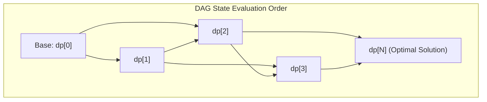

# Dynamic Programming Intuition

> [!NOTE]
> **Polynomial Optimization via Overlapping Subproblems:**
> **Dynamic Programming (DP)** is an algorithm design paradigm that solves complex problems by decomposing them into simpler subproblems, solving each subproblem exactly once, and storing their results in a lookup table.
> - Transforms intractable $O(2^n)$ exponential recursions into fast $O(n^k)$ polynomial algorithms.
> - Reference implementations: [C++17 Implementation](../../implementations/cpp/dynamic_programming_intuition.cpp) | [Python Implementation](../../implementations/python/dynamic_programming_intuition.py)

> [!TIP]
> **The Two Cardinal Pillars of Dynamic Programming:**
> 1. **Optimal Substructure:** An optimal solution to the problem contains within it optimal solutions to its subproblems (Bellman'''s Principle of Optimality).
> 2. **Overlapping Subproblems:** The recursive evaluation tree visits the exact same state configurations repeatedly across different decision branches.
> - **The DAG Perspective:** Every dynamic programming problem can be viewed as computing the shortest or longest path in an implicit **Directed Acyclic Graph (DAG)** of states, evaluated in topological order.

> [!WARNING]
> **Critical Analytical Pitfalls:**
> 1. **Cyclic Dependencies:** If subproblem state $A$ depends on $B$ while $B$ depends on $A$, the state graph contains a cycle and standard topological evaluation fails. Break cycles by adding an explicit parameter (e.g., number of steps $k$) or pivot to general graph shortest path algorithms.
> 2. **The Greedy Trap:** Assuming a locally optimal decision will lead to a global optimum. When local choices interact with future constraints (such as general coin change with arbitrary denominations), greedy choices fail and DP is required.
> 3. **Memory Bloat:** Naive full $N \times M$ matrices can exhaust memory limits ($O(N \cdot M)$). Inspect the recurrence: if $dp[i]$ only depends on $dp[i-1]$, compress the table to $O(M)$ or $O(1)$ space using a rolling array.



---

## 1. What is Dynamic Programming?

The term *dynamic programming* was coined in the 1950s by mathematician Richard Bellman to describe multistage decision processes.

At its heart, dynamic programming is **recursion without redundant work**.

When a naive recursive algorithm solves a problem by repeatedly solving the exact same subproblem instances from scratch, its running time explodes exponentially. Dynamic programming records the answers to subproblems in a table so that each unique subproblem is solved **at most once**.

### The Fibonacci Paradigm

Consider the Fibonacci recurrence $F(n) = F(n-1) + F(n-2)$ with $F(0) = 0, F(1) = 1$:

```
                    F(5)
                  /                   F(4)          F(3)
            /    \        /             F(3)    F(2)   F(2)   F(1)
        /         F(2)  F(1)
```

Notice that:
- $F(3)$ is computed 2 times.
- $F(2)$ is computed 3 times.
- For general $n$, the recursion tree has $2^n$ nodes.

By caching each value $F(i)$ as soon as it is computed, the entire computation simplifies to evaluating $n$ sequential entries in $O(n)$ time!

---

## 2. The Two Core Prerequisites

An algorithmic problem is amenable to dynamic programming if and only if it exhibits two fundamental properties:

### 1. Optimal Substructure
A problem possesses **optimal substructure** if an optimal solution to the overall problem is composed of optimal solutions to its constituent subproblems.

- **Example with Optimal Substructure:** Shortest Path in a graph. If the shortest path from $u$ to $w$ passes through $v$, the subpath from $u$ to $v$ must be the shortest path between $u$ and $v$.
- **Counterexample without Optimal Substructure:** Longest Simple Path in a general graph. The longest path between two vertices does not necessarily combine longest subpaths because simple paths cannot repeat vertices.

### 2. Overlapping Subproblems
A problem has **overlapping subproblems** if recursive decomposition repeatedly encounters the exact same smaller subproblems rather than continually generating new subproblems.

- **Divide and Conquer:** Partitions the input into *disjoint, non-overlapping* halves (e.g. Merge Sort splits an array into completely independent left and right arrays). No caching is needed.
- **Dynamic Programming:** Recursive branches repeatedly overlap on identical states (e.g. Knapsack capacities, edit distance prefixes). Caching is mandatory.

---

## 3. The DAG View of Dynamic Programming

Every dynamic programming algorithm models a **Directed Acyclic Graph (DAG)**:
- **Vertices:** Every distinct subproblem state $S$.
- **Edges:** Transitions from subproblems to parent problems, weighted by choice costs or transition values.
- **Acyclicity:** Subproblem dependencies must form a strict partial order. A state cannot depend on itself either directly or indirectly.

Solving the DP is mathematically equivalent to computing the **shortest or longest path** from source nodes (base cases) to a sink node (the target state) in topological order.

---

## 4. Top-Down Memoization vs. Bottom-Up Tabulation

Two complementary implementation strategies exist:

### Strategy 1: Top-Down (Memoization)
- Write the natural recursive decomposition.
- Intercept function calls: check if state $(arg_1, arg_2, \dots)$ exists in a lookup table (`memo`).
- If cached, return immediately; otherwise, compute, store in `memo`, and return.

```python
def fib_memo(n, memo={}):
    if n <= 1:
        return n
    if n not in memo:
        memo[n] = fib_memo(n - 1, memo) + fib_memo(n - 2, memo)
    return memo[n]
```

**Advantages:**
- Only computes states that are actually reachable from the starting configuration.
- Retains intuitive recursive thinking.

**Disadvantages:**
- Function call stack overhead.
- Risk of recursion stack overflow (`RecursionError` / `SIGSEGV`) on deep inputs ($N > 10^5$).

---

### Strategy 2: Bottom-Up (Tabulation)
- Identify the topological order of dependencies (e.g., increasing indices $i = 0, 1, 2, \dots$).
- Allocate a contiguous array or matrix `dp`.
- Initialize base cases directly into the table.
- Iterate through states iteratively with loops, computing each entry from previously computed entries.

```python
def fib_tab(n):
    if n <= 1:
        return n
    dp = [0] * (n + 1)
    dp[1] = 1
    for i in range(2, n + 1):
        dp[i] = dp[i - 1] + dp[i - 2]
    return dp[n]
```

**Advantages:**
- Zero recursion stack overhead; extremely fast iteration in tight CPU cache loops.
- Facilitates memory optimization (rolling buffers).

**Disadvantages:**
- Computes all states in the table, even if some are unreachable from the root.

---

## 5. State Space Dimension Reduction

In bottom-up tabulation, inspecting the recurrence relation often reveals that we do not need to preserve the entire history of the table.

### Fibonacci Space Optimization: $O(n) \to O(1)$
Because $F(n)$ depends strictly on the immediately preceding two values ($F(n-1)$ and $F(n-2)$), we do not need an array of size $n$:

```cpp
uint64_t fib_opt(int n) {
    if (n <= 1) return n;
    uint64_t prev2 = 0, prev1 = 1;
    for (int i = 2; i <= n; ++i) {
        uint64_t curr = prev1 + prev2;
        prev2 = prev1;
        prev1 = curr;
    }
    return prev1;
}
```

### 2D Grid Paths Space Optimization: $O(M \cdot N) \to O(N)$
In a 2D grid path problem, cell $(i, j)$ depends only on $(i-1, j)$ (current row) and $(i, j-1)$ (same row, previous column). Maintaining just **one rolling row** reduces space from $O(M \cdot N)$ to $O(N)$.

---

## 6. How to Recognize a DP Problem

Look for these four classic indicators:
1. **Optimization Objective:** Finding the minimum cost, maximum profit, or shortest distance.
2. **Combinatorial Counting:** Finding the total number of valid ways to reach a state.
3. **Existence / Feasibility:** Determining whether a target sum or configuration is achievable.
4. **Independent Sub-Choices:** Making an optimal sequence of choices where each choice leads to a smaller problem instance.

---

## 7. Comparison Summary Table

| Dimension | Naive Recursion | Top-Down Memoization | Bottom-Up Tabulation | Space-Optimized DP |
|---|---|---|---|---|
| **Time Complexity** | $O(c^n)$ (Exponential) | $O(n^k)$ (Polynomial) | $O(n^k)$ (Polynomial) | $O(n^k)$ (Polynomial) |
| **Space Overhead** | $O(n)$ (Call stack) | $O(n^k)$ (Table + Stack) | $O(n^k)$ (Table only) | **$O(1)$ to $O(n)$** |
| **Implementation Style** | Recursive | Recursive $+$ Cache | Iterative (Loops) | Iterative (Rolling array) |
| **Cache Locality** | Poor | Moderate | High (Sequential) | Highest (Registers/L1) |

---

## 8. Practice Prompts and Exercises

1. **Coin Change Problem:** Given coin denominations $[1, 2, 5]$ and target $S$, formulate the DP state $dp[i]$ representing the minimum coins needed to make sum $i$. Why does a greedy approach fail for denominations $[1, 3, 4]$ with target $6$?
2. **House Robber:** Given house values along a street where adjacent houses cannot both be robbed, write the recurrence relation and reduce space to $O(1)$.
3. **Climbing Stairs:** Show how climbing stairs (taking 1 or 2 steps at a time) is isomorphic to the Fibonacci sequence.
4. **Longest Increasing Subsequence (LIS):** Formulate the $O(n^2)$ dynamic programming recurrence for LIS. How does each state $dp[i]$ define a path in a DAG?
