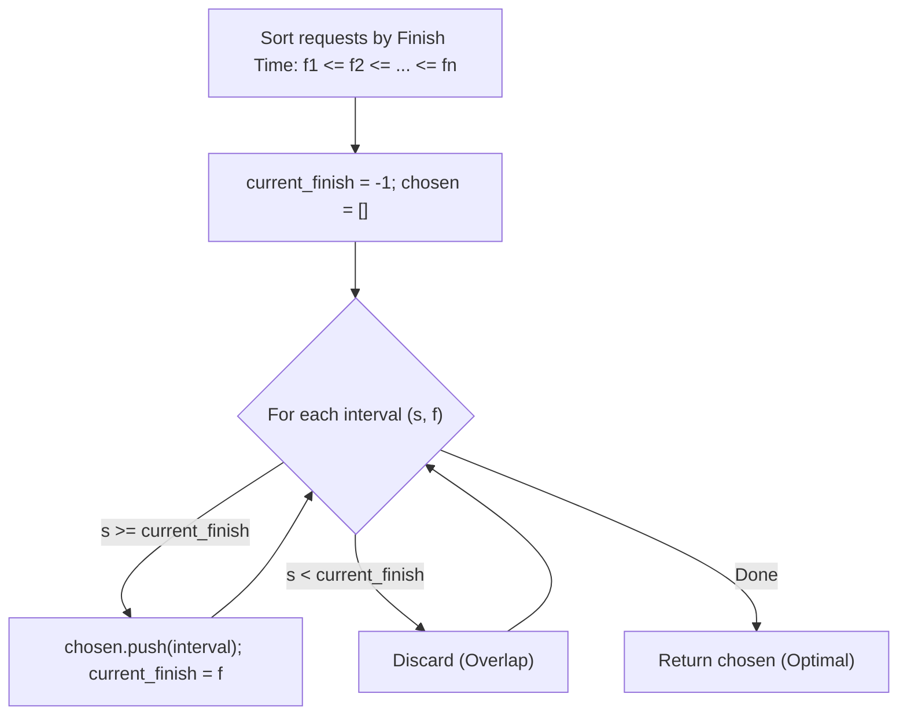

# Greedy Algorithms

> [!NOTE]
> A **Greedy Algorithm** constructs a global solution incrementally through a sequence of locally optimal choices, never revoking or reconsidering previous commitments. A greedy strategy is mathematically sound **if and only if** the problem exhibits both **Optimal Substructure** and the **Greedy Choice Property**.
>
> Reference implementations: [C++17 Implementation](../../implementations/cpp/greedy_algorithms.cpp) | [Python Implementation](../../implementations/python/greedy_algorithms.py)

> [!TIP]
> **The Exchange Argument Recipe (Standard Correctness Proof):**
> 1. **Hypothesize**: Assume there exists an arbitrary optimal solution $O$ that differs from the greedy solution $G$.
> 2. **Isolate**: Identify the first point of divergence where $O$ chooses alternative element $a$ instead of the greedy choice $g$.
> 3. **Exchange**: Form a modified solution $O' = (O \setminus \{a\}) \cup \{g\}$.
> 4. **Validate**: Prove that $O'$ remains valid (feasible) and its objective value satisfies $f(O') \ge f(O)$.
> 5. **Induct**: Conclude that repeated exchanges transform $O$ into $G$ without losing optimality, proving $G$ is optimal.

> [!WARNING]
> **Plausibility $\neq$ Correctness:**
> Many intuitive greedy heuristics fail catastrophically:
> - **0-1 Knapsack**: Picking items with the highest value-to-weight ratio fails because discrete indivisibility leaves trapped capacity (requires Dynamic Programming). In contrast, **Fractional Knapsack** is proven optimal under greedy ratio sorting.
> - **Coin Change**: Greedily choosing the largest denomination works on canonical coin systems (e.g., US currency $\{25, 10, 5, 1\}$), but fails on arbitrary systems (e.g., $\{4, 3, 1\}$ for amount $6$: greedy selects $4 + 1 + 1 = 3$ coins, whereas the optimal is $3 + 3 = 2$ coins).

---

## 1. What Is a Greedy Algorithm?

A greedy algorithm builds a solution step by step. At each step, it chooses the option that looks best according to some immediate, local optimization criterion.

Examples of classical greedy rules:
- **Kruskal's MST**: Choose the lightest available edge that does not form a cycle.
- **Dijkstra's SSSP**: Finalize the unvisited vertex with the minimum tentative distance.
- **Interval Scheduling**: Select the compatible request with the earliest finish time.
- **Huffman Coding**: Merge the two subtrees with the lowest symbol frequencies.

A greedy algorithm **never backtracks**. Once a decision is made, it is permanently locked into the partial solution.

---

## 2. Greedy vs. Other Major Paradigms

```text
+------------------------------------------------------------------------------------+
|                             Algorithm Design Paradigms                             |
+---------------------+-------------------------------------+------------------------+
| Paradigm            | Core Decision Mechanism             | Complexity & Risk      |
+---------------------+-------------------------------------+------------------------+
| Greedy              | Commit irrevocably to local best    | O(N log N), Fast       |
|                     | choice at each step                 | Risk: May fail globally|
+---------------------+-------------------------------------+------------------------+
| Dynamic Programming | Evaluate overlapping subproblems;   | Polynomial O(N^2, NW)  |
|                     | combine optimal sub-solutions       | Guaranteed optimal     |
+---------------------+-------------------------------------+------------------------+
| Divide & Conquer    | Split into disjoint subproblems;    | O(N log N)             |
|                     | combine subproblem solutions        | Recursive reduction    |
+---------------------+-------------------------------------+------------------------+
| Backtracking        | Explore search space exhaustively;  | Exponential O(2^N, N!) |
|                     | prune invalid branches              | Complete & exact       |
+---------------------+-------------------------------------+------------------------+
```

---

## 3. The Two Theoretical Pillars of Greedy Algorithms

To guarantee that a greedy algorithm yields a globally optimal solution, the underlying problem must satisfy two mathematical conditions:

### Pillar 1: The Greedy Choice Property
A globally optimal solution can be arrived at by making locally optimal (greedy) choices. In other words, when considering which step to take, we can make the choice that looks best in the current state without considering results from subproblems or future choices.

### Pillar 2: Optimal Substructure
An optimal solution to the problem contains within it optimal solutions to subproblems. After making the greedy choice, the remaining subproblem has the exact same structural properties as the original problem, allowing induction to guarantee optimality.

> **Key Distinction**: Optimal substructure is a prerequisite for *both* Dynamic Programming and Greedy algorithms. However, DP explores multiple subproblem choices because local decisions can affect future options, whereas Greedy commits to a single choice because the Greedy Choice Property proves that alternative choices cannot beat it.

---

## 4. Formal Proof Patterns for Greedy Algorithms

Proving a greedy algorithm correct cannot rely on testing examples. Four formal proof patterns are used in computer science:

### Pattern A: Exchange Argument (Transformation Proof)
Demonstrate that any optimal solution can be transformed incrementally into the greedy solution without degrading its objective score.

### Pattern B: Stay-Ahead Argument (Inductive Progress)
Define a measure of progress $P_k$ at step $k$. Prove by mathematical induction that for all steps $k$, the greedy solution is at least as far ahead as any competing partial solution:

$$
P_k(\text{Greedy}) \ge P_k(\text{Competitor}) \quad \forall k
$$

### Pattern C: Cut / Matroid Arguments
In combinatorial optimization, if the family of independent sets forms a **Matroid**, the greedy algorithm is guaranteed to find a maximum-weight basis. (e.g., Kruskal's algorithm on the Graphic Matroid).

---

## 5. Flagship Example 1: Interval Scheduling

Given $n$ activity requests with start times $s_i$ and finish times $f_i$, find a maximum-cardinality subset of mutually compatible (non-overlapping) requests.

```text
Interval Scheduling Timeline:
Time: 0   1   2   3   4   5   6   7   8   9   10  11  12  13  14  15  16
Request 1: [--- 1 ---]                                                f1 = 4 (SELECTED)
Request 2:     [--- 2 ---]                                            f2 = 5 (Conflicts)
Request 3: [------- 3 -------]                                        f3 = 6 (Conflicts)
Request 4:                 [--- 4 ---]                                f4 = 7 (SELECTED)
Request 5:             [----------- 5 -----------]                    f5 = 9 (Conflicts)
Request 6:                             [--- 8 ---]                    f8 = 11 (SELECTED)
Request 7:                                                 [--- 11 ---] f11= 16 (SELECTED)
```



### Why Earliest Finish Time (EFT) Works:
Selecting the interval that finishes earliest frees up the resource as soon as possible, leaving the maximum possible remaining time window $[f_{\text{greedy}}, \infty)$ for all future intervals.

### Exchange Proof for EFT:
Let $G = \langle g_1, g_2, \dots, g_k \rangle$ be the greedy schedule, and $O = \langle o_1, o_2, \dots, o_m \rangle$ be an arbitrary optimal schedule, both ordered by finish time.
- Base case: By greedy choice, $g_1$ has the minimum finish time among all available requests, so $f(g_1) \le f(o_1)$.
- Replace $o_1$ with $g_1$: Since $f(g_1) \le f(o_1)$, $g_1$ cannot conflict with $o_2, o_3, \dots, o_m$.
- Thus, $O' = \langle g_1, o_2, \dots, o_m \rangle$ is a valid schedule with $|O'| = |O|$.
- By induction over all $r \le k$, we can replace $o_r$ with $g_r$ without creating conflicts, concluding $|G| = |O|$. $\blacksquare$

```cpp
struct Interval {
    int start, finish;
};

std::vector<Interval> interval_scheduling(std::vector<Interval> intervals) {
    std::sort(intervals.begin(), intervals.end(), [](const Interval& a, const Interval& b) {
        if (a.finish != b.finish) return a.finish < b.finish;
        return a.start < b.start;
    });

    std::vector<Interval> chosen;
    int current_finish = -1;

    for (const auto& interval : intervals) {
        if (interval.start >= current_finish) {
            chosen.push_back(interval);
            current_finish = interval.finish;
        }
    }
    return chosen;
}
```

---

## 6. Flagship Example 2: Fractional Knapsack vs. 0-1 Knapsack

Given a knapsack of maximum weight capacity $W$ and $n$ items, each with value $v_i$ and weight $w_i$:

- **Fractional Knapsack**: You may take any continuous fraction $x_i \in [0, 1]$ of item $i$, earning value $x_i v_i$ and consuming weight $x_i w_i$.
- **0-1 Knapsack**: You must either take the entire item ($x_i = 1$) or leave it ($x_i = 0$).

```text
Item Densities:
Item 1: Value = $60,  Weight = 10 kg  ===> Value Density = $6.0 / kg
Item 2: Value = $100, Weight = 20 kg  ===> Value Density = $5.0 / kg
Item 3: Value = $120, Weight = 30 kg  ===> Value Density = $4.0 / kg

Knapsack Capacity: W = 50 kg

Fractional Knapsack (Greedy Optimal):
1. Take Item 1 fully:  10 kg, $60  (Remaining W = 40 kg)
2. Take Item 2 fully:  20 kg, $100 (Remaining W = 20 kg)
3. Take Item 3 partially (20/30 = 2/3): 20 kg, $80 (Remaining W = 0 kg)
Total Value = $240.0 (Mathematically Optimal)

0-1 Knapsack (Greedy Fails):
Greedy by density takes Item 1 (10 kg) + Item 2 (20 kg) = 30 kg, Total Value = $160.
Optimal 0-1 choice takes Item 2 (20 kg) + Item 3 (30 kg) = 50 kg, Total Value = $220!
```

```cpp
struct KnapsackItem {
    int id;
    double value, weight;
};

double fractional_knapsack(double capacity, std::vector<KnapsackItem> items) {
    // Sort descending by value density (value / weight)
    std::sort(items.begin(), items.end(), [](const KnapsackItem& a, const KnapsackItem& b) {
        return (a.value / a.weight) > (b.value / b.weight);
    });

    double total_value = 0.0;
    double remaining = capacity;

    for (const auto& item : items) {
        if (remaining <= 0.0) break;
        if (item.weight <= remaining) {
            total_value += item.value;
            remaining -= item.weight;
        } else {
            total_value += item.value * (remaining / item.weight);
            remaining = 0.0;
        }
    }
    return total_value;
}
```

---

## 7. Flagship Example 3: Huffman Coding (Optimal Prefix-Free Codes)

Given an alphabet $\Sigma$ and character frequencies $f(c)$, find a prefix-free binary encoding that minimizes total expected message length:

$$
\min \sum_{c \in \Sigma} f(c) \cdot \text{length}(\text{code}(c))
$$

### The Greedy Strategy:
1. Insert all characters as leaf nodes into a min-priority queue ordered by frequency.
2. While $|PQ| > 1$:
   - Extract the two nodes $x$ and $y$ with the lowest frequencies.
   - Create a parent internal node $z$ with frequency $f(z) = f(x) + f(y)$, with $x$ as left child and $y$ as right child.
   - Insert $z$ back into the priority queue.
3. The remaining node is the root of the optimal prefix code tree.

```text
Frequency Table: A: 5, B: 9, C: 12, D: 13, E: 16, F: 45

Merge Process:
Step 1: Merge 5 and 9   ===> Node (14)
Step 2: Merge 12 and 13 ===> Node (25)
Step 3: Merge 14 and 16 ===> Node (30)
Step 4: Merge 25 and 30 ===> Node (55)
Step 5: Merge 45 and 55 ===> Root (100)

Codewords Generated:
F (Freq 45): "0"     (1 bit  - Most Frequent)
C (Freq 12): "100"   (3 bits)
D (Freq 13): "101"   (3 bits)
E (Freq 16): "111"   (3 bits)
A (Freq 5) : "1100"  (4 bits - Least Frequent)
B (Freq 9) : "1101"  (4 bits)
```

---

## 8. Matroid Theory: The Abstract Foundation of Greediness

Why do greedy algorithms solve **Kruskal's MST** and **Job Sequencing with Deadlines** optimally, but fail on the Traveling Salesperson Problem? The answer lies in **Matroids**.

### Mathematical Definition of a Matroid:
A **Matroid** is an ordered pair $M = (S, \mathcal{I})$ where $S$ is a finite ground set and $\mathcal{I}$ is a non-empty family of subsets of $S$ (called *independent sets*) satisfying:
1. **Hereditary Property**: If $B \in \mathcal{I}$ and $A \subseteq B$, then $A \in \mathcal{I}$.
2. **Exchange Property**: If $A, B \in \mathcal{I}$ and $|A| < |B|$, there exists an element $x \in B \setminus A$ such that $A \cup \{x\} \in \mathcal{I}$.

### Rado-Edmonds Theorem:
> Let $M = (S, \mathcal{I})$ be a matroid, and let $w: S \to \mathbb{R}^+$ assign a non-negative weight to each element. The **Greedy Algorithm** (sorting elements descending by weight and inserting if the set remains independent) is guaranteed to find a **maximum-weight independent set**.

- **The Graphic Matroid**: Let $S = E$ (edges of an undirected graph) and $\mathcal{I}$ be the set of all cycle-free edge subsets (forests). The Graphic Matroid satisfies the exchange property, proving why Kruskal's algorithm is globally optimal.

---

## 9. Comprehensive Comparison: When Greedy Works vs. Fails

| Problem Domain | Greedy Strategy | Works? | Failure Reason / Optimal Alternative |
| :--- | :--- | :---: | :--- |
| **Interval Scheduling** | Earliest Finish Time (EFT) | **Yes** | Optimal substructure + exchange argument |
| **Interval Partitioning** | Earliest Start Time | **Yes** | Equals maximum depth of overlapping intervals |
| **Fractional Knapsack** | Highest Value Density ($v/w$) | **Yes** | Divisibility prevents stranded capacity |
| **0-1 Knapsack** | Highest Value Density ($v/w$) | **No** | Stranded capacity requires Dynamic Programming |
| **Canonical Coin Change** | Largest Denomination | **Yes** | Matroid-like structure in canonical systems |
| **Arbitrary Coin Change** | Largest Denomination | **No** | Denomination interference requires BFS/DP |
| **Minimum Spanning Tree** | Lightest Safe Crossing Edge | **Yes** | Cut property on Graphic Matroid |
| **Traveling Salesperson** | Nearest Unvisited Neighbor | **No** | Local greedy choice causes catastrophic late detours |

---

## 10. Practice Problems & Engineering Challenges

1. **Gas Station Circuit**: Given circular gas stations with gas amounts and travel costs, determine the unique starting station to complete the circuit in $O(N)$ greedy time.
2. **Task Scheduler with Cooldown**: Given CPU tasks with a cooldown period $n$, compute the minimum clock cycles using greedy frequency counting.
3. **Huffman Tree Compression Efficiency**: Calculate the theoretical Shannon entropy $H(X) = -\sum p(x) \log_2 p(x)$ of an alphabet and compare it against the empirical average bits/symbol of a Huffman encoder.
4. **Matroid Rank Oracle**: Implement an abstract greedy solver that accepts a generic independence oracle and maximizes weight over independent sets.

---

## 11. Next Steps & Suggested Reading

- **Divide and Conquer** (`divide-and-conquer.md`): Recursive problem splitting, Master Theorem, and Merge Sort.
- **Dynamic Programming Foundations** (`../10-dynamic-programming/1d-and-2d-foundations.md`): When greedy choices fail and overlapping subproblems must be cataloged.
- **Minimum Spanning Trees** (`../08-graphs-and-network-algorithms/minimum-spanning-trees.md`): Kruskal and Prim as classical graph-theoretic matroid greedy algorithms.
