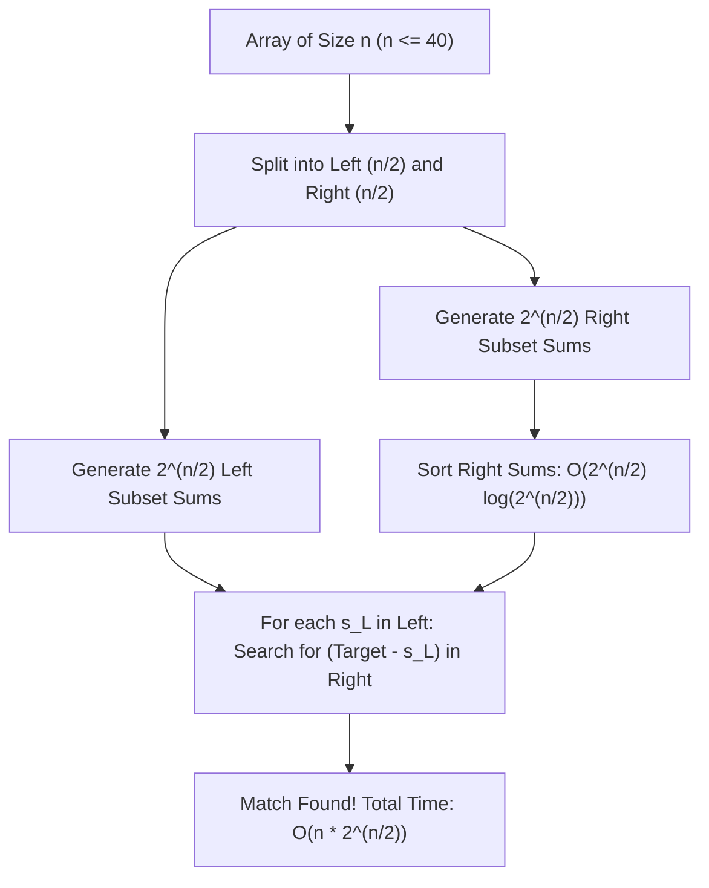

# Meet-in-the-Middle

> [!NOTE]
> **Halving Exponential Search Spaces:**
> **Meet-in-the-Middle** is an algorithm design technique that solves exponential search problems by decomposing the search space into two equal halves of size $n/2$, computing all reachable states in each half independently, and finding intersecting pairs using efficient lookup (binary search or hashing).
> - Transforms an intractable $O(c^n)$ brute force into a highly practical $O(c^{n/2} \log(c^{n/2}))$ or $O(c^{n/2})$ algorithm.
> - Reference implementations: [C++17 Implementation](../../implementations/cpp/meet_in_the_middle.cpp) | [Python Implementation](../../implementations/python/meet_in_the_middle.py)

> [!TIP]
> **The $n \le 40$ Threshold:**
> In algorithmic contests and systems design, the input size $n \approx 40$ is the classic hallmark of Meet-in-the-Middle:
> - $2^{40} \approx 1.1 \times 10^{12}$ operations (completely intractable on modern hardware; takes days).
> - Splitting into halves yields $2^{20} \approx 1.05 \times 10^6$ states per half.
> - Generating and sorting $10^6$ numbers takes $\approx 40\text{ ms}$. Performing $10^6$ binary searches takes another $\approx 40\text{ ms}$. Total runtime: **$< 100\text{ ms}$**!

> [!WARNING]
> **Critical Traps & Engineering Pitfalls:**
> 1. **Integer Overflow on Sums:** Sums of subsets easily exceed the 32-bit signed integer range ($2^{31} - 1 \approx 2 \times 10^9$). Always use 64-bit integers (`int64_t` in C++, native arbitrary-precision `int` in Python).
> 2. **Memory Footprint:** Storing $2^{n/2}$ values in memory requires $O(2^{n/2})$ space. While $n=40$ ($2^{20} \times 8\text{ bytes} \approx 8\text{ MB}$) fits comfortably in cache, $n=50$ ($2^{25} \times 8\text{ bytes} \approx 268\text{ MB}$) approaches memory limits.
> 3. **Duplicate Counting:** If the problem requires counting the total number of combinations that sum to target, remember that multiple distinct subsets in the right half may have identical sum values. Use frequency maps (`std::unordered_map`) or `std::equal_range`.



---

## 1. The Exponential Explosion Problem

Many fundamental problems in computer science are NP-hard:

- Subset Sum (does any subset sum to $S$?)
- 0-1 Knapsack (maximize value under weight capacity $W$)
- Partition Problem (can the set be partitioned into two equal-sum subsets?)
- Exact 4-Sum or $k$-Sum

When $n \le 20$, standard backtracking or recursive search enumerates all $2^n$ configurations in $O(2^n)$ operations ($2^{20} \approx 10^6$, which finishes in milliseconds).

However, when $n = 40$:

$$
2^{40} = 1,099,511,627,776 \approx 1.1 \times 10^{12} \text{ operations}
$$

At typical CPU clock rates of $3 \times 10^9$ instructions per second, $10^{12}$ operations requires **several hours** of pure CPU execution. Standard backtracking is entirely non-viable.

---

## 2. The Meet-in-the-Middle Principle

The core insight of Meet-in-the-Middle is that any subset of elements from an array $A$ of length $n$ can be partitioned into:

$$
\text{Subset} = S_L \cup S_R
$$

where $S_L$ is a subset chosen strictly from the left half $A[0 \dots \lfloor n/2 \rfloor - 1]$ and $S_R$ is a subset chosen strictly from the right half $A[\lfloor n/2 \rfloor \dots n - 1]$.

Consequently, the total sum of the subset is:

$$
\text{Sum}(S) = \text{Sum}(S_L) + \text{Sum}(S_R)
$$

For a target value $T$, we require:

$$
\text{Sum}(S_L) + \text{Sum}(S_R) = T \iff \text{Sum}(S_R) = T - \text{Sum}(S_L)
$$

### Algorithm Execution Steps

1. **Partition:** Divide $A$ into $L$ of size $n_1 = \lfloor n/2 \rfloor$ and $R$ of size $n_2 = n - n_1$.
2. **Exhaustive Generation:** Generate all $2^{n_1}$ subset sums of $L$ into list $S_L$, and all $2^{n_2}$ subset sums of $R$ into list $S_R$.
3. **Sort:** Sort $S_R$ in ascending order ($O(2^{n_2} \log(2^{n_2})) = O(n_2 2^{n_2})$).
4. **Collision Search:** For each element $s_L \in S_L$, calculate the required complement $s_R = T - s_L$. Perform a binary search for $s_R$ in $S_R$ in $O(\log |S_R|) = O(n_2)$ time.

---

## 3. Complexity Analysis: Why the Speedup is Dramatic

Let $n = 40$, with $n_1 = 20$ and $n_2 = 20$.

| Phase | Brute Force ($2^n$) | Meet-in-the-Middle |
|---|---|---|
| **Generate Left** | — | $2^{20} \approx 1.05 \times 10^6$ operations |
| **Generate Right** | — | $2^{20} \approx 1.05 \times 10^6$ operations |
| **Sort Right** | — | $20 \times 2^{20} \approx 2.1 \times 10^7$ operations |
| **Search Matches** | — | $20 \times 2^{20} \approx 2.1 \times 10^7$ operations |
| **Total Time** | $\approx 1.1 \times 10^{12}$ ops ($> 300\text{ s}$) | $\approx 4.4 \times 10^7$ ops (**$< 0.05\text{ s}$**) |
| **Speedup Factor** | $1\times$ | **$> 25,000\times$ faster** |

---

## 4. Classic Application 1: Exact Subset Sum

Given array $A$ and integer $T$, determine if any subset sums to $T$.

### C++17 Implementation

```cpp
std::vector<int64_t> generate_subset_sums(const std::vector<int64_t>& arr) {
    size_t n = arr.size();
    size_t total = 1ULL << n;
    std::vector<int64_t> sums;
    sums.reserve(total);

    for (size_t mask = 0; mask < total; ++mask) {
        int64_t s = 0;
        for (size_t i = 0; i < n; ++i) {
            if (mask & (1ULL << i)) {
                s += arr[i];
            }
        }
        sums.push_back(s);
    }
    return sums;
}

bool subset_sum_exact(const std::vector<int64_t>& nums, int64_t target) {
    size_t n = nums.size();
    if (n == 0) return target == 0;

    size_t mid = n / 2;
    std::vector<int64_t> left(nums.begin(), nums.begin() + mid);
    std::vector<int64_t> right(nums.begin() + mid, nums.end());

    std::vector<int64_t> left_sums = generate_subset_sums(left);
    std::vector<int64_t> right_sums = generate_subset_sums(right);

    std::sort(right_sums.begin(), right_sums.end());

    for (int64_t s_l : left_sums) {
        int64_t complement = target - s_l;
        if (std::binary_search(right_sums.begin(), right_sums.end(), complement)) {
            return true;
        }
    }
    return false;
}
```

---

## 5. Classic Application 2: Knapsack Capacity Variant (Maximum Sum $\le W$)

When the goal is finding the maximum subset sum that does not exceed capacity $W$:

1. For each $s_L \in S_L$ where $s_L \le W$:
2. We seek the largest $s_R \in S_R$ such that $s_R \le W - s_L$.
3. Using `std::upper_bound(right_sums.begin(), right_sums.end(), W - s_L) - 1`, we find the maximal valid element in $O(\log |S_R|)$ time.

### Python Implementation

```python
import bisect

def max_subset_sum_le(nums: list[int], W: int) -> int:
    n = len(nums)
    if n == 0:
        return 0

    mid = n // 2
    left_sums = [0]
    for x in nums[:mid]:
        left_sums.extend([s + x for s in left_sums])

    right_sums = [0]
    for x in nums[mid:]:
        right_sums.extend([s + x for s in right_sums])
    right_sums.sort()

    best = 0
    for s_l in left_sums:
        if s_l <= W:
            rem = W - s_l
            idx = bisect.bisect_right(right_sums, rem)
            if idx > 0:
                best = max(best, s_l + right_sums[idx - 1])
    return best
```

---

## 6. Classic Application 3: The 4-Sum Problem

Given four integer arrays $A, B, C, D$ of size $n$, count the number of quadruplets $(i, j, k, l)$ such that:

$$
A[i] + B[j] + C[k] + D[l] = 0
$$

A naive four-nested loop requires $O(n^4)$ time. For $n = 1000$, $n^4 = 10^{12}$, which is impossible.

### Meet-in-the-Middle Decomposition
1. Compute all $n^2$ pair sums $A[i] + B[j]$ and store their frequencies in a hash map: $O(n^2)$.
2. Iterate through all $n^2$ pair sums $-(C[k] + D[l])$ and query the hash map: $O(n^2)$.
3. Total Time: **$O(n^2)$**; Space: $O(n^2)$.

---

## 7. Classic Application 4: Bidirectional Search in Graphs

In graph algorithms, finding the shortest path between vertex $S$ and vertex $T$ using standard BFS explores a search ball of radius $d$ with branching factor $b$:

$$
\text{Standard BFS Vertices} = O(b^d)
$$

**Bidirectional BFS** launches two simultaneous searches:
- Forward BFS starting from $S$
- Backward BFS starting from $T$

When their search frontiers intersect, a path is discovered. The search radii meet at $d/2$:

$$
\text{Bidirectional BFS Vertices} = O(b^{d/2} + b^{d/2}) = O(2 b^{d/2})
$$

### Frontier Balancing Heuristic
At each iteration, always pop from the queue that currently has the **smaller frontier size**. This prevents a high-degree node on one side from exploding memory while the other side lags behind.

---

## 8. Cryptographic Significance: The 2DES Meet-in-the-Middle Attack

In 1977, Whitfield Diffie and Martin Hellman proved why Double DES (applying DES encryption twice with two independent 56-bit keys $K_1$ and $K_2$) is insecure:

$$
C = E_{K_2}(E_{K_1}(P))
$$

One might assume this doubles the key strength to $56 + 56 = 112$ bits ($2^{112}$ brute force operations).

However, using Meet-in-the-Middle:

$$
E_{K_1}(P) = D_{K_2}(C) = M \quad (\text{Middle intermediate ciphertext})
$$

1. An attacker encrypts known plaintext $P$ under all $2^{56}$ possible keys $K_1$, storing results in a hash table indexed by $M$.
2. The attacker decrypts known ciphertext $C$ under all $2^{56}$ possible keys $K_2$ and checks if the result exists in the hash table.

The effective security of Double DES is only:

$$
O(2^{56} + 2^{56}) = O(2^{57}) \text{ operations}
$$

This critical vulnerability prompted the design of **Triple DES (3DES)** with three keys ($E_{K_3}(D_{K_2}(E_{K_1}(P)))$), providing 112 bits of actual security against meet-in-the-middle attacks.

---

## 9. Common Engineering Pitfalls

### Pitfall 1: Asymmetric Partitioning
Dividing an array of length 40 into sizes 10 and 30 defeats the purpose:
- $2^{10} = 1,024$
- $2^{30} \approx 1.07 \times 10^9$ (still way too large!)  
Always split as close to $\lfloor n/2 \rfloor$ as possible.

### Pitfall 2: Memory Overflow with Large $n$
Attempting Meet-in-the-Middle on $n = 60$ requires $2^{30} \times 8\text{ bytes} = 8.5\text{ GB}$ of RAM per half, which triggers out-of-memory crashes. The upper bound for practical in-memory meet-in-the-middle is typically $n \le 44$.

---

## 10. Complexity Summary

| Problem | Naive Complexity | Meet-in-the-Middle Time | Meet-in-the-Middle Space |
|---|---|---|---|
| **Subset Sum ($n \le 40$)** | $O(2^n)$ | $O(n \cdot 2^{n/2})$ | $O(2^{n/2})$ |
| **Max Subset Sum $\le W$** | $O(2^n)$ | $O(n \cdot 2^{n/2})$ | $O(2^{n/2})$ |
| **4-Sum ($4$ arrays of size $n$)** | $O(n^4)$ | $O(n^2)$ | $O(n^2)$ |
| **Unweighted Graph Shortest Path** | $O(b^d)$ | $O(b^{d/2})$ | $O(b^{d/2})$ |
| **Double DES Attack** | $O(2^{112})$ | $O(2^{57})$ | $O(2^{56})$ |

---

## 11. Practice Prompts and Exercises

1. **Knapsack with Large Weights:** Solve 0-1 Knapsack where $N \le 36$ and weights $W \le 10^{15}$. Why does classical dynamic programming fail here while Meet-in-the-Middle succeeds?
2. **Two-Pointer Merge:** In the subset sum problem, instead of binary searching each left sum against the sorted right sums, sort *both* left and right sums and use two pointers to find target sums in linear $O(2^{n/2})$ time.
3. **Discrete Logarithm (Baby-step Giant-step):** Explain how Shanks baby-step giant-step algorithm for computing discrete logarithms ($a^x \equiv b \pmod p$) is a direct application of Meet-in-the-Middle in $O(\sqrt{p})$ time.
4. **Partition Equal Subset Sum:** Given an array of $n \le 40$ numbers, determine if it can be partitioned into two subsets with equal sum. How do you adapt Meet-in-the-Middle when $T = \sum A[i] / 2$?
5. **Bidirectional A* Search:** How can heuristic evaluation functions $h_F(v)$ and $h_B(v)$ be incorporated into bidirectional search while maintaining consistency and optimality?
