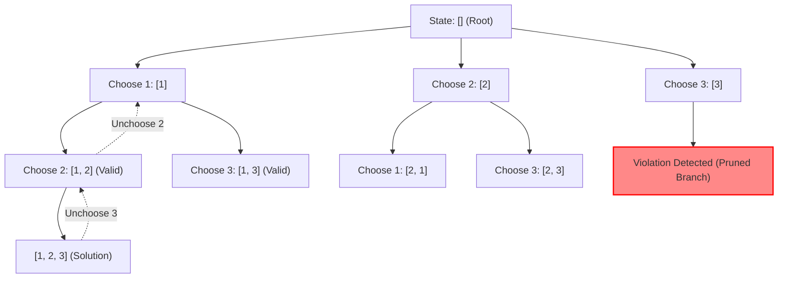

# Recursion and Backtracking

> [!NOTE]
> **State Space Exploration via Recursive Invariants:**
> - **Recursion:** Decomposes a problem instance into strictly smaller subproblems of identical structure, terminating at well-defined base cases.
> - **Backtracking:** A systematic algorithmic paradigm for finding solutions to combinatorial problems by incrementally constructing candidate states, abandoning ("backtracking" from) a candidate as soon as it is determined that it cannot possibly be completed to a valid solution.
> - Reference implementations: [C++17 Implementation](../../implementations/cpp/recursion_and_backtracking.cpp) | [Python Implementation](../../implementations/python/recursion_and_backtracking.py)

> [!TIP]
> **The Canonical "Choose-Explore-Unchoose" Triad:**
> Every backtracking step maintains state invariants through three strict phases:
> 1. **Choose:** Extend the partial solution by making a decision from the set of valid local candidates; update tracking data structures (sets, bitmasks, visited tables).
> 2. **Explore:** Recurse deeper into the state space tree with the updated state.
> 3. **Unchoose:** Explicitly undo the decision and revert tracking structures back to their pre-choice state before iterating to the next candidate.
> **Pruning (Branch Cutting):** Evaluate problem constraints early. If a partial candidate violates invariants (e.g., diagonal attack in N-Queens or cumulative sum exceeding target), prune the branch immediately to eliminate entire exponential subtrees.

> [!WARNING]
> **Critical Traps & Anti-Patterns:**
> 1. **State Leakage (Missing Unchoose):** Modifying a shared mutable collection or global tracking structure during "Choose" without rigorously undoing it during "Unchoose" corrupts sibling branches.
> 2. **Deep Stack Overflow:** Each recursive level consumes an activation frame on the OS call stack ($O(D)$ where $D$ is recursion depth). For recursion depths exceeding $10^4 - 10^5$, rewrite with an explicit heap-allocated stack or increase stack limits.
> 3. **Unintended Object Cloning:** In C++, passing candidate vectors or state buffers by value instead of `std::vector<int>&` causes catastrophic $O(N)$ allocations per recursive step, degrading time complexity from $O(2^N)$ to $O(N \cdot 2^N)$ or worse.
> 4. **Duplicate Branch Exploration:** Failing to sort input and prune equivalent adjacent branches when inputs contain duplicate values produces redundant identical solutions.



---

## 1. What is Recursion?

**Recursion** is a method of problem solving where a function solves a task by calling itself on smaller instances of the exact same problem.

Every well-formed recursive procedure requires two fundamental components:

1. **Base Case(s):** Direct, non-recursive evaluations for the simplest instances of the problem (e.g., $n = 0$, $n = 1$, empty array, null tree node). The base case terminates recursive descent.
2. **Recursive Step:** Decomposing the current problem into one or more strictly smaller subproblems, calling the function recursively, and synthesizing the overall result from subproblem answers.

### Mathematical Framing: The Factorial Function

The canonical example is the factorial function $n! = n \times (n - 1)!$ with $0! = 1$:

$$
f(n) = \begin{cases} 1 & \text{if } n = 0 \\ n \cdot f(n - 1) & \text{if } n \ge 1 \end{cases}
$$

```cpp
int64_t factorial(int64_t n) {
    if (n <= 1) return 1;          // Base case
    return n * factorial(n - 1);   // Recursive step
}
```

```python
def factorial(n: int) -> int:
    if n <= 1:
        return 1
    return n * factorial(n - 1)
```

---

## 2. Call Stack Mechanics and Memory Consumption

When a recursive call occurs, the runtime system pushes an **activation frame** onto the process call stack. This frame stores:

- Function parameters
- Local variables
- Return address (instruction pointer)

```
Call Stack for factorial(3):
| factorial(1) -> returns 1         |  (Depth 3)
| factorial(2) -> waiting for f(1)  |  (Depth 2)
| factorial(3) -> waiting for f(2)  |  (Depth 1)
| main()                            |  (Depth 0)
+-----------------------------------+
```

### Space Complexity of Recursion

The auxiliary stack space consumed by any recursive function is proportional to its **maximum call tree depth** $D$:

$$
\text{Space} = O(D)
$$

For a balanced divide-and-conquer algorithm like Merge Sort, $D = O(\log n)$.  
For linear recursion or degenerate trees, $D = O(n)$. If $n \approx 10^5$, an $8\text{ MB}$ default Linux thread stack will be exhausted, producing a `SIGSEGV` segmentation fault.

---

## 3. What is Backtracking?

While standard recursion typically solves a single deterministic subproblem or merges fixed splits (such as merge sort), **backtracking** is designed for **state-space search** and **combinatorial enumeration**.

In backtracking, we model the problem as navigating an implicit **decision tree**:

- At each node, we face a set of possible choices.
- We try one choice, move down the tree, and explore whether this path leads to a valid solution.
- If we hit a dead end (a constraint is violated or no further moves exist), we **backtrack**: we undo our last choice and try the next available option at the parent node.

---

## 4. The Canonical Backtracking Template

A uniform template governs nearly all backtracking algorithms:

```cpp
void backtrack(State& state) {
    if (is_solution(state)) {
        record_solution(state);
        return;
    }

    for (const auto& candidate : get_candidates(state)) {
        if (!is_valid(candidate, state)) {
            continue; // PRUNING: skip invalid paths early
        }

        // 1. CHOOSE
        apply_choice(candidate, state);

        // 2. EXPLORE
        backtrack(state);

        // 3. UNCHOOSE
        undo_choice(candidate, state);
    }
}
```

### Invariant Preservation
The critical property of backtracking is that after returning from `backtrack(state)`, the state of the system is **identical** to what it was before the choice was made. This allows subsequent loop iterations to explore alternative choices without interference.

---

## 5. Pruning: The Heart of Combinatorial Optimization

The raw state space of combinatorial problems is often huge:

- Subsets: $2^n$
- Permutations: $n!$
- Board placements ($N \times N$ grid): $N^N$ or $\binom{N^2}{N}$

An unpruned search tests every leaf node in the state space tree.  
**Pruning** is the technique of evaluating feasibility conditions at internal nodes of the tree:

$$
\text{If a partial candidate } (x_1, x_2, \dots, x_k) \text{ cannot possibly be extended to a valid solution, truncate the entire subtree immediately.}
$$

### Example: Pruning in Sum-Target Search
If all elements are positive integers and the current running sum already exceeds the target ($S_{\text{curr}} > \text{target}$), no further elements can reduce the sum. Any deeper exploration is guaranteed to fail and can be skipped with an immediate `break` or `continue`.

---

## 6. Classic Paradigm 1: Subset Generation (The Power Set)

Generating all $2^n$ subsets of a set $S = \{s_1, s_2, \dots, s_n\}$ is the quintessential backtracking pattern.

At each index $i$, we make a binary choice:
1. Exclude element $s_i$ from the current subset.
2. Include element $s_i$ in the current subset.

### C++17 Subset Generation

```cpp
void generate_subsets(const std::vector<int>& nums, size_t idx,
                      std::vector<int>& current,
                      std::vector<std::vector<int>>& result) {
    if (idx == nums.size()) {
        result.push_back(current);
        return;
    }

    // Choice 1: Exclude nums[idx]
    generate_subsets(nums, idx + 1, current, result);

    // Choice 2: Include nums[idx]
    current.push_back(nums[idx]);                   // Choose
    generate_subsets(nums, idx + 1, current, result); // Explore
    current.pop_back();                              // Unchoose
}
```

### Handling Duplicates (Subsets II)
When the input array contains duplicate elements (e.g. $[1, 2, 2]$), generating subsets without care yields duplicate subsets.

**Resolution:**
1. Sort the array so identical elements are contiguous.
2. At any given tree depth, skip identical candidates: `if (i > start && nums[i] == nums[i-1]) continue;`.

---

## 7. Classic Paradigm 2: Permutation Generation

Given a collection of $n$ distinct elements, generate all $n!$ permutations.

### Method A: Visited Boolean Array / Bitmask
Maintain a boolean array `used[i]` tracking whether `nums[i]` is already placed in the current prefix.

### Method B: In-Place Swapping ($O(1)$ Extra Space)
Permutations can be generated by iteratively swapping elements into position `start`:

```cpp
void permute_in_place(std::vector<int>& nums, size_t start,
                      std::vector<std::vector<int>>& result) {
    if (start == nums.size()) {
        result.push_back(nums);
        return;
    }
    for (size_t i = start; i < nums.size(); ++i) {
        std::swap(nums[start], nums[i]);         // Choose
        permute_in_place(nums, start + 1, result); // Explore
        std::swap(nums[start], nums[i]);         // Unchoose
    }
}
```

---

## 8. Classic Paradigm 3: The N-Queens Problem

Place $N$ non-attacking queens on an $N \times N$ chessboard such that no two queens share the same row, column, or diagonal.

Since each row must contain exactly one queen, we represent the state as placing queen $r$ in column $c$ on row $r$ ($0 \le r < N$).

### Diagonal Conflict Mathematics
Two queens at $(r_1, c_1)$ and $(r_2, c_2)$ share a diagonal if and only if:

$$
|r_1 - r_2| = |c_1 - c_2|
$$

This translates to two sets of diagonals:
1. **Major Diagonals (down-right):** $r - c = \text{constant}$. To index into an array, shift by $N - 1$: $d_1 = r - c + N - 1$ ($0 \le d_1 < 2N - 1$).
2. **Minor Diagonals (down-left):** $r + c = \text{constant}$. Range: $0 \le d_2 < 2N - 1$.

With three boolean arrays or bitmasks (`used_col`, `used_diag1`, `used_diag2`), testing whether cell $(r, c)$ is attacked takes $O(1)$ time!

```
Row 0: . Q . .   (Queen placed at col 1)
Row 1: . . . Q   (Queen placed at col 3)
Row 2: Q . . .   (Queen placed at col 0)
Row 3: . . Q .   (Queen placed at col 2)
```

For $N = 4$, there are $2$ solutions. For $N = 8$, there are $92$ solutions.

---

## 9. Classic Paradigm 4: Combination Sum with Reuse

Given an array of distinct integers `candidates` and a `target`, find all unique combinations where candidate numbers sum to `target`. Candidates may be chosen an unlimited number of times.

**Pruning Strategy:**
Sort `candidates`. If `candidates[i] > remaining_target`, immediately `break` because all subsequent candidates will also exceed the remaining target.

```python
def combination_sum(candidates: list[int], target: int) -> list[list[int]]:
    candidates.sort()
    result = []
    curr = []

    def backtrack(start: int, remain: int):
        if remain == 0:
            result.append(list(curr))
            return
        for i in range(start, len(candidates)):
            if candidates[i] > remain:
                break  # Prune entire remaining iteration
            curr.append(candidates[i])
            backtrack(i, remain - candidates[i])  # Not i + 1 because reuse is allowed
            curr.pop()

    backtrack(0, target)
    return result
```

---

## 10. Backtracking vs DFS vs Branch-and-Bound

| Dimension | Depth-First Search (DFS) | Backtracking | Branch and Bound |
|---|---|---|---|
| **Graph Structure** | Explicit or implicit general graphs | Implicit decision tree / state-space tree | Implicit tree with priority queue |
| **Search Order** | Depth-first (stack) | Depth-first (stack) | Best-first (priority queue / cost bounds) |
| **Objective** | Reachability, cycle detection, traversal | Enumerate solutions or find all valid configurations | Global optimization (min/max cost) |
| **Pruning Technique** | Visited set ($O(V)$ tracking) | Constraint satisfaction pruning | Cost bounding functions ($g(x) + h(x)$) |
| **State Undoing** | Rarely unchooses (marks visited permanently) | Mandatory "unchoose" step on shared state | Maintains separate nodes in heap |

---

## 11. Backtracking vs Dynamic Programming

A critical design choice in algorithm design is deciding between Backtracking and Dynamic Programming:

- **Use Backtracking when:**
  - You need to produce **all concrete configurations** (e.g. all 92 N-Queens boards, all subsets).
  - The problem is NP-complete with no optimal substructure or overlapping subproblems.
- **Use Dynamic Programming when:**
  - You only need an **aggregate value** (maximum profit, minimum steps, total count of paths).
  - Subproblems overlap extensively ($T(n) = T(n-1) + T(n-2)$). Naive backtracking would recalculate identical subtrees exponentially often, whereas DP caches them in polynomial time.

---

## 12. Common Engineering Pitfalls

### Pitfall 1: Modifying State Without Invariant Restoral
```cpp
// ANTI-PATTERN:
current.push_back(x);
backtrack(idx + 1);
// Missing: current.pop_back(); -> Corrupts subsequent branches!
```

### Pitfall 2: Accidental Value-Copying in Recursion
```cpp
// ANTI-PATTERN:
void backtrack(std::vector<int> current); // Copies vector on every call -> O(N * 2^N)
// CORRECT:
void backtrack(std::vector<int>& current); // Reference passing -> O(2^N)
```

### Pitfall 3: Base Case After Out-of-Bounds
Placing base case termination checks after accessing array indices produces index errors or segmentation faults. Always verify bounds or termination before dereferencing state buffers.

---

## 13. Complexity Summary

| Problem | Time Complexity (Unpruned) | Time Complexity (With Pruning) | Space Complexity |
|---|---|---|---|
| **Subsets ($N$ elements)** | $O(N \cdot 2^N)$ | $O(N \cdot 2^N)$ (All leaves visited) | $O(N)$ (recursion stack) |
| **Permutations ($N$ elements)** | $O(N \cdot N!)$ | $O(N \cdot N!)$ (All leaves visited) | $O(N)$ (recursion stack) |
| **N-Queens ($N \times N$)** | $O(N^N)$ | $\approx O(N!)$ with heavy pruning | $O(N)$ (board tracking) |
| **Sudoku ($9 \times 9$)** | $9^{81}$ (brute force) | $< 10^5$ operations typical | $O(81) = O(1)$ |

---

## 14. Practice Prompts and Exercises

1. **Palindrome Partitioning:** Use backtracking to partition a string such that every substring in the partition is a palindrome. How does memoizing palindrome checks accelerate pruning?
2. **Word Search on a Grid:** Implement a backtracking search to locate a target word in an $M \times N$ grid of characters. How do you prevent cell reuse during the same word path without allocating new memory?
3. **Subsets with Sum Constraint:** Generate all subsets whose sum is divisible by $K$. What invariant allows pruning when numbers are strictly positive?
4. **Sudoku Solver:** Implement a $9 \times 9$ Sudoku solver using bitmasks for row, column, and $3 \times 3$ block constraints. How does "Minimum Remaining Values" (MRV) heuristic optimize cell selection order?
5. **Gray Code:** Generate an $N$-bit sequence where adjacent numbers differ by exactly one bit using recursive reflection.
