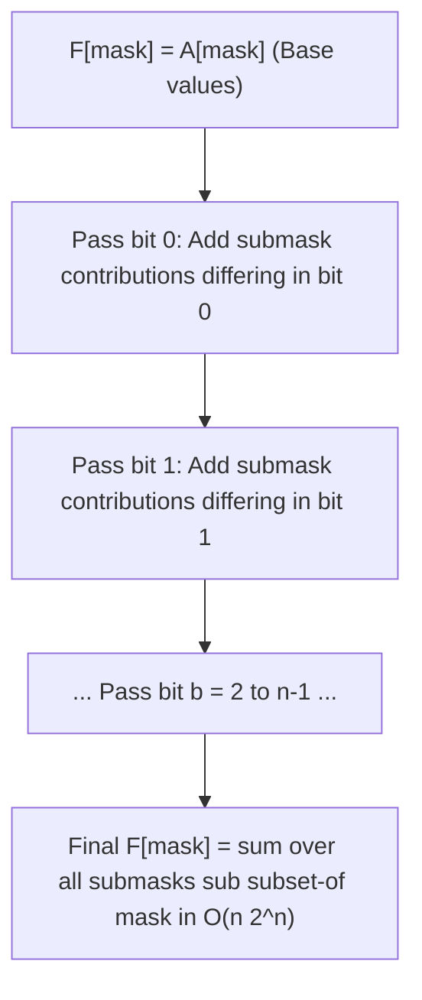

# Bitmask and State Compression

> [!NOTE]
> **Bitmask DP** (and general **State Compression**) represents subproblems indexed by an active **subset of elements** drawn from an $n$-element universe. By encoding each subset as an integer bitmask ($mask \in [0, 2^n - 1]$), bitwise operations allow set insertion, removal, membership testing, and submask iteration to execute in $O(1)$ hardware instructions.
>
> Reference implementations: [C++17 Implementation](../../implementations/cpp/bitmask_and_state_compression.cpp) | [Python Implementation](../../implementations/python/bitmask_and_state_compression.py)

> [!TIP]
> **The Four Archetypes of Bitmask DP:**
> - **Pattern A (Subset + Endpoint):** State $dp[mask][u]$ encodes the optimal cost to visit subset $mask$ ending at element $u$ (e.g., Held-Karp Travelling Salesperson Problem in $O(n^2 2^n)$).
> - **Pattern B (Subset Alone with Implicit Stage):** State $dp[mask]$ where stage $k = \text{popcount}(mask)$ eliminates an explicit dimension (e.g., Min-Cost Bipartite Assignment in $O(n 2^n)$).
> - **Pattern C (Subset Partitioning & Bin Packing):** State $dp[mask]$ evaluated by iterating through all valid submasks ($sub = (sub - 1) \& mask$) in $O(3^n)$ total time.
> - **Pattern D (Sum Over Subsets / SOS DP):** Multidimensional prefix sums accumulating submask values across the $n$-dimensional Boolean hypercube in $O(n 2^n)$ time.

> [!WARNING]
> **Tractability and Memory Limits ($2^n$ Exponential Wall):**
>
> | $n$ (Universe Size) | $2^n$ Subsets | Held-Karp $O(n^2 2^n)$ Ops | Practical Feasibility |
> |---:|---:|---:|---|
> | $\le 16$ | $65,536$ | $\approx 1.7 \times 10^7$ | Trivial ($< 10$ ms in C++) |
> | $18$ | $262,144$ | $\approx 8.5 \times 10^7$ | Comfortable in competitive & production environments |
> | $20$ to $22$ | $1.05 \times 10^6$ to $4.19 \times 10^6$ | $4.2 \times 10^8$ to $2.0 \times 10^9$ | Feasible only with cache-friendly, space-optimized C++ |
> | $> 22$ | $> 4.19 \times 10^6$ | $> 2.0 \times 10^9$ | Intractable for plain bitmask DP; requires Branch & Bound or Meet-in-the-Middle |

Dynamic programming often works by storing answers for many subproblems.

Sometimes those subproblems are indexed by:

- a position
- a capacity
- a pair of prefixes
- an interval
- a subtree

But sometimes the natural state is:

> a subset of elements

When the number of elements is small, a subset can be represented compactly as a **bitmask**.

This leads to one of the most important advanced dynamic programming paradigms:

- **bitmask DP**
- **state-compression DP**
- **subset DP**

The key idea is simple:

- represent a subset by a binary integer
- use that integer as the DP state
- transition by adding, removing, or iterating through elements or submasks

This chapter develops:

- the bitmask representation of subsets
- common bit operations
- Held-Karp dynamic programming for TSP
- assignment and exact matching style DP
- partitioning and submask iteration
- Sum Over Subsets DP
- reconstruction of optimal solutions
- engineering trade-offs of subset-state methods

---

## 1. Why bitmask DP exists

Some problems depend not on a sequence prefix or subtree, but on **which elements have already been chosen**.

Examples:

- which cities have been visited
- which tasks have been assigned
- which items are already packed
- which subset is active

If the universe has $ n $ elements, then there are:

$$
2^n
$$

possible subsets.

For small $ n $, this is manageable.

A bitmask gives a compact and efficient way to encode each subset.

---

## 2. Representing a subset as a bitmask

Suppose we have elements indexed from $ 0 $ to $ n-1 $.

A subset is represented by an integer whose binary bits indicate membership.

### Example
If:

- bit 0 is 1
- bit 2 is 1
- bit 3 is 1

then the subset is:

```text
{0, 2, 3}
```

and the bitmask is:

```text
1101₂ = 13
```

assuming bit 0 is the least significant bit.

---

## 3. Basic bit operations

These are the most common bitmask operations.

### Check whether element `i` is in `mask`

$$
mask \mathbin{\&} (1 \ll i)
$$

### Add element `i`

$$
mask \mathbin{|} (1 \ll i)
$$

### Remove element `i`

$$
mask \mathbin{\&} \sim(1 \ll i)
$$

### Toggle element `i`

$$
mask \mathbin{\oplus} (1 \ll i)
$$

These are the building blocks of subset-state transitions.

---

## 4. Popcount

The **popcount** of a mask is the number of set bits.

That means:

> how many elements are currently in the subset

This is useful for:

- counting chosen elements
- determining assignment stage
- checking subset sizes

### Examples
- `popcount(0)` = 0
- `popcount(13)` = 3 because `13 = 1101₂`

---

## 5. C++17 and Python bit helpers

### C++17
- `__builtin_popcount(mask)` for `int`
- `__builtin_popcountll(mask)` for `long long`

### Python
- `mask.bit_count()`

These are convenient for subset-size calculations.

---

## 6. Iterating over all masks

If there are $ n $ elements, then the masks range from:

$$
0 \text{ to } 2^n - 1
$$

A standard loop is:

```text
for mask in 0 .. (1 << n) - 1
```

This visits every subset exactly once.

This is the base structure of many bitmask DP algorithms.

---

## 7. Iterating over elements inside a mask

To test which elements are present in a subset, we often loop through all indices:

```text
for i in 0 .. n-1:
    if mask has bit i:
        ...
```

This is simple and often sufficient for $ n \le 20 $.

More specialized bit tricks exist, but this method is the clearest starting point.

---

## 8. Submask iteration

A very important pattern is iterating over all submasks of a given mask.

The standard loop is:

```text
sub = mask
while sub > 0:
    ...
    sub = (sub - 1) & mask
```

This visits all nonempty submasks of `mask`.

It is one of the signature techniques of subset DP.

---

## 9. Why submask iteration works

When we subtract 1 from a binary number, the rightmost set bit flips to 0 and lower bits become 1.

Then ANDing with `mask` removes bits that are not allowed.

This systematically enumerates all submasks.

It is compact, fast, and widely used in subset-partitioning DP.

---

## 10. State compression

A bitmask is an example of **state compression**.

Instead of storing a subset as:

- a set object
- a boolean array
- a list of chosen elements

we compress it into one integer.

This reduces overhead and makes DP tables practical for small $ n $.

But the exponential number of masks still remains.

So bitmask DP is powerful, but only for modest problem sizes.

---

## 11. When bitmask DP is tractable

Since the number of subsets is $ 2^n $, practical limits matter.

A rough rule is:

- $ n \le 20 $ is usually comfortable
- $ n \le 22 $ may still be feasible in optimized implementations
- beyond that, subset DP often becomes too expensive unless there is extra structure

The exact limit depends on:

- transition cost
- language
- memory
- constant factors

---

## 12. Travelling Salesperson Problem and Held-Karp DP

One of the most famous bitmask DPs is the **Held-Karp algorithm** for TSP.

### Problem
Given a weighted complete graph on $ n $ cities, find the minimum-cost tour that:

- starts at a fixed city
- visits every city exactly once
- returns to the start

This is NP-hard in general, but for small $ n $, bitmask DP gives an exact algorithm.

---

## 13. State definition for Held-Karp

Fix city `0` as the start.

Let:

$$
dp[mask][u] = \text{minimum cost to start at city } 0,\text{ visit exactly the cities in } mask,\text{ and end at } u
$$

Here:

- `mask` includes city `0` and city `u`
- `u` is the last city in the partial tour

This is the canonical subset-plus-last-position DP state.

---

## 14. Base case for Held-Karp

At the beginning, we are at city `0` and have visited only city `0`.

So:

$$
dp[1 \ll 0][0] = 0
$$

All other initial states are infinity or unreachable.

---

## 15. Transition for Held-Karp

To compute `dp[mask][u]`, suppose the previous city before $ u $ was $ v $.

Then $ v $ must be in `mask` without $ u $.

So:

$$
dp[mask][u] =
\min_{v \in mask,\ v \ne u}
\left(
dp[mask \setminus \{u\}][v] + dist[v][u]
\right)
$$

This is a standard “add the last city” transition.

---

## 16. Final answer for Held-Karp

After visiting every city, we must return to city `0`.

So if:

$$
FULL = 2^n - 1
$$

then the final answer is:

$$
\min_{u \ne 0}
\left(
dp[FULL][u] + dist[u][0]
\right)
$$

This closes the tour.

---

## 17. C++17 Held-Karp TSP

```cpp
#include <vector>
#include <limits>
#include <algorithm>

long long tsp_held_karp(const std::vector<std::vector<int>>& dist) {
    int n = static_cast<int>(dist.size());
    int full = 1 << n;
    const long long INF = std::numeric_limits<long long>::max() / 4;

    std::vector<std::vector<long long>> dp(full, std::vector<long long>(n, INF));
    dp[1][0] = 0;

    for (int mask = 1; mask < full; ++mask) {
        for (int u = 0; u < n; ++u) {
            if (!(mask & (1 << u))) continue;
            if (dp[mask][u] == INF) continue;

            for (int v = 0; v < n; ++v) {
                if (mask & (1 << v)) continue;
                int next_mask = mask | (1 << v);
                dp[next_mask][v] = std::min(dp[next_mask][v], dp[mask][u] + dist[u][v]);
            }
        }
    }

    long long ans = INF;
    int all = full - 1;
    for (int u = 1; u < n; ++u) {
        ans = std::min(ans, dp[all][u] + dist[u][0]);
    }

    return ans;
}
```

---

## 18. Python Held-Karp TSP

```python
def tsp_held_karp(dist):
    n = len(dist)
    full = 1 << n
    INF = 10**18

    dp = [[INF] * n for _ in range(full)]
    dp[1][0] = 0

    for mask in range(full):
        for u in range(n):
            if not (mask & (1 << u)):
                continue
            if dp[mask][u] == INF:
                continue

            for v in range(n):
                if mask & (1 << v):
                    continue
                next_mask = mask | (1 << v)
                dp[next_mask][v] = min(dp[next_mask][v], dp[mask][u] + dist[u][v])

    all_mask = full - 1
    ans = INF
    for u in range(1, n):
        ans = min(ans, dp[all_mask][u] + dist[u][0])

    return ans
```

---

## 19. Complexity of Held-Karp

There are:

- $ 2^n $ masks
- $ n $ possible last cities
- $ n $ possible transitions

So the time complexity is:

$$
O(n^2 2^n)
$$

and the space complexity is:

$$
O(n 2^n)
$$

This is exponentially better than brute-force permutation search, but still exponential.

---

## 20. Reconstructing the TSP tour

To recover the actual optimal tour, store a parent pointer:

- `parent[mask][u]` = previous city before `u` in the optimal state

Then:

1. choose the best final city
2. backtrack through parent pointers
3. reverse the recovered route
4. append the starting city to close the tour

This is the standard reconstruction method.

### C++17 TSP Reconstruction Reference

```cpp
// Backtrack route from stored parent[mask][u] pointers
std::vector<int> route;
int cur = last_city;
int mask = (1 << n) - 1;

while (cur != -1) {
    route.push_back(cur);
    int prev = parent[mask][cur];
    mask ^= (1 << cur);
    cur = prev;
}

std::reverse(route.begin(), route.end());
route.push_back(0); // Close the Hamiltonian tour
```

To recover the actual optimal tour, store a parent pointer:

- `parent[mask][u]` = previous city before `u` in the optimal state

Then:

1. choose the best final city
2. backtrack through parent pointers
3. reverse the recovered route
4. append the starting city to close the tour

This is the standard reconstruction method.

---

## 21. Python TSP reconstruction

```python
def tsp_held_karp_reconstruct(dist):
    n = len(dist)
    full = 1 << n
    INF = 10**18

    dp = [[INF] * n for _ in range(full)]
    parent = [[-1] * n for _ in range(full)]
    dp[1][0] = 0

    for mask in range(full):
        for u in range(n):
            if not (mask & (1 << u)):
                continue
            if dp[mask][u] == INF:
                continue

            for v in range(n):
                if mask & (1 << v):
                    continue
                next_mask = mask | (1 << v)
                cand = dp[mask][u] + dist[u][v]
                if cand < dp[next_mask][v]:
                    dp[next_mask][v] = cand
                    parent[next_mask][v] = u

    all_mask = full - 1
    best_cost = INF
    last = -1

    for u in range(1, n):
        cand = dp[all_mask][u] + dist[u][0]
        if cand < best_cost:
            best_cost = cand
            last = u

    route = []
    mask = all_mask
    cur = last

    while cur != -1:
        route.append(cur)
        prev = parent[mask][cur]
        mask ^= (1 << cur)
        cur = prev

    route.reverse()
    route.append(0)
    return best_cost, route
```

---

## 22. Assignment DP on bipartite matching

Another classical bitmask DP problem is assignment.

### Problem
We have:

- $ n $ workers
- $ n $ tasks
- `cost[i][j]` = cost for worker $ i $ to do task $ j $

We want a minimum-cost perfect assignment.

This can be solved with bitmask DP in:

$$
O(n 2^n)
$$

time.

---

## 23. State definition for assignment DP

Let:

$$
dp[mask] = \text{minimum cost after assigning tasks corresponding to set } mask
$$

If `popcount(mask) = k`, then exactly the first $ k $ workers have already been assigned.

So the next worker index is:

$$
k
$$

This is a very elegant state compression idea.

---

## 24. Transition for assignment DP

If worker $ k $ is next, and task $ j $ is not yet used, then:

$$
dp[mask \cup \{j\}] = \min(dp[mask \cup \{j\}],\; dp[mask] + cost[k][j])
$$

where:

$$
k = popcount(mask)
$$

This tries every unused task for the next worker.

---

## 25. C++17 assignment DP

```cpp
#include <vector>
#include <limits>
#include <algorithm>

long long assignment_dp(const std::vector<std::vector<int>>& cost) {
    int n = static_cast<int>(cost.size());
    int full = 1 << n;
    const long long INF = std::numeric_limits<long long>::max() / 4;

    std::vector<long long> dp(full, INF);
    dp[0] = 0;

    for (int mask = 0; mask < full; ++mask) {
        int worker = __builtin_popcount(mask);
        if (worker >= n) continue;

        for (int task = 0; task < n; ++task) {
            if (mask & (1 << task)) continue;
            int next_mask = mask | (1 << task);
            dp[next_mask] = std::min(dp[next_mask], dp[mask] + cost[worker][task]);
        }
    }

    return dp[full - 1];
}
```

---

## 26. Python assignment DP

```python
def assignment_dp(cost):
    n = len(cost)
    full = 1 << n
    INF = 10**18

    dp = [INF] * full
    dp[0] = 0

    for mask in range(full):
        worker = mask.bit_count()
        if worker >= n:
            continue

        for task in range(n):
            if mask & (1 << task):
                continue
            next_mask = mask | (1 << task)
            dp[next_mask] = min(dp[next_mask], dp[mask] + cost[worker][task])

    return dp[full - 1]
```

---

## 27. Reconstructing the assignment permutation

To reconstruct the assignment, store:

- `parent_mask[next_mask]`
- `chosen_task[next_mask]`

Then backtrack from the full mask.

At each step:

- the assigned worker is `popcount(parent_mask)`
- the chosen task is the stored task

This recovers one optimal assignment permutation.

---

## 28. Python assignment reconstruction

```python
def assignment_dp_reconstruct(cost):
    n = len(cost)
    full = 1 << n
    INF = 10**18

    dp = [INF] * full
    parent_mask = [-1] * full
    chosen_task = [-1] * full
    dp[0] = 0

    for mask in range(full):
        worker = mask.bit_count()
        if worker >= n:
            continue

        for task in range(n):
            if mask & (1 << task):
                continue
            next_mask = mask | (1 << task)
            cand = dp[mask] + cost[worker][task]
            if cand < dp[next_mask]:
                dp[next_mask] = cand
                parent_mask[next_mask] = mask
                chosen_task[next_mask] = task

    assignment = [-1] * n
    mask = full - 1
    while mask:
        pm = parent_mask[mask]
        task = chosen_task[mask]
        worker = pm.bit_count()
        assignment[worker] = task
        mask = pm

    return dp[full - 1], assignment
```

---

## 29. Partitioning and valid-subset DP

Some problems ask us to partition a set into valid groups.

Examples:

- partition into cliques
- partition into compatible teams
- minimum number of valid subsets
- subset packing or bin-style grouping

A common approach is:

1. precompute which subsets are valid
2. perform DP over masks
3. transition by choosing a valid submask

This is where submask iteration becomes essential.

---

## 30. Generic partition DP over submasks

A typical recurrence is:

$$
dp[mask] = \min_{sub \subseteq mask,\ valid[sub]}
\left(
dp[mask \setminus sub] + 1
\right)
$$

This says:

- choose one valid group `sub`
- solve the remaining elements
- add one group

Naively, iterating over all submasks of all masks leads to:

$$
O(3^n)
$$

total work, which is often still acceptable for very small $ n $.

---

## 31. Bin packing style state compression intuition

For some packing problems, we can compress more information into the state.

Example idea:

- `dp[mask]` stores the best partially filled bin state after packing items in `mask`

This can reduce dimensions and lead to elegant subset solutions.

The general lesson is:

> once the chosen set is represented by a mask, the remaining state should be kept as small as possible

This is the heart of state-compression design.

---

## 32. Sum Over Subsets DP

**SOS DP** is a specialized subset technique for computing submask aggregations efficiently.

A common goal is:

$$
F[mask] = \sum_{sub \subseteq mask} A[sub]
$$

A naive approach checks all submasks separately for each mask, costing:

$$
O(3^n)
$$

SOS DP reduces this to:

$$
O(n 2^n)
$$

which is a major improvement.

---

## 33. SOS DP idea



Think of masks as vertices of an $n$-dimensional hypercube.

We build cumulative information one bit at a time.

For each bit $b$:

- if mask has bit $b$ set
- add contribution from the version of the mask with that bit cleared

This is analogous to multidimensional prefix sums.

Think of masks as vertices of an $ n $-dimensional hypercube.

We build cumulative information one bit at a time.

For each bit $ b $:

- if mask has bit $ b $ set
- add contribution from the version of the mask with that bit cleared

This is analogous to multidimensional prefix sums.

---

## 34. SOS DP recurrence

Initialize:

$$
F[mask] = A[mask]
$$

Then for each bit $ b $ from $ 0 $ to $ n-1 $:

$$
\text{if } mask \text{ has bit } b,\quad F[mask] \mathrel{+}= F[mask \setminus \{b\}]
$$

After processing all bits, `F[mask]` contains the sum over all submasks.

---

## 35. C++17 SOS DP

```cpp
#include <vector>

std::vector<long long> sos_dp_sum(std::vector<long long> f, int n) {
    int full = 1 << n;

    for (int bit = 0; bit < n; ++bit) {
        for (int mask = 0; mask < full; ++mask) {
            if (mask & (1 << bit)) {
                f[mask] += f[mask ^ (1 << bit)];
            }
        }
    }

    return f;
}
```

---

## 36. Python SOS DP

```python
def sos_dp_sum(f, n):
    f = f[:]
    full = 1 << n

    for bit in range(n):
        for mask in range(full):
            if mask & (1 << bit):
                f[mask] += f[mask ^ (1 << bit)]

    return f
```

---

## 37. Why SOS DP is useful

SOS DP appears in problems involving:

- submask sums
- subset convolution ideas
- inclusion-style transforms
- fast preprocessing over all subset relations

It is one of the best examples of how subset structure can be exploited beyond direct DP tables.

---

## 38. Memory growth and engineering trade-offs

Bitmask DP is powerful, but memory grows quickly.

A table of size:

$$
2^n
$$

or:

$$
n 2^n
$$

can become large even for moderate $ n $.

### Example
If $ n = 20 $, then:

$$
2^{20} = 1{,}048{,}576
$$

which is manageable.

But if $ n = 25 $, then:

$$
2^{25} = 33{,}554{,}432
$$

which is already much heavier.

So memory often becomes the limiting factor.

---

## 39. Bit-width limits

A standard integer bitmask has practical size limits.

### 32-bit integer
Can represent up to about 32 elements.

### 64-bit integer
Can represent up to about 64 elements.

But bitmask DP is usually limited by exponential complexity long before that.

So the real limit is usually:

- time and memory at $ 2^n $
not merely bit-width.

---

## 40. When bitmask DP is the right tool

Bitmask DP is promising when:

- the problem state is naturally a subset
- $ n $ is small
- exact exponential-time DP is acceptable
- transitions depend on adding or removing one element
- submask iteration or SOS-style aggregation appears useful

Typical signals include phrases like:

- visit every city exactly once
- assign each task once
- choose any subset
- partition a set into valid groups

---

## 41. Common mistakes

### Mistake 1: off-by-one in bit positions
Be consistent about whether element $ i $ maps to bit $ i $.

### Mistake 2: forgetting to include the start node in TSP masks
This can break state meaning.

### Mistake 3: using too much memory
A full `dp[mask][u]` table may become too large.

### Mistake 4: iterating submasks incorrectly
The standard loop is:
`sub = (sub - 1) & mask`

### Mistake 5: applying bitmask DP when $ n $ is too large
Exponential growth dominates quickly.

### Mistake 6: forgetting reconstruction data
If you need the actual tour or assignment, store parents.

---

## 42. Comparison table

| Problem | State | Time complexity | Space complexity |
|---|---|---:|---:|
| Held-Karp TSP | `dp[mask][u]` | $ O(n^2 2^n) $ | $ O(n 2^n) $ |
| Assignment DP | `dp[mask]` | $ O(n 2^n) $ | $ O(2^n) $ |
| Partition DP over submasks | `dp[mask]` with submask iteration | often $ O(3^n) $ | $ O(2^n) $ |
| SOS DP | subset aggregation array | $ O(n 2^n) $ | $ O(2^n) $ |

---

## 43. Proof intuition summary

### Held-Karp
A partial optimal tour ending at city $ u $ must come from some previous city $ v $ after visiting the smaller subset without $ u $.

### Assignment DP
Once a subset of tasks is assigned, the next worker index is determined by the number of chosen tasks.

### Partition DP
Every valid partition begins with some valid chosen submask.

### SOS DP
Submask sums can be accumulated one bit dimension at a time, like prefix sums on the hypercube.

These are all examples of exploiting subset structure efficiently.

---

## 44. Summary

Bitmask and state-compression DP solve problems whose natural state is a subset.

The main ideas are:

- represent subsets as binary masks
- transition by adding, removing, or iterating through elements
- use parent pointers for reconstruction when needed
- exploit submask structure with specialized techniques like SOS DP

Canonical problems include:

- **Travelling Salesperson via Held-Karp**
- **Assignment and exact matching DP**
- **Partition DP over valid subsets**
- **SOS DP for fast submask aggregation**

The main practical lesson is that subset DP is powerful but exponential, so it is best suited for small $ n $ with careful engineering.

---

## 45. Practice prompts

1. How does a bitmask represent a subset?
2. What do `mask & (1 << i)` and `mask | (1 << i)` mean?
3. What is the state $ dp[mask][u] $ in Held-Karp TSP?
4. Why does Held-Karp have complexity $ O(n^2 2^n) $?
5. Why does assignment DP only need one subset dimension?
6. How does submask iteration work?
7. What does SOS DP compute?
8. Why is $ O(2^n) $ memory often the real bottleneck?
9. For what range of $ n $ is bitmask DP typically practical?
10. Why is parent storage important for reconstruction?

---

## 46. Suggested next topics

A natural continuation after bitmask and state-compression DP is:

- DP on DAGs
- advanced DP optimizations
- meet-in-the-middle
- inclusion-exclusion
- exponential-time exact algorithms
