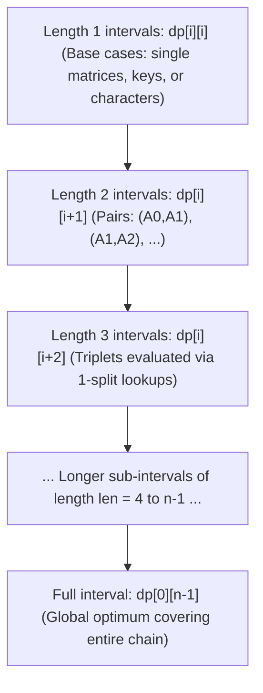

# Interval and Matrix DP

> [!NOTE]
> **Interval DP** (also widely termed **Range DP**) operates on subproblems defined by contiguous segments or ranges $[i, j]$ of an array, string, sequence, or ordered set of keys. Unlike prefix DP (which expands linearly from $0$ to $i$), interval DP evaluates subproblems across two dynamic boundaries, combining smaller sub-ranges to solve larger ranges.
>
> Reference implementations: [C++17 Implementation](../../implementations/cpp/interval_and_matrix_dp.cpp) | [Python Implementation](../../implementations/python/interval_and_matrix_dp.py)

> [!TIP]
> **The Three Archetypes of Interval DP:**
> - **Pattern A (Exhaustive Split / Root Choice):** Partition $[i, j]$ into $[i, k]$ and $[k+1, j]$ across all valid split points $k$ (e.g., Matrix Chain Multiplication, Optimal BST, Polygon Triangulation).
> - **Pattern B (Inverted / "Choose the Last Action"):** Fix the *last* element $k$ remaining in the interval so the left and right subproblems decouple independently without boundary interference (e.g., Burst Balloons, Cutting Sticks).
> - **Pattern C (Boundary Shrinking / Expansion):** Compare the outermost endpoints $s[i]$ and $s[j]$ and shrink inward to $[i+1, j-1]$ on match, or drop an endpoint on mismatch (e.g., Longest Palindromic Subsequence).

> [!WARNING]
> **Cardinal Rules of Interval DP Engineering:**
> 1. **Evaluation Order by Length:** States MUST be populated in order of strictly increasing interval length ($\text{len} = 2, 3, \dots, n$). If computed via standard row-by-row nested loops ($i = 0 \dots n, j = 0 \dots n$), lookups into smaller sub-intervals will read uninitialized values.
> 2. **Boundary Conventions:** Clearly define whether $[i, j]$ is inclusive-inclusive or half-open $[i, j)$. Off-by-one errors in split bounds $k$ or base cases ($i > j$ vs. $i = j$) are the most common source of bugs.
> 3. **Verify Before Optimizing:** Knuth-Yao quadrangle inequality speedups ($O(n^3) \to O(n^2)$) require formal monotonicity of optimal split positions ($opt[i][j-1] \le opt[i][j] \le opt[i+1][j]$). Never assume this holds without mathematical verification.

Dynamic programming is often first learned on:

- prefixes
- grids
- capacities
- pairs of prefixes in string comparison

But another major family of DP problems uses a different kind of state:

> a contiguous interval

In **interval DP**, the subproblem is usually defined on a range:

$$
dp[i][j]
$$

where $ i $ and $ j $ describe the left and right boundaries of a substring, subarray, subchain, or key interval.

This pattern appears in many important problems:

- Matrix Chain Multiplication
- Optimal Binary Search Trees
- Burst Balloons
- Cutting Sticks
- Longest Palindromic Subsequence
- Longest Palindromic Substring
- polygon triangulation
- interval game DP

The main idea is simple:

- define the answer for a range
- solve smaller ranges first
- combine them through a split, a root, or shrinking boundaries

This chapter develops:

- the interval-DP state paradigm
- evaluation order by increasing interval length
- classical problems such as MCM and OBST
- “choose the last action” interval formulations
- palindrome-style boundary DP
- reconstruction of optimal structure
- advanced optimization such as Knuth-Yao style speedups

---

## 1. What is interval DP?

Interval DP is used when the natural subproblem is:

> What is the best answer for the segment from index $ i $ to index $ j $?

A typical state is:

$$
dp[i][j] = \text{best answer for interval } [i, j]
$$

This interval may represent:

- a substring
- a subarray
- a subchain of matrices
- a consecutive set of ordered keys
- a remaining segment after cuts or removals

The key difference from prefix DP is that both ends matter.

---

## 2. Why interval DP is different from prefix DP

In prefix DP, the subproblem often looks like:

- first $ i $ elements
- first $ i $ and first $ j $ characters
- capacity up to $ W $

In interval DP, the subproblem looks like:

- from $ i $ to $ j $

So the state is controlled by **two boundaries of one range**, not one growing prefix or two independent prefixes.

That changes both:

- how the recurrence is written
- how the table is filled

---

## 3. Common interval DP patterns

Most interval DP problems fall into one of these patterns:

### A. Split the interval at some point
Example:
- Matrix Chain Multiplication
- Optimal BST
- polygon triangulation

### B. Choose the last action inside the interval
Example:
- Burst Balloons
- Cutting Sticks

### C. Compare or shrink the boundaries
Example:
- Longest Palindromic Subsequence
- palindromic substring problems

These patterns look different on the surface, but they all use interval states.

---

## 4. Why evaluation order matters

If $ dp[i][j] $ depends on smaller intervals, then those smaller intervals must already be known before we compute $ dp[i][j] $.

This leads to the central rule of interval DP:

> Compute shorter intervals before longer intervals.

That is why interval DP tables are usually filled in order of increasing interval length.

---

## 5. Standard loop ordering by interval length



The canonical double-loop structure is:

```text
for len = 1 to n:
    for i = 0 to n - len:
        j = i + len - 1
        compute dp[i][j]
```

Sometimes length starts at 2 if length-1 intervals are the base case.

This ensures that when we compute interval $ [i, j] $, every strictly smaller interval inside it has already been solved.

---

## 6. Why increasing length works

Suppose the recurrence for $ dp[i][j] $ uses intervals such as:

- $ dp[i][k] $
- $ dp[k+1][j] $
- $ dp[i+1][j-1] $

Each of these spans fewer elements than $ [i, j] $.

So if we process intervals in increasing length, all dependencies are already available.

This is the main operational rule of interval DP.

---

## 7. Matrix Chain Multiplication

**Matrix Chain Multiplication** is the classical first example of interval DP.

### Problem
We want to compute:

$$
A_0 A_1 A_2 \cdots A_{n-1}
$$

where matrix $ A_i $ has dimensions:

$$
dims[i] \times dims[i+1]
$$

Matrix multiplication is associative, so the final product is the same no matter how we parenthesize the chain.

But the **cost** can vary dramatically.

### Goal
Find the parenthesization with minimum scalar multiplication cost.

---

## 8. Why parenthesization matters

Consider three matrices:

- $ A_0 $: $ 10 \times 100 $
- $ A_1 $: $ 100 \times 5 $
- $ A_2 $: $ 5 \times 50 $

Then:

### $(A_0A_1)A_2$
$$
10 \cdot 100 \cdot 5 + 10 \cdot 5 \cdot 50 = 5000 + 2500 = 7500
$$

### $A_0(A_1A_2)$
$$
100 \cdot 5 \cdot 50 + 10 \cdot 100 \cdot 50 = 25000 + 50000 = 75000
$$

Same result matrix, very different cost.

So the structure of parenthesization matters.

---

## 9. State definition for Matrix Chain Multiplication

Let:

$$
dp[i][j] = \text{minimum cost to compute } A_i A_{i+1} \cdots A_j
$$

This is defined for:

$$
0 \le i \le j < n
$$

where $ n $ is the number of matrices.

---

## 10. Base case for Matrix Chain Multiplication

A single matrix requires no multiplication.

So:

$$
dp[i][i] = 0
$$

for all $ i $.

This is the length-1 base case.

---

## 11. Recurrence for Matrix Chain Multiplication

To compute the product from $ i $ to $ j $, choose a final split point $ k $ with:

$$
i \le k < j
$$

This divides the chain into:

- $ A_i \cdots A_k $
- $ A_{k+1} \cdots A_j $

Then:

$$
dp[i][j] =
\min_{i \le k < j}
\left(
dp[i][k] + dp[k+1][j] + dims[i] \cdot dims[k+1] \cdot dims[j+1]
\right)
$$

The last term is the cost of multiplying the two resulting matrices.

---

## 12. Why the MCM recurrence is correct

Every full parenthesization has a **last multiplication**.

That last multiplication must split the chain into two smaller subchains at some $ k $.

So trying every possible split point covers all valid parenthesizations.

This is a standard interval-DP proof idea:

> every optimal structure has a final structural choice

---

## 13. C++17 reference implementation of Matrix Chain Multiplication cost

```cpp
#include <vector>
#include <limits>
#include <algorithm>

long long matrix_chain_cost(const std::vector<int>& dims) {
    int n = static_cast<int>(dims.size()) - 1;
    if (n <= 0) return 0;

    const long long INF = std::numeric_limits<long long>::max() / 4;
    std::vector<std::vector<long long>> dp(n, std::vector<long long>(n, 0));

    for (int len = 2; len <= n; ++len) {
        for (int i = 0; i + len - 1 < n; ++i) {
            int j = i + len - 1;
            dp[i][j] = INF;

            for (int k = i; k < j; ++k) {
                long long cost = dp[i][k] + dp[k + 1][j]
                    + 1LL * dims[i] * dims[k + 1] * dims[j + 1];
                dp[i][j] = std::min(dp[i][j], cost);
            }
        }
    }

    return dp[0][n - 1];
}
```

---

## 14. Python reference implementation of Matrix Chain Multiplication cost

```python
def matrix_chain_cost(dims):
    n = len(dims) - 1
    if n <= 0:
        return 0

    INF = 10**30
    dp = [[0] * n for _ in range(n)]

    for length in range(2, n + 1):
        for i in range(n - length + 1):
            j = i + length - 1
            dp[i][j] = INF

            for k in range(i, j):
                cost = dp[i][k] + dp[k + 1][j] + dims[i] * dims[k + 1] * dims[j + 1]
                dp[i][j] = min(dp[i][j], cost)

    return dp[0][n - 1]
```

---

## 15. Reconstructing optimal parenthesization

To recover the actual parenthesization, not only its cost, we store:

$$
split[i][j] = \text{the best split point } k \text{ for interval } [i, j]
$$

Then reconstruct recursively:

- if $ i = j $, return matrix $ A_i $
- otherwise:
  - build left from $ [i, split[i][j]] $
  - build right from $ [split[i][j]+1, j] $
  - join them with parentheses

---

## 16. C++17 Matrix Chain parenthesization reconstruction

```cpp
#include <vector>
#include <string>
#include <limits>
#include <algorithm>

std::pair<long long, std::string> matrix_chain_parenthesization(const std::vector<int>& dims) {
    int n = static_cast<int>(dims.size()) - 1;
    if (n <= 0) return {0, ""};

    const long long INF = std::numeric_limits<long long>::max() / 4;
    std::vector<std::vector<long long>> dp(n, std::vector<long long>(n, 0));
    std::vector<std::vector<int>> split(n, std::vector<int>(n, -1));

    for (int len = 2; len <= n; ++len) {
        for (int i = 0; i + len - 1 < n; ++i) {
            int j = i + len - 1;
            dp[i][j] = INF;

            for (int k = i; k < j; ++k) {
                long long cost = dp[i][k] + dp[k + 1][j]
                    + 1LL * dims[i] * dims[k + 1] * dims[j + 1];
                if (cost < dp[i][j]) {
                    dp[i][j] = cost;
                    split[i][j] = k;
                }
            }
        }
    }

    auto build = [&](auto&& self, int i, int j) -> std::string {
        if (i == j) return "A" + std::to_string(i);
        int k = split[i][j];
        return "(" + self(self, i, k) + " × " + self(self, k + 1, j) + ")";
    };

    return {dp[0][n - 1], build(build, 0, n - 1)};
}
```

---

## 17. Python Matrix Chain parenthesization reconstruction

```python
def matrix_chain_parenthesization(dims):
    n = len(dims) - 1
    if n <= 0:
        return 0, ""

    INF = 10**30
    dp = [[0] * n for _ in range(n)]
    split = [[-1] * n for _ in range(n)]

    for length in range(2, n + 1):
        for i in range(n - length + 1):
            j = i + length - 1
            dp[i][j] = INF

            for k in range(i, j):
                cost = dp[i][k] + dp[k + 1][j] + dims[i] * dims[k + 1] * dims[j + 1]
                if cost < dp[i][j]:
                    dp[i][j] = cost
                    split[i][j] = k

    def build(i, j):
        if i == j:
            return f"A{i}"
        k = split[i][j]
        return f"({build(i, k)} × {build(k + 1, j)})"

    return dp[0][n - 1], build(0, n - 1)
```

---

## 18. Complexity of Matrix Chain Multiplication

There are:

- $ O(n^2) $ interval states
- $ O(n) $ split points per state

So the total time is:

$$
O(n^3)
$$

and the space is:

$$
O(n^2)
$$

This cubic pattern is common in classical interval DP.

---

## 19. Optimal Binary Search Trees

Another classical interval DP problem is the **Optimal Binary Search Tree** problem.

### Problem
We have sorted keys with access frequencies.

We want to build a BST minimizing expected search cost.

### Intuition
Frequently accessed keys should be closer to the root.

Because keys remain sorted, any subtree corresponds to a **contiguous interval** of keys.

That is why interval DP applies.

---

## 20. State definition for Optimal BST

Let `freq[i]` be the search frequency of key $ i $.

Define:

$$
dp[i][j] = \text{minimum weighted search cost for keys } i \text{ through } j
$$

If we choose key $ r $ as the root of the subtree on interval $ [i, j] $, then:

- left subtree is interval $ [i, r-1] $
- right subtree is interval $ [r+1, j] $

So the root choice splits the interval.

---

## 21. Why frequency sums matter in OBST

When a subtree is placed one level deeper, every key in that subtree pays one extra comparison.

So after choosing a root for interval $ [i, j] $, we must add the total frequency of that interval.

This is the main extra idea in OBST beyond a plain split DP.

---

## 22. Recurrence for Optimal BST

Let:

$$
sum(i, j) = freq[i] + freq[i+1] + \cdots + freq[j]
$$

Then:

$$
dp[i][j] =
\min_{i \le r \le j}
\left(
dp[i][r-1] + dp[r+1][j] + sum(i, j)
\right)
$$

where empty intervals contribute 0.

This tries every root $ r $ for the interval.

---

## 23. Base cases for Optimal BST

For a single key:

$$
dp[i][i] = freq[i]
$$

because it sits at the root of that subtree and is found in one comparison unit under this model.

Empty intervals contribute 0.

In code, empty intervals are usually handled by conditional checks.

---

## 24. Prefix sums for OBST

The recurrence repeatedly asks for interval sums.

To answer these in $ O(1) $, use prefix sums.

Let:

$$
prefix[t] = freq[0] + freq[1] + \cdots + freq[t-1]
$$

Then:

$$
sum(i, j) = prefix[j+1] - prefix[i]
$$

This keeps the total OBST algorithm at cubic time rather than worse.

---

## 25. C++17 reference implementation of Optimal BST cost

```cpp
#include <vector>
#include <limits>
#include <algorithm>

long long optimal_bst_cost(const std::vector<int>& freq) {
    int n = static_cast<int>(freq.size());
    if (n == 0) return 0;

    const long long INF = std::numeric_limits<long long>::max() / 4;
    std::vector<long long> prefix(n + 1, 0);
    for (int i = 0; i < n; ++i) {
        prefix[i + 1] = prefix[i] + freq[i];
    }

    auto range_sum = [&](int l, int r) -> long long {
        return prefix[r + 1] - prefix[l];
    };

    std::vector<std::vector<long long>> dp(n, std::vector<long long>(n, 0));

    for (int i = 0; i < n; ++i) {
        dp[i][i] = freq[i];
    }

    for (int len = 2; len <= n; ++len) {
        for (int i = 0; i + len - 1 < n; ++i) {
            int j = i + len - 1;
            dp[i][j] = INF;
            long long total = range_sum(i, j);

            for (int r = i; r <= j; ++r) {
                long long left = (r > i ? dp[i][r - 1] : 0);
                long long right = (r < j ? dp[r + 1][j] : 0);
                dp[i][j] = std::min(dp[i][j], left + right + total);
            }
        }
    }

    return dp[0][n - 1];
}
```

---

## 26. Python reference implementation of Optimal BST cost

```python
def optimal_bst_cost(freq):
    n = len(freq)
    if n == 0:
        return 0

    prefix = [0] * (n + 1)
    for i in range(n):
        prefix[i + 1] = prefix[i] + freq[i]

    def range_sum(l, r):
        return prefix[r + 1] - prefix[l]

    dp = [[0] * n for _ in range(n)]

    for i in range(n):
        dp[i][i] = freq[i]

    for length in range(2, n + 1):
        for i in range(n - length + 1):
            j = i + length - 1
            dp[i][j] = 10**30
            total = range_sum(i, j)

            for r in range(i, j + 1):
                left = dp[i][r - 1] if r > i else 0
                right = dp[r + 1][j] if r < j else 0
                dp[i][j] = min(dp[i][j], left + right + total)

    return dp[0][n - 1]
```

---

## 27. Reconstructing the optimal BST topology

As with matrix chains, we can store the best structural choice.

Let:

$$
root[i][j] = \text{best root chosen for interval } [i, j]
$$

Then reconstruct recursively:

- empty interval -> no node
- otherwise create node `root[i][j]`
- recurse left on $ [i, root[i][j]-1] $
- recurse right on $ [root[i][j]+1, j] $

This yields the actual optimal tree shape.

---

## 28. Python Optimal BST reconstruction

```python
def optimal_bst_roots(freq):
    n = len(freq)
    if n == 0:
        return 0, []

    prefix = [0] * (n + 1)
    for i in range(n):
        prefix[i + 1] = prefix[i] + freq[i]

    def range_sum(l, r):
        return prefix[r + 1] - prefix[l]

    dp = [[0] * n for _ in range(n)]
    root = [[-1] * n for _ in range(n)]

    for i in range(n):
        dp[i][i] = freq[i]
        root[i][i] = i

    for length in range(2, n + 1):
        for i in range(n - length + 1):
            j = i + length - 1
            dp[i][j] = 10**30
            total = range_sum(i, j)

            for r in range(i, j + 1):
                left = dp[i][r - 1] if r > i else 0
                right = dp[r + 1][j] if r < j else 0
                cost = left + right + total

                if cost < dp[i][j]:
                    dp[i][j] = cost
                    root[i][j] = r

    return dp[0][n - 1], root

def build_obst_structure(root, i, j):
    if i > j:
        return None
    r = root[i][j]
    return {
        "key": r,
        "left": build_obst_structure(root, i, r - 1),
        "right": build_obst_structure(root, r + 1, j),
    }
```

---

## 29. Burst Balloons and “choose the last action”

Some interval DP problems are easier if we think in reverse.

### Example idea
Instead of choosing the **first** balloon to burst, choose the **last** balloon to burst inside an interval.

This is powerful because when balloon $ k $ is the last one remaining in interval $ [i, j] $, its neighbors are known.

That removes ambiguity.

This “choose the last action” idea is a major interval-DP technique.

---

## 30. Burst Balloons recurrence intuition

In the standard version, we pad the array with 1 on both ends.

Let the padded array be `a`.

Define:

$$
dp[i][j] = \text{maximum coins obtainable by bursting all balloons strictly between } i \text{ and } j
$$

Then if balloon $ k $ is the last balloon burst between $ i $ and $ j $:

$$
dp[i][j] = \max_{i < k < j}
\left(
dp[i][k] + dp[k][j] + a[i] \cdot a[k] \cdot a[j]
\right)
$$

This is a beautiful example of inverting the process to make subproblems independent.

---

## 31. Cutting Sticks intuition

A closely related problem is **Cutting Sticks**.

### Problem
We have a stick of length $ L $ and must perform cuts at specified positions.

Each cut costs the current length of the stick segment being cut.

### Key insight
If we choose the **first cut** inside an interval, the remaining left and right segments become independent.

So with cut positions sorted and endpoints included, define:

$$
dp[i][j] = \text{minimum cost to perform all cuts between endpoints } i \text{ and } j
$$

Then:

$$
dp[i][j] =
\min_{i < k < j}
\left(
dp[i][k] + dp[k][j] + pos[j] - pos[i]
\right)
$$

This is another canonical interval-split DP.

---

## 32. Longest Palindromic Subsequence

Interval DP also appears when the state compares the two boundaries of a string.

For **Longest Palindromic Subsequence**, define:

$$
dp[i][j] = \text{length of the longest palindromic subsequence in } s[i \dots j]
$$

This is an interval state with boundary-based transitions.

---

## 33. LPS recurrence

For Longest Palindromic Subsequence:

### Base cases
- $ dp[i][i] = 1 $
- empty interval contributes 0

### Transition
If:

$$
s[i] = s[j]
$$

then:

$$
dp[i][j] = dp[i+1][j-1] + 2
$$

Otherwise:

$$
dp[i][j] = \max(dp[i+1][j], dp[i][j-1])
$$

This is interval DP by shrinking boundaries inward.

---

## 34. C++17 Longest Palindromic Subsequence length

```cpp
#include <vector>
#include <string>
#include <algorithm>

int longest_palindromic_subsequence(const std::string& s) {
    int n = static_cast<int>(s.size());
    if (n == 0) return 0;

    std::vector<std::vector<int>> dp(n, std::vector<int>(n, 0));

    for (int i = 0; i < n; ++i) {
        dp[i][i] = 1;
    }

    for (int len = 2; len <= n; ++len) {
        for (int i = 0; i + len - 1 < n; ++i) {
            int j = i + len - 1;
            if (s[i] == s[j]) {
                dp[i][j] = (len == 2 ? 2 : dp[i + 1][j - 1] + 2);
            } else {
                dp[i][j] = std::max(dp[i + 1][j], dp[i][j - 1]);
            }
        }
    }

    return dp[0][n - 1];
}
```

---

## 35. Python Longest Palindromic Subsequence length

```python
def longest_palindromic_subsequence(s):
    n = len(s)
    if n == 0:
        return 0

    dp = [[0] * n for _ in range(n)]

    for i in range(n):
        dp[i][i] = 1

    for length in range(2, n + 1):
        for i in range(n - length + 1):
            j = i + length - 1
            if s[i] == s[j]:
                dp[i][j] = 2 if length == 2 else dp[i + 1][j - 1] + 2
            else:
                dp[i][j] = max(dp[i + 1][j], dp[i][j - 1])

    return dp[0][n - 1]
```

---

## 36. Longest Palindromic Substring

A related but different problem is **Longest Palindromic Substring**.

Here the substring must be contiguous.

A common DP state is:

$$
dp[i][j] = \text{whether } s[i \dots j] \text{ is a palindrome}
$$

Then:

- length 1 substrings are palindromes
- length 2 substrings are palindromes if both characters match
- longer substrings are palindromes if:
  - endpoints match
  - and the inside substring is also a palindrome

So:

$$
dp[i][j] = (s[i] = s[j]) \land dp[i+1][j-1]
$$

for sufficiently large intervals.

---

## 37. What these examples teach

These examples show that interval DP is not one single recurrence.

Instead, it is a **family of state designs** over contiguous ranges:

- split the range
- choose a root
- choose the last action
- compare the two boundaries

The common thread is the interval state and the need to solve shorter intervals first.

---

## 38. Reconstruction as a core skill

In many interval DP problems, the numeric optimum is only part of the answer.

We may also want:

- matrix parenthesization
- BST structure
- cut order
- balloon-burst order
- chosen palindromic witness

That is why storing decisions like:

- `split[i][j]`
- `root[i][j]`

is a core interval-DP skill.

---

## 39. Generic reconstruction pattern

A useful reconstruction recipe is:

1. store the best structural decision for each interval
2. start from the full interval
3. recursively rebuild the left and right substructures
4. combine them into the final object

This same pattern appears across matrix, tree, and parsing-style DPs.

---

## 40. Optimization: Knuth-Yao intuition

Some interval DP recurrences have the form:

$$
dp[i][j] = \min_{i < k < j} \left( dp[i][k] + dp[k][j] \right) + C(i, j)
$$

where the cost function $ C(i, j) $ satisfies additional structure.

In special cases, this allows the search range for the optimal split to shrink.

This leads to famous optimizations such as:

- **Knuth optimization**
- related quadrangle-inequality / monotonicity methods
- sometimes grouped under Knuth-Yao style speedups

These can reduce certain cubic interval DPs to quadratic time.

---

## 41. Knuth optimization intuition

For some problems, the optimal split positions are monotone:

$$
opt[i][j-1] \le opt[i][j] \le opt[i+1][j]
$$

If this property holds, then instead of testing every split point $ k $, we only test a small restricted range.

That reduces the total work dramatically.

This is especially important in advanced versions of:

- Optimal BST
- file merging
- some partition DP problems

---

## 42. When Knuth-style optimization applies

These optimizations do **not** apply to every interval DP.

They require strong structural conditions, often involving:

- quadrangle inequalities
- monotonicity of argmin locations
- specific cost-function behavior

So the safe educational message is:

- classical interval DP is usually $ O(n^3) $
- some special problems can be optimized to $ O(n^2) $
- but only after proving the needed structure

This is an advanced optimization topic, not a default assumption.

---

## 43. Complexity summary

### Classical interval DP with split search
- states: $ O(n^2) $
- transitions per state: $ O(n) $
- time: $ O(n^3) $
- space: $ O(n^2) $

### Boundary-shrinking palindrome DP
- states: $ O(n^2) $
- transitions per state: $ O(1) $
- time: $ O(n^2) $
- space: $ O(n^2) $

### Knuth-optimized special cases
- time can become $ O(n^2) $
- but only under additional proven conditions

---

## 44. Common mistakes

### Mistake 1: wrong loop order
If smaller intervals are not computed first, dependencies will be missing.

### Mistake 2: off-by-one errors
Interval DP is very sensitive to whether $ j $ is inclusive or exclusive.

### Mistake 3: incorrect split ranges
For split DPs, make sure the candidate split points are exactly the valid ones.

### Mistake 4: forgetting empty-interval handling
Subproblems such as $ dp[i][r-1] $ may be empty and should often contribute 0.

### Mistake 5: recomputing interval sums repeatedly
Use prefix sums when the recurrence repeatedly asks for range totals.

### Mistake 6: assuming advanced optimizations always apply
Knuth-Yao style methods require proof, not hope.

---

## 45. Comparison table

| Problem | State meaning | Structural choice | Time |
|---|---|---|---:|
| Matrix Chain Multiplication | min cost for matrix interval | split point $ k $ | $ O(n^3) $ |
| Optimal BST | min weighted search cost for key interval | root $ r $ | $ O(n^3) $ |
| Burst Balloons | max reward for open interval | last balloon $ k $ | $ O(n^3) $ |
| Cutting Sticks | min cost for cut interval | first cut $ k $ | $ O(n^3) $ |
| Longest Palindromic Subsequence | max palindromic subsequence length in interval | boundary match or drop side | $ O(n^2) $ |
| Longest Palindromic Substring | palindrome truth on interval | boundary match plus inner truth | $ O(n^2) $ |

---

## 46. Worked mini-template for interval DP

When you suspect interval DP, ask:

1. What does `dp[i][j]` mean?
2. Is the interval closed `[i, j]` or half-open `[i, j)`?
3. What are the base cases for very short intervals?
4. Does the recurrence:
   - split the interval,
   - choose a root,
   - choose a last action,
   - or compare boundaries?
5. What smaller intervals does it depend on?
6. What length order guarantees those are ready?
7. Do I need reconstruction data like `split[i][j]`?

This checklist is often enough to design the solution.

---

## 47. Summary

Interval DP is the dynamic programming paradigm for problems whose natural subproblems are contiguous ranges.

The main pattern is:

- define a state over $ [i, j] $
- compute shorter intervals first
- combine smaller intervals through a split, a root, a last action, or boundary comparison
- optionally store choices for reconstruction

Canonical examples include:

- **Matrix Chain Multiplication**
- **Optimal Binary Search Trees**
- **Burst Balloons**
- **Cutting Sticks**
- **Longest Palindromic Subsequence**
- **Longest Palindromic Substring**

This chapter is important because it extends DP from prefixes and grids into structural range-based reasoning.

---

## 48. Practice prompts

1. What is the main difference between prefix DP and interval DP?
2. Why do interval DP tables usually iterate by increasing length?
3. What does $ dp[i][j] $ mean in Matrix Chain Multiplication?
4. Why does MCM try all split points?
5. Why must OBST add the interval frequency sum?
6. Why is Burst Balloons easier when we choose the last balloon rather than the first?
7. How is Longest Palindromic Subsequence different from Longest Palindromic Substring?
8. Why do we store `split[i][j]` or `root[i][j]` for reconstruction?
9. When can Knuth-style optimization reduce $ O(n^3) $ to $ O(n^2) $?
10. Why should such optimizations never be assumed without proof?

---

## 49. Suggested next topics

A natural continuation after interval and matrix DP is:

- tree DP
- bitmask and state-compression DP
- rerooting DP
- game DP on graphs and trees
- advanced DP optimizations
