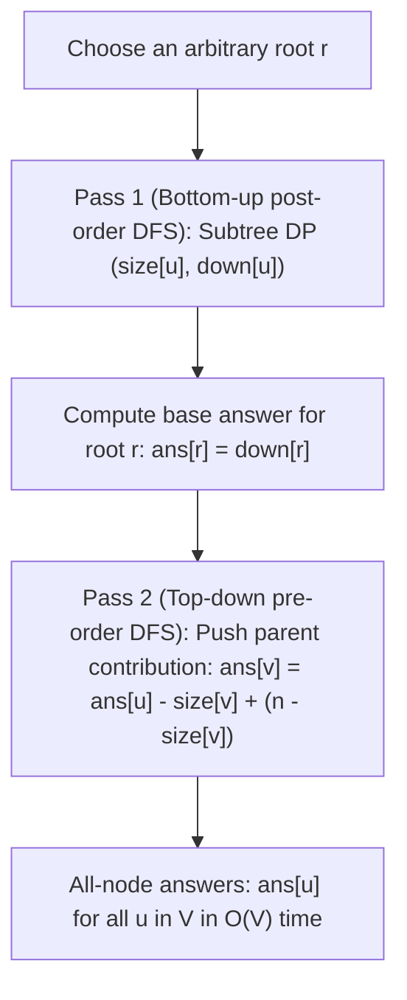

# Tree DP

> [!NOTE]
> **Tree DP** generalizes dynamic programming to hierarchical acyclic graph topologies $T = (V, E)$. While sequences progress along linear arrays and interval DPs expand across 2D ranges, tree DP evaluates subproblems across rooted subtrees $T_u$, recursively combining child solutions into parent states in $O(V)$ time via post-order Depth-First Search (DFS).
>
> Reference implementations: [C++17 Implementation](../../implementations/cpp/tree_dp.cpp) | [Python Implementation](../../implementations/python/tree_dp.py)

> [!TIP]
> **The Four Archetypes of Tree DP:**
> - **Pattern A (Subtree Aggregations):** Bottom-up accumulation of scalar properties (e.g., subtree size $size[u] = 1 + \sum size[v]$, heights, subtree depths).
> - **Pattern B (Include-Exclude Subtree States):** Branching decisions where parent inclusion constrains child selections (e.g., Maximum Weight Independent Set $dp[u][1]$ vs. $dp[u][0]$).
> - **Pattern C (Path Combining via Downward Extensions):** Evaluating through-node paths by aggregating the top two downward child branches (e.g., Tree Diameter and Tree Centers).
> - **Pattern D (All-Node Rerooting DP):** Two-pass technique (bottom-up subtree aggregation followed by top-down parent contribution push) computing answers for every node as root in optimal $O(V)$ time instead of naive $O(V^2)$.

> [!WARNING]
> **Cardinal Rules of Tree DP Engineering:**
> 1. **Parent Guard Check:** Because undirected tree edges are bidirectional, every DFS traversal MUST pass `parent` (or check `v != parent`) to prevent immediate back-traversal and infinite call cycles.
> 2. **Recursion Stack Safety:** On degenerate, star-deprived, or caterpillar trees, call stack depth reaches $O(V)$. In production systems or environments with restricted stack sizes (e.g. Python default 1000 frames), use iterative post-order traversal or elevate `sys.setrecursionlimit`.
> 3. **Unrooted vs. Rooted Perspective:** An unrooted tree is topological; rooting is merely a chosen computational coordinate system. The underlying optimal global invariants (such as diameter or MWIS total weight) remain strictly identical regardless of which root node is selected.

Dynamic programming is often first learned on:

- arrays
- strings
- grids
- intervals

But many important problems are naturally defined on **trees**.

A tree is a connected acyclic graph:

$$
T = (V, E)
$$

Unlike arrays or grids, a tree does not have one simple left-to-right order.

Instead, its structure is hierarchical.

This changes the shape of the dynamic programming state:

- a state may describe a **subtree**
- transitions combine information from **children**
- computations usually proceed with **depth-first search**
- some problems require **rerooting**, where we efficiently compute answers for every possible root

Tree DP is one of the most important advanced DP paradigms because it teaches how to move from linear structures to recursive graph structure while preserving efficient dynamic programming ideas.

This chapter develops:

- tree DP foundations
- post-order subtree computation
- maximum weight independent set on trees
- tree diameter and centers
- subtree aggregation patterns
- rerooting DP
- reconstruction of optimal sets and witness paths

---

## 1. What is tree DP?

**Tree DP** is dynamic programming on tree-structured data.

The main idea is:

> Solve a problem on each subtree, then combine child answers to solve the parent.

This works especially well because trees have **no cycles**.

That means once we choose a root, each node has:

- one parent, except the root
- zero or more children

This naturally creates recursive subproblems.

---

## 2. Why trees are different from arrays and intervals

In an array, each state usually depends on nearby earlier positions.

In interval DP, each state depends on smaller ranges.

In a tree, a state depends on an irregular set of child subtrees.

So the challenge is not just the recurrence, but also:

- choosing a root
- defining subtree meaning
- traversing in the correct order
- avoiding revisiting the parent

This is the core shift in tree DP.

---

## 3. Rooting the tree

A tree is undirected by default.

To perform DP, we usually **choose a root**.

Once rooted:

- every edge gets a parent-child interpretation
- each node $ u $ defines a subtree $ T_u $
- recursive DP becomes natural

### Important idea
Rooting does **not** change the underlying tree.
It only gives us a useful perspective for computation.

---

## 4. Subtree states

A common tree DP state is:

$$
dp[u] = \text{answer for the subtree rooted at } u
$$

Sometimes one value is enough.

Sometimes we need multiple states, such as:

- include / exclude
- matched / unmatched
- chosen / not chosen
- size or height information

The art of tree DP is deciding what each node must know about its subtree.

---

## 5. Post-order traversal pattern

Most tree DPs are computed in **post-order**:

- first solve all children
- then solve the parent

This is a natural DFS pattern.

Why does this work?

Because the parent's recurrence usually depends on fully computed child states.

So a standard recursive structure is:

1. visit children
2. collect child answers
3. compute the node's answer

---

## 6. Generic tree DP DFS schema

A common template is:

```text
dfs(u, parent):
    for each child v of u:
        if v != parent:
            dfs(v, u)

    combine child states to compute dp[u]
```

The `parent` parameter prevents us from walking back upward and creating an infinite loop.

---

## 7. Subtree aggregation as the simplest tree DP

Before studying more advanced examples, it helps to see the simplest form of tree DP:

- subtree size
- subtree height
- sum of values in a subtree
- sum of depths in a subtree

These are all examples of bottom-up aggregation.

### Example
If `size[u]` is the number of nodes in the subtree of $ u $, then:

$$
size[u] = 1 + \sum_{v \in children(u)} size[v]
$$

This is tree DP in its simplest form.

---

## 8. C++17 subtree size and height example

```cpp
#include <vector>
#include <algorithm>

struct TreeAggregates {
    std::vector<int> subtree_size;
    std::vector<int> height;
};

TreeAggregates compute_subtree_size_height(const std::vector<std::vector<int>>& graph, int root = 0) {
    int n = static_cast<int>(graph.size());
    TreeAggregates result{std::vector<int>(n, 0), std::vector<int>(n, 0)};

    auto dfs = [&](auto&& self, int u, int parent) -> void {
        result.subtree_size[u] = 1;
        result.height[u] = 0;

        for (int v : graph[u]) {
            if (v == parent) continue;
            self(self, v, u);
            result.subtree_size[u] += result.subtree_size[v];
            result.height[u] = std::max(result.height[u], result.height[v] + 1);
        }
    };

    dfs(dfs, root, -1);
    return result;
}
```

---

## 9. Python subtree size and height example

```python
def compute_subtree_size_height(graph, root=0):
    n = len(graph)
    subtree_size = [0] * n
    height = [0] * n

    def dfs(u, parent):
        subtree_size[u] = 1
        height[u] = 0

        for v in graph[u]:
            if v == parent:
                continue
            dfs(v, u)
            subtree_size[u] += subtree_size[v]
            height[u] = max(height[u], height[v] + 1)

    dfs(root, -1)
    return subtree_size, height
```

---

## 10. Maximum Weight Independent Set on Trees

A classical and very important tree DP problem is the **Maximum Weight Independent Set** on a tree.

### Problem
Each node $ u $ has a weight $ w[u] $.

Choose a set of nodes with maximum total weight such that:

- no two chosen nodes are adjacent

This is difficult on general graphs, but on trees it has a clean DP solution.

---

## 11. Why include/exclude states are needed

At each node $ u $, the decision to include it affects its children:

- if $ u $ is included, no child may be included
- if $ u $ is excluded, each child may independently be included or excluded

So one DP value is not enough.

We need two states.

---

## 12. State design for MWIS on trees

Let:

$$
dp[u][1] = \text{maximum weight of an independent set in } T_u \text{ if } u \text{ is included}
$$

$$
dp[u][0] = \text{maximum weight of an independent set in } T_u \text{ if } u \text{ is excluded}
$$

This is one of the most standard include-exclude tree DP patterns.

---

## 13. Transitions for MWIS

If $ u $ is included, then no child can be included:

$$
dp[u][1] = w[u] + \sum_{v \in children(u)} dp[v][0]
$$

If $ u $ is excluded, each child can choose its better option:

$$
dp[u][0] = \sum_{v \in children(u)} \max(dp[v][0], dp[v][1])
$$

These two equations define the whole solution.

---

## 14. Why the MWIS recurrence is correct

The tree structure makes child subproblems independent once we know whether the parent is chosen.

### If $ u $ is chosen
Every child must be excluded.

### If $ u $ is not chosen
Each child's subtree can optimize independently.

This conditional independence is what makes tree DP work so well here.

---

## 15. C++17 Maximum Weight Independent Set on Trees

```cpp
#include <vector>
#include <array>
#include <algorithm>

long long maximum_weight_independent_set(
    const std::vector<std::vector<int>>& graph,
    const std::vector<int>& weight,
    int root = 0) {

    int n = static_cast<int>(graph.size());
    std::vector<std::array<long long, 2>> dp(n, {0, 0});

    auto dfs = [&](auto&& self, int u, int parent) -> void {
        dp[u][1] = weight[u];
        dp[u][0] = 0;

        for (int v : graph[u]) {
            if (v == parent) continue;
            self(self, v, u);

            dp[u][1] += dp[v][0];
            dp[u][0] += std::max(dp[v][0], dp[v][1]);
        }
    };

    dfs(dfs, root, -1);
    return std::max(dp[root][0], dp[root][1]);
}
```

---

## 16. Python Maximum Weight Independent Set on Trees

```python
def maximum_weight_independent_set(graph, weight, root=0):
    n = len(graph)
    dp = [[0, 0] for _ in range(n)]

    def dfs(u, parent):
        dp[u][1] = weight[u]
        dp[u][0] = 0

        for v in graph[u]:
            if v == parent:
                continue
            dfs(v, u)
            dp[u][1] += dp[v][0]
            dp[u][0] += max(dp[v][0], dp[v][1])

    dfs(root, -1)
    return max(dp[root][0], dp[root][1])
```

---

## 17. Reconstructing the chosen node set for MWIS

To recover an actual optimal set, we backtrack the include-exclude decisions.

### Idea
At node $ u $:

- if the parent was included, then $ u $ must be excluded
- otherwise choose whichever of `dp[u][0]` and `dp[u][1]` gives the better value

Then recurse on children with the correct parent-state constraint.

This reconstructs one optimal independent set.

---

## 18. C++17 MWIS reconstruction

```cpp
#include <vector>
#include <array>
#include <algorithm>

std::pair<long long, std::vector<int>> maximum_weight_independent_set_reconstruct(
    const std::vector<std::vector<int>>& graph,
    const std::vector<int>& weight,
    int root = 0) {

    int n = static_cast<int>(graph.size());
    std::vector<std::array<long long, 2>> dp(n, {0, 0});

    auto dfs = [&](auto&& self, int u, int parent) -> void {
        dp[u][1] = weight[u];
        dp[u][0] = 0;

        for (int v : graph[u]) {
            if (v == parent) continue;
            self(self, v, u);
            dp[u][1] += dp[v][0];
            dp[u][0] += std::max(dp[v][0], dp[v][1]);
        }
    };

    dfs(dfs, root, -1);

    std::vector<int> chosen;

    auto build = [&](auto&& self, int u, int parent, bool parent_taken) -> void {
        bool take_u = false;
        if (!parent_taken && dp[u][1] >= dp[u][0]) {
            take_u = true;
            chosen.push_back(u);
        }

        for (int v : graph[u]) {
            if (v == parent) continue;
            self(self, v, u, take_u);
        }
    };

    build(build, root, -1, false);
    std::sort(chosen.begin(), chosen.end());

    return {std::max(dp[root][0], dp[root][1]), chosen};
}
```

---

## 19. Python MWIS reconstruction

```python
def maximum_weight_independent_set_reconstruct(graph, weight, root=0):
    n = len(graph)
    dp = [[0, 0] for _ in range(n)]

    def dfs(u, parent):
        dp[u][1] = weight[u]
        dp[u][0] = 0

        for v in graph[u]:
            if v == parent:
                continue
            dfs(v, u)
            dp[u][1] += dp[v][0]
            dp[u][0] += max(dp[v][0], dp[v][1])

    dfs(root, -1)

    chosen = []

    def build(u, parent, parent_taken):
        take_u = False
        if not parent_taken and dp[u][1] >= dp[u][0]:
            take_u = True
            chosen.append(u)

        for v in graph[u]:
            if v == parent:
                continue
            build(v, u, take_u)

    build(root, -1, False)
    chosen.sort()
    return max(dp[root][0], dp[root][1]), chosen
```

---

## 20. Tree diameter

Another foundational tree problem is the **diameter**.

### Definition
The diameter of a tree is the maximum number of edges on any simple path between two nodes.

A standard solution uses two BFS or DFS runs.

But tree DP also gives a beautiful structural solution.

---

## 21. Downward path DP for diameter

For each node $ u $, define:

$$
down[u] = \text{length of the longest downward path starting at } u
$$

This means the longest path from $ u $ into one of its descendant subtrees.

To compute the diameter through $ u $, we need the two largest child-based downward paths.

If the two best downward extensions from $ u $ have lengths $ a $ and $ b $, then a path passing through $ u $ has length:

$$
a + b
$$

The overall diameter is the maximum such value over all nodes.

---

## 22. C++17 tree diameter by DP

```cpp
#include <vector>
#include <algorithm>

int tree_diameter(const std::vector<std::vector<int>>& graph, int root = 0) {
    int diameter = 0;

    auto dfs = [&](auto&& self, int u, int parent) -> int {
        int best1 = 0, best2 = 0;

        for (int v : graph[u]) {
            if (v == parent) continue;
            int child_down = self(self, v, u) + 1;

            if (child_down > best1) {
                best2 = best1;
                best1 = child_down;
            } else if (child_down > best2) {
                best2 = child_down;
            }
        }

        diameter = std::max(diameter, best1 + best2);
        return best1;
    };

    dfs(dfs, root, -1);
    return diameter;
}
```

---

## 23. Python tree diameter by DP

```python
def tree_diameter(graph, root=0):
    diameter = 0

    def dfs(u, parent):
        nonlocal diameter
        best1 = 0
        best2 = 0

        for v in graph[u]:
            if v == parent:
                continue
            child_down = dfs(v, u) + 1

            if child_down > best1:
                best2 = best1
                best1 = child_down
            elif child_down > best2:
                best2 = child_down

        diameter = max(diameter, best1 + best2)
        return best1

    dfs(root, -1)
    return diameter
```

---

## 24. Why the diameter recurrence works

Any longest path in a rooted tree has one of two forms relative to a node $ u $:

- it lies entirely inside one child subtree
- or it passes through $ u $, using the two best downward branches

By checking the sum of the two best downward child paths at every node, we consider all possible through-node longest paths.

That is the core proof intuition.

---

## 25. Reconstructing a witness diameter path

If we want the actual diameter path, not only its length, we can store:

- which child produced the best downward path
- which two children gave the best pair at the best center node

Then build the path by walking downward through those recorded choices.

This is the tree analogue of witness reconstruction in sequence and interval DP.

---

## 26. Tree centers

The **center** of a tree is a node or pair of adjacent nodes minimizing the maximum distance to all other nodes.

A tree has:

- one center, or
- two adjacent centers

Centers are closely related to diameter.

### Key fact
The center lies in the middle of a diameter path.

So once we reconstruct a diameter path, the center(s) can be found by taking its middle node(s).

---

## 27. Subtree aggregations beyond size and height

Many useful tree DPs are simple subtree aggregations, including:

- subtree size
- subtree height
- subtree sum of values
- subtree sum of depths
- count of marked nodes in each subtree
- maximum or minimum value in a subtree

These are often stepping stones to more advanced problems.

---

## 28. C++17 subtree sum of depths example

```cpp
#include <vector>

std::pair<std::vector<int>, std::vector<long long>> subtree_size_and_depth_sum(
    const std::vector<std::vector<int>>& graph,
    int root = 0) {

    int n = static_cast<int>(graph.size());
    std::vector<int> size(n, 0);
    std::vector<long long> depth_sum(n, 0);

    auto dfs = [&](auto&& self, int u, int parent) -> void {
        size[u] = 1;
        depth_sum[u] = 0;

        for (int v : graph[u]) {
            if (v == parent) continue;
            self(self, v, u);
            size[u] += size[v];
            depth_sum[u] += depth_sum[v] + size[v];
        }
    };

    dfs(dfs, root, -1);
    return {size, depth_sum};
}
```

---

## 29. Python subtree sum of depths example

```python
def subtree_size_and_depth_sum(graph, root=0):
    n = len(graph)
    size = [0] * n
    depth_sum = [0] * n

    def dfs(u, parent):
        size[u] = 1
        depth_sum[u] = 0

        for v in graph[u]:
            if v == parent:
                continue
            dfs(v, u)
            size[u] += size[v]
            depth_sum[u] += depth_sum[v] + size[v]

    dfs(root, -1)
    return size, depth_sum
```

---

## 30. From one-root answers to all-root answers

So far, our DP has usually computed an answer relative to one chosen root.

But some problems ask:

> What is the answer if every node is considered as the root?

A naive approach would rerun DFS from each node, which may cost:

$$
O(V^2)
$$

For trees, we can often do much better.

This leads to **rerooting DP**.

---

## 31. What is rerooting DP?



**Rerooting DP** is a technique for computing the answer for every node as root in total linear time.

**Rerooting DP** is a technique for computing the answer for every node as root in total linear time.

The main idea is:

1. compute subtree-based values bottom-up
2. push parent-side contributions top-down
3. combine them so each node receives information from the entire tree

This is one of the most important advanced tree DP techniques.

---

## 32. Classic rerooting example: sum of distances to all nodes

For each node $ u $, suppose we want:

$$
ans[u] = \sum_{x \in V} dist(u, x)
$$

A naive solution from every root would be too slow.

Rerooting computes all answers in:

$$
O(V)
$$

time.

---

## 33. Bottom-up pass for rerooting

In the first DFS, compute:

- `size[u]` = size of subtree of $ u $
- `down[u]` = sum of distances from $ u $ to nodes in its subtree

The recurrence is:

$$
size[u] = 1 + \sum size[v]
$$

$$
down[u] = \sum (down[v] + size[v])
$$

because every node in child $ v $'s subtree is one edge farther from $ u $ than from $ v $.

---

## 34. Top-down reroot transition

After computing the answer for one root, we derive child answers from parent answers.

If the whole tree has $ n $ nodes and $ v $ is a child of $ u $, then:

$$
ans[v] = ans[u] - size[v] + (n - size[v])
$$

### Why?
When moving the root from $ u $ to child $ v $:

- all nodes in $ v $'s subtree become 1 closer
- all other nodes become 1 farther

So distances decrease by `size[v]` and increase by `n - size[v]`.

This gives the rerooting formula.

---

## 35. C++17 rerooting DP for sum of distances

```cpp
#include <vector>

std::vector<long long> sum_of_distances_all_nodes(const std::vector<std::vector<int>>& graph, int root = 0) {
    int n = static_cast<int>(graph.size());
    std::vector<int> size(n, 0);
    std::vector<long long> down(n, 0), ans(n, 0);

    auto dfs1 = [&](auto&& self, int u, int parent) -> void {
        size[u] = 1;
        down[u] = 0;

        for (int v : graph[u]) {
            if (v == parent) continue;
            self(self, v, u);
            size[u] += size[v];
            down[u] += down[v] + size[v];
        }
    };

    auto dfs2 = [&](auto&& self, int u, int parent) -> void {
        for (int v : graph[u]) {
            if (v == parent) continue;
            ans[v] = ans[u] - size[v] + (n - size[v]);
            self(self, v, u);
        }
    };

    dfs1(dfs1, root, -1);
    ans[root] = down[root];
    dfs2(dfs2, root, -1);

    return ans;
}
```

---

## 36. Python rerooting DP for sum of distances

```python
def sum_of_distances_all_nodes(graph, root=0):
    n = len(graph)
    size = [0] * n
    down = [0] * n
    ans = [0] * n

    def dfs1(u, parent):
        size[u] = 1
        down[u] = 0

        for v in graph[u]:
            if v == parent:
                continue
            dfs1(v, u)
            size[u] += size[v]
            down[u] += down[v] + size[v]

    def dfs2(u, parent):
        for v in graph[u]:
            if v == parent:
                continue
            ans[v] = ans[u] - size[v] + (n - size[v])
            dfs2(v, u)

    dfs1(root, -1)
    ans[root] = down[root]
    dfs2(root, -1)

    return ans
```

---

## 37. Why rerooting avoids $ O(V^2) $

Without rerooting, we might recompute almost the same subtree information from scratch for every root.

Rerooting avoids this repetition by transferring information across an edge in constant time.

That is why all answers can be computed in total linear time:

$$
O(V)
$$

This is a very powerful tree-specific optimization idea.

---

## 38. General rerooting pattern

A useful mental model is:

### Pass 1: bottom-up
Compute information coming from children.

### Pass 2: top-down
Compute information coming from the parent side and pass it to children.

### Final answer
Combine:
- child-side contribution
- parent-side contribution

This pattern appears in many tree problems beyond distance sums.

---

## 39. Reconstruction on trees

As in other DP paradigms, we sometimes need to recover the actual witness, not only the optimal value.

Examples:

- chosen independent-set nodes
- actual diameter path
- center node(s)
- which child or edge contributes to the optimum

To do this, store enough decision information during DP.

Typical stored data includes:

- chosen state for a node
- best child
- top two child contributions
- parent decision context

---

## 40. Comparison of major tree DP patterns

| Pattern | Typical state | Traversal style | Example |
|---|---|---|---|
| simple subtree aggregation | one value per node | bottom-up DFS | subtree size, height |
| include-exclude DP | small state vector per node | bottom-up DFS | MWIS on trees |
| path-combining DP | best downward contributions | bottom-up DFS | diameter |
| rerooting DP | subtree plus parent-side info | two DFS passes | sum of distances for all roots |

This comparison helps organize the chapter.

---

## 41. Complexity summary

For a tree with $ V $ nodes:

### Subtree DP
Most basic tree DPs run in:

$$
O(V)
$$

time and

$$
O(V)
$$

space.

### Rerooting DP
Typically also:

$$
O(V)
$$

time and

$$
O(V)
$$

space.

The reason is that each edge is processed only a constant number of times.

---

## 42. Common mistakes

### Mistake 1: forgetting the parent check
Without excluding the parent in DFS, the traversal may loop back indefinitely.

### Mistake 2: defining the wrong subtree state
The state must contain enough information to combine child answers correctly.

### Mistake 3: mixing rooted and unrooted viewpoints
Be clear whether your recurrence assumes a chosen root.

### Mistake 4: incorrect reroot formula
When moving root across an edge, carefully count what becomes closer and what becomes farther.

### Mistake 5: not storing reconstruction information
If you need the actual chosen set or path, store structural decisions.

### Mistake 6: recursion depth issues on large trees
In practice, large trees may require iterative DFS or recursion-limit care, especially in Python.

---

## 43. Proof intuition summary

### Subtree DP
Tree acyclicity ensures that once we root the tree, child subproblems are independent given the parent state.

### MWIS on trees
Conditioning on whether a node is included makes the child decisions independent.

### Diameter DP
Any longest path either lies fully inside a child subtree or passes through some node using its two best downward branches.

### Rerooting
Information can be transferred across an edge in constant time by accounting for which nodes become closer or farther.

These are the core structural insights behind tree DP.

---

## 44. Summary

Tree DP extends dynamic programming to hierarchical acyclic graph structure.

The main ideas are:

- choose a root
- define subtree-based states
- compute with post-order DFS
- combine child answers at each parent
- use rerooting when answers are needed for every possible root

Canonical examples include:

- **Maximum Weight Independent Set on Trees**
- **Tree Diameter**
- **Tree Centers**
- **Subtree Aggregations**
- **Rerooting for all-node answers**

Tree DP is important because it teaches how dynamic programming adapts from linear order to recursive graph structure while remaining efficient.

---

## 45. Practice prompts

1. Why do we usually root a tree before doing DP on it?
2. Why is post-order DFS natural for subtree DP?
3. What do $ dp[u][0] $ and $ dp[u][1] $ mean in MWIS on trees?
4. Why does including a node force all children to be excluded?
5. How does the tree-diameter DP use the two best downward child paths?
6. Why do tree centers lie on a diameter path?
7. What information is computed in the first pass of rerooting DP?
8. Why does rerooting reduce some all-root problems from $ O(V^2) $ to $ O(V) $?
9. What extra information is needed to reconstruct a witness solution on a tree?
10. What practical implementation issue can appear with deep recursive DFS?

---

## 46. Suggested next topics

A natural continuation after tree DP is:

- bitmask and state-compression DP
- DP on DAGs
- advanced rerooting patterns
- centroid and heavy-light related ideas
- DP optimizations on graphs and combinatorial states
