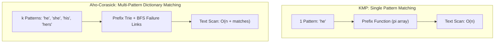
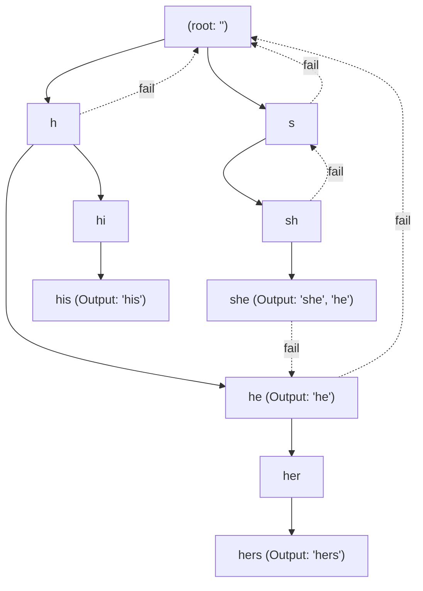
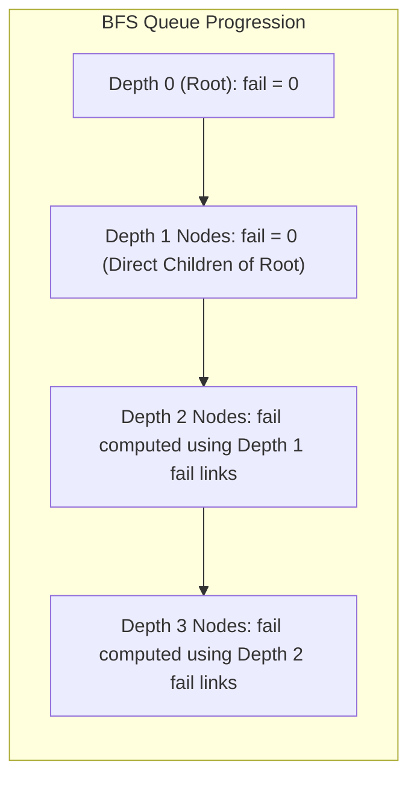

# Aho-Corasick

> [!NOTE]
> **Dictionary Matching (Multi-Pattern String Matching)** locates all occurrences of an entire dictionary of patterns $\{P_1, P_2, \dots, P_k\}$ inside a text $T$ of length $n$.
> While running KMP independently for each pattern costs $O(k \cdot n + \sum m_i)$ time, the **Aho-Corasick** algorithm unifies the patterns into a single finite-state machine:
> - **Prefix Trie:** Consolidates common prefixes of all dictionary patterns into a tree of size $O(\sum m_i)$.
> - **BFS Failure Links (Suffix Links):** Generalizes KMP's prefix function fallback to branch across trie states, pointing to the longest proper suffix that forms a valid trie prefix.
> - **Output Links & Propagation:** Instantly reveals nested and overlapping pattern occurrences.
> - **Total Running Time:** $O(n + \sum m_i + \text{matches})$ worst-case time, scanning the text without character backtracking.
>
> Reference implementations: [C++17 Implementation](../../implementations/cpp/aho_corasick.cpp) | [Python Implementation](../../implementations/python/aho_corasick.py)

> [!TIP]
> **The Three Link Types of Aho-Corasick:**
>
> | Link Type | Origin $\to$ Destination | Traversal Trigger | Algorithmic Purpose | Construction Mechanism |
> |---|---|---|---|---|
> | **Trie Edge** | Node $u \to$ Child $v$ via char $c$ | Forward character match | Spells prefix strings of dictionary words | Trie insertion ($O(\sum m_i)$) |
> | **Failure Link** | Node $u \to$ State $\text{fail}[u]$ | Mismatch fallback | Longest proper suffix of $s(u)$ in trie | BFS level-order queue |
> | **Dictionary Link** | Node $u \to$ State $\text{dict}[u]$ | Match output traversal | Jumps to nearest terminal node in failure chain | BFS propagation ($O(1)$ per node) |

> [!WARNING]
> **Critical Implementation Traps & Invariants:**
> 1. **Output Propagation Mandate:** An internal trie node may not be a pattern terminal itself, but its suffix may match a shorter dictionary pattern (e.g., node `she` contains pattern `he` as a suffix). Failing to propagate outputs from `fail[v]` causes nested occurrences to be completely missed.
> 2. **Strict BFS Order:** Failure links for depth $d$ depend on failure links of depth $< d$. Building failure links with DFS or pre-order traversal will cause invalid uninitialized link references.
> 3. **Alphabet Density vs. Memory:** A full transition table `next[u][26]` yields $O(1)$ transition steps per character, which is optimal for small alphabets. For large or Unicode alphabets, use sparse dictionary transitions to prevent quadratic node memory inflation.
> 4. **Output Size Accounting:** The search time includes $+\ \text{matches}$. In worst-case degenerate texts with quadratic overlapping matches (e.g. $P = \{\text{"a"}, \text{"aa"}, \text{"aaa"}\}$, $T = \text{"aaaa...aaa"}$), output enumeration naturally takes $\Omega(n^2)$ time.

Exact string matching becomes more complex when we are not searching for just one pattern, but for an entire dictionary of patterns.

Examples include:

- detecting many keywords in a document
- scanning DNA for many motifs
- filtering messages against many blocked phrases
- intrusion detection using many signatures
- token matching in compilers or search tools

A naive approach is to search for each pattern separately.

If there are many patterns, that can be too slow.

The **Aho-Corasick** algorithm solves this problem by combining:

- a **trie** of all patterns
- **failure links** similar in spirit to KMP fallback links
- **output reporting** for matched dictionary words

This gives a powerful multi-pattern matching algorithm with total time:

$$
O(n + \sum m_i + \text{matches})
$$

where:

- $ n $ is the text length
- $ \sum m_i $ is the total length of all patterns
- `matches` is the number of reported occurrences

This chapter develops:

- trie structure for a pattern dictionary
- failure links built by BFS
- output links and match reporting
- linear-time scanning of the text
- the connection from KMP to Aho-Corasick
- practical implementations and applications

---

## 1. From one pattern to many patterns




In KMP, we preprocess one pattern and scan the text in linear time.

But what if we have many patterns?

For example:

```text
he
she
his
hers
```

We want to find every occurrence of every pattern inside one text.

Running KMP once per pattern is possible, but it repeats work.

Aho-Corasick shares structure across the patterns by storing them together in a trie.

---

## 2. The dictionary matching problem

### Input
- a text $ T $
- a set of patterns $ P_1, P_2, \dots, P_k $

### Goal
Report every position where any pattern ends or begins in the text.

This is called **dictionary matching** or **multi-pattern matching**.

The challenge is to process all patterns together efficiently.

---

## 3. Trie foundation

A **trie** is a rooted tree where edges are labeled by characters.

Each root-to-node path spells a prefix of one or more inserted strings.

If a node is marked terminal, then the root-to-node path is a complete stored word.

This makes tries natural for storing many patterns with shared prefixes.

---

## 4. Example trie intuition

If our patterns are:

```text
he
her
hers
his
```

then the trie shares the prefix `h` and then branches when needed.

This avoids storing common prefixes repeatedly.

That shared-prefix structure is the first reason Aho-Corasick is efficient.

---

## 5. Trie node contents

A typical trie node stores:

- transitions by character
- whether the node ends a pattern
- the IDs or lengths of patterns ending there

Aho-Corasick adds two more important pieces of information:

- a **failure link**
- output-related information

These extra links are what turn a trie into a fast matching automaton.

---

## 6. Why a plain trie is not enough

Suppose we scan text character by character while walking through the trie.

When the next character is not a trie child of the current node, what should we do?

A plain trie does not tell us how to continue efficiently.

We could restart from the root, but that may waste work.

This is exactly the same kind of issue KMP solved for one pattern.

So we need a multi-pattern version of fallback.

---

## 7. Failure links




A **failure link** of a trie node points to the node representing the longest proper suffix of the current node's string that is also a trie prefix.

This is the direct analogue of KMP's fallback through prefix-function values.

If a transition fails at the current node, we follow the failure link and try again.

That is the core Aho-Corasick idea.

---

## 8. KMP analogy

In KMP:

- state = how many characters of one pattern are matched
- fallback = prefix-function link

In Aho-Corasick:

- state = current trie node
- fallback = failure link to another trie node

So Aho-Corasick can be understood as:

> KMP generalized from one pattern to a whole trie of patterns

This connection is very important.

---

## 9. String represented by a node

Each trie node corresponds to one prefix string: the labels on the path from the root to that node.

If node $ v $ spells string $ s(v) $, then its failure link points to the node spelling the longest proper suffix of $ s(v) $ that also appears as a trie prefix.

This gives a precise meaning to failure links.

---

## 10. Terminal nodes and pattern outputs

Some nodes correspond to complete patterns.

For example, if the pattern `he` is inserted, then the node reached by path `h → e` is terminal.

During matching, when we arrive at a terminal node, we have found an occurrence ending at the current text position.

But there is an important extra detail:

> a node may imply multiple matched patterns

because one matched suffix may contain smaller dictionary words as suffixes too.

That is why output links matter.

---

## 11. Output reporting idea

Suppose our patterns include:

```text
he
she
```

When we match `she`, we also want to report `he` at the same ending position, because `he` is a suffix of `she`.

So from one matched node, we may need to follow links to other terminal nodes.

Aho-Corasick supports this using either:

- explicit output lists propagated through failure links
- or dictionary/output links that jump to the next terminal suffix

Both approaches are common.

---

## 12. Building the trie

The first step is simple:

1. start at the root
2. for each pattern, follow or create trie edges character by character
3. at the end node, record that this pattern ends there

This takes time proportional to the total pattern length:

$$
O\left(\sum m_i\right)
$$

---

## 13. Why BFS is used for failure links




Failure links depend on shorter-prefix information.

So we build them in **breadth-first order**:

- root first
- then depth 1 nodes
- then depth 2 nodes
- and so on

This ensures that when we compute the failure link for a node, the failure information of shallower nodes is already known.

This is exactly the right dependency order.

---

## 14. Root and depth-1 failure links

The root's failure link is usually the root itself.

For every child of the root:

- its failure link is also the root

Why?

Because a one-character prefix has no nonempty proper suffix that is also a trie prefix other than possibly the root's empty string state.

These are the base cases.

---

## 15. Failure-link recurrence

Suppose node $ u $ has a child $ v $ by character $ c $.

To compute `fail[v]`:

1. start from `fail[u]`
2. while that node has no transition by $ c $, keep following failure links
3. if a transition by $ c $ exists, take it
4. otherwise use the root

This mirrors KMP's repeated fallback until extension becomes possible.

---

## 16. Why the recurrence is correct

Node $ v $ represents the string:

$$
s(u) + c
$$

We want the longest proper suffix of that string that is also a trie prefix.

Any such suffix must come from a suffix of $ s(u) $, which is exactly what the failure-link chain enumerates.

Once we find a node that can extend by character $ c $, we have found the longest valid suffix-prefix state.

That is the same logic as KMP fallback.

---

## 17. Output links and terminal propagation

After computing `fail[v]`, we also need to know whether matching at $ v $ should report patterns ending at suffix states.

A common method is:

- each node stores a list of pattern IDs ending exactly there
- when building failure links, append the outputs from `fail[v]` into `v`

Then during scanning, reaching node $ v $ lets us report every matched pattern immediately from `output[v]`.

This is simple and practical.

An alternative is to store a separate **output link** to the next terminal state in the failure chain.

---

## 18. Output-link viewpoint

An **output link** of a node points to the nearest terminal node on its failure chain.

This lets us report matches by jumping through terminal suffix states only, instead of visiting every failure state.

This can be useful conceptually and sometimes practically.

Both designs are worth understanding.

---

## 19. BFS construction summary

The full automaton-building process is:

1. insert all patterns into the trie
2. initialize root and root-child failure links
3. perform BFS over trie nodes
4. for each edge $ u \xrightarrow{c} v $:
   - compute `fail[v]`
   - merge or link outputs through `fail[v]`

This constructs the multi-pattern matching automaton.

---

## 20. C++17 trie node structure

```cpp
#include <vector>
#include <queue>
#include <string>
#include <array>

class AhoCorasick {
private:
    static constexpr int SIGMA = 26;

    struct Node {
        std::array<int, SIGMA> next;
        int fail;
        std::vector<int> out;

        Node() : fail(0) {
            next.fill(-1);
        }
    };

    std::vector<Node> trie_;

    static int idx(char c) {
        return c - 'a';
    }

public:
    AhoCorasick() {
        trie_.push_back(Node()); // root
    }
};
```

This version assumes lowercase English letters for clarity.

---

## 21. Python trie node structure

```python
from collections import deque

class AhoCorasick:
    def __init__(self):
        self.next = []
        self.fail = []
        self.out = []

        self.next.append({})
        self.fail.append(0)
        self.out.append([])
```

This version uses dictionaries for transitions, which is flexible and clear.

---

## 22. Inserting patterns into the trie

During insertion, we walk from the root through the pattern characters.

If an edge does not exist, we create a new node.

At the final node, we record the pattern ID.

This gives each pattern a terminal state.

---

## 23. C++17 insertion

```cpp
public:
    void add_pattern(const std::string& s, int id) {
        int u = 0;
        for (char ch : s) {
            int c = idx(ch);
            if (trie_[u].next[c] == -1) {
                trie_[u].next[c] = static_cast<int>(trie_.size());
                trie_.push_back(Node());
            }
            u = trie_[u].next[c];
        }
        trie_[u].out.push_back(id);
    }
```

---

## 24. Python insertion

```python
    def add_pattern(self, s, pid):
        u = 0
        for ch in s:
            if ch not in self.next[u]:
                self.next[u][ch] = len(self.next)
                self.next.append({})
                self.fail.append(0)
                self.out.append([])
            u = self.next[u][ch]
        self.out[u].append(pid)
```

---

## 25. Building failure links with BFS

Now we compute all failure links.

For each root child:

- set failure to root
- push it into the queue

Then BFS processes nodes level by level.

For each transition $ u \xrightarrow{c} v $, compute `fail[v]` by following failure links from `fail[u]`.

---

## 26. C++17 BFS build

```cpp
public:
    void build() {
        std::queue<int> q;

        for (int c = 0; c < SIGMA; ++c) {
            int v = trie_[0].next[c];
            if (v != -1) {
                trie_[v].fail = 0;
                q.push(v);
            } else {
                trie_[0].next[c] = 0;
            }
        }

        while (!q.empty()) {
            int u = q.front();
            q.pop();

            for (int c = 0; c < SIGMA; ++c) {
                int v = trie_[u].next[c];
                if (v != -1) {
                    trie_[v].fail = trie_[trie_[u].fail].next[c];

                    for (int id : trie_[trie_[v].fail].out) {
                        trie_[v].out.push_back(id);
                    }

                    q.push(v);
                } else {
                    trie_[u].next[c] = trie_[trie_[u].fail].next[c];
                }
            }
        }
    }
```

This version builds a full goto automaton by filling missing transitions.

---

## 27. Python BFS build

```python
    def build(self):
        q = deque()

        for ch, v in self.next[0].items():
            self.fail[v] = 0
            q.append(v)

        while q:
            u = q.popleft()

            for ch, v in self.next[u].items():
                f = self.fail[u]
                while f > 0 and ch not in self.next[f]:
                    f = self.fail[f]

                if ch in self.next[f]:
                    self.fail[v] = self.next[f][ch]
                else:
                    self.fail[v] = 0

                self.out[v].extend(self.out[self.fail[v]])
                q.append(v)
```

This version keeps sparse transitions and uses fallback during scanning.

---

## 28. Full goto table versus sparse transitions

There are two common engineering styles:

### Full goto table
- every missing transition is filled in advance
- matching becomes very fast
- more memory

### Sparse transitions
- store only existing trie edges
- matching follows failure links on demand
- less memory, slightly more transition logic

Both are valid.
The best choice depends on alphabet size and memory constraints.

---

## 29. Matching scan over the text

Once the automaton is built, we scan the text character by character.

Let `state` be the current automaton node.

For each character $ c $:

- while the transition by $ c $ does not exist, follow failure links
- if it exists, take it
- otherwise stay at root
- report every pattern in `out[state]`

This processes the text in overall linear time, plus output reporting cost.

---

## 30. Why the text scan is linear

The scan is linear for the same amortized reason as KMP:

- text index only moves forward
- failure transitions move through already-built suffix structure
- total fallback work is bounded linearly over the scan

So the total search cost is:

$$
O(n + \text{matches})
$$

after preprocessing.

---

## 31. C++17 matching function

```cpp
public:
    std::vector<std::pair<int, int>> search(
        const std::string& text,
        const std::vector<int>& pattern_lengths) const {

        std::vector<std::pair<int, int>> matches;
        int state = 0;

        for (int i = 0; i < static_cast<int>(text.size()); ++i) {
            int c = idx(text[i]);
            state = trie_[state].next[c];

            for (int id : trie_[state].out) {
                int start = i - pattern_lengths[id] + 1;
                matches.push_back({start, id});
            }
        }

        return matches;
    }
```

This assumes lowercase input and a full transition table already built.

---

## 32. Python matching function

```python
    def search(self, text, pattern_lengths):
        matches = []
        state = 0

        for i, ch in enumerate(text):
            while state > 0 and ch not in self.next[state]:
                state = self.fail[state]

            if ch in self.next[state]:
                state = self.next[state][ch]
            else:
                state = 0

            for pid in self.out[state]:
                start = i - pattern_lengths[pid] + 1
                matches.append((start, pid))

        return matches
```

---

## 33. Worked example intuition

Suppose patterns are:

```text
he
she
his
hers
```

and text is:

```text
ushers
```

As the scan proceeds:

- the trie follows current prefix matches
- failure links allow fallback without restarting completely
- output lists report all matched words ending at each position

So when the automaton reaches the node for `she`, it can also report `he` if that suffix is part of the output structure.

This is a good example of overlapping dictionary matches.

---

## 34. Output size matters in complexity

The algorithm reports all matches, so output time must include the number of reported matches.

That is why the standard complexity is written as:

$$
O(n + \sum m_i + \text{matches})
$$

If there are many actual matches, reporting them necessarily takes time.

This is an important and honest complexity statement.

---

## 35. Application: genomics

In genomics, we often want to search for many short DNA motifs inside a long sequence.

Examples include:

- finding known patterns in a genome
- locating many marker sequences
- scanning reads against many probes

Aho-Corasick is a natural fit because many motifs can be processed together in one pass over the sequence.

---

## 36. Application: intrusion detection

Network intrusion systems often maintain a large signature dictionary.

Incoming traffic can be scanned against that dictionary using multi-pattern matching.

Aho-Corasick is a classic core technique here because it supports:

- many patterns
- fast scanning
- exact signature detection

This is one of its most famous practical uses.

---

## 37. Application: text filtering and keyword detection

Aho-Corasick is also useful in:

- profanity filters
- banned phrase detection
- search indexing
- multi-keyword highlighting
- lexing and token spotting

Whenever many exact patterns must be detected simultaneously, the algorithm is a strong candidate.

---

## 38. Relationship to tries and automata

Aho-Corasick can be understood in three equivalent ways:

### Trie view
Store all patterns with shared prefixes.

### Failure-link view
Use suffix-based fallback like KMP.

### Automaton view
Run a finite-state machine over the text.

These viewpoints reinforce each other.

For implementation, trie plus failure links is often easiest.
For theory, automaton language is often very helpful.

---

## 39. Dictionary suffixes and nested matches

Patterns may nest inside each other.

Example:

```text
a
aa
aaa
```

In text `aaaa`, many matches overlap heavily.

Aho-Corasick handles this naturally because output propagation through failure links ensures that when the longest matching node is reached, all shorter suffix patterns ending there can also be reported.

This is one of the algorithm's strengths.

---

## 40. Common mistakes

### Mistake 1: forgetting output propagation
If outputs from failure states are not included, suffix patterns may be missed.

### Mistake 2: computing failure links in the wrong order
BFS is needed so shallower failure information is already available.

### Mistake 3: mishandling the root
Root transitions and root failure behavior need explicit base-case treatment.

### Mistake 4: assuming only one pattern can end at a node
A node may correspond to multiple matched patterns through suffix relationships.

### Mistake 5: ignoring alphabet engineering
Dense transition tables work well for small alphabets, but may waste memory on large alphabets.

### Mistake 6: forgetting output-size complexity
If the text contains many matches, reporting them takes real time.

---

## 41. Complexity summary

Let:

- $ n $ = text length
- $ k $ = number of patterns
- $ \sum m_i $ = total pattern length
- $ \Sigma $ = alphabet size

### Trie construction
$$
O\left(\sum m_i\right)
$$

### Failure-link construction
Typically:

- $ O(\text{number of trie nodes} \cdot \Sigma) $ for dense goto-table builds
- or near-linear in trie edges for sparse builds

### Matching
$$
O(n + \text{matches})
$$

So the standard overall statement is:

$$
O(n + \sum m_i + \text{matches})
$$

for fixed or well-managed alphabets.

---

## 42. Correctness intuition summary

The trie represents all pattern prefixes.

The failure link of a node points to the longest suffix state that could still match after a mismatch.

So during scanning:

- no possible match is lost
- no text position must be rescanned
- every time we enter a state, all patterns ending at that state or its terminal suffixes are reported

This is exactly the multi-pattern analogue of KMP's fallback logic.

---

## 43. Comparison with KMP

| Feature | KMP | Aho-Corasick |
|---|---|---|
| Number of patterns | one | many |
| Core structure | prefix function | trie + failure links |
| Fallback meaning | longest proper prefix-suffix | longest suffix that is a trie prefix |
| Matching time | $ O(n + m) $ | $ O(n + \sum m_i + \text{matches}) $ |
| Main use | single exact pattern | dictionary matching |

This comparison helps place Aho-Corasick in the bigger string-algorithm landscape.

---

## 44. Summary

Aho-Corasick extends KMP's failure-link idea from one pattern to a whole dictionary of patterns.

It works by combining:

- a trie of pattern prefixes
- failure links for suffix fallback
- output reporting for terminal matches

This allows all patterns to be searched simultaneously in essentially linear time in the text, plus preprocessing and reporting costs.

The most important ideas are:

- shared-prefix storage with tries
- BFS construction of failure links
- suffix-style fallback without text backtracking
- output propagation to report nested and overlapping matches

Aho-Corasick is one of the central algorithms in multi-pattern string matching.

---

## 45. Practice prompts

1. Why is running KMP separately for many patterns inefficient?
2. What does a trie store in the context of pattern dictionaries?
3. What does the failure link of a node represent?
4. Why is Aho-Corasick a generalization of KMP?
5. Why are failure links built with BFS?
6. Why can one automaton state report multiple pattern matches?
7. What is the role of output propagation or output links?
8. Why does the matching scan not backtrack in the text?
9. Why does the complexity include the number of matches?
10. When would sparse transitions be better than a full goto table?

---

## 46. Suggested next topics

A natural continuation after Aho-Corasick is:

- suffix arrays and LCP
- suffix automata
- Z-function
- rolling hash
- finite automata for lexical analysis
