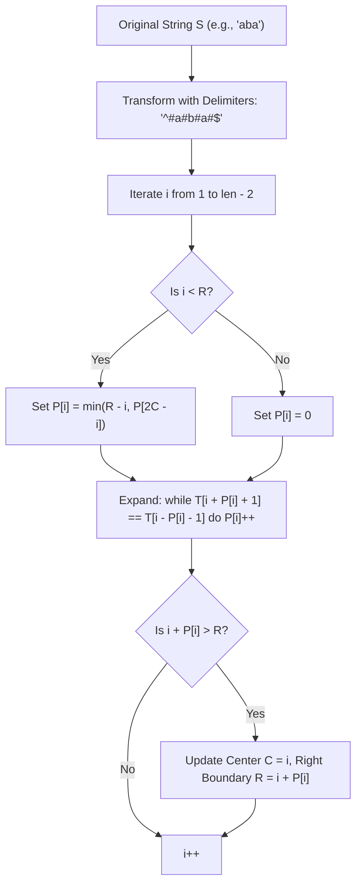
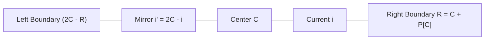

# Manacher's Algorithm

> [!NOTE]
> **Linear-Time Universal Palindrome Decomposition:**
> Finding the longest palindromic substring or counting all palindromic substrings naively takes $O(n^2)$ time by expanding around all $2n - 1$ potential centers.
> **Manacher's Algorithm (1975)** computes the maximal palindrome radius centered at *every* position in a string of length $n$ in strictly **$\mathbf{O(n)}$ time and $\mathbf{O(n)}$ space**.

> [!TIP]
> **The Sentinel Transformation Trick:**
> Handling odd-length palindromes (e.g., `"aba"`) and even-length palindromes (e.g., `"abba"`) with separate logic doubles edge-case complexity.
> Manacher unifies them by interleaving a dummy delimiter character (such as `#`) between every adjacent pair of characters, bookended by distinct terminal sentinels:
> $$\text{"abba"} \implies \text{"^#a#b#b#a#$"}$$
> In this transformed string $T$ of length $2n + 3$:
> 1. **Every palindrome has odd length** centered at a specific index.
> 2. The palindrome radius $P[i]$ in $T$ **equals the exact length** of the corresponding palindrome in original string $S$.
> 3. The starting index in $S$ is $\frac{i - P[i]}{2}$.

> [!WARNING]
> **Bookend Sentinels Prevent Out-of-Bounds Checks:**
> Always prepend a unique character like `^` and append `$` (or any characters that never appear in $S$ and differ from `#`). These sentinels guarantee that the expansion loop `while (T[i + P[i] + 1] == T[i - P[i] - 1])` automatically terminates at the string boundaries without requiring explicit boundary checks `i - P[i] >= 0 && i + P[i] < len`.

---

## 1. Algorithmic Mechanics: The Reflection Invariant

Let $T$ be the transformed string. We compute array $P$, where $P[i]$ is the radius of the longest palindrome centered at $i$.

We maintain two pointers throughout execution:
- $C$: The center of the palindrome that currently reaches the rightmost position.
- $R$: The rightmost boundary reached by this palindrome ($R = C + P[C]$).

For the current index $i$:
Let $i' = 2C - i$ be the **mirror reflection** of $i$ across center $C$.

### The Three Cases of Reflection Symmetry:
1. **Case 1: $P[i'] < R - i$ (Contained Strictly Inside):**
   The palindrome centered at $i'$ is completely contained within the larger palindrome centered at $C$.
   By exact symmetry across $C$, the palindrome at $i$ is also strictly contained:
   $$P[i] = P[i']$$
   No character comparisons are needed!

2. **Case 2: $P[i'] > R - i$ (Extends Beyond Left Boundary):**
   The palindrome at $i'$ extends beyond $C$'s left boundary ($2C - R$).
   Symmetry is only guaranteed up to $R - i$. Beyond $R$, characters cannot match (otherwise $C$'s palindrome would have extended further to the right):
   $$P[i] = R - i$$

3. **Case 3: $P[i'] == R - i$ (Reaches Exactly the Boundary):**
   The palindrome at $i$ reaches at least to $R$. It may extend further into unexplored territory.
   Initialize $P[i] = R - i$ and continue comparing characters outward. If it expands, update $C = i$ and $R = i + P[i]$.

---

## 2. Step-by-Step Worked Trace

Consider string $S = \text{"abacaba"}$.
Transformed string: $T = \text{"^#a#b#a#c#a#b#a#$"}$

| Index $i$ | $T[i]$ | $i'$ | Initial $P[i]$ | Final $P[i]$ | Meaning in $S$ | Center $C$ | Boundary $R$ |
| :---: | :---: | :---: | :---: | :---: | :--- | :---: | :---: |
| 0 | `^` | - | 0 | 0 | Sentinel | 0 | 0 |
| 1 | `#` | - | 0 | 0 | Even center | 0 | 0 |
| 2 | `a` | - | 0 | 1 | Palindrome `"a"` | 2 | 3 |
| 3 | `#` | - | 0 | 0 | Even center | 2 | 3 |
| 4 | `b` | - | 0 | 3 | Palindrome `"aba"` | 4 | 7 |
| 5 | `#` | 3 | 0 | 0 | Mirrored from $i'=3$ | 4 | 7 |
| 6 | `a` | 2 | 1 | 1 | Mirrored from $i'=2$ | 4 | 7 |
| 7 | `#` | 1 | 0 | 0 | Mirrored from $i'=1$ | 4 | 7 |
| 8 | `c` | - | 0 | 7 | Palindrome `"abacaba"` | 8 | 15 |

At index $8$ (`'c'`), $P[8] = 7$.
Maximum length $= 7$.
Start index in $S = (8 - 7) / 2 = 0$.
Longest palindromic substring is `"abacaba"`.

---

## 3. Amortized Linear Time Complexity Proof

Why is Manacher's algorithm strictly $O(n)$ despite having a nested `while` loop?

1. In each iteration, if $i < R$, $P[i]$ is initialized in $O(1)$ time to $\min(R - i, P[i'])$.
2. The `while` loop executes only when expanding beyond $R$.
3. Every successful character comparison in the `while` loop strictly increments $R$ by at least $1$ ($R = i + P[i]$).
4. Since $R$ begins at $0$ and cannot exceed $2n + 2$, the `while` loop condition can evaluate to `true` at most $2n + 2$ times across the entire execution.
5. Every unsuccessful character comparison terminates the `while` loop for that index $i$ (at most $1$ failure per index, contributing at most $2n + 1$ failed checks).
$$\text{Total Character Comparisons} \le (2n + 2) + (2n + 1) = 4n + 3 = \mathbf{O(n)}$$

---

## 4. Complexity Analysis Matrix

| Metric | Manacher's Algorithm | Expand Around Center | Suffix Automaton / LCP | Dynamic Programming |
| :--- | :---: | :---: | :---: | :---: |
| **Time Complexity** | $\mathbf{O(n)}$ | $O(n^2)$ | $O(n)$ | $O(n^2)$ |
| **Auxiliary Space** | $O(n)$ | $O(1)$ | $O(n \cdot |\Sigma|)$ | $O(n^2)$ or $O(n)$ |
| **Handles Even/Odd** | Unified via `#` | Dual branching | Unified | Dual branching |
| **Implementation Complexity** | ~30 lines | ~20 lines | ~150 lines | ~25 lines |

---

## 5. Common Pitfalls & Anti-Patterns

### Anti-Pattern 1: Omitting Distinct Boundary Sentinels
Using `#` as the boundary sentinel (e.g., `"#a#b#"` instead of `"^#a#b#$"`) causes buffer overrun when expanding from the boundary: `T[-1]` is accessed, leading to undefined behavior or segmentation faults.

### Anti-Pattern 2: Allocating New Substrings During Expansion
Extracting substrings with `s.substr()` inside the expansion loop turns an $O(n)$ algorithm into $O(n^2)$ or $O(n^3)$ due to string copying. Only compare characters by index (`T[i + P[i] + 1] == T[i - P[i] - 1]`).

---

## 6. Curated References & Related Problems

1. **Glenn Manacher (1975):** *A New Linear-Time "On-Line" Algorithm for Finding the Smallest Initial Palindrome of a String* (Journal of the ACM).
2. **LeetCode 5:** *Longest Palindromic Substring* (The canonical application).
3. **LeetCode 647:** *Palindromic Substrings* (Total count $=\sum \lceil P[i]/2 \rceil$).
4. **Codeforces 1326D2:** *Prefix-Suffix Palindrome (Hard version)*.
5. **SPOJ LPS:** *Longest Palindromic Substring*.
