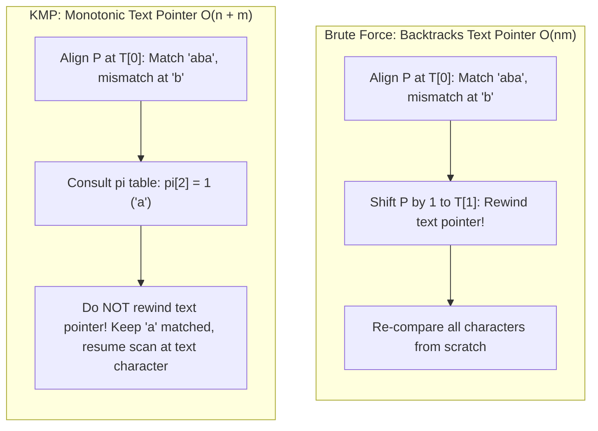
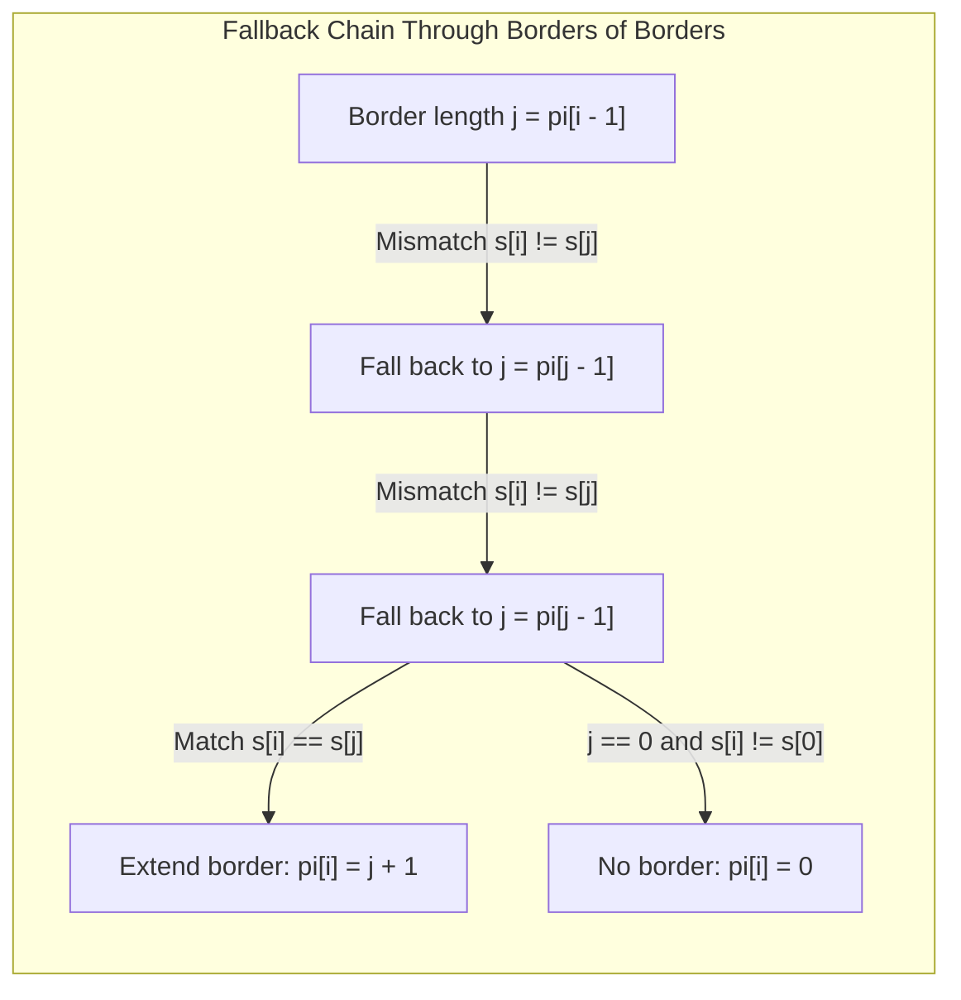
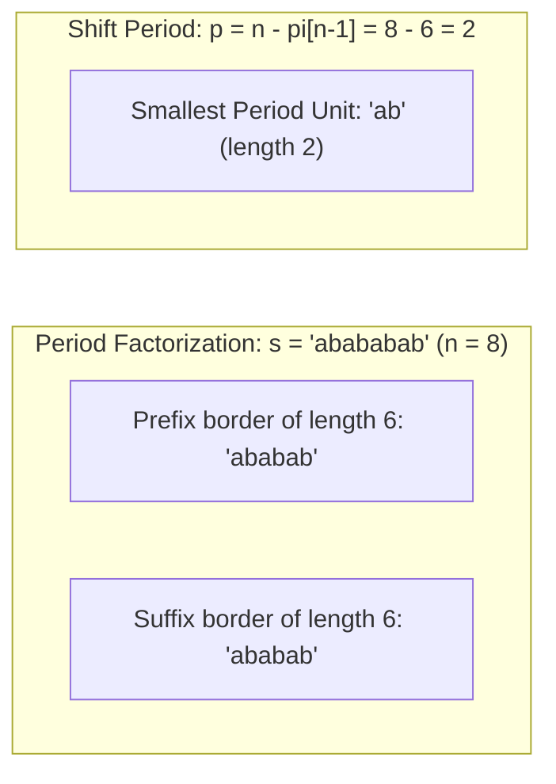
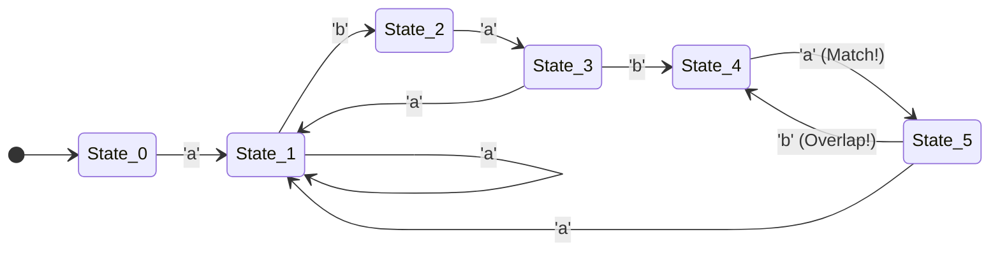

# Prefix Function and KMP

> [!NOTE]
> **Exact String Matching** seeks all occurrences of a pattern $P$ of length $m$ inside a text $T$ of length $n$.
> While brute-force scanning wastes time rechecking previously matched characters ($O(nm)$ worst-case), the **Prefix Function** ($\pi$) and **Knuth-Morris-Pratt (KMP)** algorithm exploit the pattern's internal self-overlap:
> - **Prefix Function ($\pi$ Table):** Computes the longest proper prefix of $P[0..i]$ that is also a suffix of $P[0..i]$ in $O(m)$ amortized time.
> - **Strictly Linear Text Scan:** Advances the text pointer $i$ monotonically from $0$ to $n-1$ without character backtracking, executing search in $O(n)$ time.
> - **Total Guaranteed Bound:** $O(n + m)$ worst-case time complexity, even on adversarial inputs with highly repetitive alphabets (e.g., $P = \text{"aaa"b}$, $T = \text{"aaaa...aaa"}$).
>
> Reference implementations: [C++17 Implementation](../../implementations/cpp/prefix_function_and_kmp.cpp) | [Python Implementation](../../implementations/python/prefix_function_and_kmp.py)

> [!TIP]
> **Exact String Matching Strategy Matrix:**
>
> | Algorithm | Preprocessing Time | Search Time | Auxiliary Space | Core Mechanism | Best Production Use Case |
> |---|---|---|---|---|---|
> | **Brute Force** | $O(1)$ | $O(n \cdot m)$ | $O(1)$ | Direct character comparison | Short text/pattern ($m \le 16$, small cache-friendly checks) |
> | **KMP** | $O(m)$ | **$O(n)$** | $O(m)$ | $\pi$ table (border failure links) | Streaming text, single pattern, hard real-time guarantees |
> | **Z-Algorithm** | $O(m)$ | **$O(n)$** | $O(m)$ | $Z$-box prefix matching | Pattern matching, string compression, prefix palindromes |
> | **Rabin-Karp** | $O(m)$ | $O(n + m)$ avg ($O(nm)$ worst) | $O(1)$ | Polynomial rolling hash | Multi-pattern of equal length, 2D grid matching |
> | **Aho-Corasick** | $O(\sum m_k \cdot |\Sigma|)$ | $O(n + \text{matches})$ | $O(\sum m_k \cdot |\Sigma|)$ | Trie + KMP failure transitions | Multi-pattern dictionary search (e.g., keyword filtering) |

> [!WARNING]
> **Cardinal Invariants & Implementation Traps:**
> 1. **Proper Border Invariant:** $\pi[i]$ is strictly the length of a **proper** prefix (length $< i + 1$). The whole substring $s[0..i]$ is NEVER its own proper border, so $\pi[0] = 0$ always.
> 2. **Fallback Indirection ($j = \pi[j-1]$):** On a character mismatch at pattern index $j$, the next candidate border length is $\pi[j-1]$, NOT $\pi[j]$. $j$ represents the count of currently matched characters, so the final matched character is at index $j-1$.
> 3. **Non-Backtracking Guarantee:** The text index $i$ in KMP strictly increments: $i = 0, 1, \dots, n-1$. It NEVER decrements. All state adjustments occur exclusively on the pattern pointer $j$.
> 4. **Overlapping Matches:** After reporting a full match ending at text position $i$, do NOT reset $j$ to $0$. Set $j = \pi[m-1]$ to capture potential overlapping occurrences (e.g. matching `"aaa"` in `"aaaaa"`).

String matching is one of the most important problems in algorithms.

Given:

- a **text** $ T $ of length $ n $
- a **pattern** $ P $ of length $ m $

we want to find all positions where $ P $ occurs in $ T $.

The most direct method compares the pattern at every possible starting position, but that can take:

$$
O(nm)
$$

time in the worst case.

The key question is:

> Can we avoid rechecking characters that we already know match?

The answer is yes.

The **prefix function** captures internal self-overlap structure inside a string, and the **Knuth-Morris-Pratt** algorithm uses that structure to perform exact string matching in:

$$
O(n + m)
$$

time.

This chapter develops:

- the exact string matching problem
- the prefix function $ \pi $
- linear-time computation of $ \pi $
- the KMP matching scan
- why KMP never backtracks in the text
- applications of the prefix function
- practical C++17 and Python implementations

---

## 1. The exact string matching problem

Given text $ T $ and pattern $ P $, find every index $ i $ such that:

$$
T[i \dots i + m - 1] = P[0 \dots m - 1]
$$

This is called **exact string matching**.

We are not looking for approximate similarity here.
We want exact occurrences of the full pattern.

---

## 2. Brute-force matching




The simplest method is:

1. try every alignment of $ P $ against $ T $
2. compare characters left to right
3. if all $ m $ characters match, report an occurrence

There are $ n - m + 1 $ possible alignments, and each may compare up to $ m $ characters.

So the worst-case complexity is:

$$
O(nm)
$$

---

## 3. Why brute force repeats work

Consider a mismatch after several matched characters.

Brute force often shifts the pattern by one position and starts comparing again from the beginning.

That can repeat many character comparisons that we already effectively learned from previous matches.

KMP avoids this waste by using the pattern's internal structure.

---

## 4. Prefixes and suffixes

To understand KMP, we first need two terms.

### Prefix
A prefix of a string is a beginning segment.

For example, prefixes of `ababa` include:

- `a`
- `ab`
- `aba`
- `abab`
- `ababa`

### Suffix
A suffix of a string is an ending segment.

Suffixes of `ababa` include:

- `a`
- `ba`
- `aba`
- `baba`
- `ababa`

---

## 5. Proper prefix and proper suffix

A **proper prefix** is a prefix that is not the whole string.

A **proper suffix** is a suffix that is not the whole string.

For example, for `ababa`:

- proper prefixes include `a`, `ab`, `aba`, `abab`
- proper suffixes include `a`, `ba`, `aba`, `baba`

This matters because the prefix function uses **proper** prefixes.

---

## 6. Definition of the prefix function

For a string $ s $, the prefix function $ \pi[i] $ is:

> the length of the longest proper prefix of $ s[0 \dots i] $ that is also a suffix of $ s[0 \dots i] $

In symbols:

$$
\pi[i] = \max \{ \ell \mid \ell < i+1,\ s[0 \dots \ell-1] = s[i-\ell+1 \dots i] \}
$$

If no such nonempty prefix exists, then:

$$
\pi[i] = 0
$$

---

## 7. Example of the prefix function

Take:

```text
s = a b a b a
    0 1 2 3 4
```

Then:

- $ \pi[0] = 0 $
- $ \pi[1] = 0 $
- $ \pi[2] = 1 $ because `a` is both prefix and suffix of `aba`
- $ \pi[3] = 2 $ because `ab` is both prefix and suffix of `abab`
- $ \pi[4] = 3 $ because `aba` is both prefix and suffix of `ababa`

So:

```text
pi = [0, 0, 1, 2, 3]
```

---

## 8. Why the prefix function matters

The prefix function tells us how much matched structure we can keep after a mismatch.

If a prefix of the pattern is also a suffix of what we have already matched, then we do not need to restart from zero.

We can continue from that smaller matched prefix.

This is exactly the idea KMP uses.

---

## 9. Border terminology

A string that is both a prefix and a suffix is often called a **border**.

So $ \pi[i] $ is the length of the longest proper border of $ s[0 \dots i] $.

This term is common in string algorithm literature.

You do not need the word to use the method, but it is useful vocabulary.

---

## 10. A naive way to compute $ \pi $

For each position $ i $, we could try every possible border length and check whether the prefix and suffix match.

That would be too slow.

In the worst case, it can take:

$$
O(m^2)
$$

time for a pattern of length $ m $.

The important achievement is to compute $ \pi $ in linear time.

---

## 11. The key recurrence idea




Suppose we already know $ \pi[i-1] $.

Let:

$$
j = \pi[i-1]
$$

This means the prefix of length $ j $ matches the suffix ending at position $ i-1 $.

Now we want to extend this to position $ i $.

### If $ s[i] = s[j] $
Then the border grows by one:

$$
\pi[i] = j + 1
$$

### If $ s[i] \ne s[j] $
Then the current border cannot continue.
We fall back to a smaller border, namely:

$$
j = \pi[j-1]
$$

and try again.

This fallback chain is the heart of the algorithm.

---

## 12. Why fallback uses $ \pi[j-1] $

If a border of length $ j $ fails to extend, then the next possible candidate must be a border of that border.

In other words, we ask:

> what is the longest proper prefix that is also a suffix of the already matched prefix of length $ j $?

That value is exactly:

$$
\pi[j-1]
$$

So the algorithm follows a chain of smaller and smaller valid border lengths.

---

## 13. Linear-time prefix function algorithm

The standard algorithm is:

1. initialize $ \pi[0] = 0 $
2. for each $ i $ from 1 to $ m-1 $:
   - start with $ j = \pi[i-1] $
   - while $ j > 0 $ and $ s[i] \ne s[j] $, set $ j = \pi[j-1] $
   - if $ s[i] = s[j] $, increment $ j $
   - set $ \pi[i] = j $

This computes the full prefix function in:

$$
O(m)
$$

time.

---

## 14. C++17 prefix function implementation

```cpp
#include <vector>
#include <string>

std::vector<int> prefix_function(const std::string& s) {
    int n = static_cast<int>(s.size());
    std::vector<int> pi(n, 0);

    for (int i = 1; i < n; ++i) {
        int j = pi[i - 1];

        while (j > 0 && s[i] != s[j]) {
            j = pi[j - 1];
        }

        if (s[i] == s[j]) {
            ++j;
        }

        pi[i] = j;
    }

    return pi;
}
```

---

## 15. Python prefix function implementation

```python
def prefix_function(s):
    n = len(s)
    pi = [0] * n

    for i in range(1, n):
        j = pi[i - 1]

        while j > 0 and s[i] != s[j]:
            j = pi[j - 1]

        if s[i] == s[j]:
            j += 1

        pi[i] = j

    return pi
```

---

## 16. Worked prefix-function example

Take:

```text
s = a b a b a c
    0 1 2 3 4 5
```

We compute:

- $ \pi[0] = 0 $
- $ \pi[1] = 0 $
- $ \pi[2] = 1 $
- $ \pi[3] = 2 $
- $ \pi[4] = 3 $

At $ i = 5 $, character `c` does not match `s[3] = b`, so we fall back:
- from $ j = 3 $ to $ j = \pi[2] = 1 $
- still mismatch with `s[1] = b`
- fall back to $ j = \pi[0] = 0 $
- mismatch with `s[0] = a`

So:

$$
\pi[5] = 0
$$

Final result:

```text
pi = [0, 0, 1, 2, 3, 0]
```

---

## 17. Why prefix-function computation is linear

At first glance, the `while` loop may look expensive.

But the crucial observation is:

- $ i $ only moves forward
- $ j $ only moves backward through previously computed prefix values

Each step of the fallback strictly decreases $ j $, and each successful character match increases it.

So across the whole algorithm, the total number of decreases and increases is linear.

Therefore the total running time is:

$$
O(m)
$$

This is an amortized analysis.

---

## 18. Amortization proof sketch

During the full scan:

- $ i $ increases exactly $ m - 1 $ times
- $ j $ never becomes negative
- each iteration of the inner `while` strictly decreases $ j $
- each successful match increases $ j $ by 1

Since $ j $ cannot increase more times than it decreases by more than a linear amount overall, the total work is linear.

This is the standard amortized proof idea.

---

## 19. From prefix function to KMP

Now we use the same fallback idea during text scanning.

Suppose we are matching pattern $ P $ against text $ T $, and we have already matched $ j $ characters of the pattern.

If the next text character mismatches $ P[j] $, we do not restart from $ j = 0 $ immediately.

Instead, we fall back using the prefix function:

$$
j = \pi[j-1]
$$

This preserves the longest pattern prefix that could still match.

That is the central KMP idea.

---

## 20. KMP matching invariant

During scanning, maintain:

$$
j = \text{number of pattern characters currently matched}
$$

At text position $ i $:

- while $ j > 0 $ and $ T[i] \ne P[j] $, fall back with $ j = \pi[j-1] $
- if $ T[i] = P[j] $, increment $ j $
- if $ j = m $, we found a full match ending at $ i $

Then we can report the starting position:

$$
i - m + 1
$$

and continue by falling back again to:

$$
j = \pi[m-1]
$$

to allow overlapping matches.

---

## 21. Why KMP never backtracks in the text

This is one of the most important facts.

KMP may move backward through pattern states using $ \pi $, but it never moves the text index backward.

The text is scanned once from left to right.

So all the saved work comes from reusing pattern structure rather than rescanning text positions.

This is why matching runs in:

$$
O(n)
$$

after the prefix function has been computed.

---

## 22. C++17 KMP exact matching

```cpp
#include <vector>
#include <string>

std::vector<int> kmp_search(const std::string& text, const std::string& pattern) {
    std::vector<int> matches;
    if (pattern.empty()) return matches;

    std::vector<int> pi = prefix_function(pattern);
    int n = static_cast<int>(text.size());
    int m = static_cast<int>(pattern.size());
    int j = 0;

    for (int i = 0; i < n; ++i) {
        while (j > 0 && text[i] != pattern[j]) {
            j = pi[j - 1];
        }

        if (text[i] == pattern[j]) {
            ++j;
        }

        if (j == m) {
            matches.push_back(i - m + 1);
            j = pi[j - 1];
        }
    }

    return matches;
}
```

---

## 23. Python KMP exact matching

```python
def kmp_search(text, pattern):
    if not pattern:
        return []

    pi = prefix_function(pattern)
    matches = []
    j = 0
    m = len(pattern)

    for i, ch in enumerate(text):
        while j > 0 and ch != pattern[j]:
            j = pi[j - 1]

        if ch == pattern[j]:
            j += 1

        if j == m:
            matches.append(i - m + 1)
            j = pi[j - 1]

    return matches
```

---

## 24. Complexity of KMP

The prefix function for the pattern is computed in:

$$
O(m)
$$

The text scan runs in:

$$
O(n)
$$

So the total complexity is:

$$
O(n + m)
$$

This is a major improvement over brute force in the worst case.

---

## 25. Example KMP matching

Let:

```text
text    = ababcababa
pattern = ababa
```

The prefix function of `ababa` is:

```text
[0, 0, 1, 2, 3]
```

As KMP scans the text, when a mismatch occurs after partial matching, it falls back using those prefix values instead of restarting from scratch.

This allows the algorithm to continue efficiently and still find all valid occurrences.

---

## 26. Overlapping matches

KMP naturally handles overlapping matches.

Example:

```text
text    = aaaaa
pattern = aaa
```

Matches occur at indices:

```text
0, 1, 2
```

After one match finishes, KMP does not reset all the way to zero.
It falls back to:

$$
\pi[m-1]
$$

which preserves overlap structure.

This is a very important practical advantage.

---

## 27. Alternative combined-string view

Another common presentation builds the string:

```text
pattern + # + text
```

where `#` is a separator not appearing in either string.

Then compute the prefix function on the whole combined string.

Whenever the prefix value reaches the full pattern length, a match has been found in the text part.

This is elegant and sometimes useful for proofs, though direct KMP scanning is usually more memory-efficient and operationally clearer.

---

## 28. Application: period of a string




The prefix function helps detect repetition structure.

Let $ n $ be the string length and let:

$$
L = \pi[n-1]
$$

Then the candidate smallest period length is:

$$
p = n - L
$$

If:

$$
n \bmod p = 0
$$

then the string is composed of repetitions of a block of length $ p $.

This is a classic application.

---

## 29. Example of period detection

For:

```text
s = abababab
```

we have:

- $ n = 8 $
- $ \pi[n-1] = 6 $

So:

$$
p = 8 - 6 = 2
$$

Since $ 8 \bmod 2 = 0 $, the string is built from repetitions of `ab`.

---

## 30. Application: string compression intuition

If a string has a short period, then it may be representable as repeated copies of a smaller block.

The prefix function gives a fast way to detect that repeated structure.

This is not general-purpose compression by itself, but it is very useful in problems about repetition and periodicity.

---

## 31. Application: counting occurrences of each prefix

The prefix function can also help answer:

> how many times does each prefix of the string occur as a substring?

A standard technique is:

1. count how often each $ \pi[i] $ value appears
2. propagate counts upward through prefix links
3. add 1 for the prefix itself

This is a more advanced but classical prefix-function application.

---

## 32. Prefix-link tree intuition

Each value $ \pi[i] $ can be seen as a link from position $ i $ to a smaller border length.

This forms a tree-like failure-link structure over prefix lengths.

Many aggregate computations on prefixes can be done by moving through these links.

This viewpoint becomes especially useful in advanced string processing.

---

## 33. Application: all border lengths of a string

If we want all border lengths of the whole string, we can repeatedly follow:

$$
L = \pi[n-1],\ \pi[L-1],\ \pi[\pi[L-1]-1], \dots
$$

until reaching 0.

This lists all proper prefix lengths that are also suffixes.

That is another elegant use of the prefix-function chain.

---

## 34. C++17 smallest period helper

```cpp
#include <string>
#include <vector>

int smallest_period(const std::string& s) {
    if (s.empty()) return 0;
    std::vector<int> pi = prefix_function(s);
    int n = static_cast<int>(s.size());
    int p = n - pi[n - 1];
    return (n % p == 0 ? p : n);
}
```

---

## 35. Python smallest period helper

```python
def smallest_period(s):
    if not s:
        return 0
    pi = prefix_function(s)
    n = len(s)
    p = n - pi[-1]
    return p if n % p == 0 else n
```

---

## 36. Building a KMP automaton view




KMP can also be viewed as a small automaton over pattern states.

A state $ j $ means:

- the first $ j $ characters of the pattern are currently matched

On input character $ c $:

- if $ c $ extends the match, move to $ j+1 $
- otherwise follow failure links until extension becomes possible or we return to 0

This automaton perspective is conceptually powerful, especially when connecting KMP to more advanced string automata.

---

## 37. Why the automaton view is useful

The automaton interpretation makes KMP feel less like a trick and more like a state machine.

It explains clearly that:

- $ \pi $ defines failure transitions
- successful character matches define forward transitions
- the matching process is just automaton simulation on the text

This is an important bridge to Aho-Corasick and other automaton-based algorithms.

---

## 38. Common mistakes

### Mistake 1: forgetting “proper” prefix
The whole string is not allowed as a prefix-function match.

### Mistake 2: mixing substring and prefix-suffix ideas
$ \pi[i] $ is about prefixes of `s[0..i]`, not arbitrary repeated substrings anywhere.

### Mistake 3: resetting to zero too early
On mismatch, KMP should fall back using $ \pi[j-1] $, not immediately restart unless $ j = 0 $.

### Mistake 4: mishandling empty pattern
Decide explicitly how empty-pattern matching should behave.

### Mistake 5: forgetting overlapping matches
After a full match, set:

$$
j = \pi[j-1]
$$

instead of resetting to zero blindly.

### Mistake 6: off-by-one errors in reported positions
A match ending at $ i $ starts at:

$$
i - m + 1
$$

---

## 39. Why KMP is foundational

KMP is important not only because it solves exact matching in linear time, but because it teaches several deep ideas:

- preprocessing the pattern
- fallback through structural links
- amortized linear analysis
- finite-state matching interpretation

These ideas reappear throughout advanced string algorithms.

So KMP is both useful by itself and important as conceptual preparation.

---

## 40. Comparison with brute-force matching

| Method | Idea | Worst-case time |
|---|---|---:|
| Brute force | try every alignment from scratch | $ O(nm) $ |
| Prefix function only | preprocess self-overlap of pattern | $ O(m) $ |
| KMP | prefix-function-driven text scan | $ O(n + m) $ |

This highlights the gain from reusing known structure.

---

## 41. Correctness intuition summary

### Prefix function
For each position $ i $, the fallback chain through smaller borders checks exactly the candidate border lengths that could still work.

### KMP
At every text position, the variable $ j $ represents the longest pattern prefix that matches a suffix of the text processed so far.

On mismatch, the only viable remaining candidates are the borders of that matched prefix, which are exactly encoded by the prefix function.

So the algorithm never discards a possible match and never repeats unnecessary text comparisons.

---

## 42. Complexity summary

For pattern length $ m $ and text length $ n $:

### Prefix function
- time: $ O(m) $
- space: $ O(m) $

### KMP search
- preprocessing: $ O(m) $
- text scan: $ O(n) $
- total: $ O(n + m) $

These are worst-case guarantees.

---

## 43. Summary

The prefix function $ \pi $ records, for every prefix of a string, the length of its longest proper prefix that is also a suffix.

This lets us reuse matched structure after a mismatch.

The Knuth-Morris-Pratt algorithm uses that idea to perform exact string matching in linear time:

$$
O(n + m)
$$

The most important lessons are:

- exact matching can reuse pattern self-overlap
- the prefix function can be computed in linear time
- KMP never backtracks in the text
- prefix links reveal useful repetition structure such as borders and periods

This makes prefix-function reasoning one of the central foundations of string algorithms.

---

## 44. Practice prompts

1. What is the exact string matching problem?
2. What does $ \pi[i] $ represent?
3. Why must the prefix in the prefix function be proper?
4. Why does fallback use $ \pi[j-1] $?
5. Why is prefix-function computation linear despite the inner `while` loop?
6. What does $ j $ mean during KMP scanning?
7. Why does KMP never move backward in the text?
8. How does KMP handle overlapping matches?
9. How can the prefix function help detect the period of a string?
10. Why is KMP also useful as preparation for automaton-based string algorithms?

---

## 45. Suggested next topics

A natural continuation after prefix function and KMP is:

- Z-function and string borders
- trie and Aho-Corasick
- suffix arrays and LCP
- rolling hash
- finite automata for pattern matching
