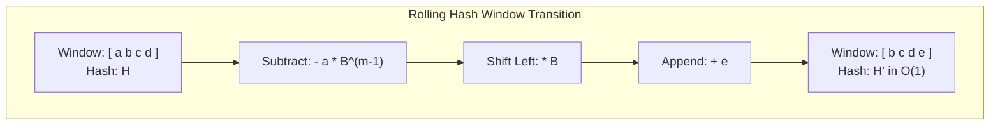

# Rabin-Karp and Rolling Hash

> [!NOTE]
> **Fingerprint-Based Pattern Matching & Fast Substring Comparisons:**
> The Rabin-Karp algorithm transforms string comparisons from costly character traversals into fast numeric equality checks using **polynomial rolling hashes**.
> - **Sliding Window Updating:** Computes the hash of an initial $m$-length window in $O(m)$, then shifts the window in guaranteed $O(1)$ time by subtracting the exiting character and appending the entering character.
> - **Sub-linear Verification:** Only performs full string comparisons when hashes collide, achieving average-case $O(n + m)$ search time.
> - Reference implementations: [C++17 Implementation](../../implementations/cpp/rabin_karp_and_rolling_hash.cpp) | [Python Implementation](../../implementations/python/rabin_karp_and_rolling_hash.py)

> [!TIP]
> **Polynomial Rolling Hash Mathematics & $O(1)$ Prefix Substring Querying:**
> - Hash polynomial definition for string $s[0 \dots m-1]$:
>   $$H(s) = \left( \sum_{i=0}^{m-1} s[i] \cdot B^{m - 1 - i} \right) \bmod M$$
> - Incremental sliding window transition:
>   $$H' = \left( (H - s[\text{out}] \cdot B^{m-1}) \cdot B + s[\text{in}] \right) \bmod M$$
> - **Prefix Table Substring Queries:** Precomputing prefix hashes $pref[i]$ and powers $B^k$ enables $O(1)$ hash extraction for any substring $s[l \dots r]$:
>   $$H(l, r) = \left( pref[r+1] - pref[l] \cdot B^{r - l + 1} \right) \bmod M$$

> [!WARNING]
> **Critical Traps & Edge Cases:**
> 1. **Modular Arithmetic Underflow:** In C/C++, the `%` operator on negative numbers yields negative remainders. Always normalize: `val = (val % M + M) % M`.
> 2. **Deterministic Adversarial Attacks:** In competitive programming and public APIs, using fixed standard primes (like $10^9 + 7$ with $B = 31$) invites anti-hash tests (Thue-Morse sequences) that cause $\Omega(n \cdot m)$ worst-case collisions. Always use double hashing or randomized bases.
> 3. **Alphabet Offset Normalization:** Ensure character values are strictly non-zero ($s[i] = \text{char} - 'a' + 1$ or $\text{ord}(c) + 1$). If mapped to $0$, leading characters like `a` will fail to alter the hash.



Exact string matching asks a basic question:

> where does a pattern occur inside a text?

We have already seen deterministic linear-time tools such as KMP and Aho-Corasick.

A different and very practical approach is to compare strings by their **hash values**.

This leads to the **Rabin-Karp** algorithm and the broader idea of a **rolling hash**.

A rolling hash lets us:

- compute a hash of a substring quickly
- update a window hash efficiently as it slides
- compare substrings in near-constant time
- support many string and array applications beyond exact matching

This chapter develops:

- polynomial rolling hash
- rolling window updates
- Rabin-Karp string matching
- collision probability and verification
- prefix hashing for substring queries
- double hashing for stronger reliability

---

## 1. Why hash a string?

Comparing two strings directly may take time proportional to their length.

If we had a compact fingerprint of each string, then we could compare the fingerprints first.

That would be much faster.

A **hash** is exactly such a fingerprint.

The core idea is:

- equal strings should have equal hashes
- unequal strings should usually have different hashes

The word “usually” is important, because hashes can collide.

---

## 2. Rabin-Karp idea

Suppose we want to find pattern $ P $ of length $ m $ inside text $ T $ of length $ n $.

A direct brute-force approach compares $ P $ against every length-$ m $ substring of $ T $.

Rabin-Karp instead does this:

1. hash the pattern
2. hash each length-$ m $ window of the text
3. compare hashes first
4. only if hashes match, optionally verify by direct comparison

This can make matching much faster in practice.

---

## 3. Rolling hash intuition

A **rolling hash** is a hash function that supports fast updates when a fixed-size window moves one step.

For example, if we know the hash of:

```text
abcd
```

we want to update it efficiently to the hash of:

```text
bcde
```

without recomputing from scratch.

That is why it is called “rolling”.

---

## 4. Polynomial rolling hash

A common string hash treats a string like a polynomial.

For string $ s[0 \dots m-1] $, define:

$$
H(s) = \left(s[0] \cdot B^{m-1} + s[1] \cdot B^{m-2} + \dots + s[m-1]\right) \bmod M
$$

where:

- $ B $ is a chosen base
- $ M $ is a modulus
- characters are mapped to integers

This is called a **polynomial rolling hash**.

---

## 5. Why polynomial form is useful

The polynomial form is useful because when the window shifts:

- one character leaves
- the remaining part can be multiplied by the base
- one new character enters

This makes incremental updates possible.

That is the main mathematical reason rolling hashes work so well.

---

## 6. Character mapping

Before hashing a string, characters must be converted to integers.

For lowercase English letters, a simple mapping is:

- `a -> 1`
- `b -> 2`
- ...
- `z -> 26`

For larger alphabets, use a broader mapping such as ASCII or Unicode code units, depending on the application.

The exact mapping matters less than consistency.

---

## 7. Window hash update formula

Suppose a window has length $ m $, and its current hash is:

$$
H
$$

If the leftmost character $ x $ leaves and a new character $ y $ enters, then the new hash is:

$$
H' = \left((H - x \cdot B^{m-1}) \cdot B + y\right) \bmod M
$$

This is the central rolling-hash update formula.

It avoids recomputing the entire hash.

---

## 8. Why the update formula works

The old hash contains:

- the leftmost character multiplied by $ B^{m-1} $
- the rest of the characters with lower powers

So:

1. subtract the outgoing character's contribution
2. multiply by $ B $ to shift all positions left
3. add the new character at the end

That gives the next window hash.

---

## 9. C++17 rolling hash for Rabin-Karp

```cpp
#include <vector>
#include <string>

class RollingHashWindow {
public:
    using int64 = long long;

    RollingHashWindow(const std::string& s, int m, int64 base = 911382323, int64 mod = 972663749)
        : s_(s), m_(m), base_(base), mod_(mod), hash_(0), power_(1) {

        for (int i = 0; i < m_ - 1; ++i) {
            power_ = (power_ * base_) % mod_;
        }

        for (int i = 0; i < m_ && i < static_cast<int>(s_.size()); ++i) {
            hash_ = (hash_ * base_ + value(s_[i])) % mod_;
        }
    }

    int64 current_hash() const {
        return hash_;
    }

    void roll(char outgoing, char incoming) {
        hash_ = (hash_ - value(outgoing) * power_) % mod_;
        if (hash_ < 0) hash_ += mod_;
        hash_ = (hash_ * base_ + value(incoming)) % mod_;
    }

private:
    std::string s_;
    int m_;
    int64 base_;
    int64 mod_;
    int64 hash_;
    int64 power_;

    static int value(char c) {
        return static_cast<unsigned char>(c) + 1;
    }
};
```

---

## 10. Python rolling hash for Rabin-Karp

```python
class RollingHashWindow:
    def __init__(self, s, m, base=911382323, mod=972663749):
        self.s = s
        self.m = m
        self.base = base
        self.mod = mod
        self.hash = 0
        self.power = 1

        for _ in range(m - 1):
            self.power = (self.power * base) % mod

        for i in range(min(m, len(s))):
            self.hash = (self.hash * base + self.value(s[i])) % mod

    @staticmethod
    def value(c):
        return ord(c) + 1

    def current_hash(self):
        return self.hash

    def roll(self, outgoing, incoming):
        self.hash = (self.hash - self.value(outgoing) * self.power) % self.mod
        self.hash = (self.hash * self.base + self.value(incoming)) % self.mod
```

---

## 11. Rabin-Karp exact matching

The simplest Rabin-Karp algorithm for one pattern is:

1. compute the hash of the pattern
2. compute the hash of the first text window of the same length
3. slide the window through the text
4. if window hash equals pattern hash, verify the substring directly

This gives a very clean matching algorithm.

---

## 12. C++17 Rabin-Karp search

```cpp
#include <vector>
#include <string>

std::vector<int> rabin_karp_search(const std::string& text, const std::string& pattern) {
    std::vector<int> matches;
    int n = static_cast<int>(text.size());
    int m = static_cast<int>(pattern.size());
    if (m == 0 || m > n) return matches;

    const long long base = 911382323;
    const long long mod = 972663749;

    auto value = [](char c) -> long long {
        return static_cast<unsigned char>(c) + 1;
    };

    long long pattern_hash = 0;
    long long window_hash = 0;
    long long power = 1;

    for (int i = 0; i < m - 1; ++i) {
        power = (power * base) % mod;
    }

    for (int i = 0; i < m; ++i) {
        pattern_hash = (pattern_hash * base + value(pattern[i])) % mod;
        window_hash = (window_hash * base + value(text[i])) % mod;
    }

    for (int i = 0; i + m <= n; ++i) {
        if (window_hash == pattern_hash) {
            if (text.compare(i, m, pattern) == 0) {
                matches.push_back(i);
            }
        }

        if (i + m < n) {
            window_hash = (window_hash - value(text[i]) * power) % mod;
            if (window_hash < 0) window_hash += mod;
            window_hash = (window_hash * base + value(text[i + m])) % mod;
        }
    }

    return matches;
}
```

---

## 13. Python Rabin-Karp search

```python
def rabin_karp_search(text, pattern):
    matches = []
    n = len(text)
    m = len(pattern)
    if m == 0 or m > n:
        return matches

    base = 911382323
    mod = 972663749

    def value(c):
        return ord(c) + 1

    pattern_hash = 0
    window_hash = 0
    power = 1

    for _ in range(m - 1):
        power = (power * base) % mod

    for i in range(m):
        pattern_hash = (pattern_hash * base + value(pattern[i])) % mod
        window_hash = (window_hash * base + value(text[i])) % mod

    for i in range(n - m + 1):
        if window_hash == pattern_hash:
            if text[i:i + m] == pattern:
                matches.append(i)

        if i + m < n:
            window_hash = (window_hash - value(text[i]) * power) % mod
            window_hash = (window_hash * base + value(text[i + m])) % mod

    return matches
```

---

## 14. Why verification is still needed

A hash match does not always guarantee a real string match.

Two different strings can have the same hash.
This is called a **collision**.

So the standard safe version of Rabin-Karp does:

- hash comparison first
- direct substring verification if hashes match

This keeps correctness exact even though the hash itself is probabilistic.

---

## 15. Collision probability

A good hash with a large modulus usually makes random collisions rare.

But “rare” is not the same as “impossible”.

Collision risk depends on:

- the modulus
- the base
- the data distribution
- whether one or multiple hashes are used

For most practical educational implementations, one good modulus may be enough.
For more robust systems or competitive programming, double hashing is common.

---

## 16. Double hashing

**Double hashing** uses two independent hashes:

$$
(H_1(s), H_2(s))
$$

Then two strings are considered hash-equal only if both hashes match.

This makes collisions far less likely.

The basic idea is simple:

- choose two moduli, or two base-modulus pairs
- compute both hashes in parallel

This is often the preferred robust practice.

---

## 17. Why double hashing helps

If one hash has a small collision probability, then two independent hashes make accidental agreement much less likely.

The exact probability depends on modeling assumptions, but the practical effect is strong.

So double hashing is a common way to improve reliability without changing the overall algorithmic structure.

---

## 18. Prefix hashing for substring queries

A rolling hash is useful not only for a moving fixed-size window.

Another important technique is **prefix hashing**.

We precompute:

- powers of the base
- prefix hashes of the string

Then any substring hash can be extracted in $ O(1) $.

This is one of the most powerful practical hash techniques.

---

## 19. Prefix hash definition

For string $ s $ of length $ n $, define:

$$
pref[0] = 0
$$

and for $ 0 \le i < n $:

$$
pref[i+1] = (pref[i] \cdot B + s[i]) \bmod M
$$

Then the hash of substring $ s[l \dots r] $ can be computed from prefix values.

---

## 20. Substring hash formula

For substring $ s[l \dots r] $, its length is:

$$
len = r - l + 1
$$

Then:

$$
H(l, r) = pref[r+1] - pref[l] \cdot B^{len} \pmod M
$$

normalized into the range $ [0, M-1] $.

This gives $ O(1) $ substring hash queries after preprocessing.

---

## 21. C++17 prefix rolling hash

```cpp
#include <vector>
#include <string>

class PrefixHash {
public:
    using int64 = long long;

    PrefixHash(const std::string& s, int64 base = 911382323, int64 mod = 972663749)
        : base_(base), mod_(mod), pref_(s.size() + 1, 0), pow_(s.size() + 1, 1) {

        for (std::size_t i = 0; i < s.size(); ++i) {
            pref_[i + 1] = (pref_[i] * base_ + value(s[i])) % mod_;
            pow_[i + 1] = (pow_[i] * base_) % mod_;
        }
    }

    int64 hash_substring(int l, int r) const {
        int64 result = (pref_[r + 1] - pref_[l] * pow_[r - l + 1]) % mod_;
        if (result < 0) result += mod_;
        return result;
    }

private:
    int64 base_;
    int64 mod_;
    std::vector<int64> pref_;
    std::vector<int64> pow_;

    static int value(char c) {
        return static_cast<unsigned char>(c) + 1;
    }
};
```

---

## 22. Python prefix rolling hash

```python
class PrefixHash:
    def __init__(self, s, base=911382323, mod=972663749):
        self.base = base
        self.mod = mod
        self.pref = [0] * (len(s) + 1)
        self.pow = [1] * (len(s) + 1)

        for i, ch in enumerate(s):
            self.pref[i + 1] = (self.pref[i] * base + self.value(ch)) % mod
            self.pow[i + 1] = (self.pow[i] * base) % mod

    @staticmethod
    def value(c):
        return ord(c) + 1

    def hash_substring(self, l, r):
        return (self.pref[r + 1] - self.pref[l] * self.pow[r - l + 1]) % self.mod
```

---

## 23. Substring equality with hashing

If two substrings have the same length and the same hash, they are probably equal.

With direct verification, or with strong double hashing, this becomes very practical.

This is useful for:

- repeated substring detection
- palindrome-style comparisons with reversed strings
- string dictionary lookup
- suffix and LCP style optimizations

---

## 24. Rabin-Karp for multiple patterns of equal length

Rabin-Karp also works well when we want to match many patterns of the same length.

Idea:

- hash all patterns into a set
- slide one window over the text
- check whether the window hash belongs to the set

This can be very effective when the pattern lengths are uniform.

For arbitrary many-pattern matching, Aho-Corasick is usually the more general exact tool.

---

## 25. Rolling hash beyond strings

Rolling hashes also apply to:

- arrays of integers
- sequence fingerprints
- plagiarism-style chunk comparison
- document deduplication
- substring or subarray equality queries

So the method is broader than text matching alone.

---

## 26. Choosing base and modulus

Good practice often includes:

- a large modulus
- a base larger than the alphabet size
- avoiding tiny moduli
- sometimes randomizing the base

There is no single universal best choice.

The goal is to reduce predictable collisions and keep arithmetic efficient.

---

## 27. Common mistakes

### Mistake 1: treating hash equality as guaranteed string equality
A hash match is only probabilistic unless you verify.

### Mistake 2: forgetting modular normalization
After subtraction, negative values must be brought back into range.

### Mistake 3: using a poor modulus or tiny base
That can increase collision risk.

### Mistake 4: forgetting overflow concerns
In some languages, multiplication may overflow if types are too small.

### Mistake 5: not verifying on a match when exact correctness is required
Safe Rabin-Karp should verify.

### Mistake 6: mixing substring hashes of different lengths carelessly
Equal hash values across different lengths are not directly meaningful.

---

## 28. Complexity summary

For text length $ n $ and pattern length $ m $:

### Rolling-window Rabin-Karp
- preprocessing pattern and first window: $ O(m) $
- sliding through text: $ O(n) $
- total expected practical behavior: near $ O(n + m) $, plus verification work on hash matches

### Prefix hashing
- preprocessing: $ O(n) $
- substring hash query: $ O(1) $

These are the main advantages.

---

## 29. Comparison with KMP and suffix structures

| Technique | Main idea | Strength |
|---|---|---|
| KMP | prefix-function fallback | deterministic exact matching |
| Rabin-Karp | hash-based matching | simple, flexible, substring fingerprinting |
| Aho-Corasick | trie plus failure links | many-pattern matching |
| suffix array | sorted suffix structure | global substring queries |

Rabin-Karp is especially valuable because hashing solves a broader family of substring-comparison tasks.

---

## 30. Summary

Rabin-Karp uses rolling hashes to compare a pattern against text windows efficiently.

The central ideas are:

- polynomial rolling hash
- rolling update of a fixed-size window
- direct verification on hash match
- collision reduction through good moduli and double hashing
- prefix hashing for $ O(1) $ substring fingerprint queries

The most important practical lesson is:

> hashing can turn expensive substring comparisons into fast fingerprint comparisons

This makes rolling hash one of the most useful practical tools in string algorithms.

---

## 31. Practice prompts

1. What is the main idea of Rabin-Karp?
2. Why is a polynomial rolling hash useful?
3. How does the rolling update formula work?
4. Why can hash collisions happen?
5. Why is direct verification sometimes necessary?
6. What is double hashing?
7. How do prefix hashes support substring queries?
8. Why must modular subtraction be normalized?
9. When is Rabin-Karp especially attractive compared with KMP?
10. Why can rolling hashes be useful beyond strings?
```
