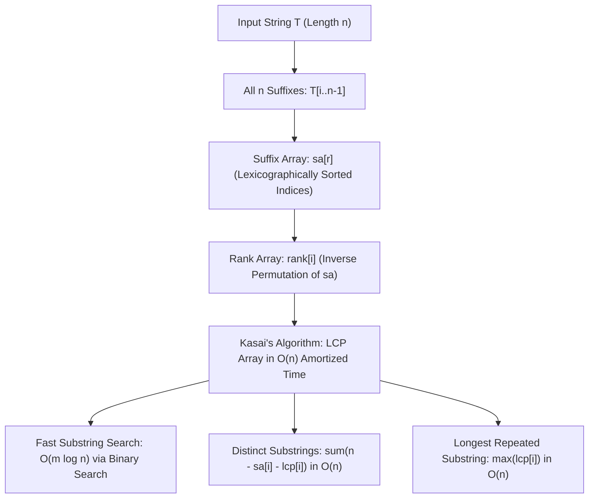

# Suffix Arrays and LCP

> [!NOTE]
> **Global Substring Structure via Suffix Arrays:** While KMP and Aho-Corasick address localized exact-match queries, the **Suffix Array (SA)** provides a global, preprocessed index of all substrings of a text $T$ of length $n$:
> - **Space-Efficient Representation:** Instead of building a heavyweight Suffix Tree with complex node pointers and high memory constants, a suffix array stores just a permutation of $n$ integer indices representing all suffixes sorted in lexicographical order.
> - **Prefix-Doubling Construction:** Ranks prefixes of length $2^k$ by treating them as pairs of length-$2^{k-1}$ ranks, achieving $O(n \log^2 n)$ with comparison sort or $O(n \log n)$ with two-pass counting / radix sort.
> - **Kasai's LCP Algorithm:** Builds the Longest Common Prefix array in strictly $O(n)$ amortized time by exploiting the property that common prefix length $h$ drops by at most 1 when advancing from suffix $i$ to $i+1$.
> - **High-Impact Applications:** Substring search in $O(m \log n)$, counting distinct substrings in $O(n)$, and identifying longest repeated substrings in $O(n)$.
>
> Reference implementations: [C++17 Implementation](../../implementations/cpp/suffix_arrays_and_lcp.cpp) | [Python Implementation](../../implementations/python/suffix_arrays_and_lcp.py)

> [!TIP]
> **Companion Structures and Coordinate Relationships:**
>
> | Structure | Array Indexing | Operational Definition | Construction Complexity | Primary Use Case |
> |---|---|---|---|---|
> | **Suffix Array** | `sa[r]` | Starting index in $T$ of the suffix with lexicographic rank $r$ | $O(n \log^2 n)$ / $O(n \log n)$ | Binary search range matching |
> | **Rank Array** | `rank[i]` | Lexicographic rank $r \in [0, n-1]$ of suffix $T[i \dots n-1]$ | $O(n)$ from `sa` | Instant predecessor lookup |
> | **LCP Array** | `lcp[r]` | Length of longest common prefix of `sa[r]` and `sa[r-1]` | $O(n)$ via Kasai | Substring count & overlap bounds |

> [!WARNING]
> **Critical Implementation Traps & Invariants:**
> 1. **Sort Complexity Qualification:** Doubling with comparison sort (`std::sort` or Python's `sort()`) performs $O(n \log n)$ comparisons per phase across $O(\log n)$ phases, yielding $O(n \log^2 n)$ runtime. Do not claim $O(n \log n)$ without incorporating radix or two-pass counting sort on the rank pairs.
> 2. **Second-Half Sentinel Invariant:** When pairing ranks $(\text{rank}[i], \text{rank}[i + 2^k])$, if $i + 2^k \ge n$, the second rank must be evaluated as $-1$ (less than any valid character rank) so that shorter prefix matches sort strictly before longer continuations.
> 3. **Kasai Invariant ($h \ge h_{\text{prev}} - 1$):** Because suffix $i+1$ drops only the first character from suffix $i$, the suffix immediately preceding $i+1$ in suffix array order must share at least $h - 1$ characters with it. Thus, character comparison count $h$ never decrements by more than 1 per text position, bounding total comparisons by $2n$.
> 4. **Avoid Heap Allocations in Binary Search:** In C++, do not construct temporary `std::string` slices when comparing pattern $P$ against candidate suffixes; use `std::string_view` or raw pointer offsets to guarantee zero-allocation $O(m \log n)$ search.




Some string algorithms ask local matching questions:

- does this pattern occur here?
- where does one pattern occur in a text?
- which dictionary words appear in the text?

But other problems ask more global structural questions:

- what are all suffixes of the string, in lexicographic order?
- how many distinct substrings does the string contain?
- what is the longest repeated substring?
- how can we search many substrings efficiently after preprocessing?

A central tool for these global questions is the **suffix array**.

A suffix array stores all suffixes of a string in sorted order.

Once suffixes are sorted, many substring problems become easier.

A second important structure is the **LCP array**, which stores the longest common prefix length between adjacent suffixes in suffix-array order.

Together, suffix arrays and LCP arrays support:

- substring search by binary search
- counting distinct substrings
- longest repeated substring queries
- many more advanced string-processing tasks

This chapter develops:

- suffix array definition
- $ O(n \log n) $ suffix array construction by prefix doubling
- linear-time LCP construction with Kasai's algorithm
- substring search
- counting distinct substrings
- longest repeated substring
- comparisons with suffix trees and suffix automata

---

## 1. What is a suffix?

For a string $ s $ of length $ n $, the suffix starting at index $ i $ is:

$$
s[i \dots n-1]
$$

So every position in the string defines one suffix.

### Example
If:

```text
s = banana
```

then its suffixes are:

- `banana`
- `anana`
- `nana`
- `ana`
- `na`
- `a`

There are exactly $ n $ suffixes.

---

## 2. What is a suffix array?

A **suffix array** is an array of starting indices of all suffixes, sorted in lexicographic order of the suffix strings.

If `sa` is the suffix array, then:

- `sa[0]` is the starting index of the lexicographically smallest suffix
- `sa[1]` is the next one
- and so on

This is a compact index of the string's suffix structure.

---

## 3. Example suffix array

For:

```text
s = banana
```

the suffixes are:

| index | suffix |
|---:|---|
| 0 | banana |
| 1 | anana |
| 2 | nana |
| 3 | ana |
| 4 | na |
| 5 | a |

Sorted lexicographically:

| rank | suffix | start |
|---:|---|---:|
| 0 | a | 5 |
| 1 | ana | 3 |
| 2 | anana | 1 |
| 3 | banana | 0 |
| 4 | na | 4 |
| 5 | nana | 2 |

So the suffix array is:

```text
sa = [5, 3, 1, 0, 4, 2]
```

---

## 4. Why suffix arrays are useful

Once suffixes are sorted, substring questions become order questions.

Examples:

- to test whether a pattern occurs, binary search among suffixes
- repeated substring structure appears in neighboring suffixes
- distinct substring counting can be expressed using suffix lengths and overlaps

So the suffix array is a global index over the entire string.

---

## 5. Naive construction

A direct approach is:

1. generate all suffixes
2. sort them lexicographically
3. record their starting positions

This is simple, but slow.

Even if sorting uses efficient comparison-based methods, suffix comparisons themselves may cost a lot.

A naive implementation is often around:

$$
O(n^2 \log n)
$$

or worse in practice, because suffixes are long strings.

We want a better method.

---

## 6. Prefix-doubling idea

A classical $ O(n \log n) $ construction method is **prefix doubling**.

The main idea is:

- first sort suffixes by their first 1 character
- then by first 2 characters
- then by first 4 characters
- then by first 8 characters
- and so on

At each stage, suffixes are grouped by rank pairs that summarize their current prefixes.

This is much faster than comparing full suffix strings repeatedly.

---

## 7. Rank-based view

Suppose at some stage we know the rank of every suffix according to its first $ 2^k $ characters.

Then to sort suffixes by their first $ 2^{k+1} $ characters, we only need to compare the pair:

$$
(\text{rank}[i], \text{rank}[i + 2^k])
$$

for each suffix starting at $ i $.

This pair captures the first half and second half of the doubled prefix.

So longer-prefix sorting reduces to sorting integer pairs.

---

## 8. Why doubling works

If two suffixes differ in their first $ 2^{k+1} $ characters, then they must differ either:

- in the first $ 2^k $ characters, or
- in the next $ 2^k $ characters

So the rank pair completely determines the order for that doubled prefix length.

Repeated doubling eventually distinguishes all suffixes.

Since $ 1, 2, 4, 8, \dots $ grows exponentially, only $ O(\log n) $ stages are needed.

---

## 9. Prefix-doubling construction outline

A common implementation keeps:

- `sa`: suffix array
- `rank[i]`: current rank of suffix starting at `i`
- temporary arrays for new ranks and sorting keys

At each doubling step:

1. form keys $(rank[i], rank[i + len])$
2. sort suffix indices by these keys
3. assign new compressed ranks
4. double `len`

When all ranks are distinct, construction is complete.

---

## 10. Sentinel convention for out-of-range second half

When $ i + len \ge n $, the second half of the pair does not exist.

A standard convention is to treat it as:

```text
-1
```

This makes shorter suffixes sort correctly before longer suffixes with the same prefix.

This small engineering detail is important.

---

## 11. C++17 suffix array by prefix doubling

```cpp
#include <vector>
#include <string>
#include <algorithm>
#include <tuple>

std::vector<int> suffix_array(const std::string& s) {
    int n = static_cast<int>(s.size());
    std::vector<int> sa(n), rank(n), tmp(n);

    for (int i = 0; i < n; ++i) {
        sa[i] = i;
        rank[i] = static_cast<unsigned char>(s[i]);
    }

    for (int len = 1; len < n; len <<= 1) {
        auto cmp = [&](int a, int b) {
            if (rank[a] != rank[b]) return rank[a] < rank[b];
            int ra = (a + len < n ? rank[a + len] : -1);
            int rb = (b + len < n ? rank[b + len] : -1);
            return ra < rb;
        };

        std::sort(sa.begin(), sa.end(), cmp);

        tmp[sa[0]] = 0;
        for (int i = 1; i < n; ++i) {
            tmp[sa[i]] = tmp[sa[i - 1]] + (cmp(sa[i - 1], sa[i]) ? 1 : 0);
        }

        rank = tmp;
        if (rank[sa[n - 1]] == n - 1) break;
    }

    return sa;
}
```

This version emphasizes clarity rather than the most optimized counting-sort variant.

---

## 12. Python suffix array by prefix doubling

```python
def suffix_array(s):
    n = len(s)
    sa = list(range(n))
    rank = [ord(c) for c in s]
    tmp = [0] * n
    length = 1

    while length < n:
        sa.sort(key=lambda i: (rank[i], rank[i + length] if i + length < n else -1))

        tmp[sa[0]] = 0
        for i in range(1, n):
            prev = sa[i - 1]
            cur = sa[i]
            prev_key = (rank[prev], rank[prev + length] if prev + length < n else -1)
            cur_key = (rank[cur], rank[cur + length] if cur + length < n else -1)
            tmp[cur] = tmp[prev] + (1 if prev_key < cur_key else 0)

        rank[:] = tmp
        if rank[sa[-1]] == n - 1:
            break
        length <<= 1

    return sa
```

---

## 13. Complexity of prefix doubling

There are $ O(\log n) $ doubling stages.

If each stage sorts $ n $ suffix indices in $ O(n \log n) $, the simple implementation becomes:

$$
O(n \log^2 n)
$$

However, with radix sort or counting sort on integer ranks, the standard prefix-doubling approach can be implemented in:

$$
O(n \log n)
$$

For a handbook chapter, it is useful to explain both:

- the conceptual doubling method
- and the optimized rank-sorting interpretation

---

## 14. Practical note on complexity wording

Many educational implementations of suffix arrays using language-level tuple sorting are technically:

$$
O(n \log^2 n)
$$

because each doubling round sorts in $ O(n \log n) $ and there are $ O(\log n) $ rounds.

To truly achieve $ O(n \log n) $, the per-round sort should exploit integer ranks more carefully.

If the chapter promises $ O(n \log n) $, the implementation and explanation should match that claim clearly.

---

## 15. LCP array definition

Once suffixes are sorted, another very important structure is the **LCP array**.

`lcp[i]` is the length of the **Longest Common Prefix** of the adjacent suffixes:

- suffix starting at `sa[i]`
- suffix starting at `sa[i-1]`

So `lcp[0]` is usually defined as 0, since there is no previous suffix.

---

## 16. Example LCP array

For:

```text
s = banana
sa = [5, 3, 1, 0, 4, 2]
```

the sorted suffixes are:

| i | start | suffix |
|---:|---:|---|
| 0 | 5 | a |
| 1 | 3 | ana |
| 2 | 1 | anana |
| 3 | 0 | banana |
| 4 | 4 | na |
| 5 | 2 | nana |

Now compare neighbors:

- `lcp[1] = LCP(a, ana) = 1`
- `lcp[2] = LCP(ana, anana) = 3`
- `lcp[3] = LCP(anana, banana) = 0`
- `lcp[4] = LCP(banana, na) = 0`
- `lcp[5] = LCP(na, nana) = 2`

So:

```text
lcp = [0, 1, 3, 0, 0, 2]
```

---

## 17. Why LCP is useful

LCP reveals how much adjacent suffixes overlap.

This helps with:

- counting distinct substrings
- finding repeated substrings
- range-query structures over suffixes
- many advanced suffix-array applications

The key fact is:

> repeated substring information appears naturally as common prefixes of suffixes

---

## 18. Naive LCP construction

A direct method would compare each adjacent suffix pair character by character.

That can take:

$$
O(n^2)
$$

in the worst case.

Kasai's algorithm improves this to linear time.

---

## 19. Kasai's algorithm idea

Kasai's algorithm uses two arrays:

- `sa`
- `rank`, where `rank[i]` is the position of suffix `i` in the suffix array

Now suppose suffix `i` has LCP length $ k $ with its previous suffix in sorted order.

Then suffix `i+1` has LCP at least $ k-1 $ with its own previous neighbor, because both suffixes lose only their first character.

This reuse of previous overlap is the key to linear time.

---

## 20. Kasai's algorithm outline

For each original index $ i $:

1. find its suffix-array rank `rank[i]`
2. if it is not the first suffix, compare it with the previous suffix in sorted order
3. start comparison from the current carried-over LCP length $ h $
4. extend while characters match
5. store the result in `lcp[rank[i]]`
6. if $ h > 0 $, decrement $ h $ by 1 before moving to the next $ i $

This gives:

$$
O(n)
$$

time overall.

---

## 21. Why Kasai is linear

At first, there is a while loop that extends matches.

But the variable $ h $ only increases when characters match and decreases by at most 1 per iteration of the outer loop.

So total character comparisons across the whole algorithm are linear.

This is another amortized string-algorithm proof.

---

## 22. C++17 Kasai LCP construction

```cpp
#include <vector>
#include <string>

std::vector<int> lcp_array(const std::string& s, const std::vector<int>& sa) {
    int n = static_cast<int>(s.size());
    std::vector<int> rank(n), lcp(n, 0);

    for (int i = 0; i < n; ++i) {
        rank[sa[i]] = i;
    }

    int h = 0;
    for (int i = 0; i < n; ++i) {
        int r = rank[i];
        if (r == 0) continue;

        int j = sa[r - 1];
        while (i + h < n && j + h < n && s[i + h] == s[j + h]) {
            ++h;
        }

        lcp[r] = h;
        if (h > 0) --h;
    }

    return lcp;
}
```

---

## 23. Python Kasai LCP construction

```python
def lcp_array(s, sa):
    n = len(s)
    rank = [0] * n
    lcp = [0] * n

    for i, pos in enumerate(sa):
        rank[pos] = i

    h = 0
    for i in range(n):
        r = rank[i]
        if r == 0:
            continue

        j = sa[r - 1]
        while i + h < n and j + h < n and s[i + h] == s[j + h]:
            h += 1

        lcp[r] = h
        if h > 0:
            h -= 1

    return lcp
```

---

## 24. Substring search using a suffix array

Once suffixes are sorted, we can search for a pattern $ p $ by binary search.

Why?

Because all suffixes starting with $ p $ appear in one contiguous lexicographic block.

So we compare the pattern with suffixes in sorted order, just like binary searching strings in a sorted dictionary.

This gives search time:

$$
O(m \log n)
$$

for pattern length $ m $, using direct string comparisons.

---

## 25. C++17 substring search via binary search

```cpp
#include <vector>
#include <string>
#include <algorithm>

bool contains_substring(const std::string& s, const std::vector<int>& sa, const std::string& p) {
    int n = static_cast<int>(s.size());
    int m = static_cast<int>(p.size());

    int low = 0, high = n - 1;
    while (low <= high) {
        int mid = low + (high - low) / 2;
        int start = sa[mid];

        std::string suffix_prefix = s.substr(start, std::min(m, n - start));

        if (suffix_prefix.compare(0, m, p) == 0) {
            return true;
        } else if (suffix_prefix < p) {
            low = mid + 1;
        } else {
            high = mid - 1;
        }
    }

    return false;
}
```

This reference implementation favors clarity.
More optimized versions avoid creating substring copies.

---

## 26. Python substring search via binary search

```python
def contains_substring(s, sa, p):
    n = len(s)
    m = len(p)
    low, high = 0, n - 1

    while low <= high:
        mid = (low + high) // 2
        start = sa[mid]
        frag = s[start:start + m]

        if frag == p:
            return True
        elif frag < p:
            low = mid + 1
        else:
            high = mid - 1

    return False
```

---

## 27. Why suffix-array search works

A pattern $ p $ occurs in $ s $ if and only if there exists a suffix of $ s $ that begins with $ p $.

Since suffixes are sorted lexicographically, all suffixes beginning with $ p $ form a contiguous interval.

Binary search can therefore test whether that interval is nonempty.

This is the core correctness idea.

---

## 28. Counting distinct substrings

Every suffix contributes many substrings:

- the suffix starting at `sa[i]` has length $ n - sa[i] $
- so it contributes that many prefixes as candidate substrings

But some of those prefixes were already seen in earlier suffixes.

Exactly how many are duplicates?

The answer is the LCP with the previous suffix.

So the number of **new** substrings contributed by suffix `sa[i]` is:

$$
(n - sa[i]) - lcp[i]
$$

Therefore the total number of distinct substrings is:

$$
\sum_{i=0}^{n-1} (n - sa[i]) - \sum_{i=0}^{n-1} lcp[i]
$$

---

## 29. Why the distinct-substring formula is correct

Take suffixes in sorted order.

For suffix `sa[i]`:

- all its prefixes are substrings
- the first `lcp[i]` of those prefixes were already present as prefixes of the previous suffix
- the remaining longer prefixes are new distinct substrings

So each suffix contributes exactly its length minus its overlap with the previous suffix.

This is a very elegant suffix-array application.

---

## 30. C++17 distinct substring count

```cpp
#include <vector>
#include <string>

long long count_distinct_substrings(const std::string& s) {
    int n = static_cast<int>(s.size());
    if (n == 0) return 0;

    std::vector<int> sa = suffix_array(s);
    std::vector<int> lcp = lcp_array(s, sa);

    long long total = 0;
    for (int i = 0; i < n; ++i) {
        total += (n - sa[i]) - lcp[i];
    }

    return total;
}
```

---

## 31. Python distinct substring count

```python
def count_distinct_substrings(s):
    n = len(s)
    if n == 0:
        return 0

    sa = suffix_array(s)
    lcp = lcp_array(s, sa)

    total = 0
    for i in range(n):
        total += (n - sa[i]) - lcp[i]

    return total
```

---

## 32. Longest repeated substring

A repeated substring must appear as a common prefix of at least two suffixes.

So the **longest repeated substring** is simply the maximum value in the LCP array.

If:

$$
best = \max lcp[i]
$$

then the repeated substring can be recovered from the suffix starting at `sa[i]` where that maximum occurs.

This is one of the most famous LCP applications.

---

## 33. C++17 longest repeated substring

```cpp
#include <string>
#include <vector>
#include <algorithm>

std::string longest_repeated_substring(const std::string& s) {
    int n = static_cast<int>(s.size());
    if (n == 0) return "";

    std::vector<int> sa = suffix_array(s);
    std::vector<int> lcp = lcp_array(s, sa);

    int best_len = 0;
    int best_pos = 0;

    for (int i = 1; i < n; ++i) {
        if (lcp[i] > best_len) {
            best_len = lcp[i];
            best_pos = sa[i];
        }
    }

    return s.substr(best_pos, best_len);
}
```

---

## 34. Python longest repeated substring

```python
def longest_repeated_substring(s):
    n = len(s)
    if n == 0:
        return ""

    sa = suffix_array(s)
    lcp = lcp_array(s, sa)

    best_len = 0
    best_pos = 0

    for i in range(1, n):
        if lcp[i] > best_len:
            best_len = lcp[i]
            best_pos = sa[i]

    return s[best_pos:best_pos + best_len]
```

---

## 35. Rank array and inverse relationships

The suffix array gives:

- sorted rank → starting index

The `rank` array gives the inverse:

- starting index → sorted rank

This inverse mapping is essential for Kasai's algorithm and many suffix-array query structures.

It is worth viewing `sa` and `rank` as companion arrays.

---

## 36. LCP and repeated structure intuition

Two suffixes sharing a long prefix means the original string contains a repeated substring of that length.

Because neighboring suffixes in sorted order are lexicographically closest, repeated-substring information is concentrated in adjacent suffix comparisons.

That is why the LCP array is so powerful.

---

## 37. Comparison with suffix trees

A **suffix tree** is another powerful full-string index.

### Suffix tree strengths
- very rich structure
- many operations can be supported in linear time
- theoretically elegant

### Suffix tree weaknesses
- significantly more complex
- larger memory overhead
- harder to implement and debug

Suffix arrays are often preferred in practice because they are simpler and more memory-efficient.

---

## 38. Comparison with suffix automata

A **suffix automaton** is another compact substring structure.

### Suffix automaton strengths
- elegant substring-state compression
- strong support for substring counting and occurrence queries
- linear-size automaton

### Suffix automaton trade-off
- conceptually less direct than suffix arrays for lexicographic order
- less natural for binary-search-based substring indexing

Suffix arrays are especially strong when sorted order of suffixes matters.

---

## 39. When suffix arrays are a good fit

Suffix arrays are especially useful when you need:

- lexicographic order of suffixes
- substring search in a static text
- repeated-substring analysis
- distinct-substring counting
- a practical alternative to suffix trees

They are best suited to **static strings**, where the text is preprocessed once and then queried.

---

## 40. Common mistakes

### Mistake 1: confusing suffixes with substrings
A suffix starts at some position and runs to the end.
A substring can end anywhere.

### Mistake 2: claiming $ O(n \log n) $ for a tuple-sort implementation without qualification
Simple comparison-based sorting inside each doubling round is often $ O(n \log^2 n) $.

### Mistake 3: mishandling the out-of-range second rank
Use a consistent sentinel such as `-1`.

### Mistake 4: forgetting that `lcp[i]` refers to adjacent suffixes in suffix-array order
It is not the LCP with the next suffix in original text order.

### Mistake 5: off-by-one errors in distinct-substring formulas
Be clear that suffix length is:

$$
n - sa[i]
$$

### Mistake 6: unnecessary substring copying in search
Clarity is fine for teaching, but production code often compares in place.

---

## 41. Complexity summary

Let $ n $ be the string length.

### Suffix array construction
- prefix-doubling with tuple sort: often $ O(n \log^2 n) $
- optimized prefix-doubling with integer sorting: $ O(n \log n) $

### LCP construction by Kasai
$$
O(n)
$$

### Substring search
$$
O(m \log n)
$$

for pattern length $ m $, with direct comparisons.

### Distinct substring counting
$$
O(n)
$$

after `sa` and `lcp` are built.

### Longest repeated substring
$$
O(n)
$$

after `lcp` is built.

---

## 42. Correctness intuition summary

### Suffix array
Sorting suffixes orders all suffix beginnings lexicographically, so prefix relations among suffixes become easy to query.

### Prefix doubling
The pair $(rank[i], rank[i + len])$ fully determines the order of the first $ 2 \cdot len $ characters.

### Kasai
If two suffixes share a prefix of length $ h $, then the next suffix pair starting one position later shares at least $ h - 1 $, so overlap can be reused.

### Distinct substring counting
Each suffix contributes all its prefixes, except the prefixes already shared with the previous suffix.

### Longest repeated substring
A repeated substring is a common prefix of at least two suffixes, so the largest adjacent LCP gives the answer.

---

## 43. Summary

A suffix array stores all suffixes of a string in sorted order.

An LCP array stores the longest common prefix lengths of adjacent sorted suffixes.

Together they provide a powerful global index for string structure.

The most important ideas are:

- suffixes capture all substring endings-to-end
- sorted suffixes support binary search and repetition analysis
- prefix doubling builds suffix arrays efficiently
- Kasai's algorithm computes LCP in linear time
- distinct substrings and longest repeated substrings have elegant suffix-array formulas

Suffix arrays are one of the central tools in advanced string processing because they offer strong power with relatively practical implementation complexity.

---

## 44. Practice prompts

1. What is a suffix of a string?
2. What does the suffix array store?
3. Why is sorting all suffixes useful?
4. What pair is used in prefix-doubling construction?
5. Why does doubling need only $ O(\log n) $ rounds?
6. What does the LCP array measure?
7. Why is Kasai's algorithm linear?
8. Why does binary search on suffixes solve substring search?
9. Why is the number of distinct substrings equal to total suffix lengths minus total LCP?
10. Why does the maximum LCP value give the longest repeated substring?

---

## 45. Suggested next topics

A natural continuation after suffix arrays and LCP is:

- suffix automata
- Z-function
- rolling hash
- palindromic tree
- FM-index and compressed text indexing
