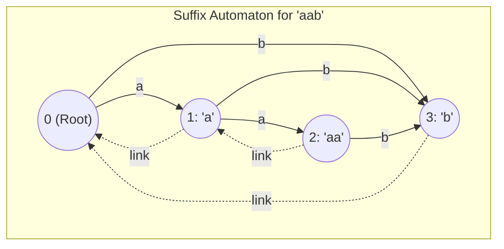
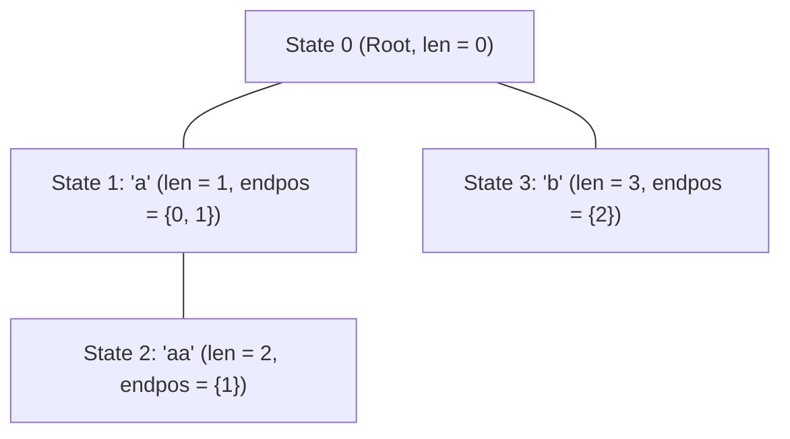
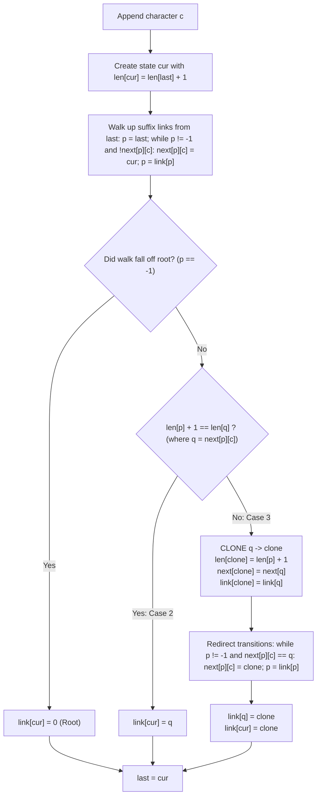

# Suffix Automaton (DAWG)

> [!NOTE]
> **The Minimal Substring Recognizer:**
> A **Suffix Automaton** (also known as a Directed Acyclic Word Graph or **DAWG**) is the strictly minimal deterministic finite automaton (DFA) that recognizes all suffixes—and by extension, all substrings—of a given string $S$.
> While a naive Suffix Trie requires $O(N^2)$ nodes, a Suffix Automaton compresses all substrings of a string of length $N$ into:
> $$\text{Maximum States} \le 2N - 1, \quad \text{Maximum Transitions} \le 3N - 4$$
> It can be constructed in strictly linear $O(N)$ time online, character by character.

> [!TIP]
> **The Endpos Equivalence Invariant:**
> The operational foundation of a Suffix Automaton is the **endpos equivalence relation**:
> For any substring $w$, let $\text{endpos}(w)$ be the set of all ending positions (0-indexed) where $w$ occurs in $S$.
> Two substrings $u$ and $v$ belong to the exact same state if and only if:
> $$\text{endpos}(u) = \text{endpos}(v)$$
> Every state in the automaton corresponds to an equivalence class of substrings with identical occurrence endpoints.

> [!WARNING]
> **The Cloning Imperative (Case 3):**
> When adding character $c$, if we encounter an existing transition $p \xrightarrow{c} q$ where $\text{len}[p] + 1 < \text{len}[q]$, state $q$ contains longer substrings that do not end at the new position.
> Merging directly into $q$ would corrupt its endpos set.
> We must **clone** state $q$ into a new split state $q_{\text{clone}}$ with $\text{len}[q_{\text{clone}}] = \text{len}[p] + 1$, redirect the relevant suffix transitions, and preserve the minimality of the DFA.

---

## 1. Endpos Properties and Continuous Length Intervals

### 1.1 The Nesting Lemma
For any two substrings $u$ and $v$ with $|u| \le |v|$:
* If $\text{endpos}(u) \cap \text{endpos}(v) \ne \emptyset$, then $u$ is a strict suffix of $v$, and $\text{endpos}(v) \subseteq \text{endpos}(u)$.
* Otherwise, $\text{endpos}(u) \cap \text{endpos}(v) = \emptyset$.

### 1.2 Continuous Length Interval
All substrings belonging to a single state $v$ are suffixes of the longest string in $v$, and their lengths form a **contiguous integer interval**:
$$\text{Lengths}(v) = [\text{minlen}(v), \text{len}(v)]$$
Where the minimum length is governed by the suffix link:
$$\text{minlen}(v) = \text{len}(\text{link}[v]) + 1$$

---

## 2. Suffix Links (The Parent Tree)

The **suffix link** of state $v$ points to the state containing the longest suffix of the strings in $v$ whose $\text{endpos}$ set is strictly larger than $\text{endpos}(v)$.
* Suffix links form a directed tree rooted at state $0$ (the empty string).
* The Suffix Link Tree is isomorphic to the **Suffix Tree of the reversed string** $S^R$!

---

## 3. Online Construction Algorithm

We build the automaton online by appending characters $c = S[0], S[1], \dots, S[N-1]$ one by one. Maintain a pointer `last` to the state representing the whole string so far.

---

## 4. Landmark Applications

### 4.1 Number of Distinct Substrings
Every distinct substring in $S$ corresponds to a unique directed path starting from root $0$.
The number of distinct substrings equals:
$$\text{Distinct Count} = \sum_{v \ne 0} (\text{len}[v] - \text{len}[\text{link}[v]])$$
This computes the number of distinct substrings in $O(N)$ time, crushing the $O(N \log N)$ suffix array approach.

### 4.2 Substring Search (Pattern Matching)
To check if pattern $P$ is a substring of $S$:
* Start at root $0$.
* For each character $c \in P$, follow transition $v = \text{next}[v][c]$.
* If at any point no transition exists, $P$ is **not a substring**.
* Time complexity: strictly **$O(|P|)$**, completely independent of text length $|S|$!

### 4.3 Longest Common Substring of Two Strings
Given $S$ and $T$:
1. Build the suffix automaton of $S$.
2. Stream characters of $T$ through the automaton, tracking current state $v$ and current matching length $l$.
3. If transition exists, $l \mathrel{+}= 1, v = \text{next}[v][c]$.
4. If not, follow suffix links until a transition exists or reach root, updating $l = \text{len}[v] + 1$.
5. Maximize $l$ across the traversal. Runs in $O(|S| + |T|)$ time!

---

## 5. Structural Invariants & Complexity Matrix

| Metric | Bound | Proof Rationale |
| :--- | :--- | :--- |
| **Max States** | $2N - 1$ | Each appended char adds 1 `cur` state, and at most 1 `clone` state. |
| **Max Transitions** | $3N - 4$ | Derived from planar graph properties on DAGs. |
| **Construction Time** | $O(N \cdot |\Sigma|)$ | Suffix link traversals amortize via potential function on suffix lengths. |
| **Pattern Search Time** | $O(|P|)$ | Single step per pattern character. |

---

## 6. Common Pitfalls & Anti-Patterns

### Anti-Pattern 1: Forgetting to Copy Transitions During Cloning
When cloning state $q \to q_{\text{clone}}$, you must copy all existing transitions `next[q]` to `next[q_{\text{clone}}]`. Forgetting this drops outgoing paths from the split state.

### Anti-Pattern 2: Over-Redirecting Suffix Link Ancestors
In Case 3, when walking up $p$ to redirect transitions from $q$ to $q_{\text{clone}}$, stop immediately when `next[p][c] != q`. Continuing further corrupts transitions belonging to higher ancestor equivalence classes.

---

## 7. Curated References

1. **Blumer, Blumer, Ehrenfeucht, Haussler, McConnell (1985):** *Smallest Automata Recognizing the Subwords of a Text*. Theoretical Computer Science.
2. **Crochemore, Maxime (1986):** *Transducers and Repetitions*.
3. **E-Maxx Algorithms:** *Suffix Automaton Construction and Applications*.
