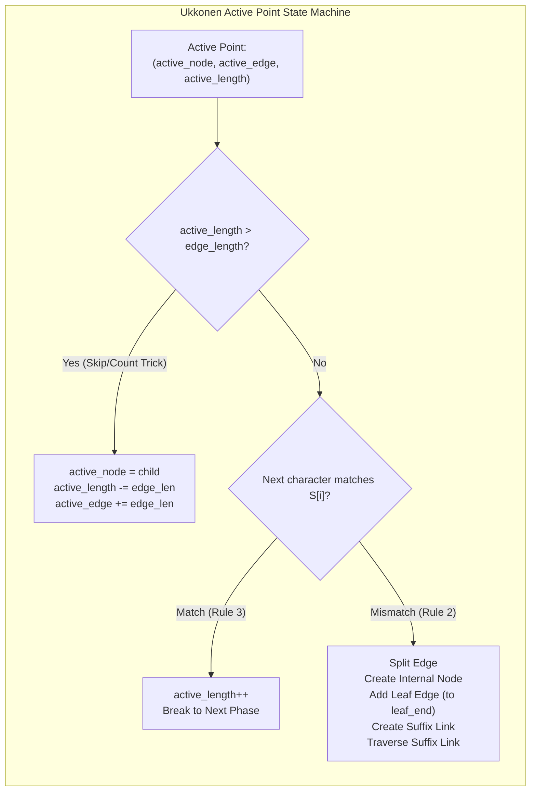
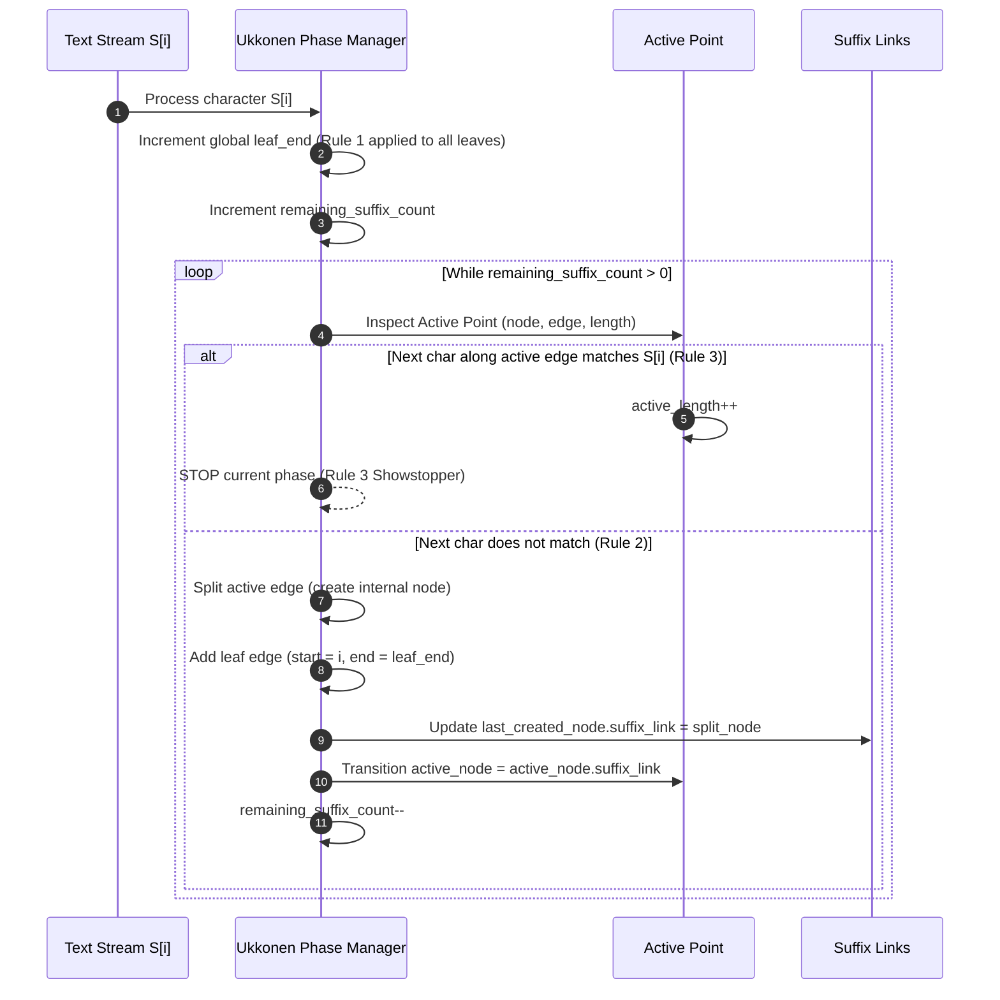

# Suffix Tree: Ukkonen's Online Linear-Time Construction and Suffix Links

> [!NOTE]
> **The Apex String Index:**
> A **Suffix Tree** $\mathcal{T}(S)$ is a compressed trie containing all suffixes of a string $S$ terminated with a unique sentinel character `$`.
> First described by Weiner (1973) and simplified by McCreight (1976), Esko Ukkonen introduced the landmark **Online Linear-Time Algorithm (1995)**, which processes text left-to-right in $O(N)$ time and $O(N)$ space using **Suffix Links** and the **Active Point state machine**.

> [!TIP]
> **The Three Rules of Ukkonen's Extensions:**
> In phase $i$, when extending suffixes with character $S[i]$:
> 1. **Rule 1 (Open Leaf Extension):** If the path ends at a leaf, incrementing a global variable `leaf_end` ($e$) extends all existing leaf edges to $S[i]$ in **$O(1)$ constant time**.
> 2. **Rule 2 (Branching Edge Split):** If the path ends mid-edge and the next character is not $S[i]$, split the edge, create an internal branching node, add a new leaf edge ending at `leaf_end`, and establish a suffix link.
> 3. **Rule 3 (Showstopper / Early Break):** If $S[i]$ already exists along the current active edge, increment `active_length`, stop the current phase immediately, and preserve `remainder` for subsequent phases.

> [!WARNING]
> **Pointer Traps & Edge Coordinate Compression:**
> If edge labels stored substrings as actual characters, an $N$-character string would require $O(N^2)$ storage (e.g. $10^5$ characters would consume 5 gigabytes).
> A valid suffix tree **must** compress edge labels into coordinate pairs $[start, end]$ referencing the original string. Furthermore, using pointer-free integer indices (`std::vector<Node>` pool) eliminates heap fragmentation and dangling pointer hazards.

---

## 1. Overview & Intuition

How can a search engine or bioinformatics aligner locate any arbitrary pattern of length $M$ inside a genome of 3 billion base pairs in time proportional **only to the query length $O(M)$**, completely independent of the text size $N$?

By precomputing the **Suffix Tree** $\mathcal{T}(S)$:
- Every substring of $S$ is a prefix of some suffix of $S$.
- Searching for a substring $P$ corresponds to walking down a single unique path from the root matching the characters of $P$.
- If the walk finishes in $M$ steps, $P$ occurs in $S$.
- Every leaf in the subtree rooted at that termination point represents a starting index of $P$ in $S$.

---

## 2. Formal Definition & Mathematical Foundations

### 2.1 Structural Invariants of Suffix Tree $\mathcal{T}(S)$
Let $S = s_1 s_2 \dots s_N \$$ be a string of length $N + 1$ with unique terminal sentinel $\$ \notin \Sigma$.
1. **Leaf Invariant:** $\mathcal{T}(S)$ has exactly $N + 1$ leaves, numbered $0$ to $N$, corresponding to suffixes $S[i \dots N]$.
2. **Internal Node Invariant:** Every internal node has at least two children (non-trivial branching).
3. **Node & Edge Bound:**
   $$\text{Number of leaves} = N + 1, \quad \text{Number of internal nodes} \le N \implies \text{Total nodes} \le 2N + 1$$
   $$\text{Total edges} \le 2N$$
4. **Edge Labeling:** Each edge is labeled with a non-empty substring of $S$, stored compactly as indices $[start, end]$.
5. **No Sibling Ambiguity:** No two edges emanating from the same node begin with the same character.

### 2.2 Suffix Links
For an internal node $v$ representing path string $x\alpha$ (where $x \in \Sigma$ is a single character and $\alpha \in \Sigma^*$ is a string):
The **Suffix Link** of $v$, denoted $SL(v)$, is a directed pointer to internal node $w$ representing path $\alpha$:
$$SL(v) = w \iff \text{Path}(root \to v) = x\alpha \land \text{Path}(root \to w) = \alpha$$
Ukkonen proved that for any newly created internal node during edge splitting, its suffix link is guaranteed to point to an existing node or a node created in the immediately following extension step.

---

## 3. Architecture & Core Mechanics

### 3.1 The Skip/Count Trick (Edge Skipping)
When navigating edges during suffix link transitions:
If `active_length` is greater than or equal to the current edge length `elen`:
Instead of comparing characters one by one, the algorithm directly jumps across the edge:
$$\text{active\_node} \leftarrow \text{child}, \quad \text{active\_edge} \leftarrow \text{active\_edge} + \text{elen}, \quad \text{active\_length} \leftarrow \text{active\_length} - \text{elen}$$
This skip/count trick guarantees that edge traversal is strictly bounded by the number of nodes on the path, executing in **$O(1)$ amortized time**.

---

## 4. Operations & Invariants

| Operation | Invariant Maintained | Algorithmic Mechanism |
| :--- | :--- | :--- |
| **`extend(phase)`** | Tree encodes all prefixes of all suffixes up to $S[0 \dots phase]$ | Rule 1, 2, 3 active point state machine |
| **`walk_down()`** | Active point stays normalized on shortest valid edge | Skip/count edge boundary jumping |
| **`contains(P)`** | Substring exists iff path from root matches $P$ | Single deterministic descent $O(\|P\|)$ |
| **`locateAll(P)`** | Leaves under matched node encode all starting offsets | DFS subtree traversal $O(\|P\| + \text{Occ})$ |
| **`countDistinct()`** | Sum of edge lengths excluding terminal sentinel | Single post-order tree walk $O(N)$ |

---

## 5. Complexity Analysis

| Operation | Best Case | Average Case | Worst Case | Auxiliary Space |
| :--- | :--- | :--- | :--- | :--- |
| **Ukkonen Construction** | $O(N)$ | $O(N)$ | $O(N)$ | $O(N \cdot \|\Sigma\|)$ |
| **Pattern Search (Containment)** | $O(M)$ | $O(M)$ | $O(M)$ | $O(1)$ |
| **All Occurrences Query** | $O(M + \text{Occ})$ | $O(M + \text{Occ})$ | $O(M + \text{Occ})$ | $O(\text{Occ})$ |
| **Count Distinct Substrings** | $O(N)$ | $O(N)$ | $O(N)$ | $O(N)$ stack |
| **Longest Repeated Substring** | $O(N)$ | $O(N)$ | $O(N)$ | $O(N)$ stack |

---

## 6. Edge Cases & Failure Modes

> [!IMPORTANT]
> **The Sentinel Character (`$`):**
> If the string does not terminate with a unique character that never appears elsewhere, some suffixes will be prefixes of other suffixes and will end at internal nodes rather than leaves. Appending `$` ensures that every suffix ends at an explicit, unique leaf node.

> [!CAUTION]
> **Active Point Normalization on Root:**
> When the active node is `root` and a suffix link is followed, the active node cannot follow a suffix link (the root has no suffix link). Instead, the rule specifies:
> $$\text{active\_length} \leftarrow \text{active\_length} - 1, \quad \text{active\_edge} \leftarrow \text{phase} - \text{remaining} + 1$$
> Failing to decrement `active_length` at the root leads to infinite extension loops.

---

## 7. Two-Layer API Design & Reference Implementations

The implementation is partitioned into two layers:
- **Layer 1:** Low-level pointer-free Ukkonen engine using an indexed node vector, handling `walk_down`, rule transitions, and global `leaf_end` propagation.
- **Layer 2:** High-level `SuffixTree` engine offering:
  - `contains(pat)`: $O(M)$ pattern existence query.
  - `locateAll(pat)`: $O(M + \text{Occ})$ occurrence reporting.
  - `countDistinctSubstrings()`: $O(N)$ unique substring counting.
  - `longestRepeatedSubstring()`: $O(N)$ repeated pattern identification.

### C++17 Reference Implementation
The complete C++ implementation with rigorous unit and differential tests is available at:
[`implementations/cpp/suffix_tree.cpp`](../../implementations/cpp/suffix_tree.cpp)

### Python 3 Reference Implementation
The complete Python 3 implementation with `unittest.TestCase` is available at:
[`implementations/python/suffix_tree.py`](../../implementations/python/suffix_tree.py)

---

## 8. Step-by-Step Trace / Walkthrough

### Tracing Ukkonen on $S = \text{"banana\$"}$:
1. **Phase 0 ('b'):**
   - Active point: `(root, -1, 0)`. Insert leaf edge `"b"`.
2. **Phase 1 ('a'):**
   - Insert leaf edge `"a"`. Both leaves automatically extend to `"b..."` and `"a..."` via `leaf_end`.
3. **Phase 2 ('n'):**
   - Insert leaf edge `"n"`.
4. **Phase 3 ('a'):**
   - Path `"a"` already exists (starts at leaf edge `"a"`).
   - **Rule 3 Triggers:** `active_node = root, active_edge = 'a', active_length = 1`. Break!
5. **Phase 4 ('n'):**
   - Current active point points to `"an"`. Character `'n'` already follows `'a'`.
   - **Rule 3 Triggers:** `active_length = 2`. Break!
6. **Phase 5 ('a'):**
   - Current active point points to `"ana"`. Character `'a'` already follows `"an"`.
   - **Rule 3 Triggers:** `active_length = 3`. Break!
7. **Phase 6 ('$'):**
   - Character `$` does not match. Edge splits occur, creating branching internal nodes for `"a"` and `"na"`, inserting final leaves.
8. **Final Result:** Exact suffix tree with 7 leaves and 4 internal nodes constructed in linear time.

---

## 9. Comparative Trade-off Matrix

| Feature | Suffix Tree (Ukkonen) | Suffix Automaton (DAWG) | Suffix Array + LCP | Aho-Corasick |
| :--- | :--- | :--- | :--- | :--- |
| **Construction Time** | $O(N)$ online | $O(N)$ online | $O(N)$ offline (SA-IS) | $O(\sum \|P_i\|)$ |
| **Memory Footprint** | Large ($20-40 \times N$ bytes)| Medium ($12-24 \times N$ bytes)| **Smallest ($4-8 \times N$ bytes)**| $O(\sum \|P_i\|)$ |
| **Pattern Search** | $O(M)$ | $O(M)$ | $O(M + \log N)$ | $O(N + \text{Occ})$ |
| **All Occurrences** | $O(M + \text{Occ})$ | $O(M + \text{Occ})$ | $O(M + \log N + \text{Occ})$ | $O(N + \text{Occ})$ |
| **Distinct Substrings**| $O(N)$ | $O(N)$ | $O(N)$ | N/A |
| **Implementation Complexity**| Very High ($\approx 180$ lines) | High ($\approx 120$ lines) | High ($\approx 150$ lines) | Moderate ($\approx 90$ lines)|

---

## 10. Differential Testing & Verification Strategy

The suffix tree implementation is validated against independent oracles:
1. **Substring Search Oracle:**
   - Evaluates random substrings against `contains(P)`.
   - Compares against `text.find(P) != std::string::npos`.
2. **Occurrence Position Oracle:**
   - Asserts `locateAll(P) == naiveAllOccurrences(P)`.
3. **Distinct Substrings Oracle:**
   - Compares $O(N)$ tree edge sum against brute-force substring generation into `std::unordered_set<std::string>`.
4. **Alphabet Stress Testing:**
   - Evaluates unary strings (`"aaaaaa"`), highly repetitive strings (`"abcabcabc"`), and randomized multi-character alphabets.

---

## 11. Real-World Applications & Production Context

- **Bioinformatics & Genomics:** BLAST, Bowtie, and MUMmer use suffix trees and enhanced suffix arrays to align DNA reads against mammalian genomes.
- **Burrows-Wheeler Transform (BWT):** Suffix trees establish the theoretical foundation for FM-indexes used in high-throughput sequencing aligners.
- **Data Compression:** LZ77 and LZ78 dictionary compressors utilize suffix trees to rapidly identify the longest matching previous string window.
- **Plagiarism Detection:** Suffix trees compute the Longest Common Substring (LCS) across thousands of submitted student source code files in linear time.

---

## 12. References & Further Reading

- Ukkonen, E. (1995). *On-line Construction of Suffix Trees*. Algorithmica, 14(3), 249-260.
- Weiner, P. (1973). *Linear Pattern Matching Algorithms*. 14th Annual IEEE Symposium on Switching and Automata Theory, 1-11.
- McCreight, E. M. (1976). *A Space-Economical Suffix Tree Construction Algorithm*. Journal of the ACM, 23(2), 262-272.
- Gusfield, D. (1997). *Algorithms on Strings, Trees, and Sequences: Computer Science and Computational Biology*. Cambridge University Press.
