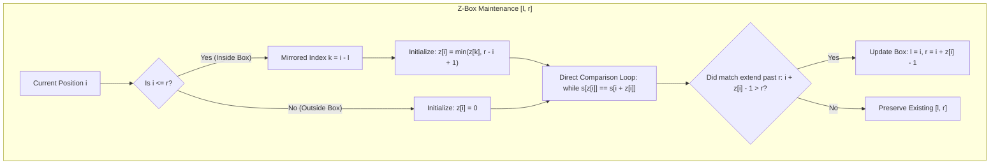
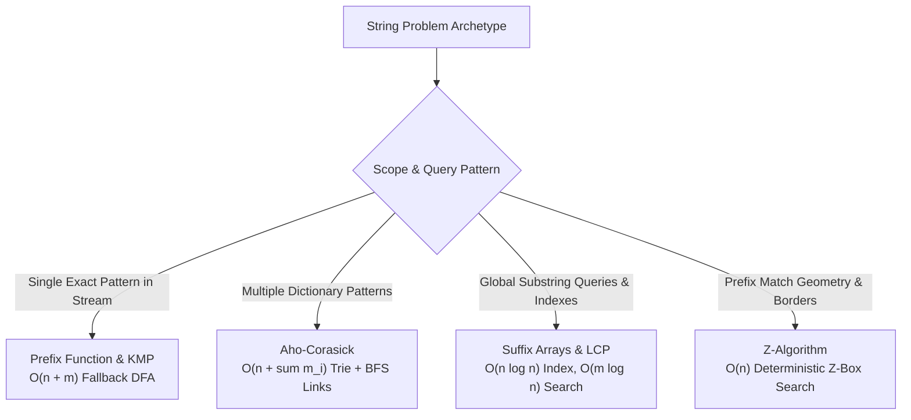

# Z-Algorithm and String Borders

> [!NOTE]
> **Dual Perspectives on Prefix Structure:** The **Z-Algorithm** computes the longest common prefix between a string $s$ and each of its suffixes in optimal $O(n)$ time.
> While the Knuth-Morris-Pratt (KMP) prefix function $\pi[i]$ looks *backward* to find the longest proper border of prefix $s[0 \dots i]$, the Z-function $z[i]$ looks *forward* from index $i$, measuring how far the substring starting at $i$ matches the initial prefix of $s$:
> - **The Z-Box Invariant:** By maintaining the rightmost matching interval $[l, r]$ where $s[l \dots r] = s[0 \dots r-l]$, the algorithm reuses prior comparisons at mirrored index $i - l$.
> - **Amortized Linear Time:** Each character comparison either reuses mirrored knowledge or advances the right boundary $r$. Since $r$ increases at most $n-1$ times, total comparisons are bounded by $2n$, guaranteeing strict $O(n)$ runtime.
> - **Versatile Applications:** Exact pattern matching via concatenation ($P + \# + T$), border extraction in $O(n)$, smallest string period identification in $O(n)$, and prefix frequency counting.
>
> Reference implementations: [C++17 Implementation](../../implementations/cpp/z_algorithm.cpp) | [Python Implementation](../../implementations/python/z_algorithm.py)

> [!TIP]
> **Dual View Comparison: Prefix Function vs. Z-Function:**
>
> | Dimension | Prefix Function $\pi[i]$ (KMP) | Z-Function $z[i]$ (Z-Algorithm) |
> |---|---|---|
> | **Perspective** | **Backward-looking:** Longest proper border of prefix $s[0 \dots i]$ | **Forward-looking:** Longest prefix match starting at position $i$ |
> | **Formal Definition** | $\max \{ k < i+1 : s[0 \dots k-1] = s[i-k+1 \dots i] \}$ | $\max \{ k : s[0 \dots k-1] = s[i \dots i+k-1] \}$ |
> | **Index 0 Convention** | $\pi[0] = 0$ (proper border cannot equal full length) | $z[0] = 0$ (standard algorithmic convention) |
> | **Construction Complexity** | $O(n)$ time, $O(n)$ space | $O(n)$ time, $O(n)$ space |
> | **Optimal Use Cases** | Online streaming search, DFA pattern compilation | Concatenation matching ($P + \# + T$), period finding, string borders |

> [!WARNING]
> **Critical Implementation Traps & Invariants:**
> 1. **Safe Reuse Invariant ($\min(z[i-l], r-i+1)$):** When $i \le r$, never blindly copy $z[i-l]$. If the mirrored match extends beyond the boundary $r$, characters past $r$ have not yet been compared against the prefix and must be checked explicitly.
> 2. **Z-Box Update Condition:** Update $[l, r]$ only when the extended match pushes past the current rightmost boundary ($i + z[i] - 1 > r$). If the match terminates before or at $r$, retain the previous $[l, r]$ box.
> 3. **Separator Invariance:** In pattern matching via $P + \# + T$, the delimiter $\#$ **must not** appear anywhere in $P$ or $T$. Without a unique separator, matches can erroneously span the pattern-text boundary.
> 4. **Boundary Guarding:** When extending matches in the comparison loop, check $i + z[i] < n$ before indexing $s[z[i]] == s[i + z[i]]$ to prevent buffer overflows on string boundaries.




Many string problems ask a simple but powerful question:

> For each position in a string, how long does the string's prefix match starting there?

The **Z-function** answers exactly that.

For a string $ s $ of length $ n $, the Z-value $ z[i] $ is the length of the longest substring starting at $ i $ that matches a prefix of $ s $.

This leads to the **Z-algorithm**, which computes all Z-values in linear time:

$$
O(n)
$$

The Z-function is useful for:

- exact pattern matching
- border detection
- period finding
- string compression style reasoning
- counting prefix occurrences
- many prefix-structure problems

This chapter develops:

- the definition of the Z-function
- the Z-box invariant
- linear-time Z-algorithm construction
- pattern matching via concatenation
- border and period applications
- relationship to the prefix function and KMP

---

## 1. What the Z-function measures

For a string $ s $, define:

$$
z[i] = \text{length of the longest prefix of } s \text{ that matches } s[i \dots]
$$

So $ z[i] $ tells us:

- start at position $ i $
- compare forward with the beginning of the string
- how many characters match?

This is a very direct kind of prefix comparison.

---

## 2. Convention for $ z[0] $

Different texts use different conventions.

Common choices are:

- $ z[0] = 0 $
- or $ z[0] = n $

In algorithmic practice, it is very common to use:

$$
z[0] = 0
$$

because the interesting comparisons are at later positions.

This chapter uses that convention.

---

## 3. Example of the Z-function

Take:

```text
s = a b a b a
    0 1 2 3 4
```

Then:

- $ z[0] = 0 $ by convention
- $ z[1] = 0 $, since `b...` does not match prefix `a...`
- $ z[2] = 3 $, because `aba` matches the prefix `aba`
- $ z[3] = 0 $
- $ z[4] = 1 $, because `a` matches prefix `a`

So:

```text
z = [0, 0, 3, 0, 1]
```

---

## 4. Why the Z-function is useful

The Z-function reveals all places where the string's prefix reappears.

That makes it natural for problems about:

- matching one pattern inside another string
- finding borders
- detecting repetition
- counting prefix occurrences

Where the prefix function looks backward at border structure of prefixes, the Z-function looks forward from each position toward the main prefix.

---

## 5. Naive computation

A direct method is:

For each position $ i $:

1. compare $ s[0], s[1], s[2], \dots $
2. against $ s[i], s[i+1], s[i+2], \dots $
3. stop at the first mismatch

In the worst case, this takes:

$$
O(n^2)
$$

For example, strings with many repeated characters can cause long repeated comparisons.

We want a linear algorithm.

---

## 6. The Z-box idea

The linear algorithm maintains an interval:

$$
[l, r]
$$

called the current **Z-box**, where:

- the substring $ s[l \dots r] $ matches the prefix $ s[0 \dots r-l] $
- among known boxes, this one extends farthest to the right

This interval lets us reuse previous comparison work.

That is the central idea of the Z-algorithm.

---

## 7. What a Z-box means

If position $ i $ lies inside the current Z-box, then we already know some information about how $ s[i \dots] $ compares to the prefix.

Why?

Because the whole box matches the prefix.

So a portion of the comparison at $ i $ is mirrored from an earlier prefix-aligned position.

This lets us avoid rechecking characters unnecessarily.

---

## 8. The two main cases

When computing $ z[i] $, there are two cases.

### Case 1: $ i > r $
Position $ i $ is outside the current Z-box.

Then we must compare from scratch.

### Case 2: $ i \le r $
Position $ i $ lies inside the current Z-box.

Then we can reuse previously computed information from the mirrored position:

$$
k = i - l
$$

This gives an initial lower bound for $ z[i] $.

---

## 9. Reuse rule inside the box

If $ i \le r $, then the substring starting at $ i $ corresponds to the prefix position $ i-l $.

So we may initialize:

$$
z[i] = \min(z[i-l],\ r-i+1)
$$

Why the minimum?

- `z[i-l]` tells how far the mirrored prefix match goes
- but we cannot assume the match extends beyond the right edge $ r $ without new comparisons

So we copy only what is safely inside the current box.

---

## 10. Extending beyond the box

After this initialization, whether from scratch or from reuse, we try to extend the match further by direct comparison.

While:

$$
i + z[i] < n
\quad \text{and} \quad
s[z[i]] = s[i + z[i]]
$$

we increase $ z[i] $.

If the new match reaches beyond the old right boundary, we update the Z-box.

---

## 11. Linear-time Z-algorithm

The full algorithm is:

1. start with `l = 0`, `r = 0`
2. for each $ i $ from 1 to $ n-1 $:
   - if $ i \le r $, initialize with the mirror rule
   - extend by direct comparison
   - if $ i + z[i] - 1 > r $, update `l` and `r`

This computes all Z-values in:

$$
O(n)
$$

time.

---

## 12. C++17 Z-function implementation

```cpp
#include <vector>
#include <string>
#include <algorithm>

std::vector<int> z_function(const std::string& s) {
    int n = static_cast<int>(s.size());
    std::vector<int> z(n, 0);

    int l = 0, r = 0;
    for (int i = 1; i < n; ++i) {
        if (i <= r) {
            z[i] = std::min(r - i + 1, z[i - l]);
        }

        while (i + z[i] < n && s[z[i]] == s[i + z[i]]) {
            ++z[i];
        }

        if (i + z[i] - 1 > r) {
            l = i;
            r = i + z[i] - 1;
        }
    }

    return z;
}
```

---

## 13. Python Z-function implementation

```python
def z_function(s):
    n = len(s)
    z = [0] * n
    l = 0
    r = 0

    for i in range(1, n):
        if i <= r:
            z[i] = min(r - i + 1, z[i - l])

        while i + z[i] < n and s[z[i]] == s[i + z[i]]:
            z[i] += 1

        if i + z[i] - 1 > r:
            l = i
            r = i + z[i] - 1

    return z
```

---

## 14. Worked example

Take:

```text
s = a a b c a a b x a a b c a a b
```

As the algorithm scans left to right, it maintains the rightmost Z-box.

When a new position falls inside the box, it can borrow information from the mirrored prefix position.

Only when needed does it extend by fresh comparisons.

This is why the algorithm avoids quadratic repetition.

A shorter concrete example is often easier to inspect by hand:

```text
s = a a a a a
z = [0, 4, 3, 2, 1]
```

---

## 15. Why the algorithm is linear

At first, the `while` loop seems dangerous.

But the key amortized fact is:

- every successful extension increases the right boundary $ r $
- $ r $ can move right at most $ n-1 $ times

So the total number of character comparisons done by extension across the entire algorithm is linear.

This is the same kind of amortized reasoning seen in KMP and Kasai's algorithm.

---

## 16. Amortization proof sketch

The expensive work is in the extension loops.

Whenever the loop succeeds, the right edge of the matched segment advances.

Since the right edge can advance only from 0 up to $ n-1 $, the total number of successful extension steps is $ O(n) $.

The remaining constant work per index is also linear.

Therefore the total running time is:

$$
O(n)
$$

---

## 17. Exact pattern matching with the Z-algorithm

A classic application is exact string matching.

To search for pattern $ p $ inside text $ t $, build:

```text
p + # + t
```

where `#` is a separator character not appearing in either string.

Then compute the Z-function on this combined string.

Whenever a Z-value equals $ |p| $, the pattern occurs at that text position.

This gives linear-time matching.

---

## 18. Why concatenation works

In the combined string:

```text
p + # + t
```

every Z-value in the text portion measures how many characters from that position match the prefix of the whole string.

But the prefix of the whole string is exactly the pattern $ p $, followed by the separator.

So a match of length $ |p| $ means:

- the pattern matches completely at that text-aligned position

This is the core idea.

---

## 19. C++17 exact matching with Z-algorithm

```cpp
#include <vector>
#include <string>

std::vector<int> z_search(const std::string& text, const std::string& pattern) {
    std::vector<int> matches;
    if (pattern.empty()) return matches;

    std::string combined = pattern + "#" + text;
    std::vector<int> z = z_function(combined);
    int m = static_cast<int>(pattern.size());

    for (int i = m + 1; i < static_cast<int>(combined.size()); ++i) {
        if (z[i] >= m) {
            matches.push_back(i - m - 1);
        }
    }

    return matches;
}
```

---

## 20. Python exact matching with Z-algorithm

```python
def z_search(text, pattern):
    if not pattern:
        return []

    combined = pattern + "#" + text
    z = z_function(combined)
    m = len(pattern)
    matches = []

    for i in range(m + 1, len(combined)):
        if z[i] >= m:
            matches.append(i - m - 1)

    return matches
```

---

## 21. Comparison with KMP for matching

Both Z-based matching and KMP solve exact matching in linear time.

### KMP
- preprocesses the pattern
- scans the text with fallback states

### Z-algorithm matching
- builds one combined string
- computes prefix matches everywhere

So they solve the same task from different viewpoints.

This makes the Z-algorithm a very natural companion to KMP.

---

## 22. Borders of a string

A **border** of a string is a proper prefix that is also a suffix.

The Z-function gives a clean way to detect borders.

If at position $ i $:

$$
i + z[i] = n
$$

then the suffix starting at $ i $ matches the prefix all the way to the end.

So $ z[i] $ is the length of a border.

This gives all border lengths directly.

---

## 23. Example of border detection

For:

```text
s = ababa
z = [0, 0, 3, 0, 1]
```

At position $ i = 2 $:

$$
2 + z[2] = 2 + 3 = 5 = n
$$

So `aba` is a border.

At position $ i = 4 $:

$$
4 + z[4] = 5
$$

So `a` is also a border.

Thus the borders are lengths 3 and 1.

---

## 24. C++17 border extraction

```cpp
#include <vector>
#include <string>
#include <algorithm>

std::vector<int> border_lengths(const std::string& s) {
    int n = static_cast<int>(s.size());
    std::vector<int> z = z_function(s);
    std::vector<int> borders;

    for (int i = 1; i < n; ++i) {
        if (i + z[i] == n) {
            borders.push_back(z[i]);
        }
    }

    std::sort(borders.begin(), borders.end());
    return borders;
}
```

---

## 25. Python border extraction

```python
def border_lengths(s):
    n = len(s)
    z = z_function(s)
    borders = []

    for i in range(1, n):
        if i + z[i] == n:
            borders.append(z[i])

    borders.sort()
    return borders
```

---

## 26. Period of a string

A string has period $ p $ if:

- characters repeat every $ p $ positions
- and usually $ n \bmod p = 0 $ when asking for an exact repetition block

Using Z-values, a candidate period $ p $ works if:

$$
p + z[p] = n
$$

and:

$$
n \bmod p = 0
$$

This means the suffix starting at $ p $ matches the prefix for the whole remaining string.

---

## 27. Smallest period using Z-values

We can scan period candidates from 1 upward.

The first $ p $ satisfying:

$$
p + z[p] = n
\quad \text{and} \quad
n \bmod p = 0
$$

is the smallest exact period.

If none works, the whole string length $ n $ is the smallest period.

---

## 28. C++17 smallest period via Z

```cpp
#include <string>
#include <vector>

int smallest_period_z(const std::string& s) {
    int n = static_cast<int>(s.size());
    if (n == 0) return 0;

    std::vector<int> z = z_function(s);
    for (int p = 1; p < n; ++p) {
        if (p + z[p] == n && n % p == 0) {
            return p;
        }
    }
    return n;
}
```

---

## 29. Python smallest period via Z

```python
def smallest_period_z(s):
    n = len(s)
    if n == 0:
        return 0

    z = z_function(s)
    for p in range(1, n):
        if p + z[p] == n and n % p == 0:
            return p
    return n
```

---

## 30. Counting occurrences of each prefix

The Z-function can help answer:

> how many times does each prefix of the string occur inside the string?

If $ z[i] = L $, then prefixes of lengths:

$$
1, 2, \dots, L
$$

all occur starting at position $ i $.

With a frequency accumulation strategy, we can count how often each prefix length appears.

This is a classical and useful application.

---

## 31. Distinct viewpoints: Z-function vs prefix function

The Z-function and prefix function both describe prefix structure, but from different angles.

### Prefix function
For each prefix ending at position $ i $, it asks:

- what is the longest proper border here?

### Z-function
For each starting position $ i $, it asks:

- how far does the main prefix match from here?

So they are closely related, but not identical.

---

## 32. Example comparison

For:

```text
s = ababa
```

we have:

```text
prefix function = [0, 0, 1, 2, 3]
z-function      = [0, 0, 3, 0, 1]
```

These arrays look different because they encode different geometric views of the same string:

- prefix function looks backward at borders of prefixes
- Z-function looks forward at prefix matches starting at positions

This comparison is pedagogically important.

---

## 33. Conversion note

It is possible to convert:

- prefix function → Z-function
- Z-function → prefix function

in linear time with careful logic.

That means they contain essentially equivalent structural information.

But in practice, one representation is often more natural depending on the problem.

---

## 34. When Z is more natural than KMP

Z-based reasoning is often especially natural when the problem is phrased as:

- compare the string's prefix against every suffix-start position
- find all prefix repeats
- find borders or periods
- do pattern matching via concatenation

KMP is often more natural when you want a streaming pattern-matching state machine.

So both are important tools.

---

## 35. Empty strings and edge cases

Be explicit about small cases.

### Empty string
A common convention is:
- `z_function("")` returns `[]`

### Single-character string
- `z = [0]`

### Repeated-character strings
These are good stress tests because they produce large Z-values:

```text
aaaaa -> [0, 4, 3, 2, 1]
```

Such cases are useful for verifying correctness.

---

## 36. Common mistakes

### Mistake 1: forgetting the `min` inside the Z-box
Inside the box, initialize with:

$$
\min(z[i-l],\ r-i+1)
$$

not just `z[i-l]`.

### Mistake 2: updating the Z-box incorrectly
The new box should become:

- `l = i`
- `r = i + z[i] - 1`

when the match extends farther right.

### Mistake 3: mishandling $ z[0] $
Choose a convention and use it consistently.

### Mistake 4: forgetting the separator in pattern matching
Without a separator not present in either string, concatenation can create false matches across the boundary.

### Mistake 5: confusing borders with arbitrary repeated substrings
Borders must be both prefix and suffix of the whole string.

### Mistake 6: claiming the while loops make the algorithm quadratic
The amortized analysis shows total extension work is linear.

---

## 37. Correctness intuition

The current Z-box represents a region already known to match the prefix.

If position $ i $ lies inside that box, then part of its answer is mirrored from a previously solved prefix-aligned position.

The algorithm copies only the portion guaranteed to lie within the box and extends further only when necessary.

So it never misses a possible match, and it never repeats too much work.

That is why it is correct and efficient.

---

## 38. Complexity summary

For a string of length $ n $:

### Z-function construction
$$
O(n)
$$

### Pattern matching with concatenation
For text length $ n $ and pattern length $ m $:

$$
O(n + m)
$$

### Border extraction
$$
O(n)
$$

### Smallest period
$$
O(n)
$$

These are all linear-time applications after or during Z computation.

---

## 39. Comparison table

| Technique | Main idea | Typical use |
|---|---|---|
| Brute-force matching | try all alignments | simple baseline |
| Prefix function / KMP | border fallback on one pattern | streaming exact matching |
| Z-algorithm | prefix match length at every position | pattern matching by concatenation, borders, periods |
| Aho-Corasick | trie plus failure links | multi-pattern matching |
| Suffix array + LCP | sorted suffix structure | global substring queries |

This places the Z-algorithm inside the larger string toolkit.

---

## 40. Worked exact-matching example

Suppose:

```text
pattern = aba
text    = abacaba
combined = aba#abacaba
```

Compute Z on the combined string.

Wherever the Z-value equals 3, the full pattern `aba` begins at that corresponding text position.

This gives matches at positions:

```text
0 and 4
```

This is one of the cleanest demonstrations of Z-based matching.

---

## 41. Why Z is a good capstone string algorithm

The Z-algorithm is valuable because it ties together several themes from earlier chapters:

- prefix structure, like KMP
- exact matching, like KMP
- border and repetition analysis, like prefix-function applications
- linear-time amortized string processing, like Kasai and KMP

So it works well as a concluding foundational string chapter.

---

## 42. Summary

The Z-function records, for every position in a string, how long the string's prefix matches starting there.

The Z-algorithm computes all these values in linear time using the Z-box invariant.

Its main applications include:

- exact pattern matching via concatenation
- border detection
- smallest period detection
- prefix occurrence reasoning

The most important lessons are:

- prefix structure can be viewed from multiple angles
- the Z-box lets us reuse previous comparisons safely
- linear time comes from amortized right-boundary growth
- the Z-function is a natural companion to the prefix function and KMP

This makes the Z-algorithm one of the core deterministic linear-time tools in string algorithms.

---

## 43. Practice prompts

1. What does $ z[i] $ represent?
2. Why is a naive Z-function computation quadratic?
3. What is a Z-box?
4. Why do we use $ \min(z[i-l], r-i+1) $ inside the box?
5. Why is the Z-algorithm linear?
6. How does concatenation enable exact pattern matching?
7. Why is a separator needed in Z-based matching?
8. How do Z-values reveal borders of a string?
9. How can Z-values be used to detect the smallest period?
10. How is the Z-function different from the prefix function?

---

## 44. Suggested next topics

A natural continuation after the Z-algorithm is:

- rolling hash and Rabin-Karp
- suffix automata
- palindromic tree
- Lyndon factorization
- compressed text indexing

---

## 45. Milestone Capstone: The Complete String Toolkit

With the completion of the Z-Algorithm, **Domain 11: Strings, Text & Pattern Matching** establishes an end-to-end, mathematically unified string processing architecture:



| Technique | Theoretical Model | Time Complexity | Core Invariant / Mechanism |
|---|---|---|---|
| **[Prefix Function & KMP](prefix-function-and-kmp.md)** | Longest proper prefix-suffix fallback | $O(n + m)$ | Prefix border chain $\pi[\pi[\dots]]$ |
| **[Aho-Corasick](aho-corasick.md)** | Generalized trie automaton with suffix links | $O(n + \sum m_i + \text{matches})$ | BFS failure transitions + dictionary output links |
| **[Suffix Arrays & LCP](suffix-arrays-and-lcp.md)** | Lexicographically sorted suffixes & common prefixes | $O(n \log^2 n)$ / $O(n \log n)$ SA, $O(n)$ LCP | Prefix doubling + Kasai amortized $h$ invariant |
| **[Z-Algorithm](z-algorithm.md)** | Forward prefix-match geometry | $O(n)$ | Rightmost Z-box $[l, r]$ mirror reuse |

Together, these four flagship chapters span the full spectrum from online stream processing to multi-pattern dictionary matching, global offline indexing, and forward-matching string combinatorics.

