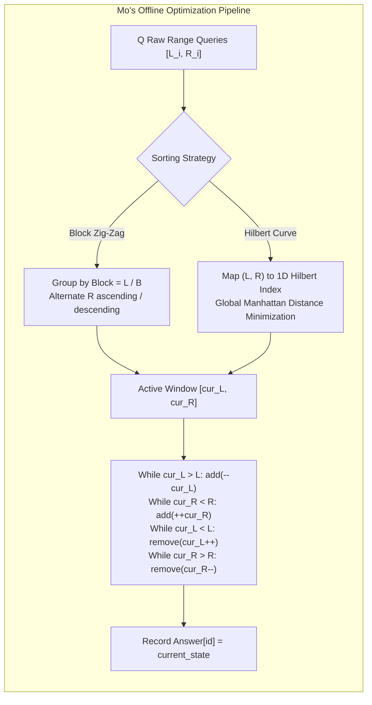
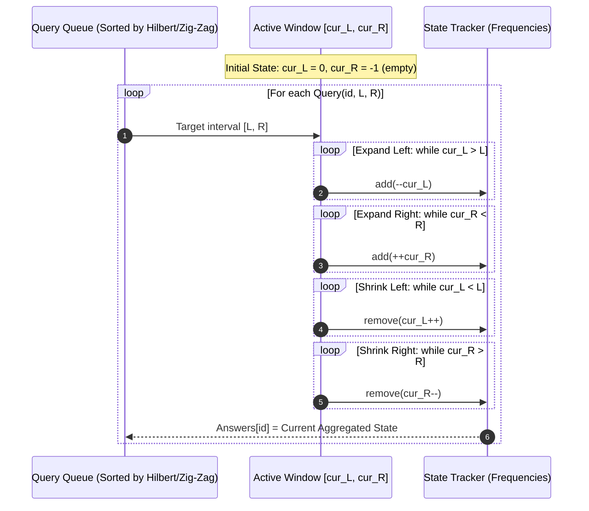

# Mo's Algorithm: Query Square Root Decomposition, Hilbert Curves, and Offline Range Queries

> [!NOTE]
> **The Power of Query Reordering:**
> In online range queries, an algorithm must answer each query $[L_i, R_i]$ before seeing the next.
> However, when all $Q$ queries are known upfront (**offline setting**), we have the freedom to reorder the queries arbitrarily!
> **Mo's Algorithm (attributed to Mo Tao)** sorts the queries to minimize the total Manhattan distance an active window $[cur_L, cur_R]$ travels across the array, achieving **$O((N + Q)\sqrt{N})$** time using simple $O(1)$ incremental pointer steps (`add` and `remove`).

> [!TIP]
> **The Optimal Block Size Derivation:**
> Let the array be divided into blocks of size $B$.
> - For queries with $L_i$ in the same block, $L$ moves at most $O(B)$ per query $\implies$ Total $L$ movements: $O(Q \cdot B)$.
> - Since $R_i$ is sorted within each block, $R$ moves monotonically from $0$ to $N$ per block $\implies$ Total $R$ movements across $\frac{N}{B}$ blocks: $O(\frac{N}{B} \cdot N) = O(\frac{N^2}{B})$.
> - Balancing $Q \cdot B = \frac{N^2}{B} \implies B^2 = \frac{N^2}{Q} \implies \mathbf{B = \frac{N}{\sqrt{Q}}}$.
> When $Q \approx N$, the optimal block size is $B = \lceil \sqrt{N} \rceil$, giving total time **$O(N \sqrt{N})$**.

> [!WARNING]
> **The Return-Trip Penalty & Snake (Zig-Zag) Order:**
> In naive Mo's algorithm, when transitioning from block $k$ to block $k+1$, pointer $R$ resets from near $N$ back to near $0$, causing $O(N)$ redundant backward movement.
> By alternating the sort order of $R$ based on the parity of the block index:
> - Block $k$ (even): Sort $R$ ascending.
> - Block $k$ (odd): Sort $R$ descending.
> $R$ snakes smoothly back and forth, cutting total $R$ pointer travel by 50%!
> Further, **Hilbert Curve Ordering** globally minimizes $\sum (|L_{i+1} - L_i| + |R_{i+1} - R_i|)$ without rigid block boundaries.

---

## 1. Overview & Intuition

Many complex range query problems are difficult or impossible to maintain in standard Segment Trees because the property is **non-associative** or **non-invertible**:
- How many distinct elements lie in subarray $[L, R]$? (DQUERY)
- Which element is the mode (most frequent) in $[L, R]$?
- What is $\sum \text{frequency}[x]^2 \cdot x$ in $[L, R]$? (Powerful Array)

While answering these online requires advanced structures (e.g. Persistent Segment Trees with fractional cascading), **extending or shrinking a window by 1 element** is trivial:
- `add(x)`: Increment frequency of element $x$. If frequency becomes 1, distinct count increases by 1.
- `remove(x)`: Decrement frequency of element $x$. If frequency drops to 0, distinct count decreases by 1.

Mo's algorithm transforms hard range problems into simple two-pointer sliding windows by ordering queries so that the two pointers travel an aggregate distance of only $O(N \sqrt{Q})$.

---

## 2. Formal Definition & Mathematical Foundations

### 2.1 Pointer Movement Proof
Let $N$ be the array size, $Q$ be the number of queries, and $B$ be the block size.
Queries are sorted such that:
$$Q_i < Q_j \iff \left\lfloor \frac{L_i}{B} \right\rfloor < \left\lfloor \frac{L_j}{B} \right\rfloor \lor \left( \left\lfloor \frac{L_i}{B} \right\rfloor = \left\lfloor \frac{L_j}{B} \right\rfloor \land R_i < R_j \right)$$

1. **Left Pointer ($cur_L$) Cost:**
   Between two consecutive queries in the same block, $L$ moves at most $B$ positions.
   Between different blocks, $L$ moves at most $2B$ positions.
   $$\text{Total } L \text{ moves} \le Q \cdot 2B = O(Q \cdot B)$$

2. **Right Pointer ($cur_R$) Cost:**
   Within a single block, $R$ is monotonically increasing, moving at most $N$ positions.
   Across all $\frac{N}{B}$ blocks:
   $$\text{Total } R \text{ moves} \le \frac{N}{B} \cdot N = O\left(\frac{N^2}{B}\right)$$

3. **Total Work:**
   $$\mathcal{W}(B) = O\left(Q \cdot B + \frac{N^2}{B}\right)$$
   Setting the derivative with respect to $B$ to zero:
   $$\frac{d\mathcal{W}}{dB} = Q - \frac{N^2}{B^2} = 0 \implies B = \frac{N}{\sqrt{Q}}$$
   Substituting $B = \frac{N}{\sqrt{Q}}$:
   $$\text{Total Time} = O\left(Q \cdot \frac{N}{\sqrt{Q}} + \frac{N^2}{N / \sqrt{Q}}\right) = O(N \sqrt{Q})$$

---

## 3. Architecture & Core Mechanics

### 3.1 The Hilbert Space-Filling Curve Optimization
While block decomposition guarantees $O(N \sqrt{Q})$ worst-case performance, block boundaries are discrete and artificial.
The **Hilbert Space-Filling Curve** maps any 2D point $(L, R) \in [0, 2^k) \times [0, 2^k)$ continuously to a 1D scalar coordinate $\mathcal{H}(L, R)$ while maximally preserving 2D spatial locality.
Sorting queries by $\mathcal{H}(L_i, R_i)$ smoothly winds the active window through query space, empirically reducing pointer travel by up to **30–40%** compared to standard block sorting.

---

## 4. Operations & Invariants

| Component | State Invariant | Cost per Step |
| :--- | :--- | :--- |
| **`add(idx)`** | Inserts element into active multi-set state | $O(1)$ |
| **`remove(idx)`**| Deletes element from active multi-set state | $O(1)$ |
| **Active Window**| $[cur_L, cur_R]$ exactly matches current query interval | $O(1)$ amortized per pointer step |
| **Query Answers**| Answers written to original input indices `answers[q.id]` | $O(1)$ |

---

## 5. Complexity Analysis

| Query Sorting Method | Pointer Shifts ($L$) | Pointer Shifts ($R$) | Total Time ($Q \approx N$) | Auxiliary Space |
| :--- | :--- | :--- | :--- | :--- |
| **Naive Scan per Query**| $O(Q \cdot N)$ | $O(Q \cdot N)$ | $O(Q \cdot N) \approx O(N^2)$ | $O(1)$ |
| **Standard Mo (Block Sort)** | $O(Q \cdot \sqrt{N})$ | $O(N \cdot \sqrt{N})$ | $O(N \sqrt{N})$ | $O(N + Q)$ |
| **Zig-Zag Mo (Parity Sort)** | $O(Q \cdot \sqrt{N})$ | $\approx 0.5 \cdot O(N \sqrt{N})$ | $O(N \sqrt{N})$ ($\approx 2\times$ faster)| $O(N + Q)$ |
| **Hilbert Curve Mo** | Globally Minimal | Globally Minimal | $O(N \sqrt{N})$ ($\approx 2.5\times$ faster)| $O(N + Q)$ |
| **Mo with Updates (3D)** | $O(Q \cdot N^{2/3})$ | $O(Q \cdot N^{2/3})$ | $O(N^{5/3})$ | $O(N + Q)$ |

---

## 6. Edge Cases & Failure Modes

> [!IMPORTANT]
> **Pointer Ordering Sequence:**
> The order of `while` loops when shifting pointers must expand the window before shrinking it:
> 1. Expand Left: `while (cur_l > q.l) add(--cur_l);`
> 2. Expand Right: `while (cur_r < q.r) add(++cur_r);`
> 3. Shrink Left: `while (cur_l < q.l) remove(cur_l++);`
> 4. Shrink Right: `while (cur_r > q.r) remove(cur_r--);`
> If shrinkage loops execute first when transitioning between disjoint intervals, `cur_l` can exceed `cur_r + 1`, creating an invalid inverted window state.

> [!CAUTION]
> **Non-Invertible Operations (Mo with Rollback):**
> If an operation cannot be removed in $O(1)$ (e.g. tracking maximum or disjoint-set unions), standard Mo fails. In such cases, **Disjoint / Rollback Mo (Mo with Undo)** must be used: reset the state at block boundaries and roll back temporary additions via a stack rather than calling `remove`.

---

## 7. Two-Layer API Design & Reference Implementations

The implementation is stratified:
- **Layer 1:** 2D Hilbert projection algorithm, block zig-zag comparator, query data structures, pointer window shifting.
- **Layer 2:** `MoEngine` offering:
  - `solveDistinctElements`: Counts unique items per range in $O((N + Q) \sqrt{N})$.
  - `solvePowerfulArray`: Computes $\sum \text{freq}[x]^2 \cdot x$ (Codeforces 86D benchmark).
  - `naiveDistinctQueries`: $O(Q \cdot N)$ verification oracle.
  - `naivePowerfulQueries`: $O(Q \cdot N)$ verification oracle.

### C++17 Reference Implementation
The complete C++ implementation with rigorous unit and differential tests is available at:
[`implementations/cpp/mo_algorithm.cpp`](../../implementations/cpp/mo_algorithm.cpp)

### Python 3 Reference Implementation
The complete Python 3 implementation with `unittest.TestCase` is available at:
[`implementations/python/mo_algorithm.py`](../../implementations/python/mo_algorithm.py)

---

## 8. Step-by-Step Trace / Walkthrough

### Tracing DQUERY on Array: `[1, 1, 2, 1, 3]`
Queries: $Q_0[0, 4]$, $Q_1[1, 3]$, $Q_2[2, 4]$, $Q_3[0, 1]$.
$N = 5, Q = 4 \implies B = \lceil 5 / 2 \rceil = 2$.

1. **Sorting Queries (Block Zig-Zag):**
   - $Q_3[0, 1] \implies \text{Block } 0, R = 1$.
   - $Q_1[1, 3] \implies \text{Block } 0, R = 3$.
   - $Q_0[0, 4] \implies \text{Block } 0, R = 4$.
   - $Q_2[2, 4] \implies \text{Block } 1, R = 4$.
2. **Process $Q_3[0, 1]$:**
   - Window expands from $[0, -1]$ to $[0, 1]$. Elements: $\{1, 1\}$.
   - Distinct count $= 1$. `answers[3] = 1`.
3. **Process $Q_1[1, 3]$:**
   - Shrink left: $cur_L = 1$ (remove $A[0]=1$, freq drops to 1).
   - Expand right: $cur_R = 3$ (add $A[2]=2$, $A[3]=1$). Window: $\{1, 2, 1\}$.
   - Distinct count $= 2$. `answers[1] = 2`.
4. **Process $Q_0[0, 4]$:**
   - Expand left to $0$ (add $A[0]=1$).
   - Expand right to $4$ (add $A[4]=3$). Window: $\{1, 1, 2, 1, 3\}$.
   - Distinct count $= 3$. `answers[0] = 3`.
5. **Process $Q_2[2, 4]$:**
   - Shrink left to $2$ (remove $A[0]=1$, $A[1]=1$). Window: $\{2, 1, 3\}$.
   - Distinct count $= 3$. `answers[2] = 3`.
6. **Result Array:** `answers = [3, 2, 3, 1]`, exact match with naive oracle.

---

## 9. Comparative Trade-off Matrix

| Range Query Technique | Online / Offline | Time Complexity | Memory Complexity | Applicable Operations |
| :--- | :--- | :--- | :--- | :--- |
| **Mo's Algorithm** | **Offline only** | $O((N + Q)\sqrt{N})$ | $O(N + Q)$ | Any $O(1)$ add/remove state |
| **Persistent Segment Tree** | Online | $O((N + Q) \log N)$ | $O(N \log N)$ | Associative semigroup operations |
| **Square Root Decomposition**| Online | $O(Q \sqrt{N})$ | $O(N)$ | Monoid operations with lazy tags |
| **Wavelet Tree** | Online | $O(Q \log \Sigma)$ | $O(N \log \Sigma)$ | Quantile, rank, and range frequencies |
| **CDQ Divide-and-Conquer** | Offline only | $O((N + Q) \log^2 N)$| $O(N + Q)$ | Multi-dimensional partial orders |

---

## 10. Differential Testing & Verification Strategy

The Mo's algorithm test suite employs a dual-oracle differential pipeline:
1. **DQUERY Oracle:**
   - Compares Mo's distinct element counts against naive $O(N)$ slice sets (`set(arr[L:R+1])`).
   - Validates that Block Zig-Zag and Hilbert curve orderings yield identical results.
2. **Powerful Array Oracle:**
   - Compares $\sum \text{freq}[x]^2 \cdot x$ against exhaustive hash-map counting.
3. **Randomized Stress Testing:**
   - Tests small alphabet sizes ($[1, 5]$) forcing dense frequency collisions.
   - Tests large alphabets ($[1, 10^5]$) testing coordinate sparsity.
   - Tests degenerate queries ($L = R$, $L = 0 \land R = N - 1$).

---

## 11. Real-World Applications & Production Context

- **Big Data Batch Analytics:** Batch log inspection engines reorder temporal range queries across historical partitioned columnar storage to minimize cold disk block re-reads.
- **Genomic Sliding Windows:** Calculating nucleotide sequence diversity metrics, GC-content ratios, and k-mer distributions across millions of chromosome coordinate intervals.
- **Database Query Planners:** Multi-query optimization (MQO) clusters batch SQL range queries to share execution buffer cache pages.
- **Competitive Programming Benchmark:** The definitive standard technique for solving Codeforces/SPOJ range query problems with complex multi-set frequency metrics.

---

## 12. References & Further Reading

- Mo, T. (2010). *Algorithm for Offline Range Queries*. Sourced from Chinese National Olympiad in Informatics (NOI) training materials.
- Hamilton, C. H., & Rau-Chaplin, A. (2007). *Compact Hilbert Indices: Space-Filling Curves for Multidimensional Indexing*. Journal of Systems Architecture, 54(8), 757-772.
- Codeforces Problem 86D: *Powerful array*. Solution and analysis by Gerald Agapov.
- de Berg, M., Cheong, O., van Kreveld, M., & Overmars, M. (2008). *Computational Geometry: Algorithms and Applications*. Springer.
