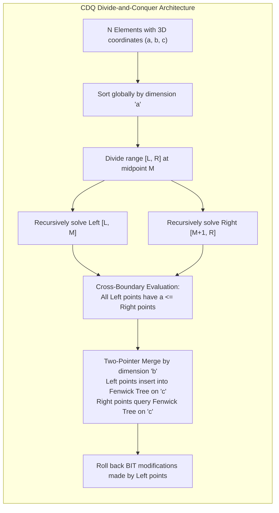
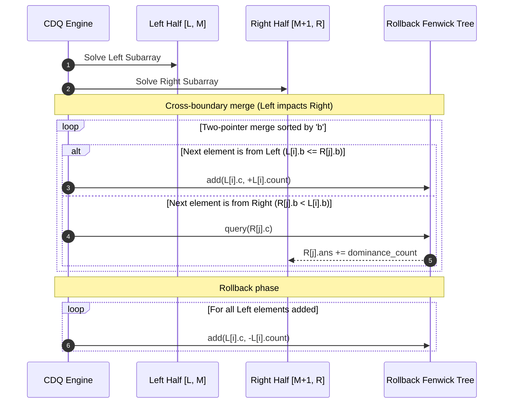

# Offline Query Processing: CDQ Divide-and-Conquer, Sweep-Line Structures, and Multi-Dimensional Reductions

> [!NOTE]
> **Online vs Offline Algorithmic Complexity:**
> In online computation, queries and updates arrive sequentially and must be answered immediately.
> When all operations are known in advance (**the offline model**), we can re-index, sort, and process operations across time.
> Problems requiring heavy dynamic data structures (such as dynamic 2D segment trees or fractional cascading) can often be solved with simple static arrays using **Offline Sweep-Line ($O((N + Q) \log N)$)** or **CDQ Divide-and-Conquer ($O(N \log^{d-1} N)$)**.

> [!TIP]
> **The Dimension Elimination Paradigm (CDQ Divide-and-Conquer):**
> Introduced by Danqi Chen in 2008, CDQ divide-and-conquer eliminates multi-dimensional constraints sequentially:
> 1. **Dimension 1 ($X$):** Eliminated via initial sorting ($O(N \log N)$).
> 2. **Dimension 2 ($Y$):** Eliminated via Divide-and-Conquer: left-half points naturally have $x_{\text{left}} \le x_{\text{right}}$. We sort both halves by $y$ in $O(N)$ using two-pointer merging.
> 3. **Dimension 3 ($Z$):** Eliminated using a 1D Fenwick tree (Binary Indexed Tree) to accumulate left-half updates and evaluate right-half queries in $O(\log N)$.
> Recurrence: $T(N) = 2T(N/2) + O(N \log N) \implies \mathbf{O(N \log^2 N)}$.

> [!WARNING]
> **Rollback Hygiene: Avoid O(N) Memset Traps:**
> In CDQ divide-and-conquer, after querying the Fenwick tree for the right half, all updates made by the left half must be erased before returning.
> Using `std::fill` or `memset` over the entire tree size costs $O(\text{universe})$ on every recursive level, degrading runtime to $O(N^2)$.
> **Fix:** Roll back **only** the modified indices: iterate through the left half and subtract `elems[p].count` from the Fenwick tree in $O(N_L \log N)$ time.

---

## 1. Overview & Intuition

How can we count how many items dominate each other in multi-dimensional space (e.g. finding points $j$ where $a_j \le a_i, b_j \le b_i, c_j \le c_i$)?
- In 1D: Trivial sort in $O(N \log N)$.
- In 2D: Sort by $X$, query prefix sums on $Y$ via Fenwick Tree in $O(N \log N)$.
- In 3D: A naive dynamic 2D segment tree requires $O(N \log^2 N)$ time with massive pointer overhead ($> 50 \times N$ bytes).

**Offline Processing** provides two clean, cache-friendly alternatives:
1. **Offline Sweep-Line:** Sort queries by right boundary $R$, update the "last seen position" of elements, and answer range queries with a 1D Fenwick Tree (e.g. solving DQUERY in $O((N + Q) \log N)$ vs Mo's $O(N \sqrt{Q})$).
2. **CDQ Divide-and-Conquer:** Converts multi-dimensional partial order searches into nested merges, entirely eliminating dynamic tree allocations.

---

## 2. Formal Definition & Mathematical Foundations

### 2.1 3D Partial Order (Dominance Counting)
Given $N$ elements $P = \{p_1, p_2, \dots, p_N\}$, where each $p_i = (a_i, b_i, c_i) \in \mathbb{R}^3$:
$$\text{Dominance}(p_i) = \Big| \{ p_j \in P \setminus \{p_i\} \mid a_j \le a_i \land b_j \le b_i \land c_j \le c_i \} \Big|$$

### 2.2 CDQ Recurrence Derivation
At each recursive step on range $[L, R]$ of length $K = R - L + 1$:
1. Left half $[L, M]$ and right half $[M+1, R]$ are solved recursively: $2 T(K/2)$.
2. Left half updates are applied to a 1D Fenwick tree while right half queries are answered:
   $$\text{Work} = O(K \log (\text{max } c)) = O(K \log N)$$
3. The recurrence relation is:
   $$T(N) = 2T(N/2) + O(N \log N)$$
Using the Master Theorem (Case 2 with logarithmic factor):
$$T(N) = O(N \log^2 N)$$
Auxiliary memory is strictly $O(N)$ for coordinate compression and temporary merge buffers.

---

## 3. Architecture & Core Mechanics

### 3.1 Offline Sweep-Line Range Queries (DQUERY)
To answer $Q$ range queries for distinct elements $[L_i, R_i]$:
1. Group all queries by their right endpoint $R$.
2. Sweep index $r$ from $0$ to $N - 1$:
   - If value $A[r]$ previously appeared at index `last_pos[A[r]]`, subtract $1$ at that index in a Fenwick tree.
   - Insert $+1$ at current index $r$ in the Fenwick tree.
   - Record `last_pos[A[r]] = r`.
   - For all queries ending at $r$, the answer is simply the range sum in the Fenwick tree from $L_i$ to $R_i$!
3. Runtime: **$O((N + Q) \log N)$**, strictly outperforming Mo's $O(N \sqrt{Q})$ algorithm while using only $O(N)$ memory.

---

## 4. Operations & Invariants

| Operation | Invariant Maintained | Algorithmic Mechanism |
| :--- | :--- | :--- |
| **Global Initial Sort** | $a_1 \le a_2 \le \dots \le a_N$ | Dimension 1 invariant |
| **CDQ Recursive Split** | All points in $[L, M]$ have $a \le$ all points in $[M+1, R]$ | Halving recursion |
| **In-place Merge by $b$**| Subarray sorted by dimension $b$ | Two-pointer linear merge |
| **Fenwick Rollback** | Fenwick tree is completely clear after merge pass | Exact inversion subtraction loop |
| **Offline Sweep** | Each distinct value represented exactly once (at rightmost position)| `last_pos` replacement |

---

## 5. Complexity Analysis

| Technique | Problem Dimension | Time Complexity | Auxiliary Space | Dynamic Updates |
| :--- | :--- | :--- | :--- | :--- |
| **Naive All-Pairs** | Any $d$ | $O(N^2)$ | $O(1)$ | Supported |
| **Offline Sweep-Line + BIT** | 2D Range Queries | $O((N + Q) \log N)$ | $O(N + Q)$ | No (Offline only) |
| **CDQ Divide-and-Conquer** | 3D Partial Order | $O(N \log^2 N)$ | $O(N)$ | Offline dynamic |
| **CDQ Divide-and-Conquer** | $d$-D Partial Order | $O(N \log^{d-1} N)$ | $O(N)$ | Offline dynamic |
| **Dynamic 2D Segment Tree** | 3D Partial Order | $O(N \log^2 N)$ | $O(N \log^2 N)$ | Online supported |

---

## 6. Edge Cases & Failure Modes

> [!IMPORTANT]
> **Identical Points in Multi-Dimensional Dominance:**
> If multiple elements share the exact same coordinates $(a, b, c)$, sorting orders can place identical points in both left and right halves.
> If left points do not count right points, identical points will receive incomplete counts.
> **Fix:** Deduplicate points initially, storing a multiplicity `count`. Identical copies dominate each other: add $(\text{count} - 1)$ to each point's dominance result.

> [!CAUTION]
> **Fenwick Tree 1-Based Indexing:**
> Coordinate compression maps values to range $[1, K]$. Querying or adding to index $0$ in standard Fenwick trees triggers infinite bitwise loops (`idx += idx & -idx` with $0$ never advances). Always map compressed coordinates to $\ge 1$.

---

## 7. Two-Layer API Design & Reference Implementations

The implementation is structured into:
- **Layer 1:** Fast `RollbackFenwickTree`, coordinate compression, 3D element definitions, and CDQ merge mechanics.
- **Layer 2:** `OfflineQueryEngine` offering:
  - `solve3DPartialOrder(points)`: Optimal $O(N \log^2 N)$ CDQ dominance counter.
  - `solveDistinctRangeQueries(arr, queries)`: $O((N + Q) \log N)$ offline sweep-line DQUERY.
  - `naive3DPartialOrder`: Exhaustive $O(N^2)$ verification oracle.
  - `naiveDistinctQueries`: $O(Q \cdot N)$ verification oracle.

### C++17 Reference Implementation
The complete C++ implementation with rigorous unit and differential tests is available at:
[`implementations/cpp/offline_query_processing.cpp`](../../implementations/cpp/offline_query_processing.cpp)

### Python 3 Reference Implementation
The complete Python 3 implementation with `unittest.TestCase` is available at:
[`implementations/python/offline_query_processing.py`](../../implementations/python/offline_query_processing.py)

---

## 8. Step-by-Step Trace / Walkthrough

### Tracing CDQ 3D Partial Order on 4 Points:
$P_0(1, 1, 1)$, $P_1(2, 2, 2)$, $P_2(3, 3, 3)$, $P_3(1, 2, 3)$

1. **Sort by $(a, b, c)$:**
   $P_0(1, 1, 1) \le P_3(1, 2, 3) \le P_1(2, 2, 2) \le P_2(3, 3, 3)$.
2. **Top-Level Split:**
   Left half: $\{P_0(1, 1, 1), P_3(1, 2, 3)\}$. Right half: $\{P_1(2, 2, 2), P_2(3, 3, 3)\}$.
   All Left points have $a \le 1$; all Right points have $a \ge 2$.
3. **Internal Left Recursion:**
   $P_0(1, 1, 1)$ vs $P_3(1, 2, 3)$:
   $P_0.b = 1 \le P_3.b = 2$. $P_0.c = 1 \le P_3.c = 3$.
   $P_0$ added to BIT at $c=1$. $P_3$ queries BIT at $c=3$ $\implies +1$.
   $P_3$ receives $+1$ dominance.
4. **Cross-Boundary Merge (Left vs Right):**
   Left elements sorted by $b$: $P_0(b=1), P_3(b=2)$.
   Right elements sorted by $b$: $P_1(b=2), P_2(b=3)$.
   - $P_0(b=1)$ merged: BIT.add($c=1, +1$).
   - $P_1(b=2)$ queries BIT at $c=2$: matches $P_0(c=1) \implies P_1$ gets $+1$.
   - $P_3(b=2)$ merged: BIT.add($c=3, +1$).
   - $P_2(b=3)$ queries BIT at $c=3$: matches $P_0(c=1)$ and $P_3(c=3) \implies P_2$ gets $+2$.
5. **Right Subarray Recursion:**
   $P_1(2, 2, 2)$ dominates $P_2(3, 3, 3) \implies P_2$ gets $+1$.
6. **Final Counts:**
   $P_0 = 0, \quad P_1 = 1 \text{ (from } P_0), \quad P_2 = 3 \text{ (from } P_0, P_1, P_3), \quad P_3 = 1 \text{ (from } P_0)$.
   Matches $O(N^2)$ ground truth!

---

## 9. Comparative Trade-off Matrix

| Range Query Technique | Online / Offline | Time Complexity | Auxiliary Space | Dynamic Updates |
| :--- | :--- | :--- | :--- | :--- |
| **Offline Sweep-Line + BIT** | **Offline** | $O((N + Q) \log N)$ | $O(N + Q)$ | Static intervals |
| **Mo's Algorithm** | **Offline** | $O((N + Q) \sqrt{N})$ | $O(N + Q)$ | Any $O(1)$ add/remove |
| **CDQ Divide-and-Conquer** | **Offline** | $O(N \log^{d-1} N)$ | $O(N)$ | Dynamic updates via time dimension |
| **Persistent Segment Tree** | Online | $O((N + Q) \log N)$ | $O(N \log N)$ | Versioned history |
| **KD-Tree** | Online | $O(\sqrt{N} + K)$ | $O(N)$ | Spatial point sets |

---

## 10. Differential Testing & Verification Strategy

The test harness exercises both offline query pipelines:
1. **CDQ 3D Dominance Oracle:**
   - Compares CDQ output against naive $O(N^2)$ pairwise checking.
   - Evaluates random coordinate distributions with dense coordinate collisions.
2. **Offline Sweep-Line DQUERY Oracle:**
   - Compares distinct count results against brute-force slice sets (`set(arr[L:R+1])`).
   - Asserts exact match across all queries.
3. **Rollback Integrity Checks:**
   - Asserts that the Fenwick tree is completely empty after each recursive merge pass.

---

## 11. Real-World Applications & Production Context

- **Skyline Queries & Pareto Frontiers:** Multi-criteria decision analysis (e.g. finding products that are not dominated in price, weight, and delivery time) uses CDQ divide-and-conquer to eliminate non-Pareto optimal candidates in $O(N \log N)$.
- **Database Query Plan Compilation:** Analytical database engines (DuckDB, Snowflake) sort offline batch window functions to execute prefix aggregates with zero disk spill.
- **Computational Geometry (Klee's Measure Problem):** Computing the volume of the union of $N$ axis-aligned 3D boxes uses CDQ divide-and-conquer to replace dynamic 2D segment trees.
- **Competitive Programming Benchmark:** The quintessential technique for solving higher-dimensional range query problems under strict memory limits ($< 64\text{ MB}$).

---

## 12. References & Further Reading

- Chen, D. (2008). *Divide and Conquer of Operations and Its Applications*. Chinese National Olympiad in Informatics (NOI) Winter Camp Lecture Notes.
- Bentley, J. L. (1980). *Multidimensional Divide-and-Conquer*. Communications of the ACM, 23(4), 214-229.
- Fenwick, P. M. (1994). *A New Data Structure for Cumulative Frequency Tables*. Software: Practice and Experience, 24(3), 327-336.
- de Berg, M., Cheong, O., van Kreveld, M., & Overmars, M. (2008). *Computational Geometry: Algorithms and Applications*. Springer.
