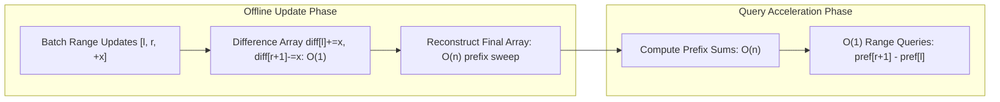
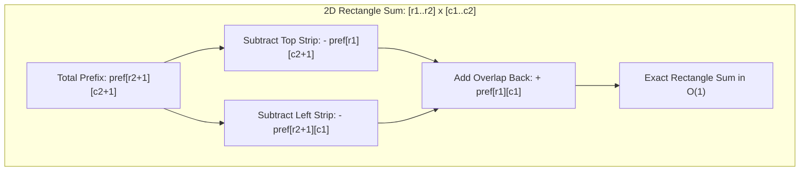

# Prefix Sums and Difference Arrays

> [!NOTE]
> **Duality of Cumulative Operations:** Prefix sums and difference arrays represent complementary operations on sequences:
> - **Prefix Sums (Query Acceleration):** Acts as a discrete integral. Precomputes cumulative sums in $O(n)$ time to answer any subsequent static subarray sum query in $O(1)$ time via subtraction: $\sum_{i=l}^r a[i] = pref[r+1] - pref[l]$. Extends to 2D subgrids via 2D inclusion-exclusion in $O(1)$ query time.
> - **Difference Arrays (Update Acceleration):** Acts as a discrete derivative. Records boundaries of range increments in $O(1)$ time ($diff[l] += x$, $diff[r+1] -= x$). Reconstructs the modified sequence in $O(n)$ time via a single cumulative prefix sweep.
> - Reference implementations: [C++17 Implementation](../../implementations/cpp/prefix_sums_and_difference_arrays.cpp) | [Python Implementation](../../implementations/python/prefix_sums_and_difference_arrays.py)

> [!TIP]
> **Duality Comparison Matrix:**
>
> | Dimension | 1D Prefix Sums | 1D Difference Array | 2D Prefix Sums | 2D Difference Array |
> |---|---|---|---|---|
> | **Primary Purpose** | Instant range-sum queries | Fast offline range updates | Instant subrectangle sums | Fast offline rectangle updates |
> | **Update Cost** | $O(n)$ rebuild | **$O(1)$** boundary marks | $O(nm)$ rebuild | **$O(1)$** 4-corner marks |
> | **Query Cost** | **$O(1)$** via $pref[r+1] - pref[l]$ | $O(n)$ reconstruction | **$O(1)$** inclusion-exclusion | $O(nm)$ reconstruction |
> | **Mathematical Model** | Discrete integration ($\sum$) | Discrete derivative ($\Delta$) | 2D cumulative area | 2D corner differential marks |
> | **Optimal Workload** | Static array, millions of queries | Bulk updates, single final inspect | Static grid, repeated area sums | Bulk grid updates, single render |

> [!WARNING]
> **Critical Implementation Traps & Invariants:**
> 1. **Integer Overflow Mandate:** Prefix accumulations can rapidly overflow 32-bit signed integers (e.g., $10^5 \times 10^9 = 10^{14}$). Always use 64-bit integers (`long long` in C++, `int64` in systems languages) for prefix and difference arrays.
> 2. **Online vs. Offline Boundaries:** Difference arrays **do not support interleaved online queries**. If updates and queries alternate arbitrarily, use a dynamic tree structure like a [Fenwick Tree](../08-trees-and-hierarchical-structures/fenwick-tree.md) or [Segment Tree](../08-trees-and-hierarchical-structures/segment-tree.md).
> 3. **The Leading-Zero Convention:** Always allocate prefix arrays with size $n + 1$ and set $pref[0] = 0$. Querying range $[l, r]$ then simplifies to $pref[r+1] - pref[l]$ without special branching for $l = 0$.
> 4. **2D Inclusion-Exclusion Sign Discipline:**
>    - *Querying 2D Sums:* $+ \text{bottom-right} - \text{top-strip} - \text{left-strip} + \text{top-left-overlap}$.
>    - *Applying 2D Updates:* $+ diff[r_1][c_1] - diff[r_1][c_2+1] - diff[r_2+1][c_1] + diff[r_2+1][c_2+1]$.






Many array problems ask repeated questions about ranges:

- what is the sum of elements from index $ l $ to $ r $?
- how many values in this interval satisfy a condition?
- how can we apply many range updates efficiently?
- how can we reconstruct an array after bulk modifications?

Two of the most important tools for these tasks are:

- **prefix sums**
- **difference arrays**

These are simple ideas, but they are extremely powerful.

Prefix sums help with **fast range queries**.

Difference arrays help with **fast range updates**.

Together, they form one of the most useful foundations in algorithm design, competitive programming, and data processing.

This chapter develops:

- 1D prefix sums
- 2D prefix sums
- range-sum query formulas
- counting and frequency applications
- 1D difference arrays
- 2D difference arrays
- offline range updates
- reconstruction and engineering pitfalls

---

## 1. Why prefix sums matter

Suppose we have an array:

```text
a = [2, 4, 1, 7, 3, 6]
```

and we want to answer many queries like:

- sum from index 1 to 4
- sum from index 2 to 5
- sum from index 0 to 3

If we compute each query directly, each one may take $ O(n) $ in the worst case.

If there are many queries, that becomes expensive.

Prefix sums solve this by preprocessing once, then answering each range-sum query in constant time.

---

## 2. Definition of a prefix sum array

For an array $ a $ of length $ n $, define the prefix sum array $ pref $ by:

$$
pref[i] = a[0] + a[1] + \dots + a[i]
$$

This is the sum of the first $ i+1 $ elements.

A very common and cleaner alternative uses an extra leading zero:

$$
pref[0] = 0
$$

and for $ 1 \le i \le n $:

$$
pref[i] = a[0] + a[1] + \dots + a[i-1]
$$

This chapter will use the **leading-zero convention** because it makes formulas simpler and safer.

---

## 3. Prefix sum with leading zero

With the leading-zero convention:

$$
pref[0] = 0
$$

$$
pref[i+1] = pref[i] + a[i]
$$

So `pref` has length $ n+1 $.

For:

```text
a = [2, 4, 1, 7]
```

we get:

```text
pref = [0, 2, 6, 7, 14]
```

because:

- $ pref[1] = 2 $
- $ pref[2] = 2 + 4 = 6 $
- $ pref[3] = 2 + 4 + 1 = 7 $
- $ pref[4] = 2 + 4 + 1 + 7 = 14 $

---

## 4. Range sum formula

With the leading-zero prefix array, the sum of the subarray from index $ l $ to $ r $, inclusive, is:

$$
a[l] + a[l+1] + \dots + a[r] = pref[r+1] - pref[l]
$$

This is the central prefix-sum formula.

### Why it works
- `pref[r+1]` contains the sum up to index $ r $
- `pref[l]` contains the sum up to index $ l-1 $
- subtracting removes the earlier part

So we isolate exactly the desired interval.

---

## 5. Example range sum

Let:

```text
a    = [2, 4, 1, 7, 3]
pref = [0, 2, 6, 7, 14, 17]
```

Find the sum from $ l = 1 $ to $ r = 3 $:

$$
pref[4] - pref[1] = 14 - 2 = 12
$$

And indeed:

$$
4 + 1 + 7 = 12
$$

---

## 6. C++17 1D prefix sums

```cpp
#include <vector>

std::vector<long long> prefix_sums(const std::vector<int>& a) {
    int n = static_cast<int>(a.size());
    std::vector<long long> pref(n + 1, 0);

    for (int i = 0; i < n; ++i) {
        pref[i + 1] = pref[i] + a[i];
    }

    return pref;
}

long long range_sum(const std::vector<long long>& pref, int l, int r) {
    return pref[r + 1] - pref[l];
}
```

---

## 7. Python 1D prefix sums

```python
def prefix_sums(a):
    pref = [0] * (len(a) + 1)
    for i, x in enumerate(a):
        pref[i + 1] = pref[i] + x
    return pref

def range_sum(pref, l, r):
    return pref[r + 1] - pref[l]
```

---

## 8. Time and space complexity

For an array of length $ n $:

### Build
$$
O(n)
$$

### Each range-sum query
$$
O(1)
$$

### Extra space
$$
O(n)
$$

This is one of the best examples of a preprocessing trade-off:

- do linear work once
- answer many queries instantly

---

## 9. Prefix sums for counting problems

Prefix sums are not only for arithmetic sums.

They also work for counts.

Example:
Suppose we want to answer many queries of the form:

> How many even numbers appear in the interval $ [l, r] $?

We build a derived binary array:

```text
b[i] = 1 if a[i] is even, else 0
```

Then the count of even numbers in $ [l, r] $ is just a range sum on $ b $.

This is a very common pattern.

---

## 10. Example of counting with prefix sums

Let:

```text
a = [5, 8, 2, 7, 4]
```

Build:

```text
b = [0, 1, 1, 0, 1]
```

Then its prefix sums let us answer:

- number of even elements in any interval
- number of elements satisfying any boolean condition

This turns many counting problems into simple prefix-sum queries.

---

## 11. Prefix sums with negative numbers

Prefix sums still work perfectly when array values are negative.

Example:

```text
a = [3, -2, 5, -1]
```

Then:

```text
pref = [0, 3, 1, 6, 5]
```

The same formula still holds:

$$
sum(l, r) = pref[r+1] - pref[l]
$$

So prefix sums do not require nonnegative values.

That is important.

---

## 12. Prefix sums and modular arithmetic

Sometimes the problem asks for sums modulo some number $ M $.

Then we may build prefix sums modulo $ M $:

$$
pref[i+1] = (pref[i] + a[i]) \bmod M
$$

Be careful when subtracting:

$$
(pref[r+1] - pref[l]) \bmod M
$$

may need normalization to keep the result nonnegative.

A safe form is:

$$
(pref[r+1] - pref[l] + M) \bmod M
$$

or repeated normalization if needed.

---

## 13. Two-dimensional prefix sums

Prefix sums generalize naturally to matrices.

Suppose we have a grid and want many queries like:

> What is the sum of entries inside a rectangle?

A 2D prefix sum array supports this in constant time per query after preprocessing.

This is one of the most useful extensions.

---

## 14. Definition of a 2D prefix sum

For a matrix $ a $ with $ n $ rows and $ m $ columns, define a prefix table `pref` of size $ (n+1) \times (m+1) $ with leading zeros.

Then:

$$
pref[i+1][j+1]
$$

stores the sum of all entries in the rectangle from $(0,0)$ to $(i,j)$, inclusive.

The recurrence is:

$$
pref[i+1][j+1] =
pref[i][j+1] + pref[i+1][j] - pref[i][j] + a[i][j]
$$

This is inclusion-exclusion.

---

## 15. Why the 2D recurrence works

To build the sum up to cell $(i,j)$, we combine:

- the rectangle above
- the rectangle to the left

But then the top-left overlap has been counted twice, so we subtract it once.

Finally, we add the current cell.

That is exactly why the recurrence is:

$$
\text{above} + \text{left} - \text{overlap} + \text{current cell}
$$

---

## 16. 2D rectangle sum formula

Let a query rectangle have corners:

- top row $ r_1 $
- left column $ c_1 $
- bottom row $ r_2 $
- right column $ c_2 $

Then the sum of that rectangle is:

$$
pref[r_2+1][c_2+1]
- pref[r_1][c_2+1]
- pref[r_2+1][c_1]
+ pref[r_1][c_1]
$$

This is the 2D version of the 1D subtraction idea.

---

## 17. C++17 2D prefix sums

```cpp
#include <vector>

std::vector<std::vector<long long>> prefix_sums_2d(
    const std::vector<std::vector<int>>& a) {

    int n = static_cast<int>(a.size());
    int m = n ? static_cast<int>(a[0].size()) : 0;

    std::vector<std::vector<long long>> pref(n + 1, std::vector<long long>(m + 1, 0));

    for (int i = 0; i < n; ++i) {
        for (int j = 0; j < m; ++j) {
            pref[i + 1][j + 1] =
                pref[i][j + 1] +
                pref[i + 1][j] -
                pref[i][j] +
                a[i][j];
        }
    }

    return pref;
}

long long rectangle_sum(
    const std::vector<std::vector<long long>>& pref,
    int r1, int c1, int r2, int c2) {

    return pref[r2 + 1][c2 + 1]
         - pref[r1][c2 + 1]
         - pref[r2 + 1][c1]
         + pref[r1][c1];
}
```

---

## 18. Python 2D prefix sums

```python
def prefix_sums_2d(a):
    n = len(a)
    m = len(a[0]) if n else 0
    pref = [[0] * (m + 1) for _ in range(n + 1)]

    for i in range(n):
        for j in range(m):
            pref[i + 1][j + 1] = (
                pref[i][j + 1]
                + pref[i + 1][j]
                - pref[i][j]
                + a[i][j]
            )

    return pref

def rectangle_sum(pref, r1, c1, r2, c2):
    return (
        pref[r2 + 1][c2 + 1]
        - pref[r1][c2 + 1]
        - pref[r2 + 1][c1]
        + pref[r1][c1]
    )
```

---

## 19. Difference arrays: the reverse idea

Prefix sums help when we have:

- many range queries
- few or no updates

Difference arrays help in the opposite kind of offline setting:

- many range updates
- and then one final reconstruction

The idea is to record **changes between adjacent values**, not the values themselves.

---

## 20. Definition of a difference array

For an array $ a $, define its difference array $ diff $ by:

$$
diff[0] = a[0]
$$

and for $ i \ge 1 $:

$$
diff[i] = a[i] - a[i-1]
$$

Then the original array can be reconstructed by prefix sums on `diff`.

So:

- prefix sums accumulate values
- difference arrays store discrete changes

These are inverse viewpoints.

---

## 21. Why difference arrays help with range updates

Suppose we want to add a value $ x $ to every element in the interval $ [l, r] $.

Instead of updating all positions one by one, we do:

- add $ x $ at `diff[l]`
- subtract $ x $ at `diff[r+1]` if that index exists

Then when we reconstruct the final array by prefix sums, the update affects exactly the desired interval.

This is the central trick.

---

## 22. Why the update works

Adding $ x $ at `diff[l]` means:

- starting from position $ l $, all later prefix accumulations increase by $ x $

Subtracting $ x $ at `diff[r+1]` means:

- starting after position $ r $, that extra increase is canceled

So the added amount is active exactly on the interval $ [l, r] $.

This is a very elegant boundary-marking idea.

---

## 23. Example difference-array update

Suppose $ n = 6 $ and initial array is all zeros:

```text
a = [0, 0, 0, 0, 0, 0]
```

Apply update:

- add 5 to indices 1 through 3

In the difference array:

- `diff[1] += 5`
- `diff[4] -= 5`

So:

```text
diff = [0, 5, 0, 0, -5, 0]
```

Now prefix sums of `diff` give:

```text
a = [0, 5, 5, 5, 0, 0]
```

which is exactly the desired result.

---

## 24. C++17 1D difference array for offline range updates

```cpp
#include <vector>

std::vector<long long> apply_range_additions(
    int n,
    const std::vector<std::tuple<int, int, long long>>& updates) {

    std::vector<long long> diff(n + 1, 0);

    for (auto [l, r, x] : updates) {
        diff[l] += x;
        if (r + 1 < n) {
            diff[r + 1] -= x;
        }
    }

    std::vector<long long> a(n, 0);
    long long cur = 0;
    for (int i = 0; i < n; ++i) {
        cur += diff[i];
        a[i] = cur;
    }

    return a;
}
```

---

## 25. Python 1D difference array for offline range updates

```python
def apply_range_additions(n, updates):
    diff = [0] * (n + 1)

    for l, r, x in updates:
        diff[l] += x
        if r + 1 < n:
            diff[r + 1] -= x

    a = [0] * n
    cur = 0
    for i in range(n):
        cur += diff[i]
        a[i] = cur

    return a
```

---

## 26. Building a difference array from an existing array

If the original array is not all zeros, we can first compute:

$$
diff[0] = a[0]
$$

$$
diff[i] = a[i] - a[i-1]
$$

Then apply range updates on `diff`, and reconstruct the final array.

This is useful when we begin with nonzero data.

---

## 27. C++17 build and reconstruct difference array

```cpp
#include <vector>

std::vector<long long> build_difference_array(const std::vector<int>& a) {
    int n = static_cast<int>(a.size());
    std::vector<long long> diff(n, 0);

    if (n == 0) return diff;
    diff[0] = a[0];

    for (int i = 1; i < n; ++i) {
        diff[i] = a[i] - a[i - 1];
    }

    return diff;
}

std::vector<long long> reconstruct_from_difference(const std::vector<long long>& diff) {
    int n = static_cast<int>(diff.size());
    std::vector<long long> a(n, 0);

    if (n == 0) return a;
    a[0] = diff[0];

    for (int i = 1; i < n; ++i) {
        a[i] = a[i - 1] + diff[i];
    }

    return a;
}
```

---

## 28. Python build and reconstruct difference array

```python
def build_difference_array(a):
    n = len(a)
    if n == 0:
        return []

    diff = [0] * n
    diff[0] = a[0]
    for i in range(1, n):
        diff[i] = a[i] - a[i - 1]
    return diff

def reconstruct_from_difference(diff):
    n = len(diff)
    if n == 0:
        return []

    a = [0] * n
    a[0] = diff[0]
    for i in range(1, n):
        a[i] = a[i - 1] + diff[i]
    return a
```

---

## 29. Range increments plus final queries

A common problem pattern is:

1. start with an array
2. apply many range additions offline
3. reconstruct the final array
4. then answer many range-sum queries

This combines difference arrays and prefix sums naturally:

- difference array for efficient updates
- prefix sums for efficient final queries

These tools fit together beautifully.

---

## 30. Two-dimensional difference arrays

Difference arrays also generalize to 2D.

Suppose we want to add a value $ x $ to every cell of a subrectangle.

A 2D difference array marks only the rectangle corners and then reconstructs by 2D prefix accumulation.

This is the update-side analogue of 2D prefix sums.

---

## 31. 2D rectangle update rule

To add $ x $ to every cell in rectangle:

- rows $ r_1 $ through $ r_2 $
- columns $ c_1 $ through $ c_2 $

we do:

$$
diff[r_1][c_1] += x
$$

$$
diff[r_1][c_2+1] -= x
$$

$$
diff[r_2+1][c_1] -= x
$$

$$
diff[r_2+1][c_2+1] += x
$$

when those indices are in bounds.

This is 2D inclusion-exclusion.

---

## 32. Why the 2D update rule works

In 1D, we mark where an effect starts and where it stops.

In 2D, we must do that in both row and column directions.

The four corner updates ensure that after 2D prefix reconstruction:

- the value $ x $ is active inside exactly the desired rectangle
- and canceled outside it

This is a very elegant generalization.

---

## 33. C++17 2D difference array for offline rectangle additions

```cpp
#include <vector>
#include <tuple>

std::vector<std::vector<long long>> apply_rectangle_additions(
    int n, int m,
    const std::vector<std::tuple<int, int, int, int, long long>>& updates) {

    std::vector<std::vector<long long>> diff(n + 1, std::vector<long long>(m + 1, 0));

    for (auto [r1, c1, r2, c2, x] : updates) {
        diff[r1][c1] += x;
        if (c2 + 1 < m) diff[r1][c2 + 1] -= x;
        if (r2 + 1 < n) diff[r2 + 1][c1] -= x;
        if (r2 + 1 < n && c2 + 1 < m) diff[r2 + 1][c2 + 1] += x;
    }

    std::vector<std::vector<long long>> a(n, std::vector<long long>(m, 0));

    for (int i = 0; i < n; ++i) {
        for (int j = 0; j < m; ++j) {
            long long up = (i > 0 ? a[i - 1][j] : 0);
            long long left = (j > 0 ? a[i][j - 1] : 0);
            long long diag = (i > 0 && j > 0 ? a[i - 1][j - 1] : 0);
            a[i][j] = diff[i][j] + up + left - diag;
        }
    }

    return a;
}
```

---

## 34. Python 2D difference array for offline rectangle additions

```python
def apply_rectangle_additions(n, m, updates):
    diff = [[0] * (m + 1) for _ in range(n + 1)]

    for r1, c1, r2, c2, x in updates:
        diff[r1][c1] += x
        if c2 + 1 < m:
            diff[r1][c2 + 1] -= x
        if r2 + 1 < n:
            diff[r2 + 1][c1] -= x
        if r2 + 1 < n and c2 + 1 < m:
            diff[r2 + 1][c2 + 1] += x

    a = [[0] * m for _ in range(n)]
    for i in range(n):
        for j in range(m):
            up = a[i - 1][j] if i > 0 else 0
            left = a[i][j - 1] if j > 0 else 0
            diag = a[i - 1][j - 1] if i > 0 and j > 0 else 0
            a[i][j] = diff[i][j] + up + left - diag

    return a
```

---

## 35. Prefix sums versus difference arrays

These two ideas are closely related, but they solve opposite kinds of workloads.

### Prefix sums
- fast range queries
- static data or few updates

### Difference arrays
- fast offline range updates
- final reconstruction after all updates

A helpful memory rule is:

> Prefix sums accumulate values. Difference arrays accumulate changes.

---

## 36. Online versus offline distinction

Difference arrays are especially useful in **offline** settings.

That means:

- all updates are known first
- we do not need to answer queries between updates

If we need both updates and queries intermixed online, then more advanced structures such as Fenwick trees or segment trees are usually needed.

This boundary is important.

---

## 37. Common mistakes

### Mistake 1: off-by-one errors
Using the leading-zero prefix sum convention helps reduce these.

### Mistake 2: forgetting inclusive endpoints
For a range $ [l, r] $, the prefix formula uses:

$$
pref[r+1] - pref[l]
$$

### Mistake 3: using `int` when sums may overflow
In C++, use `long long` when values or counts can become large.

### Mistake 4: forgetting to cancel at `r+1`
That breaks difference-array updates.

### Mistake 5: mixing online and offline thinking
Difference arrays do not support efficient arbitrary online queries between updates.

### Mistake 6: incorrect 2D inclusion-exclusion signs
The rectangle formulas require great care with plus and minus terms.

---

## 38. Complexity summary

### 1D prefix sums
- build: $ O(n) $
- range query: $ O(1) $

### 2D prefix sums
- build: $ O(nm) $
- rectangle query: $ O(1) $

### 1D difference arrays
- each range update: $ O(1) $
- final reconstruction: $ O(n) $

### 2D difference arrays
- each rectangle update: $ O(1) $
- final reconstruction: $ O(nm) $

These are excellent trade-offs in the right problem settings.

---

## 39. Comparison table

| Technique | Best for | Build / update | Query / reconstruction |
|---|---|---:|---:|
| 1D prefix sums | many range-sum queries | $ O(n) $ | $ O(1) $ per query |
| 2D prefix sums | many rectangle-sum queries | $ O(nm) $ | $ O(1) $ per query |
| 1D difference array | many offline range additions | $ O(1) $ per update | $ O(n) $ final reconstruction |
| 2D difference array | many offline rectangle additions | $ O(1) $ per update | $ O(nm) $ final reconstruction |

---

## 40. Recognition checklist

Prefix sums are a good fit when you see:

- many sum queries on subarrays
- many count queries on intervals
- rectangle sums in grids
- static array, many queries

Difference arrays are a good fit when you see:

- many range increments
- many rectangle additions
- apply all updates, then inspect final state
- offline bulk modifications

These are strong signals.

---

## 41. Correctness intuition summary

### Prefix sums
A range sum is obtained by subtracting two cumulative sums:

- total up to the right endpoint
- total before the left endpoint

### Difference arrays
A range update is represented by turning an effect on at the left boundary and turning it off after the right boundary.

### 2D variants
Both ideas extend through inclusion-exclusion:
- 2D prefix sums subtract overlapping rectangles
- 2D difference arrays mark rectangle corners so accumulation activates exactly the target region

These are simple but profound transformations.

---

## 42. Summary

Prefix sums and difference arrays are two of the most useful foundational tools for arrays and grids.

Prefix sums support:

- fast interval sums
- fast counting over ranges
- fast rectangle queries

Difference arrays support:

- fast offline range updates
- fast offline rectangle updates

The key practical lesson is to choose the tool that matches the workload:

- many queries on static data → prefix sums
- many offline updates before final reconstruction → difference arrays

These techniques appear constantly in algorithm design because they turn repeated local work into simple cumulative structure.

---

## 43. Practice prompts

1. What does a 1D prefix sum array store?
2. Why does $ pref[r+1] - pref[l] $ give the sum on $ [l, r] $?
3. Why is the leading-zero convention helpful?
4. How can prefix sums answer counting queries, not just numeric sums?
5. What does a difference array store?
6. Why does adding at `l` and subtracting at `r+1` apply an update only on $ [l, r] $?
7. Why are difference arrays mainly an offline technique?
8. What is the 2D rectangle sum formula?
9. Why do 2D difference arrays need four corner updates?
10. When should you use prefix sums instead of a segment tree?

---

## 44. Suggested next topics

A natural continuation after prefix sums and difference arrays is:

- sparse tables
- Fenwick trees
- segment trees
- offline query sorting
- Mo's algorithm
