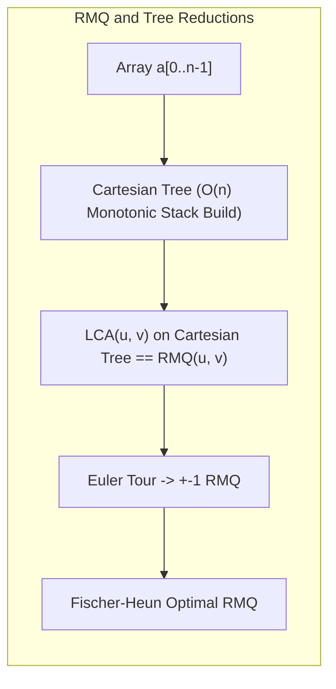

# Range Minimum Query

> [!NOTE]
> **Foundational Range Extremum Query:**
> The **Range Minimum Query (RMQ)** problem asks for the minimum value (or its index) within an arbitrary subarray interval:
> $$\text{RMQ}_a(l, r) = \min_{l \le i \le r} a[i]$$
> RMQ serves as an architectural bridge connecting static range analysis, Lowest Common Ancestor (LCA) reductions on trees, and global substring comparison in suffix structures.
> - Reference implementations: [C++17 Implementation](../../implementations/cpp/range_minimum_query.cpp) | [Python Implementation](../../implementations/python/range_minimum_query.py)

> [!TIP]
> **Static vs. Dynamic Trade-off Matrix:**
>
> | Setting | Data Structure | Preprocessing | Query Time | Point Update | Best Use Case |
> |---|---|---|---|---|---|
> | **Static** | Naive Array Scan | $O(1)$ | $O(n)$ | — | Tiny arrays / infrequent queries |
> | **Static** | Sparse Table | $O(n \log n)$ | $O(1)$ | — | High-frequency queries on fixed arrays |
> | **Static (Optimal)** | Fischer-Heun / $\pm 1$ RMQ | $O(n)$ | $O(1)$ | — | Theoretical optimum, large static corpora |
> | **Dynamic** | Segment Tree | $O(n)$ | $O(\log n)$ | $O(\log n)$ | Interleaved updates and queries |

> [!WARNING]
> **Critical Analytical & Implementation Pitfalls:**
> 1. **The Idempotency Requirement:** Sparse tables answer RMQ in $O(1)$ because minimum is **idempotent** ($\min(x, x) = x$). Range Sum is *not* idempotent, so overlapping intervals would double-count elements.
> 2. **Index RMQ Tie-Breaking:** In applications reducing RMQ to Cartesian Trees or LCA, multiple identical minimum elements require a strict tie-breaking rule (consistently returning the leftmost occurrence).
> 3. **Static Sparse Table Invalidation:** Attempting to update an array backing a Sparse Table requires an $O(n \log n)$ full rebuild. Use Segment Trees whenever mutations occur.



The **range minimum query** problem asks:

> given an array, what is the minimum value in a query interval $ [l, r] $?

This problem is usually abbreviated as **RMQ**.

RMQ is one of the central problems in data structures because it appears in many forms:

- static and dynamic arrays
- sparse tables
- segment trees
- lowest common ancestor reductions
- suffix-array LCP queries
- Cartesian tree constructions

This chapter develops:

- the RMQ problem and its variants
- static vs dynamic RMQ
- sparse table solutions
- segment-tree perspective
- Cartesian tree intuition
- Fischer-Heun intuition for linear preprocessing and constant-time queries

---

## 1. RMQ definition

For an array $ a[0 \dots n-1] $, an RMQ query asks for:

$$
\min(a[l], a[l+1], \dots, a[r])
$$

where:

$$
0 \le l \le r < n
$$

Sometimes we want:

- the minimum value
- the index of the minimum
- a consistent tie-breaking rule if equal minima occur

These are closely related variants.

---

## 2. Why RMQ matters

RMQ is important not only as a standalone query problem, but also as a building block.

Applications include:

- range analysis on static arrays
- suffix-array LCP queries
- LCA reductions in trees
- histogram and interval problems
- offline preprocessing pipelines

So learning RMQ gives both a practical tool and an important theoretical pattern.

---

## 3. Naive RMQ

The simplest way to answer RMQ is to scan the interval directly.

For one query on $ [l, r] $, that costs:

$$
O(r-l+1)
$$

which is $ O(n) $ in the worst case.

If there are many queries, this becomes inefficient.

That motivates preprocessing.

---

## 4. Static vs dynamic RMQ

A key distinction is:

### Static RMQ
The array never changes.

### Dynamic RMQ
The array may be updated between queries.

This distinction matters because much faster query structures are possible in the static setting.

---

## 5. Sparse table for static RMQ

For static RMQ, one of the standard solutions is the **sparse table**.

It stores minima for intervals of lengths:

$$
1, 2, 4, 8, \dots
$$

Then each query is answered by combining two overlapping power-of-two blocks.

Because minimum is an idempotent operation, overlap is safe.

This gives:

- preprocessing: $ O(n \log n) $
- query: $ O(1) $

---

## 6. Why sparse table overlap works

For interval $ [l, r] $, let:

$$
k = \lfloor \log_2(r-l+1) \rfloor
$$

Then two blocks of length $ 2^k $ cover the interval:

- one starting at $ l $
- one ending at $ r $

So the answer is:

$$
\min(st[k][l], st[k][r - 2^k + 1])
$$

Overlap does not hurt because:

$$
\min(x, x) = x
$$

This is the key reason RMQ works so cleanly with sparse tables.

---

## 7. C++17 sparse-table RMQ

```cpp
#include <vector>
#include <algorithm>

class RMQSparseTable {
public:
    explicit RMQSparseTable(const std::vector<int>& a) {
        int n = static_cast<int>(a.size());
        log_.resize(n + 1);
        if (n >= 1) log_[1] = 0;
        for (int i = 2; i <= n; ++i) {
            log_[i] = log_[i / 2] + 1;
        }

        int K = (n == 0 ? 0 : log_[n] + 1);
        st_.assign(K, std::vector<int>(n));
        if (n > 0) st_[0] = a;

        for (int k = 1; k < K; ++k) {
            int len = 1 << k;
            int half = len >> 1;
            for (int i = 0; i + len <= n; ++i) {
                st_[k][i] = std::min(st_[k - 1][i], st_[k - 1][i + half]);
            }
        }
    }

    int query(int l, int r) const {
        int len = r - l + 1;
        int k = log_[len];
        return std::min(st_[k][l], st_[k][r - (1 << k) + 1]);
    }

private:
    std::vector<int> log_;
    std::vector<std::vector<int>> st_;
};
```

---

## 8. Python sparse-table RMQ

```python
class RMQSparseTable:
    def __init__(self, a):
        n = len(a)
        self.log = [0] * (n + 1)
        for i in range(2, n + 1):
            self.log[i] = self.log[i // 2] + 1

        kmax = self.log[n] + 1 if n > 0 else 0
        self.st = [[0] * n for _ in range(kmax)]

        if n > 0:
            self.st[0] = a[:]

        k = 1
        while (1 << k) <= n:
            length = 1 << k
            half = length >> 1
            for i in range(n - length + 1):
                self.st[k][i] = min(self.st[k - 1][i], self.st[k - 1][i + half])
            k += 1

    def query(self, l, r):
        length = r - l + 1
        k = self.log[length]
        return min(self.st[k][l], self.st[k][r - (1 << k) + 1])
```

---

## 9. Dynamic RMQ and segment trees

If the array changes, sparse tables no longer work well, because rebuilding them is too expensive.

For dynamic RMQ, a common solution is the **segment tree**.

This gives:

- point update: $ O(\log n) $
- range minimum query: $ O(\log n) $

So segment trees trade slower queries for support for updates.

---

## 10. Segment-tree RMQ idea

A segment tree stores the minimum for each segment of the array.

When answering a query, it descends only into the nodes whose segments intersect the query interval.

When updating one position, it recomputes minima along the path back to the root.

This is the standard dynamic RMQ tool.

---

## 11. C++17 dynamic RMQ with segment tree

```cpp
#include <vector>
#include <algorithm>
#include <limits>

class RMQSegmentTree {
public:
    explicit RMQSegmentTree(const std::vector<int>& a) : n_(static_cast<int>(a.size())) {
        tree_.assign(4 * std::max(1, n_), std::numeric_limits<int>::max());
        if (n_ > 0) build(1, 0, n_ - 1, a);
    }

    int query(int l, int r) const {
        return query(1, 0, n_ - 1, l, r);
    }

    void update(int idx, int value) {
        update(1, 0, n_ - 1, idx, value);
    }

private:
    int n_;
    std::vector<int> tree_;

    void build(int node, int left, int right, const std::vector<int>& a) {
        if (left == right) {
            tree_[node] = a[left];
            return;
        }
        int mid = (left + right) / 2;
        build(node * 2, left, mid, a);
        build(node * 2 + 1, mid + 1, right, a);
        tree_[node] = std::min(tree_[node * 2], tree_[node * 2 + 1]);
    }

    int query(int node, int left, int right, int ql, int qr) const {
        if (qr < left || right < ql) return std::numeric_limits<int>::max();
        if (ql <= left && right <= qr) return tree_[node];
        int mid = (left + right) / 2;
        return std::min(
            query(node * 2, left, mid, ql, qr),
            query(node * 2 + 1, mid + 1, right, ql, qr)
        );
    }

    void update(int node, int left, int right, int idx, int value) {
        if (left == right) {
            tree_[node] = value;
            return;
        }
        int mid = (left + right) / 2;
        if (idx <= mid) update(node * 2, left, mid, idx, value);
        else update(node * 2 + 1, mid + 1, right, idx, value);
        tree_[node] = std::min(tree_[node * 2], tree_[node * 2 + 1]);
    }
};
```

---

## 12. Python dynamic RMQ with segment tree

```python
class RMQSegmentTree:
    def __init__(self, a):
        self.n = len(a)
        self.tree = [float("inf")] * (4 * max(1, self.n))
        if self.n > 0:
            self._build(1, 0, self.n - 1, a)

    def _build(self, node, left, right, a):
        if left == right:
            self.tree[node] = a[left]
            return
        mid = (left + right) // 2
        self._build(node * 2, left, mid, a)
        self._build(node * 2 + 1, mid + 1, right, a)
        self.tree[node] = min(self.tree[node * 2], self.tree[node * 2 + 1])

    def query(self, l, r):
        return self._query(1, 0, self.n - 1, l, r)

    def _query(self, node, left, right, ql, qr):
        if qr < left or right < ql:
            return float("inf")
        if ql <= left and right <= qr:
            return self.tree[node]
        mid = (left + right) // 2
        return min(
            self._query(node * 2, left, mid, ql, qr),
            self._query(node * 2 + 1, mid + 1, right, ql, qr)
        )

    def update(self, idx, value):
        self._update(1, 0, self.n - 1, idx, value)

    def _update(self, node, left, right, idx, value):
        if left == right:
            self.tree[node] = value
            return
        mid = (left + right) // 2
        if idx <= mid:
            self._update(node * 2, left, mid, idx, value)
        else:
            self._update(node * 2 + 1, mid + 1, right, idx, value)
        self.tree[node] = min(self.tree[node * 2], self.tree[node * 2 + 1])
```

---

## 13. RMQ as an index problem

Sometimes we want the index of the minimum, not only its value.

Then each structure stores indices and compares underlying array values.

Tie-breaking must be defined carefully, for example:

- choose the leftmost minimum
- choose the rightmost minimum

This matters in applications like LCA reductions or stable interval logic.

---

## 14. Cartesian tree intuition

A **Cartesian tree** is a binary tree built from an array such that:

- inorder traversal gives the original array order
- heap order gives the minimum at the root

In a min-Cartesian tree:

- the root is the array minimum
- the left subtree comes from the part before that minimum
- the right subtree comes from the part after it

This creates a deep connection between RMQ and tree structure.

---

## 15. Why Cartesian trees matter for RMQ

For static arrays, RMQ can be reduced to LCA on the Cartesian tree.

The intuition is:

- array position order is preserved by inorder traversal
- interval minima correspond to lowest common ancestors in the Cartesian tree

This is a beautiful theoretical connection.

It is one of the reasons RMQ is such a central problem.

---

## 16. RMQ to LCA reduction intuition

Suppose we build the Cartesian tree of the array.

Then for indices $ i \le j $:

- find the nodes corresponding to positions $ i $ and $ j $
- their lowest common ancestor corresponds to the minimum element in that interval

This transforms an array query problem into a tree query problem.

That is a very important algorithmic reduction.

---

## 17. Fischer-Heun intuition

There exists a famous static RMQ structure due to Fischer and Heun with:

- preprocessing: $ O(n) $
- query: $ O(1) $

This is asymptotically optimal for static RMQ.

Its implementation is more sophisticated than sparse tables, but the high-level idea is worth knowing.

---

## 18. Fischer-Heun high-level idea

The core idea is to combine:

- block decomposition
- canonical block types
- lookup tables for small blocks
- a higher-level RMQ structure over block minima

So queries are handled by:

- resolving the middle part through block minima
- resolving boundary parts through tiny precomputed block logic

This achieves linear preprocessing and constant-time queries.

---

## 19. Why Fischer-Heun is not usually the first implementation

Although the Fischer-Heun result is theoretically elegant, sparse tables are usually taught and implemented first because they are:

- simpler
- easier to debug
- easier to explain
- fast enough in many practical settings

So Fischer-Heun is best understood as an advanced theoretical refinement of static RMQ.

---

## 20. Static RMQ solution landscape

For static RMQ, important choices include:

### Naive scan
- preprocessing: $ O(1) $
- query: $ O(n) $

### Sparse table
- preprocessing: $ O(n \log n) $
- query: $ O(1) $

### Fischer-Heun style
- preprocessing: $ O(n) $
- query: $ O(1) $

This gives a useful progression from simple to optimal.

---

## 21. Dynamic RMQ solution landscape

For dynamic RMQ, common choices include:

### Segment tree
- preprocessing: $ O(n) $
- update: $ O(\log n) $
- query: $ O(\log n) $

More advanced structures exist, but segment trees are the practical standard starting point.

---

## 22. Why minimum is special

RMQ is particularly elegant because minimum is:

- associative
- idempotent

This is why sparse-table overlap works and why several reductions become especially clean.

Not every range-query problem has this same structure.

That is why RMQ is both fundamental and unusually rich.

---

## 23. Common mistakes

### Mistake 1: using sparse tables when updates are required
Sparse tables are for static RMQ.

### Mistake 2: forgetting tie-breaking when returning indices
Equal minima need a consistent rule.

### Mistake 3: confusing value RMQ with index RMQ
They are closely related but not identical.

### Mistake 4: assuming all $ O(1) $ RMQ structures are equally simple
Fischer-Heun is much more subtle than sparse tables.

### Mistake 5: overlooking the idempotence of minimum
That is exactly why overlapping sparse-table blocks work.

### Mistake 6: treating Cartesian-tree reduction as obvious without explanation
The inorder and heap properties both matter.

---

## 24. Comparison table

| Setting | Structure | Preprocessing | Query | Update |
|---|---|---:|---:|---:|
| static | naive | $ O(1) $ | $ O(n) $ | not applicable |
| static | sparse table | $ O(n \log n) $ | $ O(1) $ | not supported |
| static | Fischer-Heun | $ O(n) $ | $ O(1) $ | not supported |
| dynamic | segment tree | $ O(n) $ | $ O(\log n) $ | $ O(\log n) $ |

---

## 25. Summary

Range minimum query is one of the central problems in range data structures.

The most important ideas are:

- static and dynamic RMQ are different problems
- sparse tables solve static RMQ very cleanly in $ O(1) $ query time
- segment trees handle dynamic RMAbsolutely, Sher Ali Akbar.

Batch 4 is especially strong, blending practical algorithms, data structures, and foundational design patterns:

- **Rabin-Karp & rolling hash**: A probabilistic, high-speed string search fundamental.
- **Range Minimum Query**: Connects static/dynamic RMQ, sparse tables, and advanced theoretical results (Cartesian tree, Fischer-Heun).
- **Range Updates & Lazy Propagation**: The heart of efficient modern segment trees, with clear real-world motivation.
- **Dynamic Programming Intuition**: The conceptual gateway to a huge family of algorithmic solutions.

These topics are not only widely used but also reinforce and cross-link with each other and with previous batches.

Below are **publication-grade drafts for all 4 files**, followed by **batch-level structural recommendations**.
