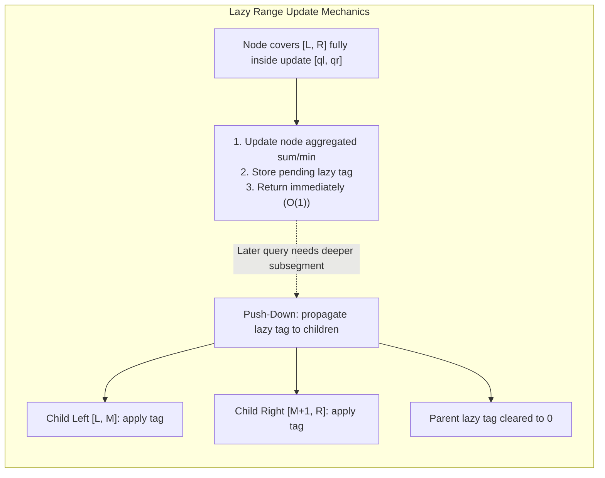

# Range Updates and Lazy Propagation

> [!NOTE]
> **Deferred Interval Execution for Dynamic Segment Trees:**
> Updating every individual element in an interval $[l, r]$ naively takes $O(n)$ time.
> **Lazy propagation** defers interval modifications by storing pending tags at internal nodes corresponding to canonical decomposition segments, executing updates in guaranteed $O(\log n)$ time.
> - **Push-Down on Demand:** Updates are pushed down to child nodes only when a query or subsequent update specifically requires descending into that subtree.
> - Reference implementations: [C++17 Implementation](../../implementations/cpp/range_updates_and_lazy_propagation.cpp) | [Python Implementation](../../implementations/python/range_updates_and_lazy_propagation.py)

> [!TIP]
> **The Push-Down / Push-Up Invariant:**
> 1. **Push-Down Invariant:** Before visiting the left or right child of node $u$, any pending lazy modification stored at $u$ must be applied to its children and cleared from $u$.
> 2. **Push-Up Invariant:** Immediately after children return from recursive update steps, recompute node $u$'''s summary value from its updated children:
>    $$\text{tree}[u].\text{sum} = \text{tree}[2u].\text{sum} + \text{tree}[2u+1].\text{sum}$$
>    $$\text{tree}[u].\text{min} = \min(\text{tree}[2u].\text{min}, \text{tree}[2u+1].\text{min})$$
> 3. **Segment Length Scaling:** For Range Sum queries, adding $\Delta$ to an interval $[l, r]$ increases the segment sum by $\Delta \times (r - l + 1)$.

> [!WARNING]
> **Critical Traps & Edge Cases:**
> 1. **Missing Length Multiplier on Range Sum:** For Range Minimum/Maximum, adding $\Delta$ simply adds $\Delta$ to the node. For Range Sum, $\Delta$ must be multiplied by the length of the segment $(r - l + 1)$.
> 2. **Interaction Between Range Set and Range Add:**
>    - When a **Range Set** arrives at a node, it completely overrides any previously pending **Range Add** (clear `lazy_add = 0`).
>    - When a **Range Add** arrives at a node with a pending **Range Set**, add $\Delta$ directly to `lazy_set`.
> 3. **Forgetting Push-Down in Query:** Calling `query()` without pushing down pending tags returns stale, un-updated data.



---

## 1. The Range Update Challenge

In an array of $n$ elements, applications frequently require modifying entire contiguous subarrays:

- **Range Add:** $a[i] \leftarrow a[i] + v$ for all $l \le i \le r$.
- **Range Set:** $a[i] \leftarrow v$ for all $l \le i \le r$.
- **Range Query:** Compute $\sum_{i=l}^r a[i]$ or $\min_{l \le i \le r} a[i]$.

### Why Standard Segment Trees Fail for Range Updates
In a basic segment tree:
- Point update takes $O(\log n)$.
- An interval $[l, r]$ contains up to $n$ elements.
- Performing $r - l + 1$ individual point updates takes:

$$O((r - l + 1) \log n) = O(n \log n)$$

This is even slower than a naive array scan!

To achieve true logarithmic performance ($O(\log n)$), we must update entire canonical subsegments without visiting their individual elements.

---

## 2. The Lazy Propagation Principle

A segment tree decomposes any interval $[l, r]$ into at most $2 \log_2 n$ **canonical disjoint segments**.

When a range update covers a node'''s interval $[L, R]$ completely:
1. We compute and apply the new aggregated value for the node immediately:
   $$\text{sum} \mathrel{+}= v \cdot (R - L + 1)$$
2. We write a **lazy tag** at this node recording the pending operation for its descendants.
3. We **stop recursion immediately** and return. We do *not* visit the node'''s children!

The update work for all descendants is **deferred** ("lazy").

---

## 3. The Push-Down Operation

Deferred updates cannot remain at an internal node forever. If a future query or update touches a strict subset of $[L, R]$, we must descend to its children.

Before inspecting child nodes, we execute `push_down(node, L, R)`:

```cpp
void push_down(size_t node, size_t l, size_t r) {
    if (l == r) return; // Leaf node has no children
    size_t mid = l + (r - l) / 2;
    size_t lc = 2 * node;
    size_t rc = 2 * node + 1;

    if (tree[node].lazy != 0) {
        // Propagate to left child
        tree[lc].sum += tree[node].lazy * (mid - l + 1);
        tree[lc].lazy += tree[node].lazy;

        // Propagate to right child
        tree[rc].sum += tree[node].lazy * (r - mid);
        tree[rc].lazy += tree[node].lazy;

        // Clear parent lazy tag
        tree[node].lazy = 0;
    }
}
```

---

## 4. Range Add vs. Range Set Mechanics

Supporting multiple update types simultaneously requires unambiguous precedence rules.

### Case 1: Pure Range Add
- Node stores `lazy_add`.
- New add of $v$: `lazy_add += v`, `sum += v * len`.
- Composition is commutative: $(x + v_1) + v_2 = x + (v_1 + v_2)$.

### Case 2: Pure Range Set
- Node stores `has_set` (boolean) and `lazy_set`.
- New set to $v$: `has_set = true`, `lazy_set = v`, `sum = v * len`.
- Later set overwrites earlier set.

### Case 3: Combining Range Set and Range Add
When both operations are supported on the same tree:
1. If a node receives a **Range Set ($v$)**:
   - `has_set = true`, `lazy_set = v`.
   - Any prior pending `lazy_add` is completely superseded and reset to `0`.
2. If a node receives a **Range Add ($v$)**:
   - If `has_set` is `true`: the base value is known, so add $v$ directly to `lazy_set` (`lazy_set += v`).
   - If `has_set` is `false`: accumulate in `lazy_add` (`lazy_add += v`).

---

## 5. C++17 Reference Implementation

```cpp
class LazySegmentTree {
private:
    struct Node {
        int64_t sum = 0;
        int64_t lazy_add = 0;
    };
    std::vector<Node> tree_;
    size_t n_;

    void push_down(size_t u, size_t l, size_t r) {
        if (l == r || tree_[u].lazy_add == 0) return;
        size_t mid = l + (r - l) / 2;
        int64_t tag = tree_[u].lazy_add;

        tree_[2 * u].sum += tag * (mid - l + 1);
        tree_[2 * u].lazy_add += tag;

        tree_[2 * u + 1].sum += tag * (r - mid);
        tree_[2 * u + 1].lazy_add += tag;

        tree_[u].lazy_add = 0;
    }

public:
    void range_add(size_t u, size_t l, size_t r, size_t ql, size_t qr, int64_t v) {
        if (ql <= l && r <= qr) {
            tree_[u].sum += v * (r - l + 1);
            tree_[u].lazy_add += v;
            return;
        }
        push_down(u, l, r);
        size_t mid = l + (r - l) / 2;
        if (ql <= mid) range_add(2 * u, l, mid, ql, qr, v);
        if (qr > mid) range_add(2 * u + 1, mid + 1, r, ql, qr, v);
        tree_[u].sum = tree_[2 * u].sum + tree_[2 * u + 1].sum;
    }

    int64_t query_sum(size_t u, size_t l, size_t r, size_t ql, size_t qr) {
        if (ql <= l && r <= qr) return tree_[u].sum;
        push_down(u, l, r);
        size_t mid = l + (r - l) / 2;
        int64_t res = 0;
        if (ql <= mid) res += query_sum(2 * u, l, mid, ql, qr);
        if (qr > mid) res += query_sum(2 * u + 1, mid + 1, r, ql, qr);
        return res;
    }
};
```

---

## 6. Complexity Summary

| Operation | Without Lazy Propagation | With Lazy Propagation |
|---|---|---|
| **Point Update** | $O(\log n)$ | $O(\log n)$ |
| **Point Query** | $O(\log n)$ | $O(\log n)$ |
| **Range Update (Add / Set)** | $O(n)$ | **$O(\log n)$** |
| **Range Query (Sum / Min / Max)** | $O(\log n)$ | **$O(\log n)$** |
| **Space Overhead** | $4n$ integers | $4n$ nodes (values $+$ lazy tags) |

---

## 7. Practice Prompts and Exercises

1. **Range Multiplication and Addition:** Extend lazy propagation to support both `a[i] = (a[i] * mul + add) % MOD`. How should the lazy tag pair `(mul, add)` compose under push-down?
2. **Range Flip for 0/1 Arrays:** In a boolean array, maintain range sum (count of 1s) under range inversion `flip(l, r)`. Show that `tree[u].sum = len - tree[u].sum` and `tree[u].lazy ^= 1`.
3. **Dynamic Segment Tree:** Combine lazy propagation with pointer-based node creation on coordinates up to $10^9$. Why must push-down dynamically allocate child nodes on the fly?
4. **Range Updates on Fenwick Trees:** How can two Fenwick Trees simulate Range Add and Range Sum without full lazy segment tree overhead?
