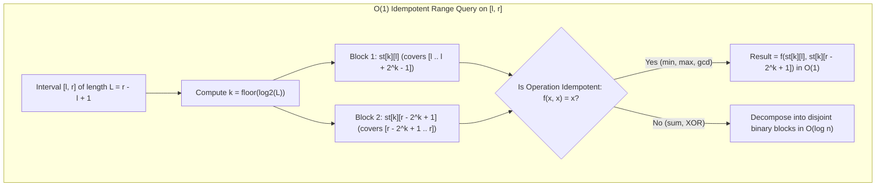

# Sparse Tables

> [!NOTE]
> **Power-of-Two Preprocessing for Static Range Queries:** The **Sparse Table** precomputes answers for all intervals whose lengths are powers of two ($2^k = 1, 2, 4, 8, \dots$) in $O(n \log n)$ time and space:
> - **$O(1)$ Idempotent Queries:** For operations satisfying idempotence $f(x, x) = x$ ($\min, \max, \gcd, \text{bit-AND}, \text{bit-OR}$), any query range $[l, r]$ of length $L$ can be completely covered by two overlapping blocks of length $2^{\lfloor \log_2 L \rfloor}$. Because duplicate elements do not alter the result, the answer is computed in strict $O(1)$ time.
> - **Logarithm Precomputation:** A simple $O(n)$ recurrence `log[i] = log[i / 2] + 1` eliminates floating-point `std::log2` or bitwise intrinsics in query loops.
> - **Index-Based Queries (ArgMin):** By storing indices instead of raw values, sparse tables power optimal $O(1)$ Range Minimum Queries for Lowest Common Ancestor (LCA) reductions and Cartesian tree constructions.
>
> Reference implementations: [C++17 Implementation](../../implementations/cpp/sparse_table.cpp) | [Python Implementation](../../implementations/python/sparse_table.py)

> [!TIP]
> **Operation Compatibility Matrix:**
>
> | Operation Type | Algebraic Property | Mathematical Condition | Query Time | Representative Operators |
> |---|---|---|---|---|
> | **Idempotent** | $f(x, x) = x$ | Invariant under overlap | **$O(1)$** (two overlapping blocks) | $\min, \max, \gcd, \text{bit-AND}, \text{bit-OR}$ |
> | **Associative (General)** | $f(f(a,b),c) = f(a,f(b,c))$ | Requires disjoint partition | **$O(\log n)$** (disjoint binary decomposition) | $\text{sum}, \text{product}, \text{matrix mult}, \text{XOR}$ |

> [!WARNING]
> **Critical Implementation Traps & Invariants:**
> 1. **Static Data Only:** Sparse tables cannot accommodate dynamic updates efficiently. A single point update requires $O(n \log n)$ rebuild time. For dynamic range workloads, use a [Segment Tree](../08-trees-and-hierarchical-structures/segment-tree.md) or [Fenwick Tree](../08-trees-and-hierarchical-structures/fenwick-tree.md).
> 2. **Non-Idempotency Pitfall:** Never use the two-overlapping-block $O(1)$ formula for non-idempotent operations like sum or XOR. Overlapping elements will be counted multiple times, corrupting the answer.
> 3. **Right Block Indexing:** In a query on $[l, r]$ with block size $2^k$, the rightmost block must start at $r - 2^k + 1$, NOT $r - 2^k$.
> 4. **Log Table Precomputation:** Sizing the log array to $n + 1$ with `log[1] = 0` ensures direct 1-based indexing for interval lengths up to $n$ with zero out-of-bounds risk.




Some array query problems have a very friendly structure:

- the array is **static**
- there are **many range queries**
- the operation is something like minimum, maximum, or greatest common divisor

In these settings, a **sparse table** is one of the most elegant preprocessing tools.

A sparse table stores answers for intervals whose lengths are powers of two:

$$
1, 2, 4, 8, 16, \dots
$$

Then a query can be answered by combining a small number of precomputed blocks.

For **idempotent** operations such as:

- minimum
- maximum
- gcd
- bitwise AND
- bitwise OR

a sparse table can answer each query in:

$$
O(1)
$$

time after:

$$
O(n \log n)
$$

preprocessing.

This chapter develops:

- the static range query setting
- power-of-two interval decomposition
- sparse table construction
- $ O(1) $ range minimum query
- why idempotence matters
- logarithm precomputation
- comparisons with prefix sums and segment trees

---

## 1. The static range query problem

Suppose we have an array and many queries of the form:

- minimum on $ [l, r] $
- maximum on $ [l, r] $
- gcd on $ [l, r] $

If the array never changes, we can afford heavy preprocessing.

This is called the **static range query** setting.

Sparse tables are designed exactly for this situation.

---

## 2. Why not answer each query directly?

A direct scan of every query range costs:

$$
O(r - l + 1)
$$

which is $ O(n) $ in the worst case.

If there are many queries, this becomes too slow.

We want:

- more preprocessing
- much faster queries

That is the classic trade-off.

---

## 3. What a sparse table stores

A sparse table stores answers for intervals of length $ 2^k $.

More precisely:

$$
st[k][i]
$$

stores the answer for the interval starting at $ i $ of length $ 2^k $:

$$
a[i \dots i + 2^k - 1]
$$

So:

- `st[0][i]` stores the answer on length 1
- `st[1][i]` stores the answer on length 2
- `st[2][i]` stores the answer on length 4
- and so on

This power-of-two structure is the key idea.

---

## 4. Why powers of two are useful

Any interval length can be related to powers of two.

For example:

- 13 contains a block of length 8
- then perhaps a block of length 4
- then a block of length 1

This makes powers of two a natural basis for interval decomposition.

Sparse tables exploit this by precomputing all power-of-two blocks once.

---

## 5. Construction recurrence

Suppose we already know answers for intervals of length $ 2^{k-1} $.

Then an interval of length $ 2^k $ can be split into two halves of length $ 2^{k-1} $:

$$
a[i \dots i + 2^k - 1]
$$

is the combination of:

$$
a[i \dots i + 2^{k-1} - 1]
$$

and

$$
a[i + 2^{k-1} \dots i + 2^k - 1]
$$

So the recurrence is:

$$
st[k][i] = f(st[k-1][i],\ st[k-1][i + 2^{k-1}])
$$

where $ f $ is the query operation.

This gives an $ O(n \log n) $ build.

---

## 6. Example with range minimum

For minimum queries:

$$
st[k][i] = \min(st[k-1][i],\ st[k-1][i + 2^{k-1}])
$$

So each longer block reuses two shorter blocks.

This bottom-up structure is simple and elegant.

---

## 7. C++17 sparse table for range minimum query

```cpp
#include <vector>
#include <algorithm>

class SparseTableMin {
public:
    explicit SparseTableMin(const std::vector<int>& a) {
        int n = static_cast<int>(a.size());
        log_.resize(n + 1);
        log_[1] = 0;
        for (int i = 2; i <= n; ++i) {
            log_[i] = log_[i / 2] + 1;
        }

        int K = log_[n] + 1;
        st_.assign(K, std::vector<int>(n));
        st_[0] = a;

        for (int k = 1; k < K; ++k) {
            int len = 1 << k;
            int half = len >> 1;
            for (int i = 0; i + len <= n; ++i) {
                st_[k][i] = std::min(st_[k - 1][i], st_[k - 1][i + half]);
            }
        }
    }

    int query(int l, int r) const {
        int len = r - l + 1;
        int k = log_[len];
        return std::min(st_[k][l], st_[k][r - (1 << k) + 1]);
    }

private:
    std::vector<int> log_;
    std::vector<std::vector<int>> st_;
};
```

---

## 8. Python sparse table for range minimum query

```python
class SparseTableMin:
    def __init__(self, a):
        n = len(a)
        self.log = [0] * (n + 1)
        for i in range(2, n + 1):
            self.log[i] = self.log[i // 2] + 1

        kmax = self.log[n] + 1 if n > 0 else 0
        self.st = [[0] * n for _ in range(kmax)]

        if n > 0:
            self.st[0] = a[:]

        k = 1
        while (1 << k) <= n:
            length = 1 << k
            half = length >> 1
            for i in range(n - length + 1):
                self.st[k][i] = min(self.st[k - 1][i], self.st[k - 1][i + half])
            k += 1

    def query(self, l, r):
        length = r - l + 1
        k = self.log[length]
        return min(self.st[k][l], self.st[k][r - (1 << k) + 1])
```

---

## 9. Why the query uses two blocks

For an interval $ [l, r] $, let:

$$
len = r - l + 1
$$

and let:

$$
k = \lfloor \log_2(len) \rfloor
$$

Then $ 2^k $ is the largest power of two not exceeding the interval length.

We cover the query range with two blocks of length $ 2^k $:

- one starting at $ l $
- one ending at $ r $

So the answer is:

$$
f(st[k][l],\ st[k][r - 2^k + 1])
$$

For minimum, this works perfectly.

---

## 10. Why overlapping is allowed for minimum

The two chosen power-of-two blocks may overlap.

That is fine for minimum because:

$$
\min(x, x) = x
$$

So even if an element is counted twice conceptually, the result does not change.

This is the critical reason sparse tables give $ O(1) $ queries for minimum.

---

## 11. Idempotent operations

An operation $ f $ is **idempotent** if:

$$
f(x, x) = x
$$

Examples:

- $ \min(x, x) = x $
- $ \max(x, x) = x $
- $ \gcd(x, x) = x $

Non-examples:

- $ x + x \ne x $ in general
- XOR is not idempotent in this sense

Sparse tables achieve the clean $ O(1) $ overlapping-block query trick precisely because the operation is idempotent.

---

## 12. Common idempotent operations for sparse tables

Sparse tables work especially well for:

- minimum
- maximum
- gcd
- bitwise AND
- bitwise OR

These all tolerate overlap in the two-block query method.

This makes sparse tables a general-purpose static structure for many range problems.

---

## 13. Why sum does not work with the same $ O(1) $ trick

Suppose we try to answer a sum query using two overlapping blocks.

Then overlapping elements would be counted twice.

Since addition is not idempotent, that changes the result.

So the two-block $ O(1) $ sparse-table query method is not correct for sums.

For sums, prefix sums are usually the better tool.

This contrast is very important.

---

## 14. Sparse tables for associative but non-idempotent operations

If the operation is associative, we can still answer a query by decomposing the interval into disjoint power-of-two blocks.

That takes:

$$
O(\log n)
$$

time per query.

So sparse tables are still possible in a broader sense.

But the famous $ O(1) $ query version is the idempotent case.

This distinction should be clear.

---

## 15. Query example for RMQ

Let:

```text
a = [5, 2, 4, 7, 1, 3, 6]
```

Query minimum on $ [1, 5] $, so the interval is:

```text
[2, 4, 7, 1, 3]
```

Its length is 5.

The largest power of two not exceeding 5 is 4, so $ k = 2 $.

Use two length-4 blocks:

- block starting at 1 → covers indices 1 to 4
- block ending at 5 → starts at $ 5 - 4 + 1 = 2 $, covers indices 2 to 5

Then:

$$
\min(a[1 \dots 5]) = \min(st[2][1], st[2][2])
$$

This gives the correct answer.

---

## 16. Logarithm precomputation

To answer queries quickly, we need:

$$
\lfloor \log_2(len) \rfloor
$$

for many interval lengths.

A standard trick is to precompute:

```text
log[1] = 0
log[i] = log[i // 2] + 1
```

for all $ i $ from 2 to $ n $.

Then each query gets the needed logarithm in $ O(1) $.

This is a small but important engineering step.

---

## 17. Why the log recurrence works

If we divide an integer by 2 using integer division, we remove one power-of-two level.

So:

$$
\lfloor \log_2(i) \rfloor = \lfloor \log_2(\lfloor i/2 \rfloor) \rfloor + 1
$$

for $ i \ge 2 $.

This makes the precomputation simple and efficient.

---

## 18. Build complexity

Let $ n $ be the array length.

There are:

- $ O(\log n) $ levels
- each level stores $ O(n) $ values

So total preprocessing is:

$$
O(n \log n)
$$

and space is also:

$$
O(n \log n)
$$

This is the main trade-off for getting $ O(1) $ idempotent range queries.

---

## 19. Query complexity

For idempotent operations like minimum:

- find $ k = \lfloor \log_2(r-l+1) \rfloor $
- combine two precomputed blocks

So query time is:

$$
O(1)
$$

This is why sparse tables are so attractive in static RMQ problems.

---

## 20. Sparse table for maximum

To support range maximum queries, we change only the combine operation.

Construction becomes:

$$
st[k][i] = \max(st[k-1][i],\ st[k-1][i + 2^{k-1}])
$$

and queries use the same two-block formula.

This shows the pattern generalizes cleanly.

---

## 21. C++17 sparse table for gcd

```cpp
#include <vector>
#include <numeric>

class SparseTableGCD {
public:
    explicit SparseTableGCD(const std::vector<int>& a) {
        int n = static_cast<int>(a.size());
        log_.resize(n + 1);
        log_[1] = 0;
        for (int i = 2; i <= n; ++i) {
            log_[i] = log_[i / 2] + 1;
        }

        int K = log_[n] + 1;
        st_.assign(K, std::vector<int>(n));
        st_[0] = a;

        for (int k = 1; k < K; ++k) {
            int len = 1 << k;
            int half = len >> 1;
            for (int i = 0; i + len <= n; ++i) {
                st_[k][i] = std::gcd(st_[k - 1][i], st_[k - 1][i + half]);
            }
        }
    }

    int query(int l, int r) const {
        int len = r - l + 1;
        int k = log_[len];
        return std::gcd(st_[k][l], st_[k][r - (1 << k) + 1]);
    }

private:
    std::vector<int> log_;
    std::vector<std::vector<int>> st_;
};
```

---

## 22. Python sparse table for gcd

```python
import math

class SparseTableGCD:
    def __init__(self, a):
        n = len(a)
        self.log = [0] * (n + 1)
        for i in range(2, n + 1):
            self.log[i] = self.log[i // 2] + 1

        kmax = self.log[n] + 1 if n > 0 else 0
        self.st = [[0] * n for _ in range(kmax)]

        if n > 0:
            self.st[0] = a[:]

        k = 1
        while (1 << k) <= n:
            length = 1 << k
            half = length >> 1
            for i in range(n - length + 1):
                self.st[k][i] = math.gcd(self.st[k - 1][i], self.st[k - 1][i + half])
            k += 1

    def query(self, l, r):
        length = r - l + 1
        k = self.log[length]
        return math.gcd(self.st[k][l], self.st[k][r - (1 << k) + 1])
```

---

## 23. Index-based sparse tables

Sometimes we want not just the minimum value, but the index where the minimum occurs.

Then instead of storing values directly, we store indices and compare array values through those indices.

This is often useful in RMQ-based reductions and LCP applications.

Tie-breaking rules should be defined clearly.

---

## 24. C++17 RMQ index sparse table

```cpp
#include <vector>
#include <algorithm>

class SparseTableArgMin {
public:
    explicit SparseTableArgMin(const std::vector<int>& a) : a_(a) {
        int n = static_cast<int>(a.size());
        log_.resize(n + 1);
        log_[1] = 0;
        for (int i = 2; i <= n; ++i) {
            log_[i] = log_[i / 2] + 1;
        }

        int K = log_[n] + 1;
        st_.assign(K, std::vector<int>(n));

        for (int i = 0; i < n; ++i) st_[0][i] = i;

        for (int k = 1; k < K; ++k) {
            int len = 1 << k;
            int half = len >> 1;
            for (int i = 0; i + len <= n; ++i) {
                int x = st_[k - 1][i];
                int y = st_[k - 1][i + half];
                st_[k][i] = (a_[x] <= a_[y] ? x : y);
            }
        }
    }

    int query_index(int l, int r) const {
        int len = r - l + 1;
        int k = log_[len];
        int x = st_[k][l];
        int y = st_[k][r - (1 << k) + 1];
        return (a_[x] <= a_[y] ? x : y);
    }

private:
    std::vector<int> a_;
    std::vector<int> log_;
    std::vector<std::vector<int>> st_;
};
```

---

## 25. Why sparse tables are excellent for RMQ

Range minimum query on static arrays is one of the most classic sparse-table use cases because:

- the operation is idempotent
- the array does not change
- queries are often numerous

This gives a perfect match between problem structure and data structure.

---

## 26. Comparison with prefix sums

Prefix sums are best when the operation is:

- sum
- count
- other additive accumulation

Sparse tables are best when the operation is:

- idempotent
- static
- queried many times

So:

- prefix sums → additive range queries in $ O(1) $
- sparse tables → idempotent range queries in $ O(1) $

These tools complement each other.

---

## 27. Comparison with segment trees

Segment trees handle:

- range queries
- updates
- online mixed operations

typically in:

$$
O(\log n)
$$

per query or update.

Sparse tables handle:

- static arrays only
- no updates
- but faster idempotent queries in $ O(1) $

So the decision is:

- static + many queries → sparse table
- updates needed → segment tree or Fenwick tree, depending on operation

---

## 28. Comparison with Fenwick trees

Fenwick trees are excellent for:

- prefix sums
- point updates
- sometimes range tricks

But they are not designed for static RMQ in the way sparse tables are.

So each structure fits a different workload.

This chapter should help learners see those boundaries clearly.

---

## 29. Handling empty arrays and invalid queries

In production-quality code, be clear about behavior when:

- the input array is empty
- query bounds are invalid
- $ l > r $

The reference implementations may assume valid nonempty input for clarity, but the chapter should mention this engineering boundary explicitly.

---

## 30. Space layout and cache behavior

Sparse tables use a 2D array-like structure of size roughly:

$$
n \log n
$$

This is usually practical for moderate $ n $, but much larger than prefix sums.

Still, the memory layout is simple and cache-friendly compared with some pointer-heavy structures.

This is a useful practical note.

---

## 31. Why sparse tables are called “sparse”

The name comes from the fact that we do not precompute answers for every possible interval.

We compute only for intervals whose lengths are powers of two.

That is much less than all $ O(n^2) $ intervals, yet still enough to answer queries efficiently.

So “sparse” means selectively precomputed interval sizes, not sparse memory in the graph-theory sense.

---

## 32. Associativity versus idempotence

It is useful to separate two properties.

### Associative
$$
f(f(a,b),c) = f(a,f(b,c))
$$

### Idempotent
$$
f(x,x) = x
$$

Associativity helps us combine interval answers meaningfully.

Idempotence is what allows overlapping-block $ O(1) $ queries without double-counting problems.

This distinction is one of the deepest conceptual lessons of sparse tables.

---

## 33. Bitwise OR and AND examples

Bitwise operations like AND and OR are also idempotent:

$$
x \,\text{OR}\, x = x
$$

$$
x \,\text{AND}\, x = x
$$

So sparse tables can support static range bitwise OR or AND queries in $ O(1) $.

This is a useful extension beyond min and max.

---

## 34. Using sparse tables in other domains

Sparse tables also appear as subroutines in more advanced topics.

Examples include:

- RMQ over LCP arrays in string algorithms
- lowest common ancestor reductions
- static gcd query problems
- offline query-heavy tasks with no updates

So learning sparse tables now pays off later.

---

## 35. Common mistakes

### Mistake 1: using sparse tables for dynamic arrays
Sparse tables are for static data.

### Mistake 2: assuming $ O(1) $ query works for all operations
The overlapping-two-block trick needs idempotence.

### Mistake 3: off-by-one errors in block bounds
Be careful with:

$$
r - 2^k + 1
$$

for the right block.

### Mistake 4: bad log table size
The log array should usually be built up to $ n $.

### Mistake 5: claiming tuple decomposition is always enough for $ O(1) $
Only the idempotent case gets the standard $ O(1) $ query formula.

### Mistake 6: forgetting tie-breaking when storing indices
For equal values, choose a consistent rule.

---

## 36. Complexity summary

For an array of length $ n $:

### Build
$$
O(n \log n)
$$

### Space
$$
O(n \log n)
$$

### Query for idempotent operations
$$
O(1)
$$

### Query for general associative operations using disjoint decomposition
$$
O(\log n)
$$

These are the central sparse-table guarantees.

---

## 37. Worked construction intuition

Suppose:

```text
a = [7, 2, 5, 1, 6, 3]
```

Then:

### Level 0, length 1
Each entry is just the element itself.

### Level 1, length 2
Store minima of adjacent pairs:
- min(7,2)
- min(2,5)
- min(5,1)
- ...

### Level 2, length 4
Each answer combines two level-1 intervals.

So the table is built by repeatedly doubling interval size.

This is the same structural pattern seen in many dynamic programming tables.

---

## 38. Recognition checklist

A sparse table is a strong fit when you see:

- static array
- many range minimum / maximum / gcd queries
- no updates
- need for fast repeated queries
- idempotent operation

These are strong signals.

---

## 39. Correctness intuition summary

Sparse tables are correct because every stored entry represents the correct answer for a power-of-two interval.

For an idempotent query on $ [l, r] $, two power-of-two blocks of equal maximum size cover the whole interval.

Even if those blocks overlap, idempotence ensures duplicate coverage does not affect the result.

So combining the two precomputed block answers gives the correct range answer in constant time.

---

## 40. Summary

A sparse table is a preprocessing structure for static range queries.

It stores answers on power-of-two intervals and answers queries by combining a small number of these blocks.

Its main strengths are:

- $ O(n \log n) $ preprocessing
- $ O(1) $ query time for idempotent operations
- simple and predictable implementation
- excellent performance for static RMQ-style workloads

The key conceptual lesson is that:

- associativity helps combine intervals
- idempotence allows overlapping intervals safely

That is why sparse tables are one of the most important tools for static range minimum, maximum, gcd, and similar queries.

---

## 41. Practice prompts

1. What does `st[k][i]` represent in a sparse table?
2. Why are interval lengths chosen as powers of two?
3. What recurrence builds level $ k $ from level $ k-1 $?
4. Why does RMQ use two blocks in $ O(1) $?
5. What does idempotent mean?
6. Why does the $ O(1) $ sparse-table query trick fail for sums?
7. What is the role of the precomputed log table?
8. When should you use a sparse table instead of a segment tree?
9. Why are sparse tables well suited for gcd queries?
10. Why can overlapping blocks still produce the correct answer for minimum?

---

## 42. Suggested next topics

A natural continuation after sparse tables is:

- Fenwick trees
- segment trees
- RMQ to LCA reductions
- disjoint sparse tables
- offline query processing
