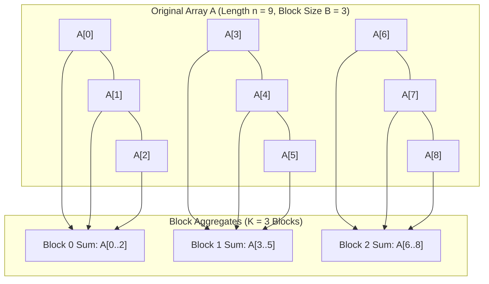
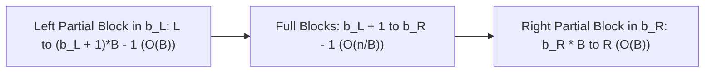

# Square Root (Sqrt) Decomposition

> [!NOTE]
> **The Ubiquitous Block Partition Paradigm:**
> Square root (sqrt) decomposition divides an array of size $n$ into contiguous blocks of size $B \approx \lceil \sqrt{n} \rceil$.
> By precomputing aggregates over each block, range operations span:
> 1. At most two partial blocks (head and tail) taking $O(B)$ time.
> 2. At most $\frac{n}{B}$ complete internal blocks taking $O(1)$ per block.
> Balancing block size $B = \lceil \sqrt{n} \rceil$ yields worst-case **$O(\sqrt{n})$ query and update time** with trivial array-backed storage.

> [!TIP]
> **Why Sqrt Decomposition Complements Segment Trees:**
> While Segment Trees provide $O(\log n)$ bounds, Sqrt Decomposition excels when:
> - Complex, non-associative queries resist tree propagation (e.g., counting elements in range $[L, R]$ with value $\le X$).
> - Memory is strictly constrained: Sqrt decomposition uses only $n + \lceil\sqrt{n}\rceil$ words, whereas segment trees consume $4n$ words.
> - Flat memory access: Sequential looping across contiguous blocks produces near-zero branch mispredictions and optimal CPU L1 cache line prefetching.

> [!WARNING]
> **Same-Block Query Edge Case:**
> When the range $[L, R]$ falls entirely within a single block ($\lfloor L / B \rfloor == \lfloor R / B \rfloor$), do NOT invoke full-block iteration logic. Directly iterate from index $L$ to $R$. Treating $L$ and $R$ as separate partial blocks in the same block double-counts or corrupts the range accumulator.



---

## 1. Algorithmic Mechanics: Range Query Decomposition

Given query range $[L, R]$:
Let $b_L = \lfloor L / B \rfloor$ and $b_R = \lfloor R / B \rfloor$ be the block indices.



### Case 1: Same Block ($b_L == b_R$)
Range is completely contained within one block:
$$\text{Ans} = \sum_{i=L}^R A[i]$$
Complexity: $O(R - L + 1) = O(B)$.

### Case 2: Multi-Block ($b_L < b_R$)
1. **Left Partial Block:** Accumulate elements from index $L$ to the end of block $b_L$:
   $$\text{LeftSum} = \sum_{i=L}^{(b_L + 1)B - 1} A[i] \quad (\le B \text{ elements})$$
2. **Full Intermediate Blocks:** Add precomputed block sums for all $b \in [b_L + 1, b_R - 1]$:
   $$\text{MidSum} = \sum_{b = b_L + 1}^{b_R - 1} \text{block\_sum}[b] \quad (\le \frac{n}{B} \text{ blocks})$$
3. **Right Partial Block:** Accumulate elements from the start of block $b_R$ to index $R$:
   $$\text{RightSum} = \sum_{i = b_R \cdot B}^R A[i] \quad (\le B \text{ elements})$$
$$\text{Total Time} = O(B) + O\left(\frac{n}{B}\right) + O(B) = O\left( B + \frac{n}{B} \right) = \mathbf{O(\sqrt{n})}$$

---

## 2. Dynamic Range Updates with Lazy Propagation

To support both **Range Add $[L, R] += \Delta$** and **Range Sum $[L, R]$** in $O(\sqrt{n})$:
Each block maintains:
- `block_sum[b]`: The total sum of all elements in block $b$.
- `lazy[b]`: Accumulated value to be added to every element in block $b$.

### Range Update Procedure:
- **For Full Intermediate Blocks ($b \in [b_L + 1, b_R - 1]$):**
  $$\text{lazy}[b] += \Delta, \quad \text{block\_sum}[b] += \Delta \cdot B \quad (O(1) \text{ per block})$$
- **For Partial Blocks ($b_L$ and $b_R$):**
  1. Add $\Delta$ directly to each $A[i]$ in the target range.
  2. Update $\text{block\_sum}[b] += \Delta \cdot (\text{number of elements updated in block})$.

---

## 3. Parameter Tuning: Balancing Block Size $B$

For an algorithm executing $Q_u$ range updates and $Q_q$ range queries:
$$\text{Total Cost} \approx Q_u \cdot \left( B + \frac{n}{B} \right) + Q_q \cdot \left( B + \frac{n}{B} \right)$$
- If updates and queries are symmetric ($Q_u \approx Q_q$), optimal block size is:
  $$B = \lceil \sqrt{n} \rceil$$
- If point updates take $O(1)$ and queries take $O(B + n/B)$, and queries heavily dominate ($Q_q \gg Q_u$):
  $$B = \sqrt{n}$$
- In Mo's offline algorithm with $Q$ queries and $N$ elements, the optimal block size is analytically:
  $$B = \max\left(1, \left\lfloor \frac{N}{\sqrt{Q}} \right\rfloor\right)$$

---

## 4. Complexity & Operational Trade-offs

| Structure | Point Update | Range Sum Query | Range Update | Memory Overhead | Implementation Complexity |
| :--- | :---: | :---: | :---: | :---: | :---: |
| **Prefix Sum Array** | $O(n)$ | $\mathbf{O(1)}$ | $O(n)$ | $n$ | Trivial |
| **Sqrt Decomposition** | $\mathbf{O(1)}$ | $\mathbf{O(\sqrt{n})}$ | $\mathbf{O(\sqrt{n})}$ | $n + \sqrt{n}$ | Low (~40 lines) |
| **Binary Indexed Tree (Fenwick)** | $O(\log n)$ | $O(\log n)$ | $O(\log n)$ | $n$ | Very Low (~25 lines) |
| **Segment Tree** | $O(\log n)$ | $O(\log n)$ | $O(\log n)$ | $4n$ | Moderate (~80 lines) |

---

## 5. Common Pitfalls & Anti-Patterns

### Anti-Pattern 1: Block Division by Zero on Empty Inputs
When $n = 0$, computing $B = \lfloor \sqrt{n} \rfloor = 0$ causes a floating-point division by zero exception in `i / B`. Always safeguard with `std::max<size_t>(1, std::sqrt(n))`.

### Anti-Pattern 2: Missing Lazy Pushdown on Partial Block Reads
When using lazy tags, reading individual array elements $A[i]$ during partial block queries without adding `lazy[b]` yields stale, un-updated values. Always evaluate effective element value:
```cpp
T get_val(size_t i) const {
    return arr[i] + lazy[i / B];
}
```

---

## 6. Curated References & Related Problems

1. **CP-Algorithms:** *Sqrt Decomposition and Applications*.
2. **LeetCode 307:** *Range Sum Query - Mutable* (Benchmark target for Sqrt vs Fenwick vs Segment Tree).
3. **Codeforces 86D:** *Powerful array* (Mo's algorithm using sqrt block sorting).
4. **SPOJ DQUERY:** *D-query* (Distinct values in range via sqrt decomposition).
