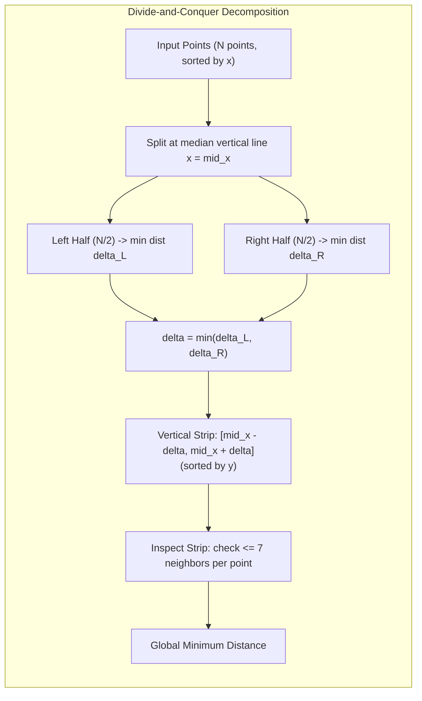
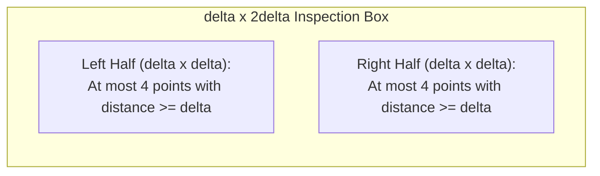
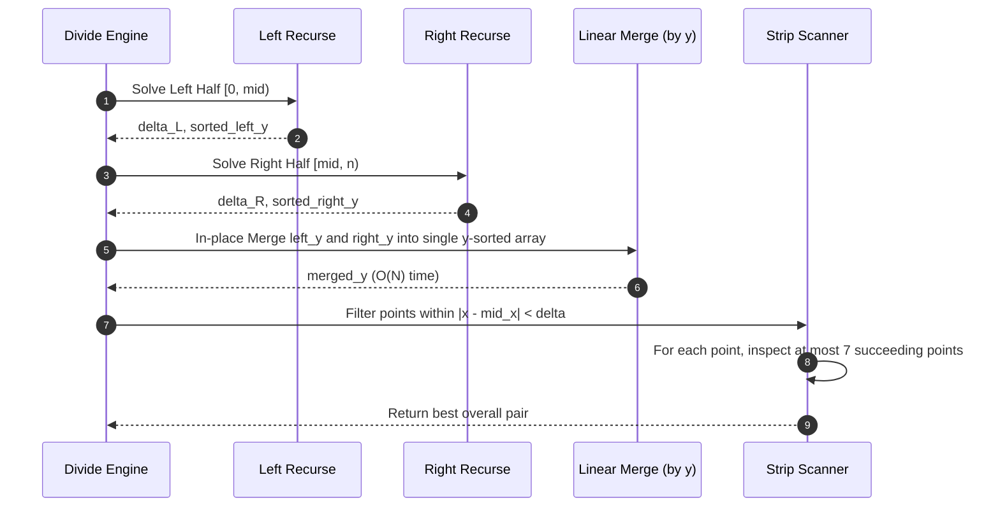

# Closest Pair of Points: Divide-and-Conquer and Spatial Pruning

> [!NOTE]
> **The Proximity Dilemma:**
> Given $N$ points in the Euclidean plane $\mathbb{R}^2$, find the pair of points $(P_i, P_j)$ with minimal distance:
> $$d(P_i, P_j) = \sqrt{(x_i - x_j)^2 + (y_i - y_j)^2}$$
> Brute-force pairwise evaluation examines $\binom{N}{2} \approx \frac{N^2}{2}$ pairs. For $10^6$ coordinates (e.g. LiDAR scans or air traffic radar sweeps), $5 \times 10^{11}$ distance computations cause multi-minute delays.
> The classic **Divide-and-Conquer Algorithm (Shamos & Hoey, 1975)** reduces runtime to optimal **$O(N \log N)$** by exploiting geometric packing constraints.

> [!TIP]
> **Exact Integer Squared Distance:**
> To eliminate floating-point drift and costly square root invocations (`std::sqrt`), all intermediate comparisons must evaluate squared distance:
> $$d^2(P_i, P_j) = (x_i - x_j)^2 + (y_i - y_j)^2$$
> Compute the square root only once upon returning the final result to the user.

> [!WARNING]
> **The O(N log^2 N) Sorting Trap:**
> In naive divide-and-conquer implementations, developers sort the vertical strip by $y$-coordinate on every recursive call, yielding the recurrence:
> $$T(N) = 2T(N/2) + O(N \log N) \implies O(N \log^2 N)$$
> To achieve true **$O(N \log N)$**, the algorithm must maintain $y$-sorted sub-arrays throughout the recursion via a merge-sort pass (`std::inplace_merge`), preserving $O(N)$ combine complexity:
> $$T(N) = 2T(N/2) + O(N) \implies O(N \log N)$$

---

## 1. Overview & Intuition

How can dividing a point set into two halves help if the closest pair happens to have one point on the left and one point on the right?
1. Recursively find the closest pair entirely within the left half ($\delta_L$) and entirely within the right half ($\delta_R$).
2. Let $\delta = \min(\delta_L, \delta_R)$.
3. Now we only need to search for cross-boundary pairs whose distance is strictly less than $\delta$.
4. Any such point must lie within a narrow vertical strip of width $2\delta$ centered at the dividing line $x = \text{mid}_x$.
5. Crucially, because no two points in the left half are closer than $\delta$, and no two points in the right half are closer than $\delta$, **geometry severely limits how many points can fit in any small box**!

---

## 2. Formal Definition & Mathematical Foundations

### 2.1 The Geometric Packing Lemma

> **Lemma (Pigeonhole / Packing Constant):**
> Consider a rectangle of dimensions $2\delta \times \delta$ straddling the dividing line: $[x_{\text{mid}} - \delta, x_{\text{mid}} + \delta] \times [y, y + \delta]$.
> The maximum number of points that can lie inside this rectangle such that all pairs within the left half have distance $\ge \delta$ and all pairs within the right half have distance $\ge \delta$ is at most **8 points** (at most 4 in each $\delta \times \delta$ square).

**Algorithmic Consequence:**
If the points in the vertical strip are sorted by their $y$-coordinate, for each point $P_i$ in the strip, we only need to check points $P_j$ ($j > i$) where $y_j - y_i < \delta$.
By the packing lemma, there can be at most **7 such points**!
Thus, the inner loop executes at most $7 \cdot N = O(N)$ distance evaluations.

### 2.2 Recurrence Relation
With the $O(N)$ $y$-merge pass:
$$T(N) = 2T(N/2) + O(N)$$
By Case 2 of the Master Theorem ($a = 2, b = 2, f(N) = \Theta(N)$):
$$T(N) = \Theta(N \log N)$$

---

## 3. Architecture & Core Mechanics

---

## 4. Operations & Invariants

| Step | Invariant Maintained | Cost |
| :--- | :--- | :--- |
| **Initial Pre-sort** | Points sorted primarily by $x$, secondarily by $y$ | $O(N \log N)$ (one-time) |
| **Base Case ($N \le 3$)**| Exhaustive brute force among 3 points | $O(1)$ |
| **Recursive Halving**| Median line splits set into equal halves $\lceil N/2 \rceil$ | $O(1)$ |
| **In-place $y$-Merge**| Subarray sorted by $y$-coordinate across recursion levels | $O(N)$ |
| **Strip Inspection** | Number of examined neighbors $\le 7$ | $O(N)$ |

---

## 5. Complexity Analysis

| Algorithm | Best Case | Average Case | Worst Case | Auxiliary Space |
| :--- | :--- | :--- | :--- | :--- |
| **Naive All-Pairs** | $O(N^2)$ | $O(N^2)$ | $O(N^2)$ | $O(1)$ |
| **Divide-and-Conquer (with Merge)** | $O(N \log N)$ | $O(N \log N)$ | $O(N \log N)$ | $O(N)$ |
| **Divide-and-Conquer (Naive Sort)** | $O(N \log^2 N)$ | $O(N \log^2 N)$| $O(N \log^2 N)$| $O(N)$ |
| **Line Sweep + BST** | $O(N \log N)$ | $O(N \log N)$ | $O(N \log N)$ | $O(N)$ |
| **Rabin's Randomized Grid Hash** | $O(N)$ | $O(N)$ expected | $O(N^2)$ | $O(N)$ |

---

## 6. Edge Cases & Failure Modes

> [!IMPORTANT]
> **Duplicate Points (Distance = 0):**
> If the point set contains duplicates, the minimal distance is strictly $0$. The algorithm immediately handles this: as soon as $\delta = 0$, the strip width collapses to $0$, and subsequent searches terminate immediately with the identical pair.

> [!CAUTION]
> **Integer Overflow on Large Coordinates:**
> For coordinates $x, y \in [-10^9, 10^9]$, coordinate deltas reach $2 \cdot 10^9$. The squared Euclidean distance $(x_1 - x_2)^2 + (y_1 - y_2)^2$ can reach $8 \cdot 10^{18}$, dangerously close to signed 64-bit maximum ($9.22 \cdot 10^{18}$).
> In C++, promotion to `__int128_t` prevents silent arithmetic overflow during distance comparisons.

---

## 7. Two-Layer API Design & Reference Implementations

The architecture separates low-level geometric distance calculations from high-level recursion:
- **Layer 1:** Exact 128-bit squared Euclidean distance, strip pruning, packing constant termination.
- **Layer 2:** `ClosestPairEngine` offering:
  - `findClosestPair(points)`: Optimal $O(N \log N)$ divide-and-conquer implementation.
  - `naiveClosestPair(points)`: Exhaustive $O(N^2)$ verification oracle.

### C++17 Reference Implementation
The complete C++ implementation with rigorous unit and differential tests is available at:
[`implementations/cpp/closest_pair_of_points.cpp`](../../implementations/cpp/closest_pair_of_points.cpp)

### Python 3 Reference Implementation
The complete Python 3 implementation with `unittest.TestCase` is available at:
[`implementations/python/closest_pair_of_points.py`](../../implementations/python/closest_pair_of_points.py)

---

## 8. Step-by-Step Trace / Walkthrough

### Tracing Divide-and-Conquer on 6 Points:
Points: $P_0(1, 2), P_1(3, 8), P_2(6, 3), P_3(7, 5), P_4(9, 2), P_5(11, 7)$

1. **Partition:**
   Left half: $P_0, P_1, P_2$ ($x \le 6$). Right half: $P_3, P_4, P_5$ ($x \ge 7$).
2. **Left Half Solution:**
   Pairs evaluated: $(P_0, P_1) \implies 4+36=40$; $(P_0, P_2) \implies 25+1=26$; $(P_1, P_2) \implies 9+25=34$.
   $\delta_L^2 = 26$ (Pair $P_0, P_2$).
3. **Right Half Solution:**
   Pairs evaluated: $(P_3, P_4) \implies 4+9=13$; $(P_3, P_5) \implies 16+4=20$; $(P_4, P_5) \implies 4+25=29$.
   $\delta_R^2 = 13$ (Pair $P_3, P_4$).
4. **Combine:**
   $\delta^2 = \min(26, 13) = 13$ ($\delta \approx 3.605$).
   Dividing line $x_{\text{mid}} = 6$.
   Strip range: $x \in [6 - 3.6, 6 + 3.6] = [2.4, 9.6]$.
   Points in strip: $P_1(3, 8), P_2(6, 3), P_3(7, 5), P_4(9, 2)$.
   Sorted by $y$: $P_4(9, 2), P_2(6, 3), P_3(7, 5), P_1(3, 8)$.
5. **Strip Inspection:**
   - $P_4(9, 2)$ vs $P_2(6, 3)$: $d^2 = 9 + 1 = 10 < 13$! $\implies$ **New minimum $\delta^2 = 10$!**
   - $P_2(6, 3)$ vs $P_3(7, 5)$: $d^2 = 1 + 4 = 5 < 10$! $\implies$ **New minimum $\delta^2 = 5$!**
   - $P_3(7, 5)$ vs $P_1(3, 8)$: $d^2 = 16 + 9 = 25 > 5$.
6. **Final Result:** Pair $(P_2, P_3)$ with distance $\sqrt{5} \approx 2.236$.

---

## 9. Comparative Trade-off Matrix

| Criterion | Divide-and-Conquer | Sweep-Line + Active BST | Rabin's Grid Hashing | Naive All-Pairs |
| :--- | :--- | :--- | :--- | :--- |
| **Time Complexity** | $O(N \log N)$ worst | $O(N \log N)$ worst | $O(N)$ expected | $O(N^2)$ worst |
| **Space Complexity** | $O(N)$ | $O(N)$ | $O(N)$ | $O(1)$ |
| **Cache Friendliness**| High (contiguous arrays)| Low (tree node traversal)| High (hash tables) | Highest (linear scans) |
| **Deterministic** | Yes | Yes | No (randomized hashing)| Yes |
| **Extension to $d$-Dim**| Complex ($O(2^d N \log N)$)| Impractical for $d > 2$ | Natural grid extension| Trivial ($O(d N^2)$) |

---

## 10. Differential Testing & Verification Strategy

The test suite incorporates a differential stress-test pipeline:
1. **Randomized Coordinate Generation:** Points generated uniformly at random across wide integer intervals $[-10^4, 10^4]$.
2. **Oracle Comparison:** $O(N \log N)$ output is differentials-checked against the $O(N^2)$ brute-force implementation.
3. **Exact Equivalence:**
   $$\text{fast.distance\_squared} == \text{naive.distance\_squared}$$
4. **Pathological Cases:**
   - Identical points (distance $= 0$).
   - Uniform horizontal/vertical collinear lines.
   - Dense clusters with single isolated outliers.

---

## 11. Real-World Applications & Production Context

- **Air Traffic Management (TCAS):** Aircraft collision avoidance systems compute closest pairs among active transponder trajectories every radar sweep ($1-4\text{ seconds}$).
- **Astronomy & Cosmology:** Identifying gravitationally bound binary stars and galaxy clusters in sky survey catalogs (e.g. Sloan Digital Sky Survey).
- **Molecular Dynamics & Chemistry:** Detecting Van der Waals collisions or bond proximity between atoms in protein folding simulations.
- **VLSI Design Rule Checking:** Verifying that metal traces on a semiconductor layer respect minimum physical separation tolerances.

---

## 12. References & Further Reading

- Shamos, M. I., & Hoey, D. (1975). *Closest-Point Problems*. 16th Annual Symposium on Foundations of Computer Science (FOCS), 151-162.
- Bentley, J. L., & Shamos, M. I. (1976). *Divide-and-Conquer in Multidimensional Space*. 8th Annual ACM Symposium on Theory of Computing (STOC), 220-230.
- Cormen, T. H., Leiserson, C. E., Rivest, R. L., & Stein, C. (2009). *Introduction to Algorithms* (3rd ed.). Section 33.4: Finding the closest pair of points. MIT Press.
- Rabin, M. O. (1976). *Probabilistic Algorithms*. In *Algorithms and Complexity: New Directions and Recent Results*, 21-39. Academic Press.
