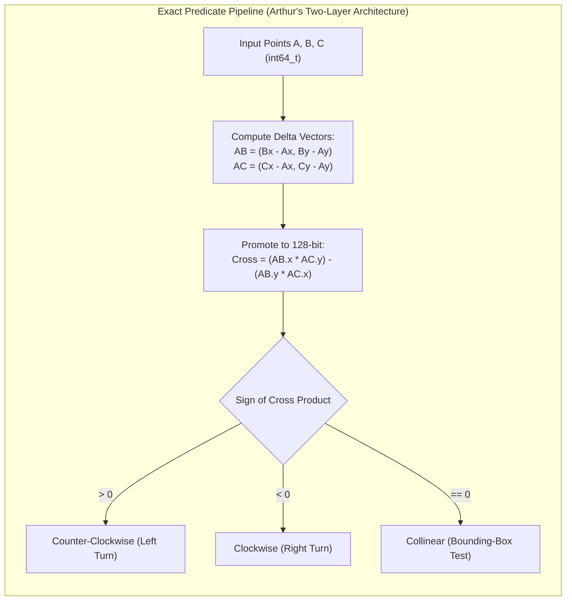
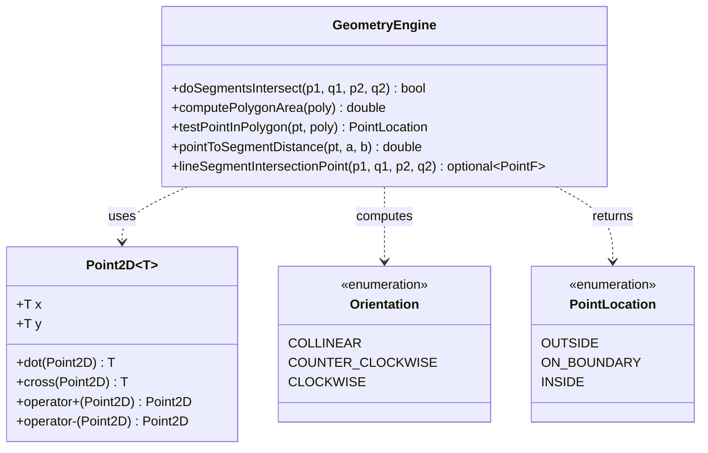

# Computational Geometry Basics: Primitives, Exact Predicates, and Intersections

> [!NOTE]
> **The Geometry-Floating-Point Trap:**
> In pure mathematics, two lines are either parallel or intersect at exactly one point. In IEEE-754 floating-point arithmetic, rounding errors cause catastrophic cancellation: $(A \times B) \times C \neq A \times (B \times C)$, lines can fail transitivity tests, and points on a line can randomly classify as left or right of it.
> Production computational geometry systems (such as CGAL, GIS engines, and game physics cores) avoid floating-point drift for fundamental topological decisions by using **exact integer arithmetic** or **exact geometric predicates** (Shewchuk's robust predicates).

> [!TIP]
> **The 2D Cross Product (Wedge Product) as an Orientation Oracle:**
> The cross product of two 2D vectors $\vec{u} = (x_1, y_1)$ and $\vec{v} = (x_2, y_2)$ is defined as the scalar determinant:
> $$\vec{u} \times \vec{v} = x_1 y_2 - x_2 y_1$$
> Its algebraic sign reveals relative orientation with zero division:
> - $> 0$: Counter-clockwise turn (left turn)
> - $< 0$: Clockwise turn (right turn)
> - $= 0$: Strictly collinear points

> [!WARNING]
> **Integer Overflow Hazards with 64-Bit Coordinates:**
> When coordinates $x, y \in [-10^9, 10^9]$, the difference between coordinates is up to $2 \cdot 10^9$. Multiplying two differences yields up to $4 \cdot 10^{18}$, which fits in a signed 64-bit integer (`int64_t` max $\approx 9.22 \cdot 10^{18}$).
> However, taking the difference of two such products ($x_1 y_2 - x_2 y_1$) can reach $8 \cdot 10^{18}$, risking overflow on boundary coordinates. In C++, exact predicates must promote intermediate products to `__int128_t` to guarantee 100% mathematical integrity.

---

## 1. Overview & Intuition

Computational geometry deals with algorithmic manipulation of geometric objects—points, line segments, polygons, and spatial partitions. Unlike continuous geometry, computational algorithms run on discrete digital hardware where topological consistency is paramount.

A single inconsistent orientation classification can cause convex hull algorithms to enter infinite loops, line sweeps to crash, and polygon triangulation routines to self-intersect. Consequently, the foundation of all advanced spatial structures rests upon robust primitives:
1. **Vector arithmetic:** Translation, dot product (projections and angles), and 2D cross product (orientation and area).
2. **The CCW (Counter-Clockwise) Predicate:** Deciding whether three points form a left turn, a right turn, or a straight line.
3. **Line Segment Intersection:** Determining if two finite segments cross, touch, or overlap without numerical drift.
4. **Polygon Area:** Calculating exact enclosed area via the Shoelace formula.
5. **Point-in-Polygon Location:** Determining whether an arbitrary query point lies inside, outside, or on the boundary of an arbitrary polygon.

---

## 2. Formal Definition & Mathematical Foundations

### 2.1 2D Vector Primitives

Given points $A = (x_A, y_A)$, $B = (x_B, y_B)$, and $C = (x_C, y_C)$ in $\mathbb{R}^2$:

- **Dot Product:**
  $$\vec{u} \cdot \vec{v} = u_x v_x + u_y v_y = \|\vec{u}\| \|\vec{v}\| \cos \theta$$
  - $\vec{u} \cdot \vec{v} > 0$: Acute angle ($\theta < 90^\circ$).
  - $\vec{u} \cdot \vec{v} = 0$: Orthogonal / perpendicular ($\theta = 90^\circ$).
  - $\vec{u} \cdot \vec{v} < 0$: Obtuse angle ($\theta > 90^\circ$).

- **2D Cross Product:**
  $$\vec{u} \times \vec{v} = u_x v_y - u_y v_x = \|\vec{u}\| \|\vec{v}\| \sin \theta$$
  Geometrically, $\vec{u} \times \vec{v}$ represents the signed area of the parallelogram spanned by $\vec{u}$ and $\vec{v}$.

### 2.2 Orientation Predicate ($\text{CCW}$)

The orientation of ordered triplet $(A, B, C)$ corresponds to the sign of the determinant:
$$\Delta(A, B, C) = \begin{vmatrix} x_B - x_A & x_C - x_A \\ y_B - y_A & y_C - y_A \end{vmatrix} = (x_B - x_A)(y_C - y_A) - (y_B - y_A)(x_C - x_A)$$

$$\text{Orientation}(A, B, C) = \begin{cases} +1 & \text{if } \Delta > 0 \text{ (Counter-Clockwise / Left)} \\ -1 & \text{if } \Delta < 0 \text{ (Clockwise / Right)} \\ 0 & \text{if } \Delta = 0 \text{ (Collinear)} \end{cases}$$

### 2.3 Segment Intersection

Two line segments $S_1 = P_1 Q_1$ and $S_2 = P_2 Q_2$ intersect if and only if:
1. **General Straddle Condition:**
   - $P_1$ and $Q_1$ lie on opposite sides of the infinite line through $P_2 Q_2$:
     $$\text{Orientation}(P_2, Q_2, P_1) \neq \text{Orientation}(P_2, Q_2, Q_1)$$
   - $P_2$ and $Q_2$ lie on opposite sides of the infinite line through $P_1 Q_1$:
     $$\text{Orientation}(P_1, Q_1, P_2) \neq \text{Orientation}(P_1, Q_1, Q_2)$$
2. **Collinear Degeneracy Condition:**
   - If an endpoint of one segment is collinear with the other segment, it must lie within the 1D bounding box of that segment:
     $$\min(x_{P_1}, x_{Q_1}) \le x \le \max(x_{P_1}, x_{Q_1}) \quad \text{and} \quad \min(y_{P_1}, y_{Q_1}) \le y \le \max(y_{P_1}, y_{Q_1})$$

### 2.4 Polygon Area: Shoelace Formula

For an $N$-vertex simple polygon with vertices $V_0, V_1, \dots, V_{N-1}$ ordered counter-clockwise:
$$2 \times \text{Area} = \sum_{i=0}^{N-1} (x_i y_{i+1} - x_{i+1} y_i) \quad \text{where } V_N = V_0$$
The doubled area is strictly integral when all vertex coordinates are integers.

---

## 3. Architecture & Core Mechanics

### Ray Casting Algorithm with Half-Open Intervals
To test whether point $P$ is inside polygon $V$:
- Cast a horizontal ray from $P$ towards $x = +\infty$.
- Count the number of intersections with polygon edges. By the Jordan Curve Theorem, an odd number of crossings indicates the point is inside; an even number indicates outside.
- **Degeneracy Rule:** An edge $V_i V_{i+1}$ is tested only if the query point's y-coordinate lies in the half-open interval $[\min(y_i, y_{i+1}), \max(y_i, y_{i+1}))$. This prevents double-counting when a ray passes through a vertex!

---

## 4. Operations & Invariants

| Operation | Invariant Maintained | Precision Guarantee |
| :--- | :--- | :--- |
| **`orientation(A, B, C)`** | Deterministic sign $\in \{-1, 0, 1\}$ | Exact 128-bit integer arithmetic (`__int128_t`) |
| **`segments_intersect(P1, Q1, P2, Q2)`** | Symmetric: $f(S_1, S_2) = f(S_2, S_1)$ | Exact straddle + 1D bounding box |
| **`polygon_area_2x(V)`** | Signed area invariant under vertex cycling | Exact integer result, $O(N)$ operations |
| **`point_in_polygon(P, V)`** | Topological consistency on vertices/edges | Half-open $y$-interval eliminates double crossing |

---

## 5. Complexity Analysis

| Operation | Best Case | Average Case | Worst Case | Auxiliary Space |
| :--- | :--- | :--- | :--- | :--- |
| **Orientation Predicate** | $O(1)$ | $O(1)$ | $O(1)$ | $O(1)$ |
| **Segment Intersection** | $O(1)$ | $O(1)$ | $O(1)$ | $O(1)$ |
| **Polygon Area (Shoelace)** | $O(N)$ | $O(N)$ | $O(N)$ | $O(1)$ |
| **Point-in-Polygon (Ray Cast)**| $O(1)$ (Bounding Box) | $O(N)$ | $O(N)$ | $O(1)$ |
| **Point-to-Segment Distance**| $O(1)$ | $O(1)$ | $O(1)$ | $O(1)$ |

---

## 6. Edge Cases & Failure Modes

> [!IMPORTANT]
> **Collinear Overlaps:**
> Two segments can lie on the same infinite line without intersecting (collinear disjoint) or intersect over an interval (collinear overlapping). Testing only $o_1 = o_2 = 0$ is insufficient; one must verify 1D coordinate intervals on both axes.

> [!CAUTION]
> **Ray Intersecting a Polygon Vertex:**
> If a ray passes directly through a polygon vertex $V_i$, naive ray-casting can count both edges incident to $V_i$, flipping parity incorrectly.
> **Fix:** Use the half-open interval rule: an edge intersects the ray only if $y_{\min} \le P_y < y_{\max}$. A vertex at $y = P_y$ is credited to the edge going upward, never both.

---

## 7. Two-Layer API Design & Reference Implementations

The reference implementations are structured into two distinct layers:
- **Layer 1 (Mathematical Primitives):** Exact, unadorned functions (`cross_product_exact`, `orientation`, `segments_intersect`, `polygon_area_2x`).
- **Layer 2 (Ergonomic Engine):** High-level `GeometryEngine` class with bounding box rejection filters, distance projections, and optional floating-point intersection points.

### C++17 Reference Implementation
The complete, self-contained implementation is available at:
[`implementations/cpp/computational_geometry_basics.cpp`](../../implementations/cpp/computational_geometry_basics.cpp)

### Python 3 Reference Implementation
The complete Python implementation with `unittest` suite is available at:
[`implementations/python/computational_geometry_basics.py`](../../implementations/python/computational_geometry_basics.py)

---

## 8. Step-by-Step Trace / Walkthrough

### Tracing Segment Intersection: $P_1(0, 0), Q_1(4, 4)$ vs $P_2(0, 4), Q_2(4, 0)$
1. **Bounding Box Filter:**
   - Segment 1: $x \in [0, 4], y \in [0, 4]$
   - Segment 2: $x \in [0, 4], y \in [0, 4]$
   - Overlap detected; proceed to orientation tests.
2. **Straddle Tests for Segment 1 relative to Line 2:**
   - Vector $P_2 \to Q_2 = (4, -4)$
   - $P_2 \to P_1 = (0, -4) \implies (4)(-4) - (-4)(0) = -16 < 0$ (CW).
   - $P_2 \to Q_1 = (4, 0) \implies (4)(0) - (-4)(4) = +16 > 0$ (CCW).
   - Opposite signs: endpoints $P_1, Q_1$ straddle line $P_2 Q_2$.
3. **Straddle Tests for Segment 2 relative to Line 1:**
   - Vector $P_1 \to Q_1 = (4, 4)$
   - $P_1 \to P_2 = (0, 4) \implies (4)(4) - (4)(0) = +16 > 0$ (CCW).
   - $P_1 \to Q_2 = (4, 0) \implies (4)(0) - (4)(4) = -16 < 0$ (CW).
   - Opposite signs: endpoints $P_2, Q_2$ straddle line $P_1 Q_1$.
4. **Conclusion:** Both straddle conditions hold; segments intersect properly at $(2, 2)$.

---

## 9. Comparative Trade-off Matrix

| Geometric Primitive | Approach | Pros | Cons |
| :--- | :--- | :--- | :--- |
| **Orientation Predicate** | IEEE-754 `double` | Fast, hardware-accelerated | Vulnerable to catastrophic cancellation |
| **Orientation Predicate** | Exact `__int128_t` | 100% deterministic, zero drift | Limited to $x, y \in [-10^9, 10^9]$ |
| **Orientation Predicate** | Shewchuk Adaptive Precision | Handles arbitrary floats exactly | Complex multi-stage expansion arithmetic |
| **Point-in-Polygon** | Ray Casting | $O(N)$ time, $O(1)$ space, works on any polygon | Requires strict half-open vertex rules |
| **Point-in-Polygon** | Winding Number | Handles self-intersecting polygons | Involves inverse trigonometric functions unless discretized |

---

## 10. Differential Testing & Verification Strategy

The test suite validates the primitives across five dimensions:
1. **Collinear and Perturbation Tests:** Points displaced by $\pm 1$ along near-collinear trajectories.
2. **Massive Coordinates ($10^9$ and $10^{18}$):** Verifying that integer promotion prevents silent overflow.
3. **Topological Invariance:** Validating that swapping segment endpoints or reversing polygon orientation does not alter intersection verdicts.
4. **Differential Float Oracle:** Comparing floating-point projection distance against exact integer point-to-segment distance formulas.
5. **Non-Convex Polygon Testing:** Validating ray-casting against L-shaped and reflex polygons with points on vertices, edges, and exterior notches.

---

## 11. Real-World Applications & Production Context

- **Geographic Information Systems (GIS):** PostGIS and QGIS rely on exact predicates for polygon overlay operations (intersection, difference, union).
- **CAD & CAM Systems:** Parasolid and ACIS kernels perform billions of boundary representation (B-Rep) containment and intersection queries during 3D solid modeling.
- **Game Physics Engines:** Collision detection broad-phase/narrow-phase algorithms (Box2D, PhysX) use CCW and bounding box tests to detect polygon penetration.
- **Robotics Path Planning:** Fast point-to-obstacle distance calculations guide potential field and RRT* obstacle avoidance trajectories.

---

## 12. References & Further Reading

- O'Rourke, J. (1998). *Computational Geometry in C* (2nd ed.). Cambridge University Press.
- de Berg, M., Cheong, O., van Kreveld, M., & Overmars, M. (2008). *Computational Geometry: Algorithms and Applications* (3rd ed.). Springer.
- Shewchuk, J. R. (1997). *Adaptive Precision Floating-Point Arithmetic and Fast Robust Geometric Predicates*. Discrete & Computational Geometry, 18(3), 305-363.
- Preparata, F. P., & Shamos, M. I. (1985). *Computational Geometry: An Introduction*. Springer-Verlag.
