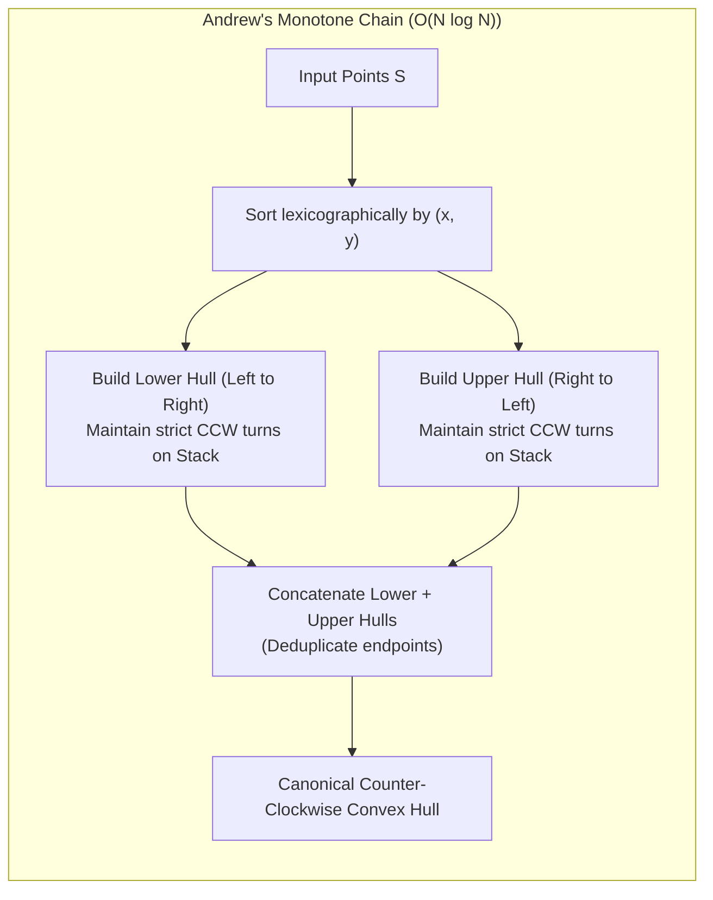
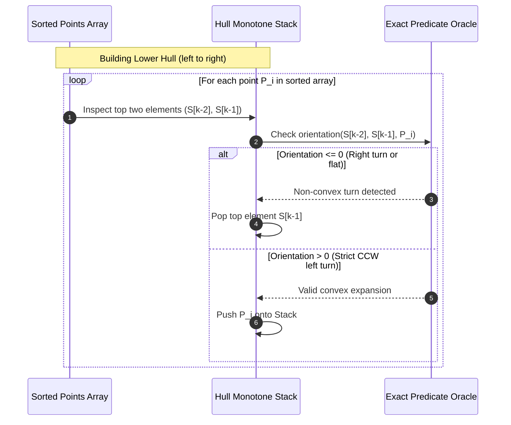

# Convex Hull: Andrew's Monotone Chain, Graham Scan, and Jarvis March

> [!NOTE]
> **The Convex Hull Problem:**
> Given a finite set of $N$ points $S = \{P_1, P_2, \dots, P_N\} \subset \mathbb{R}^2$, the **Convex Hull** $\mathcal{CH}(S)$ is the unique smallest convex polygon that encloses all points in $S$.
> Intuitively, imagine stretching an elastic rubber band around pins placed at all $N$ coordinates and releasing it: the shape assumed by the rubber band defines the perimeter of the convex hull.

> [!TIP]
> **Why Andrew's Monotone Chain Dominates Modern Engineering:**
> In classic literature, the **Graham Scan (1972)** is celebrated for achieving optimal $O(N \log N)$ time. However, Graham Scan requires sorting points by **polar angle** around a reference anchor point, which either requires transcendental functions (`std::atan2`) prone to floating-point drift, or complex custom cross-product comparators that struggle with collinear points.
> **Andrew's Monotone Chain (1979)** sorts points simply by standard Cartesian coordinates $(x, y)$, splits the hull into independent Lower and Upper hulls, and maintains them via a monotone stack using **100% exact integer cross products**.

> [!WARNING]
> **Collinear Edge Points: Strict vs Weak Hulls:**
> When multiple points lie on the boundary of the hull along a single straight line, two distinct definitions exist:
> 1. **Strict Convex Hull:** Contains only extremal corner vertices (turns are strictly left, popping collinear intermediate points).
> 2. **Weak Convex Hull:** Retains all points lying along the perimeter edges (turns are non-right).
> A production API must provide an explicit boolean flag (`include_collinear`) to govern this behavior without silently mutating the polygon topology.

---

## 1. Overview & Intuition

The convex hull is the foundational bounding primitive of computational geometry. If a geometric algorithm operates on complex shapes, computing the convex hull first drastically simplifies collision queries, diameter calculations, minimum enclosing circles, and half-plane intersections.

Key intuition:
- Any point strictly inside the hull can be safely discarded without affecting the boundary.
- The hull consists of two monotonic curves:
  1. The **Lower Hull**, running from the leftmost point to the rightmost point below the set.
  2. The **Upper Hull**, running from the rightmost point back to the leftmost point above the set.

---

## 2. Formal Definition & Mathematical Foundations

### 2.1 Mathematical Convexity
A set $C \subseteq \mathbb{R}^2$ is convex if for any two points $A, B \in C$, the line segment connecting them lies entirely within $C$:
$$\forall A, B \in C, \quad \forall \lambda \in [0, 1], \quad \lambda A + (1 - \lambda) B \in C$$

The convex hull $\mathcal{CH}(S)$ of a point set $S$ is the set of all convex combinations:
$$\mathcal{CH}(S) = \left\{ \sum_{i=1}^N \lambda_i P_i \;\middle|\; \lambda_i \ge 0, \sum_{i=1}^N \lambda_i = 1, P_i \in S \right\}$$

### 2.2 The Turn Invariant
For three ordered points $A, B, C$, let $\Delta(A, B, C) = (B_x - A_x)(C_y - A_y) - (B_y - A_y)(C_x - A_x)$ be the exact 2D cross product.
A sequence of vertices $V_0, V_1, \dots, V_{k-1}$ forms a valid counter-clockwise convex polygon if and only if every consecutive triplet $(V_{i-1}, V_i, V_{i+1})$ satisfies:
$$\Delta(V_{i-1}, V_i, V_{i+1}) > 0 \quad (\text{Strict Left Turn})$$
If $\Delta \le 0$, the vertex $V_i$ creates a reflex indentation or collinear flat edge and must be evicted from the convex hull stack.

---

## 3. Architecture & Core Mechanics

### 3.1 Andrew's Monotone Chain Step-by-Step
1. **Sort:** Order the unique points lexicographically: $P_i < P_j \iff (x_i < x_j) \lor (x_i = x_j \land y_i < y_j)$.
2. **Lower Hull Construction:**
   - Iterate from $i = 0$ to $N - 1$.
   - While the stack has at least 2 points and the last two points together with $P_i$ do not form a counter-clockwise turn ($\Delta \le 0$), pop the top of the stack.
   - Push $P_i$.
3. **Upper Hull Construction:**
   - Iterate backwards from $i = N - 2$ down to $0$.
   - While the stack has more points than the lower hull baseline and the turn is non-CCW ($\Delta \le 0$), pop the stack.
   - Push $P_i$.
4. **Finalization:** Pop the last element (which is a duplicate of $P_0$), yielding the counter-clockwise convex hull vertices.

### 3.2 Jarvis March (Gift Wrapping Oracle)
Jarvis March simulates wrapping a ribbon around the points:
- Find the leftmost point $P_0$ (guaranteed to be on the hull).
- Repeatedly select the next vertex $P_{\text{next}}$ such that for all candidate points $P_i$, the triplet $(P_{\text{current}}, P_{\text{next}}, P_i)$ forms a counter-clockwise boundary.
- Terminates when wrapping returns to $P_0$.
- Complexity is $O(N \cdot H)$, where $H$ is the output size. Serves as an ideal **differential test oracle**.

---

## 4. Operations & Invariants

| Component | State Invariant | Enforced By |
| :--- | :--- | :--- |
| **Lexicographical Sort** | $P_0 \le P_1 \le \dots \le P_{N-1}$ | `std::sort` on coordinate pairs |
| **Monotone Lower Stack** | Strictly increasing $x$, strictly CCW turns ($\Delta > 0$) | Stack back-tracking loop |
| **Monotone Upper Stack** | Strictly decreasing $x$, strictly CCW turns ($\Delta > 0$) | Stack back-tracking loop |
| **Polygon Boundary** | Minimal perimeter enclosing all points $S$ | Global convexity theorem |

---

## 5. Complexity Analysis

| Algorithm | Best Case | Average Case | Worst Case | Auxiliary Space |
| :--- | :--- | :--- | :--- | :--- |
| **Andrew's Monotone Chain** | $O(N \log N)$ | $O(N \log N)$ | $O(N \log N)$ | $O(N)$ |
| **Graham Scan** | $O(N \log N)$ | $O(N \log N)$ | $O(N \log N)$ | $O(N)$ |
| **Jarvis March (Gift Wrapping)** | $O(N)$ (if $H = 3$) | $O(N \cdot H)$ | $O(N^2)$ (if $H = N$) | $O(H)$ |
| **Chan's Algorithm** | $O(N)$ | $O(N \log H)$ | $O(N \log H)$ | $O(N)$ |

*Note: Sorting establishes the theoretical lower bound $\Omega(N \log N)$ for general planar convex hull algorithms under the algebraic decision tree model.*

---

## 6. Edge Cases & Failure Modes

> [!IMPORTANT]
> **Degenerate Point Sets:**
> - $N = 0$: Returns empty list.
> - $N = 1$: Returns single point.
> - $N = 2$: Returns line segment.
> - **All Collinear Points:** All points lie on a straight line. Andrew's Monotone Chain correctly collapses the hull into the two extreme endpoints (or all collinear points if `include_collinear = true`), never entering an infinite loop.

> [!CAUTION]
> **Duplicate Points:**
> Multiple points sharing identical coordinates $(x, y)$ can trigger false collinearity detections ($\Delta = 0$). Input arrays must always be deduplicated via `std::unique` before executing stack construction.

---

## 7. Two-Layer API Design & Reference Implementations

The implementation is partitioned into:
- **Layer 1:** Exact 128-bit cross products, orientation classification, squared Euclidean distance.
- **Layer 2:** `ConvexHullEngine` supporting:
  - `monotoneChain(points, include_collinear)`: Optimal production standard.
  - `jarvisMarch(points)`: Gift wrapping reference oracle.
  - `canonicalize(hull)`: Cyclic normalization for deterministic equivalence testing.

### C++17 Reference Implementation
The complete C++ implementation with rigorous unit and differential tests is available at:
[`implementations/cpp/convex_hull.cpp`](../../implementations/cpp/convex_hull.cpp)

### Python 3 Reference Implementation
The complete Python 3 implementation with `unittest.TestCase` is available at:
[`implementations/python/convex_hull.py`](../../implementations/python/convex_hull.py)

---

## 8. Step-by-Step Trace / Walkthrough

### Tracing Andrew's Monotone Chain on 5 Points:
Points: $P_0(0, 0), P_1(4, 0), P_2(4, 4), P_3(0, 4), P_4(2, 2)$ (Interior point)

1. **Sort Points:**
   Sorted: $(0, 0), (0, 4), (2, 2), (4, 0), (4, 4)$
2. **Build Lower Hull:**
   - Push $(0, 0)$. Stack: `[(0, 0)]`
   - Push $(0, 4)$. Stack: `[(0, 0), (0, 4)]`
   - Test $(2, 2)$: $(0, 0) \to (0, 4) \to (2, 2)$ has $\Delta = -8 < 0$ (CW right turn!).
     - Pop $(0, 4)$.
     - Push $(2, 2)$. Stack: `[(0, 0), (2, 2)]`
   - Test $(4, 0)$: $(0, 0) \to (2, 2) \to (4, 0)$ has $\Delta = -8 < 0$ (CW right turn!).
     - Pop $(2, 2)$.
     - Push $(4, 0)$. Stack: `[(0, 0), (4, 0)]`
   - Test $(4, 4)$: $(0, 0) \to (4, 0) \to (4, 4)$ has $\Delta = +16 > 0$ (CCW left turn).
     - Push $(4, 4)$.
   - Lower Hull complete: `[(0, 0), (4, 0), (4, 4)]`.
3. **Build Upper Hull:**
   - Iterate backward through $(4, 0), (2, 2), (0, 4), (0, 0)$.
   - $(2, 2)$ is popped when tested against $(0, 4)$.
   - Upper Hull complete: `[(4, 4), (0, 4), (0, 0)]`.
4. **Result:**
   Concatenation produces `[(0, 0), (4, 0), (4, 4), (0, 4)]`. The interior point $(2, 2)$ is cleanly evicted!

---

## 9. Comparative Trade-off Matrix

| Algorithm | Time Complexity | Implementation Complexity | Robustness to Drift | Best Suited For |
| :--- | :--- | :--- | :--- | :--- |
| **Andrew's Monotone Chain** | $O(N \log N)$ | Low ($\approx 40$ lines) | Maximum (Integer sorting) | **Universal production standard** |
| **Graham Scan** | $O(N \log N)$ | Moderate ($\approx 60$ lines) | Moderate (Polar angle sort) | Pedagogical classic |
| **Jarvis March** | $O(N \cdot H)$ | Low ($\approx 35$ lines) | Maximum | Very small $H$ ($H \ll \log N$) / Testing Oracle |
| **Quickhull** | $O(N \log N)$ avg / $O(N^2)$ worst | Moderate | Low (Floating-point line distances)| 3D Convex Hulls |
| **Chan's Algorithm** | $O(N \log H)$ | Very High ($\approx 250$ lines)| Moderate | Extreme theoretical optimization |

---

## 10. Differential Testing & Verification Strategy

The convex hull pipeline is validated via an automated differential harness:
1. **Jarvis March Oracle Testing:**
   - Generates hundreds of randomized point clouds across varying densities.
   - Andrew's Monotone Chain is executed against Jarvis March.
   - Vertices are canonicalized (rotated to start at the minimum lexicographical point).
   - The test asserts exact polygon vertex equivalence: `canonicalize(MC) == canonicalize(JM)`.
2. **Degeneracy Tests:**
   - Strictly collinear points on horizontal, vertical, and diagonal lines.
   - Concentric squares and nested polygons where only outer perimeters must survive.
   - Small inputs ($N = 0, 1, 2, 3$).

---

## 11. Real-World Applications & Production Context

- **Game Physics (Broad-Phase Collision):** Complex 3D character meshes are wrapped in convex hulls (using Quickhull / Monotone chain variants) to enable fast GJK (Gilbert-Johnson-Keerthi) collision detection.
- **GIS & Satellite Imagery:** Outlining forest fire perimeters, urban sprawl boundaries, and territorial claims from satellite coordinate telemetry.
- **Machine Learning (Support Vector Machines):** Hard-margin linear SVM classifiers find the maximum-margin hyperplane separating the convex hulls of two linearly separable point sets.
- **Image Processing:** Object recognition algorithms compute the convex deficiency (difference between convex hull and contour) to identify fingers on hands or defects in manufactured parts.

---

## 12. References & Further Reading

- Andrew, A. M. (1979). *Another Efficient Algorithm for Convex Hulls in Two Dimensions*. Information Processing Letters, 9(5), 216-219.
- Graham, R. L. (1972). *An Efficient Algorithm for Determining the Convex Hull of a Finite Planar Set*. Information Processing Letters, 1(4), 132-133.
- Jarvis, R. A. (1973). *On the Identification of the Convex Hull of a Finite Set of Points in the Plane*. Information Processing Letters, 2(1), 18-21.
- Chan, T. M. (1996). *Optimal Output-Sensitive Convex Hull Algorithms in Two and Three Dimensions*. Discrete & Computational Geometry, 16(4), 361-368.
