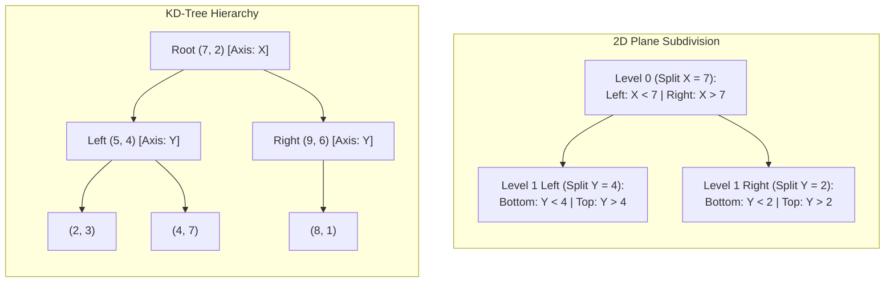
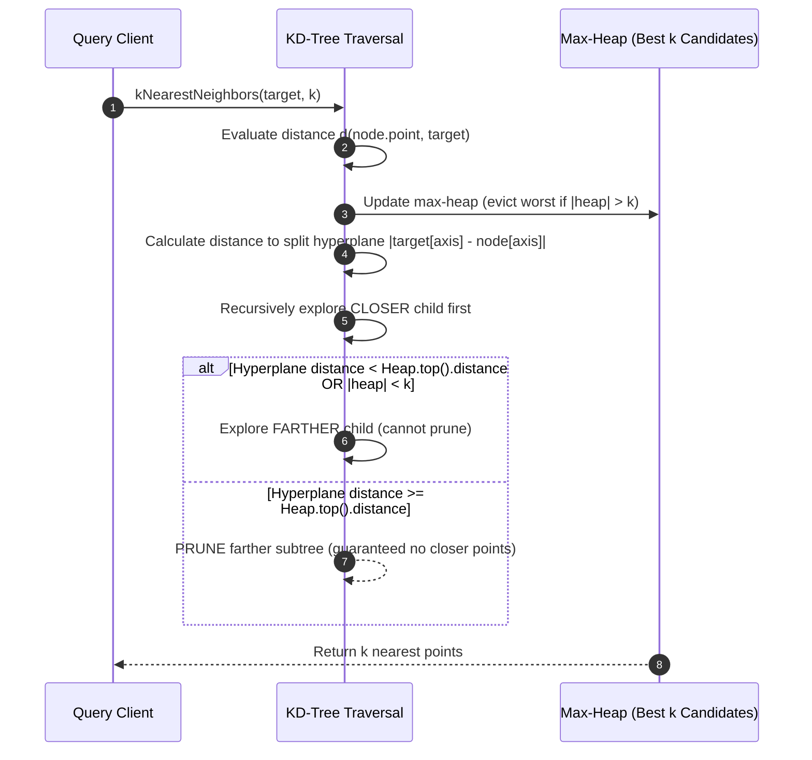

# KD-Trees: Multidimensional Space Partitioning and Nearest-Neighbor Search

> [!NOTE]
> **The Spatial Indexing Challenge:**
> A standard 1D Binary Search Tree (BST) organizes points along a single scalar dimension. In multidimensional space ($\mathbb{R}^k$), a point $(x, y, z)$ cannot be totally ordered without losing spatial neighborhood locality.
> Jon Bentley introduced the **$k$-d Tree ($k$-dimensional Tree, 1975)** to solve this: a binary space-partitioning tree where every level cycles through the coordinate axes, slicing space into hyper-rectangles with alternating hyperplanes.

> [!TIP]
> **Median-Splitting Guarantees O(N log N) Balanced Construction:**
> By selecting the median point along the active axis at each recursive step using **Quickselect (`std::nth_element`)** in $O(N)$ linear time, the resulting tree is strictly balanced with height $\lceil \log_2 N \rceil$:
> $$T(N) = 2T(N/2) + O(N) \implies O(N \log N)$$

> [!WARNING]
> **The Curse of Dimensionality ($k \ge 20$):**
> KD-trees excel when $N \gg 2^k$. For low dimensions ($k = 2, 3$), nearest-neighbor search executes in $O(\log N)$ average time.
> However, as dimension $k$ increases, the number of hyper-rectangle faces ($2^k$) rapidly outgrows $N$. In high dimensions (e.g. 128-dimensional embedding vectors in deep learning), the search ball intersects almost every partition, degrading nearest-neighbor search to exhaustive $O(N)$ linear scans. For high dimensions, approximate nearest-neighbor structures (HNSW, ScaNN, LSH) are preferred.

---

## 1. Overview & Intuition

Searching for data in two or three dimensions arises universally in robotics, game development, spatial databases, and physics simulations:
- Which restaurant is closest to my current GPS location? (Nearest Neighbor query)
- Which stars lie within a designated astronomical viewing rectangle? (Orthogonal Range query)
- Which particles could collide in the next physics tick? (Radius search)

A KD-tree organizes multidimensional points hierarchically. At each node:
1. One coordinate axis is selected (cycling $x \to y \to z \to x \dots$).
2. Space is split by a hyperplane passing through the node's point perpendicular to that axis.
3. Points with smaller coordinate values go to the left subtree; points with larger values go to the right subtree.

---

## 2. Formal Definition & Mathematical Foundations

### 2.1 Multidimensional Binary Space Partitioning
Let $P = \{p_1, p_2, \dots, p_N\}$ be a point set in $\mathbb{R}^k$.
At depth $d$ from the root, the discriminator axis is:
$$\text{axis} = d \pmod k$$
A node storing point $p^*$ divides the local bounding hyper-rectangle into two half-spaces:
$$\mathcal{H}_{\text{left}} = \{x \in \mathbb{R}^k \mid x_{\text{axis}} \le p^*_{\text{axis}}\}, \quad \mathcal{H}_{\text{right}} = \{x \in \mathbb{R}^k \mid x_{\text{axis}} > p^*_{\text{axis}}\}$$

### 2.2 Orthogonal Range Search Complexity (2D)
For an axis-aligned query box $B = [x_{\min}, x_{\max}] \times [y_{\min}, y_{\max}]$:
At every two levels of the tree, an axis-aligned line can intersect at most 2 of the 4 sub-regions.
The recurrence for the number of visited nodes in 2D is:
$$Q(N) = 2 Q(N/4) + O(1)$$
By the Master Theorem ($a = 2, b = 4, \log_4 2 = 1/2$):
$$Q(N) = O(\sqrt{N})$$
Adding the $K$ points reported inside the box yields total worst-case query time:
$$O(\sqrt{N} + K)$$
In general $k$ dimensions, range search worst-case time is $O(N^{1 - 1/k} + K)$.

---

## 3. Architecture & Core Mechanics

### 3.1 Branch-and-Bound Nearest Neighbor (k-NN)
To find the $k$ closest points to a target $Q$:
1. Maintain a **max-heap** of size at most $k$ storing the closest points discovered so far, keyed by squared Euclidean distance.
2. Traverse down the tree to the leaf node that would contain $Q$, updating the heap at each visited node.
3. When unwinding recursion, compute the distance from $Q$ to the node's splitting hyperplane:
   $$\Delta_{\text{plane}} = |Q_{\text{axis}} - P^*_{\text{axis}}|$$
4. **The Pruning Invariant:**
   If the heap contains $k$ points and $\Delta_{\text{plane}}^2 \ge \text{heap.top().dist\_sq}$, **the entire opposite subtree can be safely pruned**, because no point in that half-space could possibly be closer than the $k$-th best candidate already found!

---

## 4. Operations & Invariants

| Operation | Invariant Maintained | Algorithmic Mechanism |
| :--- | :--- | :--- |
| **`build(points)`** | Tree height $\le \lceil \log_2 N \rceil$, strict alternating axis splits | Median partition via `std::nth_element` |
| **`rangeSearch(box)`** | Reports exactly $\{p \in P \mid p \in \text{box}\}$ | Subtree bounding-box intersection pruning |
| **`kNearestNeighbors(Q, k)`** | Returns $k$ minimal distance points | Branch-and-bound with max-heap pruning |
| **Distance Invariant** | Exact comparison without square roots | Squared integer Euclidean metric |

---

## 5. Complexity Analysis

| Operation | 2D Average | 2D Worst Case | $k$-D Worst Case | Auxiliary Space |
| :--- | :--- | :--- | :--- | :--- |
| **Construction (Static)** | $O(N \log N)$ | $O(N \log N)$ | $O(k N \log N)$ | $O(N)$ |
| **Point Insertion (Dynamic)**| $O(\log N)$ | $O(N)$ (unbalanced)| $O(N)$ | $O(1)$ |
| **Range Search** | $O(\log N + K)$ | $O(\sqrt{N} + K)$ | $O(N^{1 - 1/k} + K)$ | $O(\log N)$ stack |
| **1-Nearest Neighbor** | $O(\log N)$ | $O(N)$ | $O(N)$ (if $k \gg 10$) | $O(\log N)$ stack |
| **$k$-Nearest Neighbors** | $O(k \log N)$ | $O(N + k \log k)$| $O(N + k \log k)$ | $O(k + \log N)$ |

---

## 6. Edge Cases & Failure Modes

> [!IMPORTANT]
> **Coincident Coordinates along the Splitting Axis:**
> When multiple points share the identical coordinate value along the active split axis (e.g. $p_1.x = p_2.x = 5$), naive comparisons using strict inequality ($<$) can misplace points during search.
> **Fix:** In our implementation, a secondary tie-breaker on unique point IDs (`a.id < b.id`) guarantees strict weak ordering during `std::nth_element` partitioning.

> [!CAUTION]
> **High-Dimensional Distance Saturation:**
> In spaces where $k > 15$, the ratio between the distance to the nearest point and the distance to the farthest point approaches 1 (Beyer et al., 1999). Pruning conditions rarely trigger, and KD-tree queries become slower than linear scans due to pointer chasing and cache misses.

---

## 7. Two-Layer API Design & Reference Implementations

The implementation separates the geometric space-partitioning primitives from the user-facing search engine:
- **Layer 1:** `KDNode`, alternating axis selection, bounding box intersection tests, exact squared distance metrics.
- **Layer 2:** `KDTree` class providing:
  - `build(points)`: Balanced median-split construction in $O(N \log N)$.
  - `rangeSearch(query_box)`: Orthogonal window queries with box pruning.
  - `kNearestNeighbors(target, k)`: Heap-driven branch-and-bound search.
  - `nearestNeighbor(target)`: Ergonomic 1-NN single point query.

### C++17 Reference Implementation
The complete C++ implementation with rigorous unit and differential tests is available at:
[`implementations/cpp/kd_trees.cpp`](../../implementations/cpp/kd_trees.cpp)

### Python 3 Reference Implementation
The complete Python 3 implementation with `unittest.TestCase` is available at:
[`implementations/python/kd_trees.py`](../../implementations/python/kd_trees.py)

---

## 8. Step-by-Step Trace / Walkthrough

### Tracing 1-NN Search on Target $Q(9, 2)$:
Points in tree: $(2, 3), (5, 4), (9, 6), (4, 7), (8, 1), (7, 2)$
Root: $(7, 2)$, split axis $X$.

1. **At Root $(7, 2)$:**
   - Distance squared to $Q(9, 2)$: $(9 - 7)^2 + (2 - 2)^2 = 4$. Best candidate = $(7, 2)$ with $d^2 = 4$.
   - Axis is $X$: $Q_x = 9 \ge \text{node}_x = 7$.
   - Closer child: **Right** (subspace $X \ge 7$).
2. **Descend to Right Child $(9, 6)$ [Split axis $Y$]:**
   - Distance squared to $Q(9, 2)$: $(9 - 9)^2 + (2 - 6)^2 = 16$.
   - Does not beat current best ($4 < 16$).
   - Axis is $Y$: $Q_y = 2 \le \text{node}_y = 6$.
   - Closer child: **Left** (subspace $Y \le 6$).
3. **Descend to Left Child $(8, 1)$ [Leaf]:**
   - Distance squared to $Q(9, 2)$: $(9 - 8)^2 + (2 - 1)^2 = 1 + 1 = 2$.
   - Beats current best! **New best candidate = $(8, 1)$ with $d^2 = 2$.**
4. **Unwind to $(9, 6)$:**
   - Distance from $Q$ to splitting line $Y = 6$: $|2 - 6| = 4 \implies \Delta^2 = 16$.
   - Pruning check: $\Delta^2 = 16 \ge \text{best}^2 = 2$.
   - **Prune right child of $(9, 6)$!**
5. **Unwind to Root $(7, 2)$:**
   - Distance from $Q$ to splitting line $X = 7$: $|9 - 7| = 2 \implies \Delta^2 = 4$.
   - Pruning check: $\Delta^2 = 4 \ge \text{best}^2 = 2$.
   - **Prune entire left subtree of Root ($X \le 7$)!**
6. **Result:** Exactly $(8, 1)$ returned in only 3 node visits.

---

## 9. Comparative Trade-off Matrix

| Spatial Index | Target Dimension | Search Time | Construction | Best Suited For |
| :--- | :--- | :--- | :--- | :--- |
| **KD-Tree** | Low ($k \le 10$) | $O(\log N)$ avg | $O(N \log N)$ | Static 2D/3D points, ray tracing |
| **Quadtree / Octree** | Fixed $k = 2, 3$ | $O(\log N)$ | $O(N \log N)$ | Spatial games, terrain rendering |
| **R-Tree** | Low to Medium | $O(\log_M N)$ | $O(N \log N)$ | Bounding boxes, GIS polygons |
| **Ball Tree** | Medium ($k \le 20$) | $O(\log N)$ avg | $O(N \log N)$ | Non-Euclidean metric spaces |
| **HNSW (Graph-based)**| High ($k \ge 50$) | $O(\log N)$ approx| $O(N \log N)$ | AI vector databases, embeddings |

---

## 10. Differential Testing & Verification Strategy

The KD-tree test suite runs automated differential trials against unindexed $O(N)$ linear scans:
1. **Range Search Oracle:**
   - Evaluates random axis-aligned bounding boxes against the KD-tree.
   - Compares the sorted list of matching IDs against exhaustive linear filter `[p for p in pts if box.contains(p)]`.
   - Asserts exact set equality.
2. **K-Nearest Neighbor Oracle:**
   - Evaluates random target queries with varying $k$.
   - Compares the squared distances of the returned $k$ points against an exhaustive linear sort of all pairwise distances.
   - Asserts that all returned points match the exact distance profile of the optimal $k$ candidates.

---

## 11. Real-World Applications & Production Context

- **Point Cloud Library (PCL) & Robotics:** LiDAR sensor point clouds contain hundreds of thousands of 3D points per frame; KD-trees compute surface normals and register point clouds via Iterative Closest Point (ICP).
- **Computer Graphics (Photon Mapping):** Photorealistic renderers store millions of scattered light photons in a 3D KD-tree to query local photon radiance density during global illumination passes.
- **Astronomy (Spatial Catalog Queries):** Cross-matching celestial objects between different telescope surveys (e.g. Gaia and Hubble datasets) by finding nearest angular neighbors.
- **Machine Learning (k-NN Classifiers):** Scikit-learn's `KDTree` provides the default accelerated search backbone for low-dimensional nearest-neighbor classifiers and kernel density estimation.

---

## 12. References & Further Reading

- Bentley, J. L. (1975). *Multidimensional Binary Search Trees Used for Associative Searching*. Communications of the ACM, 18(9), 509-517.
- Friedman, J. H., Bentley, J. L., & Finkel, R. A. (1977). *An Algorithm for Finding Best Matches in Logarithmic Expected Time*. ACM Transactions on Mathematical Software, 3(3), 209-226.
- de Berg, M., Cheong, O., van Kreveld, M., & Overmars, M. (2008). *Computational Geometry: Algorithms and Applications* (3rd ed.). Chapter 10: More Geometric Data Structures. Springer.
- Beyer, K., Goldstein, J., Ramakrishnan, R., & Shaft, U. (1999). *When Is "Nearest Neighbor" Meaningful?* International Conference on Database Theory (ICDT), 217-235.
