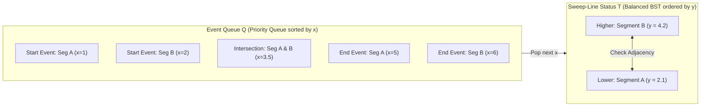

# Line Sweep and Segment Intersections: Shamos-Hoey and Bentley-Ottmann

> [!NOTE]
> **The Dimension Reduction Paradigm:**
> The **Line Sweep (Plane Sweep)** paradigm is one of the most powerful foundational techniques in computational geometry. It transforms a **2D static problem** into a **1D dynamic problem** by sweeping an imaginary vertical line $L$ across the Cartesian plane from left to right ($x = -\infty \to +\infty$).
> At any instant, the sweep line intersects a subset of geometric objects. By maintaining only the active objects intersecting $L$ in a dynamic search tree, we eliminate quadratic all-pairs comparisons:
> - Naive pairwise testing: $O(N^2)$
> - **Shamos-Hoey Intersection Detection (1976):** $O(N \log N)$
> - **Bentley-Ottmann All-Intersections Reporting (1979):** $O((N + K) \log N)$, where $K$ is the number of actual intersection points.

> [!TIP]
> **The Adjacency Invariant:**
> Two non-vertical segments $s_1$ and $s_2$ can intersect **only if** they are immediately adjacent in the vertical sweep-line status order at some sweep position $x$ immediately prior to the intersection point.
> Therefore, we only need to test pairs of segments that become newly adjacent in the sweep-line status!

> [!WARNING]
> **Vertical Line Degeneracy:**
> Vertical line segments have undefined or infinite slope ($x_1 = x_2$), meaning they do not intersect the sweep line at a single point; rather, they intersect over an entire continuous vertical interval $[y_1, y_2]$ at a single instant $x$.
> In production systems and VLSI routing engines, axis-aligned (orthogonal) problems are segregated into a specialized **Orthogonal Line Sweep** that uses 1D range queries on a Fenwick tree or balanced BST, entirely sidestepping floating-point slope divisions.

---

## 1. Overview & Intuition

In applications such as VLSI chip layout, geographic information systems (GIS), and computer-aided design (CAD), datasets frequently contain hundreds of thousands or millions of line segments ($N \ge 10^6$).
Testing all pairs of segments requires:
$$\binom{N}{2} = \frac{N(N - 1)}{2} \approx \frac{10^{12}}{2} = 5 \times 10^{11} \text{ operations}$$
This quadratic complexity is prohibitive for real-time systems. However, in physical layouts, the vast majority of segments are far apart and could never intersect. Furthermore, the number of actual intersection points $K$ is often sparse ($K \ll N^2$).

The **Line Sweep** algorithm achieves output-sensitive complexity $O((N + K) \log N)$ by exploiting spatial locality:
1. Segments are processed in order of their $x$-coordinates.
2. Only segments that currently cross the vertical sweep line $L$ are kept in memory (the **Sweep-Line Status** $T$).
3. Only segments that are vertical neighbors in $T$ are evaluated for intersections.

---

## 2. Formal Definition & Mathematical Foundations

### 2.1 Dual Data Structure Architecture

A line sweep algorithm coordinates two fundamental data structures:

1. **Event Queue ($Q$):**
   A priority queue storing discrete event points ordered primarily by $x$-coordinate, and secondarily by event type or $y$-coordinate.
   Events represent topological changes to the sweep-line status:
   - **Start Event ($p_1$):** A segment enters the sweep line.
   - **End Event ($p_2$):** A segment leaves the sweep line.
   - **Intersection Event ($p_{\text{int}}$):** Two active segments cross each other.

2. **Sweep-Line Status ($T$):**
   A self-balancing binary search tree (or `std::set`) storing the active segments intersecting line $L: X = x$.
   Segments are ordered vertically by their $y$-coordinate at the current sweep line position $x$:
   $$y(x) = y_1 + \frac{x - x_1}{x_2 - x_1} (y_2 - y_1)$$

### 2.2 The Shamos-Hoey Theorem

> **Theorem (Shamos & Hoey, 1976):**
> If a set of $N$ planar line segments contains at least one intersection, then there exists an event point at which two intersecting segments are consecutive neighbors in the sweep-line status $T$.

Because of this theorem, we do not need to discover all intersections simultaneously. By checking only the predecessor and successor in $T$ whenever a segment is inserted, and checking the new neighbors whenever a segment is deleted, any intersection is guaranteed to be detected before or at the moment the sweep line reaches it.

---

## 3. Architecture & Core Mechanics

```mermaid
sequenceDiagram
    autonumber
    participant Q as Event Queue (Priority Queue)
    participant L as Sweep Line Status (Balanced BST)
    participant O as Intersection Oracle / Reporter

    Note over Q,L: Sweep line advances to next Event E
    Q->>L: Pop Event E at sweep position x

    alt Event is START(s)
        L->>L: Insert s into Status T
        L->>O: Test s with Predecessor prev(s)
        L->>O: Test s with Successor next(s)
        opt Future intersection detected
            O->>Q: Enqueue INTERSECTION event
        end
    else Event is END(s)
        L->>O: Test prev(s) with next(s)
        L->>L: Erase s from Status T
        opt Future intersection detected
            O->>Q: Enqueue INTERSECTION event
        end
    else Event is INTERSECTION(s1, s2)
        O->>O: Report (s1, s2)
        L->>L: Swap order of s1 and s2 in Status T
        L->>O: Test swapped s1, s2 with new outer neighbors
    end
```

### 3.1 Orthogonal Plane Sweep (Axis-Aligned Segments)
When all segments are strictly horizontal or vertical (e.g., in VLSI design rules checking):
- **Horizontal Segments:** $y = \text{const}, x \in [x_1, x_2]$.
- **Vertical Segments:** $x = \text{const}, y \in [y_1, y_2]$.

Instead of evaluating floating-point slopes, the sweep line status simply maintains the active horizontal segments' $y$-coordinates in a 1D Fenwick tree or balanced BST:
1. `H_START` at $x_1$: Insert $y$ into BST.
2. `V_QUERY` at $x$: Perform a 1D range query for all active $y \in [y_1, y_2]$.
3. `H_END` at $x_2$: Erase $y$ from BST.

This executes in $O((N + K) \log N)$ using **100% exact integer coordinates**.

---

## 4. Operations & Invariants

| Component | State Invariant | Dynamic Update Cost |
| :--- | :--- | :--- |
| **Event Queue $Q$** | Min-heap ordered by $x$, then event type | $O(\log \|Q\|)$ per push / pop |
| **Status Tree $T$** | BST sorted by $y$-coordinate evaluated at current sweep $x$ | $O(\log \|T\|)$ per insert / erase / query |
| **Active Segments** | Segments in $T$ are strictly active: $p_1.x \le x \le p_2.x$ | Maintained by start/end events |
| **Pairwise Tests** | Only adjacent elements in $T$ are tested for intersection | $O(1)$ geometric tests per event |

---

## 5. Complexity Analysis

| Algorithm | Best Case | Average Case | Worst Case | Auxiliary Space |
| :--- | :--- | :--- | :--- | :--- |
| **Naive All-Pairs** | $O(N^2)$ | $O(N^2)$ | $O(N^2)$ | $O(1)$ |
| **Shamos-Hoey (Any Intersection)** | $O(1)$ (Early exit) | $O(N \log N)$ | $O(N \log N)$ | $O(N)$ |
| **Orthogonal Line Sweep** | $O(N \log N)$ | $O((N + K) \log N)$| $O((N + K) \log N)$| $O(N)$ |
| **Bentley-Ottmann (General)** | $O(N \log N)$ | $O((N + K) \log N)$| $O((N + K) \log N)$| $O(N + K)$ |

*Note: In the worst-case dense configuration where every segment crosses every other segment ($K = \binom{N}{2} \approx N^2$), Bentley-Ottmann runs in $O(N^2 \log N)$, which is slightly slower than naive $O(N^2)$ due to BST maintenance overhead. For sparse layouts ($K = O(N)$), it runs in optimal $O(N \log N)$.*

---

## 6. Edge Cases & Failure Modes

> [!IMPORTANT]
> **Coincident Event Ordering:**
> When multiple events share the exact same $x$-coordinate, the processing order is critical to avoid false positives or misses:
> 1. `START` events must be processed before `END` events if segments share an endpoint.
> 2. For orthogonal sweep: `H_START` must be processed before `V_QUERY`, which must be processed before `H_END`, ensuring endpoints touching vertical segments are properly detected.

> [!CAUTION]
> **Dynamic Status Comparator Consistency:**
> In general line sweep, the comparator in `std::set` invokes `eval_y(g_sweep_x)`. If two segments intersect at $x$, their vertical order flips.
> If the sweep line coordinate $g\_sweep\_x$ is updated without swapping the elements in the BST, the BST's binary search invariant is violated, causing undefined behavior or deadlocks.

---

## 7. Two-Layer API Design & Reference Implementations

The implementation separates low-level geometric predicates from high-level sweep engines:
- **Layer 1:** Exact 128-bit cross products, orientation testing, collinearity bounding-box predicates, and event definitions.
- **Layer 2:** `LineSweep` engine offering:
  - `hasAnyIntersection`: Shamos-Hoey $O(N \log N)$ boolean detector.
  - `findOrthogonalIntersections`: Fast, exact axis-aligned plane sweep.
  - `naiveAllIntersections`: $O(N^2)$ general oracle for differential verification.
  - `naiveOrthogonalIntersections`: $O(N^2)$ orthogonal oracle for verification.

### C++17 Reference Implementation
The complete C++ implementation with rigorous unit and differential tests is available at:
[`implementations/cpp/line_sweep.cpp`](../../implementations/cpp/line_sweep.cpp)

### Python 3 Reference Implementation
The complete Python 3 implementation with `unittest.TestCase` is available at:
[`implementations/python/line_sweep.py`](../../implementations/python/line_sweep.py)

---

## 8. Step-by-Step Trace / Walkthrough

### Tracing Orthogonal Sweep on 4 Segments:
- Seg 0: Vertical $x = 1, y \in [0, 4]$
- Seg 1: Vertical $x = 3, y \in [0, 4]$
- Seg 2: Horizontal $y = 1, x \in [0, 4]$
- Seg 3: Horizontal $y = 3, x \in [0, 4]$

1. **Generate Events:**
   - $x = 0$: `H_START(Seg 2, y=1)`, `H_START(Seg 3, y=3)`
   - $x = 1$: `V_QUERY(Seg 0, y in [0, 4])`
   - $x = 3$: `V_QUERY(Seg 1, y in [0, 4])`
   - $x = 4$: `H_END(Seg 2, y=1)`, `H_END(Seg 3, y=3)`

2. **Execution Steps:**
   - **$x = 0$:** Insert $y = 1$ and $y = 3$ into status tree: `active_y = {1, 3}`.
   - **$x = 1$:** Process `V_QUERY(Seg 0)`. Range query $[0, 4]$ on `active_y` matches $y = 1$ (Seg 2) and $y = 3$ (Seg 3).
     - Report intersections: `(0, 2)` and `(0, 3)`.
   - **$x = 3$:** Process `V_QUERY(Seg 1)`. Range query $[0, 4]$ on `active_y` matches $y = 1$ (Seg 2) and $y = 3$ (Seg 3).
     - Report intersections: `(1, 2)` and `(1, 3)`.
   - **$x = 4$:** Erase $y = 1$ and $y = 3$ from `active_y`. Tree becomes empty.

3. **Output:** Exactly 4 intersections reported in $O((N + K) \log N)$.

---

## 9. Comparative Trade-off Matrix

| Feature | Naive Pairwise Check | Shamos-Hoey | Orthogonal Line Sweep | Bentley-Ottmann (General) |
| :--- | :--- | :--- | :--- | :--- |
| **Time Complexity** | $O(N^2)$ | $O(N \log N)$ | $O((N + K) \log N)$ | $O((N + K) \log N)$ |
| **Memory Complexity** | $O(1)$ auxiliary | $O(N)$ | $O(N)$ | $O(N + K)$ |
| **Output Type** | All intersections | Boolean (Any) | All intersections | All intersections |
| **Coordinate Arithmetic**| Exact integer | Exact integer | Exact integer | Floating-point or exact rational |
| **Implementation Complexity** | Trivial ($\approx 15$ lines) | Moderate ($\approx 80$ lines) | Moderate ($\approx 70$ lines) | High ($\approx 250$ lines) |
| **Primary Domain** | Small $N < 2000$ | Quick rejection test | VLSI, GIS, PCB routing | General GIS, CAD modeling |

---

## 10. Differential Testing & Verification Strategy

The line sweep test harness employs a dual-oracle verification model:
1. **General Differential Oracle:**
   A brute-force $O(N^2)$ pairwise segment intersection loop (`naiveAllIntersections`).
   - Generates random 2D segments across positive and negative coordinate spaces.
   - Asserts that `hasAnyIntersection(segs) == (!naiveAllIntersections(segs).empty())`.
2. **Orthogonal Differential Oracle:**
   A specialized $O(N^2)$ bipartite checker (`naiveOrthogonalIntersections`).
   - Generates alternating sets of horizontal and vertical segments with overlapping coordinate spans.
   - Asserts exact set equality: `findOrthogonalIntersections(segs) == naiveOrthogonalIntersections(segs)`.
3. **Boundary & Degenerate Tests:**
   - Collinear overlapping segments.
   - Segments sharing a common vertex.
   - Parallel non-intersecting bundles.

---

## 11. Real-World Applications & Production Context

- **VLSI Layout Design Rule Checking (DRC):** Microchip lithography layouts contain billions of orthogonal metal wires. Line sweep verifies that minimum spacing rules are not violated without quadratic runtimes.
- **GIS Map Overlay & Clipping:** Combining road networks with river layers in PostGIS/QGIS requires finding all shared intersection points to build composite planar topological graphs.
- **Computer Graphics & Ray Tracing:** Ray-bundle sweep algorithms determine visibility ordering and polygon clipping against view frustums.
- **Robotics Path Planning:** Sweeping a polygon footprint along a motion trajectory detects dynamic collisions against environmental obstacles.

---

## 12. References & Further Reading

- Shamos, M. I., & Hoey, D. (1976). *Geometric Intersection Problems*. 17th Annual Symposium on Foundations of Computer Science (FOCS), 208-215.
- Bentley, J. L., & Ottmann, T. A. (1979). *Algorithms for Reporting and Counting Geometric Intersections*. IEEE Transactions on Computers, C-28(9), 643-647.
- de Berg, M., Cheong, O., van Kreveld, M., & Overmars, M. (2008). *Computational Geometry: Algorithms and Applications* (3rd ed.). Chapter 2: Line Segment Intersection. Springer.
- Preparata, F. P., & Shamos, M. I. (1985). *Computational Geometry: An Introduction*. Springer-Verlag.
