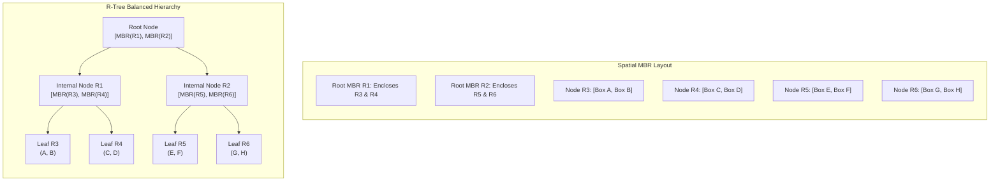
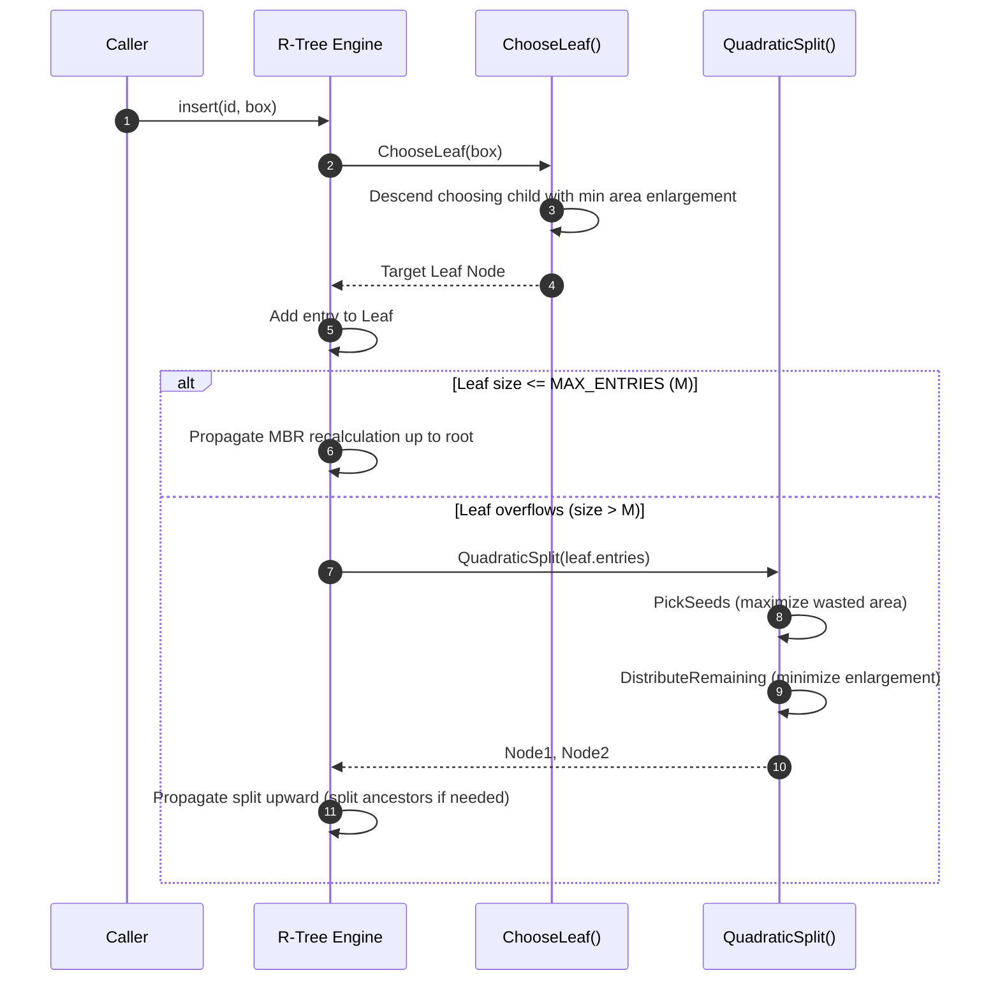

# R-Trees: Minimum Bounding Rectangles, Quadratic Split, and Spatial Indexing

> [!NOTE]
> **Indexing Non-Zero Extents:**
> Standard multidimensional trees (such as KD-trees) partition single points ($\mathbb{R}^k$). However, in Geographic Information Systems (GIS), Computer-Aided Design (CAD), and game collision engines, objects have **spatial extent**—polygons, lakes, country borders, roads, and 3D meshes.
> Antonin Guttman introduced the **R-Tree (1984)** as a height-balanced generalization of the B-Tree specifically designed to index spatial objects represented by their **Minimum Bounding Rectangles (MBR / AABB)**.

> [!TIP]
> **Guttman's Quadratic Split Invariant:**
> When an R-tree node overflows ($M + 1$ entries), **Guttman's Quadratic Split ($O(M^2)$)** partitions the entries into two groups:
> 1. **PickSeeds:** Finds the pair of entries that would waste the most dead space if placed into the same group:
>    $$\text{Waste}(E_1, E_2) = \text{Area}(\text{Enclosing}(E_1, E_2)) - \text{Area}(E_1) - \text{Area}(E_2)$$
> 2. **DistributeRemaining:** Greedily assigns the remaining entries to the group requiring the minimum area enlargement, prioritizing entries with the largest differential penalty $|d_1 - d_2|$.

> [!WARNING]
> **The Overlapping Region Consequence:**
> Unlike B-trees or KD-trees, sibling nodes in an R-tree **can spatially overlap**.
> Consequently, an overlap search query may need to descend into multiple branches simultaneously. In pathological configurations (e.g. dense overlapping bounding boxes), search time degrades from $O(\log_M N)$ to $O(N)$ linear scans. Production GIS engines (e.g. PostGIS) implement **R*-Tree heuristics** (Beckmann et al., 1990) to minimize overlap and margins.

---

## 1. Overview & Intuition

How can a spatial database quickly retrieve all roads, buildings, and parks that overlap a map viewport $[x_{\min}, x_{\max}] \times [y_{\min}, y_{\max}]$ without inspecting millions of geospatial records?

An R-Tree groups nearby geometric objects into Minimum Bounding Rectangles (MBRs) at leaf nodes. Sibling leaf nodes are aggregated into larger parent MBRs, forming a balanced hierarchy:
1. **Filtering:** If a query window does not intersect a parent MBR, **the entire subtree is pruned** in $O(1)$ time.
2. **Refinement:** Only leaf entries whose MBRs intersect the query window are returned for exact polygon-in-polygon verification.

---

## 2. Formal Definition & Mathematical Foundations

### 2.1 Minimum Bounding Rectangle (MBR)
In $\mathbb{R}^2$, an MBR is defined by coordinate intervals $[x_{\min}, x_{\max}] \times [y_{\min}, y_{\max}]$.
Given two rectangles $R_1 = [x_1, x_2] \times [y_1, y_2]$ and $R_2 = [x_3, x_4] \times [y_3, y_4]$:
- **Area:**
  $$\text{Area}(R) = (x_2 - x_1) \times (y_2 - y_1)$$
- **Enclosing Box (MBR Union):**
  $$\text{Enclosing}(R_1, R_2) = [\min(x_1, x_3), \max(x_2, x_4)] \times [\min(y_1, y_3), \max(y_2, y_4)]$$
- **Intersection Test:**
  $$R_1 \cap R_2 \neq \emptyset \iff \neg(x_2 < x_3 \lor x_1 > x_4 \lor y_2 < y_3 \lor y_1 > y_4)$$
- **Enlargement Penalty:**
  $$\Delta \text{Area}(R_1, R_2) = \text{Area}(\text{Enclosing}(R_1, R_2)) - \text{Area}(R_1)$$

### 2.2 Structural Invariants of an R-Tree
For order parameters $(m, M)$ where $m \le \lceil M / 2 \rceil$:
1. Every leaf node contains between $m$ and $M$ index records $(MBR, \text{item\_id})$, unless it is the root.
2. Every non-leaf node contains between $m$ and $M$ children $(MBR, \text{child\_ptr})$.
3. For each entry $(MBR, \text{child\_ptr})$, $MBR$ is the tightest bounding box covering all entries in the child's subtree.
4. The root node has at least 2 children unless it is a leaf.
5. All leaves appear at the identical depth (perfect height balance).

---

## 3. Architecture & Core Mechanics

---

## 4. Operations & Invariants

| Operation | Invariant Maintained | Algorithmic Mechanism |
| :--- | :--- | :--- |
| **`insert(id, box)`** | Height balance preserved, fill factor $\ge m$ | `ChooseLeaf` with minimal area expansion |
| **`quadraticSplit()`** | Partitions $M+1$ into two sets $\ge m$ | Greedy waste maximization & difference ordering |
| **`search(query_box)`** | Exact recall of all intersecting spatial items | Branch pruning via MBR intersection test |
| **MBR Tightness** | Ancestor MBR is always minimal union of children | Bottom-up MBR recalculation on update |

---

## 5. Complexity Analysis

| Operation | Best Case | Average Case | Worst Case | Auxiliary Space |
| :--- | :--- | :--- | :--- | :--- |
| **Search (Point Query)** | $O(\log_M N)$ | $O(\log_M N)$ | $O(N)$ (degenerate overlap) | $O(\log_M N)$ stack |
| **Search (Range Query)** | $O(\log_M N + K)$| $O(\log_M N + K)$| $O(N)$ | $O(\log_M N + K)$ |
| **Insertion** | $O(\log_M N)$ | $O(\log_M N)$ | $O(M \log_M N)$ | $O(\log_M N)$ stack |
| **Quadratic Split** | $O(M^2)$ | $O(M^2)$ | $O(M^2)$ | $O(M)$ |
| **Linear Split** | $O(M)$ | $O(M)$ | $O(M)$ | $O(M)$ |

---

## 6. Edge Cases & Failure Modes

> [!IMPORTANT]
> **Root Splitting and Tree Growth:**
> When the root node overflows, it splits into two distinct nodes. A new root is created containing two entries referencing the split halves. This is the **only** operation that increases tree height, guaranteeing that all leaves remain perfectly synchronized at the same depth.

> [!CAUTION]
> **Equal Expansion Ambiguity:**
> If an entry requires equal area enlargement when evaluated against both candidate split groups ($\Delta A_1 = \Delta A_2$), tie-breaking must assign the entry to the group with smaller current area (or fewer entries) to prevent lopsided node distributions.

---

## 7. Two-Layer API Design & Reference Implementations

The architecture is cleanly stratified:
- **Layer 1:** Geometric `Rect` operations (area, enclosing, intersection), `Node` representations, and Guttman's Quadratic Split.
- **Layer 2:** `RTree` engine offering:
  - `insert(id, box)`: Safe dynamic insertion with recursive split propagation.
  - `search(query_box)`: Spatial overlap filtering returning sorted IDs.
  - `size()` and `empty()` queries.

### C++17 Reference Implementation
The complete C++ implementation with rigorous unit and differential tests is available at:
[`implementations/cpp/r_trees.cpp`](../../implementations/cpp/r_trees.cpp)

### Python 3 Reference Implementation
The complete Python 3 implementation with `unittest.TestCase` is available at:
[`implementations/python/r_trees.py`](../../implementations/python/r_trees.py)

---

## 8. Step-by-Step Trace / Walkthrough

### Tracing Insertion and Split ($M = 4, m = 2$):
Suppose a leaf contains 4 rectangles:
- $E_1: [0, 2] \times [0, 2]$
- $E_2: [1, 3] \times [1, 3]$
- $E_3: [5, 7] \times [5, 7]$
- $E_4: [6, 8] \times [6, 8]$
A 5th rectangle $E_5: [0, 1] \times [0, 1]$ is inserted. The leaf overflows with 5 entries.

1. **PickSeeds:**
   - Enclosing $E_1$ and $E_4$: $[0, 8] \times [0, 8]$, Area $= 64$.
   - Waste $= 64 - 4 - 4 = 56$ (Maximum among all $\binom{5}{2} = 10$ pairs!).
   - Seed 1 = $E_1$ (Group 1 MBR = $[0, 2] \times [0, 2]$).
   - Seed 2 = $E_4$ (Group 2 MBR = $[6, 8] \times [6, 8]$).
2. **Distribute Remaining ($E_2, E_3, E_5$):**
   - $E_5 [0, 1] \times [0, 1]$ requires $\Delta A_1 = 0$ for Group 1, but $\Delta A_2 = 60$ for Group 2.
     - Difference $= 60$. Selected first $\implies$ Assigned to Group 1.
   - $E_3 [5, 7] \times [5, 7]$ requires $\Delta A_2 = 5$ for Group 2, but $\Delta A_1 = 45$ for Group 1.
     - Difference $= 40$. Selected second $\implies$ Assigned to Group 2.
   - $E_2 [1, 3] \times [1, 3]$ requires minimal enlargement in Group 1. Assigned to Group 1.
3. **Result:**
   - Group 1: $\{E_1, E_5, E_2\}$ (Clustered around $[0, 3] \times [0, 3]$).
   - Group 2: $\{E_4, E_3\}$ (Clustered around $[5, 8] \times [5, 8]$).
   - Both nodes satisfy minimum fill factor $m = 2$. Dead space is minimized!

---

## 9. Comparative Trade-off Matrix

| Spatial Index | Target Primitives | Split Heuristic | Node Overlap | Typical Domain |
| :--- | :--- | :--- | :--- | :--- |
| **Standard R-Tree** | Bounding Boxes | Guttman's Quadratic | Allowed | General spatial databases |
| **R*-Tree** | Bounding Boxes | Perimeter + Area + Forced Reinsert | Heavily Minimized | Production GIS (PostGIS, SQLite) |
| **KD-Tree** | Points only | Median Axis Split | Disjoint | Low-dimensional point queries |
| **Quadtree** | Points / Polygons | Fixed Regular Quad Split | Disjoint | Game maps, terrain quadmeshes |
| **Grid File** | Points / Rectangles| Fixed Grid Matrix | Disjoint | Uniform spatial distribution |

---

## 10. Differential Testing & Verification Strategy

The R-Tree verification harness evaluates spatial fidelity against a linear scan oracle:
1. **Random Spatial Generation:**
   - Rectangles with variable positions and extents distributed across 2D integer coordinates.
2. **Differential Comparison:**
   - Executes arbitrary rectangular window queries against the R-tree.
   - Compares the sorted matching IDs against the naive brute-force checker:
     $$\text{tree.search}(Q) == \text{naiveSearch}(\text{items}, Q)$$
3. **Split Stress Testing:**
   - Small node capacity ($M = 4$) forces continuous cascading splits up to root height 4.

---

## 11. Real-World Applications & Production Context

- **PostGIS & PostgreSQL (GiST Index):** Spatial bounding box indexes in PostGIS use R-tree variants (via Generalized Search Tree / GiST) to accelerate `ST_Intersects`, `ST_Contains`, and `ST_DWithin` SQL queries.
- **SQLite R\*Tree Module:** The built-in SQLite extension enables geospatial bounding box indexing for mobile and embedded mapping applications.
- **Game Physics Engines (Broad-Phase Collision):** Physics middleware (Bullet, Havok) uses dynamic bounding box trees (AABB Trees, structurally identical to R-trees) to quickly prune pairs of rigid bodies that cannot collide.
- **Computer-Aided Design (CAD / VLSI):** Semiconductor layout tools verify design rule checks by querying millions of overlapping circuit trace rectangles.

---

## 12. References & Further Reading

- Guttman, A. (1984). *R-Trees: A Dynamic Index Structure for Spatial Searching*. ACM SIGMOD International Conference on Management of Data, 47-57.
- Beckmann, N., Kriegel, H. P., Schneider, R., & Seeger, B. (1990). *The R\*-Tree: An Efficient and Robust Access Method for Points and Rectangles*. ACM SIGMOD Record, 19(2), 322-331.
- Manolopoulos, Y., Nanopoulos, A., Papadopoulos, A. N., & Theodoridis, Y. (2005). *R-Trees: Theory and Applications*. Springer Science & Business Media.
- Samet, H. (2006). *Foundations of Multidimensional and Metric Data Structures*. Morgan Kaufmann.
