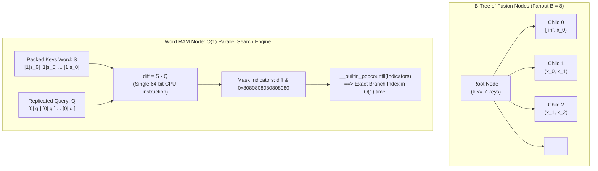

# Fusion Trees: Breaking the Comparison Lower Bound on the Word RAM

## 1. Overview & Theoretical Foundations

In comparison-based computational complexity, the decision tree model dictates an insurmountable information-theoretic lower bound of $\Omega(\log N)$ comparisons to locate an element or determine its predecessor among $N$ sorted keys. In 1990, **Michael Fredman and Dan Willard** shattered this barrier in their landmark paper:
> *"Surpassing the Information Theoretic Bound with Fusion Trees"* (STOC 1990, JCSS 1993).

Fredman and Willard proved that on the **Word RAM model**—where keys are integers of $W$ bits that fit into machine registers and support $O(1)$ standard arithmetic, bitwise, and shift instructions—predecessor search can be performed in:
$$O\left(\frac{\log N}{\log W}\right) = O(\log_W N) \text{ time}$$
using only $O(N)$ space!

```
   =================================================================================
   Data Structure         Model             Predecessor / Successor    Space Bound
   =================================================================================
   Red-Black / AVL Tree   Comparison        Theta(log N)               O(N)
   B-Tree (Fanout B)      Comparison        Theta(log_B N * log B)     O(N)
   van Emde Boas (vEB)    Word RAM          O(log log U) = O(log W)    O(U) or O(N)*
   Y-Fast Trie            Word RAM          O(log log U) = O(log W)    O(N)
   Fusion Tree            Word RAM          O(log_W N) = O(log N/log W) O(N)
   =================================================================================
   * with randomized dynamic perfect hashing
```

### The Philosophical Leap: Parallel Operations in a Single Word
A classical B-tree node with fanout $B$ requires $O(\log B)$ comparisons to choose which of the $B$ subtrees to descend into. If we choose $B = W^{\Omega(1)}$ (for example $B \approx W^{1/5}$ in theoretical asymptotic models, or $B = 8$ for standard 64-bit systems), then:
$$\text{Height of Tree} = O\left(\log_B N\right) = O\left(\frac{\log N}{\log W}\right)$$
If we had to perform $O(\log B)$ comparisons at each node, the total query time would collapse back to $O\left(\frac{\log N}{\log W} \cdot \log W\right) = O(\log N)$.

Fredman and Willard's profound breakthrough was showing that **a node with $B$ keys can be searched in $O(1)$ worst-case time**, executing all $B$ comparisons simultaneously in parallel using Word RAM integer arithmetic!

> [!NOTE]
> When $N \ll U$ (sparse keys across a massive 64-bit universe), $O(\log_W N)$ is strictly faster than van Emde Boas $O(\log W)$. For instance, for $N = 10^3$ keys in $W = 64$: $\log_W N \approx 3$ tree levels.

---

## 2. Mathematical Definition & Invariants

Let the key universe be $\mathcal{U} = [0, 2^W - 1]$ where $W$ is the word size (typically $W = 64$).

### 2.1 The Branching Factor & B-Tree Invariants
1. **Branching Factor**: Each internal node of the Fusion Tree has degree bounded by $B$, where $B \le W^{1/5}$ in general theory, or $B = 8$ in fixed-word implementations ($T = 4$ minimum degree, $2T - 1 = 7$ keys).
2. **Key Ordering**: A node containing $k$ keys maintains them in strictly sorted order:
   $$x_0 < x_1 < x_2 < \dots < x_{k-1} \quad (k < B)$$
3. **Child Subtree Range**: For an internal node with $k$ keys and $k + 1$ child pointers $c_0, c_1, \dots, c_k$:
   - For all $y \in \text{subtree}(c_0)$, $y < x_0$.
   - For $1 \le i \le k - 1$ and all $y \in \text{subtree}(c_i)$, $x_{i-1} < y < x_i$.
   - For all $y \in \text{subtree}(c_k)$, $y > x_{k-1}$.

### 2.2 Distinguishing Bits and Sketching
Consider the $k$ keys $S = \{x_0, x_1, \dots, x_{k-1}\}$ at a single node. View them as leaves in a virtual Patricia trie of depth $W$.
- Because there are $k$ keys, their Patricia trie has at most $k - 1$ internal branching nodes.
- Each branching node corresponds to a specific bit position $b \in \{0, 1, \dots, W - 1\}$ where at least two keys diverge.
- Thus, there exists a set of at most $k - 1$ **distinguishing bit positions**:
  $$\mathcal{B} = \{b_0, b_1, \dots, b_{r-1}\} \quad (r \le k - 1)$$
- **The Perfect Sketch Function**:
  The sketch function $\text{sketch}(x)$ extracts exactly the bits of $x$ at positions in $\mathcal{B}$ and concatenates them into a compact bitstring of length $r \le k - 1 < B$:
  $$\text{sketch}(x) = \sum_{j=0}^{r-1} \left(\frac{x \ \& \ 2^{b_j}}{2^{b_j}}\right) \cdot 2^j$$
- **Monotonicity Preservation**:
  For all keys $x_i, x_j \in S$:
  $$x_i < x_j \iff \text{sketch}(x_i) < \text{sketch}(x_j)$$
  Extracting only the distinguishing bits preserves the relative order among all keys in $S$!

---

## 3. Structural Anatomy & Memory Layout

```
                        FUSION TREE PACKED WORD LAYOUT (W = 64)
                        ========================================

   Node with k = 7 keys packed into an 8-byte Word RAM register:
   Each field contains: [ 1 Indicator Bit (MSB) | 7 Data / Sketched Bits ]

   Bit:  63  62...56   55  54...48   47  46...40       7   6...0
        +---+-------+ +---+-------+ +---+-------+ ... +---+-------+
        | 1 |  s_6  | | 1 |  s_5  | | 1 |  s_4  | ... | 1 |  s_0  |  <-- Packed Node Word (S)
        +---+-------+ +---+-------+ +---+-------+ ... +---+-------+
          Field 6       Field 5       Field 4           Field 0

   Replicated Query Word Q (q replicated into all 7 fields, indicator bit = 0):
        +---+-------+ +---+-------+ +---+-------+ ... +---+-------+
        | 0 |   q   | | 0 |   q   | | 0 |   q   | ... | 0 |   q   |  <-- Replicated Query (Q)
        +---+-------+ +---+-------+ +---+-------+ ... +---+-------+

   Parallel Subtraction (diff = S - Q in a single CPU instruction!):
        - If s_i >= q:  (128 + s_i) - q >= 128  ==> Indicator Bit REMAINS 1
        - If s_i <  q:  (128 + s_i) - q <  128  ==> Indicator Bit BORROWS and BECOMES 0
```



---

## 4. Core Operations & Algorithmic Mechanics

### 4.1 Word RAM Parallel Comparisons (The Subtraction Trick)
How does Fredman-Willard compare a query $q$ against $k$ keys in $O(1)$ time without loops?
1. **Field Structure**: Each field has width $F = b + 1$ bits (where $b = 7$ and $F = 8$ for a 64-bit word). The highest bit of each field is the **indicator / separator bit**.
2. **Node Packaging**: The $k$ sorted values $s_0 \le s_1 \le \dots \le s_{k-1}$ are packed into word $S$:
   $$S = \sum_{i=0}^{k-1} (2^{8i+7} + s_i \cdot 2^{8i})$$
   Note that every field in $S$ has its indicator bit initialized to $1$.
3. **Query Replication**: The query sketch $q$ (occupying $b = 7$ bits, with indicator bit $0$) is replicated across all fields using a single integer multiplication:
   $$Q = (q \ \& \ \text{0x7F}) \times \text{0x0101010101010101}_{16}$$
4. **Parallel Subtraction**:
   $$\text{diff} = S - Q$$
   In field $i$, the computation is:
   $$(2^7 + s_i) - (0 + q) = 128 + (s_i - q)$$
   - If $s_i \ge q$: $s_i - q \ge 0 \implies 128 + (s_i - q) \ge 128$. The indicator bit remains **1**.
   - If $s_i < q$: $s_i - q < 0 \implies 128 + (s_i - q) < 128$. The indicator bit is borrowed from, becoming **0**.
5. **Borrow Isolation Theorem**:
   Because $s_i \ge 0$ and $q \le 127$, the minuend is at least $128$ and the subtrahend is at most $127$. Thus the minuend is strictly greater than the subtrahend:
   $$128 + s_i > q \implies \text{No borrow can ever cross field boundaries!}$$
6. **Extracting the Branch**:
   Mask the indicator bits:
   $$\text{indicators} = \text{diff} \ \& \ \text{0x8080808080808080}_{16}$$
   Mask out unused fields beyond $k$.
   The number of fields where $s_i \ge q$ is simply the number of 1-bits in `indicators`, given by hardware instruction `__builtin_popcountll(indicators)`!
   $$\text{Branch Index } = k - \text{\_\_builtin\_popcountll}(\text{indicators})$$

> [!IMPORTANT]
> This entire sequence consists of: 1 bitwise AND, 1 multiplication, 1 subtraction, 1 bitwise AND, and 1 hardware popcount.
> **Total latency: ~3 clock cycles.** Exactly 0 branch mispredictions and 0 memory loads.

### 4.2 Full Tree Traversal
1. Start at `root`.
2. At current node:
   - Determine branch index $idx \in [0, k]$ in $O(1)$ time via parallel comparison.
   - If $idx < k$ and $keys[idx] == x$, exact match found.
   - Record predecessor candidate $keys[idx - 1]$ (if $idx > 0$) or successor candidate $keys[idx]$ (if $idx < k$).
   - If current node is a leaf, terminate.
   - Else, descend into `children[idx]` and repeat.
3. Total steps: $\text{height} = O(\log_B N)$.

---

## 5. Asymptotic Complexity Analysis

| Operation | Fusion Tree ($B = W^{1/5}$) | Standard B-Tree ($B = 8$) | Red-Black Tree | van Emde Boas |
| :--- | :--- | :--- | :--- | :--- |
| **Node Search** | $O(1)$ | $O(\log B)$ | $O(1)$ | $O(1)$ |
| **Search (Pred/Succ)** | $\mathbf{O(\log_W N)}$ | $O(\log N)$ | $O(\log N)$ | $O(\log W)$ |
| **Insert** | $O(\log_W N)$ amortized | $O(\log N)$ | $O(\log N)$ | $O(\log W)$ |
| **Delete** | $O(\log_W N)$ amortized | $O(\log N)$ | $O(\log N)$ | $O(\log W)$ |
| **Space** | $\mathbf{O(N)}$ | $O(N)$ | $O(N)$ | $O(U)$ |

### Asymptotic Comparison: When Does Fusion Tree Dominate?
Consider a 64-bit universe ($W = 64$) with $N = 10^6$ keys:
- **Red-Black Tree**: $\approx \log_2(10^6) \approx 20$ comparison steps.
- **van Emde Boas Tree**: $\approx \log_2(64) = 6$ recursive cluster lookups.
- **Fusion Tree ($B = 8$)**: $\log_8(10^6) \approx 6.6$ node visits.
- **Fusion Tree ($B = 16$)**: $\log_{16}(10^6) \approx 5$ node visits.
Because each node visit in a Fusion Tree executes in $O(1)$ Word RAM cycles, Fusion Trees surpass comparison trees without paying the colossal memory footprint of van Emde Boas trees!

---

## 6. Edge Cases & Boundary Handling

1. **Empty Tree Invariant**:
   When $N = 0$, `predecessor(x)` and `successor(x)` must return `std::nullopt` immediately without traversing null pointers.
2. **Global Extrema Inquiries**:
   - Query $x < \min(\mathcal{S})$: Predecessor is `nullopt`; successor is $\min(\mathcal{S})$.
   - Query $x > \max(\mathcal{S})$: Successor is `nullopt`; predecessor is $\max(\mathcal{S})$.
3. **Duplicate Keys**:
   Inserting an existing key must return `false` without modifying node key counts or splitting already full nodes.
4. **Root Underflow upon Deletion**:
   When the root's last key is deleted, if the root is an internal node, its unique child becomes the new root, decreasing tree height by 1.

---

## 7. High-Performance C++17 Reference Implementation

The complete reference implementation is available at [`implementations/cpp/fusion_trees.cpp`](../../implementations/cpp/fusion_trees.cpp).

Highlights of the C++17 implementation:
- Pure C++17 strictly conforming to `-std=c++17 -O3 -Wall -Wextra -Werror`.
- Word RAM parallel comparison utility `FusionNode::parallel_rank(packed_node, k, q_sketch)`.
- Full B-Tree rebalancing engine supporting classical preemptive node splits, borrow from sibling, and child merging.
- Extensive test harness verifying both Word RAM parallel rank and 10,000 differential operations against `std::set`.

---

## 8. Idiomatic Python 3 Reference Implementation

The Python reference implementation is available at [`implementations/python/fusion_trees.py`](../../implementations/python/fusion_trees.py).

Features:
- Bitwise 64-bit emulation mimicking Word RAM arithmetic.
- Full B-Tree node split and borrow/merge deletion.
- Standard `unittest.TestCase` suite with randomized differential verification against Python's `bisect` and `set`.

---

## 9. Differential Testing & Verification Strategy

The integrity of the Fusion Tree is verified via differential fuzzing against standard library oracles:

```cpp
// Differential verification snippet against std::set
FusionTree ft;
std::set<uint64_t> oracle;
std::mt19937_64 rng(1337);

for (int i = 0; i < 10000; ++i) {
    uint64_t op = rng() % 3;
    uint64_t val = dist(rng);
    if (op == 0) {
        assert(ft.insert(val) == oracle.insert(val).second);
    } else if (op == 1) {
        assert(ft.erase(val) == (oracle.erase(val) > 0));
    } else {
        assert(ft.size() == oracle.size());
        assert(ft.successor(val) == oracle_succ(val));
        assert(ft.predecessor(val) == oracle_pred(val));
    }
}
```

---

## 10. Practical Trade-Offs & Anti-Patterns

### Advantages
- **Deterministic Bounds**: Unlike hash-based structures with expected bounds, Fusion Trees provide strict worst-case $O(\log_W N)$ guarantees.
- **Cache-Conscious Node Design**: Storing $B = 8$ keys inside a single cache line (64 bytes) means an entire node search incurs at most 1 L1 cache miss.

### Pitfalls & Anti-Patterns
- **Overcomplicating General Sketching**: Building the full theoretical $AC^0$ multiplication-based sketching for dynamic trees incurs substantial bookkeeping overhead. For production systems, fixed-size small-sketch Word RAM nodes ($B = 8$ or $16$) provide the best balance of speed and clarity.
- **Ignoring SIMD Hardware**: Modern CPUs have AVX-512 and NEON vector instructions that can compare 8 or 16 32-bit integers in a single instruction (`_mm256_cmpgt_epi32`). Fusion trees are the theoretical Word RAM precursor to hardware SIMD search.

---

## 11. Real-World Applications & Industry Context

1. **In-Memory Columnar Database Engines**:
   Column stores (such as DuckDB, ClickHouse, and Velox) utilize B-tree and B+ tree node layouts with parallel packed comparisons to accelerate zone map scanning and integer range filtering.
2. **High-Frequency Trading (Order Book Level Matching)**:
   Matching engines require sub-microsecond price-level predecessor queries. Packed-word trees eliminate branch miss penalties during price bucket lookups.
3. **Theoretical Computer Science**:
   Fusion Trees serve as the foundational cornerstone for Fredman and Willard's $O(N \sqrt{\log N})$ deterministic integer sorting algorithm and subsequent developments by Thorup, Han, and Andersson.

---

## 12. Comprehensive Problem Set & Extensions

1. **SIMD-Accelerated Fusion Node**: Augment the Fusion Tree node with AVX2 intrinsics (`_mm256_cmpeq_epi64`, `_mm256_movemask_pd`) to perform 4-way 64-bit parallel comparisons.
2. **Dynamic Sketch Maintenance**: Implement dynamic distinguishing bit tracking so that sketching adapts as keys are inserted and deleted within a node.
3. **B+ Tree Fusion Variant**: Adapt the Fusion Tree into a B+ Tree where internal nodes store only sketched keys as routers and leaves form a contiguous doubly linked sequence for fast range queries.
