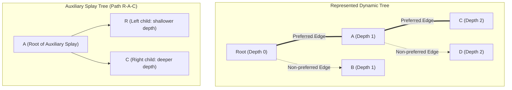
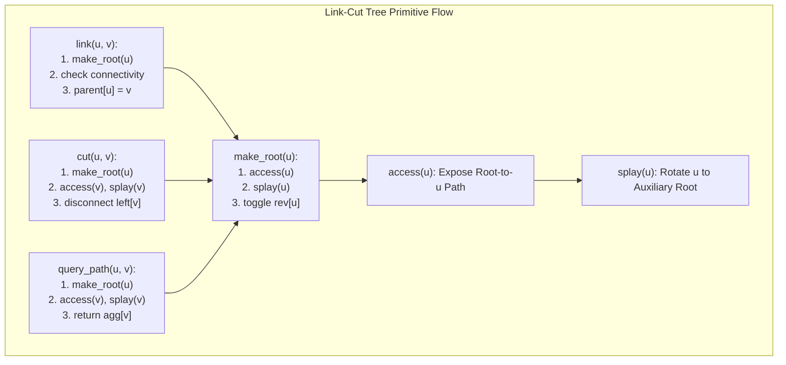

# Link-Cut Trees

> [!NOTE]
> **The Two-Layer Mental Model:**
> A **Link-Cut Tree (Sleator & Tarjan, 1983)** represents a dynamic forest of rooted trees subject to edge insertions (`link`), edge deletions (`cut`), and dynamic path queries.
> The key to understanding Link-Cut Trees is separating the **Represented Forest** from the **Auxiliary Splay Trees**:
> 1. **The Represented Forest:** The external dynamic forest of arbitrary trees being maintained.
> 2. **The Auxiliary Trees:** A collection of balanced splay trees, where each splay tree represents a single **preferred path** in the represented forest, keyed strictly by node **depth**.

> [!TIP]
> **The Power of `access(x)`:**
> Almost every Link-Cut Tree operation—`make_root`, `link`, `cut`, `lca`, and path queries—reduces to a sequence of calls to a single primitive: `access(x)`.
> `access(x)` restructures the auxiliary trees so that the path from the represented tree's root to $x$ becomes a single preferred path, with $x$ becoming the deepest node on that path.

> [!WARNING]
> **Auxiliary Root vs Represented Root:**
> A node $u$ is the **root of an auxiliary tree** if its parent pointer is null, OR if its parent does not recognize $u$ as a left or right child (`parent[u]->left != u && parent[u]->right != u`).
> In this case, `parent[u]` points to the **path-parent** in the represented tree.
> Conflating the auxiliary root with the represented tree root is the single most common implementation error in dynamic trees.

---

## 1. Core Mental Model & Motivation

Standard static tree techniques (such as Heavy-Light Decomposition or binary lifting) assume the tree topology is fixed. Preprocessing takes $O(N)$ or $O(N \log N)$ time, after which path queries take $O(\log N)$ or $O(\log^2 N)$ time.

However, in many systems and graph problems, the forest topology is **dynamic**:
- Edges are added (`link(u, v)`) connecting two trees into one.
- Edges are removed (`cut(u, v)`) splitting a tree into two disjoint components.
- Values on nodes or edges are updated dynamically.
- Path aggregates (e.g. path sum, min, max, XOR) must be queried in real time.

Sleator and Tarjan's **Link-Cut Tree** solves this in **$O(\log N)$ amortized time per operation**, matching the asymptotic power of static decomposition while supporting full topological mutation.

### The Preferred Path Decomposition
In any rooted tree, each vertex can designate at most one child edge as **preferred**:
- A **preferred child** of $u$ is the child most recently accessed in the subtree of $u$.
- Maximal chains of preferred edges form **preferred paths**.
- Every node in the represented forest belongs to **exactly one** preferred path.
- Each preferred path is stored in memory as an **Auxiliary Splay Tree**, ordered from left to right by increasing depth in the represented tree.

---

## 2. Mathematical Formulation & Structural Invariants

Let $T = (V, E)$ be the represented forest.

### Invariant 1: Inorder Depth Ordering
In each auxiliary splay tree:
- For every node $x$, all nodes in the left subtree of $x$ have strictly smaller depth in the represented tree than $x$.
- All nodes in the right subtree of $x$ have strictly greater depth in the represented tree than $x$.

### Invariant 2: Path-Parent Pointers
If node $u$ is the root of an auxiliary splay tree representing path $P$:
- `parent[u]` points to the predecessor of the shallowest node of $P$ in the represented tree (the **path-parent**).
- Critically, `parent[u]->left != u` and `parent[u]->right != u`.
- Non-root auxiliary nodes have symmetric parent-child relationships (`u->parent->left == u` or `u->parent->right == u`).

### Invariant 3: Lazy Path Reversal
When rerooting a tree at $x$ (`make_root(x)`), the depth order of the path from represented root to $x$ must be reversed. This is implemented via a boolean flag `rev`:
- When `rev` is true, the left and right subtrees must be swapped.
- `push_down(u)` propagates the `rev` bit to its children before any rotation or child traversal.

### Invariant 4: Aggregate Maintenance
Every auxiliary node maintains the aggregate (sum, min, max, or XOR) of all nodes in its auxiliary subtree.
`push_up(u)` recomputes `agg[u] = combine(agg[left], val[u], agg[right])` immediately following any child modification.

---

## 3. Detailed Architecture / Visual Diagram

---

## 4. Concrete Operations & Step-by-Step State Transitions

### 4.1 The Fundamental Primitive: `access(x)`
`access(x)` makes the path from the root of the represented tree down to node $x$ into a single preferred path:
1. `splay(x)`: Rotate $x$ to the root of its auxiliary tree.
2. Cut off $x$'s preferred right child (nodes deeper than $x$ on the old preferred path):
   `x->right = nullptr; push_up(x);`
3. While $x$ has a path-parent $p = x\text{->parent} \neq \text{nullptr}$:
   - `splay(p)`: Rotate $p$ to the root of its auxiliary tree.
   - Replace $p$'s right child with $x$:
     `p->right = x; push_up(p);`
   - `splay(x)`: Rotate $x$ to the root.
4. Upon completion, $x$ is the root of the auxiliary tree representing the entire root-to-$x$ path, and $x$ has no right child (as it is the deepest node).

### 4.2 `make_root(x)` (Evert)
To make $x$ the root of its represented tree:
1. `access(x)`: Expose the root-to-$x$ path.
2. `splay(x)`: $x$ is now the root of the auxiliary tree. In the represented tree, $x$ is the deepest node.
3. Toggle `rev[x]`: Reversing the auxiliary tree reverses the depth of every node on this path. Node $x$ now has depth 0, becoming the new represented tree root!

### 4.3 `link(x, y)`
To add an edge between represented trees containing $x$ and $y$:
1. `make_root(x)`.
2. Verify $x$ and $y$ are in different trees: if `find_root(y) == x`, return error/false (prevents cycle creation).
3. Set `x->parent = y`.

### 4.4 `cut(x, y)`
To remove the edge between adjacent nodes $x$ and $y$:
1. `make_root(x)`.
2. `access(y)`.
3. `splay(y)`.
4. Verify $x$ is directly connected to $y$:
   - In the auxiliary tree, $y$'s left child must be $x$ (`y->left == x`).
   - Node $x$ must have no right child (`x->right == nullptr`).
5. Disconnect: `y->left = nullptr; x->parent = nullptr; push_up(y);`.

---

## 5. Algorithmic Complexity Analysis

| Operation | Amortized Time | Worst-Case Time | Auxiliary Space |
| :--- | :--- | :--- | :--- |
| `access(u)` | $O(\log N)$ | $O(N)$ | $O(1)$ |
| `make_root(u)` | $O(\log N)$ | $O(N)$ | $O(1)$ |
| `find_root(u)` | $O(\log N)$ | $O(N)$ | $O(1)$ |
| `link(u, v)` | $O(\log N)$ | $O(N)$ | $O(1)$ |
| `cut(u, v)` | $O(\log N)$ | $O(N)$ | $O(1)$ |
| `query_path(u, v)`| $O(\log N)$ | $O(N)$ | $O(1)$ |

### Amortized Analysis Summary:
The potential function combines:
1. The standard splay tree potential $\Phi = \sum_{v \in V} \log(\text{size}(v))$.
2. Heavy-light edge accounting: an `access` changes preferred children at most $O(\log N)$ times along heavy edges, while light preferred child changes are paid for by the potential decrease.
3. Hence, all operations amortize to $O(\log N)$ time per operation.

---

## 6. High-Performance Engineering & Pointer-Less Indexing

Rather than allocating heap nodes (`new Node`), production Link-Cut Trees use **1-based flat array storage**:
- Index `0` acts as a dummy null sentinel: `tree[0].val = 0, tree[0].agg = 0, tree[0].sz = 0`.
- Memory locality: Node data (`ch[2]`, `p`, `val`, `agg`, `rev`) reside in a single contiguous `std::vector<Node>`.
- Zero pointer dereference overhead; fits cleanly into L1/L2 caches.

---

## 7. Edge Cases & Failure Modes

1. **Self-Links and Cycles:** Attempting to `link(u, v)` when $u$ and $v$ already belong to the same component creates cycles and corrupts the tree. Always check `find_root(u) == find_root(v)`.
2. **Cutting Non-Existent Edges:** Calling `cut(u, v)` on non-adjacent vertices. The invariant requires `y->left == x && x->right == 0` after `make_root(x); access(y); splay(y);`.
3. **Lazy Propagation Before Auxiliary Inspection:** Before inspecting children during `rotate` or splaying, the reversal tag must be propagated from the root down to the target node.

---

## 8. Reference Implementation Architecture

Both C++17 and Python 3 implementations implement Arthur's two-layer boundary design:
- **Layer A (Fast Core):**
  - `void link(int u, int v)` (precondition: $u$ and $v$ disconnected)
  - `void cut(int u, int v)` (precondition: edge $(u, v)$ exists)
  - `T query(int u, int v)`
- **Layer B (Safe Adapter):**
  - `bool try_link(int u, int v)`
  - `bool try_cut(int u, int v)`
  - `bool is_connected(int u, int v)`

---

## 9. Differential Testing & Oracle Verification Strategy

To guarantee absolute topological and path-aggregate correctness:
- A naive reference oracle maintains an explicit adjacency list of the forest.
- Reachability, path queries, and cycle detection are computed via standard BFS/DFS on the oracle.
- A randomized command generator executes thousands of interleaved `link`, `cut`, `query`, and `update` operations, verifying that Link-Cut Tree results match the oracle bit-for-bit.

---

## 10. Engineering Pitfalls & Optimization Notes

> [!CAUTION]
> **Pushing Down Along the Splay Path:**
> Before splaying node $x$, all ancestors of $x$ up to the root of the auxiliary tree **must be pushed down in top-down order**. Failing to push ancestor reversal flags before rotating causes inverted child pointers to be rotated into incorrect depth relationships.

> [!TIP]
> **Fast Stack Traversal for Ancestor Push-Down:**
> Instead of recursive ancestor calls, use an auxiliary integer buffer/stack to record ancestors from $x$ up to the auxiliary root, then flush them top-down in $O(\text{depth})$ steps before executing splay rotations.

---

## 11. Real-World Applications & Industry Context

1. **Dynamic Minimum Spanning Tree:** Maintaining the MST of a dynamic graph where edges are inserted or deleted (online Kruskal).
2. **Network Routing & Bottleneck Capacity:** Finding the minimum capacity pipe along dynamic transmission paths in computer networks.
3. **Maximum Flow via Dynamic Trees:** Sleator and Tarjan used Link-Cut Trees to accelerate the push-relabel and Dinic algorithms to $O(V E \log(V^2 / E))$.

---

## 12. Curated Academic References

1. **Sleator, Daniel D. & Tarjan, Robert E. (1983):** *A data structure for dynamic trees*. Journal of Computer and System Sciences, 26(3), pp. 362–391.
2. **Tarjan, Robert E. (1985):** *Amortized computational complexity*. SIAM Journal on Algebraic Discrete Methods, 6(2), pp. 306–318.
3. **Alstrup, Stephen, Holm, Jacob, de Lichtenberg, Kristian, & Thorup, Mikkel (2005):** *Maintaining information in fully dynamic trees with top trees*. ACM Transactions on Algorithms.
