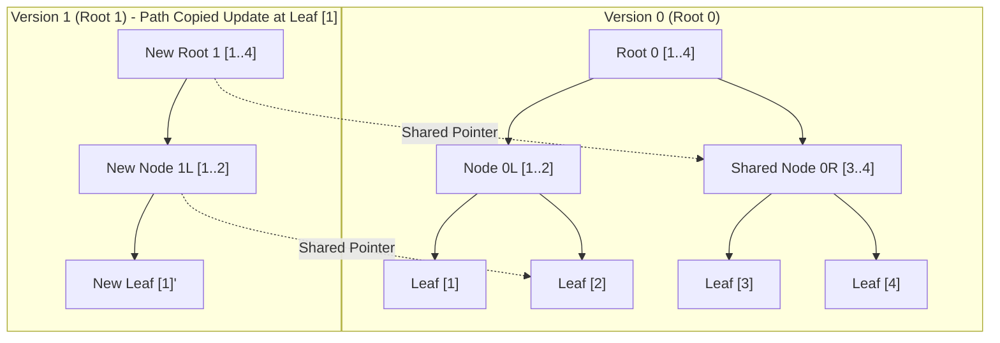
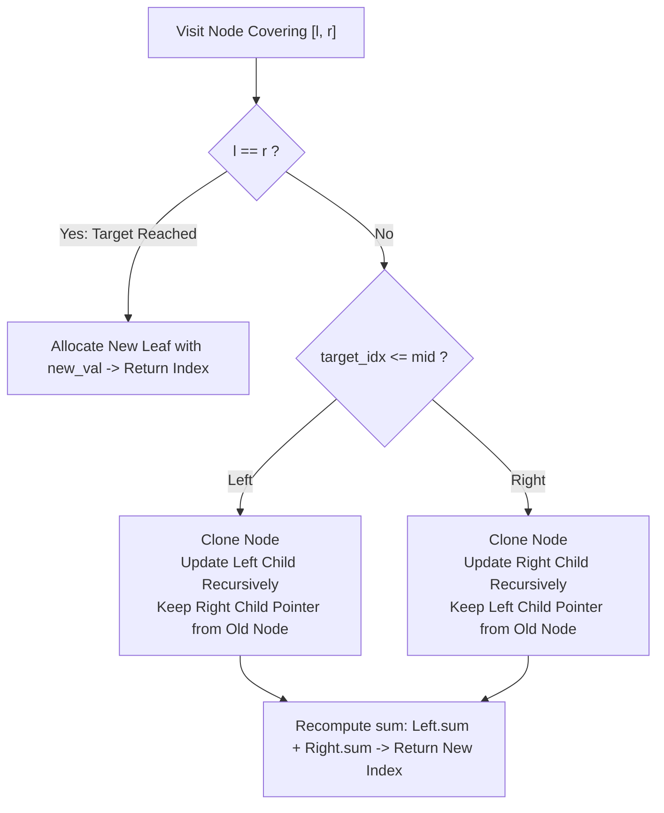

# Persistent Segment Trees and Path Copying

> [!NOTE]
> **The Paradigm of Ephemeral vs Persistent State:**
> Standard data structures are **ephemeral**: an update (such as `arr[idx] = val`) mutates the memory in place, destroying the previous state.
> A **persistent data structure** preserves all historical versions of itself when mutated:
> * **Partial Persistence:** Any historical version can be queried, but only the latest version can be updated.
> * **Full Persistence:** Any historical version can be both queried and branched into new versions.
> * **Confluent Persistence:** Two historical versions can be merged into a single composite version.

> [!TIP]
> **The Path Copying Principle:**
> Storing a full copy of an array of size $N$ after each of $Q$ updates requires catastrophic $O(Q \cdot N)$ memory.
> In a balanced tree (such as a Segment Tree), a single point update modifies exactly **one path of length $O(\log N)$ from the root down to the leaf**.
> **Path Copying** allocates new nodes *only along this path* while reusing (sharing) the pointers to all unmodified child subtrees:
> $$\text{Time per Update} = O(\log N), \quad \text{Memory per Update} = O(\log N) \text{ nodes}$$

> [!WARNING]
> **Node Immutability is Absolute:**
> The foundational invariant of persistent data structures is **strict node immutability**:
> *Once a node is allocated and initialized in the node pool, its fields (`left`, `right`, `aggregate`) must never be modified.*
> Any subsequent mutation that attempts to change a shared node will corrupt every historical version that references that subtree.



---

## 1. Mathematical Architecture & State Model

### 1.1 The Index-Based Node Pool
Rather than managing scattered heap nodes via raw pointers (`new`/`delete`), a production persistent segment tree maintains a contiguous **Index-Based Node Pool**:
```cpp
struct Node {
    int left_child;   // Index into node pool (0 indicates null/empty)
    int right_child;  // Index into node pool
    int64_t sum;      // Monoid aggregate
};

std::vector<Node> pool;
std::vector<int> version_roots; // version_roots[t] = root index for version t
```

### 1.2 Space Complexity Analysis
* **Initial Build:** Building the segment tree over $N$ base elements creates exactly $2N - 1$ nodes.
* **$Q$ Point Updates:** Each point update allocates exactly $\lceil \log_2 N \rceil + 1$ new nodes.
$$\text{Total Memory Footprint} = O(N + Q \log N) \text{ nodes}$$
For $N = 100,000$ and $Q = 100,000$:
$$\text{Total Nodes} \approx 200,000 + 100,000 \times 18 \approx 2,000,000 \text{ nodes} \approx 48\text{ MB of RAM}$$
This easily fits into L3 cache or modest application memory.

---

## 2. The Four Fundamental Invariants

1. **Version Completeness:** Each root index `version_roots[t]` represents an independent, fully queryable array version at time $t$.
2. **Node Immutability:** Once constructed, a node at `pool[idx]` is never mutated.
3. **Subtree Sharing:** If an update to version $t$ does not alter interval $[L, R]$, the new version shares the identical subtree index `pool[idx]` with version $t-1$.
4. **Logarithmic Path Bound:** An update creating version $t$ allocates strictly $\le \lfloor \log_2 N \rfloor + 2$ new nodes.

---

## 3. Core Operational Algorithms

### 3.1 Initial Tree Construction (`build`)
Recursively divides $[l, r]$, builds left and right subtrees, and allocates a parent node combining the two:
```cpp
int build(const std::vector<int>& arr, int l, int r) {
    int idx = allocate_node();
    if (l == r) {
        pool[idx].sum = arr[l];
        return idx;
    }
    int mid = (l + r) / 2;
    pool[idx].left_child = build(arr, l, mid);
    pool[idx].right_child = build(arr, mid + 1, r);
    pool[idx].sum = pool[pool[idx].left_child].sum + pool[pool[idx].right_child].sum;
    return idx;
}
```

### 3.2 Point Update with Path Copying (`update`)
Clones the visited node, recurses into the affected child, reuses the unaffected child, and returns the new node index:
```cpp
int update(int prev_node, int l, int r, int target_idx, int new_val) {
    int curr_node = allocate_node();
    pool[curr_node] = pool[prev_node]; // Clone previous node

    if (l == r) {
        pool[curr_node].sum = new_val;
        return curr_node;
    }

    int mid = (l + r) / 2;
    if (target_idx <= mid) {
        // Recurse into left child; share right child untouched!
        pool[curr_node].left_child = update(pool[prev_node].left_child, l, mid, target_idx, new_val);
    } else {
        // Recurse into right child; share left child untouched!
        pool[curr_node].right_child = update(pool[prev_node].right_child, mid + 1, r, target_idx, new_val);
    }

    pool[curr_node].sum = pool[pool[curr_node].left_child].sum + pool[pool[curr_node].right_child].sum;
    return curr_node;
}
```



---

## 4. Landmark Application: Range $K$-th Smallest Query (Chairman Tree)

A classic application of Persistent Segment Trees is answering:
*Given array $A[0 \dots N-1]$, what is the $K$-th smallest element in range $[L, R]$ in $O(\log N)$ time?*

### The Strategy:
1. Coordinate-compress all unique values in $A$ to $[0, U-1]$.
2. Build a persistent **frequency segment tree** over value space $[0, U-1]$.
3. Root $t$ represents the prefix multiset $A[0 \dots t]$.
4. The number of elements in range $[L, R]$ with values in $[v_a, v_b]$ is given by:
   $$\text{count} = \text{query}(\text{Root}_R, v_a, v_b) - \text{query}(\text{Root}_{L-1}, v_a, v_b)$$
5. To find the $K$-th smallest element, descend the two trees $\text{Root}_R$ and $\text{Root}_{L-1}$ simultaneously in $O(\log U)$ time:
   * If the left child count $\text{count}_{\text{left}} \ge K$, recurse into the left child.
   * Otherwise, recurse into the right child with $K' = K - \text{count}_{\text{left}}$.

---

## 5. Decision Matrix & Complexity Profile

| Operation | Time Complexity | Auxiliary Space per Operation |
| :--- | :--- | :--- |
| **Initial Build** | $O(N)$ | $2N - 1$ nodes |
| **Point Update (New Version)** | $O(\log N)$ | $\lceil \log_2 N \rceil + 1$ nodes |
| **Range Query on Version $t$** | $O(\log N)$ | $O(1)$ (Read-only traversal) |
| **Rollback to Version $t$** | $O(1)$ | $0$ (Just point active root to `version_roots[t]`) |
| **Range $K$-th Query** | $O(\log N)$ | $O(1)$ (Simultaneous dual-tree descent) |

---

## 6. Common Pitfalls & Anti-Patterns

### Anti-Pattern 1: In-Place Mutation of Shared Subtrees
Modifying `pool[idx].sum` after passing `idx` to an earlier version root. This subtly corrupts historical versions without raising compiler errors.

### Anti-Pattern 2: Dynamic Heap Allocation per Node
Using `new Node()` for each path-copied node. Heap fragmentation and pointer dereference penalties reduce throughput by $5\times - 10\times$. Always pre-reserve a contiguous `std::vector<Node>` pool.

### Anti-Pattern 3: Unbounded Version Memory Retention
Retaining thousands of transient versions that are never queried again. In production systems with lifetime limits, implement periodic compaction or reference-counting generational collection on version roots.

---

## 7. Curated References

1. **Driscoll, Sarnak, Sleator, Tarjan (1989):** *Making Data Structures Persistent*. Journal of Computer and System Sciences.
2. **Okasaki, Chris (1999):** *Purely Functional Data Structures*. Cambridge University Press.
3. **Spoj Classic MKTHNUM:** *K-th Number* (Canonical Persistent Segment Tree benchmark).
